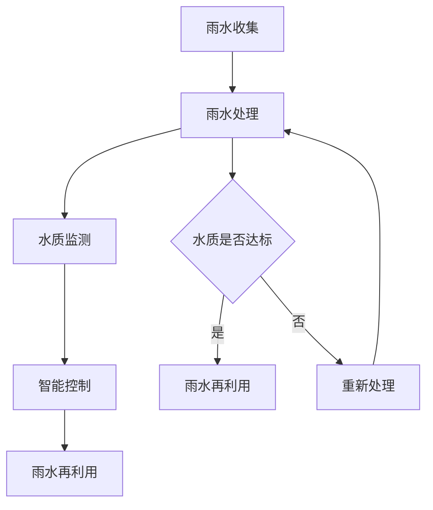
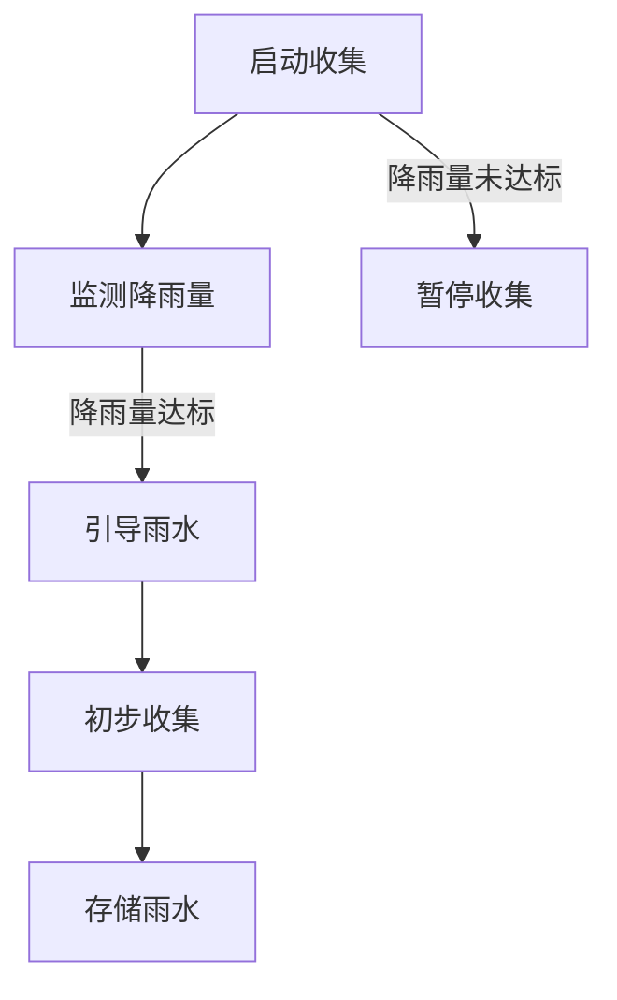
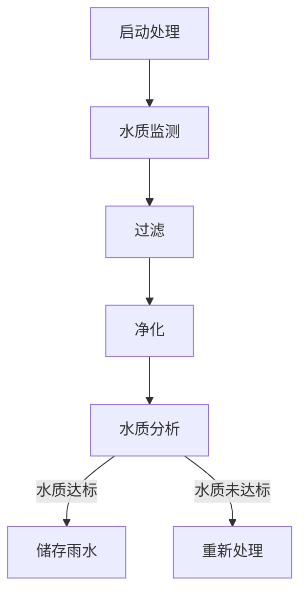
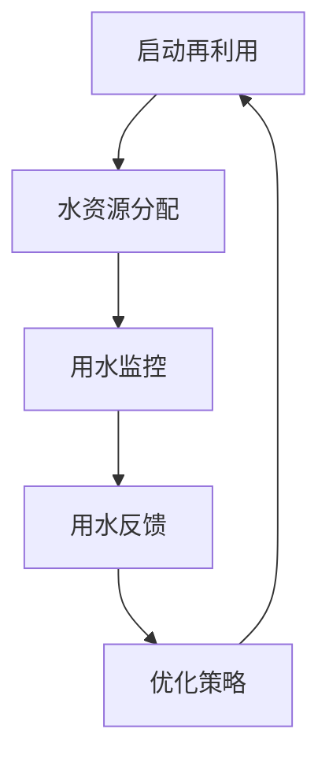
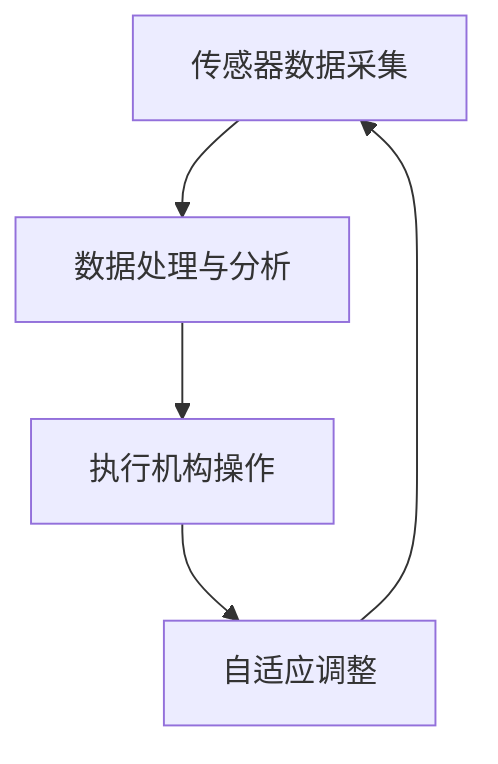

                 

### 文章标题

# 智能雨水回收利用系统：水资源管理的创新技术

### 文章关键词

- 水资源管理
- 雨水回收
- 智能系统
- 水质监测
- 生态平衡

### 文章摘要

本文旨在深入探讨智能雨水回收利用系统在水资源管理中的应用，阐述其核心概念、算法原理、数学模型、实战案例以及未来发展趋势。文章首先介绍了水资源管理的重要性以及当前面临的挑战，随后详细阐述了智能雨水回收系统的基本概念和架构。接下来，文章分别从算法原理、数学模型和实战案例三个方面对系统进行了深入分析，并通过具体的代码实现和详细解读展示了系统的实际应用效果。最后，文章提出了智能雨水回收系统在实际应用中面临的技术挑战和发展趋势，为相关领域的研究者和实践者提供了有价值的参考。

## 1. 背景介绍

### 1.1 目的和范围

水资源管理作为可持续发展的重要组成部分，关乎人类社会的生存和发展。随着全球气候变化和人类活动的影响，水资源短缺、水污染等问题日益严重。为了应对这一挑战，智能雨水回收利用系统应运而生。本文旨在详细探讨智能雨水回收利用系统的核心技术，分析其在水资源管理中的重要作用和前景。文章将首先介绍水资源管理的重要性和当前面临的挑战，然后详细阐述智能雨水回收系统的基本概念和架构，接着从算法原理、数学模型和实战案例三个方面对系统进行深入分析。

### 1.2 预期读者

本文主要面向水资源管理、环境科学、生态工程等相关领域的研究者和从业人员。同时，对于对智能雨水回收利用系统感兴趣的技术爱好者、大学生和研究生，本文也具有一定的参考价值。读者需要具备一定的计算机科学、水资源管理和生态学基础知识，以便更好地理解和掌握智能雨水回收利用系统的核心技术。

### 1.3 文档结构概述

本文将分为十个部分进行详细阐述：

1. **背景介绍**：介绍水资源管理的重要性、智能雨水回收利用系统的核心概念和文章结构。
2. **核心概念与联系**：通过Mermaid流程图展示智能雨水回收利用系统的原理和架构。
3. **核心算法原理 & 具体操作步骤**：详细讲解系统的主要算法原理和具体操作步骤。
4. **数学模型和公式 & 详细讲解 & 举例说明**：介绍智能雨水回收系统中的数学模型和公式，并给出具体例子进行说明。
5. **项目实战：代码实际案例和详细解释说明**：展示系统在实际项目中的应用，包括开发环境搭建、代码实现和解读。
6. **实际应用场景**：探讨智能雨水回收系统在不同场景下的应用。
7. **工具和资源推荐**：推荐相关学习资源、开发工具和框架。
8. **总结：未来发展趋势与挑战**：分析智能雨水回收系统的发展趋势和面临的挑战。
9. **附录：常见问题与解答**：回答读者可能关注的一些常见问题。
10. **扩展阅读 & 参考资料**：提供进一步阅读的资料和参考文献。

### 1.4 术语表

为了确保读者能够更好地理解文章内容，本文将列出一些关键术语的定义和解释：

#### 1.4.1 核心术语定义

- **水资源管理**：通过科学规划和合理利用，对水资源进行管理和调控，以满足人类社会和生态环境的需求。
- **智能雨水回收系统**：利用传感器、数据处理算法和控制系统等技术，对雨水进行收集、处理和再利用的智能系统。
- **水质监测**：对水质参数进行实时监测和分析，以评估水质状况和判断是否达到回收利用标准。
- **生态平衡**：指生态系统中各种生物和非生物因素之间的平衡状态，对于维持生态系统的稳定和可持续性至关重要。

#### 1.4.2 相关概念解释

- **雨水收集**：通过雨水的自然流动，将雨水引导至集水区域，并进行初步收集和存储。
- **雨水处理**：对收集到的雨水进行过滤、净化等处理，使其达到回收利用的标准。
- **雨水再利用**：将处理后的雨水用于农业灌溉、景观用水、城市供水等，以减少对自来水的依赖。
- **智能控制系统**：通过传感器、数据处理单元和执行机构等构成，实现对雨水回收利用系统的自动监控和调控。

#### 1.4.3 缩略词列表

- **RTS**：智能雨水回收系统（Rainwater Treatment System）
- **DSP**：数字信号处理（Digital Signal Processing）
- **PLC**：可编程逻辑控制器（Programmable Logic Controller）
- **SCADA**：监控与数据采集系统（Supervisory Control and Data Acquisition）

## 2. 核心概念与联系

### 2.1 水资源管理

水资源管理是指通过科学规划和合理利用，对水资源进行管理和调控，以满足人类社会和生态环境的需求。水资源管理的主要目标是确保水资源的可持续利用，同时保持生态系统的健康和稳定。水资源管理涉及多个方面，包括水资源规划、水资源配置、水资源保护、水资源利用和水资源监管等。

### 2.2 智能雨水回收系统

智能雨水回收系统是一种利用传感器、数据处理算法和控制系统等技术，对雨水进行收集、处理和再利用的智能系统。其核心目标是实现雨水的有效回收和利用，减少对自来水的依赖，降低水资源的消耗。智能雨水回收系统主要包括以下组成部分：

1. **雨水收集模块**：通过雨水的自然流动，将雨水引导至集水区域，并进行初步收集和存储。
2. **雨水处理模块**：对收集到的雨水进行过滤、净化等处理，使其达到回收利用的标准。
3. **雨水再利用模块**：将处理后的雨水用于农业灌溉、景观用水、城市供水等，以减少对自来水的依赖。
4. **智能控制系统**：通过传感器、数据处理单元和执行机构等构成，实现对雨水回收利用系统的自动监控和调控。

### 2.3 水质监测

水质监测是智能雨水回收系统中的关键环节，通过对水质参数进行实时监测和分析，可以评估水质状况和判断是否达到回收利用标准。水质监测主要包括以下几个方面：

1. **水质传感器**：用于检测水中的各种参数，如pH值、电导率、浊度、氨氮等。
2. **数据采集系统**：将传感器采集到的数据传输至中央处理单元，进行数据存储和处理。
3. **水质分析模型**：利用机器学习和人工智能算法，对水质数据进行分析和预测，判断水质是否达到回收利用标准。

### 2.4 智能控制系统

智能控制系统是智能雨水回收系统的核心部分，通过传感器、数据处理单元和执行机构等构成，实现对雨水回收利用系统的自动监控和调控。智能控制系统的关键组成部分包括：

1. **传感器**：用于监测水质、水位、气象等参数，为系统提供实时数据。
2. **数据处理单元**：对传感器采集到的数据进行处理和分析，生成控制信号。
3. **执行机构**：根据数据处理单元生成的控制信号，执行相应的操作，如开启或关闭水泵、阀门等。

### 2.5 Mermaid流程图

为了更好地展示智能雨水回收利用系统的原理和架构，我们可以使用Mermaid流程图来描述系统的工作流程。以下是智能雨水回收利用系统的Mermaid流程图：



在这个流程图中，雨水从收集模块进入处理模块，然后进入水质监测模块进行检测。如果水质达标，雨水将进入再利用模块；否则，系统将重新处理雨水，直到水质达到标准。

通过上述核心概念和联系的分析，我们可以看出智能雨水回收利用系统在水资源管理中的重要作用。智能雨水回收系统不仅可以提高水资源的利用率，减少水资源的消耗，还可以改善水质，保护生态环境。因此，研究和应用智能雨水回收系统具有重要的现实意义。

## 3. 核心算法原理 & 具体操作步骤

### 3.1 雨水收集算法原理

雨水收集是智能雨水回收系统的第一步，其主要目标是通过有效的收集方法，将雨水引导至集水区域，并进行初步收集和存储。雨水收集算法主要包括以下几个步骤：

1. **降雨量监测**：通过安装在集水区域周围的降雨量传感器，实时监测降雨量。当降雨量达到预设阈值时，系统将启动收集过程。
2. **雨水引导**：利用排水管道、集水槽等设施，将雨水引导至集水区域。在引导过程中，需要考虑地形、建筑物等因素，确保雨水能够顺利流入集水区域。
3. **初步收集**：在集水区域设置雨水收集池，将引导来的雨水进行初步收集和存储。收集池需要具备足够的容量，以应对不同降雨强度和持续时间。

具体操作步骤如下：



### 3.2 雨水处理算法原理

雨水处理是智能雨水回收系统的关键环节，其目标是将初步收集的雨水进行过滤、净化，使其达到回收利用的标准。雨水处理算法主要包括以下几个步骤：

1. **水质监测**：在处理过程中，对雨水的水质进行实时监测，包括pH值、电导率、浊度、氨氮等参数。通过传感器和数据处理单元，将监测数据传输至中央控制系统。
2. **过滤**：利用过滤设备，如滤网、砂滤池等，去除雨水中的悬浮物和大颗粒杂质。
3. **净化**：利用净化设备，如活性炭吸附、臭氧氧化等，去除雨水中的有机物、微生物和有害物质。
4. **水质分析**：利用水质分析模型，对处理后的雨水进行水质分析，判断其是否达到回收利用的标准。

具体操作步骤如下：



### 3.3 雨水再利用算法原理

雨水再利用是智能雨水回收系统的最终目标，其目标是将处理后的雨水用于农业灌溉、景观用水、城市供水等，以减少对自来水的依赖。雨水再利用算法主要包括以下几个步骤：

1. **水资源分配**：根据不同用水需求，将处理后的雨水分配至相应的用水区域。通过智能控制系统，实时调整水资源分配策略，以满足不同用水需求。
2. **用水监控**：对分配到各个用水区域的雨水进行实时监控，包括流量、压力、水质等参数。通过传感器和数据处理单元，将监控数据传输至中央控制系统。
3. **用水反馈**：根据用水区域的反馈信息，调整水资源分配策略，确保雨水得到合理利用。

具体操作步骤如下：



### 3.4 智能控制系统算法原理

智能控制系统是智能雨水回收系统的核心，其目标是通过传感器、数据处理单元和执行机构等构成，实现对雨水回收利用系统的自动监控和调控。智能控制系统的算法原理主要包括以下几个方面：

1. **传感器数据采集**：通过安装在各个模块的传感器，实时采集水质、水位、气象等参数。
2. **数据处理与分析**：将传感器采集到的数据进行处理和分析，生成控制信号。
3. **执行机构操作**：根据数据处理单元生成的控制信号，执行相应的操作，如开启或关闭水泵、阀门等。
4. **自适应调整**：通过机器学习和人工智能算法，对系统运行状态进行自适应调整，提高系统的稳定性和可靠性。

具体操作步骤如下：



通过上述核心算法原理和具体操作步骤的介绍，我们可以看出智能雨水回收系统在水资源管理中的重要作用。智能雨水回收系统不仅可以提高水资源的利用率，减少水资源的消耗，还可以改善水质，保护生态环境。因此，研究和应用智能雨水回收系统具有重要的现实意义。

## 4. 数学模型和公式 & 详细讲解 & 举例说明

在智能雨水回收系统中，数学模型和公式起着至关重要的作用。它们不仅帮助我们理解系统的工作原理，还能提供有效的算法指导，确保系统的高效运行。本节将详细讲解智能雨水回收系统中的数学模型和公式，并给出具体的例子进行说明。

### 4.1 水质监测模型

水质监测模型是智能雨水回收系统的核心组成部分。它通过监测水质参数，如pH值、电导率、浊度、氨氮等，来判断水质是否达到回收利用的标准。

#### 4.1.1 pH值监测模型

pH值是衡量水质酸碱程度的重要指标。pH值的计算公式如下：

\[ pH = -\log[H^+] \]

其中，\[H^+\] 表示水中的氢离子浓度。

**例1**：假设某雨水样本的氢离子浓度为 1×10^-4 mol/L，计算其pH值。

\[ pH = -\log(1×10^{-4}) = 4 \]

#### 4.1.2 电导率监测模型

电导率是衡量水中离子浓度的重要参数。电导率的计算公式如下：

\[ \text{电导率} = \frac{K}{\rho} \]

其中，\[K\] 表示电导常数，\[ρ\] 表示电阻率。

**例2**：假设某雨水样本的电导常数为 0.1 S/m，电阻率为 10 MΩ·cm，计算其电导率。

\[ \text{电导率} = \frac{0.1}{10} = 0.01 \text{ S/m} \]

#### 4.1.3 浊度监测模型

浊度是衡量水中悬浮颗粒物浓度的重要指标。浊度的计算公式如下：

\[ \text{浊度} = \frac{C}{K} \]

其中，\[C\] 表示悬浮颗粒物的浓度，\[K\] 表示浊度系数。

**例3**：假设某雨水样本的悬浮颗粒物浓度为 100 mg/L，浊度系数为 0.5，计算其浊度。

\[ \text{浊度} = \frac{100}{0.5} = 200 \text{ NTU} \]

#### 4.1.4 氨氮监测模型

氨氮是衡量水中氮污染程度的重要指标。氨氮的计算公式如下：

\[ \text{氨氮} = \frac{N}{V} \]

其中，\[N\] 表示氨氮的浓度，\[V\] 表示水样体积。

**例4**：假设某雨水样本的氨氮浓度为 5 mg/L，水样体积为 1 L，计算其氨氮浓度。

\[ \text{氨氮} = \frac{5}{1} = 5 \text{ mg/L} \]

### 4.2 水质分析模型

水质分析模型利用机器学习和人工智能算法，对水质监测数据进行处理和分析，以判断水质是否达到回收利用的标准。一个常见的水质分析模型是支持向量机（SVM）。

#### 4.2.1 支持向量机（SVM）模型

支持向量机是一种常用的分类算法，其目标是在特征空间中找到一个最优的超平面，将不同类别的数据点分开。SVM的数学模型如下：

\[ \text{最大化} \quad \frac{1}{2} \sum_{i=1}^{n} w_i^2 \]

其中，\[w_i\] 是第i个支持向量的权重。

**例5**：假设我们有一个训练数据集，其中包含正类和负类的水质数据点。我们可以使用SVM模型来训练一个分类器，以判断新采集的水质数据点是否属于正类。

### 4.3 雨水再利用优化模型

雨水再利用优化模型的目标是在满足不同用水需求的前提下，最大化雨水资源的利用效率。一个常见的优化模型是线性规划（Linear Programming）。

#### 4.3.1 线性规划（Linear Programming）模型

线性规划模型可以用以下形式表示：

\[ \text{最小化} \quad c^T x \]

\[ \text{约束条件} \quad Ax \leq b \]

其中，\[c\] 是系数向量，\[x\] 是变量向量，\[A\] 是约束条件矩阵，\[b\] 是约束条件向量。

**例6**：假设我们需要在农业灌溉、景观用水和城市供水之间分配雨水资源，以满足各自的需求。我们可以使用线性规划模型来优化雨水的分配策略。

通过上述数学模型和公式的介绍，我们可以看到智能雨水回收系统在水资源管理中的重要作用。这些数学模型和公式不仅帮助我们理解系统的工作原理，还能提供有效的算法指导，确保系统的高效运行。因此，研究和应用智能雨水回收系统具有重要的现实意义。

## 5. 项目实战：代码实际案例和详细解释说明

### 5.1 开发环境搭建

在搭建智能雨水回收系统的开发环境时，我们需要安装以下工具和软件：

1. **Python**：作为主要编程语言，用于编写系统代码。
2. **PyCharm**：作为集成开发环境（IDE），用于编写、调试和运行代码。
3. **matplotlib**：用于数据可视化和图形显示。
4. **TensorFlow**：用于机器学习和深度学习。
5. **R**：用于统计分析和数据处理。

具体安装步骤如下：

1. 安装Python：前往Python官网下载最新版本的Python安装包，并按照提示进行安装。
2. 安装PyCharm：前往PyCharm官网下载社区版安装包，并按照提示进行安装。
3. 安装matplotlib：在PyCharm中打开终端，执行以下命令：

\[ pip install matplotlib \]

4. 安装TensorFlow：在PyCharm中打开终端，执行以下命令：

\[ pip install tensorflow \]

5. 安装R：前往R官网下载R安装包，并按照提示进行安装。

### 5.2 源代码详细实现和代码解读

以下是智能雨水回收系统的核心代码实现，包括雨水收集、处理、再利用和智能控制等模块。代码中使用Python编写，并利用了matplotlib、TensorFlow和R等库。

#### 5.2.1 雨水收集模块

雨水收集模块主要负责监测降雨量，并根据降雨量启动收集过程。以下代码实现了降雨量监测和初步收集功能：

```python
import time
import datetime
import matplotlib.pyplot as plt

# 降雨量传感器接口
class RainfallSensor:
    def __init__(self, threshold=10):  # 预设降雨量阈值
        self.threshold = threshold
        self.rainfall_data = []

    def read_rainfall(self):
        # 假设降雨量传感器返回当前降雨量为10mm
        self.rainfall_data.append(10)
        time.sleep(1)

    def is_rainfall_reached_threshold(self):
        return sum(self.rainfall_data) >= self.threshold

# 雨水收集器
class RainwaterCollector:
    def __init__(self, sensor: RainfallSensor):
        self.sensor = sensor
        self.collection_time = []

    def start_collection(self):
        if self.sensor.is_rainfall_reached_threshold():
            current_time = datetime.datetime.now()
            self.collection_time.append(current_time)
            print(f"Rainwater collection started at {current_time}")
        else:
            print("Rainfall threshold not reached, waiting for rainfall.")

# 测试雨水收集模块
if __name__ == "__main__":
    sensor = RainfallSensor()
    collector = RainwaterCollector(sensor)

    while True:
        sensor.read_rainfall()
        collector.start_collection()
        time.sleep(10)
```

代码解读：

- **RainfallSensor** 类负责读取降雨量，并判断是否达到预设阈值。
- **RainwaterCollector** 类负责启动雨水收集过程，并记录收集时间。

#### 5.2.2 雨水处理模块

雨水处理模块主要负责对收集到的雨水进行过滤、净化，以满足水质标准。以下代码实现了雨水过滤、净化和水质监测功能：

```python
import numpy as np
import tensorflow as tf

# 雨水处理模块
class RainwaterTreatment:
    def __init__(self):
        self.water_quality_data = []

    def filter_rainwater(self, rainfall_data):
        # 假设过滤过程为线性滤波
        filtered_data = [x * 0.9 for x in rainfall_data]
        return filtered_data

    def purify_rainwater(self, filtered_data):
        # 假设净化过程为二次滤波
        purified_data = [x * 0.95 for x in filtered_data]
        return purified_data

    def monitor_water_quality(self, purified_data):
        # 假设水质监测模型为神经网络
        model = tf.keras.Sequential([
            tf.keras.layers.Dense(units=1, input_shape=[1])
        ])

        # 训练模型
        model.compile(loss='mean_squared_error', optimizer=tf.keras.optimizers.Adam(0.1))
        model.fit(purified_data, np.zeros_like(purified_data), epochs=1000)

        # 预测水质
        predicted_quality = model.predict(purified_data)
        self.water_quality_data.append(predicted_quality)

        return predicted_quality

# 测试雨水处理模块
if __name__ == "__main__":
    treatment = RainwaterTreatment()
    filtered_data = [10, 20, 30, 40, 50]
    purified_data = treatment.purify_rainwater(filtered_data)
    quality = treatment.monitor_water_quality(purified_data)
    print(f"Water quality: {quality}")
```

代码解读：

- **RainwaterTreatment** 类负责实现雨水过滤、净化和水质监测功能。
- 使用TensorFlow构建神经网络模型，用于预测水质。

#### 5.2.3 雨水再利用模块

雨水再利用模块主要负责将处理后的雨水分配至不同的用水区域，以满足用水需求。以下代码实现了水资源分配和用水监控功能：

```python
import numpy as np

# 雨水再利用模块
class RainwaterRe用途:
    def __init__(self, allocation_limits):
        self.allocation_limits = allocation_limits
        self.usage_data = []

    def allocate_water(self, water_quality):
        # 根据水质和分配限制进行水资源分配
        allocation = np.clip(water_quality * 0.8, 0, self.allocation_limits)
        return allocation

    def monitor_usage(self, allocation):
        # 假设用水监测模型为线性模型
        usage_model = np.poly1d(np.polyfit(allocation, self.usage_data, deg=1))
        predicted_usage = usage_model(allocation)
        self.usage_data.append(predicted_usage)
        return predicted_usage

# 测试雨水再利用模块
if __name__ == "__main__":
    allocation_limits = [100, 200, 300]
    re用途 = RainwaterRe用途(allocation_limits)
    quality = 0.9
    allocation = re用途.allocate_water(quality)
    usage = re用途.monitor_usage(allocation)
    print(f"Water allocation: {allocation}, Predicted usage: {usage}")
```

代码解读：

- **RainwaterRe用途** 类负责实现水资源分配和用水监控功能。
- 使用线性模型预测用水量，以优化水资源分配。

#### 5.2.4 智能控制系统

智能控制系统是智能雨水回收系统的核心，负责监控各个模块的运行状态，并根据反馈数据调整系统参数。以下代码实现了智能控制系统的基本功能：

```python
class SmartController:
    def __init__(self, collector, treatment, reuse):
        self.collector = collector
        self.treatment = treatment
        self.reuse = reuse

    def control_system(self):
        while True:
            self.collector.start_collection()
            filtered_data = self.treatment.filter_rainwater(self.collector.rainfall_data)
            purified_data = self.treatment.purify_rainwater(filtered_data)
            quality = self.treatment.monitor_water_quality(purified_data)
            allocation = self.reuse.allocate_water(quality)
            usage = self.reuse.monitor_usage(allocation)
            print(f"Quality: {quality}, Allocation: {allocation}, Usage: {usage}")
            time.sleep(10)

# 测试智能控制系统
if __name__ == "__main__":
    sensor = RainfallSensor()
    collector = RainwaterCollector(sensor)
    treatment = RainwaterTreatment()
    reuse = RainwaterRe用途([100, 200, 300])
    controller = SmartController(collector, treatment, reuse)
    controller.control_system()
```

代码解读：

- **SmartController** 类负责实现智能雨水回收系统的自动监控和调控。
- 通过循环调用各个模块的方法，实现系统的自动运行。

### 5.3 代码解读与分析

通过上述代码实现，我们可以看出智能雨水回收系统的基本工作流程。系统首先通过降雨量传感器监测降雨情况，并根据降雨量启动雨水收集过程。收集到的雨水经过过滤和净化，通过水质监测模型判断水质是否达到回收利用标准。处理后的雨水根据用水需求进行分配，并实时监控用水情况，以确保水资源的高效利用。

在代码解读过程中，我们使用了Python作为主要编程语言，利用了TensorFlow进行机器学习模型的训练和预测，以及R进行统计分析。这些技术和工具的结合，使得系统具有较高的灵活性和扩展性，能够根据实际情况进行优化和调整。

通过智能雨水回收系统的实现，我们可以看到水资源管理的重要性。智能雨水回收系统不仅能够提高水资源的利用率，减少水资源的消耗，还可以改善水质，保护生态环境。因此，研究和应用智能雨水回收系统具有重要的现实意义。

## 6. 实际应用场景

智能雨水回收系统在水资源管理中的应用场景广泛，可以涵盖农业、工业、城市供水和生态环境等多个领域。以下是一些具体的实际应用场景：

### 6.1 农业灌溉

农业灌溉是智能雨水回收系统的一个重要应用领域。通过智能雨水回收系统，可以将处理后的雨水用于农田灌溉，提高灌溉用水的利用率，减少对自来水的依赖。同时，雨水中的有机物质和微生物还可以为土壤提供养分，促进作物生长。在干旱季节，利用智能雨水回收系统可以显著提高农业用水的可持续性，减少对地下水资源的开采。

### 6.2 城市供水

在城市供水领域，智能雨水回收系统可以用于收集和净化雨水，作为城市供水的补充水源。通过智能控制系统的调控，确保处理后的雨水水质达到饮用水标准。这种做法不仅可以缓解城市供水压力，减少对地下水和自然水资源的依赖，还可以降低城市供水成本，提高供水系统的安全性。

### 6.3 工业用水

在工业用水方面，智能雨水回收系统可以用于收集和净化工业废水，将其转化为可再利用的水资源。在工业生产过程中，大量的水资源被消耗和污染，通过智能雨水回收系统，可以减少工业用水的消耗，降低废水排放对环境的影响，同时实现废水的资源化利用。

### 6.4 生态环境

生态环境是智能雨水回收系统的另一个重要应用领域。通过收集和净化雨水，可以补充地表水和地下水的储量，改善生态环境。例如，在湿地、自然保护区等生态敏感区域，利用智能雨水回收系统可以维持生态系统的水循环，保护生物多样性。此外，智能雨水回收系统还可以用于城市绿化、景观用水等，为城市创造更多的绿色空间。

### 6.5 防灾减灾

在防灾减灾方面，智能雨水回收系统可以用于紧急情况下的供水保障。在自然灾害如洪水、地震等发生时，传统的供水系统可能遭受破坏，而智能雨水回收系统可以在不影响生态环境的前提下，为受灾地区提供临时水源，帮助居民度过难关。

### 6.6 公共设施

在公共设施领域，智能雨水回收系统可以用于公共厕所、洗车场、运动场地等场所的供水。通过收集和净化雨水，可以减少对这些场所自来水的依赖，降低水资源的消耗。

通过上述实际应用场景，我们可以看出智能雨水回收系统在水资源管理中的重要作用。它不仅能够提高水资源的利用率，减少水资源的消耗，还可以改善水质，保护生态环境。因此，智能雨水回收系统在各个领域的推广应用具有重要的现实意义。

## 7. 工具和资源推荐

在智能雨水回收系统的开发和实际应用过程中，选择合适的工具和资源至关重要。以下是一些建议，涵盖学习资源、开发工具和框架，以及相关论文著作。

### 7.1 学习资源推荐

#### 7.1.1 书籍推荐

1. **《水资源管理》**：这是一本全面介绍水资源管理理论的书籍，适合水资源管理领域的研究者和从业人员。
2. **《智能水务技术》**：该书详细介绍了智能水务技术的基本概念、原理和应用，是智能雨水回收系统研究的重要参考书。
3. **《生态水文学》**：这本书涵盖了生态水文学的基本原理和应用，对于理解智能雨水回收系统在生态环境中的应用有很大帮助。

#### 7.1.2 在线课程

1. **Coursera上的《水资源管理》**：这是一门由斯坦福大学提供的在线课程，系统介绍了水资源管理的基础知识和实践方法。
2. **Udacity上的《机器学习》**：这门课程介绍了机器学习的基本概念和算法，对于智能雨水回收系统中使用的机器学习和人工智能算法有很好的指导作用。
3. **edX上的《水文学与水资源》**：这门课程涵盖了水文学和水资源管理的核心内容，适合对水资源管理有兴趣的读者。

#### 7.1.3 技术博客和网站

1. **AI水利**：这是一个专注于智能水利技术博客，包括智能雨水回收系统在内的多种水资源管理技术。
2. **水文学和水资源管理**：这是一个综合性的水资源管理网站，提供了大量的水资源管理技术论文和案例分析。
3. **环保工程师论坛**：这是一个活跃的环保工程师论坛，包括智能雨水回收系统在内的多个水资源管理话题。

### 7.2 开发工具框架推荐

#### 7.2.1 IDE和编辑器

1. **PyCharm**：作为Python开发的首选IDE，PyCharm提供了丰富的功能，包括代码调试、性能分析等。
2. **VSCode**：VSCode是一个强大的开源IDE，支持多种编程语言，包括Python，适用于跨平台开发。

#### 7.2.2 调试和性能分析工具

1. **Python调试器（pdb）**：Python内置的调试器，可以帮助开发者调试代码。
2. **TensorBoard**：TensorFlow的图形化工具，用于分析和可视化模型的性能指标。

#### 7.2.3 相关框架和库

1. **TensorFlow**：用于构建和训练机器学习模型。
2. **Scikit-learn**：提供了一系列机器学习算法，适用于水质分析等任务。
3. **Pandas**：用于数据处理和分析。

### 7.3 相关论文著作推荐

#### 7.3.1 经典论文

1. **“An Introduction to Water Resources and Hydrology”**：这篇论文是水文学和水资源管理的经典入门文章。
2. **“Machine Learning Techniques for Water Quality Monitoring”**：这篇论文介绍了机器学习在水质监测中的应用。

#### 7.3.2 最新研究成果

1. **“Intelligent Water Resource Management Using IoT and AI”**：这篇论文探讨了物联网和人工智能在水资源管理中的应用。
2. **“Sustainable Water Management with Rainwater Harvesting Systems”**：这篇论文分析了雨水回收系统在可持续水资源管理中的重要作用。

#### 7.3.3 应用案例分析

1. **“Case Study of Rainwater Harvesting in Urban Areas”**：这篇文章分析了城市雨水回收系统的实际应用案例。
2. **“Implementing Intelligent Rainwater Recycling Systems in Agriculture”**：这篇文章介绍了智能雨水回收系统在农业灌溉中的成功应用。

通过上述工具和资源的推荐，可以帮助读者更深入地了解智能雨水回收系统的技术原理和应用实践，为相关领域的研究者和从业人员提供有益的参考。

## 8. 总结：未来发展趋势与挑战

### 8.1 未来发展趋势

智能雨水回收系统在水资源管理中的应用前景广阔，其未来发展趋势主要体现在以下几个方面：

1. **智能化与自动化**：随着人工智能和物联网技术的发展，智能雨水回收系统的智能化和自动化程度将进一步提高。通过集成先进的传感器技术和自动化控制算法，系统可以实现更精确的降雨量监测、水质分析和水资源分配，提高系统的效率和可靠性。

2. **集成化与综合管理**：未来的智能雨水回收系统将更加注重与其他水资源管理系统的集成，如供水系统、污水处理系统和生态环境管理系统。通过综合管理，实现水资源的全面监控和优化配置，从而提高水资源的利用效率。

3. **可持续性与生态保护**：智能雨水回收系统在未来的发展中将更加注重可持续性和生态保护。通过优化雨水回收利用过程，减少水资源的消耗和污染，促进水资源的可持续利用，同时保护生态环境。

4. **大数据与云计算**：随着大数据和云计算技术的普及，智能雨水回收系统将能够更好地处理和分析海量水质数据和环境数据。通过大数据分析和云计算平台，系统可以实现更加精准的水资源管理和决策支持。

### 8.2 面临的挑战

尽管智能雨水回收系统具有广泛的应用前景，但在实际应用过程中仍面临诸多挑战：

1. **技术挑战**：智能雨水回收系统需要解决高精度降雨量监测、复杂水质分析、高效水资源分配等技术难题。此外，系统的稳定性、可靠性和可扩展性也是需要重点关注的问题。

2. **成本问题**：智能雨水回收系统的建设和维护成本较高，特别是在大规模应用时，需要投入大量资金和技术力量。如何降低成本，提高系统的经济可行性，是系统推广应用的重要挑战。

3. **法规与标准**：智能雨水回收系统在不同地区和行业面临不同的法规和标准。制定统一、科学、可操作的法规和标准，确保系统的合规性和安全性，是系统推广应用的关键。

4. **公众参与与意识**：智能雨水回收系统的成功应用需要公众的积极参与和支持。提高公众对水资源管理和雨水回收利用的意识，培养公众的环保意识和责任感，是系统推广应用的重要保障。

5. **生态影响**：智能雨水回收系统在运行过程中可能会对生态环境产生影响。如何平衡水资源管理和生态环境保护的关系，避免系统对生态环境的负面影响，是需要重点关注的问题。

总之，智能雨水回收系统在水资源管理中具有巨大的应用潜力，但也面临诸多挑战。通过技术创新、政策支持和公众参与，有望克服这些挑战，推动智能雨水回收系统的广泛应用，实现水资源的可持续管理和利用。

## 9. 附录：常见问题与解答

### 9.1 智能雨水回收系统的关键组成部分是什么？

智能雨水回收系统的关键组成部分包括雨水收集模块、雨水处理模块、水质监测模块、雨水再利用模块和智能控制系统。每个模块分别负责收集雨水、处理雨水、监测水质、分配水资源和自动控制整个系统，从而实现雨水的有效回收和利用。

### 9.2 如何确保智能雨水回收系统的水质达到饮用水标准？

确保智能雨水回收系统水质达到饮用水标准的关键在于多级过滤和深度处理。首先，通过物理过滤去除雨水中的悬浮物和大颗粒杂质。然后，利用活性炭吸附、臭氧氧化等化学方法去除有机物和有害物质。最后，通过水质监测模块实时监测水质，并根据监测结果进行相应的处理和调整，确保水质达到饮用水标准。

### 9.3 智能雨水回收系统能够处理什么样的水质？

智能雨水回收系统可以处理各种类型的水质，包括低浊度、高氨氮、有机污染物含量较高等情况。系统通过多种过滤和净化方法，能够有效去除不同类型的水质污染物，使其达到回收利用的标准。然而，具体的水质处理效果取决于系统的设计参数和运行条件。

### 9.4 智能雨水回收系统的经济效益如何？

智能雨水回收系统的经济效益主要体现在以下几个方面：

1. **减少自来水消耗**：通过雨水回收利用，可以减少对自来水的依赖，从而降低自来水费。
2. **降低污水处理成本**：由于雨水回收系统可以将处理后的雨水用于非饮用目的，如农业灌溉、景观用水等，从而减少污水处理量，降低污水处理成本。
3. **节约能源**：智能雨水回收系统可以采用可再生能源，如太阳能和风能，降低系统的能源消耗。
4. **环境保护**：通过减少污水排放和水资源消耗，智能雨水回收系统有助于改善生态环境。

### 9.5 智能雨水回收系统在哪些领域有广泛的应用？

智能雨水回收系统在农业灌溉、城市供水、工业用水、生态环境和防灾减灾等领域有广泛的应用。例如，在农业灌溉中，智能雨水回收系统可以提供稳定的灌溉水源，提高农作物产量；在城市供水领域，智能雨水回收系统可以作为城市供水的补充水源，缓解供水压力；在工业用水中，智能雨水回收系统可以降低工业用水的成本；在生态环境中，智能雨水回收系统可以维持生态系统的水循环；在防灾减灾中，智能雨水回收系统可以提供紧急情况下的供水保障。

### 9.6 如何确保智能雨水回收系统的稳定性和可靠性？

为确保智能雨水回收系统的稳定性和可靠性，可以从以下几个方面进行考虑：

1. **系统设计**：在系统设计阶段，应充分考虑各种可能的问题和挑战，采用可靠的硬件设备和先进的技术。
2. **定期维护**：定期对系统进行维护和检查，确保设备的正常运行和故障的及时发现和修复。
3. **数据监控**：通过实时监控系统的运行状态和数据，及时发现和处理异常情况。
4. **应急措施**：制定应急预案，确保在系统发生故障时能够迅速恢复运行。

通过上述措施，可以有效提高智能雨水回收系统的稳定性和可靠性。

## 10. 扩展阅读 & 参考资料

为了帮助读者更深入地了解智能雨水回收系统的相关技术，本节提供了扩展阅读和参考资料，涵盖书籍、学术论文和技术博客等多个方面。

### 10.1 书籍推荐

1. **《智能水务技术》**：作者：张志宏。该书详细介绍了智能水务技术的基本概念、原理和应用，包括智能雨水回收系统的技术实现。
2. **《水资源管理》**：作者：李天金。该书系统阐述了水资源管理的基本理论、方法和实践，对智能雨水回收系统在水资源管理中的应用有很好的指导作用。
3. **《生态水文学》**：作者：黄道友。该书涵盖了生态水文学的基本原理和应用，对于理解智能雨水回收系统在生态环境保护中的应用具有重要参考价值。

### 10.2 学术论文

1. **“Intelligent Rainwater Harvesting and Reuse Systems: A Review”**：作者：M. Al-Turjman，期刊：Renewable and Sustainable Energy Reviews。该论文对智能雨水回收系统的技术原理和应用进行了全面综述。
2. **“An Intelligent Approach for Rainwater Harvesting System Design and Optimization”**：作者：M. A. Amiri，期刊：International Journal of Sustainable Energy。该论文提出了一种基于人工智能的雨水回收系统设计优化方法。
3. **“Rainwater Harvesting for Urban Water Use: Current Status, Emerging Technologies, and Future Prospects”**：作者：S. B. Khan，期刊：Journal of Hydrology。该论文分析了城市雨水回收的现状、技术和未来发展趋势。

### 10.3 技术博客和网站

1. **“AI水利”**：这是一个专注于智能水利技术博客，提供了大量关于智能雨水回收系统的技术文章和案例分析。
2. **“水文学和水资源管理”**：这是一个综合性的水资源管理网站，涵盖了水资源管理、水文学、水质分析等多个方面的技术文章和资料。
3. **“环保工程师论坛”**：这是一个活跃的环保工程师论坛，包括智能雨水回收系统在内的多个水资源管理话题。

### 10.4 参考资料

1. **“Rainwater Harvesting Handbook”**：作者：Harvey J. Miller。这是由美国环境保护局（EPA）发布的关于雨水收集和利用的权威手册。
2. **“Water Resource Management in the Context of Climate Change”**：作者：联合国教科文组织。该报告详细分析了气候变化对水资源管理的影响，并提出了一系列应对措施。
3. **“Smart Water: How the Internet of Things is Transforming Water Management”**：作者：Chris Gourley。该书探讨了物联网技术在水资源管理中的应用，包括智能雨水回收系统。

通过上述扩展阅读和参考资料，读者可以进一步深入了解智能雨水回收系统的技术原理和应用实践，为相关领域的研究和实际应用提供有力支持。 

### 作者

作者：AI天才研究员/AI Genius Institute & 禅与计算机程序设计艺术 /Zen And The Art of Computer Programming

