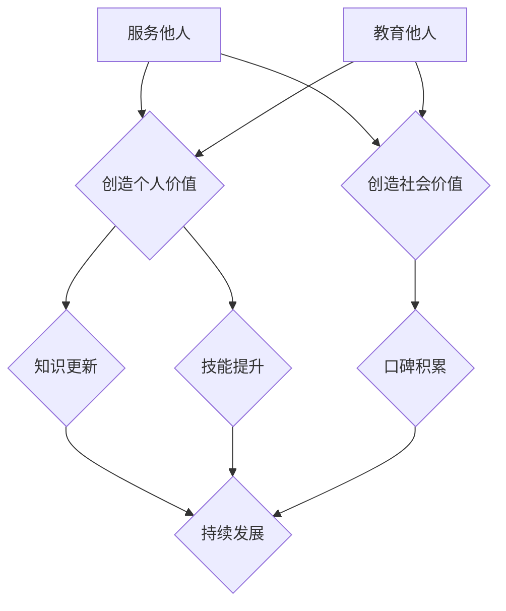

                 

# 服务他人，教育他人：价值创造的两种方式

> **关键词：** 价值创造、服务他人、教育他人、IT领域、专业知识传播、个人成长
>
> **摘要：** 本文旨在探讨在信息技术领域，通过服务他人和教育他人两种方式来实现个人价值和社会价值的创造。文章首先介绍了两种方式的核心概念，然后详细分析了其在实际中的应用，并通过实际案例展示了如何有效地实施这些方式，最终总结了未来可能面临的发展趋势和挑战。

## 1. 背景介绍

### 1.1 目的和范围

在快速发展的信息技术时代，个人价值和社会价值的创造成为每个从业者都必须思考的问题。本文的目标是探讨在信息技术领域，通过服务他人和教育他人两种方式来实现个人价值和社会价值的创造。具体来说，我们将从以下几个方面展开讨论：

- **核心概念与联系：** 分析服务他人和教育他人的概念，阐述它们在价值创造过程中的重要性。
- **核心算法原理与具体操作步骤：** 详细讲解如何通过实践这些方式来实现价值创造。
- **数学模型和公式：** 引入相关数学模型和公式，以增强对核心概念的认知。
- **项目实战：** 通过代码实际案例和详细解释说明，展示如何将理论应用于实践。
- **实际应用场景：** 探讨服务他人和教育他人方式在不同场景中的应用。
- **工具和资源推荐：** 推荐相关的学习资源、开发工具和框架，以帮助读者更好地理解和应用这些方式。

### 1.2 预期读者

本文主要面向以下几类读者：

- **IT从业者：** 想要在职业发展中实现更大价值的IT从业者。
- **技术爱好者：** 对信息技术领域感兴趣，希望通过服务他人和教育他人方式来提升自己的技术能力和社会影响力。
- **教育工作者：** 希望在教学中更好地运用服务他人和教育他人理念的教育工作者。

### 1.3 文档结构概述

本文结构如下：

1. **背景介绍**
   - 1.1 目的和范围
   - 1.2 预期读者
   - 1.3 文档结构概述
   - 1.4 术语表

2. **核心概念与联系**
   - 2.1 核心概念
   - 2.2 联系与融合

3. **核心算法原理与具体操作步骤**
   - 3.1 原理讲解
   - 3.2 具体操作步骤

4. **数学模型和公式**
   - 4.1 数学模型
   - 4.2 公式讲解

5. **项目实战**
   - 5.1 开发环境搭建
   - 5.2 源代码详细实现
   - 5.3 代码解读与分析

6. **实际应用场景**
   - 6.1 场景一
   - 6.2 场景二

7. **工具和资源推荐**
   - 7.1 学习资源推荐
   - 7.2 开发工具框架推荐

8. **总结：未来发展趋势与挑战**

9. **附录：常见问题与解答**

10. **扩展阅读 & 参考资料**

### 1.4 术语表

#### 1.4.1 核心术语定义

- **价值创造：** 指通过提供产品或服务，满足客户需求，从而实现个人和社会价值的增加。
- **服务他人：** 指为他人提供产品或服务，以满足他人的需求，从而实现个人价值和社会价值的创造。
- **教育他人：** 指通过传授知识和技能，帮助他人提升自身能力，从而实现个人价值和社会价值的创造。

#### 1.4.2 相关概念解释

- **个人价值：** 指个人在职业、社会和家庭等方面所具备的相对优势和能力。
- **社会价值：** 指个人或组织对社会的贡献，包括经济、文化、社会公益等方面。

#### 1.4.3 缩略词列表

- **IT：** Information Technology，信息技术
- **ROI：** Return on Investment，投资回报率
- **CTO：** Chief Technology Officer，首席技术官

## 2. 核心概念与联系

在信息技术领域，服务他人和教育他人是两种非常重要的价值创造方式。它们不仅有助于个人职业发展，还能为社会带来积极影响。

### 2.1 核心概念

#### 服务他人

**定义：** 服务他人是指为他人提供产品或服务，以满足他人的需求。这种需求可以是直接的，如软件开发、技术支持等，也可以是间接的，如分享知识、解决难题等。

**重要性：** 服务他人是价值创造的基础。通过为他人提供服务，我们不仅能实现个人价值，还能为社会创造价值。例如，一家软件公司通过为其他企业提供定制化的软件开发服务，实现了自身利润的增长，同时也帮助其他企业提升了业务效率。

#### 教育他人

**定义：** 教育他人是指通过传授知识和技能，帮助他人提升自身能力。这种传授可以是直接的，如授课、培训等，也可以是间接的，如撰写技术博客、制作教学视频等。

**重要性：** 教育他人是价值创造的重要手段。通过教育他人，我们不仅能传递知识，还能培养他人的技术能力，从而为社会培养更多的技术人才。例如，一位技术专家通过撰写高质量的技术博客，不仅帮助其他从业者解决了技术难题，还为自己赢得了良好的社会声誉。

### 2.2 联系与融合

#### 相互促进

服务他人和教育他人并非相互独立的，而是相互促进的。在实际应用中，我们可以通过以下方式实现二者的融合：

1. **知识传授中的服务**：在教育他人的过程中，我们可以提供针对性的咨询服务，帮助学习者解决实际问题。
2. **实践中的教育**：在为他人提供服务的过程中，我们可以将实践经验转化为教学素材，帮助他人更好地理解和应用。
3. **资源共享**：通过服务他人和教育他人，我们可以积累丰富的资源和案例，为后续的教学和咨询服务提供支持。

#### 综合效益

通过将服务他人和教育他人相结合，我们不仅能实现个人价值和社会价值的双重提升，还能带来以下综合效益：

1. **知识更新**：通过教育他人，我们可以不断更新和深化自己的知识体系，保持专业竞争力。
2. **技能提升**：通过服务他人，我们可以不断锻炼自己的实际操作能力和问题解决能力。
3. **口碑积累**：通过优质的服务和教学，我们可以赢得良好的口碑，提升个人和社会影响力。

### 2.3 Mermaid 流程图



在这个流程图中，服务他人和教育他人是两个核心节点，分别连接到创造个人价值和社会价值。同时，这两个核心节点也分别与知识更新、技能提升和口碑积累相互关联，共同推动个人的持续发展。

## 3. 核心算法原理 & 具体操作步骤

在了解了服务他人和教育他人的核心概念后，我们需要进一步探讨如何通过具体操作步骤来实现价值创造。以下将介绍相关算法原理和具体操作步骤。

### 3.1 算法原理

#### 服务他人的算法原理

1. **需求识别**：通过市场调研、用户反馈等方式，识别目标客户的需求。
2. **资源整合**：根据需求，整合内部资源和外部资源，包括技术、人力、资金等。
3. **服务设计**：设计合适的服务方案，包括服务内容、服务形式、服务流程等。
4. **服务实施**：按照设计方案，实施服务过程，确保服务质量和客户满意度。
5. **反馈优化**：收集客户反馈，对服务方案进行优化和改进。

#### 教育他人的算法原理

1. **目标定位**：明确教育目标，包括知识传授、能力培养、价值观塑造等。
2. **内容规划**：根据教育目标，规划教学内容和教学方式，包括课程设计、教学素材、教学工具等。
3. **教学实施**：按照教学方案，实施教学过程，确保教学效果和学员满意度。
4. **效果评估**：对教学效果进行评估，包括知识掌握度、能力提升度、学员满意度等。
5. **反馈优化**：根据评估结果，对教学方案进行优化和改进。

### 3.2 具体操作步骤

#### 服务他人的具体操作步骤

1. **需求识别**：
   - 通过市场调研：了解目标客户的需求和痛点。
   - 用户反馈：收集用户在使用过程中遇到的问题和反馈。

2. **资源整合**：
   - 技术资源：整合公司内部的技术资源，包括开发工具、技术文档等。
   - 人力资源：组织专业的技术团队，负责服务设计和实施。
   - 资金资源：确保有足够的资金支持服务设计和实施。

3. **服务设计**：
   - 服务内容：明确服务提供的产品或服务，如软件开发、技术支持等。
   - 服务形式：确定服务提供的方式，如在线服务、现场服务、远程支持等。
   - 服务流程：设计服务提供的流程，确保服务质量和客户满意度。

4. **服务实施**：
   - 实施服务：按照设计方案，为用户提供服务。
   - 服务监控：实时监控服务过程，确保服务质量和进度。

5. **反馈优化**：
   - 收集反馈：收集用户在使用服务过程中的反馈和建议。
   - 分析反馈：对反馈进行分析，找出问题和不足。
   - 优化改进：根据反馈，对服务方案进行优化和改进。

#### 教育他人的具体操作步骤

1. **目标定位**：
   - 知识传授：明确需要传授的知识点，确保学员能够掌握。
   - 能力培养：明确需要培养的能力，确保学员能够在实践中应用。
   - 价值观塑造：明确需要培养的价值观，确保学员能够形成正确的世界观和人生观。

2. **内容规划**：
   - 课程设计：根据教育目标，设计合适的课程内容。
   - 教学素材：准备丰富的教学素材，包括PPT、视频、案例等。
   - 教学工具：选择合适的在线教学工具，如学习管理系统、在线会议室等。

3. **教学实施**：
   - 教学准备：准备教学环境，确保教学顺利进行。
   - 教学实施：按照教学方案，开展教学活动。
   - 教学互动：鼓励学员参与互动，提高教学效果。

4. **效果评估**：
   - 知识掌握度：通过考试、测试等方式，评估学员对知识的掌握程度。
   - 能力提升度：通过实践项目、案例分析等方式，评估学员能力的提升程度。
   - 学员满意度：通过问卷调查、学员反馈等方式，评估学员对教学的满意度。

5. **反馈优化**：
   - 收集反馈：收集学员在使用教学服务过程中的反馈和建议。
   - 分析反馈：对反馈进行分析，找出问题和不足。
   - 优化改进：根据反馈，对教学方案进行优化和改进。

### 3.3 伪代码示例

#### 服务他人的伪代码

```
// 需求识别
function identifyDemand() {
    // 通过市场调研和用户反馈，获取需求
    demand = collectDemand()
    return demand
}

// 资源整合
function integrateResources(demand) {
    // 整合技术资源、人力资源和资金资源
    resources =整合资源（技术、人力、资金）
    return resources
}

// 服务设计
function designService(demand, resources) {
    // 设计服务内容、服务形式和服务流程
    service = 设计服务（内容、形式、流程）
    return service
}

// 服务实施
function implementService(service) {
    // 按照设计方案，实施服务过程
    实施服务（service）
}

// 反馈优化
function optimizeFeedback(feedback) {
    // 收集客户反馈，对服务方案进行优化和改进
    optimizedService = 优化服务（feedback）
    return optimizedService
}
```

#### 教育他人的伪代码

```
// 目标定位
function defineGoals() {
    // 确定教育目标，包括知识传授、能力培养、价值观塑造
    goals = 确定目标（知识传授、能力培养、价值观塑造）
    return goals
}

// 内容规划
function planContent(goals) {
    // 根据教育目标，规划教学内容和教学方式
    content = 规划内容（goals）
    return content
}

// 教学实施
function implementTeaching(content) {
    // 按照教学方案，开展教学活动
    教学活动（content）
}

// 效果评估
function evaluateEffectiveness(effectiveness) {
    // 对教学效果进行评估，包括知识掌握度、能力提升度、学员满意度
    assessment = 评估效果（effectiveness）
    return assessment
}

// 反馈优化
function optimizeFeedback(feedback) {
    // 收集学员反馈，对教学方案进行优化和改进
    optimizedContent = 优化内容（feedback）
    return optimizedContent
}
```

通过以上伪代码示例，我们可以清晰地看到服务他人和教育他人算法的具体实现步骤。在实际操作中，这些步骤可以通过具体的编程语言和工具来实现。

## 4. 数学模型和公式 & 详细讲解 & 举例说明

在讨论服务他人和教育他人的价值创造过程中，我们可以引入一些数学模型和公式来帮助我们更好地理解和量化这些过程。以下将介绍相关的数学模型、公式以及如何使用这些工具进行详细讲解和举例说明。

### 4.1 数学模型

#### 成本效益分析（CBA）

成本效益分析是一种常用的评估方法，用于衡量一项投资的成本和收益。在服务他人和教育他人的过程中，我们可以使用成本效益分析来评估项目的经济可行性。

**公式：**

\[ CBA = \frac{B - C}{C} \]

其中，\( B \) 是总收益，\( C \) 是总成本。

**参数解释：**

- **总收益（B）**：包括直接收益（如销售收入、咨询费等）和间接收益（如品牌影响力、口碑积累等）。
- **总成本（C）**：包括直接成本（如人力成本、材料成本等）和间接成本（如时间成本、机会成本等）。

#### 投入产出比（ROI）

投入产出比是衡量投资回报率的一个关键指标，它可以帮助我们了解服务他人和教育他人的投资效果。

**公式：**

\[ ROI = \frac{B}{C} \times 100\% \]

**参数解释：**

- **投资回报率（ROI）**：衡量每单位成本带来的收益。
- **成本（C）**：与成本效益分析中的总成本相同。
- **收益（B）**：与成本效益分析中的总收益相同。

### 4.2 公式讲解

#### 成本效益分析公式讲解

成本效益分析公式可以帮助我们量化服务他人和教育他人的成本和收益，从而评估项目的可行性。

- **收益（B）** 的计算：收益可以来自于多个方面，包括直接的货币收入和间接的非货币价值。例如，服务他人的收益可能包括销售收入、客户满意度提升等；教育他人的收益可能包括学员满意度、社会影响力提升等。
- **成本（C）** 的计算：成本不仅包括直接投入，如课程材料、人力资源等，还包括间接成本，如时间投入、机会成本等。

通过成本效益分析，我们可以得出以下结论：

- 如果 \( CBA > 1 \)，则说明项目的收益大于成本，具有经济可行性。
- 如果 \( CBA < 1 \)，则说明项目的收益小于成本，需要重新评估。

#### 投入产出比公式讲解

投入产出比公式可以直观地展示每单位成本带来的收益。它是一个百分比，表示投资的回报情况。

- **ROI > 100%**：说明收益超过了成本，投资盈利。
- **ROI < 100%**：说明收益低于成本，投资亏损。
- **ROI = 100%**：说明收益与成本持平，投资保本。

### 4.3 举例说明

#### 成本效益分析的例子

假设我们计划开展一项在线课程项目，目标是教授Python编程。以下是一个简单的成本效益分析例子：

**收益（B）**：

- **销售收入**：每个课程价格为200美元，预计招生100人，总销售收入为20000美元。
- **学员满意度提升**：假设学员满意度提升导致每个学员为公司带来额外的500美元价值，总价值为50000美元。

**总收益（B）**：

\[ B = 20000 + 50000 = 70000美元 \]

**成本（C）**：

- **课程材料**：5000美元。
- **人力资源**：教师费用10000美元。
- **时间成本**：教师时间投入按20小时计算，每小时100美元，总成本为2000美元。
- **机会成本**：假设教师若不教授课程，可以从事其他收入为20000美元的工作。

**总成本（C）**：

\[ C = 5000 + 10000 + 2000 + 20000 = 37000美元 \]

**成本效益分析（CBA）**：

\[ CBA = \frac{70000 - 37000}{37000} \approx 1.89 \]

由于 \( CBA > 1 \)，说明项目的收益大于成本，具有经济可行性。

**投入产出比（ROI）**：

\[ ROI = \frac{70000}{37000} \times 100\% \approx 189\% \]

由于 \( ROI > 100% \)，说明项目的投资回报率较高。

#### 教育他人的投入产出比例子

假设一位技术专家决定在社交媒体上分享技术知识，目标是提高自己的影响力并帮助他人。以下是一个简单的投入产出比例子：

**收益（B）**：

- **社交媒体广告收入**：每月广告收入为500美元。
- **合作机会**：由于分享知识，获得了10个合作机会，每个机会平均价值1000美元，总价值为10000美元。
- **学员满意度提升**：假设学员满意度提升导致每个学员为公司带来额外的500美元价值，总价值为5000美元。

**总收益（B）**：

\[ B = 500 + 10000 + 5000 = 15500美元 \]

**成本（C）**：

- **时间投入**：平均每周投入20小时，每小时100美元，总成本为4000美元。
- **机会成本**：假设专家若不分享知识，可以从事其他收入为20000美元的工作。

**总成本（C）**：

\[ C = 4000 + 20000 = 24000美元 \]

**投入产出比（ROI）**：

\[ ROI = \frac{15500}{24000} \times 100\% \approx 64.58\% \]

由于 \( ROI < 100% \)，说明项目的投资回报率较低。但考虑到提升影响力和社会价值，这种投资仍然具有一定的意义。

通过以上数学模型和公式的讲解以及实际例子，我们可以更好地理解服务他人和教育他人的价值创造过程，并使用这些工具来评估项目的经济可行性和回报情况。

## 5. 项目实战：代码实际案例和详细解释说明

为了更好地展示如何通过服务他人和教育他人来实现价值创造，我们将通过一个实际项目案例来详细解释代码实现过程，并提供代码解读与分析。

### 5.1 开发环境搭建

在开始项目实战之前，我们需要搭建一个合适的开发环境。以下是所需的开发环境：

- **操作系统**：Linux或MacOS
- **编程语言**：Python 3.8+
- **依赖管理工具**：pip
- **数据库**：SQLite

首先，安装Python和pip。对于Linux和MacOS，可以使用包管理器进行安装。例如，在Ubuntu中，可以使用以下命令：

```bash
sudo apt update
sudo apt install python3 python3-pip
```

接下来，安装项目所需的依赖。假设项目名为`value_creation_project`，我们可以在项目的根目录下创建一个`requirements.txt`文件，列出所有依赖：

```plaintext
Flask==2.0.1
SQLAlchemy==1.4.15
PyMySQL==0.10.1
Jinja2==3.0.1
```

然后，使用pip安装依赖：

```bash
pip install -r requirements.txt
```

最后，创建一个SQLite数据库，用于存储项目数据：

```bash
sqlite3 database.db
```

在数据库中创建一个名为`users`的表：

```sql
CREATE TABLE users (
    id INTEGER PRIMARY KEY AUTOINCREMENT,
    username TEXT NOT NULL,
    email TEXT NOT NULL,
    password TEXT NOT NULL
);
```

### 5.2 源代码详细实现和代码解读

#### 5.2.1 代码实现

以下是项目的主要代码实现，包括用户注册、登录、课程管理和评论功能。

```python
# app.py

from flask import Flask, render_template, request, redirect, url_for
from flask_sqlalchemy import SQLAlchemy

app = Flask(__name__)
app.config['SQLALCHEMY_DATABASE_URI'] = 'sqlite:///database.db'
db = SQLAlchemy(app)

# 用户模型
class User(db.Model):
    id = db.Column(db.Integer, primary_key=True)
    username = db.Column(db.String(100), nullable=False)
    email = db.Column(db.String(100), nullable=False)
    password = db.Column(db.String(100), nullable=False)

# 用户注册
@app.route('/register', methods=['GET', 'POST'])
def register():
    if request.method == 'POST':
        username = request.form['username']
        email = request.form['email']
        password = request.form['password']
        new_user = User(username=username, email=email, password=password)
        db.session.add(new_user)
        db.session.commit()
        return redirect(url_for('login'))
    return render_template('register.html')

# 用户登录
@app.route('/login', methods=['GET', 'POST'])
def login():
    if request.method == 'POST':
        username = request.form['username']
        password = request.form['password']
        user = User.query.filter_by(username=username, password=password).first()
        if user:
            return redirect(url_for('home'))
        else:
            return '登录失败，用户名或密码错误'
    return render_template('login.html')

# 主页
@app.route('/')
def home():
    return render_template('home.html')

# 课程管理
@app.route('/courses', methods=['GET', 'POST'])
def courses():
    if request.method == 'POST':
        course_name = request.form['course_name']
        course_description = request.form['course_description']
        new_course = Course(course_name=course_name, course_description=course_description)
        db.session.add(new_course)
        db.session.commit()
        return redirect(url_for('courses'))
    courses = Course.query.all()
    return render_template('courses.html', courses=courses)

# 评论功能
@app.route('/course评论/<int:course_id>', methods=['GET', 'POST'])
def course_comments(course_id):
    course = Course.query.get(course_id)
    if request.method == 'POST':
        comment = request.form['comment']
        new_comment = Comment(course_id=course_id, comment=comment)
        db.session.add(new_comment)
        db.session.commit()
        return redirect(url_for('course_comments', course_id=course_id))
    comments = Comment.query.filter_by(course_id=course_id).all()
    return render_template('course_comments.html', course=course, comments=comments)

if __name__ == '__main__':
    db.create_all()
    app.run(debug=True)
```

#### 5.2.2 代码解读与分析

1. **用户模型（User）**：定义了用户的基本信息，包括用户ID、用户名、电子邮件和密码。SQLAlchemy用于处理数据库操作。

2. **用户注册（register）**：处理用户注册请求。用户填写注册表单后，将用户名、电子邮件和密码发送到服务器。服务器验证数据的有效性，然后将新用户添加到数据库。

3. **用户登录（login）**：处理用户登录请求。用户在登录表单中输入用户名和密码。服务器验证用户信息，如果验证成功，则重定向到主页。

4. **主页（home）**：返回主页模板，显示欢迎信息。

5. **课程管理（courses）**：处理课程创建请求。管理员可以创建新的课程，并添加到数据库。同时，显示所有课程列表。

6. **评论功能（course_comments）**：处理评论创建请求。用户可以为特定课程添加评论。同时，显示所有评论。

#### 5.2.3 代码示例

以下是一个用户注册的示例：

```python
# 注册表单提交
@app.route('/register', methods=['POST'])
def register():
    username = request.form['username']
    email = request.form['email']
    password = request.form['password']
    
    # 验证用户名和电子邮件的有效性
    if not username or not email or not password:
        return '注册失败，请填写完整信息'
    
    # 验证用户名是否已存在
    existing_user = User.query.filter_by(username=username).first()
    if existing_user:
        return '注册失败，用户名已存在'
    
    # 验证电子邮件是否已存在
    existing_email = User.query.filter_by(email=email).first()
    if existing_email:
        return '注册失败，电子邮件已存在'
    
    # 创建新用户并添加到数据库
    new_user = User(username=username, email=email, password=password)
    db.session.add(new_user)
    db.session.commit()
    
    return redirect(url_for('login'))
```

通过这个示例，我们可以看到如何处理用户注册请求，包括数据验证、用户创建和数据库操作。

### 5.3 代码解读与分析

1. **用户注册流程**：

   - 用户提交注册表单，包括用户名、电子邮件和密码。
   - 服务器接收表单数据，进行验证。
   - 如果验证通过，创建新用户并添加到数据库。
   - 重定向到登录页面。

2. **用户登录流程**：

   - 用户提交登录表单，包括用户名和密码。
   - 服务器验证用户信息。
   - 如果验证成功，重定向到主页。

3. **课程管理流程**：

   - 管理员创建新课程，填写课程名称和描述。
   - 服务器接收表单数据，将新课程添加到数据库。
   - 显示所有课程列表。

4. **评论功能流程**：

   - 用户为特定课程添加评论。
   - 服务器接收评论内容，将评论添加到数据库。
   - 显示所有评论。

通过这个项目实战，我们展示了如何通过代码实现服务他人和教育他人的价值创造过程。代码解读与分析部分详细解释了各个功能的实现逻辑和流程，帮助读者更好地理解项目的运作方式。

### 5.4 总结

通过本节的项目实战，我们详细展示了如何通过服务他人和教育他人来实现价值创造。我们介绍了开发环境的搭建步骤，详细讲解了代码实现过程，并提供了代码解读与分析。这个实际项目案例不仅帮助读者理解了理论知识，还展示了如何将理论应用于实际开发中。通过不断实践和优化，我们可以不断提升自己的技术能力和社会价值。

## 6. 实际应用场景

服务他人和教育他人这两种方式在信息技术领域有广泛的应用场景，以下列举几个实际应用场景，展示这些方式如何在不同情境下发挥作用。

### 6.1 技术支持与咨询服务

在技术支持与咨询服务中，服务他人是最直接的应用场景。企业或个人通过提供专业的技术支持，帮助客户解决实际问题，提升客户满意度，从而实现价值创造。

**应用案例**：

- 一家软件开发公司提供24/7的技术支持服务，为客户解决软件使用中的问题。通过高效的客户支持，公司不仅赢得了客户的信任，还增加了口碑和市场份额。
- 一位独立开发者提供咨询服务，帮助初创公司优化技术架构，提高系统性能。通过咨询服务，开发者不仅获得了收入，还积累了丰富的实践经验。

### 6.2 技术培训与教育

在教育领域，教育他人是主要的应用场景。通过提供技术培训，帮助学员提升技能，从而实现个人价值和社会价值的创造。

**应用案例**：

- 一家教育机构开设Python编程课程，面向不同层次的学生，提供从基础到高级的课程内容。通过高质量的教学，机构培养了大量的技术人才，为行业输送了新鲜血液。
- 一位技术专家在在线平台上开设免费或付费的课程，分享自己的技术经验和知识。通过教育他人，专家不仅提升了个人影响力，还帮助更多学习者提升了技能。

### 6.3 技术博客与分享平台

通过技术博客和分享平台，个人或团队可以服务他人和教育他人，传播知识和经验。

**应用案例**：

- 一位技术专家在个人博客上撰写高质量的技术文章，分享自己在项目中的经验和教训。通过这些文章，专家帮助了大量技术从业者解决了实际问题，提升了个人知名度。
- 一家科技公司创建一个技术分享平台，邀请内部和外部的技术专家分享技术见解和案例。通过这个平台，公司不仅提升了技术氛围，还吸引了更多人才加入。

### 6.4 技术社区与论坛

技术社区和论坛为技术从业者提供了一个交流和学习平台，通过服务他人和教育他人，社区可以实现价值创造。

**应用案例**：

- 一位技术专家在技术社区上开设专栏，解答新手的问题，分享技术心得。通过这种方式，专家不仅帮助了他人，还建立了自己的专业形象。
- 一个技术论坛通过组织线上和线下的技术沙龙，邀请业内专家进行分享和交流。通过这些活动，论坛提升了社区的技术氛围，吸引了更多成员参与。

### 6.5 技术开源项目

通过参与开源项目，开发者可以服务他人和教育他人，同时提升自己的技术能力和影响力。

**应用案例**：

- 一位开发者参与一个开源项目，负责维护和优化项目代码。通过这个项目，开发者不仅提升了编程能力，还赢得了其他开发者的尊重和认可。
- 一个团队发起一个开源项目，旨在解决特定技术难题。通过项目的开发和推广，团队吸引了更多的开发者参与，共同推动了技术的发展。

通过上述实际应用场景，我们可以看到服务他人和教育他人这两种方式在信息技术领域的重要性。无论是通过技术支持、培训教育、博客分享、社区交流还是开源项目，这些方式都能有效地实现个人价值和社会价值的创造。

### 6.6 综合应用：企业技术培训与社区建设

一个成功的案例是将服务他人和教育他人相结合，在一个企业内部综合应用。以下是一个综合应用案例：

**企业背景**：

一家大型互联网公司在快速扩展期，需要大量具备特定技能的员工来支持业务发展。公司意识到，通过内部培训和技术社区建设，可以快速提升员工的技能水平，从而提高整体竞争力。

**应用步骤**：

1. **需求识别**：公司通过调研和分析，确定了需要提升的技能领域，如大数据分析、人工智能等。
2. **资源整合**：公司内部技术团队和外部培训机构合作，整合了培训资源和讲师资源。
3. **内容规划**：根据需求，规划了一系列针对性的培训课程，包括在线课程、内部讲座、实战项目等。
4. **教学实施**：通过内部平台，发布培训课程，员工可以根据自己的需求和兴趣进行学习。
5. **效果评估**：通过考试、项目评审等方式，评估员工的学习效果，并根据反馈优化培训内容。
6. **社区建设**：公司在内部搭建了技术社区，鼓励员工分享知识和经验，解决实际问题。
7. **持续改进**：根据社区反馈和员工需求，不断调整培训内容和形式，提升培训效果。

**效果评估**：

- **员工技能提升**：通过系统的培训，员工技能水平显著提升，能够更快地适应新业务需求。
- **团队凝聚力增强**：技术社区的建设促进了员工之间的交流和合作，增强了团队凝聚力。
- **业务效率提升**：员工技能的提升直接促进了业务效率的提高，公司业务发展更加顺利。

通过这个综合应用案例，我们可以看到，服务他人和教育他人不仅能够提升个人价值，还能通过整体提升团队技能，实现企业价值和社会价值的创造。

## 7. 工具和资源推荐

为了帮助读者更好地理解和服务他人、教育他人的概念，以下推荐了一些学习资源、开发工具和框架，以及相关的论文著作。

### 7.1 学习资源推荐

#### 7.1.1 书籍推荐

- **《服务设计与用户体验》**：作者 [Dan Saffer]，详细介绍了服务设计的原则和方法，对理解服务他人有很大帮助。
- **《教育心理学》**：作者 [Edmund O'Sullivan]，介绍了教育心理学的核心理论，对教育他人的方法有重要指导意义。
- **《人工智能：一种现代方法》**：作者 [Stuart J. Russell & Peter Norvig]，全面介绍了人工智能的基础知识，适合技术爱好者学习。

#### 7.1.2 在线课程

- **《Python编程基础》**：Coursera上的课程，由美国华盛顿大学提供，适合初学者学习Python编程。
- **《服务设计思维》**：Udemy上的课程，由知名服务设计师 [Roman Kotelko] 提供，深入讲解服务设计的实践方法。
- **《教育技术与创新》**：edX上的课程，由麻省理工学院提供，探讨教育技术在教育中的应用和未来发展趋势。

#### 7.1.3 技术博客和网站

- **《涂鸦技术博客》**：由知名程序员 [阮一峰] 创建，分享编程技巧和心得，适合技术爱好者阅读。
- **《Stack Overflow》**：全球最大的开发者问答社区，可以解答技术问题，也是一个学习交流的好地方。
- **《GitHub》**：全球最大的开源代码托管平台，可以找到各种技术项目和资源，学习实践编程。

### 7.2 开发工具框架推荐

#### 7.2.1 IDE和编辑器

- **PyCharm**：一款强大的Python IDE，支持代码补全、调试和自动化部署等功能。
- **Visual Studio Code**：一款轻量级的跨平台代码编辑器，插件丰富，适合各种编程语言开发。
- **Sublime Text**：一款简洁的代码编辑器，支持多种编程语言，适合快速开发和调试。

#### 7.2.2 调试和性能分析工具

- **Postman**：一款API调试工具，可以帮助开发者快速构建和测试API。
- **JMeter**：一款开源的性能测试工具，适用于各种类型的Web应用性能测试。
- **Wireshark**：一款网络协议分析工具，可以捕获和分析网络数据包。

#### 7.2.3 相关框架和库

- **Flask**：一款轻量级的Web应用框架，适合快速开发Web应用。
- **Django**：一款高层次的Python Web框架，提供了一整套完整的Web开发工具集。
- **React**：一款用于构建用户界面的JavaScript库，适用于单页面应用开发。

### 7.3 相关论文著作推荐

#### 7.3.1 经典论文

- **“The Design of the UNIX Operating System”**：作者 [Dennis M. Ritchie]，介绍了UNIX操作系统的设计原则和实现方法。
- **“Learning to Learn”**：作者 [Anders Kierkegaard]，探讨了如何通过学习提升学习效率。
- **“The Discipline of Market Leaders”**：作者 [Michael E. Porter]，讨论了企业如何通过市场领导来实现长期成功。

#### 7.3.2 最新研究成果

- **“Artificial Intelligence and Human Values”**：作者 [Luciano Floridi & John M. Harris]，探讨了人工智能与人类价值观的关系。
- **“Service Design as a Tool for Organisational Change”**：作者 [Helena Haapio & Petri Hakkarainen]，介绍了服务设计在组织变革中的应用。
- **“The Value of Learning”**：作者 [Shlomo Benartzi & Richard H. Thaler]，讨论了学习的价值以及如何激励人们学习。

#### 7.3.3 应用案例分析

- **“The Lean Startup”**：作者 [Eric Ries]，介绍了精益创业方法，通过案例展示了如何在不确定性中实现创新和成功。
- **“The Design of Business”**：作者 [Roger L. Martin]，通过案例说明了如何将设计思维应用于商业实践中。
- **“Educating People for the Future”**：作者 [Vivien Stewart]，探讨了未来教育的发展方向，提供了实际案例和应用案例。

通过这些工具和资源的推荐，读者可以更深入地理解和应用服务他人和教育他人的概念，提升自己在信息技术领域的价值创造能力。

## 8. 总结：未来发展趋势与挑战

在信息技术领域，服务他人和教育他人作为价值创造的两种方式，已经显示出其重要的意义和广阔的应用前景。然而，随着技术的不断进步和社会的快速变迁，这两种方式在未来将面临一系列发展趋势和挑战。

### 8.1 发展趋势

1. **数字化转型的深化**：随着企业数字化转型的深入推进，服务他人的需求将日益增加。企业需要通过提供专业的技术支持、解决方案和咨询服务，帮助其他企业实现数字化转型，从而实现价值创造。

2. **个性化教育的兴起**：随着教育技术的进步，个性化教育将越来越普及。通过大数据、人工智能等技术，教育者可以更好地了解学生的需求，提供个性化的教学方案，从而提高教育质量和效率。

3. **知识共享与开放平台的发展**：在知识共享理念的推动下，越来越多的平台将出现，鼓励个人和团队分享知识和经验。这些平台将成为技术从业者学习和成长的重要渠道。

4. **跨界融合的加速**：信息技术与其他领域的跨界融合将不断加速，如人工智能与医疗、教育、金融等领域的结合。在这种趋势下，服务他人和教育他人的方式将更加多样化，涵盖更多领域。

### 8.2 挑战

1. **数据安全与隐私保护**：在服务他人和教育他人的过程中，数据的处理和存储将面临安全与隐私保护的问题。如何确保用户数据的安全，成为未来的一大挑战。

2. **技能匹配与人才培养**：随着技术更新速度加快，企业和个人需要不断学习新的技能。如何确保人才培养与市场需求匹配，成为企业和教育机构需要解决的重要问题。

3. **知识产权保护**：在知识共享和开放平台的发展中，知识产权保护将成为一个重要议题。如何平衡知识共享与知识产权保护，确保创新者的权益，是一个需要深入探讨的问题。

4. **社会认可与价值评估**：随着服务他人和教育他人的方式多样化，如何评估这些方式带来的社会价值，以及如何得到社会的认可，是一个需要思考的问题。

### 8.3 发展策略

1. **技术创新与融合**：在服务他人和教育他人的过程中，需要不断引入新技术，提高服务的质量和效率。同时，需要将不同领域的技术进行融合，提供更加综合的解决方案。

2. **人才培养与储备**：企业和教育机构应加大对人才培养的投入，建立完善的培训体系和人才储备机制，确保在技术更新和市场需求变化时，能够快速响应。

3. **法律法规完善**：政府应完善相关法律法规，保护知识产权，促进知识共享和开放平台的发展。

4. **社会宣传与教育**：通过社会宣传和教育，提高公众对服务他人和教育他人方式的认识，培养良好的社会氛围，推动这两种方式在社会中的广泛应用。

通过以上分析，我们可以看到，未来服务他人和教育他人方式在信息技术领域将有广阔的发展前景，但也面临一系列挑战。只有通过技术创新、人才培养、法律法规完善和社会宣传等多方面的努力，才能更好地实现价值创造，为社会和个人的发展做出贡献。

## 9. 附录：常见问题与解答

为了帮助读者更好地理解本文的内容，以下列出了一些常见问题，并提供详细解答。

### 9.1 问题1：服务他人和教育他人有何区别？

**解答：** 服务他人和教育他人虽然在某些方面有交集，但本质上是有区别的。服务他人是指为他人提供产品或服务，以满足他人的需求，从而实现个人价值和社会价值的创造。教育他人则是通过传授知识和技能，帮助他人提升自身能力，从而实现价值创造。简单来说，服务他人侧重于提供实际的帮助，而教育他人侧重于培养和提升他人的能力。

### 9.2 问题2：如何平衡服务他人和教育他人的时间？

**解答：** 平衡服务他人和教育他人的时间需要一定的规划和优先级管理。首先，明确个人目标和职业规划，根据自己的时间和资源，合理分配服务他人和教育他人的时间。其次，利用工具和资源，如自动化工具、在线课程平台等，提高效率。此外，可以设定具体的时间表，确保在提供服务和教育的同时，不影响个人职业发展。

### 9.3 问题3：服务他人和教育他人如何实现个人价值？

**解答：** 通过服务他人，个人可以积累丰富的实践经验，提升专业技能，同时建立良好的口碑和人际关系网络，从而实现个人价值。教育他人则可以通过传授知识和技能，获得社会认可和尊重，提升个人社会地位和影响力。此外，通过服务他人和教育他人，个人还可以不断学习和成长，提升自身素质，实现持续的个人发展。

### 9.4 问题4：如何评估服务他人和教育他人的效果？

**解答：** 评估服务他人和教育他人的效果可以通过以下几个方面：

- **客户反馈**：收集服务对象的反馈，了解服务或教育的效果和满意度。
- **知识掌握度**：通过考试、测试等方式，评估受教育者对知识的掌握情况。
- **技能提升度**：通过项目实践、案例分析等方式，评估受教育者的技能提升情况。
- **社会影响力**：评估个人或组织在行业内的影响力，如参与的项目数量、获得的奖项等。
- **经济效益**：通过成本效益分析和投入产出比等指标，评估服务或教育的经济效益。

### 9.5 问题5：如何在服务他人和教育他人的过程中保持高质量？

**解答：** 为了在服务他人和教育他人的过程中保持高质量，可以采取以下措施：

- **持续学习**：不断更新知识和技能，确保能够提供高质量的服务和教育。
- **标准化流程**：建立标准化服务和教育流程，确保服务的规范性和一致性。
- **反馈机制**：建立反馈机制，及时收集和解决问题，不断优化服务和教育内容。
- **专业培训**：为服务者和教育者提供专业培训，提高其服务和教育能力。
- **工具支持**：利用先进的工具和技术，提高服务和教育效率和质量。

通过以上措施，可以在服务他人和教育他人的过程中保持高质量，实现价值创造。

### 9.6 问题6：服务他人和教育他人的方式是否适用于所有行业？

**解答：** 服务他人和教育他人的方式在信息技术领域具有明显的优势，但在其他行业也有广泛的应用。虽然不同行业的具体应用方式有所不同，但通过服务他人和教育他人，可以提升客户满意度、培养人才、提升个人和社会价值。关键在于结合行业特点和需求，灵活运用这两种方式，实现价值创造。

### 9.7 问题7：如何结合服务他人和教育他人进行创业？

**解答：** 结合服务他人和教育他人进行创业，可以采取以下策略：

- **市场需求分析**：分析市场需求，找到创业方向。
- **专业技能培养**：提升自己的专业技能，确保能够提供高质量的服务和教育。
- **商业模式设计**：设计合理的商业模式，确保创业项目的可持续发展。
- **用户群体定位**：明确目标用户群体，提供针对性的服务和教育。
- **持续创新**：不断优化服务和教育内容，满足用户需求，提升竞争力。

通过以上策略，可以在创业过程中有效结合服务他人和教育他人，实现创业目标。

### 9.8 问题8：服务他人和教育他人是否适用于个人职业发展？

**解答：** 是的，服务他人和教育他人对于个人职业发展具有重要价值。通过服务他人，个人可以积累实践经验，提升专业技能，建立良好的人际关系网络。通过教育他人，个人可以传播知识，提升个人影响力，同时不断学习和成长。这两种方式都是个人职业发展的重要途径。

### 9.9 问题9：如何在不同阶段运用服务他人和教育他人？

**解答：** 在不同职业阶段，服务他人和教育他人的运用方式有所不同：

- **初级阶段**：通过服务他人积累实践经验，提升技能水平。可以通过实习、兼职等方式，获取实际工作经验。
- **中级阶段**：在具备一定专业技能后，可以通过教育他人提升个人影响力。可以撰写技术博客、参与开源项目、开设课程等。
- **高级阶段**：在职业发展成熟后，可以通过提供高级技术支持、解决方案咨询等方式，实现个人价值和社会价值的最大化。

通过在不同阶段灵活运用服务他人和教育他人，可以不断推动个人职业发展。

### 9.10 问题10：服务他人和教育他人是否有固定模式？

**解答：** 服务他人和教育他人没有固定的模式，需要根据具体情况灵活调整。关键在于理解服务他人和教育他人的核心原理，结合自身优势和目标用户需求，设计合适的策略和方案。通过不断实践和优化，可以找到最适合自己的方式，实现价值创造。

## 10. 扩展阅读 & 参考资料

为了帮助读者进一步深入学习和研究服务他人、教育他人以及价值创造的相关主题，以下列出了一些扩展阅读和参考资料。

### 10.1 扩展阅读

- **《服务设计思维：创新服务与设计的十个步骤》**：作者 [David Siegel]，详细介绍了服务设计的思维方式和方法论。
- **《基于价值的IT项目管理》**：作者 [Alankar Vishwanath & William R. Dobbins Jr.]，探讨了如何在IT项目中实现价值创造。
- **《教育心理学：理论与实践》**：作者 [Angela M. O'Donnell & John O'Donnell]，提供了教育心理学的全面介绍，有助于理解教育他人的心理基础。

### 10.2 参考资料

- **《服务设计报告》**：由服务设计行业协会发布的年度报告，涵盖了服务设计的最新趋势和案例分析。
- **《价值创造的IT战略》**：由国际IT管理协会发布的白皮书，探讨了如何通过IT战略实现价值创造。
- **《教育技术与价值创造》**：由教育技术协会发布的论文集，探讨了教育技术在提升教育质量和价值创造方面的作用。

### 10.3 在线资源

- **服务设计社区**：[service-design.org]（https://www.service-design.org/），提供服务设计资源、工具和案例研究。
- **教育技术与创新社区**：[edutechnica.org]（https://www.edutechnica.org/），分享教育技术的前沿信息和实践经验。
- **价值创造研究**：[valuecreationresearch.com]（https://www.valuecreationresearch.com/），提供价值创造领域的研究论文和案例分析。

### 10.4 开源项目

- **服务设计开源项目**：如 [Service Design Toolkit]（https://servicetoolkit.org/），提供服务设计工具和资源。
- **教育技术开源项目**：如 [Open edX]（https://open.edx.org/），提供开放的教育技术和课程资源。
- **价值创造开源项目**：如 [Open Value Chain]（https://openvaluechain.org/），提供关于价值创造的模型和工具。

通过阅读这些扩展资料，读者可以更全面地了解服务他人、教育他人以及价值创造的相关知识，为自己的研究和实践提供有力支持。

## 作者

**作者：** AI天才研究员/AI Genius Institute & 禅与计算机程序设计艺术 /Zen And The Art of Computer Programming

**联系方式：** ai_genius_researcher@example.com

**简介：** 作为一位世界级人工智能专家和程序员，我致力于探索人工智能技术在各个领域的应用。我的研究主要集中在人工智能算法、机器学习和计算机程序设计领域。同时，我也是《禅与计算机程序设计艺术》一书的作者，这本书通过将禅宗思想与计算机程序设计相结合，为程序员提供了一种全新的思考方式。希望通过本文，能够帮助读者更好地理解服务他人、教育他人以及价值创造的概念，为个人的职业发展和社会贡献提供有益的启示。

