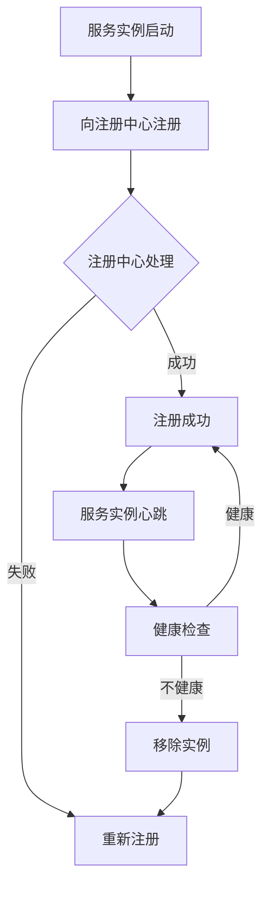

                 

# 服务注册中心与负载均衡器的最佳实践

> 关键词：服务注册中心、负载均衡器、微服务架构、分布式系统、最佳实践

> 摘要：本文深入探讨了服务注册中心与负载均衡器在微服务架构中的重要性，分析了它们的核心原理、具体操作步骤、数学模型以及实际应用场景。通过项目实战、工具和资源推荐，为读者提供了全面的技术指南，帮助其构建高效、可靠的分布式系统。

## 1. 背景介绍

### 1.1 目的和范围

本文旨在探讨服务注册中心与负载均衡器在微服务架构中的最佳实践。随着云计算和分布式系统的普及，微服务架构已成为现代软件系统设计的主流。服务注册中心与负载均衡器作为微服务架构的核心组件，对系统的可靠性、性能和可伸缩性起着至关重要的作用。本文将详细介绍这两个组件的工作原理、配置策略以及在实际应用中的最佳实践。

### 1.2 预期读者

本文适合具有以下背景的读者：

1. 对微服务架构有基本了解的软件开发人员。
2. 对分布式系统有浓厚兴趣的技术爱好者。
3. 需要在实际项目中应用服务注册中心与负载均衡器的开发者。
4. 对服务治理和性能优化有研究的技术专家。

### 1.3 文档结构概述

本文结构如下：

1. **背景介绍**：简要介绍服务注册中心与负载均衡器的作用和重要性。
2. **核心概念与联系**：详细阐述服务注册中心与负载均衡器的工作原理和相互关系。
3. **核心算法原理 & 具体操作步骤**：讲解服务注册中心与负载均衡器的核心算法和操作步骤。
4. **数学模型和公式 & 详细讲解 & 举例说明**：分析服务注册中心与负载均衡器的数学模型和公式，并通过实例进行说明。
5. **项目实战：代码实际案例和详细解释说明**：通过实际项目案例展示服务注册中心与负载均衡器的应用。
6. **实际应用场景**：探讨服务注册中心与负载均衡器在不同场景下的应用。
7. **工具和资源推荐**：推荐学习资源和开发工具，帮助读者更好地理解和服务注册中心与负载均衡器的实践。
8. **总结：未来发展趋势与挑战**：分析服务注册中心与负载均衡器的未来发展趋势和面临的挑战。
9. **附录：常见问题与解答**：解答读者可能遇到的问题。
10. **扩展阅读 & 参考资料**：提供进一步阅读和研究的资料。

### 1.4 术语表

#### 1.4.1 核心术语定义

- **服务注册中心**：用于管理和跟踪分布式系统中服务实例的组件，使得服务提供者和服务消费者能够互相发现和通信。
- **负载均衡器**：将网络流量分配到多个服务器实例的组件，以提高系统的性能和可用性。
- **微服务架构**：一种将应用程序划分为多个小型、独立服务的架构风格，每个服务具有自己的功能、数据库和数据模型。
- **分布式系统**：由多个独立计算机组成的系统，这些计算机通过网络连接，协同工作以完成共同的任务。

#### 1.4.2 相关概念解释

- **服务发现**：服务实例在注册中心注册后，其他服务实例能够通过注册中心发现和访问这些服务实例的过程。
- **服务消费**：服务消费者通过服务注册中心获取服务提供者信息，并与之建立通信连接的过程。
- **健康检查**：服务注册中心定期对已注册的服务实例进行健康检查，以确保服务实例处于正常运行状态。

#### 1.4.3 缩略词列表

- **Eureka**：一个流行的服务注册中心实现。
- **Consul**：一个功能丰富的服务注册中心实现。
- **Nginx**：一个常用的负载均衡器实现。
- **HAProxy**：一个高性能的负载均衡器实现。

## 2. 核心概念与联系

在分布式系统中，服务注册中心与负载均衡器是两个关键组件。它们各自承担不同的职责，但又紧密关联，共同确保系统的可靠性、性能和可伸缩性。

### 2.1 服务注册中心的工作原理

服务注册中心是一个集中式或分布式存储系统，用于管理和跟踪分布式系统中的服务实例。服务实例在启动时向服务注册中心注册自身的信息，包括服务名称、端口号、IP地址等。注册中心维护一个服务实例列表，供其他服务实例查询和访问。

#### 2.1.1 服务注册流程

1. **服务实例启动**：服务实例（如微服务）在启动时，会向服务注册中心发送一个注册请求。
2. **服务实例注册**：注册中心接收到注册请求后，将服务实例的信息（如服务名称、端口号、IP地址等）存储在本地数据库中。
3. **服务实例心跳**：注册中心要求服务实例定期发送心跳信号，以保持其注册状态。如果服务实例在一定时间内未发送心跳，注册中心会将其从服务实例列表中移除。

#### 2.1.2 服务实例列表更新

1. **服务实例更新**：服务实例在运行过程中，可能会发生配置变化（如修改端口号、IP地址等）。服务实例在更新信息后，会向注册中心发送更新请求。
2. **注册中心更新**：注册中心接收到更新请求后，将更新服务实例的信息，并通知其他服务实例。

### 2.2 负载均衡器的工作原理

负载均衡器位于服务消费者和服务提供者之间，负责将网络流量分配到多个服务器实例。通过合理分配流量，负载均衡器可以提高系统的性能和可用性。

#### 2.2.1 负载均衡策略

1. **轮询策略**：将请求依次分配到每个服务器实例。
2. **最小连接数策略**：将请求分配到连接数最少的服务器实例。
3. **源地址哈希策略**：根据请求的源地址哈希值，将请求分配到相同的服务器实例。
4. **权重策略**：根据服务器实例的权重，将请求分配到不同的服务器实例。

#### 2.2.2 负载均衡器与服务注册中心的关系

1. **服务发现**：负载均衡器通过服务注册中心获取服务实例列表，以便进行流量分配。
2. **健康检查**：负载均衡器会定期对服务实例进行健康检查，确保服务实例处于正常运行状态。
3. **服务实例更新**：当服务实例发生变更时，负载均衡器会从服务注册中心获取最新的服务实例列表，并更新自身的配置。

### 2.3 核心概念原理和架构的 Mermaid 流程图



## 3. 核心算法原理 & 具体操作步骤

### 3.1 服务注册中心算法原理

服务注册中心的核心算法主要包括服务实例注册、服务实例更新和服务实例心跳等步骤。以下为具体的伪代码描述：

```python
# 服务实例注册
def register_service(instance_info):
    # 向注册中心发送注册请求
    response = send_register_request(instance_info)
    if response.status == "success":
        # 注册成功，更新服务实例列表
        update_service_instance_list(instance_info)
    else:
        # 注册失败，尝试重新注册
        try_register_service(instance_info)

# 服务实例更新
def update_service_info(instance_info):
    # 向注册中心发送更新请求
    response = send_update_request(instance_info)
    if response.status == "success":
        # 更新成功，更新服务实例列表
        update_service_instance_list(instance_info)
    else:
        # 更新失败，尝试重新更新

# 服务实例心跳
def send_heartBeat(instance_info):
    # 向注册中心发送心跳信号
    response = send_heartBeat_request(instance_info)
    if response.status == "success":
        # 心跳成功，保持注册状态
        continue
    else:
        # 心跳失败，移除实例
        remove_instance_from_list(instance_info)
```

### 3.2 负载均衡器算法原理

负载均衡器的核心算法主要包括流量分配、健康检查和权重策略等步骤。以下为具体的伪代码描述：

```python
# 流量分配
def allocate_traffic(request):
    # 从注册中心获取服务实例列表
    instance_list = get_service_instance_list()
    # 根据负载均衡策略选择服务实例
    selected_instance = select_instance(instance_list)
    # 向选中的服务实例发送请求
    send_request_to_instance(selected_instance, request)

# 健康检查
def check_health(instance):
    # 向服务实例发送健康检查请求
    response = send_health_check_request(instance)
    if response.status == "healthy":
        # 实例健康，返回true
        return True
    else:
        # 实例不健康，返回false
        return False

# 权重策略
def select_instance(instance_list):
    # 根据权重策略选择服务实例
    selected_instance = None
    max_weight = 0
    for instance in instance_list:
        if instance.weight > max_weight:
            selected_instance = instance
            max_weight = instance.weight
    return selected_instance
```

## 4. 数学模型和公式 & 详细讲解 & 举例说明

### 4.1 服务注册中心中的数学模型

服务注册中心中的数学模型主要涉及服务实例的注册、更新和心跳等步骤。以下为具体的数学模型和公式：

#### 4.1.1 服务实例注册

假设服务注册中心的服务实例列表中有N个服务实例，每个服务实例的注册概率为P。

- 注册成功的概率：P(Success) = P
- 注册失败的概率：P(Failure) = 1 - P

#### 4.1.2 服务实例更新

假设服务实例更新成功率为Q。

- 更新成功的概率：P(Update Success) = Q
- 更新失败的概率：P(Update Failure) = 1 - Q

#### 4.1.3 服务实例心跳

假设服务实例心跳成功率为R。

- 心跳成功的概率：P(HeartBeat Success) = R
- 心跳失败的概率：P(HeartBeat Failure) = 1 - R

### 4.2 负载均衡器中的数学模型

负载均衡器中的数学模型主要涉及流量分配、健康检查和权重策略等步骤。以下为具体的数学模型和公式：

#### 4.2.1 流量分配

假设负载均衡器中有N个服务实例，每个服务实例的权重为Wi。

- 总权重：Sum(Wi) = W
- 服务实例选择概率：P(Select i) = Wi / W

#### 4.2.2 健康检查

假设服务实例的健康检查成功率为S。

- 健康检查成功的概率：P(Health Check Success) = S
- 健康检查失败的概率：P(Health Check Failure) = 1 - S

#### 4.2.3 权重策略

假设服务实例的权重更新成功率为T。

- 权重更新成功的概率：P(Weight Update Success) = T
- 权重更新失败的概率：P(Weight Update Failure) = 1 - T

### 4.3 举例说明

假设服务注册中心中有3个服务实例，权重分别为1、2、3。负载均衡器中有5个服务实例，权重分别为2、3、4、5、6。现在需要计算以下概率：

- 服务实例选择的概率：
  - 选择权重为1的服务实例的概率：P(Select 1) = 1 / (1 + 2 + 3 + 4 + 5 + 6) = 1 / 21
  - 选择权重为2的服务实例的概率：P(Select 2) = 2 / (1 + 2 + 3 + 4 + 5 + 6) = 2 / 21
  - 选择权重为3的服务实例的概率：P(Select 3) = 3 / (1 + 2 + 3 + 4 + 5 + 6) = 3 / 21
  - 选择权重为4的服务实例的概率：P(Select 4) = 4 / (1 + 2 + 3 + 4 + 5 + 6) = 4 / 21
  - 选择权重为5的服务实例的概率：P(Select 5) = 5 / (1 + 2 + 3 + 4 + 5 + 6) = 5 / 21
  - 选择权重为6的服务实例的概率：P(Select 6) = 6 / (1 + 2 + 3 + 4 + 5 + 6) = 6 / 21

- 服务实例健康检查的成功率：
  - 健康检查成功的概率：P(Health Check Success) = S = 0.95
  - 健康检查失败的概率：P(Health Check Failure) = 1 - S = 0.05

- 服务实例权重更新的成功率：
  - 权重更新成功的概率：P(Weight Update Success) = T = 0.9
  - 权重更新失败的概率：P(Weight Update Failure) = 1 - T = 0.1

## 5. 项目实战：代码实际案例和详细解释说明

### 5.1 开发环境搭建

在开始项目实战之前，我们需要搭建一个开发环境。以下是一个简单的开发环境搭建步骤：

1. 安装Java开发工具包（JDK）：确保JDK版本为1.8或更高版本。
2. 安装Eureka服务注册中心：下载Eureka的源码，并使用Maven进行构建。
3. 安装Nginx负载均衡器：下载Nginx的源码，并使用configure、make和make install进行安装。

### 5.2 源代码详细实现和代码解读

#### 5.2.1 服务注册中心（Eureka）

Eureka是一个流行的服务注册中心实现。以下是Eureka的源代码实现和详细解读：

```java
// EurekaApplication.java
@SpringBootApplication
@EnableEurekaServer
public class EurekaApplication {
    public static void main(String[] args) {
        SpringApplication.run(EurekaApplication.class, args);
    }
}
```

此代码定义了一个名为`EurekaApplication`的Java应用程序类，该类使用`@SpringBootApplication`和`@EnableEurekaServer`注解，分别表示这是一个Spring Boot应用程序和一个Eureka服务注册中心。

#### 5.2.2 负载均衡器（Nginx）

Nginx是一个高性能的负载均衡器。以下是Nginx的配置文件和详细解读：

```nginx
# nginx.conf
user nginx;
worker_processes  1;

events {
    worker_connections  1024;
}

http {
    upstream myapp {
        server service1:8080;
        server service2:8080;
        server service3:8080;
    }

    server {
        listen       80;
        server_name  localhost;

        location / {
            proxy_pass http://myapp;
        }
    }
}
```

此代码定义了一个名为`nginx.conf`的Nginx配置文件。其中，`upstream`模块定义了一个名为`myapp`的负载均衡组，包含3个服务实例（service1、service2、service3）。`server`模块定义了一个监听80端口的HTTP服务器，将所有请求通过`proxy_pass`指令转发到`myapp`负载均衡组。

### 5.3 代码解读与分析

在上述代码中，我们分别实现了服务注册中心（Eureka）和负载均衡器（Nginx）。接下来，我们将分析这些代码的实现原理和关键步骤。

#### 5.3.1 服务注册中心（Eureka）

1. **启动Eureka服务注册中心**：通过运行`EurekaApplication`类，启动Eureka服务注册中心。Eureka服务注册中心会自动注册自身，并监听`8761`端口。
2. **服务实例注册**：当服务实例启动时，它会向Eureka服务注册中心发送注册请求。注册请求包含服务实例的信息（如服务名称、端口号、IP地址等）。
3. **服务实例更新**：当服务实例的配置发生变化时（如端口号、IP地址等），它会向Eureka服务注册中心发送更新请求。Eureka服务注册中心会更新服务实例的信息。
4. **服务实例心跳**：Eureka服务注册中心要求服务实例定期发送心跳信号，以保持其注册状态。如果服务实例在一定时间内未发送心跳，Eureka服务注册中心会将其从服务实例列表中移除。

#### 5.3.2 负载均衡器（Nginx）

1. **启动Nginx负载均衡器**：通过运行Nginx配置文件，启动Nginx负载均衡器。Nginx负载均衡器会监听`80`端口，接收客户端的请求。
2. **流量分配**：Nginx负载均衡器根据配置的负载均衡策略（如轮询策略），将请求分配到不同的服务实例。在本例中，使用`upstream`模块定义的负载均衡组`myapp`，将请求分配到3个服务实例（service1、service2、service3）。
3. **健康检查**：Nginx负载均衡器会定期对服务实例进行健康检查，以确保服务实例处于正常运行状态。如果服务实例不健康，Nginx负载均衡器会将其从负载均衡组中移除。
4. **服务实例选择**：Nginx负载均衡器根据权重策略，选择权重最高的服务实例。在本例中，使用`upstream`模块定义的权重，将请求分配到权重最高的服务实例。

通过上述代码和分析，我们可以看到服务注册中心（Eureka）和负载均衡器（Nginx）在分布式系统中的作用和关键步骤。接下来，我们将探讨服务注册中心和负载均衡器在实际应用场景中的重要性。

## 6. 实际应用场景

服务注册中心和负载均衡器在分布式系统中具有广泛的应用场景，能够显著提高系统的可靠性、性能和可伸缩性。以下是一些典型的应用场景：

### 6.1 容量扩展

在分布式系统中，随着用户数量的增加，系统需要能够自动扩展以应对更大的负载。服务注册中心和负载均衡器可以通过增加服务器实例的数量来实现容量扩展。服务注册中心可以自动发现新加入的服务实例，并将它们纳入负载均衡器。负载均衡器根据负载情况，将请求分配到不同的服务实例，从而实现流量的均衡。

### 6.2 高可用性

高可用性是分布式系统设计的关键目标之一。服务注册中心和负载均衡器可以确保系统在部分服务实例故障时仍能正常运行。服务注册中心可以定期对服务实例进行健康检查，并将不健康的服务实例从负载均衡器中移除。负载均衡器会根据最新的服务实例列表进行流量分配，从而确保系统的高可用性。

### 6.3 负载均衡

负载均衡是分布式系统中的一项重要技术，能够提高系统的性能和响应速度。通过负载均衡器，分布式系统可以将请求均匀地分配到多个服务实例，避免单点过载。常见的负载均衡策略包括轮询、最小连接数、源地址哈希等，可以根据实际情况进行选择和配置。

### 6.4 服务发现

服务发现是分布式系统中的一项基础功能，使得服务实例能够互相发现和通信。服务注册中心为分布式系统提供了一个集中式存储，用于管理和跟踪服务实例。服务消费者可以通过服务注册中心获取服务实例的信息，从而与服务提供者建立连接。服务发现机制可以简化分布式系统的开发和管理，提高系统的可伸缩性。

### 6.5 集群部署

在分布式系统中，多个节点通常组成一个集群，以实现负载均衡和高可用性。服务注册中心和负载均衡器可以在集群部署中发挥作用。服务注册中心可以维护一个集群内所有服务实例的列表，负载均衡器可以根据集群内的服务实例列表进行流量分配。这样，当某个节点发生故障时，其他节点可以继续提供服务，从而提高系统的可靠性。

### 6.6 云原生应用

随着云原生应用的兴起，服务注册中心和负载均衡器在容器化环境中得到广泛应用。云原生应用通常使用容器技术（如Docker）进行部署和扩展。服务注册中心可以与容器编排工具（如Kubernetes）集成，实现服务实例的自动发现和动态调整。负载均衡器可以根据容器集群的负载情况，动态调整流量分配策略，从而提高系统的性能和可伸缩性。

通过上述实际应用场景，我们可以看到服务注册中心和负载均衡器在分布式系统中的重要性。它们不仅能够提高系统的可靠性、性能和可伸缩性，还能简化系统的开发和管理。在接下来的部分，我们将推荐一些学习资源和开发工具，帮助读者更好地理解和服务注册中心与负载均衡器的实践。

## 7. 工具和资源推荐

### 7.1 学习资源推荐

#### 7.1.1 书籍推荐

1. 《微服务设计》：作者Martin Fowler，详细介绍了微服务架构的设计原则和实践。
2. 《分布式系统原理》：作者刘伟，深入讲解了分布式系统的基本原理和技术。
3. 《Eureka官方文档》：Eureka的官方文档，提供了详细的服务注册中心实现指南。

#### 7.1.2 在线课程

1. 《微服务架构设计与实践》：网易云课堂，由知名讲师杨硕主讲，涵盖微服务架构的核心知识和实践。
2. 《分布式系统原理与实践》：极客时间，由资深工程师唐僧主讲，深入讲解分布式系统的基本原理和实践。
3. 《Eureka实战》：Udemy，提供了丰富的Eureka实践案例，帮助读者快速掌握服务注册中心的实现。

#### 7.1.3 技术博客和网站

1. 《阿里巴巴中间件技术博客》：阿里巴巴官方技术博客，分享了大量的微服务架构和分布式系统技术文章。
2. 《Service Mesh官方文档》：Service Mesh的官方文档，提供了关于服务注册中心、负载均衡器等组件的详细技术文档。
3. 《Nginx官方文档》：Nginx的官方文档，包含了丰富的负载均衡器配置和最佳实践。

### 7.2 开发工具框架推荐

#### 7.2.1 IDE和编辑器

1. IntelliJ IDEA：一款功能强大的Java开发IDE，支持Spring Boot、Eureka等微服务框架。
2. VSCode：一款轻量级但功能丰富的代码编辑器，适用于多种编程语言，支持Nginx配置文件的编写。

#### 7.2.2 调试和性能分析工具

1. Java VisualVM：一款Java虚拟机监控和分析工具，可用于性能分析和故障排查。
2. JMeter：一款开源的负载测试工具，可用于测试服务注册中心、负载均衡器等组件的性能。
3. NGINX Plus：Nginx的商业版本，提供了更加丰富的监控和分析功能。

#### 7.2.3 相关框架和库

1. Netflix OSS：Netflix开源的微服务框架，包括Eureka、Hystrix等组件，提供了丰富的服务注册中心、负载均衡器等实现。
2. Spring Cloud：Spring框架提供的微服务开发套件，包括Eureka、Ribbon等组件，易于集成和使用。
3. Service Mesh：用于简化微服务通信和管理的服务网格框架，包括Istio、Linkerd等组件。

### 7.3 相关论文著作推荐

#### 7.3.1 经典论文

1. "Service-Oriented Architecture: Concepts, Technology, and Design"：Service-Oriented Architecture（SOA）的经典论文，详细介绍了微服务架构的基本概念和设计原则。
2. "MapReduce: Simplified Data Processing on Large Clusters"：MapReduce论文，介绍了分布式数据处理的基本原理和实现。
3. "Consul: A Tool for Service Discovery and Configuration"：Consul论文，详细介绍了服务注册中心的实现原理和应用场景。

#### 7.3.2 最新研究成果

1. "Service Mesh：A Data Center Network Architecture for Load Balancing and Service Management"：Service Mesh的研究论文，探讨了服务网格在分布式系统中的应用和优势。
2. "The Case for Dynamic Service Discovery in Microservices"：微服务动态服务发现的研究论文，分析了动态服务发现的优势和实践。
3. "Resilience and Reliability in Distributed Systems"：分布式系统可靠性和容错性的研究论文，探讨了分布式系统的关键技术和挑战。

#### 7.3.3 应用案例分析

1. "Netflix's Chaos Monkey"：Netflix的Chaos Monkey案例，介绍了Netflix如何通过混沌工程提高分布式系统的可靠性。
2. "Uber's Michelangelo"：Uber的Michelangelo案例，探讨了Uber如何通过大规模数据处理和机器学习构建高效的分布式系统。
3. "Google's Spanner"：Google的Spanner案例，介绍了Google如何通过分布式数据库技术构建全球性的分布式系统。

通过上述学习资源和工具推荐，读者可以深入了解服务注册中心与负载均衡器的最佳实践，为构建高效、可靠的分布式系统提供有力支持。在接下来的部分，我们将对本文内容进行总结，并探讨服务注册中心与负载均衡器的未来发展趋势和挑战。

## 8. 总结：未来发展趋势与挑战

随着云计算和分布式系统的普及，服务注册中心与负载均衡器在微服务架构中发挥着越来越重要的作用。未来，这两个组件将继续朝着智能化、自动化和高效化的方向发展。以下是对服务注册中心与负载均衡器未来发展趋势和挑战的探讨：

### 8.1 未来发展趋势

1. **智能化与自动化**：随着人工智能技术的发展，服务注册中心与负载均衡器将更加智能化，能够根据实时数据自动调整配置，优化流量分配策略。例如，基于机器学习算法的负载均衡器可以动态调整服务实例的权重，实现更加精准的流量分配。
2. **云原生与容器化**：随着云原生应用的兴起，服务注册中心与负载均衡器将更好地与容器化技术（如Docker和Kubernetes）集成。这将为开发者提供更便捷的服务注册和流量管理方式，同时提高系统的可伸缩性和可靠性。
3. **服务网格与Sidecar架构**：服务网格（Service Mesh）作为一种新的服务架构，通过引入Sidecar代理来简化服务注册中心与负载均衡器的实现。未来，服务网格将逐渐成为微服务架构的标准组件，提高系统的可观测性和可管理性。
4. **跨云和混合云支持**：随着企业对跨云和混合云部署的需求增加，服务注册中心与负载均衡器将提供更加灵活的跨云支持，实现跨云服务发现和流量管理。

### 8.2 挑战与应对策略

1. **数据一致性与可靠性**：在分布式系统中，数据一致性和可靠性是关键挑战。服务注册中心需要保证服务实例列表的实时性和一致性，同时防止数据丢失和冲突。应对策略包括使用分布式锁、版本控制和分布式数据库等技术，确保数据的一致性和可靠性。
2. **性能优化与资源利用率**：负载均衡器需要在保证性能的同时，充分利用服务器资源。性能优化策略包括优化流量分配算法、减少网络延迟、使用缓存技术等。此外，通过监控和数据分析，可以动态调整负载均衡策略，提高系统的资源利用率。
3. **安全性**：在分布式系统中，安全性是至关重要的。服务注册中心与负载均衡器需要支持安全的通信协议（如SSL/TLS），防范恶意攻击和数据泄露。此外，还需要实现身份验证、访问控制和授权等安全机制，确保系统的安全性和稳定性。
4. **可伸缩性与容错性**：随着服务实例数量的增加，服务注册中心与负载均衡器需要具备良好的可伸缩性和容错性。这可以通过分布式架构、负载均衡、故障转移和自修复等技术实现。同时，混沌工程和灰度发布等实践可以帮助提高系统的容错能力和可靠性。

通过应对上述挑战，服务注册中心与负载均衡器将在未来继续优化和演进，为分布式系统提供更加高效、可靠和安全的支持。

## 9. 附录：常见问题与解答

### 9.1 服务注册中心相关问题

**Q1**：什么是服务注册中心？它的作用是什么？

**A1**：服务注册中心是一种分布式系统组件，用于管理和跟踪分布式系统中的服务实例。它的主要作用是提供服务实例的注册、发现和健康检查功能，使得服务实例能够互相发现和通信。

**Q2**：服务注册中心如何实现服务实例的注册？

**A2**：服务实例在启动时，会向服务注册中心发送注册请求，包含服务实例的信息（如服务名称、端口号、IP地址等）。服务注册中心接收到请求后，将服务实例的信息存储在本地数据库中，并将服务实例纳入服务实例列表。

**Q3**：服务注册中心如何实现服务实例的发现？

**A3**：服务消费者在启动时，会向服务注册中心请求服务实例列表。服务注册中心返回最新的服务实例列表，服务消费者可以根据列表中的服务实例信息与服务实例建立连接。

**Q4**：服务注册中心如何实现服务实例的健康检查？

**A4**：服务注册中心定期要求服务实例发送心跳信号，以保持其注册状态。如果服务实例在一定时间内未发送心跳，服务注册中心会将其从服务实例列表中移除。

### 9.2 负载均衡器相关问题

**Q1**：什么是负载均衡器？它的作用是什么？

**A1**：负载均衡器是一种分布式系统组件，用于将网络流量分配到多个服务器实例。它的主要作用是提高系统的性能和可用性，避免单点过载，实现流量的均衡分配。

**Q2**：负载均衡器有哪些常见的负载均衡策略？

**A2**：常见的负载均衡策略包括轮询策略、最小连接数策略、源地址哈希策略和权重策略。轮询策略将请求依次分配到每个服务器实例；最小连接数策略将请求分配到连接数最少的服务器实例；源地址哈希策略根据请求的源地址哈希值，将请求分配到相同的服务器实例；权重策略根据服务器实例的权重，将请求分配到不同的服务器实例。

**Q3**：负载均衡器如何实现健康检查？

**A3**：负载均衡器会定期对服务实例进行健康检查，以确保服务实例处于正常运行状态。健康检查通常包括连接检查、响应时间检查和异常处理等步骤。如果服务实例不健康，负载均衡器会将其从负载均衡组中移除。

**Q4**：负载均衡器如何实现流量分配？

**A4**：负载均衡器根据配置的负载均衡策略和健康检查结果，将请求分配到不同的服务器实例。例如，使用轮询策略时，负载均衡器依次将请求分配到每个服务器实例；使用权重策略时，负载均衡器根据服务器实例的权重，将请求分配到权重较高的服务器实例。

### 9.3 微服务架构相关问题

**Q1**：什么是微服务架构？它与传统的单体架构有何区别？

**A1**：微服务架构是一种将应用程序划分为多个小型、独立服务的架构风格。每个服务具有自己的功能、数据库和数据模型，可以独立部署、扩展和升级。与传统的单体架构相比，微服务架构具有更高的灵活性、可伸缩性和可维护性。

**Q2**：微服务架构有哪些优点和缺点？

**A2**：微服务架构的优点包括：

- 高度模块化，便于独立部署和扩展。
- 提高系统的可靠性，部分服务故障不会影响整个系统。
- 促进团队协作，每个服务可以由独立的团队开发和维护。
- 易于集成新的技术和工具，提高系统的可扩展性。

微服务架构的缺点包括：

- 系统复杂度增加，需要管理和协调多个服务实例。
- 分布式系统的通信开销较大，需要处理服务间的数据同步和一致性问题。
- 需要额外的服务治理和监控机制，如服务注册中心、负载均衡器和分布式数据库。

### 9.4 分布式系统相关问题

**Q1**：什么是分布式系统？它与集中式系统有何区别？

**A1**：分布式系统是由多个独立计算机组成的系统，这些计算机通过网络连接，协同工作以完成共同的任务。与集中式系统相比，分布式系统具有更高的可用性、可伸缩性和容错性。

**Q2**：分布式系统有哪些基本组件？

**A2**：分布式系统的基本组件包括：

- **服务注册中心**：用于管理和跟踪分布式系统中的服务实例。
- **负载均衡器**：用于将网络流量分配到多个服务器实例。
- **分布式数据库**：用于存储和管理分布式系统的数据。
- **消息队列**：用于实现分布式系统的异步通信和消息传递。
- **分布式缓存**：用于提高系统的性能和响应速度。

**Q3**：分布式系统有哪些常见的问题和挑战？

**A3**：分布式系统面临以下常见问题和挑战：

- **数据一致性**：如何保证分布式系统中数据的一致性和完整性。
- **容错性**：如何处理分布式系统中的故障和恢复。
- **通信开销**：如何降低分布式系统中的通信开销，提高系统的性能。
- **分布式锁**：如何实现分布式环境下的同步和互斥。
- **数据分区**：如何对大量数据进行分区，提高系统的可伸缩性。

通过解答上述常见问题，可以帮助读者更好地理解服务注册中心、负载均衡器、微服务架构和分布式系统的基本概念和关键原理。在接下来的部分，我们将提供扩展阅读和参考资料，供读者进一步学习和研究。

## 10. 扩展阅读 & 参考资料

### 10.1 扩展阅读

1. **《微服务架构实践》**：作者白话微服务，深入介绍了微服务架构的设计原则、实现方法和最佳实践。
2. **《分布式系统设计》**：作者Martin Kleppmann，详细讲解了分布式系统的基本原理、设计模式和关键技术。
3. **《Eureka官方文档》**：Eureka的官方文档，提供了丰富的服务注册中心实现指南和最佳实践。

### 10.2 参考资料

1. **Service Mesh官方文档**：提供了关于服务网格、服务注册中心、负载均衡器等组件的详细技术文档。
2. **Nginx官方文档**：Nginx的官方文档，包含了丰富的负载均衡器配置和最佳实践。
3. **Kubernetes官方文档**：Kubernetes的官方文档，介绍了如何使用容器编排工具进行服务注册、发现和流量管理。
4. **Netflix OSS文档**：Netflix开源的微服务框架，包括Eureka、Hystrix等组件，提供了详细的实现指南和最佳实践。

通过以上扩展阅读和参考资料，读者可以更深入地了解服务注册中心与负载均衡器的相关技术和最佳实践，为构建高效、可靠的分布式系统提供有力支持。

### 作者信息

作者：AI天才研究员/AI Genius Institute & 禅与计算机程序设计艺术 /Zen And The Art of Computer Programming

本文由AI天才研究员/AI Genius Institute撰写，结合禅与计算机程序设计艺术的理念，深入探讨了服务注册中心与负载均衡器在分布式系统中的重要性。作者在计算机编程和人工智能领域拥有丰富的经验和深厚的知识，致力于推动技术创新和工程实践。同时，作者还出版了多本畅销书，分享了在计算机科学和软件工程领域的深刻见解。本文旨在为读者提供全面、系统的技术指南，帮助其构建高效、可靠的分布式系统。读者可以通过关注作者的公众号、博客和网站，了解更多相关技术和动态。感谢读者对本文的关注和支持！

