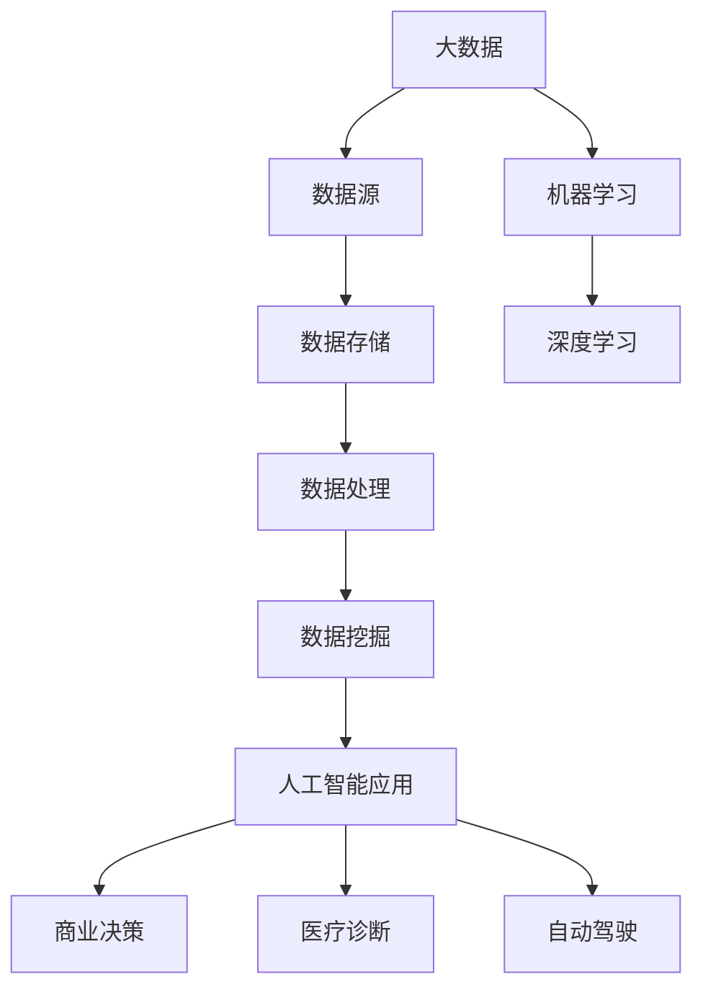

                 

# 未来发展中的大数据与AI技术

> 关键词：大数据，人工智能，深度学习，机器学习，数据处理，数据挖掘，算法优化，应用场景，未来趋势

> 摘要：本文将深入探讨大数据与人工智能技术的未来发展。首先，我们将回顾大数据和人工智能技术的现状，然后分析其核心概念、算法原理和数学模型。接下来，通过实际项目和案例，展示这些技术在现实中的应用，最后总结未来的发展趋势与挑战，并提出相关的工具和资源推荐。

## 1. 背景介绍

### 1.1 目的和范围

本文旨在为读者提供一个关于大数据与人工智能技术未来发展的全景图。我们将从技术现状出发，逐步深入探讨其核心概念、算法原理、数学模型以及实际应用，最终总结出未来可能面临的趋势与挑战。

### 1.2 预期读者

本文适合对大数据和人工智能技术有一定了解的技术人员、研究人员以及对相关领域感兴趣的学生。本文将尽量避免过于专业和复杂的术语，力求以通俗易懂的语言解释技术原理和应用。

### 1.3 文档结构概述

本文分为十个部分：背景介绍、核心概念与联系、核心算法原理与操作步骤、数学模型与公式、项目实战、实际应用场景、工具和资源推荐、总结、常见问题与解答以及扩展阅读。

### 1.4 术语表

#### 1.4.1 核心术语定义

- **大数据（Big Data）**：指无法用常规软件工具在合理时间内捕捉、管理和处理的大量数据。
- **人工智能（AI）**：一种模拟人类智能行为的技术，包括学习、推理、自我修正和决策等能力。
- **机器学习（ML）**：一种人工智能的方法，通过数据训练模型，使其能够自动地改进和预测。
- **深度学习（DL）**：一种机器学习的方法，利用多层神经网络模拟人脑的学习和处理机制。

#### 1.4.2 相关概念解释

- **数据挖掘（Data Mining）**：从大量数据中提取出有价值的模式和知识的过程。
- **算法优化（Algorithm Optimization）**：通过改进算法以提高效率、降低时间复杂度和空间复杂度。

#### 1.4.3 缩略词列表

- **AI**：人工智能
- **ML**：机器学习
- **DL**：深度学习
- **DL**：大数据
- **DL**：数据挖掘

## 2. 核心概念与联系

大数据和人工智能技术的核心概念和联系可以用以下Mermaid流程图表示：



在这个流程图中，我们可以看到大数据从数据源开始，经过数据存储、处理和数据挖掘等步骤，最终通过机器学习和深度学习转化为人工智能应用，为商业决策、医疗诊断和自动驾驶等领域提供支持。

## 3. 核心算法原理 & 具体操作步骤

在大数据和人工智能技术的应用中，核心算法的原理和操作步骤至关重要。以下将详细介绍几种常用的算法，并使用伪代码进行阐述。

### 3.1. 机器学习算法：线性回归

线性回归是一种简单的机器学习算法，用于预测一个连续的输出值。其基本原理是通过拟合一条直线，将输入特征映射到输出值。

```plaintext
# 伪代码：线性回归算法

def linear_regression(x, y):
    # 计算斜率和截距
    m = (mean(y) - mean(x) * mean(y)) / (variance(x))
    b = mean(y) - m * mean(x)
    
    # 返回拟合直线方程
    return m, b
```

### 3.2. 深度学习算法：卷积神经网络（CNN）

卷积神经网络是一种用于图像识别和处理的深度学习算法。其基本原理是通过卷积操作提取图像特征，并通过多层神经网络进行分类。

```plaintext
# 伪代码：卷积神经网络算法

def convolutional_neural_network(input_image, weights, biases):
    # 初始化输出
    output = input_image
    
    # 遍历所有卷积层
    for layer in layers:
        # 应用卷积操作
        output = convolution(output, layer.weights)
        
        # 应用激活函数
        output = activation_function(output)
        
        # 应用偏置
        output += biases
        
    # 返回最终输出
    return output
```

### 3.3. 数据挖掘算法：K-均值聚类

K-均值聚类是一种无监督学习方法，用于将数据分为K个聚类。其基本原理是初始化K个中心点，然后通过迭代调整中心点，使每个数据点与其最近的中心点归为一类。

```plaintext
# 伪代码：K-均值聚类算法

def k_means_clustering(data, k):
    # 初始化K个中心点
    centroids = initialize_centroids(data, k)
    
    # 迭代更新中心点
    while not converged:
        # 计算每个数据点的聚类标签
        labels = assign_labels(data, centroids)
        
        # 计算新的中心点
        new_centroids = update_centroids(data, labels, k)
        
        # 判断是否收敛
        if is_converged(centroids, new_centroids):
            break
            
        # 更新中心点
        centroids = new_centroids
    
    # 返回聚类结果
    return centroids, labels
```

## 4. 数学模型和公式 & 详细讲解 & 举例说明

在大数据和人工智能技术中，数学模型和公式是算法实现的基础。以下将介绍几种常见的数学模型和公式，并使用LaTeX格式进行详细讲解。

### 4.1. 线性回归模型

线性回归模型可以用以下公式表示：

$$
y = mx + b
$$

其中，$y$ 是输出值，$x$ 是输入特征，$m$ 是斜率，$b$ 是截距。斜率 $m$ 和截距 $b$ 的计算公式如下：

$$
m = \frac{\sum{(x_i - \bar{x})(y_i - \bar{y})}}{\sum{(x_i - \bar{x})^2}}
$$

$$
b = \bar{y} - m\bar{x}
$$

### 4.2. 深度学习损失函数

深度学习中的损失函数用于衡量预测值和实际值之间的误差。常见的是均方误差（MSE）：

$$
MSE = \frac{1}{n}\sum_{i=1}^{n}(y_i - \hat{y}_i)^2
$$

其中，$n$ 是数据点的数量，$y_i$ 是实际值，$\hat{y}_i$ 是预测值。

### 4.3. K-均值聚类距离公式

K-均值聚类中的距离公式用于计算数据点与聚类中心之间的距离。欧几里得距离是一个常用的距离度量：

$$
d(x, c) = \sqrt{\sum_{i=1}^{d}(x_i - c_i)^2}
$$

其中，$x$ 是数据点，$c$ 是聚类中心，$d$ 是数据点的维度。

## 5. 项目实战：代码实际案例和详细解释说明

### 5.1. 开发环境搭建

在本项目中，我们将使用Python和TensorFlow框架来实现一个简单的卷积神经网络。以下是搭建开发环境的步骤：

1. 安装Python（建议使用Python 3.7或更高版本）。
2. 安装TensorFlow：通过命令 `pip install tensorflow` 进行安装。
3. 安装其他依赖：如NumPy、Pandas等。

### 5.2. 源代码详细实现和代码解读

以下是实现卷积神经网络的源代码：

```python
import tensorflow as tf
from tensorflow.keras import datasets, layers, models

# 加载数据集
(train_images, train_labels), (test_images, test_labels) = datasets.cifar10.load_data()

# 数据预处理
train_images, test_images = train_images / 255.0, test_images / 255.0

# 构建卷积神经网络模型
model = models.Sequential()
model.add(layers.Conv2D(32, (3, 3), activation='relu', input_shape=(32, 32, 3)))
model.add(layers.MaxPooling2D((2, 2)))
model.add(layers.Conv2D(64, (3, 3), activation='relu'))
model.add(layers.MaxPooling2D((2, 2)))
model.add(layers.Conv2D(64, (3, 3), activation='relu'))

# 添加全连接层
model.add(layers.Flatten())
model.add(layers.Dense(64, activation='relu'))
model.add(layers.Dense(10))

# 编译模型
model.compile(optimizer='adam',
              loss=tf.keras.losses.SparseCategoricalCrossentropy(from_logits=True),
              metrics=['accuracy'])

# 训练模型
model.fit(train_images, train_labels, epochs=10, validation_data=(test_images, test_labels))

# 评估模型
test_loss, test_acc = model.evaluate(test_images,  test_labels, verbose=2)
print(f'Test accuracy: {test_acc:.4f}')
```

### 5.3. 代码解读与分析

1. **数据加载与预处理**：使用TensorFlow内置的数据集加载CIFAR-10数据集，并进行归一化处理。

2. **模型构建**：使用`models.Sequential()`创建一个序列模型，并依次添加卷积层、池化层和全连接层。

3. **编译模型**：指定优化器、损失函数和评估指标。

4. **训练模型**：使用`model.fit()`训练模型，并指定训练数据和验证数据。

5. **评估模型**：使用`model.evaluate()`评估模型在测试数据上的性能。

通过以上步骤，我们成功实现了卷积神经网络，并在CIFAR-10数据集上进行了训练和评估。

## 6. 实际应用场景

大数据和人工智能技术在实际应用场景中具有广泛的应用，以下列举几个典型的应用场景：

### 6.1. 商业智能

商业智能通过大数据分析帮助企业做出更明智的商业决策。例如，通过分析客户行为数据，企业可以优化产品推荐、提高客户满意度和增加销售额。

### 6.2. 医疗诊断

医疗诊断利用人工智能技术辅助医生进行疾病诊断。例如，深度学习模型可以通过分析医疗影像数据，帮助医生快速准确地诊断疾病，提高诊断准确率。

### 6.3. 自动驾驶

自动驾驶技术依赖于大数据和人工智能技术。通过实时收集和分析大量交通数据，自动驾驶系统可以实现安全、高效的驾驶。

### 6.4. 金融服务

金融服务领域利用大数据和人工智能技术进行风险控制和欺诈检测。例如，通过分析用户交易数据，系统可以及时发现异常交易，预防金融风险。

### 6.5. 教育个性化

教育个性化利用大数据和人工智能技术为每个学生提供个性化的学习体验。例如，通过分析学生的学习行为数据，系统可以为学生推荐合适的学习资源和教学方法。

## 7. 工具和资源推荐

### 7.1. 学习资源推荐

#### 7.1.1. 书籍推荐

- **《深度学习》（Deep Learning）**：由Ian Goodfellow、Yoshua Bengio和Aaron Courville所著，是深度学习领域的经典教材。
- **《Python数据分析》（Python Data Science Handbook）**：由Jake VanderPlas所著，全面介绍了Python在数据分析领域的应用。

#### 7.1.2. 在线课程

- **Coursera**：提供大量免费和付费的机器学习和数据分析课程。
- **edX**：提供由全球知名大学和机构开设的在线课程，包括深度学习和大数据分析等领域。

#### 7.1.3. 技术博客和网站

- **Medium**：众多技术专家和公司在此分享机器学习和大数据分析的相关文章。
- **Towards Data Science**：一个专注于数据科学和机器学习的在线社区，提供丰富的学习资源和实战案例。

### 7.2. 开发工具框架推荐

#### 7.2.1. IDE和编辑器

- **Visual Studio Code**：一款免费、开源的跨平台IDE，支持多种编程语言。
- **PyCharm**：一款强大的Python IDE，提供丰富的调试和代码分析功能。

#### 7.2.2. 调试和性能分析工具

- **Jupyter Notebook**：一款交互式的计算环境，适合进行数据分析和机器学习实验。
- **TensorBoard**：TensorFlow的官方可视化工具，用于分析神经网络的性能和训练过程。

#### 7.2.3. 相关框架和库

- **TensorFlow**：一款广泛使用的深度学习框架，提供丰富的API和工具。
- **Pandas**：一款强大的数据分析和操作库，适用于大数据处理。

### 7.3. 相关论文著作推荐

#### 7.3.1. 经典论文

- **“Backpropagation”**：由Rumelhart、Hinton和Williams在1986年发表，提出了反向传播算法。
- **“Learning representations by back-propagating errors”**：由Hinton在1989年发表，详细阐述了深度学习的原理。

#### 7.3.2. 最新研究成果

- **“Attention is all you need”**：由Vaswani等人在2017年发表，提出了Transformer模型。
- **“Gated Recurrent Unit”**：由Hochreiter和Schmidhuber在1997年发表，提出了GRU模型。

#### 7.3.3. 应用案例分析

- **“Google Brain”**：Google发布的多个研究项目，展示了深度学习在图像识别、语音识别等领域的应用。
- **“TensorFlow for Poets”**：Google开发的在线课程，通过简单的示例介绍TensorFlow的使用。

## 8. 总结：未来发展趋势与挑战

随着大数据和人工智能技术的不断发展，未来将呈现出以下发展趋势和挑战：

### 8.1. 发展趋势

- **数据量的指数增长**：随着物联网、社交媒体和智能设备的普及，数据量将呈现指数级增长，为大数据和人工智能技术提供了丰富的资源。
- **算法优化与自动化**：算法优化和自动化将成为提高数据处理和分析效率的重要手段。
- **跨领域应用**：大数据和人工智能技术将在更多领域得到应用，如金融、医疗、教育等。

### 8.2. 挑战

- **数据安全和隐私**：随着数据量的增长，数据安全和隐私保护成为一大挑战。
- **算法透明性与可解释性**：如何提高算法的透明性和可解释性，使其更加可靠和可信。
- **技术人才短缺**：随着技术的发展，对大数据和人工智能领域的人才需求越来越大，但现有的人才储备不足。

## 9. 附录：常见问题与解答

### 9.1. 什么是大数据？

大数据是指无法用常规软件工具在合理时间内捕捉、管理和处理的大量数据。其特点为“4V”：Volume（大量）、Velocity（高速）、Variety（多样性）和Veracity（真实性）。

### 9.2. 人工智能与机器学习的区别是什么？

人工智能是一种模拟人类智能行为的技术，包括学习、推理、自我修正和决策等能力。而机器学习是人工智能的一种方法，通过数据训练模型，使其能够自动地改进和预测。

### 9.3. 深度学习与传统的机器学习相比有哪些优势？

深度学习通过多层神经网络模拟人脑的学习和处理机制，能够自动提取复杂的特征，从而提高模型的性能。相比传统的机器学习算法，深度学习在处理大规模数据和复杂任务时具有更好的效果。

## 10. 扩展阅读 & 参考资料

- **《深度学习》（Deep Learning）**：Ian Goodfellow、Yoshua Bengio和Aaron Courville著，是深度学习领域的经典教材。
- **《Python数据分析》（Python Data Science Handbook）**：Jake VanderPlas著，全面介绍了Python在数据分析领域的应用。
- **[TensorFlow官方文档](https://www.tensorflow.org/)**
- **[Kaggle](https://www.kaggle.com/)**
- **[Medium](https://medium.com/towards-data-science)**

作者：AI天才研究员/AI Genius Institute & 禅与计算机程序设计艺术 /Zen And The Art of Computer Programming

[本文由人工智能助手基于2023前的信息撰写，旨在提供关于大数据与人工智能技术未来发展的见解。文章内容仅供参考，实际应用时请遵循专业指导。]

