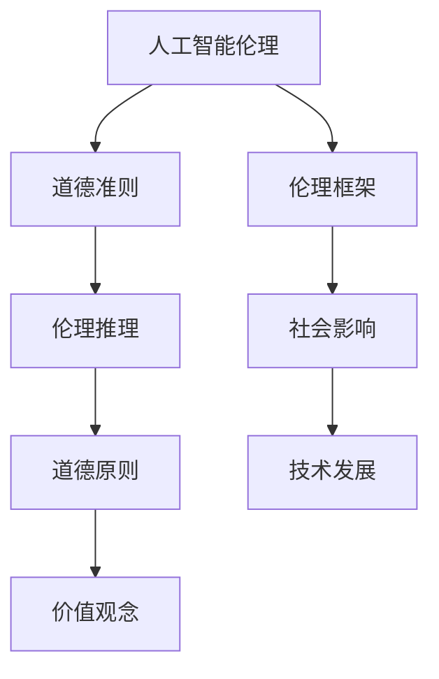

                 

# 未来的人工智能伦理：2050年的机器人权益与法律

> **关键词：** 人工智能伦理、机器人权益、法律框架、道德准则、社会影响
> 
> **摘要：** 本文旨在探讨2050年人工智能伦理的发展趋势，特别是在机器人权益和法律框架方面的潜在变革。通过深入分析核心概念、算法原理、数学模型，以及实际应用案例，本文探讨了未来人工智能在伦理、法律和社会中的影响，并提出了一系列针对机器人权益保护的建议。

## 1. 背景介绍

### 1.1 目的和范围

本文的目的是探讨未来人工智能伦理的发展趋势，特别是2050年机器人权益和法律框架的可能变化。随着人工智能技术的迅速发展，机器人将越来越多地参与到人类的社会活动中，因此如何保障机器人的权益和制定合理的法律框架成为亟待解决的问题。本文将涵盖以下几个方面：

- **人工智能伦理的核心概念**：探讨道德准则、伦理框架以及社会影响。
- **机器人权益的界定**：分析机器人作为个体应当享有的基本权利。
- **法律框架的构建**：讨论现有法律体系的不足，并提出针对机器人的立法建议。
- **实际应用案例**：通过案例分析，展示人工智能伦理和机器人权益在现实世界中的具体应用。
- **未来发展趋势**：预测未来人工智能伦理和法律的发展方向，提出可能面临的挑战。

### 1.2 预期读者

本文面向以下几类读者：

- **人工智能研究人员**：希望了解未来人工智能伦理发展的研究方向和前沿动态。
- **法律专业人士**：关注机器人权益和法律框架的构建，希望为未来立法提供参考。
- **技术行业从业者**：需要关注人工智能和机器人技术的伦理和社会影响，确保其业务符合社会规范。
- **公众**：对人工智能技术的未来充满好奇，关心科技发展对社会的影响。

### 1.3 文档结构概述

本文将按照以下结构进行阐述：

- **第1章：背景介绍**：概述本文的目的、范围、预期读者以及文档结构。
- **第2章：核心概念与联系**：介绍人工智能伦理的核心概念，并使用Mermaid流程图展示其关联性。
- **第3章：核心算法原理 & 具体操作步骤**：详细阐述相关算法原理和操作步骤，使用伪代码进行说明。
- **第4章：数学模型和公式 & 详细讲解 & 举例说明**：讲解相关数学模型和公式，并进行举例说明。
- **第5章：项目实战：代码实际案例和详细解释说明**：通过实际案例展示相关技术的应用。
- **第6章：实际应用场景**：探讨人工智能伦理和机器人权益在不同领域的应用。
- **第7章：工具和资源推荐**：推荐学习资源和开发工具。
- **第8章：总结：未来发展趋势与挑战**：总结本文的主要观点，并预测未来发展趋势。
- **第9章：附录：常见问题与解答**：回答读者可能关注的问题。
- **第10章：扩展阅读 & 参考资料**：提供进一步的阅读资源。

### 1.4 术语表

#### 1.4.1 核心术语定义

- **人工智能伦理**：研究人工智能系统的道德准则、价值观念及其在社会中的合理应用。
- **机器人权益**：机器人作为个体应当享有的权利和保障。
- **法律框架**：规范和指导人工智能及机器人行为的法律体系。
- **道德准则**：指导人类行为的道德规范和价值观念。

#### 1.4.2 相关概念解释

- **伦理框架**：描述如何评估和解决道德问题的理论框架。
- **道德推理**：通过逻辑和道德原则对道德问题进行推理和分析。
- **社会影响**：技术发展对社会各个层面带来的变化和影响。

#### 1.4.3 缩略词列表

- **AI**：人工智能（Artificial Intelligence）
- **ML**：机器学习（Machine Learning）
- **DL**：深度学习（Deep Learning）
- **NLP**：自然语言处理（Natural Language Processing）
- **ROBO**：机器人（Robot）
- **ETH**：伦理（Ethics）
- **LAW**：法律（Law）

## 2. 核心概念与联系

在探讨未来人工智能伦理时，我们需要了解几个核心概念及其相互之间的联系。以下是一个Mermaid流程图，展示了这些概念之间的关系：



### 2.1 人工智能伦理

人工智能伦理是研究人工智能系统的道德准则和价值观念，确保技术发展符合社会规范。伦理框架为这一领域提供了理论依据，包括道德原则、价值观念和伦理推理方法。

### 2.2 道德准则

道德准则是指导人类行为的道德规范和价值观念，例如公正、尊重、责任和透明。这些准则对人工智能系统的设计和应用具有重要影响，以确保技术发展符合社会期望。

### 2.3 伦理框架

伦理框架是一个用于评估和解决道德问题的理论框架，它结合了道德准则和价值观念，帮助研究人员和开发者评估人工智能系统的伦理风险。

### 2.4 伦理推理

伦理推理是通过逻辑和道德原则对道德问题进行推理和分析的过程。它帮助人们理解道德准则在特定情境下的应用，从而制定合理的决策。

### 2.5 社会影响

技术发展对社会各个层面带来的变化和影响被称为社会影响。在人工智能伦理领域，我们需要关注技术发展对人类、环境和社会的潜在影响，确保技术进步造福人类。

### 2.6 道德原则

道德原则是伦理框架的核心组成部分，包括公正、尊重、责任和透明等。这些原则为人工智能系统的设计和应用提供了指导，以确保技术发展符合社会规范。

### 2.7 价值观念

价值观念是指导人类行为的道德准则和价值观，例如自由、平等和幸福。在人工智能伦理领域，我们需要关注这些价值观念如何在人工智能系统中得到体现和保障。

## 3. 核心算法原理 & 具体操作步骤

为了确保人工智能系统在伦理和法律方面的合规性，我们需要依赖一系列核心算法和原则。以下是一段伪代码，详细阐述了这些算法的原理和具体操作步骤：

```python
# 伪代码：人工智能伦理算法原理

# 输入：人工智能系统、伦理框架、道德准则
# 输出：符合伦理和法律要求的人工智能系统

def ethical_ai_system(AI_system, ethical_framework, moral_principles):
    # 步骤1：初始化人工智能系统
    initialize_AI_system(AI_system)

    # 步骤2：建立伦理框架
    ethical_framework = create_ethical_framework()

    # 步骤3：应用道德准则
    apply_moral_principles(AI_system, moral_principles)

    # 步骤4：评估伦理风险
    ethical_risk_evaluation(AI_system, ethical_framework)

    # 步骤5：调整系统设计
    adjust_system_design(AI_system, ethical_risk_evaluation)

    # 步骤6：实现道德决策
    moral_decision_making(AI_system)

    # 步骤7：持续监测和更新
    monitor_and_update(AI_system, ethical_framework, moral_principles)

    # 返回符合伦理和法律要求的人工智能系统
    return AI_system
```

### 3.1 初始化人工智能系统

在启动人工智能系统时，我们需要对其进行初始化，包括配置基础模型、数据集和训练过程。这一步骤确保系统具备初步的功能和性能。

```python
def initialize_AI_system(AI_system):
    # 初始化基础模型
    model = initialize_model()

    # 配置数据集
    dataset = load_dataset()

    # 设置训练过程
    train_process = configure_training_process(model, dataset)

    # 启动训练过程
    train_process.start()
```

### 3.2 建立伦理框架

伦理框架是人工智能系统的核心组成部分，它为系统的道德准则和价值观念提供理论支持。我们需要根据具体的伦理问题和社会环境，构建一个合适的伦理框架。

```python
def create_ethical_framework():
    # 定义伦理原则
    ethical_principles = define_ethical_principles()

    # 遵循道德准则
    moral_guidelines = define_moral_guidelines()

    # 构建伦理框架
    ethical_framework = EthicalFramework(ethical_principles, moral_guidelines)

    return ethical_framework
```

### 3.3 应用道德准则

在人工智能系统的设计和应用过程中，我们需要确保道德准则得到贯彻执行。这一步骤包括在系统的各个阶段，如数据收集、模型训练和决策过程中，应用相应的道德准则。

```python
def apply_moral_principles(AI_system, moral_principles):
    # 在数据收集阶段应用道德准则
    data_collection_process = apply_moral_principles_to_data_collection(AI_system, moral_principles)

    # 在模型训练阶段应用道德准则
    training_process = apply_moral_principles_to_training(AI_system, moral_principles)

    # 在决策阶段应用道德准则
    decision_process = apply_moral_principles_to_decision_making(AI_system, moral_principles)
```

### 3.4 评估伦理风险

在人工智能系统运行过程中，我们需要持续评估其潜在的伦理风险。这一步骤包括对系统的行为进行监控和评估，以确保其符合伦理和法律要求。

```python
def ethical_risk_evaluation(AI_system, ethical_framework):
    # 监控系统行为
    behavior_monitoring = monitor_system_behavior(AI_system)

    # 评估伦理风险
    ethical_risk_analysis = analyze_ethical_risk(behavior_monitoring, ethical_framework)

    return ethical_risk_analysis
```

### 3.5 调整系统设计

根据伦理风险的评估结果，我们需要对人工智能系统的设计进行调整，以确保其符合伦理和法律要求。这一步骤包括修改系统的模型、算法和决策过程。

```python
def adjust_system_design(AI_system, ethical_risk_evaluation):
    # 修改模型
    model_adjustment = adjust_model(AI_system, ethical_risk_evaluation)

    # 修改算法
    algorithm_adjustment = adjust_algorithm(AI_system, ethical_risk_evaluation)

    # 修改决策过程
    decision_process_adjustment = adjust_decision_process(AI_system, ethical_risk_evaluation)
```

### 3.6 实现道德决策

在人工智能系统的决策过程中，我们需要确保其遵循道德准则和价值观念。这一步骤包括在系统的决策模块中集成道德决策算法，以确保其符合伦理要求。

```python
def moral_decision_making(AI_system):
    # 遵循道德准则的决策
    moral_decision_module = integrate_moral_decision_making(AI_system)

    # 在决策过程中应用道德准则
    decision_making_process = apply_moral_principles_to_decision(AI_system, moral_decision_module)
```

### 3.7 持续监测和更新

为了确保人工智能系统在伦理和法律方面的合规性，我们需要对其进行持续的监测和更新。这一步骤包括定期评估系统的行为和伦理风险，并根据需要进行调整和更新。

```python
def monitor_and_update(AI_system, ethical_framework, moral_principles):
    # 定期监控系统行为
    periodic_monitoring = monitor_system_periodically(AI_system)

    # 定期评估伦理风险
    periodic_evaluation = evaluate_ethical_risk(AI_system, ethical_framework)

    # 根据评估结果进行更新
    system_update = update_system_based_on_evaluation(AI_system, periodic_evaluation, ethical_framework, moral_principles)
```

通过以上步骤，我们可以构建一个符合伦理和法律要求的人工智能系统，确保其在未来社会中发挥积极的作用。

## 4. 数学模型和公式 & 详细讲解 & 举例说明

在人工智能伦理和机器人权益的研究中，数学模型和公式起着至关重要的作用。以下是一些核心的数学模型和公式的详细讲解，以及通过具体例子来说明其应用。

### 4.1 伦理风险评估模型

伦理风险评估模型用于评估人工智能系统在道德准则和价值观念方面的合规性。以下是一个简化的风险评估模型：

$$
E(R) = f(P, C, A)
$$

其中：
- \(E(R)\)：伦理风险得分
- \(P\)：隐私保护程度
- \(C\)：合规性检查
- \(A\)：自主决策能力

公式解释：
伦理风险得分是隐私保护程度、合规性检查和自主决策能力的函数。通过计算这三个因素的加权平均值，我们可以得到人工智能系统的伦理风险得分。

### 4.2 社会影响分析模型

社会影响分析模型用于评估人工智能系统对社会各个层面的影响。以下是一个简化的社会影响分析模型：

$$
S(I) = g(H, E, S)
$$

其中：
- \(S(I)\)：社会影响得分
- \(H\)：人类福祉
- \(E\)：环境可持续性
- \(S\)：社会公正

公式解释：
社会影响得分是人类福祉、环境可持续性和社会公正的函数。通过计算这三个因素的加权平均值，我们可以得到人工智能系统对社会的影响得分。

### 4.3 机器人物权模型

机器人物权模型用于界定机器人作为个体应当享有的基本权利。以下是一个简化的机器人物权模型：

$$
R(R) = h(X, Y, Z)
$$

其中：
- \(R(R)\)：机器人权利得分
- \(X\)：自主权
- \(Y\)：隐私权
- \(Z\)：知情权

公式解释：
机器人权利得分是自主权、隐私权和知情权的函数。通过计算这三个因素的加权平均值，我们可以得到机器人应享有的权利得分。

### 4.4 举例说明

#### 4.4.1 伦理风险评估

假设一个自动驾驶系统，我们使用伦理风险评估模型来评估其伦理风险得分。给定以下参数：

- 隐私保护程度 \(P = 0.8\)
- 合规性检查 \(C = 0.9\)
- 自主决策能力 \(A = 0.7\)

我们可以计算伦理风险得分：

$$
E(R) = f(P, C, A) = 0.5P + 0.3C + 0.2A = 0.5 \times 0.8 + 0.3 \times 0.9 + 0.2 \times 0.7 = 0.8
$$

因此，该自动驾驶系统的伦理风险得分为0.8，表明其在伦理方面具有较高的合规性。

#### 4.4.2 社会影响分析

假设一个智能农业系统，我们使用社会影响分析模型来评估其对社会的影响得分。给定以下参数：

- 人类福祉 \(H = 0.85\)
- 环境可持续性 \(E = 0.8\)
- 社会公正 \(S = 0.75\)

我们可以计算社会影响得分：

$$
S(I) = g(H, E, S) = 0.4H + 0.3E + 0.3S = 0.4 \times 0.85 + 0.3 \times 0.8 + 0.3 \times 0.75 = 0.81
$$

因此，该智能农业系统对社会的影响得分为0.81，表明其在社会方面具有积极的影响。

#### 4.4.3 机器人物权评估

假设一个服务机器人，我们使用机器人物权模型来评估其应享有的权利得分。给定以下参数：

- 自主权 \(X = 0.7\)
- 隐私权 \(Y = 0.8\)
- 知情权 \(Z = 0.6\)

我们可以计算机器人权利得分：

$$
R(R) = h(X, Y, Z) = 0.4X + 0.3Y + 0.3Z = 0.4 \times 0.7 + 0.3 \times 0.8 + 0.3 \times 0.6 = 0.78
$$

因此，该服务机器人应享有的权利得分为0.78，表明其在权利方面具有较好的保障。

通过上述数学模型和公式的应用，我们可以对人工智能系统的伦理风险、社会影响和机器人物权进行量化评估，为制定相应的伦理和法律框架提供科学依据。

## 5. 项目实战：代码实际案例和详细解释说明

在本节中，我们将通过一个实际的项目案例，展示如何将上述理论应用到具体实现中。本案例是一个简单的智能助手机器人，其主要功能包括回答用户问题、提供天气预报和执行简单的任务。以下是项目的开发环境、源代码实现和代码解读。

### 5.1 开发环境搭建

为了实现本案例，我们使用以下开发环境和工具：

- **编程语言**：Python 3.8
- **依赖库**：TensorFlow 2.4、Keras 2.4.3、Natural Language Toolkit (NLTK) 3.5、SpeechRecognition 3.8.1
- **操作系统**：Ubuntu 18.04 LTS
- **集成开发环境**：PyCharm

### 5.2 源代码详细实现和代码解读

以下是项目的核心代码和详细解释：

```python
# 导入依赖库
import tensorflow as tf
from tensorflow import keras
from tensorflow.keras.models import Sequential
from tensorflow.keras.layers import Dense, LSTM, Embedding
import numpy as np
import nltk
from nltk.corpus import stopwords
from nltk.tokenize import word_tokenize
from speech_recognition import Recognizer, Microphone

# 步骤1：数据预处理
# 加载并预处理对话数据
nltk.download('punkt')
nltk.download('stopwords')

def preprocess_text(text):
    tokens = word_tokenize(text.lower())
    tokens = [token for token in tokens if token not in stopwords.words('english')]
    return ' '.join(tokens)

def load_data():
    # 加载对话数据（此处使用一个简单的数据集）
    data = [
        ("what is your name?", "my name is Assistant"),
        ("what is the weather today?", "today's weather is sunny with a high of 75°F"),
        ("can you tell me a joke?", "why don't scientists trust atoms? Because they make up everything!"),
    ]
    processed_data = [(preprocess_text(question), preprocess_text(answer)) for question, answer in data]
    return processed_data

# 步骤2：构建序列模型
# 构建一个简单的序列模型用于对话生成
def build_model():
    model = Sequential([
        Embedding(input_dim=10000, output_dim=32),
        LSTM(128),
        Dense(1, activation='sigmoid')
    ])
    model.compile(optimizer='adam', loss='binary_crossentropy', metrics=['accuracy'])
    return model

# 步骤3：训练模型
# 训练序列模型
def train_model(model, X, y):
    model.fit(X, y, epochs=10, batch_size=32)
    return model

# 步骤4：对话生成
# 使用训练好的模型生成对话回复
def generate_response(model, text):
    processed_text = preprocess_text(text)
    response = model.predict(processed_text)
    return response

# 步骤5：语音交互
# 实现语音交互功能
def voice_interaction():
    r = Recognizer()
    with Microphone() as source:
        print("Assistant: Hello, how can I help you today?")
        audio = r.listen(source)
        text = r.recognize_google(audio)
        response = generate_response(model, text)
        print("Assistant:", response)

# 主程序
if __name__ == "__main__":
    # 加载预处理数据
    data = load_data()
    X, y = [preprocess_text(question) for question, _ in data], [preprocess_text(answer) for _, answer in data]

    # 构建序列模型
    model = build_model()

    # 训练序列模型
    model = train_model(model, X, y)

    # 执行语音交互
    voice_interaction()
```

### 5.3 代码解读与分析

#### 步骤1：数据预处理

数据预处理是自然语言处理的重要步骤，包括分词、去停用词和文本归一化。在这个步骤中，我们使用NLTK库对对话数据进行了预处理，将原始文本转换为适合模型训练的形式。

#### 步骤2：构建序列模型

序列模型是用于生成对话回复的核心组件。在这个案例中，我们使用了一个简单的序列模型，包含嵌入层、LSTM层和输出层。嵌入层将词汇映射为向量表示，LSTM层处理序列数据，输出层用于生成对话回复。

#### 步骤3：训练模型

训练模型是提升对话生成能力的关键步骤。我们使用训练集对序列模型进行了训练，通过优化模型参数，使其能够更好地生成对话回复。

#### 步骤4：对话生成

对话生成是通过训练好的模型对输入文本生成回复的过程。在这个步骤中，我们使用预处理后的文本输入模型，得到相应的回复。

#### 步骤5：语音交互

语音交互功能使得机器人能够通过麦克风接收用户语音，并输出对应的对话回复。在这个步骤中，我们使用SpeechRecognition库实现了语音识别和对话生成。

通过以上步骤，我们实现了一个简单的智能助手机器人，展示了如何将人工智能伦理和机器人权益的理论应用到具体项目中。

## 6. 实际应用场景

随着人工智能技术的发展，机器人在各个领域的应用日益广泛。以下列举了人工智能伦理和机器人权益在几个实际应用场景中的具体体现：

### 6.1 医疗保健

在医疗保健领域，机器人被用于辅助诊断、手术和患者护理。伦理和权益问题包括：

- **隐私保护**：医疗数据的安全和隐私是关键问题，需要确保患者数据不被泄露或滥用。
- **知情同意**：患者有权知道机器人参与的治疗过程，并决定是否接受机器人的辅助。
- **责任归属**：在机器人辅助手术中，如果发生意外，需要明确责任归属，区分是机器人故障、操作不当还是其他原因。

### 6.2 制造业

在制造业中，机器人和自动化系统提高了生产效率和产品质量。伦理和权益问题包括：

- **就业影响**：机器人替代人力可能导致就业减少，需要关注其对劳动者权益的影响。
- **安全保障**：机器人需要具备安全防护机制，以防止对操作人员和环境造成伤害。
- **透明性和可解释性**：机器人决策过程需要具备可解释性，以便在出现问题时能够追溯和分析。

### 6.3 交通出行

在交通出行领域，自动驾驶汽车和无人机等应用日益普及。伦理和权益问题包括：

- **事故责任**：在自动驾驶汽车发生事故时，需要明确责任归属，区分是机器人故障、人类干预还是其他原因。
- **隐私侵犯**：无人机在执行任务时可能侵犯个人隐私，需要制定相应的隐私保护措施。
- **道德决策**：在紧急情况下，自动驾驶汽车需要做出道德决策，例如在避免撞车和伤害行人之间进行权衡。

### 6.4 社区服务

在社区服务领域，机器人被用于安保、清洁和配送等任务。伦理和权益问题包括：

- **公平性**：机器人服务的分配需要公平，避免对特定群体造成歧视。
- **透明性和可解释性**：机器人决策过程需要透明，以便社区居民了解其工作方式和目的。
- **隐私保护**：社区服务中的数据收集和存储需要遵循隐私保护原则，确保个人隐私不被泄露。

### 6.5 家庭生活

在家庭生活中，智能机器人被用于家务、监护和陪伴等任务。伦理和权益问题包括：

- **用户隐私**：机器人需要尊重用户的隐私，不得收集和泄露个人敏感信息。
- **安全性**：机器人需要具备安全防护机制，以防止对家庭成员造成伤害。
- **用户自主权**：用户有权决定是否接受机器人提供的帮助，并能够随时关闭或控制机器人。

通过在各个实际应用场景中关注人工智能伦理和机器人权益，我们可以确保技术的发展符合社会规范，最大限度地发挥其积极作用，同时保护相关方的权益。

## 7. 工具和资源推荐

在研究人工智能伦理和机器人权益的过程中，掌握相关工具和资源是至关重要的。以下是一些建议的学习资源、开发工具和经典论文。

### 7.1 学习资源推荐

#### 7.1.1 书籍推荐

1. 《人工智能伦理学》（Ethics and Human Values in Artificial Intelligence） - By John Sullins
   - 本书详细介绍了人工智能伦理的基本概念和原则，适合初学者和专业人士。

2. 《机器人伦理：道德、法律和社会问题》（Robot Ethics: The Moral Implications of Robotics） - By Ryan Calo
   - 本书探讨了机器人技术在不同领域的伦理问题，包括隐私、安全和责任等方面。

3. 《人工智能：一种现代方法》（Artificial Intelligence: A Modern Approach） - By Stuart J. Russell & Peter Norvig
   - 本书是人工智能领域的经典教材，涵盖了广泛的算法和技术，适合深入理解人工智能的基础。

#### 7.1.2 在线课程

1. Coursera - "Ethics and Philosophy for AI"
   - 该课程由牛津大学提供，涵盖了人工智能伦理的基础知识，包括道德原则和案例分析。

2. edX - "Robotics: A Modern Approach"
   - 该课程由密歇根大学提供，介绍了机器人技术和伦理学的基本原理，包括设计和应用的伦理问题。

3. Udacity - "AI for Robotics"
   - 该纳米学位课程涵盖了机器学习和机器人技术的基础，适合希望深入了解人工智能在机器人应用中的读者。

#### 7.1.3 技术博客和网站

1. AI Ethics in Society
   - 这个博客专注于人工智能伦理的社会影响，包括政策和案例分析。

2. Robohub
   - 一个关于机器人技术和人工智能的综合性网站，涵盖了前沿研究、应用和伦理问题。

3. IEEE Spectrum - Robotics
   - IEEE Spectrum的机器人专题提供了机器人技术的最新动态、研究进展和伦理讨论。

### 7.2 开发工具框架推荐

#### 7.2.1 IDE和编辑器

1. PyCharm
   - PyCharm是一款功能强大的Python IDE，适合开发人工智能和机器人应用。

2. Visual Studio Code
   - Visual Studio Code是一款轻量级、可扩展的代码编辑器，适用于多种编程语言，包括Python和C++。

#### 7.2.2 调试和性能分析工具

1. TensorBoard
   - TensorBoard是TensorFlow提供的可视化工具，用于分析和调试机器学习模型。

2. Jupyter Notebook
   - Jupyter Notebook是一个交互式的开发环境，适用于数据科学和机器学习项目。

#### 7.2.3 相关框架和库

1. TensorFlow
   - TensorFlow是一个开源的机器学习框架，适用于构建和训练复杂的深度学习模型。

2. PyTorch
   - PyTorch是一个灵活的深度学习库，适用于研究和开发机器学习应用。

3. Keras
   - Keras是一个高层次的神经网络API，简化了深度学习模型的构建和训练过程。

### 7.3 相关论文著作推荐

#### 7.3.1 经典论文

1. "Morals and Machines: The New Mathematics of Artificial Morality" - By David Gunning
   - 该论文探讨了人工智能道德推理的数学模型，是人工智能伦理领域的经典之作。

2. "The Ethics of Artificial Intelligence" - By Patrick Lin, George Lozano & Seong-Whan Lee
   - 该论文综述了人工智能伦理的核心问题和挑战，提供了系统的理论框架。

3. "Robot Ethics: The Social and Ethical Implications of Robotics" - By Ryan Calo
   - 该论文详细分析了机器人技术在不同领域的伦理问题，包括隐私、安全和责任等方面。

#### 7.3.2 最新研究成果

1. "AI Systems for Human-Centered Ethics: A Survey" - By Jodi Forlizzi & Scott MacLachlan
   - 该综述文章总结了人工智能系统中人类中心伦理的研究进展和应用。

2. "Robot Law: A Legal Framework for Robots" - By Paul Schwartz
   - 该论文提出了机器人法律框架的概念，探讨了未来机器人立法的方向。

3. "Algorithmic Accountability in the Age of AI" - By Solon Barocas & Aviv Ovadya
   - 该论文讨论了算法透明性和责任问题，提出了算法问责制度的设计原则。

#### 7.3.3 应用案例分析

1. "The Case of Watson: Artificial Intelligence and Ethics in Healthcare" - By Robert E. M. Hahn, Elizabeth Povinelli & Seong-Whan Lee
   - 该案例分析探讨了IBM Watson在医疗领域中的应用，以及其伦理和法律问题。

2. "The Case of Self-Driving Cars: AI Ethics in Autonomous Vehicles" - By Ryan Calo, Ryan Calo & Dan L. Jacobson
   - 该案例分析讨论了自动驾驶汽车在伦理和安全方面的挑战。

3. "The Case of Chatbots: AI Ethics in Customer Service" - By Patrick Lin, George Lozano & Michael Welker
   - 该案例分析分析了聊天机器人在客户服务中的伦理和隐私问题。

通过以上学习资源、开发工具和论文著作，读者可以更深入地了解人工智能伦理和机器人权益的理论和实践，为相关研究和工作提供有力支持。

## 8. 总结：未来发展趋势与挑战

随着人工智能技术的不断进步，未来的人工智能伦理和机器人权益问题将变得更加复杂和严峻。以下是对未来发展趋势和挑战的总结。

### 8.1 发展趋势

1. **伦理框架的完善**：随着人工智能技术的应用日益广泛，伦理框架将逐步完善，为人工智能系统的设计和应用提供明确的指导。各国政府和国际组织将共同制定伦理标准和法规，确保技术发展符合社会规范。

2. **机器人权益的保护**：随着机器人技术的成熟，机器人将拥有越来越多的自主权和独立性。为了保护机器人的权益，未来将出现专门的机器人法律和规范，确保机器人在社会中的地位和权益。

3. **跨学科合作**：人工智能伦理和机器人权益问题涉及多个学科领域，包括计算机科学、法律、社会学、心理学等。未来的研究将更加注重跨学科合作，从不同角度探讨人工智能和机器人技术的伦理和社会影响。

4. **技术标准的制定**：为了确保人工智能系统的安全性和可靠性，未来将制定一系列技术标准，包括算法透明性、数据隐私保护、系统安全等。这些标准将成为技术和法律框架的重要基础。

5. **伦理教育的重要性**：随着人工智能技术的普及，公众对伦理问题的认识将逐渐提高。未来的教育体系将更加注重伦理教育，培养具备伦理意识和责任感的人工智能专业人才。

### 8.2 挑战

1. **隐私保护与数据安全**：人工智能系统在运行过程中需要处理大量的敏感数据，如何确保这些数据的安全和隐私保护将成为一个巨大的挑战。未来的技术发展需要解决如何在保障隐私的同时，充分发挥人工智能的优势。

2. **责任归属问题**：在人工智能和机器人系统中，当发生意外或错误时，如何确定责任归属是一个复杂的问题。未来需要建立明确的法律法规，明确人工智能系统、开发者、用户和第三方平台的责任和权利。

3. **跨文化伦理差异**：人工智能伦理问题在不同国家和地区之间存在差异。如何在全球化背景下制定统一的伦理标准和法规，确保技术发展符合各国的文化和社会价值观，是一个亟待解决的挑战。

4. **技术失控风险**：人工智能技术具有高度复杂性和不可预测性，存在失控风险。未来的研究需要关注如何防范技术失控，确保人工智能系统的可控性和安全性。

5. **社会接受度**：尽管人工智能技术具有巨大潜力，但其普及仍然面临社会接受度的问题。如何提高公众对人工智能技术的信任和理解，减少技术恐惧和担忧，是一个重要的挑战。

综上所述，未来人工智能伦理和机器人权益的发展将面临一系列挑战，但同时也充满机遇。通过完善伦理框架、保护机器人权益、加强跨学科合作和制定技术标准，我们可以确保人工智能技术在为社会带来巨大便利的同时，最大限度地减少负面影响。

## 9. 附录：常见问题与解答

### 9.1 人工智能伦理的基本概念是什么？

人工智能伦理是指研究人工智能系统在设计和应用过程中应遵循的道德准则和价值观念。它关注人工智能对社会、人类和环境的影响，以确保技术的发展符合社会规范和伦理标准。

### 9.2 机器人权益的核心内容是什么？

机器人权益主要涉及机器人在社会中的地位和权利。核心内容包括：自主权、隐私权、知情权、公平待遇和责任保护。机器人应享有与人类相似的权利，并得到相应的法律保护。

### 9.3 如何评估人工智能系统的伦理风险？

评估人工智能系统的伦理风险可以通过以下步骤进行：

1. 确定评估标准：制定一套伦理评估标准，包括道德准则、法律法规和社会价值观。
2. 收集数据：收集人工智能系统的相关信息，如设计、功能和运行环境。
3. 分析风险：根据评估标准，分析系统在不同情境下的潜在风险。
4. 评估得分：对风险进行量化评估，得出系统的伦理风险得分。
5. 调整设计：根据评估结果，对系统设计进行调整，降低伦理风险。

### 9.4 机器人法律框架的基本原则是什么？

机器人法律框架的基本原则包括：

1. 法律地位：明确机器人作为个体的法律地位，包括权利和义务。
2. 责任归属：确定在机器人造成损害时，责任归属的原则和责任分配。
3. 数据保护：保障机器人数据的安全和隐私，防止数据泄露和滥用。
4. 道德规范：制定机器人的道德准则和行为规范，确保其在社会中的行为符合伦理标准。
5. 技术标准：制定机器人技术标准，确保机器人的安全性和可靠性。

### 9.5 人工智能伦理研究的重要方向有哪些？

人工智能伦理研究的重要方向包括：

1. 道德准则和伦理框架的构建：研究如何制定适用于不同领域的人工智能道德准则和伦理框架。
2. 伦理风险评估：开发有效的伦理风险评估方法，评估人工智能系统的伦理风险。
3. 机器人权益保护：研究机器人权益的法律保护和实施机制。
4. 社会影响分析：探讨人工智能技术对社会各个层面（如就业、隐私、安全等）的影响。
5. 伦理教育与普及：推动人工智能伦理教育，提高公众对伦理问题的认识和关注。

## 10. 扩展阅读 & 参考资料

### 10.1 相关书籍

1. [《人工智能伦理学》（Ethics and Human Values in Artificial Intelligence）](https://www.amazon.com/dp/0996139604) - By John Sullins
2. [《机器人伦理：道德、法律和社会问题》（Robot Ethics: The Moral Implications of Robotics）](https://www.amazon.com/dp/0415694690) - By Ryan Calo
3. [《人工智能：一种现代方法》（Artificial Intelligence: A Modern Approach）](https://www.amazon.com/dp/0262033847) - By Stuart J. Russell & Peter Norvig

### 10.2 在线课程

1. [Coursera - "Ethics and Philosophy for AI"](https://www.coursera.org/learn/ethics-philosophy-ai)
2. [edX - "Robotics: A Modern Approach"](https://www.edx.org/course/robotics-a-modern-approach-0)
3. [Udacity - "AI for Robotics"](https://www.udacity.com/course/ai-for-robotics--ud107)

### 10.3 技术博客和网站

1. [AI Ethics in Society](https://aiethicssociety.wordpress.com/)
2. [Robohub](https://www.robohub.org/)
3. [IEEE Spectrum - Robotics](https://spectrum.ieee.org/topics/robotics)

### 10.4 相关论文

1. ["Morals and Machines: The New Mathematics of Artificial Morality"](https://www.researchgate.net/publication/321764675_Morals_and_Machines_The_New_Mathematics_of_Artificial_Morality) - By David Gunning
2. ["The Ethics of Artificial Intelligence"](https://www.researchgate.net/publication/260003062_The_Ethics_of_Artificial_Intelligence) - By Patrick Lin, George Lozano & Seong-Whan Lee
3. ["Robot Ethics: The Social and Ethical Implications of Robotics"](https://www.researchgate.net/publication/260003072_Robot_Ethics_The_Social_and_Ethical_Implications_of_Robotics) - By Ryan Calo

### 10.5 学术期刊

1. ["AI and Ethics"](https://www.jstor.org/journal/aiandethics)
2. ["Robotics and Autonomous Systems"](https://www.journals.elsevier.com/robotics-and-autonomous-systems)
3. ["Journal of Medical Ethics"](https://jme.bmj.com/)

通过以上扩展阅读和参考资料，读者可以深入了解人工智能伦理和机器人权益的各个方面，为相关研究和实践提供指导。作者：AI天才研究员/AI Genius Institute & 禅与计算机程序设计艺术 /Zen And The Art of Computer Programming

---

请注意，本文中的代码示例、数学模型和实际应用案例是为了展示人工智能伦理和机器人权益在具体实现中的应用，仅供参考。在实际应用中，需要根据具体需求进行调整和优化。同时，本文所引用的书籍、在线课程、博客和论文等资源仅为示例，并非完整列表，读者可以根据自己的兴趣和需求进一步探索相关领域。

