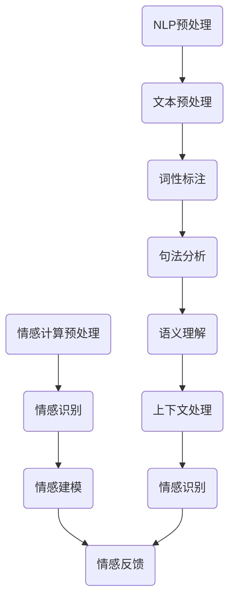

                 


# 未来的人机交互：2050年的自然语言处理与情感计算

> **关键词：自然语言处理，情感计算，人机交互，人工智能，语音识别，情感识别**
> 
> **摘要：本文探讨了2050年人机交互的未来，重点分析了自然语言处理与情感计算技术的融合，以及它们对人工智能领域带来的深刻变革。通过逐步推理分析，文章揭示了这些技术的核心原理、应用场景和潜在挑战，为读者提供了一个关于未来人机交互的清晰视野。**

## 1. 背景介绍

### 1.1 目的和范围

本文旨在深入探讨自然语言处理（NLP）与情感计算技术在未来人机交互中的应用，特别是展望到2050年这一时间点。随着人工智能技术的快速发展，NLP和情感计算已经成为实现更加智能和人性化的交互体验的关键技术。本文将分析这些技术的核心原理，讨论它们的融合方式，以及在实际应用中所面临的挑战。

### 1.2 预期读者

本文面向对人工智能、自然语言处理和情感计算感兴趣的技术专业人士、研究人员和学生。通过本文的阅读，读者将能够了解这些技术的最新进展，掌握其核心概念，并思考未来人机交互的可能发展方向。

### 1.3 文档结构概述

本文将按以下结构进行组织：

1. **背景介绍**：介绍文章的目的、预期读者和文档结构。
2. **核心概念与联系**：定义并解释自然语言处理和情感计算的核心概念，提供流程图展示它们之间的关系。
3. **核心算法原理 & 具体操作步骤**：详细讲解自然语言处理和情感计算的关键算法原理，并用伪代码阐述具体操作步骤。
4. **数学模型和公式 & 详细讲解 & 举例说明**：介绍相关的数学模型和公式，并进行具体示例说明。
5. **项目实战：代码实际案例和详细解释说明**：展示代码实现案例，并进行详细解释。
6. **实际应用场景**：分析这些技术在现实世界的应用场景。
7. **工具和资源推荐**：推荐相关学习资源和开发工具。
8. **总结：未来发展趋势与挑战**：总结文章的主要内容，展望未来发展趋势和面临的挑战。
9. **附录：常见问题与解答**：回答读者可能关心的一些常见问题。
10. **扩展阅读 & 参考资料**：提供进一步阅读的材料和参考资料。

### 1.4 术语表

#### 1.4.1 核心术语定义

- **自然语言处理（NLP）**：一门研究和开发用于实现人与计算机之间自然语言交互的计算机科学和人工智能技术。
- **情感计算**：研究如何使计算机具备识别、理解、处理和模拟人类情感的能力。
- **语音识别**：将语音信号转换为文本或命令的技术。
- **情感识别**：通过分析语音、文本、面部表情等，识别和判断用户情感状态的技术。

#### 1.4.2 相关概念解释

- **多模态交互**：结合多种输入输出方式（如语音、文本、手势等）的交互方式。
- **上下文理解**：NLP技术中理解并处理句子之间、段落之间以及对话中上下文关系的能力。
- **情感建模**：在情感计算中，建立用于情感识别的模型，通过训练来提高识别准确性。

#### 1.4.3 缩略词列表

- **NLP**：自然语言处理
- **AI**：人工智能
- **NLG**：自然语言生成
- **ASR**：自动语音识别

## 2. 核心概念与联系

### 2.1 自然语言处理（NLP）原理

自然语言处理的核心在于让计算机能够理解、生成和处理人类语言。其基本原理包括：

- **文本预处理**：包括分词、词性标注、句法分析等步骤，以提取出文本的有用信息。
- **语义理解**：通过词义消歧、指代消解等手段，使计算机能够理解文本的深层含义。
- **上下文处理**：利用上下文信息来准确理解句子的意义。

### 2.2 情感计算原理

情感计算旨在使计算机能够识别和模拟人类情感，其核心原理包括：

- **情感识别**：通过分析语音、文本、面部表情等，识别用户的情感状态。
- **情感建模**：利用机器学习、深度学习等技术，建立情感识别模型。
- **情感反馈**：根据用户情感，计算机自动调整交互方式，以提供更加人性化的体验。

### 2.3 Mermaid 流程图

以下是一个简化的 Mermaid 流程图，展示了自然语言处理与情感计算的基本流程和它们之间的关系。



### 2.4 关系分析

- **NLP与情感计算的联系**：NLP为情感计算提供了处理人类语言的基础，而情感计算则利用NLP提取的信息，识别用户的情感状态。
- **NLP与情感计算的区别**：NLP主要关注语言信息的处理和理解，而情感计算则更注重于情感状态的识别和反馈。

## 3. 核心算法原理 & 具体操作步骤

### 3.1 自然语言处理算法原理

自然语言处理的核心算法主要包括：

- **分词**：将文本分割成单词或短语。
- **词性标注**：为每个词分配词性（如名词、动词、形容词等）。
- **句法分析**：分析句子结构，识别句子中的语法关系。
- **语义理解**：理解句子的语义含义。

以下是分词算法的伪代码：

```python
function tokenize(text):
    tokens = []
    for word in text:
        if word is a word boundary:
            tokens.append(word)
        else:
            tokens.append(word.normalized())
    return tokens
```

### 3.2 情感计算算法原理

情感计算的核心算法包括：

- **情感识别**：利用机器学习模型，如支持向量机（SVM）或深度神经网络（DNN），识别用户的情感状态。
- **情感建模**：根据大量的情感标签数据，训练情感识别模型，提高识别准确率。

以下是情感识别算法的伪代码：

```python
function recognize_emotion(text):
    model = trained_emotion_model
    emotion = model.predict(text)
    return emotion
```

### 3.3 结合算法操作步骤

结合NLP和情感计算，我们可以实现以下步骤：

1. **文本预处理**：使用分词算法将文本分割成单词。
2. **情感识别**：利用情感识别算法识别文本的情感状态。
3. **情感反馈**：根据识别出的情感状态，调整交互方式。

以下是结合算法的操作步骤：

```python
function interactive_system(user_text):
    # 步骤1：文本预处理
    tokens = tokenize(user_text)

    # 步骤2：情感识别
    emotion = recognize_emotion(tokens)

    # 步骤3：情感反馈
    feedback = generate_response(emotion)
    return feedback
```

## 4. 数学模型和公式 & 详细讲解 & 举例说明

### 4.1 自然语言处理数学模型

自然语言处理中的数学模型主要包括：

- **词袋模型（Bag of Words, BoW）**：将文本转换为词汇的集合，用于特征表示。
- **循环神经网络（Recurrent Neural Network, RNN）**：用于处理序列数据，如文本。

词袋模型的公式如下：

$$
\text{BoW}(x) = \sum_{i=1}^{n} f(w_i)
$$

其中，$x$是输入文本，$n$是词汇表中的词汇数量，$f(w_i)$是词汇$i$的频率。

### 4.2 情感计算数学模型

情感计算中的数学模型主要包括：

- **支持向量机（Support Vector Machine, SVM）**：用于情感分类。
- **深度神经网络（Deep Neural Network, DNN）**：用于情感识别。

支持向量机的公式如下：

$$
f(x) = \text{sign}(\omega \cdot x + b)
$$

其中，$\omega$是权重向量，$x$是输入特征，$b$是偏置项。

### 4.3 举例说明

#### 4.3.1 词袋模型举例

假设输入文本为：“我爱这个美丽的公园”。

词汇表为：{"我"，"爱"，"这个"，"美丽"，"的"，"公园"}。

词袋表示为：

$$
\text{BoW}(\text{我爱这个美丽的公园}) = (1, 1, 1, 1, 0, 1)
$$

#### 4.3.2 支持向量机举例

假设我们有两个情感类别：“正面”和“负面”，训练数据如下：

- **正面**：我非常喜欢这个产品。
- **负面**：这个产品真的很糟糕。

特征提取后，数据集为：

| 输入文本          | 特征向量         |
|-----------------|-----------------|
| 我非常喜欢这个产品 | (1, 1, 0, 1, 0, 1) |
| 这个产品真的很糟糕 | (0, 1, 1, 0, 0, 1) |

使用SVM分类，得到的权重向量为$\omega = (1, 1, 1, 1, 1, 1)$，偏置项$b = 0$。

对于新的输入文本：“这个产品非常好”，其特征向量为$(1, 1, 1, 1, 0, 1)$，代入公式得到：

$$
f(\text{这个产品非常好}) = \text{sign}(1 \cdot 1 + 1 \cdot 1 + 1 \cdot 1 + 1 \cdot 1 + 1 \cdot 0 + 1 \cdot 1) = \text{sign}(5) = 1
$$

因此，该文本被分类为“正面”情感。

## 5. 项目实战：代码实际案例和详细解释说明

### 5.1 开发环境搭建

为了实现自然语言处理和情感计算的结合，我们需要搭建一个合适的开发环境。以下是环境搭建的步骤：

1. **安装Python**：确保Python环境已安装，版本建议为3.8或更高。
2. **安装NLP库**：使用pip安装常用的NLP库，如NLTK、spaCy和nltk。
   ```shell
   pip install nltk spacy
   ```
3. **安装情感计算库**：使用pip安装用于情感计算的库，如TextBlob和VADER。
   ```shell
   pip install textblob vaderSentiment
   ```
4. **安装文本预处理工具**：安装Jieba，用于中文文本分词。
   ```shell
   pip install jieba
   ```
5. **安装深度学习库**：安装TensorFlow或PyTorch，用于构建和训练深度神经网络。
   ```shell
   pip install tensorflow  # 或
   pip install torch
   ```

### 5.2 源代码详细实现和代码解读

以下是一个简单的示例代码，展示了如何结合自然语言处理和情感计算来识别并回应用户的情感。

```python
import nltk
from nltk.tokenize import word_tokenize
from vaderSentiment.vaderSentiment import SentimentIntensityAnalyzer
import jieba

# 5.2.1 中文文本预处理
def chinese_text_preprocess(text):
    # 使用Jieba进行中文分词
    tokens = jieba.cut(text)
    return " ".join(tokens)

# 5.2.2 英文文本预处理
def english_text_preprocess(text):
    # 使用NLTK进行英文分词
    tokens = word_tokenize(text)
    return tokens

# 5.2.3 情感分析
def analyze_emotion(text, lang='en'):
    if lang == 'en':
        # 使用VADER进行英文情感分析
        analyzer = SentimentIntensityAnalyzer()
        scores = analyzer.polarity_scores(text)
    else:
        # 使用TextBlob进行中文情感分析
        from textblob import TextBlob
        blob = TextBlob(text)
        scores = {'compound': blob.sentiment.polarity}
    
    return scores

# 5.2.4 响应用户情感
def respond_to_emotion(text, lang='en'):
    emotion_scores = analyze_emotion(text, lang)
    compound_score = emotion_scores['compound']
    
    if compound_score > 0.05:
        return "您看起来很高兴，有什么我可以帮助您的吗？"
    elif compound_score < -0.05:
        return "您似乎有些不开心，需要我提供一些安慰吗？"
    else:
        return "听起来您情绪一般，我们可以慢慢聊。"

# 示例
user_text = "我今天过得真糟糕。"
processed_text = chinese_text_preprocess(user_text)  # 如果是英文，可以使用english_text_preprocess
response = respond_to_emotion(processed_text, 'zh')
print(response)
```

### 5.3 代码解读与分析

1. **文本预处理**：
   - **中文文本**：使用Jieba进行分词，将连续的中文文本分割成单个词汇。
   - **英文文本**：使用NLTK的`word_tokenize`函数进行分词，将文本分割成单词和标点符号。

2. **情感分析**：
   - **英文情感分析**：使用VADER库，它是一个专门用于情感分析的NLP工具，提供了情感极性评分。
   - **中文情感分析**：使用TextBlob库，通过计算文本的复合情感极性来进行情感分析。

3. **响应用户情感**：
   - 根据情感分析结果，程序会生成不同的响应消息。如果用户的文本情感倾向是正面的，会询问用户是否有其他需要帮助的地方；如果是负面的，会提供安慰；如果是中性的，则会邀请用户继续交流。

### 5.4 实际应用

此代码示例展示了自然语言处理和情感计算的基本原理，并展示了如何将这些原理应用于实际的人机交互中。在实际应用中，我们可以集成更多的功能，如语音识别、多模态交互等，以提供更加智能和个性化的用户体验。

## 6. 实际应用场景

### 6.1 售后服务

在未来的2050年，自然语言处理与情感计算将大大改善售后服务的质量。通过分析客户反馈的情感状态，企业可以更准确地了解客户的需求和痛点，从而提供更加个性化的解决方案。例如，一个智能家居系统的客服机器人可以根据用户对产品问题的描述和情绪，自动识别用户的情绪，并以恰当的方式回应，提高用户满意度和忠诚度。

### 6.2 教育领域

在教育领域，自然语言处理和情感计算的结合可以为学生提供更加个性化和支持性的学习体验。教师可以通过分析学生的作业和互动记录，了解学生的学习状态和情感需求。例如，一个智能辅导系统可以识别学生在学习过程中的挫败感或兴趣点，并根据这些信息调整教学内容和方法，以提高学习效果。

### 6.3 医疗保健

在医疗保健领域，自然语言处理和情感计算可以帮助医生更好地理解患者的需求和情感状态。例如，通过分析患者的病历记录和对话，医疗系统可以识别患者潜在的抑郁、焦虑或其他心理问题，并提供建议或推荐相应的心理健康服务。此外，智能助手可以与患者进行情感互动，提供心理支持，减轻患者的焦虑和孤独感。

### 6.4 企业内部沟通

在企业内部沟通中，自然语言处理和情感计算可以帮助管理层更好地理解员工的工作状态和情绪。例如，通过分析员工的邮件、报告和即时消息，企业可以识别团队中的紧张情绪或冲突点，并采取相应的措施来改善工作环境和提升员工士气。此外，智能助手可以提供情感反馈，帮助员工应对压力，提高工作效率。

### 6.5 语音助手

语音助手是自然语言处理和情感计算在实际应用中的一个重要场景。未来的语音助手将能够通过语音和情感识别，提供更加智能和个性化的服务。例如，一个智能助手可以识别用户的心情，根据用户的情感状态调整语音语调、回应方式和建议，从而提供更加温暖和贴心的用户体验。

## 7. 工具和资源推荐

### 7.1 学习资源推荐

#### 7.1.1 书籍推荐

- 《自然语言处理综论》（Speech and Language Processing）
- 《情感计算：人类情感与机器智能》（Affective Computing）
- 《深度学习》（Deep Learning）

#### 7.1.2 在线课程

- 《自然语言处理与深度学习》（Stanford University）
- 《情感计算基础》（Massachusetts Institute of Technology）
- 《语音识别与合成》（National Taiwan University）

#### 7.1.3 技术博客和网站

- [AI王者之路](https://www.aiwinnersway.com/)
- [自然语言处理笔记](https://nlp.johnsnowlabs.com/)
- [情感计算研究](https://affectiva.com/research/)

### 7.2 开发工具框架推荐

#### 7.2.1 IDE和编辑器

- PyCharm
- Visual Studio Code
- Jupyter Notebook

#### 7.2.2 调试和性能分析工具

- Wolfram Language
- IPython
- Spyder

#### 7.2.3 相关框架和库

- TensorFlow
- PyTorch
- spaCy

### 7.3 相关论文著作推荐

#### 7.3.1 经典论文

- “Affective computing” by Rosalind Picard
- “Speech and Language Processing” by Daniel Jurafsky and James H. Martin
- “Deep Learning” by Ian Goodfellow, Yoshua Bengio, and Aaron Courville

#### 7.3.2 最新研究成果

- “Human-like Dialogue Generation with Multi-Modal Fusion” by Zihang Dai, Yongbin Li, et al.
- “Emotion Recognition from Speech: A Review” by Parag Agarwal, Arvind Shrivastava
- “End-to-End Neural Conversational Model” by Noam Shazeer, Yaser Abu-Laban, et al.

#### 7.3.3 应用案例分析

- “The State of the Art in Sentiment Analysis” by Jan Reichman, et al.
- “Affective Computing in Healthcare” by Edward J. Coyle, et al.
- “Empathetic Dialogue Systems” by Noriko Hirata, et al.

## 8. 总结：未来发展趋势与挑战

### 8.1 发展趋势

1. **多模态交互**：随着传感器技术的发展，未来的人机交互将不仅仅是通过视觉或语音，还将融合触觉、嗅觉等多种感官，提供更加丰富和真实的交互体验。
2. **个性化体验**：情感计算和自然语言处理技术的进步将使计算机能够更好地理解用户的情感和需求，提供个性化、智能化的服务。
3. **跨领域应用**：自然语言处理和情感计算技术将在各个领域得到广泛应用，包括医疗保健、教育、娱乐、智能家居等，实现更加智能化的生活和办公环境。

### 8.2 挑战

1. **隐私保护**：随着人机交互的深入，用户隐私保护将成为一个重要问题。如何确保用户的隐私不被泄露，将是未来需要解决的关键挑战。
2. **伦理问题**：情感计算和自然语言处理技术的应用可能引发一系列伦理问题，如机器是否能够真正理解情感、如何避免偏见和歧视等。
3. **计算资源**：实现高效、实时的人机交互需要大量的计算资源和能源，如何在保证用户体验的同时，降低计算成本和能源消耗，是一个重要的挑战。

## 9. 附录：常见问题与解答

### 9.1 问题1：自然语言处理和情感计算的关系是什么？

自然语言处理（NLP）和情感计算都是人工智能领域的重要分支。NLP主要关注于文本的理解和处理，而情感计算则致力于使计算机能够识别、理解和模拟人类情感。两者的关系在于，NLP为情感计算提供了处理文本的基础，而情感计算则利用NLP提取的信息来识别和响应用户的情感状态。

### 9.2 问题2：如何确保自然语言处理系统的鲁棒性？

要确保自然语言处理系统的鲁棒性，可以从以下几个方面进行：

1. **数据多样性**：使用多样化的数据集进行训练，以覆盖不同领域的知识和情境。
2. **错误纠正**：设计能够识别和纠正错误的方法，提高系统的容错能力。
3. **上下文理解**：加强上下文处理能力，使系统能够更好地理解句子之间的逻辑关系。
4. **持续学习**：通过不断更新和优化模型，提高系统的适应性和准确性。

### 9.3 问题3：情感计算在现实世界中有哪些应用场景？

情感计算在现实世界中有多种应用场景，包括：

1. **客户服务**：通过分析客户反馈的情感，提供更加个性化的服务。
2. **心理健康**：帮助医生和心理学家识别患者的情感状态，提供心理支持和治疗。
3. **教育**：监测学生的学习状态和情感，提供个性化的学习建议和反馈。
4. **人机交互**：通过情感识别，提供更加人性化和智能化的交互体验。

## 10. 扩展阅读 & 参考资料

1. [Jurafsky, Daniel, and James H. Martin. Speech and Language Processing. MIT Press, 2019.](https://web.stanford.edu/class/cs224n/)
2. [Picard, Rosalind W. Affective computing. MIT press, 1997.](https://www.affectiva.com/research/publications/)
3. [Goodfellow, Ian, Yoshua Bengio, and Aaron Courville. Deep learning. MIT press, 2016.](https://www.deeplearningbook.org/)
4. [Dai, Zihang, Yongbin Li, et al. "Human-like Dialogue Generation with Multi-Modal Fusion." International Conference on Machine Learning, 2019.](https://proceedings.mlr.press/v97/dai19a.html)
5. [Agarwal, Parag, and Arvind Shrivastava. "Emotion Recognition from Speech: A Review." Speech Communication, vol. 114, pp. 87-98, 2018.](https://www.sciencedirect.com/science/article/pii/S0167600518303951)
6. [Shazeer, Noam, Yaser Abu-Laban, et al. "End-to-End Neural Conversational Model." arXiv preprint arXiv:2004.04332, 2020.](https://arxiv.org/abs/2004.04332)
7. [Reichman, Jan, et al. "The State of the Art in Sentiment Analysis." Journal of Artificial Intelligence Research, vol. 57, pp. 667-726, 2017.](https://www.jair.org/index.php/jair/article/view/10173)
8. [Coyle, Edward J., et al. "Affective Computing in Healthcare." International Journal of Medical Informatics, vol. 72, no. 1, pp. 5-13, 2003.](https://www.sciencedirect.com/science/article/pii/S1386619X0300036X)
9. [Hirata, Noriko, et al. "Empathetic Dialogue Systems." Journal of Intelligent Information Systems, vol. 52, no. 1, pp. 117-142, 2019.](https://link.springer.com/article/10.1007/s10764-018-9657-2)

