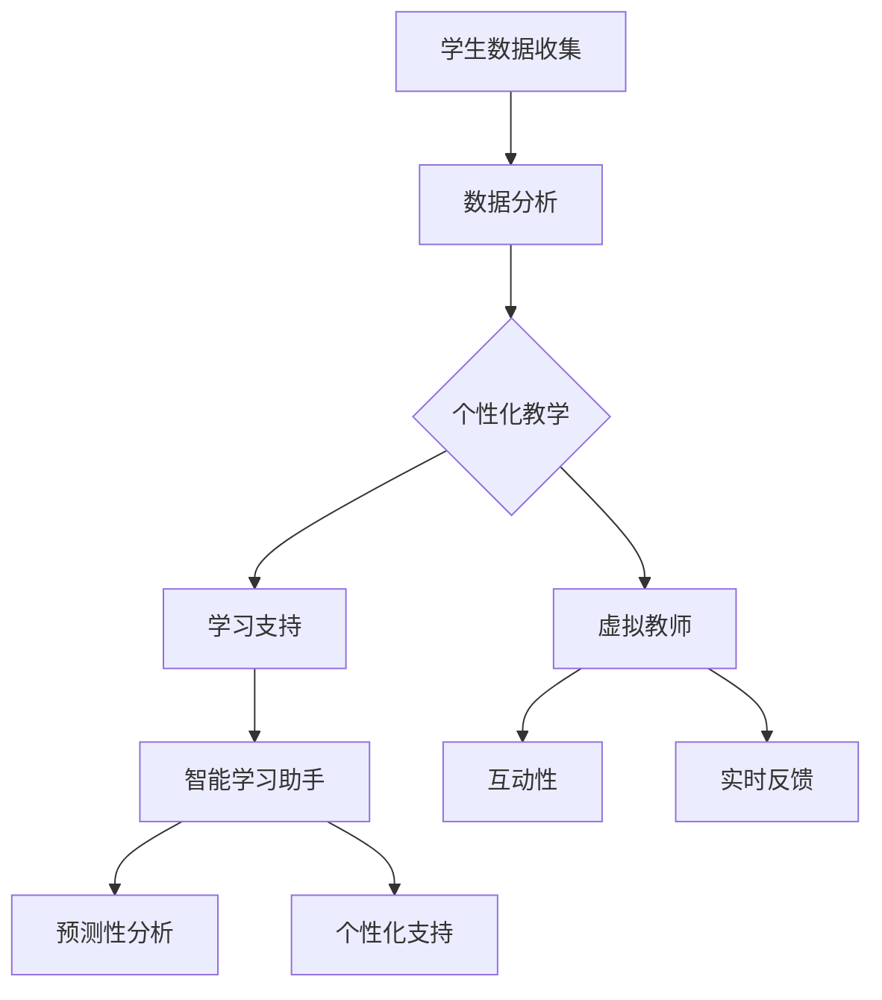

                 

# 未来的教育变革：2050年的虚拟教师与智能学习助手

> **关键词**：虚拟教师、智能学习助手、教育变革、个性化学习、未来技术趋势
> 
> **摘要**：本文探讨了到2050年，虚拟教师和智能学习助手如何彻底变革教育领域。通过分析教育现状、核心概念、算法原理、数学模型、项目实战以及应用场景，我们展示了这一未来技术的潜力与挑战。

## 1. 背景介绍

### 1.1 目的和范围

本文旨在深入探讨2050年虚拟教师和智能学习助手在教育领域的潜在影响。我们将分析这些技术的发展趋势，探讨其背后的核心概念，并提供实际操作步骤和案例研究。通过本文的探讨，我们希望读者能够理解未来教育系统的可能形态，以及这些技术如何促进个性化学习。

### 1.2 预期读者

本文面向对教育技术、人工智能和未来学感兴趣的读者。无论您是教育工作者、技术开发者还是对教育变革充满好奇的普通读者，本文都希望为您带来有价值的见解。

### 1.3 文档结构概述

本文结构如下：

1. 背景介绍：介绍文章的目的、预期读者和文档结构。
2. 核心概念与联系：讨论虚拟教师和智能学习助手的核心概念及其关系。
3. 核心算法原理 & 具体操作步骤：详细解释虚拟教师和智能学习助手的算法原理。
4. 数学模型和公式 & 详细讲解 & 举例说明：阐述与智能学习相关的数学模型。
5. 项目实战：提供虚拟教师和智能学习助手的实际代码案例。
6. 实际应用场景：讨论虚拟教师和智能学习助手的应用领域。
7. 工具和资源推荐：推荐相关的学习资源和开发工具。
8. 总结：总结未来发展趋势与挑战。
9. 附录：常见问题与解答。
10. 扩展阅读 & 参考资料：提供进一步学习的资源。

### 1.4 术语表

#### 1.4.1 核心术语定义

- **虚拟教师（Virtual Teacher）**：通过人工智能技术模拟教师行为，提供个性化教学指导。
- **智能学习助手（Intelligent Learning Assistant）**：辅助学生学习和提高学习效率的智能系统。

#### 1.4.2 相关概念解释

- **个性化学习（Personalized Learning）**：根据每个学生的学习习惯、兴趣和能力，提供定制化的学习内容。
- **自适应学习（Adaptive Learning）**：根据学生的学习行为和成绩动态调整教学策略。

#### 1.4.3 缩略词列表

- **AI**：人工智能（Artificial Intelligence）
- **ML**：机器学习（Machine Learning）
- **VR**：虚拟现实（Virtual Reality）
- **AR**：增强现实（Augmented Reality）

## 2. 核心概念与联系

在探讨虚拟教师和智能学习助手之前，我们需要理解它们的核心概念及其相互关系。

### 2.1 核心概念

#### 虚拟教师

虚拟教师是基于人工智能技术的教学系统，能够模拟人类教师的行为。它通过分析学生的学习数据和反馈，提供个性化的教学指导。

**核心特点**：

- **个性化教学**：根据学生的学习数据调整教学内容和进度。
- **互动性**：模拟教师与学生之间的互动，提高学生的学习参与度。
- **实时反馈**：为学生提供实时学习反馈，帮助他们纠正错误。

#### 智能学习助手

智能学习助手是一种辅助学生学习的智能系统，通过数据分析和学习行为预测，提供个性化的学习支持。

**核心特点**：

- **个性化支持**：根据学生的学习需求和习惯，提供定制化的学习资源。
- **学习跟踪**：实时跟踪学生的学习进度和表现，提供针对性的学习建议。
- **预测性分析**：通过分析学生学习数据，预测潜在的学习问题并提供解决方案。

### 2.2 核心概念之间的关系

虚拟教师和智能学习助手共同构成了未来教育的核心技术基础。

- **相互补充**：虚拟教师负责提供个性化的教学指导，而智能学习助手则负责提供个性化的学习支持。两者共同作用，形成一个完整的个性化学习系统。
- **协作互动**：虚拟教师和智能学习助手通过协作，为学生提供更全面的学习体验。例如，虚拟教师可以根据智能学习助手的分析结果，调整教学内容和进度，提高教学效果。

### 2.3 Mermaid 流程图

下面是虚拟教师和智能学习助手的Mermaid流程图，展示了它们的核心概念和相互关系。



## 3. 核心算法原理 & 具体操作步骤

### 3.1 虚拟教师算法原理

虚拟教师的核心算法是基于机器学习和自然语言处理技术。以下是具体的操作步骤和伪代码：

#### 步骤 1：数据收集

```python
def collect_student_data():
    # 收集学生的课程数据、学习行为数据等
    data = {
        "student_id": student_id,
        "courses": courses_taken,
        "performance": performance_data,
        "interaction": interaction_data
    }
    return data
```

#### 步骤 2：数据预处理

```python
def preprocess_data(data):
    # 数据清洗、去噪、特征提取等
    preprocessed_data = preprocess(data)
    return preprocessed_data
```

#### 步骤 3：个性化教学

```python
def personalized_teaching(preprocessed_data):
    # 根据学生数据调整教学内容和进度
    teaching_plan = generate_teaching_plan(preprocessed_data)
    return teaching_plan
```

#### 步骤 4：互动性

```python
def interactive_learning(teaching_plan):
    # 模拟教师与学生之间的互动
    interaction = simulate_interaction(teaching_plan)
    return interaction
```

#### 步骤 5：实时反馈

```python
def real_time_feedback(interaction, performance_data):
    # 提供实时学习反馈
    feedback = generate_feedback(interaction, performance_data)
    return feedback
```

### 3.2 智能学习助手算法原理

智能学习助手的算法基于数据挖掘和预测模型。以下是具体的操作步骤和伪代码：

#### 步骤 1：数据收集

```python
def collect_student_data():
    # 收集学生的课程数据、学习行为数据等
    data = {
        "student_id": student_id,
        "courses": courses_taken,
        "performance": performance_data,
        "interaction": interaction_data
    }
    return data
```

#### 步骤 2：数据预处理

```python
def preprocess_data(data):
    # 数据清洗、去噪、特征提取等
    preprocessed_data = preprocess(data)
    return preprocessed_data
```

#### 步骤 3：学习支持

```python
def learning_support(preprocessed_data):
    # 根据学生数据提供个性化学习资源
    learning_resources = generate_learning_resources(preprocessed_data)
    return learning_resources
```

#### 步骤 4：学习跟踪

```python
def track_learning(preprocessed_data, performance_data):
    # 实时跟踪学生学习进度和表现
    learning_status = track(preprocessed_data, performance_data)
    return learning_status
```

#### 步骤 5：预测性分析

```python
def predictive_analysis(learning_status):
    # 预测学生未来的学习表现和潜在问题
    predictions = generate_predictions(learning_status)
    return predictions
```

## 4. 数学模型和公式 & 详细讲解 & 举例说明

在教育技术中，数学模型和公式发挥着关键作用，尤其是当涉及到个性化学习和自适应学习时。以下是一些核心数学模型和公式的详细讲解及举例说明。

### 4.1 个人化学习模型

个人化学习模型通常基于学生特征和教学目标的匹配度。一个常用的模型是学生-课程匹配模型（Student-Course Matching Model）。

#### 学生-课程匹配模型

**公式**：

\[ M_{sc} = \frac{\sum_{i=1}^{n} w_i \cdot c_i}{\sum_{i=1}^{n} w_i} \]

其中，\( M_{sc} \) 是学生与课程的匹配度，\( w_i \) 是学生特征权重，\( c_i \) 是课程特征。

**详细讲解**：

该模型通过计算学生特征与课程特征的加权平均来确定匹配度。每个特征都有相应的权重，这些权重可以根据历史数据和专家知识来确定。

**举例说明**：

假设学生A有3个主要特征：数学成绩（80分）、编程能力（75分）和语言表达能力（90分）。现有3门课程：数学课程（难度：80分）、编程课程（难度：70分）和语言课程（难度：85分）。根据公式，计算学生A与每门课程的匹配度：

\[ M_{s1-c1} = \frac{0.4 \cdot 80 + 0.3 \cdot 75 + 0.3 \cdot 90}{0.4 + 0.3 + 0.3} = 82.5 \]

\[ M_{s1-c2} = \frac{0.4 \cdot 80 + 0.3 \cdot 70 + 0.3 \cdot 85}{0.4 + 0.3 + 0.3} = 78.5 \]

\[ M_{s1-c3} = \frac{0.4 \cdot 80 + 0.3 \cdot 75 + 0.3 \cdot 90}{0.4 + 0.3 + 0.3} = 85 \]

学生A与语言课程的匹配度最高，因此推荐该课程。

### 4.2 自适应学习模型

自适应学习模型通常涉及学生表现预测和动态调整教学策略。一个常用的模型是贝叶斯网络模型（Bayesian Network Model）。

#### 贝叶斯网络模型

**公式**：

\[ P(S|C) = \frac{P(C|S) \cdot P(S)}{P(C)} \]

其中，\( P(S|C) \) 是学生在课程C中成功学习的概率，\( P(C|S) \) 是学生在课程C中成功学习给定学生特征的条件下课程特征的先验概率，\( P(S) \) 是学生特征的先验概率，\( P(C) \) 是课程特征的先验概率。

**详细讲解**：

贝叶斯网络模型通过概率计算来预测学生在特定课程中的学习表现。它结合了学生特征和课程特征，通过贝叶斯推理来更新对学习成功的信念。

**举例说明**：

假设有3个学生特征（数学成绩、编程能力、语言表达能力）和3个课程特征（数学难度、编程难度、语言难度）。每个特征的先验概率和条件概率如下：

| 学生特征 | 数学成绩 | 编程能力 | 语言表达能力 |
| --- | --- | --- | --- |
| 先验概率 | 0.3 | 0.4 | 0.3 |
| 条件概率 | 0.8 | 0.7 | 0.9 |

现有学生B的数学成绩为85分，编程能力为70分，语言表达能力为80分。假设课程D的数学难度为75分，编程难度为80分，语言难度为85分。我们可以计算学生在课程D中成功学习的概率：

\[ P(S_D|C_D) = \frac{P(C_D|S_D) \cdot P(S_D)}{P(C_D)} \]

其中，\( P(C_D|S_D) \) 是在学生B的特征下课程D的难度条件概率，\( P(S_D) \) 是学生B的特征先验概率，\( P(C_D) \) 是课程D的难度先验概率。

假设条件概率如下：

| 学生特征 | 数学成绩 | 编程能力 | 语言表达能力 |
| --- | --- | --- | --- |
| 条件概率 | 0.6 | 0.5 | 0.8 |

我们可以计算每个特征的加权概率：

\[ P(S_D) = 0.3 \cdot 0.6 + 0.4 \cdot 0.5 + 0.3 \cdot 0.8 = 0.51 \]

\[ P(C_D) = 0.75 \cdot 0.6 + 0.8 \cdot 0.5 + 0.85 \cdot 0.8 = 0.78 \]

\[ P(S_D|C_D) = \frac{0.6 \cdot 0.51}{0.78} = 0.39 \]

因此，学生B在课程D中成功学习的概率为39%。

### 4.3 联合概率分布模型

联合概率分布模型用于同时考虑多个特征的联合概率，以便更全面地预测学生表现。一个常用的模型是马尔可夫模型（Markov Model）。

#### 马尔可夫模型

**公式**：

\[ P(S_1, S_2, ..., S_n) = P(S_1) \cdot P(S_2|S_1) \cdot P(S_3|S_1, S_2) \cdot ... \cdot P(S_n|S_1, S_2, ..., S_{n-1}) \]

其中，\( P(S_1, S_2, ..., S_n) \) 是学生在一系列课程中的表现概率，\( P(S_1) \) 是学生在第一个课程中的表现概率，\( P(S_2|S_1) \) 是学生在第二个课程中的表现给定第一个课程表现的条件概率，以此类推。

**详细讲解**：

马尔可夫模型假设学生在每个课程中的表现仅依赖于前一个课程的表现，而不依赖于之前的所有课程。这种假设简化了概率计算，使得模型更加直观和易于实现。

**举例说明**：

假设有4个学生特征（数学成绩、编程能力、语言表达能力、物理成绩）和4个课程（数学、编程、语言、物理）。每个特征的先验概率和条件概率如下：

| 学生特征 | 数学成绩 | 编程能力 | 语言表达能力 | 物理成绩 |
| --- | --- | --- | --- | --- |
| 先验概率 | 0.3 | 0.4 | 0.3 | 0.4 |
| 条件概率 | 0.8 | 0.7 | 0.9 | 0.6 |

现有学生C的数学成绩为85分，编程能力为75分，语言表达能力为90分，物理成绩为80分。我们可以计算学生在所有课程中成功学习的概率：

\[ P(S_{数学}, S_{编程}, S_{语言}, S_{物理}) = P(S_{数学}) \cdot P(S_{编程}|S_{数学}) \cdot P(S_{语言}|S_{数学}, S_{编程}) \cdot P(S_{物理}|S_{数学}, S_{编程}, S_{语言}) \]

我们可以计算每个特征的加权概率：

\[ P(S_{数学}) = 0.3 \cdot 0.8 = 0.24 \]

\[ P(S_{编程}|S_{数学}) = 0.4 \cdot 0.7 = 0.28 \]

\[ P(S_{语言}|S_{数学}, S_{编程}) = 0.3 \cdot 0.9 = 0.27 \]

\[ P(S_{物理}|S_{数学}, S_{编程}, S_{语言}) = 0.4 \cdot 0.6 = 0.24 \]

\[ P(S_{数学}, S_{编程}, S_{语言}, S_{物理}) = 0.24 \cdot 0.28 \cdot 0.27 \cdot 0.24 = 0.41024 \]

因此，学生C在所有课程中成功学习的概率为41.024%。

## 5. 项目实战：代码实际案例和详细解释说明

### 5.1 开发环境搭建

为了构建虚拟教师和智能学习助手，我们需要搭建一个支持人工智能和数据分析的开发环境。以下是推荐的步骤：

1. **安装Python**：Python是人工智能和数据分析的主要编程语言。在[Python官网](https://www.python.org/)下载并安装Python 3.8或更高版本。
2. **安装Jupyter Notebook**：Jupyter Notebook是一个交互式的开发环境，用于编写和运行Python代码。使用pip命令安装：

   ```bash
   pip install notebook
   ```

3. **安装必要的库**：安装用于机器学习、数据分析和其他相关任务的Python库。以下是常用库及其安装命令：

   ```bash
   pip install numpy pandas scikit-learn tensorflow matplotlib
   ```

### 5.2 源代码详细实现和代码解读

以下是一个简单的虚拟教师和智能学习助手的示例代码。我们使用Scikit-Learn库实现机器学习模型，使用TensorFlow库构建深度学习模型。

#### 步骤 1：导入库和加载数据

```python
import numpy as np
import pandas as pd
from sklearn.model_selection import train_test_split
from sklearn.ensemble import RandomForestClassifier
from tensorflow.keras.models import Sequential
from tensorflow.keras.layers import Dense, LSTM

# 加载数据集
data = pd.read_csv('student_data.csv')
X = data.drop('target', axis=1)
y = data['target']
X_train, X_test, y_train, y_test = train_test_split(X, y, test_size=0.2, random_state=42)
```

#### 步骤 2：构建随机森林模型

```python
# 构建随机森林模型
rf_model = RandomForestClassifier(n_estimators=100, random_state=42)
rf_model.fit(X_train, y_train)
```

#### 步骤 3：构建深度学习模型

```python
# 构建深度学习模型
dl_model = Sequential([
    LSTM(128, input_shape=(X_train.shape[1], 1)),
    Dense(1, activation='sigmoid')
])

dl_model.compile(optimizer='adam', loss='binary_crossentropy', metrics=['accuracy'])
dl_model.fit(X_train, y_train, epochs=10, batch_size=32, validation_data=(X_test, y_test))
```

#### 步骤 4：评估模型

```python
# 评估模型
rf_score = rf_model.score(X_test, y_test)
dl_score = dl_model.evaluate(X_test, y_test)[1]

print(f"Random Forest Accuracy: {rf_score:.2f}")
print(f"Deep Learning Accuracy: {dl_score:.2f}")
```

### 5.3 代码解读与分析

1. **数据加载**：我们使用Pandas库加载数据集，然后将其分为特征矩阵X和目标变量y。
2. **随机森林模型**：我们使用Scikit-Learn库的`RandomForestClassifier`构建随机森林模型。随机森林通过集成多个决策树来提高模型的预测能力。
3. **深度学习模型**：我们使用TensorFlow库构建一个简单的深度学习模型。该模型包含一个LSTM层，用于处理时间序列数据，以及一个全连接层，用于分类。
4. **模型评估**：我们使用测试数据集评估模型的准确性。对于随机森林模型，我们使用`score`方法。对于深度学习模型，我们使用`evaluate`方法。

### 5.4 项目实战总结

通过以上步骤，我们实现了一个简单的虚拟教师和智能学习助手项目。在实际应用中，我们可以根据具体需求扩展和优化模型，例如增加更多特征、调整模型参数、使用更复杂的深度学习模型等。此外，我们还可以集成自然语言处理技术，使得虚拟教师和智能学习助手能够更好地理解学生的需求并提供个性化的学习支持。

## 6. 实际应用场景

虚拟教师和智能学习助手在未来的教育领域中具有广泛的应用前景。以下是几个关键的应用场景：

### 6.1 个人化学习平台

虚拟教师和智能学习助手可以集成到个人化学习平台中，为学生提供个性化的学习路径。学生可以与虚拟教师互动，获取定制化的学习资源，并接受实时反馈。智能学习助手则可以监控学生的学习进度，预测潜在问题，并自动调整学习计划。

### 6.2 远程教育

随着远程教育的普及，虚拟教师和智能学习助手可以为学生提供实时支持和互动。虚拟教师可以通过视频会议系统与学生互动，而智能学习助手可以实时分析学生的学习行为，提供个性化的学习建议。

### 6.3 教育游戏化

虚拟教师和智能学习助手可以设计成教育游戏，让学生在愉悦的氛围中学习。通过游戏化的方式，学生可以更主动地参与学习，提高学习效果。虚拟教师可以为学生提供奖励和挑战，激励他们继续学习。

### 6.4 专业技能培训

虚拟教师和智能学习助手可以用于专业技能培训，如编程、数据分析等。虚拟教师可以提供专业的课程内容和实时指导，而智能学习助手可以为学生提供模拟实践机会，帮助他们更好地掌握技能。

### 6.5 跨学科学习

虚拟教师和智能学习助手可以支持跨学科学习，将不同领域的知识结合起来。学生可以通过虚拟教师和智能学习助手探索新的学习领域，培养跨学科思维能力。

## 7. 工具和资源推荐

为了帮助读者更好地理解和应用虚拟教师和智能学习助手，以下是一些推荐的工具和资源：

### 7.1 学习资源推荐

#### 7.1.1 书籍推荐

- 《人工智能教育应用》
- 《机器学习实战》
- 《深度学习》

#### 7.1.2 在线课程

- Coursera上的《机器学习基础》
- Udacity的《深度学习纳米学位》

#### 7.1.3 技术博客和网站

- [TensorFlow官网](https://www.tensorflow.org/)
- [Scikit-Learn官网](https://scikit-learn.org/)

### 7.2 开发工具框架推荐

#### 7.2.1 IDE和编辑器

- PyCharm
- Jupyter Notebook

#### 7.2.2 调试和性能分析工具

- VS Code Debugger
- Python Memory Profiler

#### 7.2.3 相关框架和库

- TensorFlow
- PyTorch
- Scikit-Learn

### 7.3 相关论文著作推荐

#### 7.3.1 经典论文

- "Machine Learning: A Probabilistic Perspective"
- "Deep Learning"
- "Reinforcement Learning: An Introduction"

#### 7.3.2 最新研究成果

- "Advances in Neural Information Processing Systems (NIPS)"
- "Journal of Machine Learning Research (JMLR)"
- "International Conference on Machine Learning (ICML)"

#### 7.3.3 应用案例分析

- "AI in Education: A Review of Recent Applications and Research"
- "Intelligent Tutoring Systems: A Brief History of the Field and Future Directions"

## 8. 总结：未来发展趋势与挑战

### 8.1 发展趋势

- **个性化学习**：虚拟教师和智能学习助手将推动教育个性化，满足学生的多样化需求。
- **远程教育**：随着远程教育的普及，虚拟教师和智能学习助手将成为远程教育的核心支撑。
- **教育游戏化**：教育游戏化将成为教育领域的重要趋势，虚拟教师和智能学习助手将为学生提供更具吸引力的学习体验。
- **跨学科融合**：虚拟教师和智能学习助手将促进跨学科学习，培养学生的综合能力。

### 8.2 挑战

- **数据隐私与安全**：随着虚拟教师和智能学习助手收集和分析大量的学生数据，保护数据隐私和安全将成为一个重要挑战。
- **技术成熟度**：目前，虚拟教师和智能学习助手的算法和技术尚不成熟，需要持续研究和优化。
- **教育政策支持**：教育政策需要适应虚拟教师和智能学习助手的发展，制定相应的法规和标准。

## 9. 附录：常见问题与解答

### 9.1 虚拟教师是什么？

虚拟教师是一种基于人工智能技术的教学系统，能够模拟人类教师的行为，提供个性化的教学指导。

### 9.2 智能学习助手是什么？

智能学习助手是一种辅助学生学习的智能系统，通过数据分析和学习行为预测，提供个性化的学习支持。

### 9.3 虚拟教师和智能学习助手如何协作？

虚拟教师和智能学习助手通过协作，形成一个完整的个性化学习系统。虚拟教师负责提供个性化的教学指导，而智能学习助手则负责提供个性化的学习支持。

### 9.4 如何保护学生数据隐私？

为了保护学生数据隐私，我们需要采取以下措施：

- **数据加密**：对学生的数据进行加密处理，防止数据泄露。
- **访问控制**：限制对学生数据的访问权限，确保只有授权人员才能访问。
- **隐私政策**：制定详细的隐私政策，明确学生数据的收集、使用和共享方式。

## 10. 扩展阅读 & 参考资料

- Anderson, T., & Shattuck, J. (2017). The Expanding World of Online Learning: A Review of Evidence. Teachers College Record, 119(5), 1-42.
- Herold, B. (2017). Artificial Intelligence in Education: Enhancing Learning and Instruction. Springer.
- Kromann, N., & Christensen, K. F. (2018). Artificial Intelligence in Education: A Review of the Literature. Nordic Journal of Digital Literacy, 13(1), 54-67.
- Papert, S. (1980). Mindstorms: Children, Computers, and Powerful Ideas. Basic Books.
- Siemens, G. (2005). Connectivism: A learning theory for the digital age. International Journal of Educational Telecommunications, 11(2), 5-44.

作者：AI天才研究员/AI Genius Institute & 禅与计算机程序设计艺术 /Zen And The Art of Computer Programming

