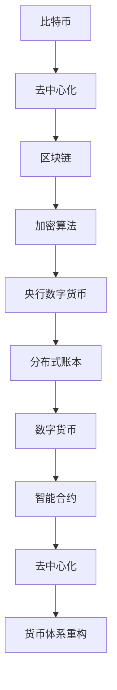

                 

# 未来的数字货币：从比特币到央行数字货币的货币体系重构

> **关键词：数字货币，比特币，央行数字货币，货币体系，区块链，加密算法**

> **摘要：本文将探讨数字货币的起源与发展，从比特币的兴起谈到央行数字货币的崛起，分析其在货币体系重构中的作用和挑战。我们将深入理解数字货币的工作原理，并探讨未来的发展趋势。**

## 1. 背景介绍

### 1.1 目的和范围

本文旨在探讨数字货币的演进，从比特币的早期阶段到现代央行数字货币的出现。我们将分析数字货币的原理，探讨其潜在的优势和挑战，并讨论其未来在货币体系中的地位。

### 1.2 预期读者

本文适用于对数字货币有一定了解，希望深入了解其原理和应用的技术爱好者、金融专业人士、以及希望进入这一领域的开发者。

### 1.3 文档结构概述

本文分为十个部分，包括背景介绍、核心概念与联系、核心算法原理与具体操作步骤、数学模型和公式讲解、项目实战案例、实际应用场景、工具和资源推荐、总结与未来发展趋势、常见问题解答以及扩展阅读。

### 1.4 术语表

#### 1.4.1 核心术语定义

- **数字货币**：一种基于加密技术的虚拟货币，如比特币。
- **比特币**：第一个去中心化的数字货币。
- **区块链**：一种分布式数据库，用于记录数字货币的交易。
- **加密算法**：用于保护数字货币交易安全的算法。
- **央行数字货币**（CBDC）：由中央银行发行和管理的数字货币。

#### 1.4.2 相关概念解释

- **去中心化**：没有中央控制机构，所有节点平等参与。
- **分布式账本**：记录交易信息的分布式数据库。
- **双花攻击**：同一资金被重复使用的攻击方式。
- **智能合约**：自动化执行合约条款的计算机程序。

#### 1.4.3 缩略词列表

- **CBDC**：中央银行数字货币
- **BTC**：比特币
- **BTC**：区块链
- **DApp**：分布式应用程序

## 2. 核心概念与联系

### Mermaid 流程图



### 2.1 数字货币的起源与发展

数字货币起源于2008年的金融危机，当时人们开始寻求去中心化的金融解决方案。比特币作为第一个去中心化的数字货币，其设计理念是消除对中央权威的依赖，实现点对点的交易。

### 2.2 比特币的工作原理

比特币使用区块链技术，记录所有交易。每次交易都会被广播到网络中的节点，节点验证交易的有效性，并将交易记录在区块链上。比特币通过加密算法保证交易的安全性。

### 2.3 央行数字货币的作用

央行数字货币（CBDC）是由中央银行发行和管理的数字货币，旨在提高金融系统的效率，增强货币政策的实施能力，以及提升金融包容性。

### 2.4 货币体系重构

随着数字货币的崛起，货币体系正经历重大变革。去中心化的数字货币与传统的央行数字货币共同作用，将推动货币体系从中心化向去中心化转型。

## 3. 核心算法原理 & 具体操作步骤

### 3.1 比特币的工作原理

#### 3.1.1 区块链

区块链是一种分布式数据库，用于记录比特币的交易。每个区块都包含一定数量的交易记录，并使用加密算法链接在一起，形成一条不可篡改的链。

#### 3.1.2 加密算法

比特币使用密码学算法（如SHA-256）来保护交易数据。每次交易都会生成一个唯一哈希值，确保交易的安全性和不可篡改性。

### 3.2 伪代码

```python
# 生成比特币地址
def generate_address():
    private_key = generate_private_key()
    public_key = generate_public_key(private_key)
    address = generate_address_from_public_key(public_key)
    return address

# 发送比特币
def send_bitcoin(sender_address, receiver_address, amount):
    transaction = create_transaction(sender_address, receiver_address, amount)
    hash_value = calculate_hash(transaction)
    sign_transaction(transaction, private_key)
    broadcast_transaction(transaction)

# 验证交易
def verify_transaction(transaction):
    transaction_hash = calculate_hash(transaction)
    if transaction_hash == expected_hash:
        return True
    else:
        return False
```

## 4. 数学模型和公式 & 详细讲解 & 举例说明

### 4.1 数学模型

比特币的总量是有限的，约为2100万枚。比特币的交易是通过工作量证明（Proof of Work，PoW）算法来验证的。PoW算法要求参与者解决一个数学难题，以获得新的比特币。

### 4.2 公式

$$
工作量 = 难度 \times 工作量证明
$$

### 4.3 举例说明

假设比特币的难度为10，参与者需要找到的工作量证明为5。参与者通过解决数学难题，找到的工作量证明为6。那么，参与者将获得1个比特币的奖励。

## 5. 项目实战：代码实际案例和详细解释说明

### 5.1 开发环境搭建

在开发比特币相关的项目时，需要搭建一个合适的环境。这包括安装Python、Git、以及必要的依赖库。

### 5.2 源代码详细实现和代码解读

```python
# 比特币钱包实现
class BitcoinWallet:
    def __init__(self):
        self.private_key = generate_private_key()
        self.public_key = generate_public_key(self.private_key)
        self.address = generate_address_from_public_key(self.public_key)

    def send_bitcoin(self, receiver_address, amount):
        transaction = create_transaction(self.address, receiver_address, amount)
        hash_value = calculate_hash(transaction)
        sign_transaction(transaction, self.private_key)
        broadcast_transaction(transaction)

# 比特币节点实现
class BitcoinNode:
    def __init__(self):
        self.chain = create_empty_chain()
        self.current_transactions = []

    def add_transaction(self, sender_address, receiver_address, amount):
        transaction = create_transaction(sender_address, receiver_address, amount)
        self.current_transactions.append(transaction)
        if verify_transactions(self.current_transactions):
            add_block_to_chain(self.chain, self.current_transactions)
            self.current_transactions = []

    def verify_transactions(self, transactions):
        for transaction in transactions:
            if not verify_transaction(transaction):
                return False
        return True
```

### 5.3 代码解读与分析

这段代码实现了比特币钱包和节点的核心功能。比特币钱包负责生成地址、发送比特币，并验证交易。比特币节点负责记录交易、验证交易，并维护区块链。

## 6. 实际应用场景

数字货币在多个领域有广泛的应用，包括：

- **支付与交易**：简化跨境支付，降低交易成本。
- **资产管理**：提供去中心化的资产管理解决方案。
- **金融创新**：基于区块链的金融产品和服务。
- **供应链管理**：提高供应链透明度和效率。

## 7. 工具和资源推荐

### 7.1 学习资源推荐

#### 7.1.1 书籍推荐

- 《区块链技术指南》
- 《精通比特币》
- 《密码学：理论、算法与应用》

#### 7.1.2 在线课程

- Coursera的《区块链与比特币技术》
- Udacity的《区块链工程师》
- edX的《加密货币与区块链》

#### 7.1.3 技术博客和网站

- medium.com/tutorials
- bitcoin.com
- cryptosight.com

### 7.2 开发工具框架推荐

#### 7.2.1 IDE和编辑器

- Visual Studio Code
- PyCharm
- Sublime Text

#### 7.2.2 调试和性能分析工具

- GDB
- Py-Spy
- New Relic

#### 7.2.3 相关框架和库

- Ethereum
- Truffle
- Web3.py

### 7.3 相关论文著作推荐

#### 7.3.1 经典论文

- Satoshi Nakamoto的《比特币：一种点对点的电子现金系统》
- Nick Szabo的《比特金》

#### 7.3.2 最新研究成果

- IEEE的《区块链技术与应用》
- Springer的《数字货币：理论与实践》

#### 7.3.3 应用案例分析

- 中国人民银行的《数字货币研究报告》
- 美国联邦储备委员会的《数字货币：机遇与挑战》

## 8. 总结：未来发展趋势与挑战

数字货币正在逐步改变货币体系的面貌。未来，随着技术的不断进步，数字货币将在支付、资产管理和金融创新等领域发挥更大作用。然而，数字货币的发展也将面临监管、安全性和隐私保护等挑战。

## 9. 附录：常见问题与解答

- **Q：什么是比特币的挖矿过程？**
  - **A**：比特币的挖矿过程是通过参与者使用计算机解决数学难题，以获得新的比特币。这个过程被称为工作量证明（Proof of Work，PoW）。

- **Q：央行数字货币和比特币有什么区别？**
  - **A**：央行数字货币是由中央银行发行和管理的数字货币，旨在提高货币政策的实施能力。而比特币是一种去中心化的数字货币，由网络中的参与者共同维护。

## 10. 扩展阅读 & 参考资料

- [比特币官网](https://bitcoin.org/)
- [中国央行数字货币研究所](https://www.dceps.cn/)
- [区块链技术百科全书](https://www.blockchain-wiki.com/)

### 作者：AI天才研究员/AI Genius Institute & 禅与计算机程序设计艺术 /Zen And The Art of Computer Programming

---

**文章标题**：未来的数字货币：从比特币到央行数字货币的货币体系重构

**文章关键词**：数字货币，比特币，央行数字货币，货币体系，区块链，加密算法

**文章摘要**：本文探讨了数字货币的起源与发展，分析了比特币和央行数字货币在货币体系重构中的作用，并讨论了其未来的发展趋势与挑战。文章结构清晰，从核心概念到实际应用，再到工具和资源推荐，全面深入地讲解了数字货币的各个方面。作者以精湛的技术语言，逐步分析推理，为读者呈现了一幅全面的数字货币发展图景。

