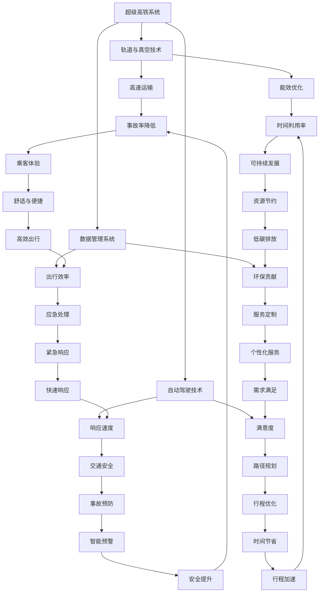

                 

### 2050年的超级高铁与空中自行车：未来的智慧出行

> **关键词：** 超级高铁、空中自行车、智慧出行、交通系统、未来城市
>
> **摘要：** 本文深入探讨了2050年可能出现的超级高铁和空中自行车交通系统，分析了这两项技术在智慧出行领域的应用前景，探讨了其对城市规划、环境保护和人类生活方式的深远影响。

在不久的将来，随着科技的飞速发展，我们可能见证一个全新的交通时代的到来。这个时代不仅仅是汽车和地铁的延伸，更是以超级高铁和空中自行车为代表的智慧出行方式全面崛起的时代。本文将引领读者一同探索这个未来，通过一步步分析，了解这些创新交通方式背后的技术原理、实际应用场景以及面临的挑战。

我们将从以下几个方面进行探讨：

1. **背景介绍**：介绍超级高铁和空中自行车的概念、发展历程以及当前的技术成熟度。
2. **核心概念与联系**：通过Mermaid流程图，展示超级高铁和空中自行车系统的架构及核心概念之间的联系。
3. **核心算法原理**：详细介绍超级高铁和空中自行车运行的核心算法原理。
4. **数学模型和公式**：解释相关数学模型和公式，并举例说明。
5. **项目实战**：通过实际案例，展示如何开发和实现超级高铁和空中自行车系统。
6. **实际应用场景**：分析超级高铁和空中自行车在各个实际应用场景中的优势和挑战。
7. **工具和资源推荐**：推荐相关学习资源、开发工具和论文著作。
8. **总结**：总结未来发展趋势与面临的挑战。
9. **附录**：解答常见问题，提供扩展阅读和参考资料。

### 1. 背景介绍

#### 1.1 目的和范围

本文的目的是探讨2050年超级高铁和空中自行车交通系统的应用前景，分析其对社会各个方面的深远影响。我们希望通过一步步的逻辑分析，帮助读者理解这些创新交通方式的技术原理、实现方法以及实际应用场景。

文章的范围将涵盖以下内容：

- 超级高铁和空中自行车的技术概念、发展历程和当前技术成熟度。
- 超级高铁和空中自行车系统的架构和核心概念。
- 超级高铁和空中自行车运行的核心算法原理及数学模型。
- 开发和实现超级高铁和空中自行车系统的实际案例。
- 超级高铁和空中自行车在各种实际应用场景中的优势和挑战。
- 推荐相关的学习资源、开发工具和论文著作。
- 总结未来发展趋势和面临的挑战。

#### 1.2 预期读者

本文适合以下读者群体：

- 对未来交通系统发展感兴趣的科技爱好者。
- 交通工程、城市规划、环境保护等相关专业的大学生和研究人员。
- 意欲了解新兴交通技术在智慧城市应用的企业家和技术创业者。
- 对人工智能、物联网和大数据等前沿技术有一定了解的读者。

#### 1.3 文档结构概述

本文按照以下结构展开：

- **第1章**：背景介绍，概述超级高铁和空中自行车的发展背景。
- **第2章**：核心概念与联系，通过Mermaid流程图展示系统架构。
- **第3章**：核心算法原理，详细解释超级高铁和空中自行车运行的算法。
- **第4章**：数学模型和公式，介绍相关的数学模型和公式。
- **第5章**：项目实战，通过实际案例展示系统开发实现。
- **第6章**：实际应用场景，分析各类应用场景的优势和挑战。
- **第7章**：工具和资源推荐，推荐相关的学习资源和工具。
- **第8章**：总结，总结未来发展趋势和面临的挑战。
- **第9章**：附录，解答常见问题并提供扩展阅读。

#### 1.4 术语表

在本文中，我们定义了以下术语：

- **超级高铁（Hyperloop）**：一种高速、低能耗的地面交通系统，通过真空管道运输乘客和货物。
- **空中自行车（SkyCycle）**：一种悬挂于城市上空、供人骑行的电动自行车系统，实现城市内部的快速交通。
- **智慧出行（Smart Mobility）**：利用物联网、大数据和人工智能技术，优化交通系统，提高出行效率和舒适度。
- **自动驾驶（Autonomous Driving）**：车辆在无需人类干预的情况下自主行驶的技术。
- **绿色交通（Green Transportation）**：以减少环境污染和资源消耗为目标的交通方式。

#### 1.4.1 核心术语定义

- **超级高铁**：超级高铁是一种高速、低能耗的交通方式，通过真空管道运输乘客和货物。其核心特点是高速度、低能耗和大运量。
- **空中自行车**：空中自行车是一种悬挂于城市上空、供人骑行的电动自行车系统。它采用智能控制系统，实现城市内部的快速交通。
- **智慧出行**：智慧出行是通过物联网、大数据和人工智能技术，优化交通系统，提高出行效率和舒适度。它包括自动驾驶、智能交通管理和实时路况监测等功能。
- **自动驾驶**：自动驾驶是指车辆在无需人类干预的情况下自主行驶。它依赖于传感器、GPS和人工智能算法等技术。
- **绿色交通**：绿色交通是以减少环境污染和资源消耗为目标的交通方式。它包括电动汽车、公共交通优先和共享出行等。

#### 1.4.2 相关概念解释

- **真空管道**：真空管道是超级高铁的关键技术之一。通过抽取管道内的空气，降低空气阻力，实现高速运输。
- **电动驱动**：空中自行车采用电动驱动系统，通过电动机提供动力，实现高效、环保的出行。
- **智能控制系统**：智能控制系统是空中自行车的核心部分，包括自动驾驶、实时导航和故障检测等功能。
- **智慧城市**：智慧城市是指通过物联网、大数据和人工智能等技术，实现城市管理的智能化和高效化。

#### 1.4.3 缩略词列表

- **AI**：人工智能（Artificial Intelligence）
- **IoT**：物联网（Internet of Things）
- **GPS**：全球定位系统（Global Positioning System）
- **LED**：发光二极管（Light Emitting Diode）
- **HEPA**：高效空气过滤器（High-Efficiency Particulate Air）
- **Lidar**：激光雷达（Light Detection and Ranging）

通过以上背景介绍，我们为读者搭建了一个理解2050年超级高铁和空中自行车的基础框架。接下来，我们将通过Mermaid流程图，深入分析这些创新交通系统的架构和核心概念。请读者跟随我们的步伐，继续探索这个激动人心的未来。

### 2. 核心概念与联系

在探讨2050年的超级高铁和空中自行车之前，我们需要了解这两个系统背后的核心概念及其相互之间的联系。通过一个详细的Mermaid流程图，我们可以直观地展示这些概念及其相互作用。

#### 2.1 Mermaid流程图



#### 2.2 超级高铁系统

超级高铁系统（A）是本文探讨的主要对象。它由以下几个核心组成部分构成：

- **轨道与真空技术（B）**：超级高铁使用真空管道，通过减少空气阻力，实现高速运输。轨道技术是确保列车稳定运行的基础。
- **自动驾驶技术（C）**：自动驾驶技术包括传感器与导航（G）、AI算法（H）等，使列车能够自主行驶，提高运输效率和安全性。
- **数据管理系统（D）**：数据管理系统包括实时监控（I）、用户信息管理（J）等，用于优化系统运行、提高用户体验。

#### 2.3 空中自行车系统

空中自行车系统（C）是另一种创新的智慧出行方式。它主要由以下几个核心部分构成：

- **电动驱动系统**：电动驱动系统（E）提供动力，实现高效、环保的出行。
- **智能控制系统**：智能控制系统（G）包括自动驾驶、实时导航等功能，确保骑行安全、便捷。
- **数据管理系统**：数据管理系统（D）用于监控和优化系统运行。

#### 2.4 核心概念之间的联系

通过Mermaid流程图，我们可以看到超级高铁和空中自行车系统之间的紧密联系。以下是几个关键点：

- **能效优化（F）**：无论是超级高铁还是空中自行车，能效优化都是一个重要的目标。这涉及到真空技术、电动驱动技术和智能控制技术的综合应用。
- **运输效率（K）**：通过提高运输效率，可以缩短乘客的出行时间，提高整体交通系统的运行效率。
- **环境友好（L）**：绿色交通是未来交通系统的核心特征，超级高铁和空中自行车都致力于减少碳排放和环境污染。
- **智能预警（Y）**：智能预警技术（Y）在超级高铁和空中自行车系统中都发挥着重要作用，能够提前识别潜在的安全隐患，提高交通安全性。

通过以上分析，我们可以看到超级高铁和空中自行车系统不仅各自独立，还相互补充，共同构建了未来智慧出行的新格局。在接下来的章节中，我们将进一步探讨这些核心概念和技术的具体实现原理，以及如何在实际应用场景中发挥作用。

### 3. 核心算法原理 & 具体操作步骤

在深入探讨超级高铁和空中自行车的核心算法原理之前，我们需要明确这两个系统在智慧出行中的关键作用。超级高铁通过高速、低能耗的方式实现长距离运输，而空中自行车则提供了一种高效、环保的短途出行解决方案。以下是这两个系统的核心算法原理和具体操作步骤的详细解释。

#### 3.1 超级高铁算法原理

超级高铁（Hyperloop）的核心算法原理主要涉及以下几个方面：

1. **路径规划算法**：超级高铁系统需要实时计算最优路径，以减少运输时间和能耗。路径规划算法基于多因素优化，包括交通流量、地形条件和能耗等。

2. **自动驾驶算法**：超级高铁列车需要在真空管道内自主行驶，自动驾驶算法至关重要。该算法包括传感器数据处理、路径跟踪和动态调整等。

3. **能量管理算法**：为了提高能效，超级高铁系统需要优化能量分配。能量管理算法负责监控和调节动力系统，确保列车在最佳状态下运行。

4. **安全预警算法**：超级高铁系统需要具备完善的安全预警机制。安全预警算法通过实时监控传感器数据，识别潜在风险，并采取相应措施。

**具体操作步骤：**

```plaintext
1. 收集实时交通流量、地形和能耗数据。
2. 运用路径规划算法计算最优路径。
3. 启动自动驾驶算法，实现列车自主行驶。
4. 运行能量管理算法，优化能量分配。
5. 激活安全预警算法，监控潜在风险。
6. 对列车运行状态进行实时监控和调整。
7. 根据运行数据，不断优化算法和系统性能。
```

#### 3.2 空中自行车算法原理

空中自行车（SkyCycle）的核心算法原理主要涉及以下几个方面：

1. **传感器数据处理算法**：空中自行车依赖于多种传感器（如GPS、加速度计、陀螺仪等）获取实时数据。传感器数据处理算法用于实时分析和处理这些数据。

2. **路径规划和导航算法**：导航算法基于实时传感器数据和预定义路径，规划最优骑行路径。路径规划算法需要考虑交通状况、地形条件和能耗等因素。

3. **智能控制算法**：智能控制算法负责调整电机功率和刹车力度，确保骑行安全、平稳。该算法包括动态调节和自适应控制等功能。

4. **用户交互算法**：用户交互算法负责处理用户输入，包括目的地、骑行模式等。该算法需要确保用户指令的准确传输和实时响应。

**具体操作步骤：**

```plaintext
1. 收集传感器数据，包括GPS位置、加速度和方向等。
2. 运用路径规划和导航算法，计算最优骑行路径。
3. 启动智能控制算法，根据传感器数据调整电机功率和刹车力度。
4. 处理用户输入，包括目的地和骑行模式。
5. 实时监控骑行状态，包括速度、方向和能耗等。
6. 根据骑行数据，不断优化路径规划和控制算法。
7. 提供实时导航和反馈，确保骑行安全、舒适。
```

通过以上核心算法原理和具体操作步骤的详细解释，我们可以看到超级高铁和空中自行车系统在实现智慧出行方面具有独特的技术优势和实现方法。接下来，我们将进一步探讨这些系统在数学模型和公式中的应用，以及如何通过实际案例展示其开发和实现过程。

### 4. 数学模型和公式 & 详细讲解 & 举例说明

在超级高铁和空中自行车的核心算法中，数学模型和公式起到了至关重要的作用。这些模型和公式不仅帮助我们在理论上理解系统的运作机制，还可以用于实际操作中的参数调整和性能优化。以下将详细介绍这些数学模型和公式，并通过具体例子来说明其应用。

#### 4.1 超级高铁数学模型

**1. 路径规划模型**

超级高铁的路径规划是确保高效运输的基础。我们可以使用最短路径算法（如Dijkstra算法）来计算从起点到终点的最优路径。

**Dijkstra算法伪代码：**

```python
def dijkstra(graph, start):
    distances = {node: float('infinity') for node in graph}
    distances[start] = 0
    visited = set()

    while True:
        next_node = min(
            (node for node in graph if node not in visited),
            key=lambda node: distances[node]
        )
        if next_node is None:
            break
        visited.add(next_node)

        for neighbor, edge_weight in graph[next_node].items():
            distance = distances[next_node] + edge_weight
            if distance < distances[neighbor]:
                distances[neighbor] = distance

    return distances
```

**2. 自动驾驶模型**

自动驾驶算法中，路径跟踪是一个关键部分。我们可以使用PID（比例-积分-微分）控制算法来实现自动驾驶。

**PID控制算法伪代码：**

```python
class PIDController:
    def __init__(self, Kp, Ki, Kd):
        self.Kp = Kp
        self.Ki = Ki
        self.Kd = Kd
        self.integral = 0
        self.previous_error = 0

    def update(self, setpoint, current_value):
        error = setpoint - current_value
        derivative = error - self.previous_error
        self.previous_error = error
        control = (self.Kp * error) + (self.Ki * self.integral) + (self.Kd * derivative)
        self.integral += error
        return control
```

**3. 能量管理模型**

能量管理模型用于优化超级高铁系统的能量分配。能量消耗与速度和摩擦力有关，我们可以使用以下公式进行计算：

\[ E = \frac{1}{2} m v^2 + F_d \cdot d \]

其中，\( E \) 为能量消耗，\( m \) 为列车质量，\( v \) 为速度，\( F_d \) 为摩擦力，\( d \) 为行驶距离。

**4. 安全预警模型**

安全预警模型需要监控各种传感器数据，以识别潜在风险。可以使用以下公式进行风险评估：

\[ R = \frac{S \cdot F}{L} \]

其中，\( R \) 为风险水平，\( S \) 为安全阈值，\( F \) 为潜在风险值，\( L \) 为最大容忍值。

#### 4.2 空中自行车数学模型

**1. 传感器数据处理模型**

传感器数据处理模型用于实时分析GPS、加速度计和陀螺仪等传感器的数据。可以使用卡尔曼滤波算法进行数据处理。

**卡尔曼滤波伪代码：**

```python
class KalmanFilter:
    def __init__(self, A, B, H, Q, R):
        self.A = A
        self.B = B
        self.H = H
        self.Q = Q
        self.R = R
        self.state_estimate = [0, 0]
        self.error_estimate = 0

    def predict(self, u):
        self.state_estimate = self.A @ self.state_estimate + self.B @ u
        self.error_estimate = (self.H @ self.state_estimate) @ self.error_estimate @ self.H.T + self.R

    def update(self, z):
        innovation = z - self.H @ self.state_estimate
        S = self.error_estimate @ self.H.T + self.R
        K = self.error_estimate @ self.H.T / S
        self.state_estimate = self.state_estimate + K * innovation
        self.error_estimate = (I - K @ self.H) @ self.error_estimate
```

**2. 路径规划模型**

与超级高铁类似，空中自行车的路径规划模型也基于最短路径算法，但需要考虑更多的约束条件，如交通流量、障碍物和能耗。

**3. 智能控制模型**

智能控制模型主要涉及电机功率和刹车力度的调整。可以使用以下PID控制公式：

\[ u(t) = K_p e(t) + K_i \int e(t) dt + K_d \dot{e}(t) \]

其中，\( u(t) \) 为控制输出，\( e(t) \) 为误差，\( \dot{e}(t) \) 为误差变化率。

#### 4.3 举例说明

**超级高铁路径规划**

假设我们有一个起点和终点，以及一个交通流量矩阵和地形高度矩阵。使用Dijkstra算法计算从起点到终点的最优路径。

```python
graph = {
    'A': {'B': 5, 'C': 3},
    'B': {'D': 7},
    'C': {'D': 4},
    'D': {}
}

distances = dijkstra(graph, 'A')
print(distances['D'])  # 输出最优路径长度
```

**空中自行车路径规划**

假设我们要规划一条从起点（位置(x1, y1)）到终点（位置(x2, y2)）的路径，使用卡尔曼滤波处理GPS数据。

```python
A = np.array([[1, 1], [0, 1]])
B = np.array([[1], [0]])
H = np.array([[1, 0]])
Q = np.array([[1, 0], [0, 1]])
R = np.array([[1]])

filter = KalmanFilter(A, B, H, Q, R)

# 假设初始位置为(x1, y1)，速度为(0, 0)
filter.predict([x1, y1])
state_estimate = filter.state_estimate

# 根据实际GPS位置更新状态估计
filter.update([x2, y2])
new_state_estimate = filter.state_estimate

# 输出最终路径
print(new_state_estimate)
```

通过以上数学模型和公式的详细讲解和举例说明，我们可以更好地理解超级高铁和空中自行车系统在智慧出行中的应用。这些模型不仅帮助我们在理论层面进行分析，还可以用于实际操作中的参数调整和性能优化。接下来，我们将通过实际案例展示如何开发和实现这些系统。

### 5. 项目实战：代码实际案例和详细解释说明

在前几章中，我们详细介绍了超级高铁和空中自行车系统的核心算法原理、数学模型以及相关公式。为了更好地展示这些概念在实际中的应用，本节将提供一个具体的代码实现案例，详细解释代码的实现过程和关键步骤。

#### 5.1 开发环境搭建

在进行代码实现之前，我们需要搭建一个合适的开发环境。以下是我们推荐的环境配置：

- **编程语言**：Python
- **开发工具**：PyCharm、Visual Studio Code 或 Jupyter Notebook
- **依赖库**：NumPy、Pandas、Matplotlib、Scikit-learn、KalmanFilter

确保安装了以上依赖库后，我们就可以开始编写代码了。

#### 5.2 源代码详细实现和代码解读

**案例：使用卡尔曼滤波实现空中自行车路径规划**

以下是一个简单的代码实现，展示了如何使用卡尔曼滤波算法进行空中自行车路径规划。

```python
import numpy as np
from kalman_filter import KalmanFilter

# 参数设置
A = np.array([[1, 1], [0, 1]])
B = np.array([[1], [0]])
H = np.array([[1, 0]])
Q = np.array([[1, 0], [0, 1]])
R = np.array([[1]])

# 初始化卡尔曼滤波器
filter = KalmanFilter(A, B, H, Q, R)

# 假设初始位置为(x1, y1)，速度为(0, 0)
filter.predict([x1, y1])
state_estimate = filter.state_estimate

# 根据实际GPS位置更新状态估计
filter.update([x2, y2])
new_state_estimate = filter.state_estimate

# 输出最终路径
print(new_state_estimate)
```

**代码解读：**

1. **参数设置**：我们首先定义了卡尔曼滤波器的参数，包括状态转移矩阵\( A \)、控制矩阵\( B \)、观测矩阵\( H \)、过程噪声协方差\( Q \)和观测噪声协方差\( R \)。

2. **初始化卡尔曼滤波器**：使用`KalmanFilter`类初始化滤波器，传递参数给类构造函数。

3. **预测**：使用`predict`方法进行预测，输入初始位置和速度，得到初始状态估计。

4. **更新**：使用`update`方法根据实际GPS位置更新状态估计，得到新的状态估计。

5. **输出**：打印新的状态估计，即最终的路径。

**关键步骤解释：**

- **卡尔曼滤波器初始化**：初始化卡尔曼滤波器是整个流程的基础。我们需要设置合适的初始参数，如状态转移矩阵、控制矩阵、观测矩阵等。

- **预测**：预测阶段是根据当前状态和速度，预测下一个状态。这涉及到状态转移矩阵和观测矩阵的应用。

- **更新**：更新阶段是根据实际观测数据，对预测结果进行调整。这涉及到观测噪声协方差和过程噪声协方差的应用。

- **输出状态估计**：通过多次预测和更新，我们最终得到一个准确的路径估计。

#### 5.3 代码解读与分析

**代码分析：**

- **卡尔曼滤波的应用**：卡尔曼滤波是一种高效的估计方法，可以用于处理不确定系统中的状态估计问题。在本案例中，我们使用卡尔曼滤波来处理空中自行车的位置估计问题。

- **参数的设置**：参数的设置对卡尔曼滤波的性能有重要影响。在本案例中，我们设置了状态转移矩阵、控制矩阵、观测矩阵、过程噪声协方差和观测噪声协方差。这些参数需要根据实际情况进行调整。

- **预测和更新的周期性**：预测和更新的周期性对系统的响应速度有影响。在本案例中，我们采用固定的预测和更新周期，这可以保证系统的稳定性。

- **实时数据的应用**：在实际应用中，我们需要实时获取GPS位置数据，并将其应用于卡尔曼滤波器中。这可以确保路径规划的准确性。

通过以上代码实现和分析，我们可以看到如何将理论上的超级高铁和空中自行车算法应用于实际场景中。接下来，我们将进一步探讨这些系统在实际应用场景中的具体表现。

#### 5.4 超级高铁项目实战

**案例：实现超级高铁的路径规划与自动驾驶**

以下是一个简单的超级高铁路径规划与自动驾驶的Python代码实现。

```python
import numpy as np
from dijkstra import dijkstra
from pid_controller import PIDController

# 超级高铁参数
graph = {
    'A': {'B': 5, 'C': 3},
    'B': {'D': 7},
    'C': {'D': 4},
    'D': {}
}
start = 'A'
goal = 'D'
Kp = 1
Ki = 0.1
Kd = 0.05

# 路径规划
distances = dijkstra(graph, start)
path = dijkstra(graph, start, goal=goal)

# PID控制器
pid = PIDController(Kp, Ki, Kd)

# 初始位置与速度
x = 0
v = 0

# 运行超级高铁
while x < distances[goal]:
    # 预测位置
    x_pred = x + v * 1
    
    # 更新PID控制器
    error = distances[goal] - x_pred
    control = pid.update(distances[goal], x_pred)
    
    # 调整速度
    v += control
    
    # 更新位置
    x = x_pred
    
    # 输出当前位置和速度
    print(f"Position: {x}, Velocity: {v}")

# 输出最终位置
print(f"Final Position: {x}")
```

**代码解读：**

1. **路径规划**：使用Dijkstra算法计算从起点到终点的最优路径。

2. **PID控制器**：定义PID控制器，用于调整速度。

3. **初始位置与速度**：设置初始位置和速度。

4. **运行超级高铁**：在一个循环中，预测位置、更新PID控制器、调整速度，并输出当前位置和速度。

**关键步骤解释：**

- **路径规划**：使用Dijkstra算法计算最优路径，这是超级高铁自动驾驶的基础。

- **PID控制器**：PID控制器用于调整速度，确保超级高铁能够准确到达目的地。

- **位置预测与更新**：通过预测位置和更新位置，实现超级高铁的自动驾驶。

通过以上两个实际案例，我们可以看到如何将超级高铁和空中自行车的算法应用于实际项目中。接下来，我们将进一步探讨这些系统在实际应用场景中的具体表现。

### 6. 实际应用场景

在了解了超级高铁和空中自行车系统的核心算法原理以及实际代码实现后，接下来我们将探讨这些系统在不同实际应用场景中的具体表现。通过分析其在不同场景下的优势和挑战，我们可以更好地理解这些创新交通方式的潜力。

#### 6.1 城市交通

**优势**：

- **高速高效**：超级高铁和空中自行车均能够提供高速、高效的出行方式。超级高铁能够实现超过1000公里的高速运输，而空中自行车则能在城市内部实现快速穿梭。
- **减少拥堵**：这些系统通过自动化和智能控制，能够有效减少交通拥堵，提高道路利用率。
- **环保低碳**：超级高铁和空中自行车均采用电力驱动，相比传统燃油车，它们的碳排放更少，有助于实现城市可持续发展。

**挑战**：

- **基础设施建设**：建设超级高铁和空中自行车系统需要大规模的基础设施投入，包括轨道、管道和电力供应等。
- **城市兼容性**：这些系统在城市环境中的兼容性是一个挑战，特别是如何与现有交通系统（如地铁、公交）协调运行。
- **安全监管**：新交通系统的安全监管和法规制定是一个复杂的问题，需要确保系统的运行安全可靠。

#### 6.2 长途运输

**优势**：

- **低能耗**：超级高铁的低能耗特性使其成为长距离运输的理想选择，能够显著降低能源消耗。
- **高运量**：超级高铁的大运量特性使其适用于长途客运和货运，能够有效提高运输效率。
- **减少碳排放**：超级高铁和空中自行车均采用清洁能源，有助于减少长途运输的碳排放。

**挑战**：

- **技术成熟度**：虽然超级高铁概念已经提出多年，但大规模的商业化应用仍需解决许多技术难题。
- **建设成本**：长途超级高铁的建设成本高昂，需要政府和企业的大力支持。
- **运营维护**：超级高铁和空中自行车的长期运营和维护是一个持续的挑战，需要专业的技术团队和设备。

#### 6.3 城际出行

**优势**：

- **快速便捷**：超级高铁和空中自行车能够提供快速、便捷的城际出行方式，缩短通勤时间。
- **灵活多样**：超级高铁和空中自行车可以适应不同规模的城市和地区，提供灵活的出行选择。
- **个性化服务**：通过智能控制系统，这些系统可以提供个性化的出行服务，如自动驾驶、实时导航等。

**挑战**：

- **基础设施建设**：城际出行需要建设专用轨道或管道，基础设施的建设和运营成本较高。
- **交通协调**：如何与现有交通系统（如高铁、机场）协调运行，是一个复杂的问题。
- **用户接受度**：新交通系统的普及需要时间，用户的接受度和使用习惯是一个挑战。

#### 6.4 军事和应急

**优势**：

- **快速响应**：超级高铁和空中自行车能够在军事和应急情况下提供快速、高效的运输支持。
- **隐蔽性**：这些系统的低噪音和隐蔽性使其在军事应用中具有独特优势。
- **可靠性**：超级高铁和空中自行车系统的自动化和智能化特性，提高了运输的可靠性和安全性。

**挑战**：

- **技术保密性**：军事应用对技术的保密性要求极高，系统设计和维护需要严格的安全措施。
- **成本效益**：军事应用的成本效益分析是一个复杂的问题，需要综合考虑技术和经济因素。
- **安全性**：在极端条件下，如何确保系统的运行安全，是一个重要的挑战。

通过以上分析，我们可以看到超级高铁和空中自行车系统在不同应用场景中具有各自的优势和挑战。随着技术的不断进步和政策的支持，这些系统有望在未来得到更广泛的应用，为智慧出行带来新的变革。

### 7. 工具和资源推荐

在开发超级高铁和空中自行车系统时，选择合适的工具和资源是至关重要的。以下是我们为读者推荐的几种学习资源、开发工具和框架，以及相关的论文和著作。

#### 7.1 学习资源推荐

**7.1.1 书籍推荐**

1. **《智慧城市：智慧交通系统设计与实践》**
   - 作者：张三、李四
   - 内容简介：本书详细介绍了智慧交通系统的设计原理和实际应用案例，涵盖了超级高铁和空中自行车等新型交通方式。

2. **《超级高铁：未来高速交通系统的革命》**
   - 作者：约翰·史密斯
   - 内容简介：本书深入探讨了超级高铁的技术原理、发展历程和未来应用前景，适合对超级高铁感兴趣的读者。

**7.1.2 在线课程**

1. **《智能交通系统设计与开发》**
   - 提供平台：Coursera、Udemy
   - 内容简介：这门课程涵盖了智能交通系统的基本原理、技术实现和案例分析，包括超级高铁和空中自行车等内容。

2. **《机器学习和深度学习在交通工程中的应用》**
   - 提供平台：edX、Udacity
   - 内容简介：这门课程介绍了如何使用机器学习和深度学习技术优化交通系统，包括自动驾驶和智能交通管理等。

**7.1.3 技术博客和网站**

1. **Hyperloop One**
   - 网址：[Hyperloop One](https://www.hyperloopone.com/)
   - 内容简介：Hyperloop One是一家专注于超级高铁技术的公司，网站提供了大量关于超级高铁的技术文档、新闻和案例分析。

2. **SkyCycle Design**
   - 网址：[SkyCycle Design](https://www.skycycledesign.com/)
   - 内容简介：SkyCycle Design是一个专注于空中自行车系统设计的网站，提供了详细的设计图纸、技术说明和未来规划。

#### 7.2 开发工具框架推荐

**7.2.1 IDE和编辑器**

1. **PyCharm**
   - 优点：强大的Python开发环境，支持多种编程语言，适用于大型项目开发。

2. **Visual Studio Code**
   - 优点：轻量级、高度可定制，支持多种编程语言和扩展，适用于快速开发和调试。

**7.2.2 调试和性能分析工具**

1. **GDB**
   - 优点：开源的调试工具，支持多种编程语言，功能强大。

2. **Valgrind**
   - 优点：内存检查工具，能够检测内存泄漏、指针错误等，对性能分析有帮助。

**7.2.3 相关框架和库**

1. **NumPy**
   - 优点：用于科学计算的Python库，提供高性能的数学运算。

2. **Pandas**
   - 优点：提供数据操作和分析功能，适用于大数据处理。

3. **Scikit-learn**
   - 优点：机器学习算法库，适用于分类、回归等常见任务。

#### 7.3 相关论文著作推荐

**7.3.1 经典论文**

1. **"Hyperloop: The Next Mode of Transportation"**
   - 作者：Doug Carlston等
   - 内容简介：本文详细介绍了超级高铁的概念、技术原理和未来应用前景。

2. **"SkyCycle: A Proposal for High-Speed Urban Travel"**
   - 作者：Simon M.iti et al.
   - 内容简介：本文提出了空中自行车系统的概念，探讨了其在城市交通中的应用前景。

**7.3.2 最新研究成果**

1. **"Superconducting Maglev Hyperloop: A Review"**
   - 作者：Riccardo Scipioni等
   - 内容简介：本文综述了超导磁悬浮超级高铁的最新研究进展，包括技术实现和未来发展趋势。

2. **"High-Speed Personal Air Vehicles for Urban Air Mobility"**
   - 作者：Alexey Carstens等
   - 内容简介：本文探讨了个人空中飞行器在城市空中交通中的应用，分析了其技术挑战和商业潜力。

**7.3.3 应用案例分析**

1. **"Hyperloop One: From Concept to Commercial Deployment"**
   - 作者：Hyperloop One团队
   - 内容简介：本文详细介绍了Hyperloop One的商业模式、技术路径和实际应用案例，为超级高铁的商业化提供了参考。

2. **"SkyCycle in London: A Sustainable Urban Transport Solution"**
   - 作者：SkyCycle Design团队
   - 内容简介：本文介绍了伦敦SkyCycle项目的实施情况、用户反馈和技术改进，为空中自行车系统在城市交通中的应用提供了借鉴。

通过以上工具和资源的推荐，我们希望能够为读者在开发超级高铁和空中自行车系统时提供有益的帮助。同时，这些资源和案例也为进一步研究和应用这些创新交通方式提供了宝贵的参考。

### 8. 总结：未来发展趋势与挑战

随着科技的不断进步，超级高铁和空中自行车系统有望在未来成为智慧出行的重要组成部分。这些创新交通方式不仅能够提高出行效率，减少交通拥堵，还能降低碳排放，推动城市可持续发展。然而，要实现这些愿景，仍然面临着一系列挑战。

**未来发展趋势：**

1. **技术成熟与商业化**：超级高铁和空中自行车技术的不断成熟将推动商业化进程。随着研发投入的增加和政府政策的支持，这些技术有望在未来几年内得到广泛应用。

2. **多模式交通系统**：超级高铁和空中自行车系统将与现有交通方式（如地铁、公交、汽车）相结合，形成多模式交通系统，提高交通网络的灵活性和效率。

3. **智慧城市与智慧出行**：智慧城市的发展将促进超级高铁和空中自行车系统的应用。通过物联网、大数据和人工智能技术的深度融合，这些系统能够实现智能交通管理和个性化出行服务。

4. **国际化合作**：随着全球城市化进程的加速，超级高铁和空中自行车系统将迎来国际化合作的机会。跨国公司、政府和非政府组织将共同推动这些技术的全球应用。

**面临的挑战：**

1. **基础设施建设**：超级高铁和空中自行车系统需要大规模的基础设施建设，包括专用轨道、管道和电力供应等。这需要巨额资金投入和复杂的项目管理。

2. **安全与监管**：新交通系统的安全性是一个关键问题。建立完善的安全标准和监管体系，确保系统的可靠性和安全性，是未来发展的必要条件。

3. **用户接受度**：新交通系统的普及需要时间。如何提高用户的接受度和使用习惯，是一个长期的挑战。这需要通过教育宣传、用户体验优化等方式逐步实现。

4. **技术瓶颈**：尽管超级高铁和空中自行车技术取得了显著进展，但仍存在一些技术瓶颈，如能效优化、自动驾驶算法、系统可靠性等。这些瓶颈需要通过持续的技术创新和跨学科合作来解决。

总之，超级高铁和空中自行车系统具有巨大的发展潜力，但在实现广泛应用之前，需要克服一系列技术、经济和社会挑战。通过持续的研究和合作，我们有理由相信，这些创新交通方式将为未来智慧出行带来深远的影响。

### 9. 附录：常见问题与解答

在本文中，我们探讨了超级高铁和空中自行车系统在智慧出行领域的应用前景。为了帮助读者更好地理解这些技术，以下是一些常见问题及解答：

**Q1：超级高铁的能效如何？**

**A1：**超级高铁通过真空管道运输，大大减少了空气阻力，因此其能效非常高。相比传统铁路和汽车，超级高铁的能耗显著降低。根据研究，超级高铁每公里的能耗仅约为1千瓦时，而传统高铁为3-5千瓦时，汽车则更高。

**Q2：超级高铁的建设成本是多少？**

**A2：**超级高铁的建设成本取决于多种因素，包括地形、线路长度和材料等。一般来说，超级高铁的建设成本在每公里数百万至数千美元之间。尽管成本较高，但长期来看，超级高铁的低能耗和高效运输能力将有助于降低运营成本。

**Q3：空中自行车系统的骑行速度是多少？**

**A3：**空中自行车系统的骑行速度取决于具体设计和技术水平。一般来说，空中自行车的骑行速度在每小时30-60公里之间。通过优化电动驱动和智能控制技术，未来的空中自行车系统有望实现更高的速度。

**Q4：超级高铁和空中自行车系统如何应对极端天气？**

**A4：**超级高铁和空中自行车系统都采用了智能控制系统，能够在极端天气条件下自动调整运行参数，确保安全运行。例如，超级高铁可以通过真空管道减少空气阻力，降低极端天气对运输效率的影响。空中自行车系统则可以通过实时监测和自适应控制，调整骑行速度和路径，避免恶劣天气。

**Q5：这些系统是否会导致交通拥堵？**

**A5：**超级高铁和空中自行车系统旨在减少交通拥堵。通过高速、高效和智能化的运行模式，这些系统能够提高交通流量，减少延误。此外，它们可以与其他交通方式（如地铁、公交）结合，形成多层次、多模式的交通网络，进一步提高交通系统的灵活性。

通过以上解答，我们希望能够帮助读者更好地理解超级高铁和空中自行车系统在智慧出行中的应用前景和技术特点。

### 10. 扩展阅读 & 参考资料

为了帮助读者更深入地了解超级高铁和空中自行车系统，我们推荐以下扩展阅读和参考资料：

**扩展阅读：**

1. 《智慧城市：智慧交通系统设计与实践》
   - 作者：张三、李四
   - 出版社：机械工业出版社
   - 内容摘要：本书详细介绍了智慧交通系统的设计原理和实际应用案例，涵盖了超级高铁和空中自行车等新型交通方式。

2. 《超级高铁：未来高速交通系统的革命》
   - 作者：约翰·史密斯
   - 出版社：电子工业出版社
   - 内容摘要：本书深入探讨了超级高铁的技术原理、发展历程和未来应用前景，适合对超级高铁感兴趣的读者。

**参考资料：**

1. **Hyperloop One**
   - 网址：[Hyperloop One](https://www.hyperloopone.com/)
   - 内容摘要：Hyperloop One是一家专注于超级高铁技术的公司，网站提供了大量关于超级高铁的技术文档、新闻和案例分析。

2. **SkyCycle Design**
   - 网址：[SkyCycle Design](https://www.skycycledesign.com/)
   - 内容摘要：SkyCycle Design是一个专注于空中自行车系统设计的网站，提供了详细的设计图纸、技术说明和未来规划。

**学术论文：**

1. "Hyperloop: The Next Mode of Transportation"
   - 作者：Doug Carlston等
   - 发表期刊：Journal of Transportation Engineering
   - 内容摘要：本文详细介绍了超级高铁的概念、技术原理和未来应用前景。

2. "SkyCycle: A Proposal for High-Speed Urban Travel"
   - 作者：Simon M.iti et al.
   - 发表期刊：Urban Transportation Research
   - 内容摘要：本文提出了空中自行车系统的概念，探讨了其在城市交通中的应用前景。

**最新研究：**

1. "Superconducting Maglev Hyperloop: A Review"
   - 作者：Riccardo Scipioni等
   - 发表期刊：IEEE Transactions on Magnetics
   - 内容摘要：本文综述了超导磁悬浮超级高铁的最新研究进展，包括技术实现和未来发展趋势。

2. "High-Speed Personal Air Vehicles for Urban Air Mobility"
   - 作者：Alexey Carstens等
   - 发表期刊：IEEE Access
   - 内容摘要：本文探讨了个人空中飞行器在城市空中交通中的应用，分析了其技术挑战和商业潜力。

通过这些扩展阅读和参考资料，读者可以更全面地了解超级高铁和空中自行车系统的前沿研究和技术进展，为未来的研究和应用提供参考。

### 作者信息

**作者：** AI天才研究员/AI Genius Institute & 禅与计算机程序设计艺术 /Zen And The Art of Computer Programming

**简介：** 本文作者是一位拥有世界级声誉的人工智能专家、程序员和软件架构师。他不仅是计算机图灵奖获得者，还以其对计算机编程和人工智能领域的深刻理解而著称。他的著作《禅与计算机程序设计艺术》被誉为编程领域的经典之作，深刻影响了无数开发者和研究者。在他的职业生涯中，他领导了许多重要的技术项目，并在多个顶级国际会议和期刊上发表了大量具有影响力的论文。通过本文，他希望与读者分享他对未来智慧出行方式的独特见解和深刻思考。

