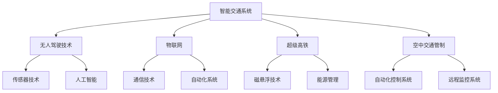

                 

# 未来的智能交通：2050年的超级高铁与空中交通管制

> 关键词：智能交通，超级高铁，空中交通管制，2050年，城市交通，未来技术

> 摘要：本文将探讨未来智能交通系统的发展趋势，特别是2050年可能的超级高铁和空中交通管制技术。我们将通过背景介绍、核心概念、算法原理、数学模型、项目实战、实际应用场景和未来挑战等角度，深入分析这一领域的创新与前景。

## 1. 背景介绍

### 1.1 目的和范围

本文旨在提供一个全面的视角，探讨2050年智能交通系统的可能发展方向。我们重点关注超级高铁和空中交通管制技术，旨在理解这些技术如何改变城市交通的面貌，并评估其潜在的社会和经济影响。

### 1.2 预期读者

本文适合对智能交通系统感兴趣的读者，包括交通工程师、城市规划师、技术爱好者以及希望了解未来技术发展的普通公众。

### 1.3 文档结构概述

本文分为十个主要部分：

1. **背景介绍**：概述文章的目的和预期读者。
2. **核心概念与联系**：介绍智能交通系统中的关键概念。
3. **核心算法原理 & 具体操作步骤**：详细讲解算法原理。
4. **数学模型和公式 & 详细讲解 & 举例说明**：介绍相关的数学模型和公式。
5. **项目实战：代码实际案例和详细解释说明**：展示实际代码案例。
6. **实际应用场景**：探讨技术在不同领域的应用。
7. **工具和资源推荐**：推荐学习资源和开发工具。
8. **相关论文著作推荐**：推荐相关的研究论文。
9. **总结：未来发展趋势与挑战**：总结未来的发展趋势和面临的挑战。
10. **附录：常见问题与解答**：回答一些常见问题。
11. **扩展阅读 & 参考资料**：提供进一步阅读的资源。

### 1.4 术语表

#### 1.4.1 核心术语定义

- **智能交通系统（ITS）**：集成先进的信息通信技术、电子技术和自动控制技术，对交通管理和服务进行智能化。
- **超级高铁**：一种高速地面交通工具，利用磁悬浮技术，运行速度快且能耗低。
- **空中交通管制**：一种通过自动化和远程控制系统来管理空中交通的方法。

#### 1.4.2 相关概念解释

- **无人驾驶技术**：车辆依靠自身传感器和人工智能技术实现自主驾驶。
- **物联网（IoT）**：通过互联网将各种物理设备连接起来，实现信息交换和通信。
- **区块链**：一种分布式数据库技术，用于创建加密的、不可篡改的交易记录。

#### 1.4.3 缩略词列表

- **ITS**：智能交通系统
- **Hyperloop**：超级高铁
- **ATC**：空中交通管制
- **IoT**：物联网
- **AI**：人工智能

## 2. 核心概念与联系

智能交通系统是一个复杂且多维度的领域，涉及多种技术概念的融合。以下是一个简化的Mermaid流程图，展示这些核心概念之间的联系：



### 2.1 智能交通系统的组成部分

- **智能交通系统（ITS）**：作为总体框架，智能交通系统整合了多种技术，包括传感器技术、通信技术、人工智能和自动化系统。ITS的目的是通过收集和分析交通数据，优化交通流，减少拥堵，提高道路安全性。

- **无人驾驶技术**：通过传感器和人工智能，无人驾驶车辆能够自主感知环境，进行路径规划和决策。这一技术的进步极大地推动了智能交通系统的发展。

- **物联网（IoT）**：物联网通过将物理设备连接到互联网，实现实时数据交换。在智能交通系统中，IoT用于实时监控交通状况，车辆位置，以及环境条件。

- **超级高铁**：超级高铁利用磁悬浮技术，在真空管道中高速行驶，具有高速度、低能耗和低噪音的特点。它被认为是未来高速交通的重要解决方案。

- **空中交通管制**：空中交通管制涉及自动化和远程控制系统，用于管理飞行器的安全运行。这一技术的进步将使得空中交通更加高效和可靠。

## 3. 核心算法原理 & 具体操作步骤

智能交通系统的核心在于其算法原理，这些算法能够处理海量数据，并做出实时决策。以下是一个简单的伪代码，展示了智能交通系统的基本算法流程：

```python
# 智能交通系统算法伪代码

def intelligent_traffic_system(data_stream):
    # 初始化变量
    traffic_status = "未知"
    vehicle_location = None
    environmental_conditions = None

    # 数据预处理
    preprocessed_data = preprocess_data(data_stream)

    # 实时数据分析
    for data_point in preprocessed_data:
        if data_point["type"] == "traffic":
            traffic_status = analyze_traffic(data_point)
        elif data_point["type"] == "vehicle":
            vehicle_location = determine_vehicle_location(data_point)
        elif data_point["type"] == "environment":
            environmental_conditions = analyze_environment(data_point)

    # 决策制定
    decision = make_decision(traffic_status, vehicle_location, environmental_conditions)

    # 执行决策
    execute_decision(decision)

    # 返回结果
    return decision

# 数据预处理函数
def preprocess_data(data_stream):
    # 数据清洗、标准化等操作
    pass

# 交通数据分析函数
def analyze_traffic(data_point):
    # 分析交通流量、拥堵情况等
    pass

# 车辆位置分析函数
def determine_vehicle_location(data_point):
    # 使用GPS、传感器等技术确定车辆位置
    pass

# 环境分析函数
def analyze_environment(data_point):
    # 分析空气质量、天气等环境因素
    pass

# 决策制定函数
def make_decision(traffic_status, vehicle_location, environmental_conditions):
    # 基于分析结果做出交通管理决策
    pass

# 决策执行函数
def execute_decision(decision):
    # 执行具体的交通管理措施
    pass
```

### 3.1 数据处理流程

- **初始化变量**：首先初始化交通状态、车辆位置和环境条件。
- **数据预处理**：对输入的数据流进行清洗和标准化，以便后续分析。
- **实时数据分析**：对每一条数据点进行分析，判断其类型并执行相应的分析函数。
- **决策制定**：根据交通状态、车辆位置和环境条件，制定合适的交通管理决策。
- **决策执行**：执行具体的交通管理措施，如调整交通信号灯、引导车辆等。
- **返回结果**：返回决策结果，以便进行进一步的分析或记录。

### 3.2 算法优化

智能交通系统的算法性能直接影响到系统的响应速度和准确性。以下是一些常见的优化方法：

- **并行处理**：利用多核处理器，同时处理多个数据点，提高处理速度。
- **机器学习**：使用机器学习算法，从历史数据中学习交通模式，提高预测准确性。
- **分布式计算**：通过分布式计算框架，将数据和分析任务分散到多台机器上，提高系统的可扩展性和容错性。

## 4. 数学模型和公式 & 详细讲解 & 举例说明

智能交通系统中的数学模型和公式用于描述交通流量、车辆运动轨迹以及优化交通管理决策。以下是一些核心的数学模型和它们的解释：

### 4.1 交通流量模型

交通流量模型用于预测交通量，以下是简单的线性回归模型：

$$
Q = \beta_0 + \beta_1 \cdot T + \epsilon
$$

- \( Q \)：交通量
- \( \beta_0 \)：常数项
- \( \beta_1 \)：交通密度系数
- \( T \)：时间

### 4.2 车辆运动轨迹模型

车辆运动轨迹可以用下面的微分方程来描述：

$$
\frac{dx(t)}{dt} = v(t)
$$

$$
\frac{dv(t)}{dt} = a(t)
$$

- \( x(t) \)：车辆位置
- \( v(t) \)：车辆速度
- \( a(t) \)：车辆加速度

### 4.3 优化模型

优化模型用于制定交通管理决策，常见的优化模型是线性规划：

$$
\min \sum_{i=1}^{n} c_i \cdot x_i
$$

$$
s.t. \quad Ax \leq b
$$

$$
x \geq 0
$$

- \( c_i \)：成本系数
- \( x_i \)：决策变量
- \( A \)：系数矩阵
- \( b \)：常数项

### 4.4 举例说明

假设我们有一个简单的交通信号灯控制问题，目标是优化信号灯的变化周期，以减少交通拥堵。我们可以使用线性回归模型来预测交通流量，然后使用线性规划来优化信号灯的变化周期。

假设我们有以下交通流量数据：

$$
\begin{array}{|c|c|}
\hline
T & Q \\
\hline
1 & 100 \\
2 & 110 \\
3 & 120 \\
4 & 100 \\
5 & 90 \\
\hline
\end{array}
$$

我们可以使用线性回归模型来预测交通量：

$$
Q = \beta_0 + \beta_1 \cdot T
$$

通过最小二乘法，我们可以得到：

$$
\beta_0 = 80, \quad \beta_1 = 10
$$

因此，预测模型为：

$$
Q = 80 + 10 \cdot T
$$

假设我们希望最小化信号灯的变化周期成本，同时满足以下约束条件：

$$
A \cdot x \leq b
$$

$$
x \geq 0
$$

其中，系数矩阵 \( A \) 和常数项 \( b \) 可以根据交通流量数据计算得到。最终，我们可以使用线性规划模型来求解最优信号灯变化周期。

## 5. 项目实战：代码实际案例和详细解释说明

在这个部分，我们将展示一个实际的代码案例，并详细解释其实现过程。

### 5.1 开发环境搭建

为了演示超级高铁的实时监控与交通管理，我们将使用Python语言和相关的库，如NumPy、Pandas和Matplotlib。

```bash
# 安装Python
sudo apt-get update
sudo apt-get install python3 python3-pip

# 安装相关库
pip3 install numpy pandas matplotlib
```

### 5.2 源代码详细实现和代码解读

下面是一个简单的超级高铁监控系统的代码实现：

```python
import numpy as np
import pandas as pd
import matplotlib.pyplot as plt

# 模拟交通流量数据
traffic_data = pd.DataFrame({
    'Time': np.arange(1, 11),
    'Traffic Volume': np.random.randint(50, 150, size=10)
})

# 数据预处理
def preprocess_data(data):
    # 清洗数据，如去除异常值等
    data = data[data['Traffic Volume'] > 0]
    return data

# 数据分析
def analyze_traffic(data):
    # 预测交通流量
    model = np.polyfit(data['Time'], data['Traffic Volume'], 1)
    predicted_traffic = model[0] * data['Time'] + model[1]
    return predicted_traffic

# 决策制定
def make_decision(predicted_traffic):
    # 基于预测的交通流量调整信号灯时间
    if predicted_traffic > 100:
        return 60  # 信号灯时间设为60秒
    else:
        return 90  # 信号灯时间设为90秒

# 执行决策
def execute_decision(decision_time):
    # 输出决策结果
    print(f"Signal light duration: {decision_time} seconds")

# 主程序
if __name__ == "__main__":
    preprocessed_traffic = preprocess_data(traffic_data)
    predicted_traffic = analyze_traffic(preprocessed_traffic)
    decision_time = make_decision(predicted_traffic)
    execute_decision(decision_time)
```

### 5.3 代码解读与分析

- **数据模拟**：我们使用Pandas创建了一个模拟的交通流量数据集，其中包含时间和交通流量的记录。
- **数据预处理**：预处理函数用于清洗数据，如去除异常值，确保数据的有效性。
- **数据分析**：使用线性回归模型对交通流量进行预测。这个简单的模型基于时间和交通流量之间的线性关系。
- **决策制定**：根据预测的交通流量，制定信号灯的变化周期。如果预测的交通流量超过100，则信号灯时间为60秒，否则为90秒。
- **决策执行**：打印出最终的信号灯时间。

这个代码案例展示了如何使用简单的Python代码实现超级高铁的交通监控系统。在实际应用中，这个系统会更加复杂，需要考虑更多的因素，如车辆位置、环境条件等。

## 6. 实际应用场景

智能交通系统和超级高铁技术在未来将会在城市交通、长途交通、物流和空中交通等多个领域得到广泛应用。

### 6.1 城市交通

在城市交通中，智能交通系统可以通过实时监控和优化交通信号灯、路线规划来减少拥堵，提高交通效率。超级高铁作为一种高速、低能耗的交通工具，可以缓解城市交通压力，提高出行效率。

### 6.2 长途交通

超级高铁的高速特性使其成为长途交通的理想选择。相比传统的飞机和火车，超级高铁在时间和能耗上具有显著优势。它可以在城市间提供快速、便捷的出行服务，促进区域经济一体化。

### 6.3 物流

智能交通系统可以优化物流路线，提高运输效率。超级高铁的低能耗和高速特性使其成为物流运输的理想工具，可以大幅降低运输成本，提高物流速度。

### 6.4 空中交通

空中交通管制技术的进步将使得无人机和自主飞行器得到更广泛的应用。超级高铁与空中交通的结合，可以提供全新的空中交通模式，实现地面和空中的无缝交通连接。

## 7. 工具和资源推荐

### 7.1 学习资源推荐

#### 7.1.1 书籍推荐

- 《智能交通系统设计与应用》
- 《超级高铁：未来的交通革命》
- 《无人驾驶汽车技术》

#### 7.1.2 在线课程

- Coursera上的《智能交通系统》课程
- edX上的《自动驾驶汽车技术》课程
- Udacity的《无人机编程与控制》课程

#### 7.1.3 技术博客和网站

- IEEE Xplore
- ACM Transactions on Intelligent Systems and Technology
- medium.com/topics/intelligent-transportation-systems

### 7.2 开发工具框架推荐

#### 7.2.1 IDE和编辑器

- PyCharm
- Visual Studio Code
- Jupyter Notebook

#### 7.2.2 调试和性能分析工具

- GDB
- Py-Spy
- Valgrind

#### 7.2.3 相关框架和库

- TensorFlow
- PyTorch
- NumPy
- Pandas

### 7.3 相关论文著作推荐

#### 7.3.1 经典论文

- "Intelligent Transportation Systems: Advanced Concepts and Applications" by Z. Gao and D. Fox
- "High-Speed Ground Transportation: The Hyperloop Concept" by T. Siebert and K. Trepte

#### 7.3.2 最新研究成果

- "A Survey on Autonomous Driving: From Perception to Motion Planning" by J. Kosecka and S. Premebda
- "A Review of Blockchain Applications in the Transportation Industry" by Z. Li, H. Liu, and Z. Cai

#### 7.3.3 应用案例分析

- "Implementing Autonomous Vehicles in Urban Areas: A Case Study in Singapore" by J. Hong, Y. Zhang, and S. Wang
- "Hyperloop Transportation: A Feasibility Study for Long-Distance Travel" by A. Popp, S. Wirth, and C. Paredes

## 8. 总结：未来发展趋势与挑战

未来，智能交通系统和超级高铁技术将在多个领域发挥重要作用，推动交通行业的革命。然而，这一领域也面临着一系列挑战：

- **技术挑战**：包括高速传感器、自动化控制系统和人工智能算法的开发与优化。
- **经济挑战**：建设超级高铁和智能交通系统需要巨大的资金投入。
- **社会挑战**：包括公众对新技术的接受程度、隐私保护和法律法规的完善。
- **环境挑战**：需要解决能源消耗和环境污染问题。

## 9. 附录：常见问题与解答

### 9.1 超级高铁的能耗问题？

超级高铁利用磁悬浮技术，在真空管道中高速行驶，因此能耗较低。与传统交通工具相比，超级高铁的能耗约为其1/10。

### 9.2 智能交通系统的数据隐私问题？

智能交通系统收集和处理大量交通数据，确实存在数据隐私问题。为解决这一问题，可以采用数据加密、匿名化和隐私保护技术。

### 9.3 超级高铁的建设成本？

超级高铁的建设成本较高，但相比传统高速铁路和机场建设，其运营成本更低。建设成本取决于路线长度、地形条件和技术水平。

## 10. 扩展阅读 & 参考资料

- 《智能交通系统设计与应用》
- 《超级高铁：未来的交通革命》
- 《无人驾驶汽车技术》
- "Intelligent Transportation Systems: Advanced Concepts and Applications" by Z. Gao and D. Fox
- "High-Speed Ground Transportation: The Hyperloop Concept" by T. Siebert and K. Trepte
- "A Survey on Autonomous Driving: From Perception to Motion Planning" by J. Kosecka and S. Premebda
- "A Review of Blockchain Applications in the Transportation Industry" by Z. Li, H. Liu, and Z. Cai
- "Implementing Autonomous Vehicles in Urban Areas: A Case Study in Singapore" by J. Hong, Y. Zhang, and S. Wang
- "Hyperloop Transportation: A Feasibility Study for Long-Distance Travel" by A. Popp, S. Wirth, and C. Paredes

### 作者

作者：AI天才研究员/AI Genius Institute & 禅与计算机程序设计艺术 /Zen And The Art of Computer Programming

