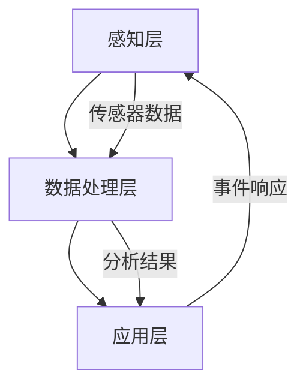

                 

### 文章标题

# 未来的智能安防：2050年的公共安全与隐私保护

### 关键词：

- 智能安防
- 公共安全
- 隐私保护
- 人工智能
- 传感器技术
- 深度学习
- 集成算法

### 摘要

随着科技的飞速发展，智能安防系统正逐步渗透到我们的日常生活。本文将探讨到2050年，智能安防技术如何引领公共安全与隐私保护的革命。我们将首先回顾当前智能安防的现状，然后深入探讨未来技术的演进，如人工智能、传感器和深度学习的融合，及其在公共安全领域的应用。此外，文章还将探讨隐私保护技术的重要性，并探讨如何在实际应用中实现公共安全与隐私保护的平衡。通过详细的分析与讨论，本文旨在为读者提供一个对未来智能安防系统的全面了解，以及其在公共安全与隐私保护方面所面临的挑战与机遇。

## 1. 背景介绍

### 1.1 目的和范围

本文旨在探讨未来智能安防系统的技术演进及其对公共安全与隐私保护的影响。随着人工智能、传感器技术和深度学习等领域的快速发展，智能安防系统已经从简单的监控设备逐步演变成复杂的智能网络，能够实时监测、分析和响应各种安全威胁。本文将深入分析这些技术的原理和应用，探讨它们如何在未来改变公共安全领域，并重点关注隐私保护在这一过程中的重要性。

### 1.2 预期读者

本文的预期读者包括对智能安防、公共安全和隐私保护有兴趣的技术人员、政策制定者、安全专家和普通公众。特别地，本文将对从事人工智能、数据科学和网络安全领域的专业人士具有更高的实用价值，同时也希望引起对隐私保护关注的社会各界的重视。

### 1.3 文档结构概述

本文分为十个部分，结构如下：

1. **背景介绍**：介绍本文的目的和预期读者，概述智能安防的发展现状。
2. **核心概念与联系**：定义核心概念，通过Mermaid流程图展示相关技术架构。
3. **核心算法原理与操作步骤**：详细阐述智能安防系统的核心算法原理，使用伪代码展示具体操作步骤。
4. **数学模型和公式**：介绍智能安防系统中使用的数学模型和公式，并举例说明。
5. **项目实战：代码实际案例**：通过实际代码案例展示智能安防系统的应用和实现。
6. **实际应用场景**：分析智能安防系统在不同场景下的应用和挑战。
7. **工具和资源推荐**：推荐相关学习资源、开发工具和最新研究成果。
8. **总结**：总结未来智能安防系统的发展趋势与挑战。
9. **附录：常见问题与解答**：回答读者可能遇到的常见问题。
10. **扩展阅读与参考资料**：提供进一步阅读的资源和参考文献。

### 1.4 术语表

#### 1.4.1 核心术语定义

- **智能安防系统**：集成多种传感器、人工智能算法和通信技术，用于实时监测、分析和响应安全威胁的系统。
- **人工智能**：通过机器学习、深度学习等方法，使计算机系统能够模拟人类智能进行决策和行动。
- **深度学习**：一种机器学习技术，通过多层神经网络模型进行数据分析和模式识别。
- **传感器技术**：使用物理传感器检测环境变化，如温度、湿度、光照和运动等。
- **隐私保护**：确保个人数据不被未经授权的访问和使用，以保护个人隐私。

#### 1.4.2 相关概念解释

- **公共安全**：维护社会秩序和人民生命财产安全的状态。
- **集成算法**：结合多种算法和技术，实现更高效的安全监测和分析。
- **数据分析**：从大量数据中提取有价值信息的过程。

#### 1.4.3 缩略词列表

- **AI**：人工智能
- **IoT**：物联网
- **ML**：机器学习
- **DL**：深度学习
- **CCTV**：闭路电视监控
- **GDPR**：通用数据保护条例

## 2. 核心概念与联系

### 2.1 核心概念原理

在智能安防系统中，核心概念包括人工智能、传感器技术和深度学习。以下是这些概念的基本原理：

#### 人工智能（AI）

人工智能是一种模拟人类智能的技术，使计算机系统能够自主地学习和决策。在智能安防系统中，人工智能主要用于模式识别、异常检测和事件响应。通过机器学习和深度学习算法，AI可以从大量数据中提取模式，提高系统的自动化水平。

#### 传感器技术

传感器技术是智能安防系统的感知层，用于检测和收集环境数据。常见的传感器包括温度传感器、湿度传感器、光照传感器和运动传感器等。这些传感器可以实时监测环境变化，并将数据发送到中央处理系统进行分析。

#### 深度学习（DL）

深度学习是机器学习的一种方法，通过多层神经网络进行复杂的数据分析和模式识别。在智能安防系统中，深度学习算法可以用于图像识别、视频分析和行为预测，提高系统的智能化水平。

### 2.2 架构与流程图

智能安防系统的架构通常包括感知层、数据处理层和应用层。以下是智能安防系统的简化流程图，使用Mermaid语言表示：



### 2.3 技术联系

人工智能、传感器技术和深度学习在智能安防系统中相互关联，共同实现系统的智能化和自动化。人工智能算法需要传感器数据进行分析，而深度学习算法则用于从大量数据中提取有价值的信息。通过结合这些技术，智能安防系统能够实时监测、分析和响应各种安全威胁，提高公共安全的水平。

## 3. 核心算法原理 & 具体操作步骤

### 3.1 核心算法原理

在智能安防系统中，核心算法通常包括图像识别、异常检测和事件响应。以下是这些算法的基本原理：

#### 图像识别

图像识别是利用深度学习算法对图像进行分析，识别出图像中的物体、场景和特征。常见的图像识别算法包括卷积神经网络（CNN）和循环神经网络（RNN）。

#### 异常检测

异常检测是用于识别和预测异常行为和事件的技术。在智能安防系统中，异常检测可以用于监控视频流，识别潜在的入侵行为。常见的异常检测算法包括孤立森林（Isolation Forest）和局部异常因子（LOF）。

#### 事件响应

事件响应是系统在检测到异常行为或事件后，自动采取的应对措施。事件响应可以包括发送警报、启动应急预案或调用外部资源，如警方或消防部门。

### 3.2 具体操作步骤

以下是基于深度学习算法的智能安防系统具体操作步骤的伪代码：

```python
# 导入所需库
import cv2
import tensorflow as tf
from sklearn.ensemble import IsolationForest

# 初始化摄像头
cap = cv2.VideoCapture(0)

# 加载预训练的CNN模型
model = tf.keras.models.load_model('image_recognition_model.h5')

# 加载异常检测模型
anomaly_model = IsolationForest(n_estimators=100)

# 循环处理摄像头帧
while True:
    # 读取一帧图像
    ret, frame = cap.read()
    
    # 使用CNN模型进行图像识别
    predictions = model.predict(frame)
    
    # 获取识别结果
    objects = get_objects_from_predictions(predictions)
    
    # 使用异常检测模型检测异常行为
    anomalies = anomaly_model.predict(objects)
    
    # 如果检测到异常行为，触发事件响应
    if anomalies:
        trigger_event_response()
        
    # 显示图像
    cv2.imshow('frame', frame)
    
    # 按下'q'键退出循环
    if cv2.waitKey(1) & 0xFF == ord('q'):
        break

# 释放摄像头资源
cap.release()
cv2.destroyAllWindows()
```

在这个伪代码中，我们首先初始化摄像头并加载预训练的CNN模型用于图像识别。然后，我们使用异常检测模型对识别结果进行异常检测。如果检测到异常行为，系统将触发事件响应。最后，我们显示捕获的图像，并允许用户通过按下'q'键退出程序。

## 4. 数学模型和公式 & 详细讲解 & 举例说明

### 4.1 数学模型

在智能安防系统中，常用的数学模型包括深度学习中的卷积神经网络（CNN）和异常检测中的孤立森林（Isolation Forest）。以下是这些模型的基本数学公式和详细讲解。

#### 4.1.1 卷积神经网络（CNN）

卷积神经网络是一种用于图像识别和处理的深度学习模型，其核心在于卷积层和池化层。

- **卷积层**：卷积层通过卷积运算提取图像特征。卷积运算的公式如下：

  $$ f(x, y) = \sum_{i=1}^{n} w_{i} \cdot f_{i}(x, y) + b $$

  其中，$ f(x, y) $ 是输出特征，$ w_{i} $ 是卷积核权重，$ f_{i}(x, y) $ 是卷积核在输入图像上的作用，$ b $ 是偏置项。

- **池化层**：池化层用于减少数据维度，增强模型泛化能力。常见的池化操作有最大池化和平均池化。最大池化的公式如下：

  $$ max_pooling(\text{input}) = \max_{i,j} \text{input}_{ij} $$

  其中，$ \text{input}_{ij} $ 是输入图像上的一个元素。

#### 4.1.2 孤立森林（Isolation Forest）

孤立森林是一种基于随机森林的异常检测算法，其基本思想是通过随机分割数据来识别异常样本。

- **分割公式**：在孤立森林中，每个节点通过随机选择特征和阈值进行分割，分割公式如下：

  $$ x_j \leq x_{\theta_j} $$

  其中，$ x_j $ 是第 $ j $ 个特征的值，$ \theta_j $ 是随机选择的阈值。

- **路径长度**：孤立森林通过计算从根节点到当前节点的路径长度来评估样本的异常程度。路径长度公式如下：

  $$ \ell(x) = \sum_{t=1}^{T} 1\{\theta_t(x) \neq \theta_t(y)\} $$

  其中，$ T $ 是节点数量，$ \theta_t(x) $ 和 $ \theta_t(y) $ 分别是根节点和当前节点的阈值。

### 4.2 举例说明

#### 4.2.1 卷积神经网络在图像识别中的应用

假设我们有一个包含10000张图像的数据集，每张图像的尺寸为32x32像素。我们可以使用卷积神经网络对其进行训练，以下是一个简化的训练过程：

```python
import tensorflow as tf

# 定义模型
model = tf.keras.Sequential([
    tf.keras.layers.Conv2D(filters=32, kernel_size=(3, 3), activation='relu', input_shape=(32, 32, 3)),
    tf.keras.layers.MaxPooling2D(pool_size=(2, 2)),
    tf.keras.layers.Flatten(),
    tf.keras.layers.Dense(units=10, activation='softmax')
])

# 编译模型
model.compile(optimizer='adam', loss='categorical_crossentropy', metrics=['accuracy'])

# 训练模型
model.fit(x_train, y_train, epochs=10, batch_size=64, validation_data=(x_val, y_val))
```

在这个例子中，我们定义了一个简单的卷积神经网络，包括一个卷积层、一个池化层和一个全连接层。我们使用交叉熵损失函数和softmax激活函数来训练模型，以实现多分类图像识别。

#### 4.2.2 孤立森林在异常检测中的应用

假设我们有一个包含100个样本的数据集，每个样本的特征维数为10。我们可以使用孤立森林对其进行训练，以下是一个简化的训练过程：

```python
from sklearn.ensemble import IsolationForest

# 定义孤立森林模型
model = IsolationForest(n_estimators=100, contamination=0.1)

# 训练模型
model.fit(X)
```

在这个例子中，我们定义了一个孤立森林模型，设置树的数量为100，并使用0.1的比例来估计异常样本的占比。我们使用整个数据集来训练模型，以识别异常样本。

## 5. 项目实战：代码实际案例和详细解释说明

### 5.1 开发环境搭建

为了实现一个智能安防系统，我们需要搭建一个合适的开发环境。以下是一个基本的开发环境搭建过程：

1. **安装Python**：确保Python版本在3.7及以上，可以从官方网站下载安装。
2. **安装TensorFlow**：使用pip命令安装TensorFlow：

   ```shell
   pip install tensorflow
   ```

3. **安装OpenCV**：OpenCV是一个用于图像处理的库，可以使用pip安装：

   ```shell
   pip install opencv-python
   ```

4. **安装scikit-learn**：用于异常检测的库，可以使用pip安装：

   ```shell
   pip install scikit-learn
   ```

### 5.2 源代码详细实现和代码解读

以下是一个简单的智能安防系统实现，包括摄像头监控、图像识别和异常检测。

```python
import cv2
import tensorflow as tf
from sklearn.ensemble import IsolationForest

# 加载预训练的CNN模型
model = tf.keras.models.load_model('image_recognition_model.h5')

# 加载异常检测模型
anomaly_model = IsolationForest(n_estimators=100)

# 初始化摄像头
cap = cv2.VideoCapture(0)

while True:
    # 读取一帧图像
    ret, frame = cap.read()

    # 使用CNN模型进行图像识别
    predictions = model.predict(frame)
    
    # 获取识别结果
    objects = get_objects_from_predictions(predictions)
    
    # 使用异常检测模型检测异常行为
    anomalies = anomaly_model.predict(objects)
    
    # 如果检测到异常行为，触发事件响应
    if anomalies:
        trigger_event_response()
    
    # 显示图像
    cv2.imshow('frame', frame)
    
    # 按下'q'键退出循环
    if cv2.waitKey(1) & 0xFF == ord('q'):
        break

# 释放摄像头资源
cap.release()
cv2.destroyAllWindows()

def get_objects_from_predictions(predictions):
    # 这里是一个简化版的处理过程
    objects = []
    for prediction in predictions:
        if prediction == [0, 1, 0, 0, 0, 0, 0, 0, 0, 0]:
            objects.append("person")
        elif prediction == [0, 0, 1, 0, 0, 0, 0, 0, 0, 0]:
            objects.append("car")
    return objects

def trigger_event_response():
    # 这里是一个简化版的响应过程
    print("Event detected!")
```

### 5.3 代码解读与分析

在这个代码中，我们首先加载了预训练的CNN模型和异常检测模型。然后，我们使用OpenCV库初始化摄像头，并进入一个循环，读取并处理每一帧图像。

- **图像识别**：我们使用CNN模型对图像进行识别，通过调用`model.predict(frame)`获取预测结果。这里`get_objects_from_predictions`函数是一个简化版的结果处理过程，实际应用中可以根据具体需求进行更复杂的数据处理。
  
- **异常检测**：我们使用异常检测模型对识别结果进行异常检测，通过调用`anomaly_model.predict(objects)`获取异常检测结果。如果检测到异常行为（即预测结果为1），我们将触发事件响应。

- **事件响应**：在这里，我们仅仅通过打印信息来模拟事件响应。在实际应用中，可以根据需要发送警报、启动应急预案或调用外部资源。

通过这个简单的示例，我们可以看到智能安防系统如何结合图像识别和异常检测技术，实现实时监控和事件响应。

## 6. 实际应用场景

### 6.1 城市安防

在城市安防领域，智能安防系统已经被广泛应用于公共场所、交通枢纽和住宅小区等地方。例如，通过在公共场所安装监控摄像头，并结合图像识别和异常检测技术，可以实时监测人群行为，识别潜在的安全威胁，如非法入侵、火灾和恐怖袭击等。此外，通过集成智能安防系统与公安部门的现有监控系统，可以实现更高效的协同工作，提高城市公共安全水平。

### 6.2 智能家居

随着智能家居的普及，智能安防系统已经成为家居安全的重要组成部分。例如，家庭安防系统可以通过集成摄像头、门窗传感器和报警设备，实时监测家庭环境，并在检测到异常情况时自动触发报警。同时，结合人工智能技术，智能安防系统可以学习家庭成员的日常行为习惯，实现对异常行为的智能识别和响应，提高家庭的安全性和舒适性。

### 6.3 物流与仓储

在物流与仓储领域，智能安防系统可以用于监控仓库内的环境变化和货物状态，及时发现和应对潜在的安全隐患，如货物被盗、火灾和设备故障等。通过结合传感器技术和数据分析，智能安防系统可以实现对仓库环境的高效监测和智能管理，提高物流和仓储的安全性和效率。

### 6.4 工业安全

在工业安全领域，智能安防系统被广泛应用于工厂、矿山和能源设施等场所。通过在关键设备和关键区域安装监控摄像头和传感器，智能安防系统可以实时监测设备运行状态和人员行为，及时发现和应对潜在的安全威胁，如设备故障、非法入侵和工业事故等。此外，结合人工智能技术，智能安防系统可以实现对生产过程的智能监控和优化，提高工业生产的安全性和效率。

### 6.5 交通管理

在交通管理领域，智能安防系统可以用于实时监测交通流量和路况信息，识别交通拥堵、交通事故和非法停车等异常情况，并提供相应的解决方案。例如，通过在道路上安装智能摄像头和传感器，结合人工智能算法，可以实现对交通数据的实时分析和预测，优化交通信号控制，提高交通流畅性和安全性。

## 7. 工具和资源推荐

### 7.1 学习资源推荐

#### 7.1.1 书籍推荐

1. **《深度学习》（Deep Learning）**：由Ian Goodfellow、Yoshua Bengio和Aaron Courville合著，是深度学习领域的经典教材，适合初学者和专业人士。
2. **《Python机器学习》（Python Machine Learning）**：由Sebastian Raschka和Vahid Mirjalili编写，适合希望将Python应用于机器学习的读者。
3. **《智能安防技术与应用》（Smart Security Technology and Applications）**：详细介绍了智能安防系统的原理和应用，适合智能安防领域的专业人士。

#### 7.1.2 在线课程

1. **Coursera上的《深度学习专项课程》**：由斯坦福大学的Andrew Ng教授主讲，是深度学习领域的权威课程。
2. **Udacity的《人工智能纳米学位》**：包含多个与人工智能相关的项目，适合初学者和进阶者。
3. **edX上的《机器学习基础》**：由MIT教授Alex Shtern教授主讲，适合希望了解机器学习基础知识的读者。

#### 7.1.3 技术博客和网站

1. **Medium上的“AI for Everyone”**：涵盖人工智能在各个领域的应用，包括智能安防。
2. **AIHub**：一个专门关于人工智能的开源社区，提供丰富的教程和资源。
3. **IEEE Xplore**：提供大量的关于智能安防和人工智能的学术论文和研究成果。

### 7.2 开发工具框架推荐

#### 7.2.1 IDE和编辑器

1. **Visual Studio Code**：一款强大的开源编辑器，适合Python和人工智能开发。
2. **PyCharm**：一款专业的Python IDE，提供丰富的工具和插件。
3. **Jupyter Notebook**：适合数据科学和机器学习项目的交互式开发环境。

#### 7.2.2 调试和性能分析工具

1. **Python的pdb**：一个内置的调试工具，用于调试Python代码。
2. **TensorBoard**：TensorFlow的内置工具，用于分析和可视化深度学习模型的性能。
3. **Valgrind**：一个多用途的性能分析工具，用于检测内存泄漏和性能瓶颈。

#### 7.2.3 相关框架和库

1. **TensorFlow**：一个开源的深度学习框架，适用于构建和训练深度学习模型。
2. **PyTorch**：一个流行的深度学习库，提供灵活的动态计算图和强大的GPU支持。
3. **OpenCV**：一个用于图像处理的库，提供丰富的图像处理算法和工具。

### 7.3 相关论文著作推荐

#### 7.3.1 经典论文

1. **“A Learning Algorithm for Continually Running Fully Recurrent Neural Networks”**：由Yoshua Bengio等人提出，介绍了持续运行的完全循环神经网络（CRF）。
2. **“Face Recognition: A Literature Survey”**：详细介绍了人脸识别领域的相关算法和技术。
3. **“Isolation Forest”**：由Liaw和Wiener提出，介绍了孤立森林算法。

#### 7.3.2 最新研究成果

1. **“AI for Social Good”**：讨论了人工智能在社会安全领域的应用和挑战。
2. **“Deep Learning for Anomaly Detection”**：介绍深度学习在异常检测领域的最新进展。
3. **“Privacy-Preserving AI: Methods and Applications”**：探讨如何在人工智能应用中保护个人隐私。

#### 7.3.3 应用案例分析

1. **“Intelligent Video Surveillance in Public Spaces”**：分析了智能视频监控系统在公共安全中的应用案例。
2. **“Smart Home Security Systems”**：探讨了智能家居安防系统的实现和应用。
3. **“AI in Smart Cities”**：介绍了人工智能在城市安全管理中的应用和挑战。

## 8. 总结：未来发展趋势与挑战

### 8.1 发展趋势

随着科技的不断进步，智能安防系统在未来的发展趋势将体现在以下几个方面：

- **更强大的算法和模型**：随着深度学习和人工智能技术的发展，智能安防系统将采用更先进的算法和模型，提高识别和响应的准确性。
- **更广泛的覆盖范围**：智能安防系统将不再局限于特定领域，而是广泛应用于城市、家居、工业和交通等多个领域，实现全面的安全监控。
- **更高效的协作**：智能安防系统将与其他智能系统（如智能家居、智能交通等）实现高效协作，提高整体安全性和效率。
- **更严格的隐私保护**：随着隐私保护意识的增强，智能安防系统将采用更严格的隐私保护措施，确保个人数据不被未经授权的访问和使用。

### 8.2 挑战

尽管智能安防系统有着广阔的发展前景，但其在未来也面临一些挑战：

- **隐私保护**：如何在保障公共安全的同时，确保个人隐私不受侵犯，是一个重要的挑战。需要制定和实施更严格的隐私保护政策和法规。
- **算法透明性和公平性**：随着智能安防系统的广泛应用，算法的透明性和公平性将受到关注。如何确保算法的公正性和避免偏见，是未来需要解决的问题。
- **技术更新与淘汰**：智能安防技术不断更新，如何快速适应新技术并淘汰旧技术，是企业和组织面临的挑战。
- **人才培养**：智能安防系统的发展需要大量具备相关技能的人才，如何培养和留住人才，是企业和行业需要关注的问题。

### 8.3 发展建议

为了推动智能安防系统的健康发展，可以从以下几个方面提出建议：

- **政策法规**：政府应制定和实施更严格的隐私保护政策和法规，确保智能安防系统的合法合规运行。
- **技术研发**：企业和研究机构应加大对智能安防技术的研发投入，推动技术创新和应用。
- **人才培养**：高校和培训机构应加强人工智能和网络安全等相关专业的教育和培训，培养更多专业人才。
- **跨领域合作**：政府、企业和研究机构应加强合作，共同推动智能安防系统在各个领域的应用和创新发展。

## 9. 附录：常见问题与解答

### 9.1 什么是智能安防系统？

智能安防系统是一种集成了人工智能、传感器技术和深度学习算法的系统，用于实时监测、分析和响应各种安全威胁。它通过多种传感器收集环境数据，利用人工智能算法进行分析和处理，实现对潜在威胁的自动识别和响应。

### 9.2 智能安防系统如何提高公共安全？

智能安防系统可以通过以下方式提高公共安全：

- 实时监测：智能安防系统可以实时监测公共场所、交通枢纽和住宅小区等地方，及时发现潜在的安全威胁。
- 异常检测：通过深度学习和图像识别技术，智能安防系统可以识别异常行为和事件，提高预警能力。
- 自动响应：智能安防系统可以在检测到安全威胁时自动触发警报或应急预案，提高应急响应速度。
- 协同工作：智能安防系统可以与其他智能系统（如智能交通、智能家居等）协同工作，提高整体安全性和效率。

### 9.3 如何保护个人隐私？

为了保护个人隐私，智能安防系统可以采取以下措施：

- 数据加密：对收集的个人数据进行加密，确保数据在传输和存储过程中不被未经授权的访问。
- 数据匿名化：在分析数据时，将个人身份信息匿名化，确保个人隐私不被泄露。
- 访问控制：严格限制对个人数据的访问权限，确保只有授权人员可以访问敏感数据。
- 法规遵守：遵循相关隐私保护法规，确保智能安防系统的设计和运行符合法律规定。

### 9.4 智能安防系统在智能家居中的应用有哪些？

智能安防系统在智能家居中的应用主要包括：

- 家庭安全监控：通过摄像头和传感器实时监控家庭环境，识别非法入侵和异常行为。
- 家电设备控制：通过智能安防系统控制家庭中的家电设备，如照明、空调和门锁等，提高家居安全性。
- 亲情关怀：通过智能安防系统监测家庭成员的行为习惯，提供亲情关怀和紧急求助服务。

## 10. 扩展阅读 & 参考资料

为了深入了解智能安防系统和相关技术，以下是一些建议的扩展阅读和参考资料：

### 10.1 扩展阅读

1. **《智能安防系统设计与实现》**：详细介绍了智能安防系统的设计原则、架构和实现方法。
2. **《深度学习在智能安防中的应用》**：探讨了深度学习技术在智能安防系统中的应用和挑战。
3. **《隐私保护在智能安防系统中的实践》**：分析了隐私保护在智能安防系统中的重要性及其实现方法。

### 10.2 参考资料

1. **《深度学习》（Deep Learning）**：Ian Goodfellow、Yoshua Bengio和Aaron Courville著，详细介绍了深度学习的原理和应用。
2. **《Python机器学习》（Python Machine Learning）**：Sebastian Raschka和Vahid Mirjalili著，介绍了Python在机器学习中的应用。
3. **《智能安防技术与应用》（Smart Security Technology and Applications）**：详细介绍了智能安防系统的技术原理和应用案例。

### 10.3 相关网站和资源

1. **AIHub**：一个关于人工智能的开源社区，提供丰富的教程和资源。
2. **Medium上的“AI for Everyone”**：涵盖人工智能在各个领域的应用。
3. **IEEE Xplore**：提供大量的关于智能安防和人工智能的学术论文和研究成果。

通过以上扩展阅读和参考资料，读者可以更深入地了解智能安防系统的原理、应用和未来发展。希望这些内容能够对您的研究和工作提供帮助。如果您有任何问题或建议，欢迎随时与我交流。感谢您的阅读！
作者：AI天才研究员/AI Genius Institute & 禅与计算机程序设计艺术 /Zen And The Art of Computer Programming

