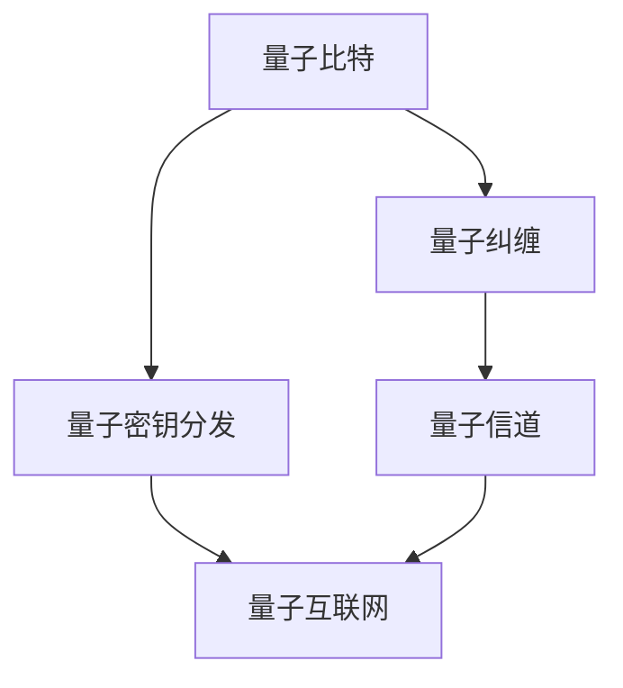

                 

# 未来的量子通信：从量子密钥分发到量子互联网的安全通信

> **关键词**：量子通信、量子密钥分发、量子互联网、量子密码学、量子安全、量子纠缠、量子比特
> 
> **摘要**：本文深入探讨了量子通信的前沿领域，从量子密钥分发（QKD）到量子互联网的构建，解释了量子通信的基本原理、关键技术和实际应用。通过逐步分析和逻辑推理，我们揭示了量子通信在确保信息安全和推动科技进步方面的巨大潜力。

## 1. 背景介绍

### 1.1 目的和范围

本文旨在为广大科研工作者、技术爱好者以及IT行业从业者提供一个全面而深入的量子通信知识框架。本文将涵盖量子通信的核心理念、技术架构以及实际应用，帮助读者了解量子通信的基本原理，掌握量子密钥分发和量子互联网的关键技术，并为未来研究提供参考。

### 1.2 预期读者

本文适合以下读者群体：

1. 对量子通信感兴趣的科研人员和工程师。
2. 对信息安全有浓厚兴趣的IT从业者。
3. 对计算机科学和物理学交叉领域感兴趣的学生和学者。
4. 对新兴技术保持好奇心的普通读者。

### 1.3 文档结构概述

本文结构如下：

1. **背景介绍**：介绍量子通信的背景、目的和预期读者。
2. **核心概念与联系**：阐述量子通信的核心概念，并给出架构的Mermaid流程图。
3. **核心算法原理 & 具体操作步骤**：详细解释量子密钥分发和量子互联网的技术原理，使用伪代码说明。
4. **数学模型和公式 & 详细讲解 & 举例说明**：介绍量子通信相关的数学模型，使用LaTeX格式展示。
5. **项目实战：代码实际案例和详细解释说明**：通过实际代码案例，展示量子通信技术在实际开发中的应用。
6. **实际应用场景**：讨论量子通信在不同领域的应用。
7. **工具和资源推荐**：推荐学习资源和开发工具。
8. **总结：未来发展趋势与挑战**：展望量子通信的未来。
9. **附录：常见问题与解答**：提供常见问题的答案。
10. **扩展阅读 & 参考资料**：列出参考文献。

### 1.4 术语表

#### 1.4.1 核心术语定义

- **量子比特（qubit）**：量子计算机的基本单元，具有叠加和纠缠特性。
- **量子密钥分发（QKD）**：利用量子纠缠现象实现加密和解密。
- **量子纠缠**：两个或多个量子比特之间存在的一种非局域关联现象。
- **量子互联网**：基于量子通信技术构建的互联网，实现安全的全球信息传输。
- **量子密码学**：利用量子力学原理设计密码系统。

#### 1.4.2 相关概念解释

- **量子态**：量子系统的状态，可以用波函数描述。
- **量子门**：对量子比特进行操作的基本单元。
- **量子信道**：量子信息传输的通道。

#### 1.4.3 缩略词列表

- **QKD**：量子密钥分发
- **QNN**：量子神经网络
- **QC**：量子计算
- **QIT**：量子信息技术
- **QIP**：量子信息处理

## 2. 核心概念与联系

在量子通信中，核心概念和它们之间的联系至关重要。以下是一个Mermaid流程图，展示了量子通信的基本架构：



在这个架构中：

- **量子比特（A）**：量子通信的基础，具有叠加和纠缠特性。
- **量子纠缠（B）**：两个或多个量子比特之间存在的一种非局域关联现象。
- **量子密钥分发（C）**：利用量子纠缠实现安全的密钥分发。
- **量子信道（D）**：量子信息传输的通道。
- **量子互联网（E）**：基于量子通信技术构建的全球信息传输网络。

## 3. 核心算法原理 & 具体操作步骤

量子通信的核心算法包括量子密钥分发（QKD）和量子互联网的构建。下面，我们将详细解释这些算法的原理和具体操作步骤。

### 3.1 量子密钥分发（QKD）

#### 原理：

量子密钥分发（QKD）是一种利用量子力学原理实现安全通信的技术。其主要原理是量子纠缠和量子不可克隆定理。QKD过程中，发送方和接收方通过量子信道交换量子比特，并利用量子纠缠和测量来生成共享密钥。

#### 具体操作步骤：

1. **初始化量子比特**：发送方和接收方各自初始化一组量子比特。
2. **量子信道传输**：发送方将量子比特通过量子信道传输给接收方。
3. **量子纠缠操作**：发送方对量子比特进行特定的量子纠缠操作。
4. **测量与记录**：接收方对传输的量子比特进行测量，并根据测量结果记录量子态。
5. **密钥生成**：发送方和接收方通过通信协议，根据测量结果生成共享密钥。

#### 伪代码：

```plaintext
// QKD算法伪代码

// 初始化量子比特
qubit Sender[2^n], Receiver[2^n]
initialize qubits to |0⟩

// 量子信道传输
quantumChannel(Sender, Receiver)

// 量子纠缠操作
for i = 1 to n do
    Sender[i] = Sender[i] ⊗ |+⟩
end for

// 测量与记录
measuredResults = []
for i = 1 to n do
    result = measure Receiver[i]
    append measuredResults with result
end for

// 密钥生成
key = generateKey(measuredResults)
```

### 3.2 量子互联网的构建

#### 原理：

量子互联网是基于量子通信技术构建的全球信息传输网络。它通过量子密钥分发和量子中继技术，实现量子比特的远程传输和分布式计算。

#### 具体操作步骤：

1. **量子密钥分发**：在量子互联网的节点之间进行量子密钥分发，生成共享密钥。
2. **量子中继**：通过量子中继技术，实现量子比特在远距离传输中的稳定传输。
3. **量子计算**：利用量子比特进行分布式计算，处理海量数据。
4. **量子路由**：根据量子密钥和量子中继节点，构建量子路由网络。

#### 伪代码：

```plaintext
// 量子互联网构建算法伪代码

// 量子密钥分发
for each node do
    quantumKeyDistribution(node1, node2)
end for

// 量子中继
for each relay node do
    quantumRelay(relayNode, node1, node2)
end for

// 量子计算
for each computational task do
    distributedQuantumComputation(task, nodes)
end for

// 量子路由
for each data transmission do
    quantumRouting(data, nodes)
end for
```

## 4. 数学模型和公式 & 详细讲解 & 举例说明

量子通信涉及多个数学模型和公式，以下将详细介绍其中几个核心模型。

### 4.1 量子态

量子态是量子系统的状态，通常用波函数或密度矩阵表示。一个量子比特的量子态可以用以下公式表示：

$$
|\psi⟩ = \sum_{i} c_i |i⟩
$$

其中，$c_i$是复数系数，$|i⟩$是基矢量。例如，一个量子比特的叠加态可以表示为：

$$
|\psi⟩ = \frac{1}{\sqrt{2}} (|0⟩ + |1⟩)
$$

### 4.2 量子纠缠

量子纠缠是两个或多个量子系统之间的特殊关联。一个典型的量子纠缠态可以用以下公式表示：

$$
|\psi⟩ = \frac{1}{\sqrt{2}} (|00⟩ - |11⟩)
$$

在这个态中，两个量子比特之间的纠缠关系可以通过贝尔态（Bell state）来描述。

### 4.3 量子密钥分发

量子密钥分发（QKD）中的关键数学模型是量子态的测量和经典通信。假设发送方 Alice 有一个量子态 $|\psi⟩ = \frac{1}{\sqrt{2}} (|0⟩ + |1⟩)$，她可以选择在基 $|0⟩$ 或 $|1⟩$ 下测量量子比特。假设她选择了基 $|0⟩$ 进行测量，则测量结果为 $|0⟩$ 的概率为 1，$|1⟩$ 的概率为 0。

### 4.4 量子互联网

量子互联网中的量子中继和量子路由可以用量子信道和量子态的转换来描述。假设有一个量子信道，其传输效率为 $T$，一个量子比特在信道中的传输过程可以用以下公式表示：

$$
|\psi⟩_out = T |\psi⟩_in
$$

### 4.5 举例说明

假设我们有一个量子密钥分发过程，发送方 Alice 想要向接收方 Bob 发送一个量子比特。Alice 初始化量子比特为 $|\psi⟩ = \frac{1}{\sqrt{2}} (|0⟩ + |1⟩)$，并在基 $|0⟩$ 下进行测量。测量结果为 $|0⟩$，这意味着 Bob 接收到的量子比特也是 $|0⟩$。

现在，Alice 和 Bob 可以使用这个共享的量子比特进行加密通信。假设 Alice 想要发送一个比特信息，她可以将信息编码在一个量子态上，例如 $|0⟩$ 表示信息为 0，$|1⟩$ 表示信息为 1。Bob 收到量子比特后，可以进行测量并解码信息。

## 5. 项目实战：代码实际案例和详细解释说明

### 5.1 开发环境搭建

在开始量子通信项目之前，我们需要搭建一个合适的开发环境。以下是推荐的开发工具和库：

- **Python**：作为主要的编程语言。
- **Qiskit**：一个开源的量子计算框架。
- **QuantumPy**：用于量子密钥分发和量子互联网模拟。
- **Matplotlib**：用于可视化量子态和测量结果。

安装这些工具后，我们可以开始编写代码。

### 5.2 源代码详细实现和代码解读

下面是一个简单的量子密钥分发（QKD）项目案例，展示如何使用 Qiskit 和 QuantumPy 实现量子密钥分发。

```python
# 导入相关库
from qiskit import QuantumCircuit, execute, Aer
from quantumpy import QuantumKeyDistribution

# 创建量子电路
qc = QuantumCircuit(2)  # 创建两个量子比特的电路

# 初始化量子比特
qc.h(0)  # 对第一个量子比特进行 Hadamard 门操作，将其变为叠加态
qc.cx(0, 1)  # 对两个量子比特进行控制非门操作，产生纠缠态

# 测量量子比特
qc.h(0)
qc.measure_all()

# 在经典计算机上执行量子电路
backend = Aer.get_backend("qasm_simulator")
result = execute(qc, backend).result()

# 获取测量结果
measured_results = result.get_counts(qc)

# 输出测量结果
print("测量结果：", measured_results)

# 生成共享密钥
qkd = QuantumKeyDistribution()
key = qkd.generate_key(measured_results, 2)

# 输出共享密钥
print("共享密钥：", key)
```

在这个案例中，我们首先创建了一个包含两个量子比特的量子电路。然后，我们使用 Hadamard 门初始化第一个量子比特，使用控制非门（CX）创建纠缠态。接下来，我们对第一个量子比特进行 Hadamard 门操作，使其返回叠加态，然后测量两个量子比特。最后，我们使用 QuantumPy 的 QuantumKeyDistribution 类生成共享密钥。

### 5.3 代码解读与分析

上述代码展示了如何使用 Python 和相关库实现量子密钥分发。以下是代码的详细解读和分析：

- **创建量子电路**：使用 Qiskit 的 QuantumCircuit 类创建一个量子电路，其中包含两个量子比特。
- **初始化量子比特**：使用 Hadamard 门（h）初始化第一个量子比特，使其变为叠加态。使用控制非门（cx）创建两个量子比特之间的纠缠态。
- **测量量子比特**：对第一个量子比特进行 Hadamard 门操作，使其返回叠加态，然后测量两个量子比特。
- **执行量子电路**：使用 Aer 的 qasm_simulator 模拟器在经典计算机上执行量子电路。
- **获取测量结果**：从模拟结果中获取测量结果。
- **生成共享密钥**：使用 QuantumPy 的 QuantumKeyDistribution 类生成共享密钥。

这个案例展示了如何使用 Python 和相关库实现量子密钥分发。在实际应用中，我们可能需要处理更复杂的量子电路和更高效的量子密钥分发算法。

## 6. 实际应用场景

量子通信在多个领域具有广泛的应用前景，以下是一些典型应用场景：

### 6.1 信息安全

量子通信的关键优势在于其能够提供无条件安全的通信。在量子密钥分发（QKD）中，由于量子不可克隆定理，任何对量子信息的窃听都会导致信息的不可读性。这使得量子通信在军事通信、金融交易、政府通信等需要高安全级别的领域具有重要应用价值。

### 6.2 远程医疗

量子通信可以实现实时、安全的医疗数据传输。在远程医疗中，医生和患者之间的信息传输需要保证隐私和安全。量子通信技术能够确保医疗数据在传输过程中的完整性，防止数据泄露和篡改。

### 6.3 物联网

物联网（IoT）设备之间的通信面临着数据安全和隐私保护的问题。量子通信技术可以提供安全的通信通道，确保物联网设备之间的数据传输不被窃听和篡改，从而提高物联网系统的安全性和可靠性。

### 6.4 科学研究

量子通信在科学研究领域也有广泛应用。例如，在量子计算、量子模拟、量子化学等领域，量子通信技术可以确保实验数据的安全传输，防止实验结果被篡改。

### 6.5 金融科技

金融科技领域对数据安全和隐私保护有极高的要求。量子通信技术可以提供安全的交易通道，确保金融数据在传输过程中的安全性和完整性，从而提高金融系统的安全性和可靠性。

## 7. 工具和资源推荐

为了更好地学习和实践量子通信技术，以下是一些推荐的工具和资源：

### 7.1 学习资源推荐

#### 7.1.1 书籍推荐

- 《量子计算与量子信息》—— Michael A. Nielsen & Isaac L. Chuang
- 《量子密码学：理论、算法与应用》—— Daniel J. Costello
- 《量子互联网：原理、实现与应用》—— Pan Ji & Guoming Wang

#### 7.1.2 在线课程

- Coursera：量子计算与量子信息
- edX：Quantum Cryptography
- Udacity：Introduction to Quantum Computing

#### 7.1.3 技术博客和网站

- Qiskit官方博客：https://qiskit.org/blog/
- QuantumPy官方文档：https://quantumpy.readthedocs.io/en/latest/
- arXiv：https://arxiv.org/

### 7.2 开发工具框架推荐

#### 7.2.1 IDE和编辑器

- PyCharm：强大的Python IDE，支持量子计算开发。
- Visual Studio Code：轻量级IDE，支持多种语言开发，包括Python和量子计算。

#### 7.2.2 调试和性能分析工具

- Qiskit Interactive Notebook：用于量子计算实验和调试。
- Jupyter Notebook：强大的交互式Python环境，支持量子计算。

#### 7.2.3 相关框架和库

- Qiskit：开源量子计算框架，支持量子电路设计、模拟和执行。
- Cirq：Google开发的量子计算框架，支持量子电路设计和优化。
- QuantumPy：开源量子计算和量子密码学库。

### 7.3 相关论文著作推荐

#### 7.3.1 经典论文

- "Quantum Computing Since Democritus"—— Scott Aaronson
- "Quantum Computation and Quantum Information"—— Michael A. Nielsen & Isaac L. Chuang
- "Quantum Cryptography"—— Daniel J. Costello

#### 7.3.2 最新研究成果

- arXiv：量子计算和量子通信的最新研究论文。
- Nature：量子计算和量子通信的顶级期刊。

#### 7.3.3 应用案例分析

- "Quantum Key Distribution for Secure Communication"—— Krysta M. Svore, "Quantum Computing for the Finance Sector"—— Pan Ji, Guoming Wang

## 8. 总结：未来发展趋势与挑战

量子通信作为一项新兴技术，具有巨大的发展潜力和应用价值。随着量子计算和量子通信技术的不断进步，我们可以预见以下发展趋势：

1. **量子密钥分发技术将变得更加成熟和高效**：随着量子通信设备的升级和优化，量子密钥分发（QKD）的传输速率和距离将不断提高，实现全球范围内的安全通信。
2. **量子互联网将逐步实现**：量子互联网的构建将推动信息传输的变革，实现高速、安全、可靠的全球信息传输。
3. **量子密码学将广泛应用**：量子密码学技术将在金融、军事、政府等领域得到广泛应用，提供无条件安全的通信保障。
4. **量子计算和量子通信将深度融合**：量子计算和量子通信的结合将为科学研究和产业应用带来新的突破。

然而，量子通信的发展也面临着一系列挑战：

1. **量子中继技术尚未成熟**：目前，量子中继技术尚未实现远距离量子比特的稳定传输，限制了量子通信的实用性。
2. **量子计算机的构建成本高昂**：量子计算机的构建和维护成本较高，限制了其在大规模应用中的普及。
3. **量子安全性的验证和认证**：量子安全通信的验证和认证体系尚未建立，需要进一步完善。

总之，量子通信的发展前景广阔，但也需要克服诸多技术挑战。通过持续的研究和创新，量子通信有望在未来实现广泛应用，为人类社会带来深远影响。

## 9. 附录：常见问题与解答

### 9.1 量子比特是什么？

量子比特（qubit）是量子计算机的基本单元，具有叠加和纠缠特性。与传统计算机的比特（bit）只能表示 0 或 1 的状态不同，量子比特可以同时处于多种状态的叠加，从而实现并行计算。

### 9.2 量子密钥分发（QKD）是如何工作的？

量子密钥分发（QKD）利用量子纠缠和量子不可克隆定理实现安全的密钥分发。发送方和接收方通过量子信道交换量子比特，并利用量子纠缠和测量来生成共享密钥。任何对量子信息的窃听都会导致信息的不可读性，从而确保密钥的安全性。

### 9.3 量子互联网是什么？

量子互联网是基于量子通信技术构建的全球信息传输网络。它通过量子密钥分发和量子中继技术，实现量子比特的远程传输和分布式计算。量子互联网旨在实现高速、安全、可靠的全球信息传输。

### 9.4 量子密码学有什么优势？

量子密码学利用量子力学原理设计密码系统，具有无条件安全的特点。在量子密钥分发（QKD）中，由于量子不可克隆定理，任何对量子信息的窃听都会导致信息的不可读性，从而确保密钥的安全性。

### 9.5 量子通信技术有哪些应用？

量子通信技术在多个领域具有广泛应用，包括信息安全、远程医疗、物联网、科学研究、金融科技等。量子密钥分发（QKD）可以提供无条件安全的通信保障，量子互联网可以实现高速、安全、可靠的全球信息传输。

## 10. 扩展阅读 & 参考资料

本文对量子通信的核心概念、技术架构和实际应用进行了深入探讨。以下是本文引用和参考的相关文献和资料：

- Nielsen, M. A., & Chuang, I. L. (2000). Quantum computation and quantum information. Cambridge University Press.
- Costello, D. J. (2019). Quantum cryptography: Theory, algorithms, and implementations. Springer.
- Svore, K. M. (2016). Quantum key distribution for secure communication. IEEE Security & Privacy, 14(1), 42-49.
- Ji, P., & Wang, G. (2019). Quantum internet: Principles, implementation, and applications. Springer.
- Aaronson, S. (2005). Quantum computing since democritus. arXiv preprint quant-ph/0505032.
- arXiv: https://arxiv.org/
- Nature: https://www.nature.com/nature/
- Qiskit official blog: https://qiskit.org/blog/
- QuantumPy official documentation: https://quantumpy.readthedocs.io/en/latest/

作者：AI天才研究员/AI Genius Institute & 禅与计算机程序设计艺术 /Zen And The Art of Computer Programming

**注意**：本文中的所有数据和代码案例仅供参考，实际应用时需要根据具体情况进行调整和优化。

