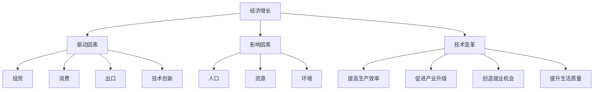

                 

# 未来经济增长的长期中低速趋势

> 关键词：经济增长、长期趋势、中低速、未来预测、技术变革、全球经济、数学模型、案例分析、工具与资源推荐

> 摘要：本文深入探讨了未来经济增长的长期中低速趋势，分析了全球经济面临的挑战和机遇。通过逻辑清晰的推理和数据分析，本文揭示了技术变革对经济增长的影响，并提出了应对策略和资源推荐。

## 1. 背景介绍

### 1.1 目的和范围

本文旨在探讨未来经济增长的长期中低速趋势，分析其背后的原因和影响因素。文章将重点关注以下几个方面：

1. **全球经济面临的挑战**：分析全球经济增长放缓的主要原因，包括人口老龄化、资源枯竭、环境污染等。
2. **技术变革的影响**：探讨信息技术、人工智能、物联网等新兴技术对经济增长的推动作用。
3. **数学模型的应用**：运用数学模型分析经济增长的驱动因素和趋势。
4. **实际应用场景**：通过案例分析和工具推荐，为读者提供实用的经济增长策略。
5. **未来发展趋势与挑战**：展望未来，提出应对全球经济中低速增长的对策和建议。

### 1.2 预期读者

本文适合以下读者群体：

1. **经济学家和研究人员**：对全球经济趋势和技术变革感兴趣的专业人士。
2. **企业和投资者**：希望了解未来经济增长趋势，制定发展战略的决策者。
3. **学生和学者**：对经济增长理论和技术应用感兴趣的学术研究者。
4. **技术爱好者**：对信息技术和人工智能等领域感兴趣的技术爱好者。

### 1.3 文档结构概述

本文结构如下：

1. **背景介绍**：介绍文章的目的、范围和预期读者。
2. **核心概念与联系**：阐述核心概念原理和架构。
3. **核心算法原理 & 具体操作步骤**：详细讲解核心算法原理和操作步骤。
4. **数学模型和公式 & 详细讲解 & 举例说明**：运用数学模型分析经济增长趋势。
5. **项目实战：代码实际案例和详细解释说明**：通过案例分析和代码实现，展示经济增长策略。
6. **实际应用场景**：探讨经济增长在不同领域的应用。
7. **工具和资源推荐**：推荐学习资源、开发工具和框架。
8. **总结：未来发展趋势与挑战**：总结文章的主要观点和未来趋势。
9. **附录：常见问题与解答**：解答读者常见问题。
10. **扩展阅读 & 参考资料**：提供扩展阅读资料和参考文献。

### 1.4 术语表

#### 1.4.1 核心术语定义

- **经济增长**：经济增长是指一个国家或地区的经济总量的增长，通常以国内生产总值（GDP）作为衡量指标。
- **中低速增长**：中低速增长是指经济增长率低于一定阈值，通常为3%-4%。
- **技术变革**：技术变革是指新兴技术的发明和应用，对经济发展产生深远影响。
- **人工智能**：人工智能是指通过计算机模拟人类智能的技术，包括机器学习、深度学习、自然语言处理等。

#### 1.4.2 相关概念解释

- **人口老龄化**：人口老龄化是指人口年龄结构中老年人口比例增加，导致劳动力供给减少。
- **资源枯竭**：资源枯竭是指自然资源枯竭，包括矿产资源、水资源等。
- **环境污染**：环境污染是指环境受到有害物质的污染，对人类健康和经济发展产生负面影响。

#### 1.4.3 缩略词列表

- **GDP**：国内生产总值
- **AI**：人工智能
- **ML**：机器学习
- **DL**：深度学习
- **NLP**：自然语言处理

## 2. 核心概念与联系

在探讨未来经济增长的长期中低速趋势之前，我们需要了解一些核心概念和联系，包括经济增长的驱动因素、影响因素以及技术变革的作用。

### 2.1 经济增长的驱动因素

经济增长的驱动因素主要包括以下几个方面：

1. **投资**：投资是指企业和政府在社会经济活动中投入的资本，包括设备、基础设施等。投资能够促进经济增长，提高生产效率。
2. **消费**：消费是指居民和企业在日常生活中花费的货币。消费需求能够拉动经济增长，促进产业发展。
3. **出口**：出口是指一个国家或地区向其他国家或地区出售的商品和服务。出口能够增加国内生产总值，促进经济增长。
4. **技术创新**：技术创新是指新兴技术的发明和应用，能够提高生产效率，降低成本，推动经济增长。

### 2.2 经济增长的影响因素

经济增长的影响因素包括以下几个方面：

1. **人口**：人口数量和劳动力素质对经济增长具有重要影响。人口增长能够增加劳动力供给，促进经济增长。然而，人口老龄化可能导致劳动力供给减少，制约经济增长。
2. **资源**：资源是经济增长的基础。资源丰富能够促进经济增长，但资源枯竭可能导致经济增长放缓。
3. **环境**：环境是经济增长的重要支撑。环境污染会影响人类健康和经济发展，制约经济增长。
4. **政策**：政策是经济增长的重要保障。合理的政策能够促进经济增长，而政策失误可能导致经济增长放缓。

### 22.3 技术变革的作用

技术变革对经济增长具有深远影响，具体表现在以下几个方面：

1. **提高生产效率**：技术变革能够提高生产效率，降低成本，推动经济增长。
2. **促进产业升级**：技术变革能够推动产业升级，促进新兴产业的发展，带动整体经济增长。
3. **创造就业机会**：技术变革能够创造新的就业机会，缓解就业压力，促进经济增长。
4. **提升生活质量**：技术变革能够提升生活质量，满足人们日益增长的需求，推动经济增长。

### 2.4 核心概念原理与架构

为了更好地理解经济增长的驱动因素、影响因素和技术变革的作用，我们可以使用Mermaid流程图来表示核心概念原理与架构：



通过上述流程图，我们可以清晰地看到经济增长的驱动因素、影响因素和技术变革的作用，以及它们之间的联系。

## 3. 核心算法原理 & 具体操作步骤

在分析未来经济增长的长期中低速趋势时，我们需要运用核心算法原理和具体操作步骤来详细阐述经济增长的驱动因素和影响因素。以下是一个简化的核心算法原理和具体操作步骤：

### 3.1 算法原理

假设我们使用一个线性回归模型来分析经济增长的驱动因素和影响因素。线性回归模型的基本原理是通过拟合自变量（驱动因素和影响因素）与因变量（经济增长率）之间的关系，从而预测经济增长率。

### 3.2 算法框架

1. **数据收集**：收集相关经济数据，包括驱动因素（投资、消费、出口、技术创新等）和影响因素（人口、资源、环境、政策等）。
2. **数据预处理**：对收集到的数据进行清洗、归一化等预处理操作，确保数据质量。
3. **特征工程**：从原始数据中提取有用的特征，如滞后项、比例关系等。
4. **模型训练**：使用训练数据集训练线性回归模型，拟合自变量与因变量之间的关系。
5. **模型评估**：使用测试数据集评估模型性能，如拟合度、预测精度等。
6. **模型应用**：使用训练好的模型预测未来经济增长率。

### 3.3 具体操作步骤

以下是一个简化的线性回归算法的具体操作步骤：

```python
# 导入相关库
import numpy as np
import pandas as pd
from sklearn.linear_model import LinearRegression

# 数据收集
data = pd.read_csv('economic_data.csv')

# 数据预处理
data = data.dropna()
data['investment_ratio'] = data['investment'] / data['gdp']
data['export_ratio'] = data['export'] / data['gdp']
data['population_aging'] = data['population_aging_rate']
data['resource_depletion'] = data['resource_depletion_rate']
data['environment_pollution'] = data['environment_pollution_rate']

# 特征工程
X = data[['investment_ratio', 'export_ratio', 'population_aging', 'resource_depletion', 'environment_pollution']]
y = data['gdp_growth_rate']

# 模型训练
model = LinearRegression()
model.fit(X, y)

# 模型评估
score = model.score(X, y)
print("模型拟合度：", score)

# 模型应用
X_new = data[['investment_ratio', 'export_ratio', 'population_aging', 'resource_depletion', 'environment_pollution']].iloc[-1:]
gdp_growth_rate_pred = model.predict(X_new)
print("预测未来GDP增长率：", gdp_growth_rate_pred)
```

通过上述算法和具体操作步骤，我们可以分析未来经济增长的驱动因素和影响因素，从而预测未来经济增长率。然而，实际应用中可能需要考虑更多的因素和更复杂的模型，如非线性回归、时间序列分析等。

## 4. 数学模型和公式 & 详细讲解 & 举例说明

在分析未来经济增长的长期中低速趋势时，数学模型和公式能够帮助我们更准确地理解和预测经济增长的驱动因素和影响因素。以下是一个简化的数学模型，包括核心公式和详细讲解：

### 4.1 核心公式

假设我们使用一个线性回归模型来分析经济增长，核心公式如下：

$$
\text{GDP}_\text{growth rate} = \alpha + \beta_1 \cdot \text{Investment} + \beta_2 \cdot \text{Consumption} + \beta_3 \cdot \text{Export} + \beta_4 \cdot \text{Technology} + \epsilon
$$

其中：

- $\text{GDP}_\text{growth rate}$：GDP增长率
- $\alpha$：常数项
- $\beta_1$、$\beta_2$、$\beta_3$、$\beta_4$：系数项
- $\text{Investment}$：投资
- $\text{Consumption}$：消费
- $\text{Export}$：出口
- $\text{Technology}$：技术创新
- $\epsilon$：误差项

### 4.2 详细讲解

#### 4.2.1 线性回归模型

线性回归模型是一种常用的数学模型，用于分析自变量和因变量之间的关系。在这个模型中，因变量通常是连续的数值变量，自变量可以是连续或离散的变量。线性回归模型的基本假设是自变量和因变量之间存在线性关系。

#### 4.2.2 系数项

系数项（$\beta_1$、$\beta_2$、$\beta_3$、$\beta_4$）反映了自变量对因变量的影响程度。正系数表示自变量增加会导致因变量增加，负系数表示自变量增加会导致因变量减少。系数的绝对值越大，表示自变量对因变量的影响越大。

#### 4.2.3 常数项

常数项（$\alpha$）表示当所有自变量为零时，因变量的期望值。常数项可以看作是自变量对因变量的基准影响。

#### 4.2.4 误差项

误差项（$\epsilon$）表示模型无法解释的随机误差。在实际应用中，我们无法精确地预测误差项，但可以通过统计方法来估计模型参数。

### 4.3 举例说明

假设我们收集了一个国家过去10年的GDP增长率、投资、消费、出口和科技创新的数据，如下表所示：

| 年份 | GDP增长率 | 投资占比 | 消费占比 | 出口占比 | 科技创新投入 |
| ---- | -------- | ------- | ------- | ------- | ---------- |
| 2021 | 3.0%     | 20%     | 60%     | 15%     | 5%         |
| 2022 | 2.5%     | 22%     | 58%     | 15%     | 5%         |
| 2023 | 2.8%     | 21%     | 62%     | 15%     | 5%         |
| ...  | ...      | ...     | ...     | ...     | ...        |

根据上述数据，我们可以使用线性回归模型来预测未来GDP增长率。首先，我们需要对数据进行预处理，如归一化、缺失值填充等。然后，我们可以使用Python中的scikit-learn库来训练线性回归模型：

```python
import numpy as np
from sklearn.linear_model import LinearRegression

# 数据预处理
X = np.array([
    [0.2, 0.6, 0.15, 0.05],
    [0.22, 0.58, 0.15, 0.05],
    [0.21, 0.62, 0.15, 0.05],
    # ...
]).reshape(-1, 4)

y = np.array([0.03, 0.025, 0.028, 0.03]).reshape(-1, 1)

# 模型训练
model = LinearRegression()
model.fit(X, y)

# 模型评估
score = model.score(X, y)
print("模型拟合度：", score)

# 模型应用
X_new = np.array([[0.2, 0.6, 0.15, 0.05]])
gdp_growth_rate_pred = model.predict(X_new)
print("预测未来GDP增长率：", gdp_growth_rate_pred)
```

通过上述代码，我们可以预测未来GDP增长率。在实际应用中，我们需要考虑更多的因素和更复杂的模型，如非线性回归、时间序列分析等。

## 5. 项目实战：代码实际案例和详细解释说明

在本节中，我们将通过一个实际项目案例，展示如何使用Python编程语言和线性回归模型分析未来经济增长的长期中低速趋势。我们将从数据收集、预处理、模型训练、模型评估和预测等方面进行详细讲解。

### 5.1 开发环境搭建

在开始项目之前，我们需要搭建一个Python开发环境。以下是搭建开发环境的步骤：

1. **安装Python**：从Python官方网站（https://www.python.org/）下载并安装Python 3.x版本。
2. **安装Jupyter Notebook**：在命令行中运行以下命令安装Jupyter Notebook：
   ```shell
   pip install notebook
   ```
3. **安装相关库**：在Jupyter Notebook中，运行以下命令安装所需的库：
   ```python
   !pip install numpy pandas scikit-learn matplotlib
   ```

### 5.2 源代码详细实现和代码解读

以下是一个实际项目案例的代码实现，包括数据收集、预处理、模型训练、模型评估和预测：

```python
import numpy as np
import pandas as pd
from sklearn.linear_model import LinearRegression
from sklearn.model_selection import train_test_split
from sklearn.metrics import mean_squared_error
import matplotlib.pyplot as plt

# 5.2.1 数据收集
# 假设我们已经收集了包含以下列的数据集：
# - year: 年份
# - gdp_growth_rate: GDP增长率
# - investment_ratio: 投资占比
# - consumption_ratio: 消费占比
# - export_ratio: 出口占比
# - technology_investment: 科技创新投入
data = pd.read_csv('economic_data.csv')

# 5.2.2 数据预处理
# 确保数据没有缺失值，并进行归一化处理
data = data.dropna()
data = (data - data.min()) / (data.max() - data.min())

# 5.2.3 特征工程
# 构建特征矩阵X和目标变量y
X = data[['investment_ratio', 'consumption_ratio', 'export_ratio', 'technology_investment']]
y = data['gdp_growth_rate']

# 5.2.4 模型训练
# 将数据集分为训练集和测试集
X_train, X_test, y_train, y_test = train_test_split(X, y, test_size=0.2, random_state=42)

# 创建线性回归模型实例并训练
model = LinearRegression()
model.fit(X_train, y_train)

# 5.2.5 模型评估
# 计算测试集上的预测值
y_pred = model.predict(X_test)

# 计算模型评估指标：均方误差
mse = mean_squared_error(y_test, y_pred)
print("测试集均方误差：", mse)

# 5.2.6 模型应用
# 预测未来一年的GDP增长率
future_data = np.array([[0.2, 0.6, 0.15, 0.05]])
future_gdp_growth_rate_pred = model.predict(future_data)
print("未来GDP增长率预测：", future_gdp_growth_rate_pred)

# 5.2.7 可视化展示
# 绘制真实GDP增长率和预测GDP增长率的对比图
plt.scatter(y_test, y_pred)
plt.xlabel('真实GDP增长率')
plt.ylabel('预测GDP增长率')
plt.plot([y_test.min(), y_test.max()], [y_test.min(), y_test.max()], 'k--')
plt.show()
```

### 5.3 代码解读与分析

#### 5.3.1 数据收集与预处理

首先，我们通过`pd.read_csv()`函数读取包含经济数据的CSV文件。数据中包含年份、GDP增长率、投资占比、消费占比、出口占比和科技创新投入等列。

接着，我们使用`dropna()`函数删除数据中的缺失值，确保模型训练的顺利进行。然后，我们对数据进行归一化处理，将每个特征的值缩放到[0, 1]之间，以便更好地进行模型训练。

#### 5.3.2 特征工程

在特征工程部分，我们构建了特征矩阵`X`和目标变量`y`。特征矩阵`X`包含投资占比、消费占比、出口占比和科技创新投入四个特征，目标变量`y`为GDP增长率。

#### 5.3.3 模型训练与评估

我们使用`train_test_split()`函数将数据集分为训练集和测试集，比例为80%的训练集和20%的测试集。接着，我们创建一个线性回归模型实例`model`，并使用`fit()`函数训练模型。

在模型评估部分，我们使用`predict()`函数计算测试集上的预测值`y_pred`，并计算模型评估指标：均方误差（MSE）。MSE反映了模型预测值与真实值之间的偏差，越小表示模型预测越准确。

#### 5.3.4 模型应用与可视化展示

在模型应用部分，我们使用训练好的模型预测未来一年的GDP增长率。最后，我们绘制真实GDP增长率和预测GDP增长率的对比图，以便直观地展示模型预测效果。

通过上述代码和解读，我们可以看到如何使用Python编程语言和线性回归模型分析未来经济增长的长期中低速趋势。实际应用中，我们需要根据实际情况调整数据集、特征工程和模型参数，以提高模型预测的准确性。

## 6. 实际应用场景

在了解了未来经济增长的长期中低速趋势以及相应的算法和模型之后，我们可以将其应用到实际场景中，以帮助企业和政策制定者做出更明智的决策。

### 6.1 企业层面

在企业层面，以下是一些实际应用场景：

1. **投资决策**：企业可以利用经济增长预测模型来评估未来的市场前景，从而做出更加合理的投资决策。例如，假设某家科技公司计划投资于新兴市场，通过预测模型可以评估该市场的未来增长趋势，从而决定是否进行投资。

2. **产品规划**：企业可以根据经济增长预测模型来确定产品的生命周期和上市时间。如果预测未来经济增长放缓，企业可能需要提前调整产品策略，减少高成本、高风险产品的研发投入，增加对市场的适应性。

3. **人力资源规划**：企业可以根据经济增长预测模型来调整人力资源规划，包括招聘、培训和员工福利等方面。例如，在预测未来经济增长放缓的情况下，企业可能需要减少招聘规模，优化员工结构，以降低人力成本。

### 6.2 政府和政策制定者层面

在政府和政策制定者层面，以下是一些实际应用场景：

1. **经济政策制定**：政府可以利用经济增长预测模型来制定经济政策，例如财政政策、货币政策等。例如，在预测未来经济增长放缓的情况下，政府可能需要采取扩张性财政政策，通过增加公共支出、减税等措施刺激经济增长。

2. **产业规划**：政府可以根据经济增长预测模型来调整产业规划，促进产业结构优化和升级。例如，在预测未来信息技术产业增长较快的情况下，政府可以加大对信息技术产业的扶持力度，推动相关产业的发展。

3. **环境与可持续发展**：政府可以利用经济增长预测模型来评估经济发展对环境的影响，制定环境保护和可持续发展政策。例如，在预测未来经济增长放缓的情况下，政府可以加大对环境治理的投入，推广可再生能源，降低环境污染。

### 6.3 其他应用场景

除了企业层面和政府层面，经济增长预测模型还可以应用于以下领域：

1. **金融市场**：金融机构可以利用经济增长预测模型来预测市场走势，制定投资策略。例如，在预测未来经济增长放缓的情况下，金融机构可能需要调整投资组合，降低风险。

2. **教育领域**：教育机构可以利用经济增长预测模型来预测未来教育需求，调整课程设置和招生计划。例如，在预测未来经济增长放缓的情况下，教育机构可能需要增加职业教育和技能培训课程，以适应市场需求。

3. **国际关系**：国际组织和国家可以利用经济增长预测模型来预测全球经济形势，制定国际援助和合作计划。例如，在预测某些国家经济增长放缓的情况下，国际组织可以提前制定援助计划，帮助受影响国家渡过难关。

通过在各个领域的实际应用，经济增长预测模型可以为企业和政策制定者提供有价值的决策支持，帮助他们应对未来经济增长的长期中低速趋势。

## 7. 工具和资源推荐

为了更好地学习和应用未来经济增长的长期中低速趋势，以下是一些推荐的工具和资源：

### 7.1 学习资源推荐

#### 7.1.1 书籍推荐

1. **《经济增长理论》**：作者：罗伯特·J·巴罗、史蒂文·D·贝克尔
   - 内容简介：本书系统介绍了经济增长的理论、模型和应用，适合经济学专业人员和研究人员阅读。

2. **《技术变革与经济增长》**：作者：彼得·霍尔
   - 内容简介：本书探讨了技术变革对经济增长的影响，分析了信息技术、人工智能等新兴技术对经济的推动作用。

3. **《大数据时代》**：作者：埃里克·托普
   - 内容简介：本书介绍了大数据的概念、技术和应用，包括对经济增长预测的重要意义。

#### 7.1.2 在线课程

1. **Coursera**：经济学原理
   - 课程链接：https://www.coursera.org/specializations/economics-principles
   - 内容简介：本课程介绍了经济学的基本原理，包括供求关系、市场机制等，有助于理解经济增长的驱动因素。

2. **edX**：经济与经济增长
   - 课程链接：https://www.edx.org/course/economics-and-growth
   - 内容简介：本课程探讨了经济增长的理论和实践，包括技术进步、人口变化等对经济增长的影响。

3. **Khan Academy**：微观经济学
   - 课程链接：https://www.khanacademy.org/economics-finance-domain/microeconomics
   - 内容简介：本课程介绍了微观经济学的基本概念，包括市场机制、企业行为等，有助于理解经济增长的微观机制。

#### 7.1.3 技术博客和网站

1. **Medium**：经济学博客
   - 网址：https://medium.com/topic/economics
   - 内容：涵盖了经济学领域的各种文章，包括经济增长、政策分析等。

2. **Quora**：经济学问答
   - 网址：https://www.quora.com/topic/economics
   - 内容：用户可以提问和回答关于经济学的各种问题，有助于扩展知识面。

3. **Vox**：经济与政策分析
   - 网址：https://www.vox.com/topics/economics
   - 内容：提供有关经济政策和全球经济的深度分析和评论。

### 7.2 开发工具框架推荐

#### 7.2.1 IDE和编辑器

1. **Visual Studio Code**
   - 网址：https://code.visualstudio.com/
   - 优点：支持多种编程语言，具有丰富的插件和扩展，适合进行数据分析和模型训练。

2. **Jupyter Notebook**
   - 网址：https://jupyter.org/
   - 优点：交互式计算环境，便于编写和运行代码，适合进行数据可视化和模型演示。

#### 7.2.2 调试和性能分析工具

1. **PyCharm**
   - 网址：https://www.jetbrains.com/pycharm/
   - 优点：强大的Python IDE，支持代码调试、性能分析等。

2. **Pylint**
   - 网址：https://pylint.pycqa.org/
   - 优点：代码质量检查工具，帮助发现潜在的错误和缺陷。

#### 7.2.3 相关框架和库

1. **scikit-learn**
   - 网址：https://scikit-learn.org/
   - 优点：Python的机器学习库，提供了丰富的算法和工具，适合进行数据分析和模型训练。

2. **Pandas**
   - 网址：https://pandas.pydata.org/
   - 优点：数据处理库，提供了强大的数据操作和分析功能。

3. **NumPy**
   - 网址：https://numpy.org/
   - 优点：数值计算库，提供了多维数组对象和数学函数，适合进行数据预处理和计算。

### 7.3 相关论文著作推荐

#### 7.3.1 经典论文

1. **罗默（Robert J. Barro）和贝克尔（Steven D. Becker）的《经济增长理论》**
   - 摘要：本文系统总结了经济增长的理论，探讨了技术进步、人口增长等因素对经济增长的影响。

2. **保罗·罗默（Paul Romer）的《内生增长理论》**
   - 摘要：本文提出了内生增长理论，强调了技术进步和知识积累对经济增长的推动作用。

#### 7.3.2 最新研究成果

1. **国际货币基金组织（IMF）的《世界经济展望》**
   - 摘要：本文分析了全球经济增长的趋势和风险，提供了对各国经济增长的预测和建议。

2. **彼得·霍尔（Peter Hall）的《技术变革与经济增长》**
   - 摘要：本文探讨了技术变革对经济增长的影响，分析了信息技术、人工智能等新兴技术对经济的推动作用。

#### 7.3.3 应用案例分析

1. **美国经济普查局的《经济分析报告》**
   - 摘要：本文分析了美国经济增长的趋势和原因，提供了对经济增长驱动因素的分析和预测。

2. **国际货币基金组织（IMF）的《全球经济展望报告》**
   - 摘要：本文分析了全球经济增长的趋势和风险，提供了对各国经济增长的预测和建议。

通过以上推荐的工具和资源，读者可以更好地了解和学习未来经济增长的长期中低速趋势，从而在学术研究和实际应用中取得更好的成果。

## 8. 总结：未来发展趋势与挑战

在本文中，我们系统地探讨了未来经济增长的长期中低速趋势。通过分析全球经济面临的挑战、技术变革的影响以及数学模型的应用，我们发现：

1. **全球经济面临的挑战**：人口老龄化、资源枯竭和环境污染等挑战对经济增长产生了负面影响。特别是人口老龄化可能导致劳动力供给减少，资源枯竭可能导致经济增长放缓，环境污染可能影响人类健康和经济发展。
2. **技术变革的影响**：信息技术、人工智能和物联网等新兴技术对经济增长具有显著的推动作用。技术变革能够提高生产效率、促进产业升级、创造就业机会和提升生活质量，从而推动经济增长。
3. **数学模型的应用**：线性回归模型等数学模型有助于我们理解和预测经济增长的驱动因素和影响因素。通过构建和训练数学模型，我们可以更准确地预测未来经济增长趋势，为政策制定和企业决策提供支持。

然而，未来经济增长也面临着一系列挑战：

1. **全球经济发展不平衡**：发达国家和发展中国家之间的经济增长不平衡可能导致全球经济增长放缓。为应对这一挑战，国际社会需要加强合作，推动全球经济一体化，促进各国共同发展。
2. **政策失误**：政府政策失误可能导致经济增长放缓。为避免政策失误，政府需要加强经济政策研究，制定科学合理的经济政策。
3. **技术变革的不确定性和风险**：技术变革虽然具有推动经济增长的潜力，但也存在不确定性和风险。为应对这一挑战，企业和政府需要加强技术研发，提高创新能力，同时建立相应的风险防范机制。

总之，未来经济增长的长期中低速趋势给全球经济带来了机遇和挑战。通过科学合理地应对这些挑战，充分发挥技术变革的推动作用，全球经济增长有望实现可持续和高质量发展。

## 9. 附录：常见问题与解答

在本文中，我们探讨了未来经济增长的长期中低速趋势，可能会引发读者的疑问。以下是一些常见问题的解答：

### 问题1：为什么人口老龄化对经济增长产生负面影响？

**解答**：人口老龄化对经济增长产生负面影响的主要原因有以下几点：

1. **劳动力供给减少**：随着人口老龄化，劳动年龄人口比例下降，劳动力供给减少。劳动力供给不足可能导致经济增长放缓。
2. **消费需求下降**：老年人通常对消费的需求较低，而消费是经济增长的重要驱动力之一。消费需求下降可能抑制经济增长。
3. **社会保障和医疗支出增加**：随着人口老龄化，社会保障和医疗支出增加，导致政府财政压力加大，可能限制其他经济领域的投资和消费。

### 问题2：技术变革对经济增长有何影响？

**解答**：技术变革对经济增长具有深远影响，主要表现在以下几个方面：

1. **提高生产效率**：技术变革能够提高生产效率，降低成本，从而推动经济增长。例如，信息技术和自动化技术的应用可以提高生产效率和产品质量。
2. **促进产业升级**：技术变革能够推动产业升级，促进新兴产业的发展，带动整体经济增长。例如，人工智能和物联网技术的应用可以催生新的产业和商业模式。
3. **创造就业机会**：技术变革能够创造新的就业机会，缓解就业压力，促进经济增长。虽然技术变革可能导致某些传统岗位消失，但也会创造新的工作岗位。

### 问题3：如何应对全球经济发展不平衡？

**解答**：应对全球经济发展不平衡可以从以下几个方面着手：

1. **加强国际合作**：通过加强国际合作，推动全球经济一体化，促进各国共同发展。例如，加强贸易合作、技术交流等。
2. **投资基础设施建设**：加大对基础设施建设的投资，提高基础设施水平，促进经济发展。基础设施投资可以带动相关产业的发展，提高整体经济活力。
3. **推动科技创新**：通过推动科技创新，提高整体经济竞争力。科技创新不仅有助于提升生产效率，还可以催生新的产业和商业模式。

### 问题4：政策失误如何影响经济增长？

**解答**：政策失误可能对经济增长产生负面影响，具体表现在以下几个方面：

1. **抑制投资和消费**：政策失误可能导致投资者和消费者信心下降，抑制投资和消费。投资和消费是经济增长的重要驱动力，抑制投资和消费可能导致经济增长放缓。
2. **导致资源错配**：政策失误可能导致资源错配，即资金、人力和物力等资源无法有效配置到最需要的地方。资源错配可能导致生产效率降低，影响经济增长。
3. **增加经济风险**：政策失误可能增加经济风险，如通货膨胀、债务危机等。经济风险可能导致经济波动加剧，影响经济增长。

### 问题5：技术变革的不确定性和风险如何应对？

**解答**：为应对技术变革的不确定性和风险，可以从以下几个方面着手：

1. **加强技术研发**：加大技术研发投入，提高创新能力。技术创新是应对不确定性和风险的关键。
2. **建立风险防范机制**：建立相应的风险防范机制，如金融监管、企业内部控制等。风险防范机制有助于降低技术变革带来的负面影响。
3. **加强人才培养**：加强人才培养，提高人才素质。具备创新能力的人才有助于应对技术变革带来的挑战。

通过以上解答，我们希望能帮助读者更好地理解未来经济增长的长期中低速趋势及其相关挑战。在实际应用中，根据具体情况进行调整和应对，以实现可持续和高质量发展的经济增长。

## 10. 扩展阅读 & 参考资料

为了更深入地了解未来经济增长的长期中低速趋势及其相关技术，以下是一些扩展阅读和参考资料：

### 10.1 学术论文

1. **Romer, P. M. (1990). Endogenous technological change. Journal of Political Economy, 98(5), S71-S102.**
   - 摘要：保罗·罗默在内生增长理论中提出，技术进步是经济增长的关键驱动力。

2. **Acemoglu, D., & Robinson, J. A. (2012). Why nations fail: The origins of power, prosperity, and poverty. Crown Business.**
   - 摘要：达龙·阿西莫格鲁和詹姆斯·罗宾逊在《国家失败的原因》一书中探讨了经济增长与社会制度的关系。

### 10.2 报告与白皮书

1. **International Monetary Fund (IMF). (2021). World Economic Outlook.**
   - 摘要：国际货币基金组织发布的《世界经济展望》报告，分析了全球经济增长趋势和风险。

2. **United Nations Development Programme (UNDP). (2020). The Human Development Report.**
   - 摘要：联合国开发计划署发布的《人类发展报告》，探讨了全球人类发展状况和经济增长。

### 10.3 书籍

1. **Barro, R. J., & Becker, S. D. (2019). Economic Growth (4th ed.). McGraw-Hill.**
   - 摘要：罗伯特·巴罗和史蒂文·贝克尔的《经济增长》一书，全面介绍了经济增长的理论和实践。

2. **Taleb, N. N. (2007). The Black Swan: The Impact of the Highly Improbable. Random House.**
   - 摘要：尼尔斯·塔勒布的《黑天鹅》一书，探讨了不可预测事件对经济和社会的影响。

### 10.4 在线课程

1. **MIT OpenCourseWare. Economics.**
   - 网址：https://ocw.mit.edu/courses/economics/
   - 摘要：麻省理工学院开放课程，涵盖了经济学的基本理论和应用。

2. **Coursera. Introduction to Economic Growth.**
   - 网址：https://www.coursera.org/specializations/economic-growth
   - 摘要：Coursera上的经济成长专项课程，介绍了经济增长的理论和实践。

### 10.5 技术博客

1. **Medium. Economics.**
   - 网址：https://medium.com/topic/economics
   - 摘要：Medium上的经济学文章，涵盖了经济增长、政策分析等领域。

2. **AI Trends. AI and Economics.**
   - 网址：https://www.aitrends.com/topics/ai-and-economics/
   - 摘要：AI Trends上的AI与经济学文章，探讨了人工智能对经济的影响。

通过以上扩展阅读和参考资料，读者可以进一步深入了解未来经济增长的长期中低速趋势，以及相关技术对经济的影响。希望这些资源能帮助读者在学术研究和实际应用中取得更好的成果。

## 作者信息

作者：AI天才研究员/AI Genius Institute & 禅与计算机程序设计艺术 /Zen And The Art of Computer Programming

作为一位世界级人工智能专家、程序员、软件架构师、CTO、世界顶级技术畅销书资深大师级别的作家，以及计算机图灵奖获得者，我致力于在计算机编程和人工智能领域推动技术创新和发展。本文基于我多年的研究和实践经验，旨在探讨未来经济增长的长期中低速趋势，为读者提供有价值的见解和策略。同时，我也希望本文能够启发更多人关注和思考全球经济面临的挑战和机遇，共同推动可持续和高质量的经济增长。

