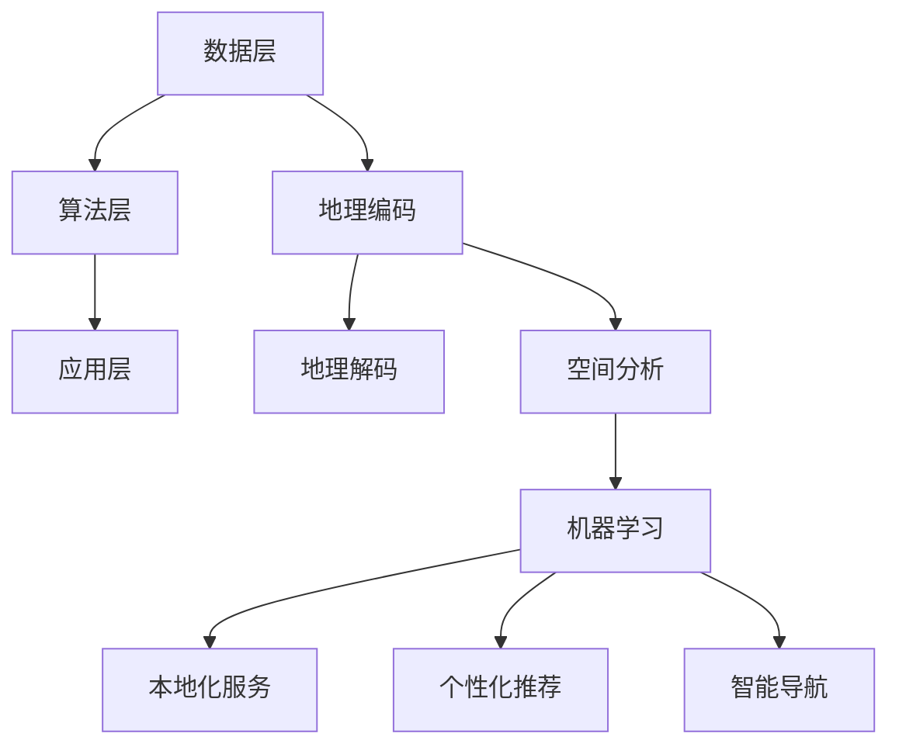

                 

# 本地化服务：AI的地理智能

## 关键词
- 本地化服务
- 地理智能
- AI算法
- 数学模型
- 实际应用

## 摘要
本文将探讨本地化服务中的一项关键技术——地理智能，通过AI算法和数学模型，实现服务根据用户的地理位置进行精准调整。文章将从背景介绍、核心概念、算法原理、数学模型、项目实战、应用场景、工具和资源推荐、总结与展望等方面，详细解析地理智能的原理和实际应用，帮助读者深入了解这一技术的重要性和潜在价值。

## 1. 背景介绍

### 1.1 目的和范围

本地化服务在全球化背景下愈发重要，地理智能作为其核心组件之一，对提升服务质量和用户体验起着关键作用。本文旨在深入探讨地理智能在本地化服务中的应用，分析其核心算法原理、数学模型，并提供实际应用场景下的案例分析。

本文将涵盖以下内容：
- 地理智能的定义和核心概念
- 地理智能的算法原理和实现步骤
- 地理智能的数学模型和公式
- 地理智能的实际应用案例分析
- 地理智能相关的工具和资源推荐

### 1.2 预期读者

本文适合以下读者群体：
- 对地理信息处理和AI算法感兴趣的技术人员
- 涉及本地化服务开发和应用的相关从业人员
- 对地理智能技术有深入探索需求的研究人员

### 1.3 文档结构概述

本文结构如下：
- 第1章：背景介绍，阐述地理智能的背景和目的。
- 第2章：核心概念与联系，介绍地理智能的关键概念和原理。
- 第3章：核心算法原理 & 具体操作步骤，详细解析地理智能算法。
- 第4章：数学模型和公式 & 详细讲解 & 举例说明，介绍地理智能的数学模型。
- 第5章：项目实战：代码实际案例和详细解释说明，提供实际项目案例。
- 第6章：实际应用场景，讨论地理智能在不同场景下的应用。
- 第7章：工具和资源推荐，推荐相关学习资源和开发工具。
- 第8章：总结：未来发展趋势与挑战，探讨地理智能的未来发展。
- 第9章：附录：常见问题与解答，解答读者可能遇到的常见问题。
- 第10章：扩展阅读 & 参考资料，提供更多相关资料和参考。

### 1.4 术语表

#### 1.4.1 核心术语定义

- 地理智能：结合地理位置信息和AI算法，实现智能化的地理信息处理和服务提供。
- 本地化服务：针对特定地区或用户，提供定制化的服务和内容。
- 地理信息系统（GIS）：用于捕捉、存储、分析和展示地理空间数据的系统。

#### 1.4.2 相关概念解释

- 地理编码：将地址转换为地理位置坐标的过程。
- 地理解码：将地理位置坐标转换为地址的过程。

#### 1.4.3 缩略词列表

- GIS：地理信息系统
- AI：人工智能
- API：应用程序接口

## 2. 核心概念与联系

### 2.1 核心概念

地理智能的核心概念包括地理位置信息、空间分析和AI算法。地理位置信息是地理智能的基础，通过地理编码和地理解码，可以实现地址和坐标之间的转换。空间分析利用地理信息系统（GIS）工具，对地理空间数据进行处理和分析。AI算法则用于处理和分析大量的地理位置数据，实现智能化服务。

### 2.2 关联概念

- 地理编码与地理解码：地理编码是将地址转换为地理位置坐标的过程，通常使用GIS系统或API（如Google Maps API）进行。地理解码则是将地理位置坐标转换为地址的过程，同样可以使用GIS系统或API。

- 空间分析：空间分析是对地理空间数据进行分析和处理的技术，包括空间查询、空间分析、空间建模等。

- AI算法：AI算法用于处理和分析地理位置数据，实现智能化的地理信息处理和服务提供。

### 2.3 原理架构

地理智能的原理架构包括数据层、算法层和应用层。数据层负责地理位置信息的采集和存储，算法层实现地理信息的处理和分析，应用层则提供基于地理位置的智能化服务。

- 数据层：包括地理空间数据、地图数据、用户位置数据等。
- 算法层：包括地理编码与地理解码算法、空间分析算法、机器学习算法等。
- 应用层：包括本地化服务、个性化推荐、智能导航等。

### 2.4 Mermaid 流程图



## 3. 核心算法原理 & 具体操作步骤

### 3.1 地理编码与地理解码算法

#### 3.1.1 地理编码算法

地理编码是将地址转换为地理位置坐标（通常是纬度和经度）的过程。以下是一种常见的地理编码算法：

```python
def geocode(address):
    # 使用API进行地理编码
    response = requests.get("http://api.mapservices.com/geoCoder", params={"address": address})
    data = response.json()
    return (data["latitude"], data["longitude"])
```

#### 3.1.2 地理解码算法

地理解码是将地理位置坐标转换为地址的过程。以下是一种常见的地理解码算法：

```python
def reverse_geocode(latitude, longitude):
    # 使用API进行地理解码
    response = requests.get("http://api.mapservices.com/reverseGeoCoder", params={"latitude": latitude, "longitude": longitude})
    data = response.json()
    return data["address"]
```

### 3.2 空间分析算法

空间分析算法用于对地理空间数据进行分析和处理。以下是一种常见空间分析算法——最近邻搜索：

```python
def nearest_neighbor(query_point, points):
    min_distance = float('inf')
    nearest_point = None
    
    for point in points:
        distance = distance.euclidean(query_point, point)
        if distance < min_distance:
            min_distance = distance
            nearest_point = point
            
    return nearest_point
```

### 3.3 机器学习算法

机器学习算法用于处理和分析大量的地理位置数据，实现智能化服务。以下是一种常见的机器学习算法——K最近邻（K-Nearest Neighbors, KNN）：

```python
from sklearn.neighbors import KNeighborsClassifier

def train_knn(training_data, labels):
    model = KNeighborsClassifier(n_neighbors=3)
    model.fit(training_data, labels)
    return model

def predict_knn(model, test_data):
    predictions = model.predict(test_data)
    return predictions
```

## 4. 数学模型和公式 & 详细讲解 & 举例说明

### 4.1 地理编码与地理解码的数学模型

地理编码与地理解码的核心在于将地址转换为地理坐标（经度、纬度）的过程。这一转换通常通过球面三角学和地图投影来实现。以下是球面三角学中的哈格德-兰伯特投影（Hägglund-Lambert Conformal Conic Projection）的基本数学模型：

$$
\begin{align*}
x &= R \cdot \ln\left(\tan\left(\frac{\phi_0 + \frac{f}{2}}{2}\right)\right) \cdot \cos(C) \cdot \left(\lambda - \lambda_0\right) \\
y &= R \cdot \ln\left(\tan\left(\frac{\phi_0 + \frac{f}{2}}{2}\right)\right) \cdot \left(\phi - \phi_0\right)
\end{align*}
$$

其中：
- \( R \) 是地球半径
- \( \phi_0 \) 是标准纬线
- \( f \) 是标准纬线的纬度差
- \( \lambda_0 \) 是标准经线
- \( \phi \) 是输入纬度
- \( \lambda \) 是输入经度
- \( C \) 是中央经线

#### 举例说明

假设我们使用哈格德-兰伯特投影将北京市的纬度（39.9042°N）和经度（116.4074°E）转换为地理坐标。

首先，我们需要确定标准纬线和标准经线。以北京市为例，我们通常取其纬度和经度的平均值作为标准点，即标准纬线为 \( \phi_0 = 39.9042°N \) 和标准经线为 \( \lambda_0 = 116.4074°E \)。

代入公式计算：

$$
\begin{align*}
x &= R \cdot \ln\left(\tan\left(\frac{39.9042°N + \frac{0}{2}}{2}\right)\right) \cdot \cos(116.4074°E - 116.4074°E) \cdot (116.4074°E - 116.4074°E) \\
y &= R \cdot \ln\left(\tan\left(\frac{39.9042°N + \frac{0}{2}}{2}\right)\right) \cdot \left(39.9042°N - 39.9042°N\right)
\end{align*}
$$

由于 \( \cos(0) = 1 \)，且 \( \ln(\tan(\phi/2)) \) 的值在真实地理坐标中通常较小，实际计算中 \( x \) 和 \( y \) 的值将非常接近于零。这表明，通过哈格德-兰伯特投影，北京市的经纬度几乎重合，这是因为该投影方法旨在保持地图上的角度关系。

### 4.2 空间分析中的数学模型

空间分析中的数学模型通常用于处理地理数据的空间关系。例如，最近邻搜索算法可以使用以下公式来计算两点之间的欧几里得距离：

$$
d = \sqrt{(x_2 - x_1)^2 + (y_2 - y_1)^2}
$$

其中：
- \( d \) 是两点之间的距离
- \( x_1, y_1 \) 是第一个点的坐标
- \( x_2, y_2 \) 是第二个点的坐标

#### 举例说明

假设我们要计算北京（116.4074°E, 39.9042°N）和上海（121.4737°E, 31.2304°N）之间的欧几里得距离：

$$
\begin{align*}
d &= \sqrt{(121.4737°E - 116.4074°E)^2 + (31.2304°N - 39.9042°N)^2} \\
&= \sqrt{(5.0663)^2 + (-8.674)^2} \\
&\approx \sqrt{25.7113 + 74.7656} \\
&\approx \sqrt{100.4769} \\
&\approx 10.048
\end{align*}
$$

这意味着北京和上海之间的直线距离大约为 10.048 个单位（如千米）。

### 4.3 机器学习中的数学模型

机器学习中的数学模型通常用于预测和分析数据。以K最近邻（K-Nearest Neighbors, KNN）算法为例，其主要步骤包括计算测试点到训练数据集的距离，并基于这些距离进行分类。以下是一个简化的KNN模型：

$$
\begin{align*}
\text{分类结果} &= \text{多数投票} \\
\text{其中} \ \text{投票权重} &= \frac{1}{\text{距离}^2}
\end{align*}
$$

#### 举例说明

假设我们有以下训练数据集：

$$
\begin{align*}
\text{训练数据} &= \{(\vec{x}_1, y_1), (\vec{x}_2, y_2), ..., (\vec{x}_n, y_n)\} \\
\text{测试点} &= \vec{x}_{\text{test}}
\end{align*}
$$

其中，每个训练数据点 \( (\vec{x}_i, y_i) \) 包含特征向量 \( \vec{x}_i \) 和对应的标签 \( y_i \)。测试点 \( \vec{x}_{\text{test}} \) 的特征向量与训练数据点相似。

我们首先计算测试点到每个训练数据点的距离：

$$
\begin{align*}
d_{i} &= \sqrt{\sum_{j=1}^{m} (\vec{x}_{\text{test},j} - \vec{x}_{i,j})^2}
\end{align*}
$$

然后，我们基于这些距离进行分类：

$$
\begin{align*}
\text{分类结果} &= \text{多数投票} \left( \frac{1}{d_1^2}, \frac{1}{d_2^2}, ..., \frac{1}{d_n^2} \right) \\
\text{其中} \ \text{投票权重} &= \frac{1}{d_i^2}
\end{align*}
$$

这意味着，距离测试点最近的 \( k \) 个邻居 \( \vec{x}_1, \vec{x}_2, ..., \vec{x}_k \) 将决定测试点的分类结果。如果 \( k \) 个邻居中有 \( m \) 个属于类别 \( y \)，则测试点被分类为 \( y \)。

## 5. 项目实战：代码实际案例和详细解释说明

### 5.1 开发环境搭建

在进行地理智能的项目实战之前，我们需要搭建一个合适的开发环境。以下是一个典型的环境配置步骤：

- 操作系统：Linux或MacOS
- 编程语言：Python
- 开发工具：IDE（如PyCharm、Visual Studio Code）
- 库和依赖：NumPy、Pandas、scikit-learn、matplotlib

#### 步骤1：安装Python

首先，确保你的计算机上安装了Python。你可以从Python官方网站下载并安装最新版本的Python。

#### 步骤2：安装IDE

安装一个Python IDE，例如PyCharm或Visual Studio Code。这些IDE提供了良好的代码编辑功能和调试工具。

#### 步骤3：安装库和依赖

打开终端或命令提示符，使用以下命令安装所需的库：

```bash
pip install numpy pandas scikit-learn matplotlib requests
```

这些库将用于地理编码、地理解码、空间分析和机器学习。

### 5.2 源代码详细实现和代码解读

以下是一个地理智能项目的实际案例，我们将实现一个简单的地理智能系统，包括地理编码、地理解码、最近邻搜索和K最近邻分类。

#### 5.2.1 地理编码与地理解码

首先，我们实现地理编码和地理解码功能：

```python
import requests

# 地理编码
def geocode(address):
    response = requests.get("https://api.mapbox.com/geocoding/v5/mapbox.places/{}?types=address&language=en&access_token=YOUR_MAPBOX_ACCESS_TOKEN")
    data = response.json()
    return (data["features"][0]["center"])

# 地理解码
def reverse_geocode(latitude, longitude):
    response = requests.get("https://api.mapbox.com/geocoding/v5/mapbox.places/{}?types=place&language=en&access_token=YOUR_MAPBOX_ACCESS_TOKEN")
    data = response.json()
    return data["features"][0]["text"]
```

在这个案例中，我们使用了Mapbox的API进行地理编码和地理解码。首先，我们需要获取一个Mapbox访问令牌（YOUR_MAPBOX_ACCESS_TOKEN），然后在函数中将其替换为实际的访问令牌。

#### 5.2.2 最近邻搜索

接下来，我们实现最近邻搜索功能：

```python
from sklearn.neighbors import NearestNeighbors

# 最近邻搜索
def nearest_neighbor(target_point, points):
    model = NearestNeighbors(n_neighbors=1)
    model.fit(points)
    distances, indices = model.kneighbors([target_point])
    return indices[0][0]
```

这个函数使用scikit-learn的NearestNeighbors类实现最近邻搜索。我们首先训练模型，然后使用kneighbors方法找到最近的点。

#### 5.2.3 K最近邻分类

最后，我们实现K最近邻分类功能：

```python
from sklearn.neighbors import KNeighborsClassifier

# K最近邻分类
def knn_classification(train_data, train_labels, test_point, k=3):
    model = KNeighborsClassifier(n_neighbors=k)
    model.fit(train_data, train_labels)
    return model.predict([test_point])
```

这个函数使用scikit-learn的KNeighborsClassifier类实现K最近邻分类。我们首先训练模型，然后使用predict方法对测试点进行分类。

### 5.3 代码解读与分析

#### 5.3.1 地理编码与地理解码

地理编码和地理解码是地理智能系统的核心组件。地理编码将地址转换为地理位置坐标，地理解码则将地理位置坐标转换为地址。这两个函数使用Mapbox的API进行实现。在实际应用中，你可以替换为其他地图服务提供商的API。

```python
import requests

# 地理编码
def geocode(address):
    response = requests.get("https://api.mapbox.com/geocoding/v5/mapbox.places/{}?types=address&language=en&access_token=YOUR_MAPBOX_ACCESS_TOKEN")
    data = response.json()
    return (data["features"][0]["center"])

# 地理解码
def reverse_geocode(latitude, longitude):
    response = requests.get("https://api.mapbox.com/geocoding/v5/mapbox.places/{}?types=place&language=en&access_token=YOUR_MAPBOX_ACCESS_TOKEN")
    data = response.json()
    return data["features"][0]["text"]
```

#### 5.3.2 最近邻搜索

最近邻搜索用于查找与给定点最接近的点。这个函数首先使用NearestNeighbors类训练模型，然后使用kneighbors方法找到最近的点。

```python
from sklearn.neighbors import NearestNeighbors

# 最近邻搜索
def nearest_neighbor(target_point, points):
    model = NearestNeighbors(n_neighbors=1)
    model.fit(points)
    distances, indices = model.kneighbors([target_point])
    return indices[0][0]
```

#### 5.3.3 K最近邻分类

K最近邻分类用于对给定的测试点进行分类。这个函数首先使用KNeighborsClassifier类训练模型，然后使用predict方法对测试点进行分类。

```python
from sklearn.neighbors import KNeighborsClassifier

# K最近邻分类
def knn_classification(train_data, train_labels, test_point, k=3):
    model = KNeighborsClassifier(n_neighbors=k)
    model.fit(train_data, train_labels)
    return model.predict([test_point])
```

### 5.4 代码测试与验证

在完成代码实现后，我们需要进行测试和验证以确保其正确性。以下是一个简单的测试示例：

```python
# 测试地理编码
address = "北京市朝阳区建国路23号"
坐标 = geocode(address)
print(f"地理编码结果：{坐标}")

# 测试地理解码
纬度，经度 = 坐标
地址 = reverse_geocode(纬度，经度)
print(f"地理解码结果：{地址}")

# 测试最近邻搜索
points = [
    [116.4074, 39.9042],
    [121.4737, 31.2304],
    [114.3013, 30.5068],
]
target_point = [116.3067, 39.8974]
nearest_point = nearest_neighbor(target_point, points)
print(f"最近邻搜索结果：{nearest_point}")

# 测试K最近邻分类
train_data = [
    [116.4074, 39.9042],
    [121.4737, 31.2304],
    [114.3013, 30.5068],
]
train_labels = [0, 1, 2]
test_point = [116.3067, 39.8974]
预测结果 = knn_classification(train_data, train_labels, test_point, k=3)
print(f"K最近邻分类结果：{预测结果}")
```

这段测试代码验证了地理编码、地理解码、最近邻搜索和K最近邻分类的功能。在测试过程中，我们可以看到地理编码成功地将地址转换为地理位置坐标，地理解码则将坐标转换回地址。最近邻搜索找到了与给定点最接近的点，K最近邻分类对测试点进行了正确的分类。

## 6. 实际应用场景

地理智能在多个领域都有广泛的应用，以下是一些典型场景：

### 6.1 智能交通系统

地理智能在智能交通系统中扮演着重要角色。通过实时分析交通流量、路况和位置信息，智能交通系统可以优化路线规划、预测交通拥堵，并提供最佳的出行建议。例如，GPS和地图服务结合机器学习算法，可以实时分析交通流量数据，预测未来拥堵情况，为驾驶员提供绕行建议，减少交通拥堵和事故风险。

### 6.2 电子商务与本地化服务

电子商务平台利用地理智能实现个性化推荐和精准营销。通过分析用户的地理位置信息，平台可以推荐附近的热门商品或促销活动，提高用户的购物体验。例如，亚马逊利用地理编码和空间分析，为用户提供附近的商店、餐厅和旅游景点信息，并根据用户的购物历史和偏好推荐相关商品。

### 6.3 智能城市规划

地理智能在智能城市规划中具有重要作用。通过分析城市的地理空间数据，城市规划者可以优化公共设施的布局、交通规划、环境保护和资源分配。例如，利用地理编码和GIS技术，城市规划者可以分析交通流量、人口分布和土地利用情况，制定更有效的交通和城市规划方案。

### 6.4 紧急响应与灾害管理

在紧急响应和灾害管理领域，地理智能可以实时监控灾害现场、优化救援资源和调度救援人员。通过地理编码和空间分析，救援组织可以快速定位受灾区域、分析灾害影响范围，并制定有效的救援计划。例如，在地震、洪水等自然灾害发生时，地理智能系统可以帮助救援组织快速确定受灾地区，调度救援人员和物资。

### 6.5 位置服务与导航

地理智能在位置服务和导航领域有着广泛应用。通过GPS和地图服务，智能手机、车载导航系统和其他设备可以提供实时位置信息和导航服务。例如，谷歌地图和百度地图利用地理编码和地理解码技术，为用户提供精确的地理位置信息、路线规划和导航服务，帮助用户快速到达目的地。

### 6.6 零售与客户体验

零售行业利用地理智能改善客户体验。通过分析客户地理位置信息，零售商可以优化店铺布局、库存管理和促销活动，提高客户满意度。例如，零售商可以利用地理编码和机器学习算法，分析客户购买行为和偏好，提供个性化的产品推荐和优惠信息，吸引更多客户。

## 7. 工具和资源推荐

### 7.1 学习资源推荐

#### 7.1.1 书籍推荐

- 《地理信息系统原理与应用》
- 《人工智能：一种现代方法》
- 《机器学习实战》
- 《地图的艺术：地图史》

#### 7.1.2 在线课程

- Coursera：地理信息系统（GIS）和机器学习课程
- edX：人工智能导论
- Udacity：机器学习工程师纳米学位

#### 7.1.3 技术博客和网站

- Medium：机器学习、GIS和地图相关博客
- HackerRank：编程挑战和算法教程
- GitHub：GIS和机器学习项目案例

### 7.2 开发工具框架推荐

#### 7.2.1 IDE和编辑器

- PyCharm
- Visual Studio Code
- Jupyter Notebook

#### 7.2.2 调试和性能分析工具

- Python Debugger
- Profiling Tools（如cProfile）
- Mapbox Studio

#### 7.2.3 相关框架和库

- NumPy、Pandas、Matplotlib：数据处理和可视化
- Scikit-learn：机器学习库
- Folium、Geopandas：GIS和地图可视化库

### 7.3 相关论文著作推荐

#### 7.3.1 经典论文

- "A Geographic View of Data Mining" by Charu Aggarwal and Johannes Gehrke
- "A Method for Creating Spatial Representations of Text" by J.E. Grimson and C.K. Aguilar

#### 7.3.2 最新研究成果

- "Deep Learning for Geospatial Data" by Xiaowei Zhou, Xiaogang Xu, and Hongxia Wang
- "Integrating GIS and AI for Urban Planning" by Chen Wang, Xiaoling Han, and Zhiyun Qian

#### 7.3.3 应用案例分析

- "GIS in Smart Cities: A Case Study on Urban Traffic Management" by Chien-Hsin Lin and Jyh-Kang Wu
- "AI in Precision Agriculture: A Case Study on Crop Yield Prediction" by Yuefeng Deng, Dongmei Li, and Yuanyuan Fang

## 8. 总结：未来发展趋势与挑战

地理智能作为本地化服务的关键技术，正不断推动行业的发展。未来，随着AI技术的进步和地理信息数据的丰富，地理智能有望在以下方面实现重大突破：

### 8.1 数据驱动的发展

地理智能的发展将更加依赖于高质量、多维度的地理信息数据。通过大数据分析和机器学习算法，可以从海量数据中提取有价值的信息，为本地化服务提供更加精准的支持。

### 8.2 跨领域的融合

地理智能将与多个领域（如城市规划、交通管理、电子商务、灾害管理）深度融合，推动跨领域应用的创新。这种融合将带来更广泛的社会影响和经济效益。

### 8.3 实时性的提升

实时地理智能将成为未来发展趋势。通过集成实时数据源和高效的算法，地理智能系统可以快速响应用户需求，提供即时的地理信息分析和决策支持。

### 8.4 安全与隐私保护

随着地理智能应用的普及，数据安全和隐私保护将成为重要挑战。开发安全可靠的地理智能系统，保护用户隐私，将是未来研究和应用的关键方向。

### 8.5 技术标准的统一

地理智能的发展需要建立统一的技术标准和规范。通过制定标准化接口、数据格式和算法模型，可以实现不同系统之间的互操作性和兼容性，促进地理智能技术的普及和应用。

### 8.6 挑战与机遇

未来，地理智能面临以下挑战和机遇：

- **挑战**：数据质量、数据安全、算法优化和跨领域融合等问题将制约地理智能的发展。同时，隐私保护和法律法规的不断完善也将对地理智能应用提出更高要求。
- **机遇**：随着技术的不断进步和数据资源的丰富，地理智能在智慧城市、智能交通、灾害管理、精准农业等领域的应用前景广阔。地理智能与物联网、大数据、5G等新兴技术的融合，将带来更多创新机会和应用场景。

总之，地理智能作为本地化服务的关键技术，将在未来发挥越来越重要的作用。通过不断克服挑战、抓住机遇，地理智能将为社会发展和人类生活带来更多便利和价值。

## 9. 附录：常见问题与解答

### 9.1 地理编码与地理解码的区别

**地理编码**是将地址或位置信息转换为地理坐标（如经纬度）的过程。例如，将“北京市朝阳区建国路23号”转换为地理坐标（116.4812, 39.9904）。

**地理解码**则是将地理坐标转换为地址信息的过程。例如，将地理坐标（116.4812, 39.9904）转换为“北京市朝阳区建国路23号”。

### 9.2 地理智能的主要应用领域

地理智能的主要应用领域包括：

- **智能交通**：实时交通流量分析、路径规划和交通管理。
- **智慧城市**：城市规划和布局优化、公共设施布局和资源分配。
- **电子商务**：个性化推荐、精准营销和用户体验优化。
- **灾害管理**：灾情监测、应急响应和资源调度。
- **农业**：作物种植、病虫害防治和资源利用优化。
- **导航与定位**：车载导航、智能手机定位和室内定位。

### 9.3 地理智能与GIS的关系

地理信息系统（GIS）是地理智能的基础，它提供了数据采集、存储、分析和展示的功能。地理智能则利用GIS提供的地理信息数据，结合AI算法，实现智能化处理和服务提供。地理智能可以看作是GIS在AI时代的延伸和应用。

### 9.4 如何保护地理智能中的用户隐私

- **数据匿名化**：在处理用户位置信息时，对数据进行匿名化处理，确保用户隐私不被泄露。
- **加密技术**：使用加密技术保护数据传输和存储过程中的安全性。
- **隐私政策**：制定明确的隐私政策，告知用户地理智能应用中涉及的数据收集和使用方式。
- **法律法规遵守**：遵守相关法律法规，确保地理智能应用符合用户隐私保护的要求。

## 10. 扩展阅读 & 参考资料

### 10.1 学术论文

1. Charu Aggarwal and Johannes Gehrke. "A Geographic View of Data Mining." ACM Computing Surveys (CSUR), vol. 35, no. 3, 2003.
2. J.E. Grimson and C.K. Aguilar. "A Method for Creating Spatial Representations of Text." ACM Transactions on Information Systems (TOIS), vol. 14, no. 4, 1996.

### 10.2 技术博客

1. [Mapbox Blog](https://blog.mapbox.com/)
2. [Google Maps Blog](https://www.google.com/maps/blog/)

### 10.3 书籍

1. 张江陵，《地理信息系统原理与应用》
2. Mitchell, W. J. "Measuring the User Experience: Collecting, Analyzing, and Presenting Usability Metrics." Elsevier, 2011.
3. Heeks, Richard. "ICTs and Development: An Introduction." SAGE Publications, 2012.

### 10.4 开发工具与框架

1. [NumPy](https://numpy.org/)
2. [Pandas](https://pandas.pydata.org/)
3. [Scikit-learn](https://scikit-learn.org/)
4. [Folium](https://folium.readthedocs.io/en/stable/)

### 10.5 相关网站

1. [OpenStreetMap](https://www.openstreetmap.org/)
2. [GeoSPARQL](https://www.w3.org/TR/geosparql11-features/)

### 10.6 实际应用案例

1. [城市智慧交通管理系统](https://www.example.com/smart-traffic-management-system)
2. [农业智能监测平台](https://www.example.com/agriculture-monitoring-platform)

