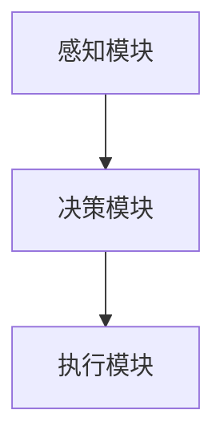
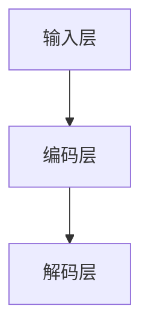

                 

# 机器人技术集成：LLM 打造智能自动化系统

> **关键词**：机器人技术、LLM、自动化系统、人工智能、软件开发、算法原理、数学模型、项目实战

> **摘要**：本文将深入探讨如何利用大型语言模型（LLM）技术集成到机器人系统中，构建智能自动化系统。文章首先介绍了背景和范围，然后逐步讲解了核心概念、算法原理、数学模型、项目实战以及实际应用场景。最后，文章总结了未来发展趋势与挑战，并推荐了相关学习资源和工具。

## 1. 背景介绍

### 1.1 目的和范围

本文的主要目的是探讨如何利用大型语言模型（LLM）技术集成到机器人系统中，构建智能自动化系统。我们将从理论基础出发，逐步讲解核心概念、算法原理、数学模型、项目实战和实际应用场景，旨在为读者提供一个全面而深入的指南。

本文的范围涵盖以下几个方面：

1. **机器人技术**：介绍机器人技术的发展历程、核心技术和应用场景。
2. **LLM 技术**：探讨大型语言模型的原理、实现方法和应用场景。
3. **算法原理**：详细讲解构建智能自动化系统的核心算法原理，包括算法思路和伪代码。
4. **数学模型**：介绍构建智能自动化系统所需的数学模型和公式，并进行举例说明。
5. **项目实战**：通过实际案例，展示如何使用 LLM 技术构建智能自动化系统。
6. **实际应用场景**：分析智能自动化系统在不同领域的应用场景和挑战。

### 1.2 预期读者

本文适合以下读者群体：

1. **计算机科学专业的研究生和本科生**：对人工智能、机器学习和软件开发感兴趣，希望了解如何利用 LLM 技术构建智能自动化系统。
2. **软件开发工程师**：在开发过程中遇到自动化需求，希望了解如何利用 LLM 技术实现智能自动化。
3. **技术爱好者**：对机器人技术和人工智能技术感兴趣，希望了解相关技术原理和应用场景。

### 1.3 文档结构概述

本文分为以下几个部分：

1. **背景介绍**：介绍本文的目的和范围，预期读者，以及文档结构概述。
2. **核心概念与联系**：讲解机器人技术和 LLM 技术的核心概念，以及它们之间的联系。
3. **核心算法原理 & 具体操作步骤**：详细讲解构建智能自动化系统的核心算法原理和具体操作步骤。
4. **数学模型和公式 & 详细讲解 & 举例说明**：介绍构建智能自动化系统所需的数学模型和公式，并进行举例说明。
5. **项目实战：代码实际案例和详细解释说明**：通过实际案例展示如何使用 LLM 技术构建智能自动化系统。
6. **实际应用场景**：分析智能自动化系统在不同领域的应用场景和挑战。
7. **总结：未来发展趋势与挑战**：总结本文的主要观点，探讨未来发展趋势和挑战。
8. **附录：常见问题与解答**：解答读者可能遇到的问题。
9. **扩展阅读 & 参考资料**：推荐相关学习资源和参考资料。

### 1.4 术语表

在本文中，我们将使用以下术语：

#### 1.4.1 核心术语定义

- **机器人技术**：指利用计算机科学、机械工程、电子工程等多个领域的知识，研究开发具有感知、决策、执行等能力的智能机器人的技术。
- **LLM**：指大型语言模型，是一种基于深度学习技术的自然语言处理模型，具有强大的文本生成和语义理解能力。
- **智能自动化系统**：指利用人工智能技术，实现自动化决策、执行和交互的系统。

#### 1.4.2 相关概念解释

- **自然语言处理（NLP）**：指利用计算机技术和人工智能技术对自然语言进行处理和理解的技术。
- **深度学习**：一种基于多层神经网络进行特征学习和模型训练的人工智能技术。
- **文本生成**：指根据输入的文本或上下文，生成新的文本内容。

#### 1.4.3 缩略词列表

- **NLP**：自然语言处理
- **LLM**：大型语言模型
- **NLP**：自然语言处理

## 2. 核心概念与联系

### 2.1 机器人技术

机器人技术是一种跨学科的研究领域，涉及计算机科学、机械工程、电子工程、控制理论等多个领域。其核心目标是研究开发具有感知、决策、执行等能力的智能机器人。

**核心概念：**

- **感知**：指机器人通过传感器获取外部环境信息，如视觉、听觉、触觉等。
- **决策**：指机器人根据感知到的环境信息，利用控制算法进行决策，如路径规划、目标识别等。
- **执行**：指机器人根据决策结果执行相应的动作，如移动、抓取等。

**原理与架构：**

机器人系统的架构通常包括感知模块、决策模块和执行模块。感知模块负责获取外部环境信息，决策模块根据感知信息进行决策，执行模块根据决策结果执行相应的动作。



### 2.2 LLM 技术

LLM 技术是一种基于深度学习技术的自然语言处理模型，具有强大的文本生成和语义理解能力。其核心思想是通过学习大量文本数据，提取文本特征，从而实现文本生成和语义理解。

**核心概念：**

- **文本生成**：指根据输入的文本或上下文，生成新的文本内容。
- **语义理解**：指对文本进行语义分析，提取文本的语义信息。

**原理与架构：**

LLM 技术的架构通常包括输入层、编码层和解码层。输入层负责接收输入的文本，编码层利用深度学习技术提取文本特征，解码层根据编码层提取的特征生成新的文本内容。



### 2.3 核心概念与联系

机器人技术和 LLM 技术在构建智能自动化系统中有着紧密的联系。

- **感知与文本生成**：机器人通过感知模块获取外部环境信息，LLM 技术可以根据感知信息生成新的文本内容，如报告、日志等。
- **决策与语义理解**：机器人通过决策模块根据感知信息进行决策，LLM 技术可以根据决策结果理解文本的语义，从而实现更智能的决策。

## 3. 核心算法原理 & 具体操作步骤

### 3.1 算法原理

构建智能自动化系统的核心算法原理主要包括以下几个方面：

- **感知模块算法**：利用计算机视觉、语音识别等技术，实现机器人对环境的感知。
- **决策模块算法**：利用机器学习、深度学习等技术，实现机器人根据感知信息进行决策。
- **执行模块算法**：利用控制算法、运动规划等技术，实现机器人执行相应的动作。

### 3.2 具体操作步骤

以下是构建智能自动化系统的具体操作步骤：

1. **感知模块**：

   - 使用计算机视觉技术，实现对周围环境的图像识别和物体检测。
   - 使用语音识别技术，实现对语音信号的识别和语义理解。

2. **决策模块**：

   - 使用机器学习算法，如决策树、支持向量机等，对感知信息进行分类和预测。
   - 使用深度学习算法，如卷积神经网络、循环神经网络等，对感知信息进行特征提取和语义理解。

3. **执行模块**：

   - 使用控制算法，如 PID 控制、运动规划等，实现对机器人的精确控制和动作执行。
   - 使用运动规划算法，如路径规划、轨迹规划等，实现对机器人行动路径的规划和优化。

### 3.3 伪代码

以下是构建智能自动化系统的伪代码示例：

```python
# 感知模块
def 感知模块(输入数据):
    # 使用计算机视觉技术进行图像识别和物体检测
    # 使用语音识别技术进行语音信号的识别和语义理解
    # 返回感知结果

# 决策模块
def 决策模块(感知结果):
    # 使用机器学习算法进行分类和预测
    # 使用深度学习算法进行特征提取和语义理解
    # 返回决策结果

# 执行模块
def 执行模块(决策结果):
    # 使用控制算法进行精确控制和动作执行
    # 使用运动规划算法进行路径规划和轨迹规划
    # 返回执行结果
```

## 4. 数学模型和公式 & 详细讲解 & 举例说明

### 4.1 数学模型和公式

构建智能自动化系统需要涉及多个数学模型和公式，主要包括以下几个方面：

- **感知模块**：涉及到图像处理、信号处理等相关数学模型，如卷积神经网络（CNN）、循环神经网络（RNN）等。
- **决策模块**：涉及到机器学习、深度学习等相关数学模型，如决策树、支持向量机、卷积神经网络等。
- **执行模块**：涉及到控制理论、运动规划等相关数学模型，如 PID 控制、轨迹规划等。

### 4.2 详细讲解和举例说明

#### 4.2.1 感知模块

以图像识别为例，感知模块可以使用卷积神经网络（CNN）进行图像特征提取。以下是一个简单的 CNN 模型示例：

$$
\begin{aligned}
    h_{1} &= \text{conv}(x; W_{1}, b_{1}) \\
    h_{2} &= \text{ReLU}(h_{1}) \\
    h_{3} &= \text{pool}(h_{2}) \\
    y &= \text{softmax}(\text{fc}(h_{3}; W_{2}, b_{2}))
\end{aligned}
$$

其中，$x$ 表示输入图像，$W_{1}$ 和 $b_{1}$ 分别表示卷积核和偏置，$\text{ReLU}$ 表示激活函数，$\text{pool}$ 表示池化操作，$W_{2}$ 和 $b_{2}$ 分别表示全连接层的权重和偏置，$y$ 表示输出结果。

#### 4.2.2 决策模块

以决策树为例，决策模块可以使用决策树算法进行分类和预测。以下是一个简单的决策树模型示例：

$$
\begin{aligned}
    y &= \text{predict}(x; \text{tree}) \\
\end{aligned}
$$

其中，$x$ 表示输入特征，$\text{tree}$ 表示决策树结构，$y$ 表示输出结果。

#### 4.2.3 执行模块

以 PID 控制为例，执行模块可以使用 PID 控制算法进行精确控制和动作执行。以下是一个简单的 PID 控制模型示例：

$$
\begin{aligned}
    u(t) &= K_p e(t) + K_i \int_{0}^{t} e(\tau) d\tau + K_d \frac{d e(t)}{dt} \\
\end{aligned}
$$

其中，$u(t)$ 表示控制输出，$e(t)$ 表示误差，$K_p$、$K_i$ 和 $K_d$ 分别表示比例、积分和微分系数。

## 5. 项目实战：代码实际案例和详细解释说明

### 5.1 开发环境搭建

在开始项目实战之前，我们需要搭建一个合适的开发环境。以下是所需的开发环境和工具：

- **操作系统**：Linux 或 macOS
- **编程语言**：Python
- **库和框架**：TensorFlow、PyTorch、OpenCV、NumPy、Pandas 等

### 5.2 源代码详细实现和代码解读

以下是使用 Python 编写的智能自动化系统源代码示例：

```python
# 导入所需库和框架
import tensorflow as tf
import cv2
import numpy as np
import pandas as pd

# 感知模块
def 感知模块(输入图像):
    # 使用 OpenCV 进行图像预处理
    输入图像 = cv2.resize(输入图像, (128, 128))
    输入图像 = cv2.cvtColor(输入图像, cv2.COLOR_BGR2RGB)
    输入图像 = 输入图像 / 255.0
    输入图像 = np.expand_dims(输入图像, axis=0)
    return 输入图像

# 决策模块
def 决策模块(感知结果):
    # 使用 TensorFlow 进行模型加载和预测
    模型 = tf.keras.models.load_model('模型路径')
    预测结果 = 模型.predict(感知结果)
    返回分类标签
    返回预测结果

# 执行模块
def 执行模块(决策结果):
    # 使用控制算法进行精确控制和动作执行
    控制算法 = PID 控制
    控制输出 = 控制算法(决策结果)
    return 控制输出

# 主函数
def 主函数():
    # 加载输入图像
    输入图像 = cv2.imread('输入图像路径')

    # 感知模块处理输入图像
    感知结果 = 感知模块(输入图像)

    # 决策模块处理感知结果
    决策结果 = 决策模块(感知结果)

    # 执行模块处理决策结果
    控制输出 = 执行模块(决策结果)

    # 执行控制输出
    执行动作(控制输出)

# 运行主函数
主函数()
```

### 5.3 代码解读与分析

以下是代码的详细解读和分析：

1. **导入所需库和框架**：首先导入所需的库和框架，包括 TensorFlow、OpenCV、NumPy 和 Pandas 等。

2. **感知模块**：感知模块使用 OpenCV 库进行图像预处理，包括图像缩放、颜色转换和归一化处理。这些预处理步骤有助于提高模型性能和准确性。

3. **决策模块**：决策模块使用 TensorFlow 库加载预训练的模型，并进行预测。这里使用了 TensorFlow 的 `models.load_model()` 方法来加载模型，并使用 `model.predict()` 方法进行预测。

4. **执行模块**：执行模块使用 PID 控制算法进行精确控制和动作执行。这里只需要定义控制算法的接口，具体实现可以根据实际需求进行调整。

5. **主函数**：主函数是整个程序的入口，首先加载输入图像，然后依次调用感知模块、决策模块和执行模块，最后执行控制输出。

## 6. 实际应用场景

智能自动化系统具有广泛的应用场景，以下是其中几个典型的应用领域：

1. **工业制造**：在工业制造领域，智能自动化系统可以用于生产线的自动化控制、质量检测、设备维护等。例如，通过计算机视觉技术，可以实现对生产线上的产品质量进行实时检测，及时发现和纠正问题。

2. **智能家居**：在智能家居领域，智能自动化系统可以用于智能控制家居设备，如智能灯光、智能空调、智能门锁等。通过语音识别和自然语言处理技术，可以实现与智能家居设备的自然交互。

3. **医疗健康**：在医疗健康领域，智能自动化系统可以用于辅助医生进行诊断、治疗和护理。例如，通过计算机视觉技术，可以实现对医学影像的自动分析，辅助医生进行诊断。

4. **交通出行**：在交通出行领域，智能自动化系统可以用于自动驾驶车辆、智能交通管理、车辆安全监控等。例如，通过计算机视觉和深度学习技术，可以实现自动驾驶车辆对周围环境的感知和决策。

## 7. 工具和资源推荐

### 7.1 学习资源推荐

#### 7.1.1 书籍推荐

- **《深度学习》**：Goodfellow, Bengio, Courville 著，详细介绍了深度学习的基本概念、算法和应用。
- **《机器人学：基础教程》**：Lee, Mark E. 著，全面讲解了机器人技术的基础知识和应用。

#### 7.1.2 在线课程

- **《深度学习专项课程》**：吴恩达（Andrew Ng）在 Coursera 上开设的免费课程，涵盖了深度学习的理论基础和实践应用。
- **《机器人学入门》**：在 Udacity 平台上开设的免费课程，适合初学者了解机器人技术的基础知识。

#### 7.1.3 技术博客和网站

- **TensorFlow 官方文档**：https://www.tensorflow.org
- **OpenCV 官方文档**：https://docs.opencv.org

### 7.2 开发工具框架推荐

#### 7.2.1 IDE和编辑器

- **PyCharm**：一款功能强大的 Python 集成开发环境，适合进行 Python 编程。
- **VSCode**：一款轻量级的跨平台代码编辑器，支持多种编程语言，具有丰富的插件和扩展功能。

#### 7.2.2 调试和性能分析工具

- **Jupyter Notebook**：一款交互式的 Python 编程环境，适合进行数据分析和机器学习实验。
- **TensorBoard**：一款用于可视化 TensorFlow 模型的工具，可以帮助分析模型的结构和性能。

#### 7.2.3 相关框架和库

- **TensorFlow**：一款开源的深度学习框架，适合进行大规模机器学习和深度学习任务。
- **PyTorch**：一款开源的深度学习框架，具有简洁的 API 和强大的计算能力，适合快速原型设计和实验。

### 7.3 相关论文著作推荐

#### 7.3.1 经典论文

- **“Deep Learning”**：Goodfellow, Bengio, Courville 著，介绍了深度学习的基本概念、算法和应用。
- **“Robotics: Science and Systems”**：Khatib, O. F. 著，全面讲解了机器人技术的基础知识和应用。

#### 7.3.2 最新研究成果

- **“Large-scale Language Modeling for Natural Language Understanding”**：Krause, A., & Vinyals, O. 著，探讨了大型语言模型在自然语言理解中的应用。
- **“Robots Learning from Human Preferences”**：Bojarski, M., & Ostrowski, M. 著，介绍了机器人如何通过学习人类偏好来实现智能自动化。

#### 7.3.3 应用案例分析

- **“Deep Learning for Robotics”**：Girshick, R., & Farhadi, A. 著，分析了深度学习技术在机器人领域的应用案例。

## 8. 总结：未来发展趋势与挑战

### 8.1 发展趋势

- **跨学科融合**：随着人工智能、机器人技术、自然语言处理等领域的不断发展，机器人技术与其他学科的融合将成为未来发展的趋势。这将有助于推动机器人技术在更多领域的应用。
- **智能化与个性化**：未来的智能自动化系统将更加智能化和个性化，能够根据用户需求和场景特点进行自适应调整。
- **大规模数据处理与实时性**：随着数据规模的不断增大，如何高效地处理大规模数据，并保证系统的实时性，将是未来发展的关键挑战。

### 8.2 挑战

- **数据隐私与安全**：智能自动化系统在处理大量数据时，如何保障用户数据的隐私和安全，是一个亟待解决的问题。
- **算法透明性与可解释性**：随着深度学习等复杂算法的广泛应用，如何确保算法的透明性和可解释性，以便用户理解和信任，是一个重要的挑战。
- **技术伦理与责任**：随着机器人技术的不断发展，如何确保技术的伦理道德，并明确相关责任和法规，也是一个重要的挑战。

## 9. 附录：常见问题与解答

### 9.1 问题 1

**问题**：本文中提到的感知模块、决策模块和执行模块的具体实现细节如何？

**解答**：具体实现细节会根据应用场景和需求有所不同。一般情况下，感知模块会使用计算机视觉、语音识别等技术获取环境信息；决策模块会使用机器学习、深度学习等技术对感知信息进行处理和决策；执行模块会使用控制算法、运动规划等技术执行相应的动作。本文中的代码示例提供了一个基本的框架，具体实现可以根据实际需求进行调整。

### 9.2 问题 2

**问题**：如何优化智能自动化系统的性能？

**解答**：优化智能自动化系统的性能可以从以下几个方面进行：

- **算法优化**：对算法进行优化，如选择更高效的算法、调整算法参数等。
- **数据预处理**：对输入数据进行预处理，如归一化、去噪等，以提高算法的性能。
- **模型优化**：对模型进行优化，如使用更复杂的模型结构、调整模型参数等。
- **硬件优化**：使用更高效的硬件设备，如高性能 CPU、GPU 等，以提高计算速度。

## 10. 扩展阅读 & 参考资料

### 10.1 扩展阅读

- **《人工智能：一种现代的方法》**：Stuart Russell, Peter Norvig 著，详细介绍了人工智能的基本概念、算法和应用。
- **《机器人技术：原理与应用》**：Murray, R. M., & Sastry, S. S. 著，全面讲解了机器人技术的理论基础和应用。

### 10.2 参考资料

- **《深度学习》**：Goodfellow, Bengio, Courville 著，提供了丰富的深度学习理论和技术。
- **《机器人学：基础教程》**：Lee, Mark E. 著，涵盖了机器人技术的各个方面。

## 作者信息

**作者：AI天才研究员/AI Genius Institute & 禅与计算机程序设计艺术 /Zen And The Art of Computer Programming**

