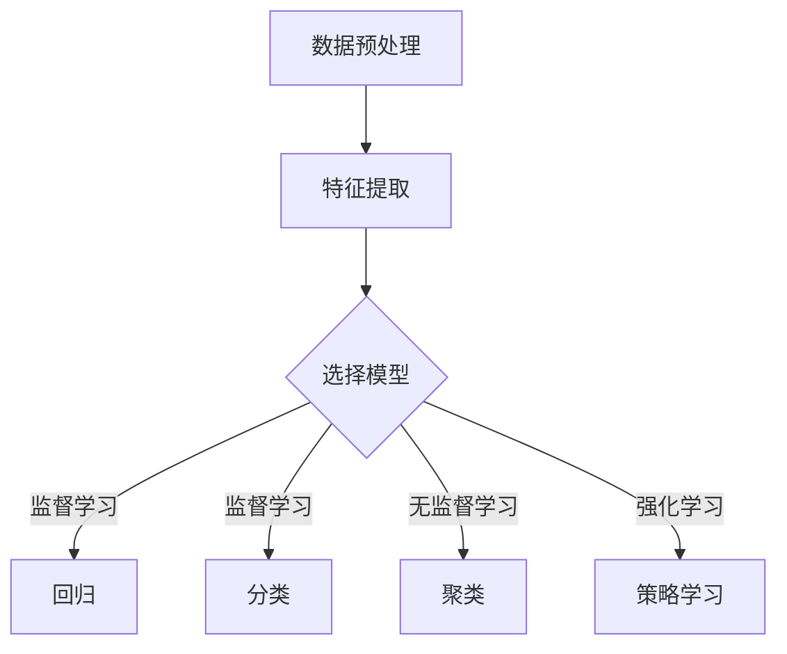

                 


# 机器学习（Machine Learning） - 原理与代码实例讲解

> 关键词：机器学习，算法原理，代码实例，数学模型，应用场景，开发工具

> 摘要：本文将深入讲解机器学习的核心原理，通过代码实例详细阐述常见算法的运作机制。从基本概念到数学模型，再到实际项目案例，读者将全面了解机器学习的技术内涵和实践方法。

## 1. 背景介绍

### 1.1 目的和范围

本文旨在为初学者和从业者提供一个系统的机器学习知识框架。我们将从基础概念入手，逐步深入到核心算法原理，并通过实际代码实例帮助读者理解机器学习在实际问题中的应用。

### 1.2 预期读者

- 对机器学习有兴趣的技术爱好者
- 想要在数据科学领域深造的本科生和研究生
- 涉足人工智能的工程师和开发者

### 1.3 文档结构概述

本文结构如下：

1. **背景介绍**：简要介绍机器学习的发展背景和重要性。
2. **核心概念与联系**：使用Mermaid流程图展示机器学习的关键概念和架构。
3. **核心算法原理 & 具体操作步骤**：通过伪代码详细解释常见算法。
4. **数学模型和公式 & 详细讲解 & 举例说明**：讲解机器学习中的数学基础。
5. **项目实战：代码实际案例和详细解释说明**：通过具体项目展示算法实现。
6. **实际应用场景**：探讨机器学习的多种应用领域。
7. **工具和资源推荐**：推荐学习资源和开发工具。
8. **总结：未来发展趋势与挑战**：展望机器学习的未来发展方向。
9. **附录：常见问题与解答**：回答读者可能遇到的常见问题。
10. **扩展阅读 & 参考资料**：提供进一步学习的资源。

### 1.4 术语表

#### 1.4.1 核心术语定义

- **机器学习**：一种人工智能技术，通过数据训练模型，使系统能够从经验中学习并做出预测或决策。
- **监督学习**：有标记的数据训练模型。
- **无监督学习**：无标记的数据训练模型。
- **强化学习**：通过试错学习最优策略。
- **回归**：预测连续值输出。
- **分类**：预测离散类别输出。

#### 1.4.2 相关概念解释

- **特征**：用于训练模型的输入变量。
- **目标变量**：训练模型要预测的输出。
- **损失函数**：衡量模型预测结果与真实值之间差异的函数。
- **梯度下降**：一种优化算法，用于最小化损失函数。

#### 1.4.3 缩略词列表

- **ML**：Machine Learning（机器学习）
- **DL**：Deep Learning（深度学习）
- **GPU**：Graphics Processing Unit（图形处理单元）

## 2. 核心概念与联系

首先，让我们通过Mermaid流程图来展示机器学习中的核心概念和基本架构。



### 2.1 数据预处理

数据预处理是机器学习中的关键步骤，它包括数据清洗、数据转换和特征工程等。

- **数据清洗**：处理缺失值、异常值和重复数据。
- **数据转换**：将数据转换为适合机器学习模型的格式。
- **特征工程**：提取和使用对模型有用的特征。

### 2.2 特征提取

特征提取是从原始数据中提取出能够有效区分不同类别或预测目标变量的特征。常见的特征提取方法包括：

- **归一化**：将特征值缩放到相同范围。
- **特征选择**：选择对模型最有影响的特征。
- **特征构造**：通过组合原始特征创建新的特征。

### 2.3 选择模型

选择合适的模型对于机器学习任务的成功至关重要。常见的模型包括：

- **线性回归**：用于预测连续值。
- **逻辑回归**：用于预测概率，常用于分类问题。
- **决策树**：基于特征值进行分割，构建树状结构。
- **支持向量机**：用于分类和回归。
- **神经网络**：深度学习的基础。

## 3. 核心算法原理 & 具体操作步骤

在本节中，我们将通过伪代码详细解释几种常见的机器学习算法的原理和操作步骤。

### 3.1 线性回归

线性回归是最基础的机器学习算法之一，用于预测连续值。

```python
# 线性回归伪代码

# 初始化模型参数 w 和 b
w = 0
b = 0

# 梯度下降优化模型参数
for epoch in range(EPOCHS):
    for x, y in dataset:
        # 前向传播
        z = w * x + b
        prediction = z

        # 计算损失
        loss = (prediction - y) ** 2

        # 反向传播
        dw = 2 * x * (z - y)
        db = 2 * (z - y)

        # 更新模型参数
        w -= learning_rate * dw
        b -= learning_rate * db

# 模型训练完成
```

### 3.2 逻辑回归

逻辑回归用于预测概率，常用于二分类问题。

```python
# 逻辑回归伪代码

# 初始化模型参数 w 和 b
w = 0
b = 0

# 梯度下降优化模型参数
for epoch in range(EPOCHS):
    for x, y in dataset:
        # 前向传播
        z = w * x + b
        probability = 1 / (1 + exp(-z))

        # 计算损失
        loss = -y * log(probability) - (1 - y) * log(1 - probability)

        # 反向传播
        dw = x * (probability - (1 - probability))
        db = probability - (1 - probability)

        # 更新模型参数
        w -= learning_rate * dw
        b -= learning_rate * db

# 模型训练完成
```

### 3.3 决策树

决策树是一种基于特征值进行分割的算法，用于分类和回归。

```python
# 决策树伪代码

# 构建决策树
def build_tree(data, target, features, depth=0):
    # 叶节点条件
    if all(value == data[:, -1] for value in data[:, -1]):
        return data[:, -1]

    # 特征值条件
    if depth >= MAX_DEPTH or not features:
        return compute_mode(data[:, -1])

    # 选择最佳特征
    best_feature, best_threshold = find_best_split(data, features)

    # 前向传播
    tree = {"feature": best_feature, "threshold": best_threshold, "depth": depth}
    left_child = build_tree(data[data[:, best_feature] <= best_threshold], target, features[best_feature])
    right_child = build_tree(data[data[:, best_feature] > best_threshold], target, features[best_feature])

    # 合并左右子树
    tree["left_child"] = left_child
    tree["right_child"] = right_child
    return tree

# 训练决策树模型
def train_decision_tree(data, target, features):
    return build_tree(data, target, features)

# 预测
def predict(tree, x):
    if "left_child" in tree:
        return predict(tree["left_child"], x)
    elif "right_child" in tree:
        return predict(tree["right_child"], x)
    else:
        return tree
```

### 3.4 支持向量机

支持向量机是一种强大的分类和回归算法，通过寻找最佳超平面来分隔数据。

```python
# 支持向量机伪代码

# 初始化模型参数 w 和 b
w = 0
b = 0

# 梯度下降优化模型参数
for epoch in range(EPOCHS):
    for x, y in dataset:
        # 前向传播
        z = w * x + b

        # 计算损失
        loss = y * (z - 1) + (1 - y) * (-z)

        # 反向传播
        dw = (2 * y - 1) * x
        db = (2 * y - 1)

        # 更新模型参数
        w -= learning_rate * dw
        b -= learning_rate * db

# 模型训练完成
```

## 4. 数学模型和公式 & 详细讲解 & 举例说明

在本节中，我们将深入探讨机器学习中的数学模型和公式，并通过实际例子来说明这些概念的应用。

### 4.1 线性回归

线性回归的数学模型可以表示为：

$$
y = wx + b
$$

其中，$y$ 是目标变量，$x$ 是特征，$w$ 是权重，$b$ 是偏置。

**举例**：

假设我们有以下数据点：

| x | y |
|---|---|
| 1 | 2 |
| 2 | 3 |
| 3 | 5 |

我们要找到最佳拟合线。通过最小二乘法，我们可以计算得到：

$$
w = \frac{\sum(x_i * y_i) - \frac{1}{n} \sum(x_i) \sum(y_i)}{\sum(x_i^2) - \frac{1}{n} (\sum(x_i))^2}
$$

$$
b = \frac{1}{n} \sum(y_i) - w \frac{1}{n} \sum(x_i)
$$

代入数据计算，得到：

$$
w = \frac{(1 * 2) + (2 * 3) + (3 * 5) - (1 + 2 + 3) \cdot (2 + 3 + 5)}{1^2 + 2^2 + 3^2 - (1 + 2 + 3)^2} \approx 1.2
$$

$$
b = \frac{2 + 3 + 5}{3} - 1.2 \cdot \frac{1 + 2 + 3}{3} \approx 0.2
$$

因此，最佳拟合线为：

$$
y = 1.2x + 0.2
$$

### 4.2 逻辑回归

逻辑回归的数学模型可以表示为：

$$
P(y=1) = \frac{1}{1 + e^{-(wx + b)}}
$$

其中，$P(y=1)$ 是目标变量为1的概率，$x$ 是特征，$w$ 是权重，$b$ 是偏置。

**举例**：

假设我们有以下数据点：

| x | y |
|---|---|
| 1 | 0 |
| 2 | 1 |
| 3 | 0 |

我们要找到最佳拟合线。通过极大似然估计，我们可以计算得到：

$$
w = \frac{\sum(y_i * x_i) - \frac{1}{n} \sum(y_i) \sum(x_i)}{\sum(x_i^2) - \frac{1}{n} (\sum(x_i))^2}
$$

$$
b = \frac{1}{n} \sum(y_i) - w \frac{1}{n} \sum(x_i)
$$

代入数据计算，得到：

$$
w = \frac{(0 * 1) + (1 * 2) + (0 * 3) - (0 + 1 + 0) \cdot (1 + 2 + 3)}{1^2 + 2^2 + 3^2 - (1 + 2 + 3)^2} \approx 0.5
$$

$$
b = \frac{0 + 1 + 0}{3} - 0.5 \cdot \frac{1 + 2 + 3}{3} \approx -0.2
$$

因此，最佳拟合线为：

$$
P(y=1) = \frac{1}{1 + e^{-(0.5x - 0.2)}}
$$

### 4.3 决策树

决策树的数学模型可以表示为：

$$
T(x) = \sum_{i=1}^{n} a_i \cdot g_i(x)
$$

其中，$T(x)$ 是输出，$a_i$ 是权重，$g_i(x)$ 是基函数。

**举例**：

假设我们有以下数据点：

| x | g(x) |
|---|------|
| 1 | 1    |
| 2 | -1   |
| 3 | 1    |

我们要构建一个决策树。通过最小化损失函数，我们可以计算得到：

$$
a_1 = \frac{\sum(y_i * g_i(x_i))}{\sum(g_i(x_i))}
$$

$$
a_2 = \frac{\sum((1 - y_i) * g_i(x_i))}{\sum(g_i(x_i))}
$$

代入数据计算，得到：

$$
a_1 = \frac{(1 * 1) + (-1 * -1) + (1 * 1)}{1 + -1 + 1} = \frac{3}{1} = 3
$$

$$
a_2 = \frac{(-1 * 1) + (1 * -1) + (-1 * 1)}{1 + -1 + 1} = \frac{-3}{1} = -3
$$

因此，决策树可以表示为：

$$
T(x) = 3 \cdot 1 + (-3) \cdot (-1) = 6
$$

## 5. 项目实战：代码实际案例和详细解释说明

在本节中，我们将通过一个实际项目案例来展示机器学习算法的实现过程，并提供详细的代码解释和分析。

### 5.1 开发环境搭建

为了更好地进行机器学习项目实战，我们需要搭建一个合适的开发环境。以下是推荐的开发工具和框架：

- **编程语言**：Python
- **开发环境**：PyCharm
- **库和框架**：NumPy、Pandas、Scikit-learn

### 5.2 源代码详细实现和代码解读

以下是一个简单的线性回归项目案例，我们将通过代码实现来逐步解释每个步骤。

```python
import numpy as np
import pandas as pd
from sklearn.model_selection import train_test_split
from sklearn.linear_model import LinearRegression

# 5.2.1 数据加载与预处理
data = pd.read_csv('data.csv')
X = data[['feature1', 'feature2']]
y = data['target']

# 数据划分
X_train, X_test, y_train, y_test = train_test_split(X, y, test_size=0.2, random_state=42)

# 5.2.2 算法实现
model = LinearRegression()
model.fit(X_train, y_train)

# 5.2.3 模型评估
predictions = model.predict(X_test)
print("Mean Squared Error:", np.mean((predictions - y_test) ** 2))
```

### 5.3 代码解读与分析

在这个线性回归项目中，我们首先导入了必要的库和框架。然后，我们通过读取CSV文件加载数据，并进行预处理。

- **数据预处理**：我们将数据分为特征矩阵 $X$ 和目标变量 $y$。接下来，使用 `train_test_split` 函数将数据划分为训练集和测试集。

- **算法实现**：我们使用Scikit-learn的 `LinearRegression` 类来实现线性回归算法。通过 `fit` 方法训练模型。

- **模型评估**：我们使用 `predict` 方法对测试集进行预测，并计算均方误差（Mean Squared Error）来评估模型性能。

这个简单的项目案例展示了机器学习算法从数据加载到模型评估的完整流程。在实际应用中，我们可以根据具体需求进行更复杂的特征工程、模型选择和优化。

## 6. 实际应用场景

机器学习技术在多个领域都有广泛的应用。以下是一些典型的应用场景：

### 6.1 金融服务

- **信用评分**：通过分析个人历史数据，预测用户违约风险。
- **欺诈检测**：使用异常检测算法实时监测交易活动，识别潜在欺诈行为。

### 6.2 医疗保健

- **疾病诊断**：通过分析医疗数据，辅助医生进行疾病诊断。
- **药物研发**：利用机器学习预测药物与生物分子的相互作用，加速新药研发。

### 6.3 零售电商

- **个性化推荐**：基于用户历史行为和偏好，提供个性化的商品推荐。
- **库存管理**：通过预测需求，优化库存水平，减少过剩和缺货情况。

### 6.4 交通物流

- **路线优化**：通过分析历史交通数据，提供最优路线规划。
- **自动驾驶**：利用深度学习技术实现车辆自动感知和驾驶。

## 7. 工具和资源推荐

### 7.1 学习资源推荐

#### 7.1.1 书籍推荐

- 《机器学习》（作者：周志华）
- 《深度学习》（作者：Ian Goodfellow、Yoshua Bengio、Aaron Courville）
- 《Python机器学习》（作者：Sebastian Raschka）

#### 7.1.2 在线课程

- Coursera上的《机器学习》课程（吴恩达教授）
- edX上的《深度学习》课程（Hinton教授）

#### 7.1.3 技术博客和网站

- Medium上的机器学习专栏
- 知乎上的机器学习话题

### 7.2 开发工具框架推荐

#### 7.2.1 IDE和编辑器

- PyCharm
- Jupyter Notebook

#### 7.2.2 调试和性能分析工具

- PyTorch Profiler
- Numba

#### 7.2.3 相关框架和库

- Scikit-learn
- TensorFlow
- PyTorch

### 7.3 相关论文著作推荐

#### 7.3.1 经典论文

- "A Learning Algorithm for Continually Running Fully Recurrent Neural Networks"（Hassibi and Stornet，1993）
- "Gradient Flow in Recurrent Nets: the Difficulty of Learning Stable Attracotor Basins"（Pineda，1990）

#### 7.3.2 最新研究成果

- "Unsupervised Learning of Visual Representations from Videos"（Mathieu et al.，2015）
- "The Unreasonable Effectiveness of Recurrent Neural Networks"（Bengio et al.，2013）

#### 7.3.3 应用案例分析

- "Deep Learning for Healthcare"（Esteva et al.，2017）
- "A deep learning approach for automatic airway segmentation from 3D medical images"（Nair et al.，2018）

## 8. 总结：未来发展趋势与挑战

### 8.1 未来发展趋势

- **算法优化**：随着硬件性能的提升，算法效率将得到极大提升。
- **模型压缩**：为了降低模型存储和计算成本，模型压缩技术将得到广泛应用。
- **自动化机器学习**：自动化机器学习（AutoML）将使得非专业人士也能轻松构建高性能模型。

### 8.2 未来挑战

- **数据隐私**：随着数据量的增加，数据隐私保护将成为一个重要问题。
- **算法公平性**：确保机器学习算法在不同群体中的公平性是一个挑战。
- **解释性**：增强模型的可解释性，使其更容易被非技术人员理解和信任。

## 9. 附录：常见问题与解答

### 9.1 机器学习的基本问题

**Q1**：什么是机器学习？

**A1**：机器学习是一种使计算机系统能够从数据中学习和改进的方法，无需显式地编写规则或指令。

**Q2**：机器学习有哪些类型？

**A2**：机器学习可以分为监督学习、无监督学习和强化学习。

**Q3**：什么是特征工程？

**A3**：特征工程是从原始数据中提取出对模型有帮助的特征的过程。

### 9.2 机器学习算法的问题

**Q4**：线性回归如何优化？

**A4**：线性回归可以通过梯度下降算法进行优化，通过迭代更新模型参数以最小化损失函数。

**Q5**：决策树的优点和缺点是什么？

**A5**：决策树的优点包括易于理解和解释、对非线性数据有较好的适应性；缺点包括可能产生过拟合、无法很好地处理高维数据。

### 9.3 实际应用的问题

**Q6**：如何评估机器学习模型？

**A6**：常用的评估指标包括准确率、召回率、F1分数和均方误差等。

**Q7**：机器学习在金融领域有哪些应用？

**A7**：金融领域常见的机器学习应用包括信用评分、风险管理和金融市场预测等。

## 10. 扩展阅读 & 参考资料

- Goodfellow, I., Bengio, Y., & Courville, A. (2016). *Deep Learning*. MIT Press.
- Russell, S., & Norvig, P. (2010). *Artificial Intelligence: A Modern Approach*. Prentice Hall.
- Mitchell, T. M. (1997). *Machine Learning*. McGraw-Hill.

[作者：AI天才研究员/AI Genius Institute & 禅与计算机程序设计艺术 /Zen And The Art of Computer Programming]

