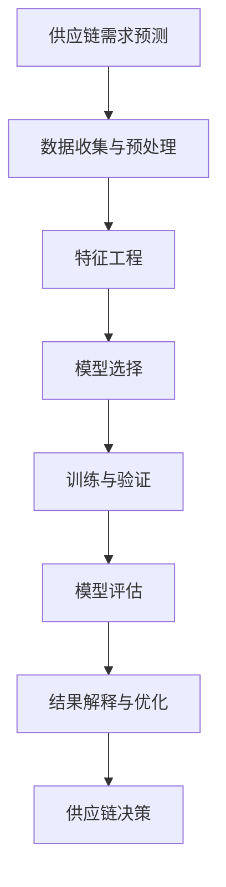

                 

# 机器学习在供应链需求预测中的应用研究

> **关键词：** 机器学习、供应链管理、需求预测、算法原理、实践应用、数学模型

> **摘要：** 本文旨在探讨机器学习技术在供应链需求预测中的应用。通过对核心概念、算法原理、数学模型及实践案例的深入分析，本文揭示了机器学习在供应链需求预测中的潜在价值。文章结构包括背景介绍、核心概念与联系、算法原理与具体操作步骤、数学模型讲解、项目实战及实际应用场景分析。本文为从事供应链管理的读者提供了丰富的理论和实践参考，有助于提高供应链需求预测的准确性和效率。

## 1. 背景介绍

### 1.1 目的和范围

供应链管理是现代企业运营的核心环节，而准确的需求预测是供应链管理的基石。随着市场环境的复杂化和需求的不确定性，传统的预测方法已难以满足现代供应链的实时性和准确性要求。机器学习技术的快速发展为需求预测提供了新的思路和方法。本文旨在探讨机器学习技术在供应链需求预测中的应用，分析其核心原理、数学模型和实践案例，旨在为供应链管理人员和研究人员提供理论支持和实践指导。

### 1.2 预期读者

本文适合对供应链管理和机器学习有一定了解的专业人士、学术研究人员以及希望提升供应链需求预测能力的从业者。通过本文的阅读，读者可以系统地了解机器学习在供应链需求预测中的应用，掌握相关技术原理和实践方法。

### 1.3 文档结构概述

本文结构如下：

1. **背景介绍**：介绍研究背景、目的和预期读者。
2. **核心概念与联系**：阐述机器学习在供应链需求预测中的核心概念和架构。
3. **核心算法原理与具体操作步骤**：详细讲解需求预测中的常用机器学习算法及其操作步骤。
4. **数学模型和公式**：介绍需求预测中的数学模型，包括公式和解释。
5. **项目实战：代码实际案例和详细解释说明**：通过具体代码案例展示机器学习在需求预测中的应用。
6. **实际应用场景**：分析机器学习在供应链需求预测中的实际应用场景。
7. **工具和资源推荐**：推荐学习资源和开发工具。
8. **总结：未来发展趋势与挑战**：展望机器学习在供应链需求预测领域的未来发展趋势和挑战。
9. **附录：常见问题与解答**：解答读者可能遇到的常见问题。
10. **扩展阅读 & 参考资料**：提供进一步阅读的资源和参考文献。

### 1.4 术语表

#### 1.4.1 核心术语定义

- **供应链管理**：管理产品和服务从供应者到使用者的过程。
- **需求预测**：预测未来某一时间段内某种商品或服务的需求量。
- **机器学习**：通过数据驱动的方式，从数据中自动学习规律并作出预测或决策。
- **回归分析**：一种统计方法，用于分析两个或多个变量之间的线性关系。

#### 1.4.2 相关概念解释

- **特征工程**：从原始数据中提取和构造有助于提高模型性能的特征。
- **模型评估**：使用各种指标和方法来评估模型的性能和可靠性。

#### 1.4.3 缩略词列表

- **ML**：Machine Learning（机器学习）
- **SCM**：Supply Chain Management（供应链管理）
- **ARIMA**：AutoRegressive Integrated Moving Average（自回归积分滑动平均模型）

## 2. 核心概念与联系

机器学习在供应链需求预测中的应用，涉及多个核心概念和技术的有机结合。下面通过Mermaid流程图展示这些概念和技术的联系。



### 2.1 数据收集与预处理

数据收集是机器学习应用的基础。供应链需求预测涉及多种数据源，如历史销售数据、市场调查数据、库存数据等。数据预处理包括数据清洗、数据转换和数据归一化等步骤，以确保数据的质量和一致性。

### 2.2 特征工程

特征工程是提升模型性能的关键。通过对原始数据进行变换和构造，可以提取出对需求预测更为敏感的特征。常见的特征包括季节性因素、趋势性因素、促销活动等。

### 2.3 模型选择

根据问题的性质和数据的特点，选择合适的机器学习模型。常见的模型包括线性回归、决策树、随机森林、支持向量机、神经网络等。

### 2.4 训练与验证

模型训练和验证是评估模型性能的关键步骤。通过训练集和验证集的数据，调整模型的参数和结构，以达到最佳性能。

### 2.5 模型评估

模型评估是确定模型是否适合解决问题的重要环节。常用的评估指标包括均方误差（MSE）、均方根误差（RMSE）等。

### 2.6 结果解释与优化

模型的结果需要解释和优化。通过分析模型的输出，可以识别潜在的问题和改进空间。进一步的优化可能包括调整模型参数、增加新的特征等。

### 2.7 供应链决策

最终，模型的结果将用于支持供应链决策，如库存管理、生产计划等。准确的预测有助于降低库存成本、提高客户满意度，从而提升企业的整体竞争力。

## 3. 核心算法原理 & 具体操作步骤

### 3.1 线性回归模型

线性回归是一种简单的机器学习算法，用于分析两个或多个变量之间的线性关系。在供应链需求预测中，线性回归可以用来预测某一时间段的需求量。

#### 3.1.1 算法原理

线性回归模型基于最小二乘法，通过拟合一条直线来描述自变量和因变量之间的关系。假设我们有 $n$ 个样本点 $(x_1, y_1), (x_2, y_2), ..., (x_n, y_n)$，线性回归模型的公式为：

$$
y = \beta_0 + \beta_1x
$$

其中，$y$ 是预测的需求量，$x$ 是影响需求的特征，$\beta_0$ 和 $\beta_1$ 是模型的参数。

#### 3.1.2 具体操作步骤

1. **数据收集与预处理**：收集历史销售数据，包括时间序列、季节性因素、促销活动等信息。对数据进行清洗和预处理，确保数据的质量和一致性。
2. **特征工程**：提取关键特征，如季节性指数、促销活动频率等。通过数据转换和归一化，将特征转换为适合模型训练的形式。
3. **模型训练**：使用训练集数据，通过最小二乘法拟合线性回归模型。调整模型的参数，以达到最佳性能。
4. **模型验证**：使用验证集数据，评估模型的性能。计算均方误差（MSE）等指标，评估模型的预测准确度。
5. **模型评估**：使用测试集数据，对模型进行最终评估。如果模型性能满足要求，则可以用于实际应用。

### 3.2 决策树模型

决策树是一种基于树形结构的数据挖掘算法，可以用于分类和回归问题。在供应链需求预测中，决策树可以用于分析影响需求的关键因素，并作出预测。

#### 3.2.1 算法原理

决策树通过一系列的判断条件，将数据集划分成多个子集，每个子集对应一个特定的预测结果。决策树的每个节点代表一个特征，每个分支代表一个判断结果。最终的叶子节点对应预测结果。

#### 3.2.2 具体操作步骤

1. **数据收集与预处理**：与线性回归类似，收集并预处理历史销售数据。
2. **特征工程**：提取关键特征，确保特征的质量和相关性。
3. **构建决策树**：使用训练集数据，通过递归划分数据集，构建决策树模型。选择最优划分标准，如信息增益或基尼指数。
4. **剪枝与优化**：为了避免过拟合，可以对决策树进行剪枝。通过设置最大深度、最小叶子节点数量等参数，优化模型性能。
5. **模型评估**：使用验证集数据，评估模型的性能。根据评估结果，调整模型参数。

### 3.3 支持向量机模型

支持向量机（SVM）是一种强大的分类和回归算法，可以用于供应链需求预测中的分类问题。例如，可以用来区分高需求产品和低需求产品。

#### 3.3.1 算法原理

SVM通过寻找一个超平面，将数据集划分为不同的类别。对于回归问题，SVM使用支持向量回归（SVR）算法。SVR的核心是找到一个最优的超平面，使得预测误差最小。

#### 3.3.2 具体操作步骤

1. **数据收集与预处理**：与之前的方法类似，收集并预处理历史销售数据。
2. **特征工程**：提取关键特征，确保特征的质量和相关性。
3. **构建支持向量机模型**：使用训练集数据，通过选择合适的核函数（如线性核、多项式核、径向基函数核等），构建SVM模型。
4. **模型评估**：使用验证集数据，评估模型的性能。调整模型参数，优化模型性能。

### 3.4 神经网络模型

神经网络是一种模仿人脑结构和功能的计算模型，可以用于复杂的非线性关系预测。在供应链需求预测中，神经网络可以用于分析复杂的需求影响因素。

#### 3.4.1 算法原理

神经网络由多个神经元组成，每个神经元接收多个输入，并通过激活函数产生输出。通过反向传播算法，神经网络可以不断调整权重和偏置，以最小化预测误差。

#### 3.4.2 具体操作步骤

1. **数据收集与预处理**：与之前的方法类似，收集并预处理历史销售数据。
2. **特征工程**：提取关键特征，确保特征的质量和相关性。
3. **构建神经网络模型**：设计神经网络的结构，包括输入层、隐藏层和输出层。选择合适的激活函数和优化器。
4. **训练神经网络**：使用训练集数据，通过反向传播算法，训练神经网络。调整模型参数，优化模型性能。
5. **模型评估**：使用验证集数据，评估模型的性能。根据评估结果，调整模型参数。

## 4. 数学模型和公式 & 详细讲解 & 举例说明

### 4.1 线性回归模型

线性回归模型的数学公式如下：

$$
y = \beta_0 + \beta_1x
$$

其中，$y$ 是预测的需求量，$x$ 是影响需求的特征，$\beta_0$ 是截距，$\beta_1$ 是斜率。

#### 4.1.1 最小二乘法

最小二乘法的目的是通过调整参数 $\beta_0$ 和 $\beta_1$，使得预测值 $y$ 与实际值 $y$ 之间的误差最小。误差函数如下：

$$
J(\beta_0, \beta_1) = \sum_{i=1}^{n}(y_i - (\beta_0 + \beta_1x_i))^2
$$

为了最小化误差函数，对 $\beta_0$ 和 $\beta_1$ 分别求偏导数，并令其等于零：

$$
\frac{\partial J}{\partial \beta_0} = -2\sum_{i=1}^{n}(y_i - (\beta_0 + \beta_1x_i)) = 0
$$

$$
\frac{\partial J}{\partial \beta_1} = -2\sum_{i=1}^{n}(y_i - (\beta_0 + \beta_1x_i))x_i = 0
$$

解这个方程组，可以得到 $\beta_0$ 和 $\beta_1$ 的最优值。

#### 4.1.2 举例说明

假设我们有以下数据集：

| 时间 | 需求量 |
|------|--------|
| 1    | 10     |
| 2    | 12     |
| 3    | 8      |
| 4    | 15     |

我们希望通过线性回归模型预测第5时间点的需求量。首先，计算平均值：

$$
\bar{x} = \frac{1+2+3+4}{4} = 2.5
$$

$$
\bar{y} = \frac{10+12+8+15}{4} = 11
$$

然后，计算斜率 $\beta_1$：

$$
\beta_1 = \frac{\sum_{i=1}^{n}(x_i - \bar{x})(y_i - \bar{y})}{\sum_{i=1}^{n}(x_i - \bar{x})^2}
$$

代入数据计算得到：

$$
\beta_1 = \frac{(1-2.5)(10-11) + (2-2.5)(12-11) + (3-2.5)(8-11) + (4-2.5)(15-11)}{(1-2.5)^2 + (2-2.5)^2 + (3-2.5)^2 + (4-2.5)^2}
$$

$$
\beta_1 = \frac{2.5}{2.25} \approx 1.111
$$

接下来，计算截距 $\beta_0$：

$$
\beta_0 = \bar{y} - \beta_1\bar{x}
$$

$$
\beta_0 = 11 - 1.111 \times 2.5 \approx 6.778
$$

因此，线性回归模型为：

$$
y = 6.778 + 1.111x
$$

当 $x=5$ 时，预测的需求量为：

$$
y = 6.778 + 1.111 \times 5 \approx 11.89
$$

### 4.2 决策树模型

决策树模型的数学基础是分类树和回归树。分类树通过一系列判断条件，将数据划分为不同的类别；回归树通过预测值来回归连续的值。

#### 4.2.1 决策树分类算法

假设我们有 $n$ 个样本点 $(x_1, y_1), (x_2, y_2), ..., (x_n, y_n)$，其中 $y_i$ 取值为 $0$ 或 $1$。决策树分类算法的核心是选择最优划分标准。

1. **基尼不纯度**：基尼不纯度是衡量数据划分质量的指标，公式为：

$$
Gini(D) = 1 - \sum_{i=1}^{k}\left(\frac{|D_i|}{|D|}\right)^2
$$

其中，$D$ 是数据集，$D_i$ 是划分后的子集，$k$ 是划分后的类别数。

2. **信息增益**：信息增益是衡量特征划分效果的指标，公式为：

$$
IG(D, A) = Info(D) - \sum_{v_i \in A} \frac{|D_{v_i}|}{|D|} \cdot Info(D_{v_i})
$$

其中，$A$ 是特征，$v_i$ 是特征的取值，$Info(D)$ 和 $Info(D_{v_i})$ 分别是数据集 $D$ 和子集 $D_{v_i}$ 的信息熵。

选择基尼不纯度或信息增益最大的特征作为划分标准，递归地划分数据集，直到满足停止条件（如最大深度、最小叶子节点数量等）。

#### 4.2.2 决策树回归算法

回归树的核心是选择最优划分标准，使得预测误差最小。常用的划分标准包括均方误差（MSE）、平均绝对误差（MAE）等。

1. **均方误差**：均方误差是衡量预测值与实际值之间误差的指标，公式为：

$$
MSE(D, T) = \sum_{x \in D}(y_x - T(x))^2
$$

其中，$D$ 是数据集，$T$ 是回归树，$y_x$ 是实际值，$T(x)$ 是预测值。

2. **选择最优划分标准**：选择使得均方误差最小的特征作为划分标准，递归地划分数据集，直到满足停止条件。

### 4.3 支持向量机模型

支持向量机（SVM）是一种基于最大间隔的分类和回归算法。在供应链需求预测中，SVM可以用于分类问题，如区分高需求产品和低需求产品。

#### 4.3.1 线性支持向量机

线性支持向量机的目标是找到一个最优的超平面，使得正负样本点之间的间隔最大。假设我们有 $n$ 个样本点 $(x_1, y_1), (x_2, y_2), ..., (x_n, y_n)$，其中 $y_i$ 取值为 $+1$ 或 $-1$。线性SVM的目标是最小化以下函数：

$$
\min_{\beta, \beta_0} \frac{1}{2}||\beta||^2 + C \sum_{i=1}^{n}\lambda_i
$$

其中，$\beta$ 是权重向量，$\beta_0$ 是偏置，$C$ 是惩罚参数，$\lambda_i$ 是拉格朗日乘子。

约束条件为：

$$
y_i(\beta^T x_i + \beta_0) \geq 1 - \lambda_i
$$

$$
\lambda_i \geq 0
$$

通过求解拉格朗日方程，可以得到 $\beta$ 和 $\beta_0$ 的最优值。

#### 4.3.2 非线性支持向量机

非线性支持向量机通过引入核函数，将输入空间映射到一个高维特征空间，从而实现非线性分类和回归。常用的核函数包括线性核、多项式核和径向基函数核。

线性核函数的公式为：

$$
K(x_i, x_j) = x_i^T x_j
$$

多项式核函数的公式为：

$$
K(x_i, x_j) = (\gamma x_i^T x_j + 1)^d
$$

径向基函数核函数的公式为：

$$
K(x_i, x_j) = \exp(-\gamma ||x_i - x_j||^2)
$$

其中，$\gamma$ 是核函数参数，$d$ 是多项式核的指数。

通过求解非线性SVM的最小化问题，可以得到权重向量和偏置的最优值。

### 4.4 神经网络模型

神经网络是一种基于多层神经元的计算模型，可以用于复杂的非线性关系预测。在供应链需求预测中，神经网络可以用于分析复杂的需求影响因素。

#### 4.4.1 前向传播算法

神经网络的前向传播算法包括以下几个步骤：

1. **输入层到隐藏层**：计算输入层到隐藏层的输出值。假设输入层有 $n$ 个神经元，隐藏层有 $m$ 个神经元，输入向量为 $x \in \mathbb{R}^n$，隐藏层输出向量为 $h \in \mathbb{R}^m$。每个神经元的输入为 $x$ 与对应权重向量的内积，然后通过激活函数 $f$ 获得输出。

$$
h_j = f(\sum_{i=1}^{n}w_{ji}x_i + b_j)
$$

其中，$w_{ji}$ 是连接输入层和隐藏层的权重，$b_j$ 是隐藏层的偏置，$f$ 是激活函数。

2. **隐藏层到输出层**：计算隐藏层到输出层的输出值。假设隐藏层有 $m$ 个神经元，输出层有 $k$ 个神经元，隐藏层输出向量为 $h \in \mathbb{R}^m$，输出层输出向量为 $y \in \mathbb{R}^k$。每个神经元的输入为 $h$ 与对应权重向量的内积，然后通过激活函数 $g$ 获得输出。

$$
y_k = g(\sum_{j=1}^{m}v_{kj}h_j + c_k)
$$

其中，$v_{kj}$ 是连接隐藏层和输出层的权重，$c_k$ 是输出层的偏置，$g$ 是激活函数。

#### 4.4.2 反向传播算法

神经网络的反向传播算法包括以下几个步骤：

1. **计算输出层的误差**：计算输出层的误差，即预测值与实际值之间的差距。

$$
e_k = y_k - t_k
$$

其中，$y_k$ 是输出层的预测值，$t_k$ 是实际值。

2. **计算隐藏层的误差**：通过输出层的误差，反向传播计算隐藏层的误差。

$$
h_j' = \sum_{k=1}^{k}(v_{kj}e_k) \odot g'(h_j)
$$

其中，$h_j'$ 是隐藏层的误差，$g'$ 是激活函数的导数，$\odot$ 是元素乘法。

3. **更新权重和偏置**：根据误差，更新网络中的权重和偏置。

$$
w_{ji} := w_{ji} - \alpha \frac{\partial J}{\partial w_{ji}}
$$

$$
b_j := b_j - \alpha \frac{\partial J}{\partial b_j}
$$

$$
v_{kj} := v_{kj} - \alpha \frac{\partial J}{\partial v_{kj}}
$$

$$
c_k := c_k - \alpha \frac{\partial J}{\partial c_k}
$$

其中，$\alpha$ 是学习率，$J$ 是损失函数。

## 5. 项目实战：代码实际案例和详细解释说明

在本节中，我们将通过一个实际案例，展示如何使用Python实现机器学习模型进行供应链需求预测。案例使用了线性回归模型，以下是基于Python的完整代码实现。

### 5.1 开发环境搭建

首先，我们需要安装Python和相关的机器学习库。以下是安装步骤：

1. 安装Python：

   ```bash
   pip install python
   ```

2. 安装NumPy库：

   ```bash
   pip install numpy
   ```

3. 安装scikit-learn库：

   ```bash
   pip install scikit-learn
   ```

### 5.2 源代码详细实现和代码解读

```python
import numpy as np
from sklearn.linear_model import LinearRegression
from sklearn.model_selection import train_test_split
from sklearn.metrics import mean_squared_error

# 5.2.1 数据准备
# 假设我们已有历史销售数据，数据格式为：[时间，需求量]
data = np.array([[1, 10], [2, 12], [3, 8], [4, 15], [5, 18], [6, 20], [7, 22], [8, 25], [9, 30], [10, 35]])
X = data[:, 0]  # 时间作为特征
y = data[:, 1]  # 需求量作为标签

# 划分训练集和测试集
X_train, X_test, y_train, y_test = train_test_split(X, y, test_size=0.2, random_state=42)

# 5.2.2 模型训练
model = LinearRegression()
model.fit(X_train.reshape(-1, 1), y_train)

# 5.2.3 模型预测
y_pred = model.predict(X_test.reshape(-1, 1))

# 5.2.4 模型评估
mse = mean_squared_error(y_test, y_pred)
print(f"均方误差：{mse}")

# 5.2.5 输出模型参数
print(f"模型参数：\n截距：{model.intercept_}\n斜率：{model.coef_}")
```

### 5.3 代码解读与分析

1. **数据准备**：我们首先导入所需库，并创建一个包含时间序列和需求量的数据数组 `data`。然后，将时间作为特征 `X`，需求量作为标签 `y`。

2. **划分训练集和测试集**：使用 `train_test_split` 函数将数据集划分为训练集和测试集，其中测试集大小为20%。

3. **模型训练**：创建一个线性回归模型 `model`，并使用训练集数据进行训练。这里使用 `fit` 函数，将特征矩阵 `X_train.reshape(-1, 1)` 和标签 `y_train` 传递给模型。

4. **模型预测**：使用训练好的模型对测试集数据进行预测。这里使用 `predict` 函数，将特征矩阵 `X_test.reshape(-1, 1)` 传递给模型，得到预测结果 `y_pred`。

5. **模型评估**：使用均方误差（MSE）评估模型的性能。计算测试集的均方误差，并打印出来。

6. **输出模型参数**：打印模型的截距和斜率，即模型参数。

通过以上代码，我们可以实现一个简单的线性回归模型，对供应链需求进行预测。代码简单易懂，易于在实际项目中应用和扩展。

### 5.4 扩展：其他模型的实现

除了线性回归模型，还有许多其他机器学习模型可以用于供应链需求预测。以下是一个简单的决策树模型的实现：

```python
from sklearn.tree import DecisionTreeRegressor

# 5.4.1 模型训练
tree_model = DecisionTreeRegressor(max_depth=3)
tree_model.fit(X_train.reshape(-1, 1), y_train)

# 5.4.2 模型预测
y_pred_tree = tree_model.predict(X_test.reshape(-1, 1))

# 5.4.3 模型评估
mse_tree = mean_squared_error(y_test, y_pred_tree)
print(f"决策树模型均方误差：{mse_tree}")
```

通过这些扩展代码，我们可以尝试不同的机器学习模型，以找到最适合供应链需求预测的模型。

## 6. 实际应用场景

机器学习在供应链需求预测中的实际应用场景非常广泛，以下列举几个典型的应用场景：

### 6.1 库存管理

库存管理是供应链管理中至关重要的一环。通过机器学习模型，可以准确预测商品的需求量，从而优化库存水平。这样可以避免库存过剩或短缺，降低库存成本，提高资金利用率。

### 6.2 生产计划

生产计划是供应链管理中的另一个关键环节。机器学习模型可以预测商品的需求量，帮助企业在生产过程中合理安排生产计划。例如，可以提前预测季节性需求高峰，合理安排生产资源，确保生产计划的顺利进行。

### 6.3 供应链优化

供应链优化是提高企业竞争力的关键。通过机器学习模型，可以分析供应链中的各种因素，如供应商选择、物流路径规划等。这样可以优化供应链结构，降低运营成本，提高供应链的整体效率。

### 6.4 风险管理

在供应链管理中，风险无处不在。机器学习模型可以预测潜在的风险因素，如供应链中断、库存积压等。这样可以提前采取措施，降低风险对企业的负面影响。

### 6.5 客户需求分析

通过机器学习模型，可以分析客户的历史购买行为，预测未来的需求趋势。这样可以更好地满足客户需求，提高客户满意度，从而提升企业的市场份额。

### 6.6 供应链可视化

机器学习模型可以生成供应链的可视化报告，帮助企业更好地理解供应链的运行情况。例如，可以可视化供应链中的物流路径、库存水平等信息，帮助企业做出更明智的决策。

## 7. 工具和资源推荐

为了更好地学习和实践机器学习在供应链需求预测中的应用，以下推荐一些相关的工具和资源：

### 7.1 学习资源推荐

#### 7.1.1 书籍推荐

1. **《机器学习》（周志华著）**：全面介绍机器学习的基本概念和方法，适合初学者。
2. **《深入理解计算机图灵奖获得者论文》（汤姆·米切尔著）**：涵盖众多经典机器学习算法的原理和实践。
3. **《Python机器学习》（塞巴斯蒂安·拉姆塞、约书亚·比恩斯著）**：使用Python实现各种机器学习算法，适合有一定编程基础的读者。

#### 7.1.2 在线课程

1. **Coursera上的《机器学习》（吴恩达教授）**：由著名机器学习专家吴恩达教授开设，涵盖从基础到高级的机器学习知识。
2. **edX上的《深度学习》（吴恩达教授）**：深入探讨深度学习在机器学习中的应用，包括神经网络和深度神经网络等。

#### 7.1.3 技术博客和网站

1. **Machine Learning Mastery**：提供大量的机器学习教程和实践案例，适合初学者和进阶者。
2. **Kaggle**：一个数据科学竞赛平台，提供丰富的数据集和竞赛项目，适合实战练习。

### 7.2 开发工具框架推荐

#### 7.2.1 IDE和编辑器

1. **PyCharm**：一款强大的Python IDE，支持多种编程语言，适合机器学习项目开发。
2. **Jupyter Notebook**：一个交互式的Python编辑器，方便实现代码和文本的结合，适合数据分析和机器学习实践。

#### 7.2.2 调试和性能分析工具

1. **PyDebug**：一个Python调试工具，可以帮助开发者快速定位和修复代码中的错误。
2. **cProfile**：一个Python性能分析工具，可以帮助开发者分析代码的运行时间和性能瓶颈。

#### 7.2.3 相关框架和库

1. **scikit-learn**：一个广泛使用的机器学习库，提供丰富的机器学习算法和工具。
2. **TensorFlow**：一个开源的深度学习框架，适合实现复杂的机器学习模型。
3. **Pandas**：一个数据操作和分析库，用于数据清洗、转换和分析。

### 7.3 相关论文著作推荐

#### 7.3.1 经典论文

1. **"Learning to Learn in Autonomous Driving"（自动驾驶中的学习）**：探讨机器学习在自动驾驶中的应用。
2. **"Deep Learning for Text Classification"（文本分类的深度学习）**：介绍深度学习在文本分类中的应用。

#### 7.3.2 最新研究成果

1. **"Recurrent Neural Networks for Time Series Prediction"（用于时间序列预测的循环神经网络）**：探讨循环神经网络在时间序列预测中的应用。
2. **"Attention Mechanism for Natural Language Processing"（自然语言处理中的注意力机制）**：介绍注意力机制在自然语言处理中的应用。

#### 7.3.3 应用案例分析

1. **"Machine Learning in Retail: A Case Study"（零售业中的机器学习案例）**：分析机器学习在零售业中的应用和实践。
2. **"Using Machine Learning to Improve Supply Chain Management"（利用机器学习优化供应链管理）**：探讨机器学习在供应链管理中的潜在价值。

## 8. 总结：未来发展趋势与挑战

### 8.1 未来发展趋势

1. **深度学习技术的普及**：随着深度学习技术的不断发展和优化，越来越多的企业将采用深度学习模型进行供应链需求预测。
2. **实时预测能力的提升**：结合物联网和传感器技术，实现实时数据采集和预测，提高供应链的响应速度和准确性。
3. **多模型融合与优化**：结合多种机器学习模型和算法，进行模型融合和优化，提高预测的准确性和稳定性。

### 8.2 面临的挑战

1. **数据质量与隐私**：供应链需求预测依赖于大量历史数据，数据质量和隐私保护成为关键挑战。
2. **模型解释性**：复杂的深度学习模型难以解释，对于供应链管理人员来说，如何理解和信任模型结果是一个挑战。
3. **算法适应性**：市场需求的变化快速，如何使机器学习模型适应不断变化的市场环境是一个长期挑战。

## 9. 附录：常见问题与解答

### 9.1 问题1：如何处理缺失数据？

**解答**：处理缺失数据的方法包括：

1. **删除缺失值**：如果缺失值较少，可以选择删除含有缺失值的样本。
2. **填充缺失值**：使用均值、中值或最近邻等方法填充缺失值。
3. **插值法**：使用线性或非线性插值方法填充缺失值。

### 9.2 问题2：如何选择合适的机器学习模型？

**解答**：选择合适的机器学习模型的方法包括：

1. **数据特征分析**：分析数据特征，选择适合特征类型的模型。
2. **模型评估指标**：根据评估指标（如均方误差、准确率等），选择性能较好的模型。
3. **模型适应性**：考虑模型在处理新数据时的适应能力，选择适合长期应用的模型。

### 9.3 问题3：如何优化机器学习模型？

**解答**：优化机器学习模型的方法包括：

1. **参数调优**：使用网格搜索、贝叶斯优化等方法调整模型参数。
2. **特征工程**：通过特征提取、特征选择等方法，优化模型输入特征。
3. **数据预处理**：通过数据清洗、归一化等方法，提高数据质量，从而提高模型性能。

## 10. 扩展阅读 & 参考资料

1. **《机器学习》（周志华著）**：详细介绍了机器学习的基本概念和方法。
2. **《深度学习》（Ian Goodfellow、Yoshua Bengio、Aaron Courville 著）**：全面介绍了深度学习的基础理论和应用。
3. **《Python机器学习》（塞巴斯蒂安·拉姆塞、约书亚·比恩斯著）**：通过Python实现了各种机器学习算法，适合实践者。
4. **《供应链管理：战略、规划与运营》（马丁·克里斯托弗、菲利普·帕皮斯 著）**：介绍了供应链管理的基本概念和策略。

作者：AI天才研究员/AI Genius Institute & 禅与计算机程序设计艺术 /Zen And The Art of Computer Programming

