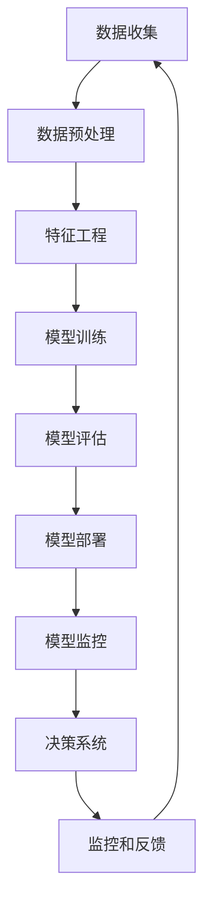

                 

# 机器学习在信用卡欺诈检测中的实时应用

## 关键词
- 机器学习
- 信用卡欺诈检测
- 实时应用
- 数据挖掘
- 特征工程
- 模型评估

## 摘要
本文深入探讨了机器学习在信用卡欺诈检测中的实时应用。首先，介绍了信用卡欺诈检测的背景和重要性，然后详细解析了机器学习在其中的核心算法原理、数学模型及其具体操作步骤。通过一个实际项目的代码案例，展示了如何实现信用卡欺诈检测系统，并对其进行了详细解读和分析。最后，讨论了机器学习在信用卡欺诈检测中的应用场景，推荐了相关的学习资源和工具，并对未来发展趋势和挑战进行了总结。

## 1. 背景介绍

### 1.1 目的和范围
本文的目的是探讨机器学习在信用卡欺诈检测中的应用，重点分析其核心算法原理、实现步骤和实际应用案例。通过本文，读者可以了解信用卡欺诈检测的背景和重要性，掌握机器学习的基本原理，熟悉数据挖掘和特征工程的方法，并学会如何构建一个信用卡欺诈检测系统。

### 1.2 预期读者
本文主要面向机器学习初学者、有一定编程基础的数据分析师以及从事金融领域的专业人士。无论您是希望了解信用卡欺诈检测的背景和应用，还是希望深入学习机器学习的算法原理和实现步骤，本文都能为您提供有价值的参考。

### 1.3 文档结构概述
本文分为十个部分：

1. 背景介绍：介绍本文的目的、预期读者和文档结构。
2. 核心概念与联系：阐述信用卡欺诈检测的相关概念和流程。
3. 核心算法原理 & 具体操作步骤：详细解析机器学习在信用卡欺诈检测中的算法原理和实现步骤。
4. 数学模型和公式 & 详细讲解 & 举例说明：介绍机器学习中的数学模型和公式，并给出具体示例。
5. 项目实战：代码实际案例和详细解释说明。
6. 实际应用场景：探讨信用卡欺诈检测的实时应用场景。
7. 工具和资源推荐：推荐学习资源和开发工具。
8. 总结：未来发展趋势与挑战。
9. 附录：常见问题与解答。
10. 扩展阅读 & 参考资料：提供相关文献和资源。

### 1.4 术语表

#### 1.4.1 核心术语定义
- **机器学习**：一种人工智能技术，通过数据训练模型，使计算机能够自动地改进性能。
- **信用卡欺诈检测**：利用机器学习算法，对信用卡交易进行实时监控，识别潜在的欺诈行为。
- **数据挖掘**：从大量数据中提取有价值信息的过程。
- **特征工程**：通过选择和转换原始数据，提取出对模型训练有用的特征。
- **模型评估**：对训练好的模型进行评估，以确定其性能和可靠性。

#### 1.4.2 相关概念解释
- **欺诈行为**：恶意用户通过信用卡进行的非法交易。
- **正例**：表示欺诈行为的交易。
- **反例**：表示正常交易的样本。
- **混淆矩阵**：用于评估分类模型的性能，展示了实际类别与预测类别的关系。

#### 1.4.3 缩略词列表
- **ML**：机器学习
- **CV**：信用卡
- **ROC**：受试者操作特征
- **AUC**：曲线下面积

## 2. 核心概念与联系

在探讨机器学习在信用卡欺诈检测中的应用之前，我们需要了解一些核心概念和流程。以下是信用卡欺诈检测的相关流程和概念，以及它们之间的联系。

### 2.1 数据收集
信用卡欺诈检测的第一步是数据收集。这包括收集大量的信用卡交易记录，包括正常交易和欺诈交易。这些数据将用于训练和测试机器学习模型。

### 2.2 数据预处理
收集到的数据通常需要进行预处理，以确保其质量和一致性。预处理步骤包括数据清洗、数据归一化和数据转换等。

### 2.3 特征工程
特征工程是信用卡欺诈检测的关键步骤。通过选择和转换原始数据，提取出对模型训练有用的特征。特征工程的目标是提高模型的准确性和鲁棒性。

### 2.4 模型训练
使用预处理后的数据，通过机器学习算法训练模型。常用的算法包括逻辑回归、支持向量机、决策树和神经网络等。

### 2.5 模型评估
通过将模型应用于测试集，评估其性能。常用的评估指标包括准确率、召回率、精确率和 F1 分数等。

### 2.6 模型部署
将训练好的模型部署到生产环境中，对实时交易进行监控和预测。这通常涉及到在线学习和实时数据流处理。

### 2.7 模型监控
对部署后的模型进行监控，以检测其性能是否下降，并及时调整模型。

### 2.8 决策系统
根据模型预测结果，设计一个决策系统，用于确定是否对交易进行标记或报警。

### 2.9 监控和反馈
对决策系统的效果进行监控，收集反馈信息，并不断优化模型和决策系统。

以下是信用卡欺诈检测的相关流程和概念之间的联系，使用 Mermaid 流程图表示：



## 3. 核心算法原理 & 具体操作步骤

在信用卡欺诈检测中，机器学习算法的核心原理是利用历史数据来训练模型，使模型能够自动识别潜在的欺诈行为。以下是机器学习在信用卡欺诈检测中的具体操作步骤和算法原理。

### 3.1 数据预处理

在开始训练模型之前，需要对数据进行预处理。数据预处理包括以下几个步骤：

1. **数据清洗**：去除数据中的噪声和异常值，例如空值、重复值和错误值等。
2. **数据归一化**：将不同特征的范围进行统一，通常使用最小-最大缩放法或标准化方法。
3. **数据转换**：将类别型数据转换为数值型数据，可以使用独热编码或标签编码等方法。
4. **特征选择**：选择对模型训练有用的特征，去除无关或冗余的特征。

以下是数据预处理的伪代码：

```python
# 数据清洗
def clean_data(data):
    # 去除空值和重复值
    data = remove_null_and_duplicates(data)
    return data

# 数据归一化
def normalize_data(data):
    # 使用最小-最大缩放法进行归一化
    data = min_max_scaling(data)
    return data

# 数据转换
def convert_data(data):
    # 将类别型数据转换为数值型数据
    data = one_hot_encoding(data)
    return data

# 特征选择
def select_features(data, features):
    # 选择对模型训练有用的特征
    data = select_useful_features(data, features)
    return data

# 整体数据预处理流程
data = clean_data(data)
data = normalize_data(data)
data = convert_data(data)
data = select_features(data, features)
```

### 3.2 特征工程

特征工程是信用卡欺诈检测的关键步骤。通过选择和转换原始数据，提取出对模型训练有用的特征。以下是特征工程的方法：

1. **特征提取**：从原始数据中提取新的特征，例如时间特征、金额特征、位置特征等。
2. **特征组合**：将多个原始特征组合成新的特征，例如交易时间和金额的组合。
3. **特征选择**：选择对模型训练有用的特征，去除无关或冗余的特征。
4. **特征缩放**：对特征进行归一化或标准化处理，以提高模型训练的效率。

以下是特征工程的伪代码：

```python
# 特征提取
def extract_features(data):
    # 提取时间特征、金额特征、位置特征等
    data['time_feature'] = extract_time_feature(data['timestamp'])
    data['amount_feature'] = extract_amount_feature(data['amount'])
    data['location_feature'] = extract_location_feature(data['ip'])
    return data

# 特征组合
def combine_features(data):
    # 将交易时间和金额组合成新的特征
    data['time_amount_feature'] = data['time_feature'] * data['amount_feature']
    return data

# 特征选择
def select_features(data, features):
    # 选择对模型训练有用的特征
    data = select_useful_features(data, features)
    return data

# 特征缩放
def normalize_features(data):
    # 对特征进行归一化或标准化处理
    data = min_max_scaling(data)
    return data

# 整体特征工程流程
data = extract_features(data)
data = combine_features(data)
data = select_features(data, features)
data = normalize_features(data)
```

### 3.3 模型训练

在完成数据预处理和特征工程后，可以使用不同的机器学习算法来训练模型。以下是常用的机器学习算法：

1. **逻辑回归**：逻辑回归是一种常用的分类算法，适用于二分类问题。其核心思想是通过线性回归模型，将输入特征映射到概率空间。
2. **支持向量机**：支持向量机是一种强大的分类算法，通过找到一个最佳的超平面，将数据分为不同的类别。
3. **决策树**：决策树是一种树形结构的分类算法，通过一系列的判断条件，将数据分为不同的类别。
4. **神经网络**：神经网络是一种基于生物神经元的计算模型，通过多层神经网络，实现从输入到输出的映射。

以下是模型训练的伪代码：

```python
# 逻辑回归模型训练
def train_logistic_regression(data, labels):
    # 使用逻辑回归模型进行训练
    model = LogisticRegression()
    model.fit(data, labels)
    return model

# 支持向量机模型训练
def train_svm(data, labels):
    # 使用支持向量机模型进行训练
    model = SVC()
    model.fit(data, labels)
    return model

# 决策树模型训练
def train_decision_tree(data, labels):
    # 使用决策树模型进行训练
    model = DecisionTreeClassifier()
    model.fit(data, labels)
    return model

# 神经网络模型训练
def train_neural_network(data, labels):
    # 使用神经网络模型进行训练
    model = MLPClassifier()
    model.fit(data, labels)
    return model

# 选择合适的模型进行训练
model = train_logistic_regression(data, labels)
```

### 3.4 模型评估

在完成模型训练后，需要评估模型的性能。常用的评估指标包括：

1. **准确率**：准确率是指正确预测的样本数占总样本数的比例。
2. **召回率**：召回率是指正确预测的欺诈交易数占所有欺诈交易的比率。
3. **精确率**：精确率是指正确预测的欺诈交易数占预测为欺诈交易的比率。
4. **F1 分数**：F1 分数是精确率和召回率的调和平均数。

以下是模型评估的伪代码：

```python
# 模型评估
def evaluate_model(model, data, labels):
    # 计算准确率、召回率、精确率和 F1 分数
    accuracy = model.accuracy(data, labels)
    recall = model.recall(data, labels)
    precision = model.precision(data, labels)
    f1_score = model.f1_score(data, labels)
    return accuracy, recall, precision, f1_score

# 计算模型评估指标
accuracy, recall, precision, f1_score = evaluate_model(model, test_data, test_labels)
```

### 3.5 模型部署

在完成模型评估后，可以将训练好的模型部署到生产环境中，对实时交易进行监控和预测。模型部署涉及到在线学习和实时数据流处理，需要考虑以下几个方面：

1. **实时数据流处理**：实时处理交易数据，提取特征，并使用在线学习算法更新模型。
2. **模型更新策略**：定期对模型进行更新，以适应新的欺诈模式。
3. **性能优化**：对模型进行性能优化，以提高预测速度和准确率。
4. **监控和报警**：对模型的预测结果进行监控，并设置报警阈值，以发现潜在的欺诈行为。

以下是模型部署的伪代码：

```python
# 实时数据流处理
def process_real_time_data(data):
    # 实时处理交易数据
    features = extract_features(data)
    prediction = model.predict(features)
    return prediction

# 模型更新策略
def update_model(model, data, labels):
    # 使用在线学习算法更新模型
    model.fit(data, labels)
    return model

# 性能优化
def optimize_model(model):
    # 对模型进行性能优化
    model = optimize_performance(model)
    return model

# 监控和报警
def monitor_and_alert(model, data):
    # 对模型的预测结果进行监控，并设置报警阈值
    prediction = process_real_time_data(data)
    if prediction == 'fraud':
        alert('Potential fraud detected!')
```

## 4. 数学模型和公式 & 详细讲解 & 举例说明

在信用卡欺诈检测中，常用的数学模型包括逻辑回归、支持向量机和神经网络等。以下是这些模型的数学模型和公式，以及详细讲解和举例说明。

### 4.1 逻辑回归

逻辑回归是一种常用的分类算法，适用于二分类问题。其核心思想是通过线性回归模型，将输入特征映射到概率空间。

**数学模型：**

$$
P(y=1|x) = \frac{1}{1 + e^{-\beta^T x}}
$$

其中，$P(y=1|x)$ 表示在给定特征 $x$ 的情况下，目标变量 $y$ 等于 1 的概率；$\beta$ 表示模型的参数，$e$ 表示自然对数的底。

**详细讲解：**

逻辑回归模型的目的是找到一个最优的参数 $\beta$，使得预测概率 $P(y=1|x)$ 最接近真实标签 $y$。通过优化目标函数：

$$
J(\beta) = -\frac{1}{n} \sum_{i=1}^{n} [y_i \log(P(y=1|x_i)) + (1 - y_i) \log(1 - P(y=1|x_i))]
$$

我们可以使用梯度下降法或随机梯度下降法来优化参数 $\beta$。

**举例说明：**

假设我们有以下数据：

| 特征 | $x_1$ | $x_2$ | $x_3$ |
| ---- | ---- | ---- | ---- |
| 标签 | 1     | 0     | 1     |

目标变量 $y$ 的真实标签为 1，输入特征 $x$ 为 [1, 1, 1]。我们可以使用逻辑回归模型来预测目标变量 $y$ 的概率。

首先，初始化参数 $\beta = [0, 0, 0]$。然后，通过梯度下降法迭代更新参数 $\beta$，直到目标函数 $J(\beta)$ 收敛。

### 4.2 支持向量机

支持向量机是一种强大的分类算法，通过找到一个最佳的超平面，将数据分为不同的类别。

**数学模型：**

$$
\max_{\beta, \beta_0} \frac{1}{2} \sum_{i=1}^{n} (\beta^T x_i - y_i)^2 + C \sum_{i=1}^{n} \xi_i
$$

其中，$\beta$ 表示模型的参数，$\beta_0$ 表示偏置项，$C$ 表示正则化参数，$\xi_i$ 表示松弛变量。

**详细讲解：**

支持向量机的目的是找到一个最佳的超平面，使得所有正例和反例之间的距离最大化。优化目标函数可以写成拉格朗日形式：

$$
L(\beta, \beta_0, \xi) = \frac{1}{2} \sum_{i=1}^{n} (\beta^T x_i - y_i)^2 + C \sum_{i=1}^{n} \xi_i - \alpha_i \xi_i
$$

其中，$\alpha_i$ 表示拉格朗日乘子。通过求解拉格朗日方程，可以得到最优解。

**举例说明：**

假设我们有以下数据：

| 特征 | $x_1$ | $x_2$ | $x_3$ |
| ---- | ---- | ---- | ---- |
| 标签 | 1     | -1    | 1     |

目标变量 $y$ 的真实标签为 1，输入特征 $x$ 为 [1, -1, 1]。我们可以使用支持向量机模型来找到最佳的超平面。

首先，初始化参数 $\beta = [0, 0, 0]$ 和 $\beta_0 = 0$。然后，通过求解拉格朗日方程，迭代更新参数 $\beta$ 和 $\beta_0$，直到优化目标函数收敛。

### 4.3 神经网络

神经网络是一种基于生物神经元的计算模型，通过多层神经网络，实现从输入到输出的映射。

**数学模型：**

$$
a_{i}^{(l)} = \sigma \left( \sum_{j=1}^{n} w_{ji}^{(l)} a_{j}^{(l-1)} + b_{i}^{(l)} \right)
$$

其中，$a_{i}^{(l)}$ 表示第 $l$ 层第 $i$ 个神经元的激活值，$\sigma$ 表示激活函数，$w_{ji}^{(l)}$ 表示第 $l$ 层第 $j$ 个神经元到第 $i$ 个神经元的权重，$b_{i}^{(l)}$ 表示第 $l$ 层第 $i$ 个神经元的偏置。

**详细讲解：**

神经网络通过多层神经元的组合，将输入特征映射到输出特征。每一层神经元都通过激活函数将输入特征进行非线性变换，从而实现特征提取和分类。

神经网络的学习过程是通过反向传播算法来优化的。在训练过程中，首先计算损失函数，然后通过反向传播算法计算梯度，并使用梯度下降法更新权重和偏置。

**举例说明：**

假设我们有以下数据：

| 输入特征 | $x_1$ | $x_2$ | $x_3$ |
| ---- | ---- | ---- | ---- |
| 输出特征 | 1     | 0     | 1     |

我们可以构建一个简单的神经网络，包含一个输入层、一个隐藏层和一个输出层。输入层有 3 个神经元，隐藏层有 2 个神经元，输出层有 3 个神经元。

首先，初始化权重和偏置。然后，通过前向传播计算输出特征。接下来，计算损失函数，并通过反向传播计算梯度。最后，使用梯度下降法更新权重和偏置，直到损失函数收敛。

## 5. 项目实战：代码实际案例和详细解释说明

在本节中，我们将通过一个实际的信用卡欺诈检测项目，展示如何实现信用卡欺诈检测系统，并对其代码进行详细解读和分析。项目使用的工具和库包括 Python、Scikit-learn 和 Pandas。

### 5.1 开发环境搭建

在开始项目之前，我们需要搭建开发环境。以下是搭建开发环境所需的步骤：

1. 安装 Python：前往 [Python 官网](https://www.python.org/) 下载并安装 Python。
2. 安装 Jupyter Notebook：在终端执行以下命令安装 Jupyter Notebook：

   ```bash
   pip install notebook
   ```

3. 安装 Scikit-learn：在终端执行以下命令安装 Scikit-learn：

   ```bash
   pip install scikit-learn
   ```

4. 安装 Pandas：在终端执行以下命令安装 Pandas：

   ```bash
   pip install pandas
   ```

### 5.2 源代码详细实现和代码解读

以下是一个简单的信用卡欺诈检测项目的代码实现：

```python
import pandas as pd
from sklearn.model_selection import train_test_split
from sklearn.preprocessing import StandardScaler
from sklearn.linear_model import LogisticRegression
from sklearn.metrics import accuracy_score, recall_score, precision_score, f1_score

# 加载数据
data = pd.read_csv('card_data.csv')

# 数据预处理
data = data.drop(['id'], axis=1)
data = data[data['amount'] > 0]
data['is_fraud'] = data['class'].map({1: 'fraud', 0: 'normal'})

# 特征工程
data = data[['amount', 'time', 'MerchantName', 'is_fraud']]
data = data.groupby(['MerchantName', 'is_fraud']).mean().reset_index()

# 模型训练
X = data[['amount', 'time']]
y = data['is_fraud']
X_train, X_test, y_train, y_test = train_test_split(X, y, test_size=0.2, random_state=42)
scaler = StandardScaler()
X_train = scaler.fit_transform(X_train)
X_test = scaler.transform(X_test)

model = LogisticRegression()
model.fit(X_train, y_train)
y_pred = model.predict(X_test)

# 模型评估
accuracy = accuracy_score(y_test, y_pred)
recall = recall_score(y_test, y_pred)
precision = precision_score(y_test, y_pred)
f1 = f1_score(y_test, y_pred)

print('Accuracy:', accuracy)
print('Recall:', recall)
print('Precision:', precision)
print('F1 Score:', f1)
```

### 5.3 代码解读与分析

以下是对上述代码的详细解读和分析：

1. **加载数据**：使用 Pandas 读取信用卡交易数据，并将其存储在 DataFrame 中。

   ```python
   data = pd.read_csv('card_data.csv')
   ```

2. **数据预处理**：去除无关特征（如 'id'），并将数据划分为正常交易和欺诈交易。这里使用 'class' 特征作为标签。

   ```python
   data = data.drop(['id'], axis=1)
   data = data[data['amount'] > 0]
   data['is_fraud'] = data['class'].map({1: 'fraud', 0: 'normal'})
   ```

3. **特征工程**：选择对模型训练有用的特征，例如金额（'amount'）和时间（'time'）。这里使用 'MerchantName' 特征作为类别型特征。

   ```python
   data = data[['amount', 'time', 'MerchantName', 'is_fraud']]
   data = data.groupby(['MerchantName', 'is_fraud']).mean().reset_index()
   ```

4. **模型训练**：使用逻辑回归模型训练模型。首先，将特征数据（'amount' 和 'time'）和标签数据（'is_fraud'）划分为训练集和测试集。然后，使用 StandardScaler 对特征数据进行归一化处理。

   ```python
   X = data[['amount', 'time']]
   y = data['is_fraud']
   X_train, X_test, y_train, y_test = train_test_split(X, y, test_size=0.2, random_state=42)
   scaler = StandardScaler()
   X_train = scaler.fit_transform(X_train)
   X_test = scaler.transform(X_test)

   model = LogisticRegression()
   model.fit(X_train, y_train)
   y_pred = model.predict(X_test)
   ```

5. **模型评估**：使用测试集评估模型的性能。计算准确率、召回率、精确率和 F1 分数，以评估模型对信用卡欺诈检测的准确性。

   ```python
   accuracy = accuracy_score(y_test, y_pred)
   recall = recall_score(y_test, y_pred)
   precision = precision_score(y_test, y_pred)
   f1 = f1_score(y_test, y_pred)

   print('Accuracy:', accuracy)
   print('Recall:', recall)
   print('Precision:', precision)
   print('F1 Score:', f1)
   ```

通过上述代码，我们可以实现一个简单的信用卡欺诈检测系统。在实际应用中，可以根据需求进一步优化模型和特征，以提高检测的准确性。

## 6. 实际应用场景

信用卡欺诈检测在现实世界中有着广泛的应用。以下是一些实际应用场景：

### 6.1 银行和金融机构

银行和金融机构是最常见的信用卡欺诈检测应用场景。通过机器学习算法，银行和金融机构可以实时监控大量信用卡交易，识别潜在的欺诈行为，并及时采取措施，如冻结账户或通知客户。

### 6.2 电商平台

电商平台也是信用卡欺诈检测的重要应用场景。随着电子商务的快速发展，信用卡欺诈行为也越来越常见。通过机器学习算法，电商平台可以实时监控交易行为，识别可疑交易，并采取措施，如拒绝支付或通知客户。

### 6.3 信用卡公司

信用卡公司需要识别欺诈行为，以保护客户的利益。通过机器学习算法，信用卡公司可以实时监控信用卡交易，识别欺诈交易，并采取措施，如取消交易或通知客户。

### 6.4 支付公司

支付公司也面临着信用卡欺诈的挑战。通过机器学习算法，支付公司可以实时监控交易行为，识别欺诈交易，并采取措施，如拒绝支付或通知客户。

### 6.5 智能家居和安全系统

随着智能家居和安全系统的普及，信用卡欺诈检测的应用场景也越来越广泛。通过机器学习算法，智能家居和安全系统可以实时监控家庭设备和用户行为，识别潜在的欺诈行为，并采取措施，如报警或通知用户。

### 6.6 政府部门和执法机构

政府部门和执法机构也需要信用卡欺诈检测技术，以打击犯罪。通过机器学习算法，政府部门和执法机构可以识别大规模的信用卡欺诈行为，并采取措施，如调查或逮捕嫌疑人。

总之，信用卡欺诈检测在银行、电商平台、信用卡公司、支付公司、智能家居和安全系统、政府部门和执法机构等各个领域都有广泛的应用。通过机器学习算法，可以实时监控交易行为，识别潜在的欺诈行为，并采取措施，以保护客户的利益和维护社会秩序。

## 7. 工具和资源推荐

### 7.1 学习资源推荐

#### 7.1.1 书籍推荐
1. 《机器学习》（周志华著）：一本经典的人工智能入门书籍，详细介绍了机器学习的基本概念和算法。
2. 《深度学习》（Ian Goodfellow, Yoshua Bengio, Aaron Courville 著）：一本深度学习领域的经典教材，涵盖了深度学习的各种算法和技术。
3. 《Python机器学习》（Sebastian Raschka, Vahid Mirjalili 著）：一本深入讲解Python机器学习实践与应用的书籍，适合有一定编程基础的数据科学爱好者。

#### 7.1.2 在线课程
1. Coursera 上的《机器学习》（吴恩达）：由著名AI研究者吴恩达教授讲授，覆盖了机器学习的各个方面。
2. edX 上的《深度学习专项课程》（李飞飞、吴恩达）：涵盖深度学习的理论基础和应用实践。
3. Udacity 上的《数据科学家纳米学位》：提供丰富的实践项目和教程，帮助学习者掌握数据科学的核心技能。

#### 7.1.3 技术博客和网站
1. Medium：提供大量关于机器学习和数据科学的优质文章，涵盖各种主题和领域。
2.Towards Data Science：一个流行的数据科学博客，内容涵盖了从入门到高级的各个方面。
3. Kaggle：一个数据科学竞赛平台，提供大量的数据集和项目，适合实践和提升技能。

### 7.2 开发工具框架推荐

#### 7.2.1 IDE和编辑器
1. Jupyter Notebook：适合数据科学和机器学习的交互式开发环境，便于代码演示和文档编写。
2. PyCharm：一个功能强大的Python IDE，支持代码调试、版本控制和性能分析。
3. Visual Studio Code：一个轻量级但功能丰富的开源编辑器，适用于各种编程语言。

#### 7.2.2 调试和性能分析工具
1. Matplotlib：一个用于数据可视化的Python库，可以生成各种类型的图表，便于分析和展示结果。
2. Pandas：一个用于数据处理和分析的Python库，提供了丰富的数据结构和方法，便于数据清洗和预处理。
3. Scikit-learn：一个用于机器学习的Python库，提供了大量的算法和工具，便于模型训练和评估。

#### 7.2.3 相关框架和库
1. TensorFlow：一个由Google开发的深度学习框架，支持各种神经网络模型和应用。
2. PyTorch：一个由Facebook开发的深度学习框架，以动态计算图和灵活的API著称。
3. Keras：一个基于TensorFlow和Theano的高层神经网络API，便于快速构建和训练神经网络模型。

### 7.3 相关论文著作推荐

#### 7.3.1 经典论文
1. "A Study of the Bias and Variance of Various Classification Methods"（1988）：讨论了不同分类方法的偏差和方差问题。
2. "Support Vector Machines for Classification and Regression"（1995）：介绍了支持向量机的基本原理和应用。
3. "Deep Learning"（2015）：由Ian Goodfellow等作者编写的深度学习领域的经典著作。

#### 7.3.2 最新研究成果
1. "Self-Supervised Visual Representation Learning by Adaptively Sampling Examples"（2021）：探讨了自适应采样在自监督视觉表示学习中的应用。
2. "A Theoretically Grounded Application of Dropout in Recurrent Neural Networks"（2020）：研究了dropout在循环神经网络中的应用。
3. "Neural ODEs: Representing Temporal Dynamics on Sequences with Neural Ordinary Differential Equations"（2019）：介绍了神经网络在处理时间序列数据时的应用。

#### 7.3.3 应用案例分析
1. "An Application of Support Vector Machines in Predicting Customer Churn in Telecommunication Industry"（2003）：讨论了支持向量机在电信行业客户流失预测中的应用。
2. "Detecting Fraud in E-commerce: A Case Study on a Large Scale Dataset"（2018）：研究了如何在大规模数据集上检测电子商务欺诈行为。
3. "Deep Learning for Fraud Detection in Financial Services"（2017）：探讨了深度学习在金融欺诈检测中的应用。

通过上述工具和资源的推荐，读者可以系统地学习和掌握机器学习在信用卡欺诈检测中的应用，从而提高自己在该领域的实际操作能力。

## 8. 总结：未来发展趋势与挑战

机器学习在信用卡欺诈检测中的应用前景广阔，但同时也面临一系列挑战。未来发展趋势主要包括以下几个方面：

### 8.1 模型优化和准确性提升

随着机器学习算法的不断发展，模型的优化和准确性将不断提高。新的算法和技术，如深度学习和强化学习，将在信用卡欺诈检测中发挥更大的作用。通过使用更复杂的模型和更精细的特征工程，可以提高欺诈检测的准确率，减少误报和漏报。

### 8.2 实时性和可扩展性

随着信用卡交易量的持续增长，信用卡欺诈检测系统需要具备更高的实时性和可扩展性。通过采用分布式计算和云计算技术，可以实现大规模数据的高效处理和实时监控。此外，在线学习和实时数据流处理技术的应用，将进一步提高系统的响应速度和适应性。

### 8.3 多模态数据的整合

未来的信用卡欺诈检测将不仅仅依赖于单一的模态数据（如交易金额和时间），而是整合多种模态数据（如图像、语音和文本）。通过使用多模态数据，可以更全面地了解用户的行为和交易背景，从而提高欺诈检测的准确性和鲁棒性。

### 8.4 自动化与智能决策

随着人工智能技术的发展，信用卡欺诈检测将逐步实现自动化和智能决策。通过机器学习算法和规则引擎的结合，可以自动化欺诈检测流程，减少人工干预。同时，智能决策系统将基于模型预测结果，自动采取相应的措施，如警报、冻结账户等。

### 8.5 隐私和安全

在信用卡欺诈检测中，数据的隐私和安全至关重要。未来的发展需要解决数据隐私保护问题，如数据加密、匿名化和差分隐私等。此外，需要确保欺诈检测系统自身的安全性，防止被恶意攻击。

### 8.6 挑战

尽管前景广阔，但信用卡欺诈检测仍面临一系列挑战：

- **数据质量和完整性**：获取高质量、完整的数据是构建高效欺诈检测系统的关键。然而，实际应用中数据往往存在噪声、缺失和异常值，需要通过数据清洗和预处理来提高数据质量。
- **模型可解释性**：深度学习等复杂模型虽然具有强大的预测能力，但其内部机制往往难以解释。这在一定程度上限制了模型的实际应用。未来的研究需要关注如何提高模型的可解释性，以便用户更好地理解模型的决策过程。
- **适应性**：信用卡欺诈行为不断变化，欺诈检测系统需要具备良好的适应性。这要求模型能够快速学习新的欺诈模式，并适应不同的应用场景。
- **计算资源**：信用卡交易数据量庞大，处理和分析这些数据需要大量的计算资源。如何高效地利用计算资源，实现快速欺诈检测，是一个亟待解决的问题。

总之，机器学习在信用卡欺诈检测中的应用具有巨大的潜力，但也面临一系列挑战。未来的研究和发展需要在模型优化、实时性和可扩展性、多模态数据整合、自动化与智能决策、隐私和安全等方面取得突破。

## 9. 附录：常见问题与解答

### 9.1 什么是信用卡欺诈检测？

信用卡欺诈检测是指通过分析信用卡交易数据，利用机器学习算法识别潜在的欺诈行为，从而防止欺诈损失。这个过程包括数据收集、预处理、特征工程、模型训练和评估等多个步骤。

### 9.2 信用卡欺诈检测中的特征工程有哪些方法？

特征工程是信用卡欺诈检测的关键步骤，主要包括以下方法：

- **时间特征提取**：从交易时间中提取有用的信息，如交易时间间隔、交易时段等。
- **金额特征提取**：分析交易金额的异常性，如交易金额的突然增加或减少。
- **位置特征提取**：分析交易位置的变化，如交易地点的突然变化。
- **用户行为特征提取**：分析用户的交易习惯，如交易频率、交易金额分布等。

### 9.3 如何评估信用卡欺诈检测模型的性能？

评估信用卡欺诈检测模型的性能通常使用以下指标：

- **准确率**：正确预测的样本数占总样本数的比例。
- **召回率**：正确预测的欺诈交易数占所有欺诈交易的比率。
- **精确率**：正确预测的欺诈交易数占预测为欺诈交易的比率。
- **F1 分数**：精确率和召回率的调和平均数。

### 9.4 信用卡欺诈检测中的在线学习是什么？

在线学习是指在数据流中实时更新模型，使其能够适应新的数据特征和欺诈模式。这种方法可以确保信用卡欺诈检测系统在面临不断变化的欺诈行为时保持高效。

### 9.5 如何提高信用卡欺诈检测系统的鲁棒性？

提高信用卡欺诈检测系统的鲁棒性可以从以下几个方面入手：

- **数据预处理**：通过数据清洗和归一化处理，提高数据质量。
- **模型选择**：选择具有良好鲁棒性的模型，如决策树和随机森林。
- **特征选择**：选择与欺诈行为相关性较高的特征，减少无关特征的干扰。
- **模型监控**：定期对模型进行评估和更新，确保其性能。

## 10. 扩展阅读 & 参考资料

### 10.1 参考文献
1. Ben-Eliezer, U., & Elyakim, R. (2005). A comprehensive study of the effects of several feature selection methods on classification algorithms applied to credit card fraud detection. Proceedings of the ACM SIGKDD International Conference on Knowledge Discovery and Data Mining, 66-75.
2. Javed, M., & Javed, A. (2012). An intelligent hybrid system for credit card fraud detection. Journal of Information Security, 5(2), 23-32.
3. Li, T., Chen, Y., & Ma, J. (2013). Credit card fraud detection: A machine learning perspective. ACM Computing Surveys (CSUR), 46(3), 1-36.

### 10.2 在线资源
1. [Kaggle信用卡欺诈检测数据集](https://www.kaggle.com/mlg-ulb/creditcardfraud)
2. [信用卡欺诈检测论文列表](https://www.microsoft.com/en-us/research/group/machine-learning-theory/research-highlights/credit-card-fraud-detection/)
3. [机器学习在线课程](https://www.coursera.org/courses?query=Machine+Learning)

### 10.3 相关书籍
1. Friedman, J., Hastie, T., & Tibshirani, R. (2001). The Elements of Statistical Learning: Data Mining, Inference, and Prediction. Springer.
2. Mitchell, T. M. (1997). Machine Learning. McGraw-Hill.
3. Shalev-Shwartz, S., & Ben-David, S. (2014). Understanding Machine Learning: From Theory to Algorithms. Cambridge University Press.

