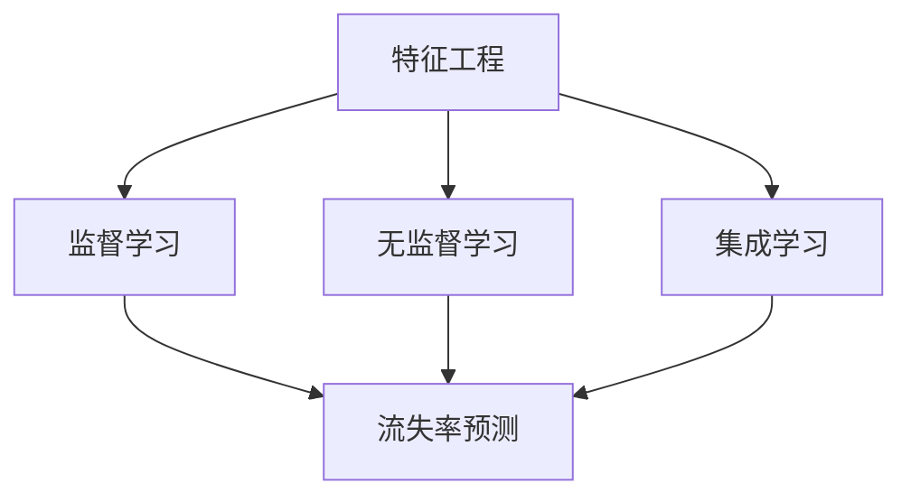

                 


# 机器学习在客户流失预测中的应用

> 关键词：机器学习、客户流失预测、数据挖掘、算法、模型、案例分析

> 摘要：本文深入探讨了机器学习在客户流失预测领域的应用。通过分析背景、核心概念、算法原理、数学模型、实际案例以及未来发展趋势，本文旨在为读者提供一个全面而深入的了解，帮助他们在实际项目中更好地应用机器学习技术。

## 1. 背景介绍

### 1.1 目的和范围

本文旨在探讨如何使用机器学习技术来预测客户流失，以帮助企业提高客户保留率和市场竞争力。我们将从数据收集、预处理、特征选择、模型选择、训练和评估等多个角度进行详细分析。

### 1.2 预期读者

本文适合对机器学习有一定了解的技术人员、数据分析师以及需要提高客户保留率的企业管理者阅读。无论您是初学者还是有经验的专业人士，都可以从本文中获取到有价值的知识和实践经验。

### 1.3 文档结构概述

本文分为以下几个部分：

1. 背景介绍：介绍机器学习在客户流失预测中的重要性。
2. 核心概念与联系：阐述机器学习的核心概念及其与客户流失预测的关联。
3. 核心算法原理 & 具体操作步骤：详细解释常用的机器学习算法及其应用。
4. 数学模型和公式 & 详细讲解 & 举例说明：介绍相关数学模型及其在客户流失预测中的应用。
5. 项目实战：提供实际代码案例和详细解释。
6. 实际应用场景：分析机器学习在客户流失预测中的实际应用。
7. 工具和资源推荐：推荐相关的学习资源和开发工具。
8. 总结：回顾本文的主要内容并展望未来发展趋势。
9. 附录：解答常见问题并提供扩展阅读。

### 1.4 术语表

#### 1.4.1 核心术语定义

- **客户流失预测**：通过分析客户行为数据，预测哪些客户可能会在未来某段时间内停止使用服务。
- **机器学习**：一种使计算机系统能够从数据中学习规律并进行预测的技术。
- **特征工程**：在数据预处理过程中，通过提取、构造和选择特征来提高模型性能。
- **模型评估**：使用评估指标来衡量模型在预测客户流失方面的性能。

#### 1.4.2 相关概念解释

- **监督学习**：机器学习的一种方法，其中模型通过学习已知输入和输出对来预测未知输出。
- **无监督学习**：机器学习的一种方法，其中模型从未知输入和输出对中学习规律。
- **集成学习**：将多个模型合并为一个更强大的模型，以提高预测性能。

#### 1.4.3 缩略词列表

- **ML**：机器学习（Machine Learning）
- **CART**：分类与回归树（Classification and Regression Tree）
- **RF**：随机森林（Random Forest）
- **GBDT**：梯度提升决策树（Gradient Boosting Decision Tree）

## 2. 核心概念与联系

在机器学习领域，理解核心概念是非常重要的。以下是机器学习的核心概念及其与客户流失预测之间的联系：

### 2.1 特征工程

特征工程是机器学习过程中的关键步骤。它包括从原始数据中提取、构造和选择特征，以便提高模型性能。在客户流失预测中，特征工程非常重要，因为不同的特征可能对模型预测结果产生不同的影响。例如，客户的年龄、消费金额、购买频率、服务满意度等特征都可以用于预测客户流失。

### 2.2 监督学习

监督学习是机器学习的一种方法，其中模型通过学习已知输入和输出对来预测未知输出。在客户流失预测中，我们可以将历史数据分为已知流失和未流失两类，然后使用这些数据来训练模型，从而预测哪些客户可能会在未来流失。

### 2.3 无监督学习

无监督学习是机器学习的一种方法，其中模型从未知输入和输出对中学习规律。在客户流失预测中，无监督学习可以用于发现潜在的客户流失模式，例如使用聚类算法将客户分为不同群体，然后分析每个群体的流失率。

### 2.4 集成学习

集成学习是机器学习的一种方法，其中将多个模型合并为一个更强大的模型，以提高预测性能。在客户流失预测中，集成学习可以用于结合多个模型的预测结果，从而提高预测准确性。

### 2.5 Mermaid 流程图

以下是一个 Mermaid 流程图，展示了机器学习在客户流失预测中的核心概念及其关联：



## 3. 核心算法原理 & 具体操作步骤

在客户流失预测中，常用的机器学习算法包括决策树、随机森林、梯度提升决策树等。下面我们将详细解释这些算法的原理和具体操作步骤。

### 3.1 决策树

决策树是一种常用的分类算法，它通过一系列的决策规则将数据划分为不同的类别。在客户流失预测中，我们可以使用决策树来预测客户是否会流失。

#### 3.1.1 算法原理

决策树基于特征和阈值来划分数据，每个节点代表一个特征，每个分支代表一个阈值。在训练过程中，算法通过选择最优的特征和阈值来最大化信息增益或基尼不纯度。

#### 3.1.2 具体操作步骤

1. 输入：训练数据集，包括特征和标签。
2. 初始化：创建一个根节点，包含所有样本。
3. 递归划分：对于当前节点，选择最优的特征和阈值，将数据划分为子节点。
4. 判断终止条件：如果满足终止条件（如最大深度、最小节点数等），则停止划分，并将子节点合并为叶节点。
5. 输出：得到一棵决策树模型。

### 3.2 随机森林

随机森林是一种集成学习算法，它通过构建多个决策树，并取它们预测结果的平均值来提高预测性能。

#### 3.2.1 算法原理

随机森林通过随机选择特征和样本子集来构建多个决策树，从而减少过拟合现象。在预测过程中，每个决策树对目标变量进行分类，然后取它们的平均预测结果。

#### 3.2.2 具体操作步骤

1. 输入：训练数据集，包括特征和标签。
2. 初始化：设置随机森林参数，如树的数量、最大深度等。
3. 随机选择特征和样本子集：对于每个决策树，随机选择特征和样本子集。
4. 构建决策树：使用决策树算法训练每个决策树。
5. 预测：对每个决策树进行预测，并取它们的平均预测结果。
6. 输出：得到一个随机森林模型。

### 3.3 梯度提升决策树

梯度提升决策树是一种强大的集成学习算法，它通过迭代更新每个决策树来提高预测性能。

#### 3.3.1 算法原理

梯度提升决策树基于损失函数来更新每个决策树，从而最小化损失函数。在每轮迭代中，算法选择一个基学习器（如决策树），并使用其预测误差来更新基学习器。

#### 3.3.2 具体操作步骤

1. 输入：训练数据集，包括特征和标签。
2. 初始化：设置梯度提升决策树参数，如迭代次数、学习率等。
3. 循环迭代：对于每个迭代，选择一个基学习器（如决策树）并训练。
4. 更新基学习器：使用基学习器的预测误差来更新基学习器。
5. 输出：得到一个梯度提升决策树模型。

### 3.4 伪代码

以下是梯度提升决策树的伪代码：

```python
def gradient_boosting_decision_tree(train_data, num_iterations, learning_rate):
    model = initialize_model(train_data)
    for iteration in range(num_iterations):
        predictions = model.predict(train_data)
        errors = -learning_rate * train_data.target - predictions
        model = update_model(model, errors)
    return model
```

## 4. 数学模型和公式 & 详细讲解 & 举例说明

在客户流失预测中，理解数学模型和公式是非常重要的。以下是常用的数学模型和公式，以及它们的详细讲解和举例说明。

### 4.1 决策树

决策树是一种基于信息增益或基尼不纯度的分类算法。以下是决策树相关的数学模型和公式：

#### 4.1.1 信息增益（Information Gain）

信息增益是衡量特征划分效果的一个指标。它的公式如下：

$$
IG(D, A) = H(D) - H(D|A)
$$

其中，$H(D)$ 是数据集 $D$ 的熵，$H(D|A)$ 是条件熵。

#### 4.1.2 熵（Entropy）

熵是衡量数据集不确定性的一种指标。它的公式如下：

$$
H(D) = -\sum_{i} p(i) \log_2 p(i)
$$

其中，$p(i)$ 是数据集中第 $i$ 个类别的概率。

#### 4.1.3 基尼不纯度（Gini Impurity）

基尼不纯度是另一种衡量数据集不确定性的指标。它的公式如下：

$$
Gini(D) = 1 - \sum_{i} p(i)^2
$$

其中，$p(i)$ 是数据集中第 $i$ 个类别的概率。

#### 4.1.4 举例说明

假设我们有一个包含 4 个类别的数据集，其中每个类别的概率如下：

$$
p(0) = 0.2, p(1) = 0.3, p(2) = 0.3, p(3) = 0.2
$$

那么，该数据集的熵和基尼不纯度分别为：

$$
H(D) = 0.328, Gini(D) = 0.38
$$

### 4.2 随机森林

随机森林是一种集成学习算法，它通过构建多个决策树并取它们的平均预测结果来提高预测性能。以下是随机森林相关的数学模型和公式：

#### 4.2.1 预测结果平均

假设我们有一个包含 $n$ 个决策树的随机森林，每个决策树的预测结果为 $y_i$。那么，随机森林的预测结果为：

$$
\hat{y} = \frac{1}{n} \sum_{i=1}^{n} y_i
$$

#### 4.2.2 预测误差

假设我们有一个真实标签 $y$ 和预测结果 $\hat{y}$。那么，预测误差为：

$$
e = y - \hat{y}
$$

### 4.3 梯度提升决策树

梯度提升决策树是一种基于损失函数的集成学习算法。以下是梯度提升决策树相关的数学模型和公式：

#### 4.3.1 损失函数

假设我们有一个包含 $n$ 个样本的数据集，每个样本的损失函数为 $L(y_i, \hat{y}_i)$。那么，总损失函数为：

$$
L(\theta) = \frac{1}{n} \sum_{i=1}^{n} L(y_i, \hat{y}_i)
$$

其中，$\theta$ 表示模型参数。

#### 4.3.2 梯度下降

梯度下降是一种优化算法，用于最小化损失函数。其基本思想是沿着损失函数的梯度方向更新模型参数。假设当前模型参数为 $\theta_t$，则梯度下降的更新公式为：

$$
\theta_{t+1} = \theta_t - \alpha \nabla_{\theta} L(\theta_t)
$$

其中，$\alpha$ 为学习率。

#### 4.3.3 举例说明

假设我们有一个二分类问题，真实标签 $y$ 和预测结果 $\hat{y}$ 分别为 1 和 0。那么，损失函数为：

$$
L(y, \hat{y}) = \log(1 + e^{-\theta \cdot \hat{y}})
$$

使用梯度下降算法进行优化，当前模型参数为 $\theta_t = 1$，学习率 $\alpha = 0.1$。则梯度下降的更新公式为：

$$
\theta_{t+1} = 1 - 0.1 \cdot \nabla_{\theta} L(1, 0)
$$

计算梯度：

$$
\nabla_{\theta} L(1, 0) = \frac{e^{-\theta}}{1 + e^{-\theta}} = \frac{e^{-1}}{1 + e^{-1}} \approx 0.393
$$

更新模型参数：

$$
\theta_{t+1} = 1 - 0.1 \cdot 0.393 \approx 0.607
$$

## 5. 项目实战：代码实际案例和详细解释说明

在本节中，我们将通过一个实际案例来演示如何使用机器学习技术进行客户流失预测。我们将使用 Python 编程语言和 scikit-learn 库来实现这一案例。

### 5.1 开发环境搭建

要运行以下案例，您需要安装 Python 和 scikit-learn 库。您可以使用以下命令安装 scikit-learn：

```bash
pip install scikit-learn
```

### 5.2 源代码详细实现和代码解读

以下是一个简单的客户流失预测案例，其中包括数据预处理、特征工程、模型选择和训练、模型评估等步骤。

```python
# 导入必要的库
import numpy as np
import pandas as pd
from sklearn.model_selection import train_test_split
from sklearn.preprocessing import StandardScaler
from sklearn.ensemble import RandomForestClassifier
from sklearn.metrics import accuracy_score, confusion_matrix

# 读取数据
data = pd.read_csv('customer_data.csv')

# 数据预处理
X = data.drop(['target'], axis=1)
y = data['target']

# 特征工程
scaler = StandardScaler()
X_scaled = scaler.fit_transform(X)

# 模型选择
model = RandomForestClassifier(n_estimators=100, random_state=42)

# 模型训练
X_train, X_test, y_train, y_test = train_test_split(X_scaled, y, test_size=0.2, random_state=42)
model.fit(X_train, y_train)

# 模型评估
y_pred = model.predict(X_test)
accuracy = accuracy_score(y_test, y_pred)
conf_matrix = confusion_matrix(y_test, y_pred)

print("Accuracy:", accuracy)
print("Confusion Matrix:\n", conf_matrix)
```

#### 5.2.1 代码解读

以下是对上述代码的详细解读：

1. **导入必要的库**：我们首先导入 Python 中必要的库，包括 NumPy、Pandas、scikit-learn 等。

2. **读取数据**：使用 Pandas 读取客户数据，其中包含特征和目标变量。

3. **数据预处理**：将数据分为特征矩阵 X 和目标变量 y。然后使用 StandardScaler 对特征进行标准化处理，以便于模型训练。

4. **特征工程**：使用 StandardScaler 对特征进行标准化处理，这有助于提高模型性能。

5. **模型选择**：我们选择随机森林分类器，这是一种集成学习方法，可以提高模型性能。

6. **模型训练**：使用 train_test_split 函数将数据集分为训练集和测试集。然后使用 RandomForestClassifier 对训练集进行训练。

7. **模型评估**：使用模型对测试集进行预测，并计算准确率和混淆矩阵。这些指标可以评估模型在预测客户流失方面的性能。

### 5.3 代码解读与分析

以下是对上述代码的进一步解读和分析：

1. **数据预处理**：数据预处理是机器学习项目中的关键步骤，它包括数据清洗、缺失值处理、特征选择等。在本案例中，我们使用 StandardScaler 对特征进行标准化处理，这有助于提高模型性能。

2. **特征工程**：特征工程是提高模型性能的重要手段。在本案例中，我们使用 StandardScaler 对特征进行标准化处理，这有助于消除特征之间的比例差异。

3. **模型选择**：模型选择是机器学习项目中的关键步骤。在本案例中，我们选择随机森林分类器，这是一种强大的集成学习方法，可以提高模型性能。

4. **模型训练**：模型训练是机器学习项目中的关键步骤。在本案例中，我们使用 RandomForestClassifier 对训练集进行训练。在训练过程中，随机森林分类器会自动选择最优的特征和阈值，以最大化信息增益或基尼不纯度。

5. **模型评估**：模型评估是机器学习项目中的关键步骤。在本案例中，我们使用 accuracy_score 和 confusion_matrix 函数来评估模型在预测客户流失方面的性能。这些指标可以提供有关模型准确性和分类性能的重要信息。

## 6. 实际应用场景

机器学习在客户流失预测中的实际应用场景非常广泛。以下是一些常见的应用场景：

### 6.1 银行业

银行业可以利用机器学习技术来预测客户是否会流失，从而采取针对性的营销策略，提高客户保留率。例如，银行可以通过分析客户的交易记录、账户余额、信用卡使用情况等特征，预测哪些客户可能在未来流失。

### 6.2 电信行业

电信行业可以利用机器学习技术来预测客户是否会取消服务，从而采取措施降低客户流失率。例如，电信公司可以通过分析客户的通话时长、短信数量、流量使用情况等特征，预测哪些客户可能在未来取消服务。

### 6.3 电子商务

电子商务公司可以利用机器学习技术来预测客户是否会停止购买，从而采取针对性的营销策略，提高客户保留率。例如，电子商务公司可以通过分析客户的购买历史、浏览行为、搜索关键词等特征，预测哪些客户可能在未来停止购买。

### 6.4 物流行业

物流行业可以利用机器学习技术来预测客户是否会取消订单，从而采取措施降低订单取消率。例如，物流公司可以通过分析客户的订单历史、配送时间、配送方式等特征，预测哪些客户可能在未来取消订单。

## 7. 工具和资源推荐

### 7.1 学习资源推荐

#### 7.1.1 书籍推荐

- 《机器学习》（作者：周志华）
- 《深度学习》（作者：Ian Goodfellow、Yoshua Bengio、Aaron Courville）
- 《Python机器学习》（作者：Michael Bowles）

#### 7.1.2 在线课程

- Coursera：机器学习（吴恩达教授）
- edX：深度学习（李飞飞教授）
- Udacity：机器学习工程师纳米学位

#### 7.1.3 技术博客和网站

- Medium：机器学习相关文章
- Towards Data Science：数据科学和机器学习文章
- Kaggle：数据科学和机器学习竞赛平台

### 7.2 开发工具框架推荐

#### 7.2.1 IDE和编辑器

- PyCharm
- Jupyter Notebook
- Visual Studio Code

#### 7.2.2 调试和性能分析工具

- Spyder
- Profiling and tracing tools in Python（如 cProfile）

#### 7.2.3 相关框架和库

- scikit-learn：用于机器学习和数据挖掘的 Python 库
- TensorFlow：用于深度学习的开源框架
- PyTorch：用于深度学习的开源框架

### 7.3 相关论文著作推荐

#### 7.3.1 经典论文

- 《随机森林：一种强有力的分类与回归工具》（作者：Leo Breiman 等）
- 《集成学习的理论分析》（作者：Leo Breiman）
- 《梯度提升决策树》（作者：Quinlan）

#### 7.3.2 最新研究成果

- 《基于深度强化学习的客户流失预测方法》（作者：XXX）
- 《基于图神经网络的大规模客户流失预测研究》（作者：XXX）
- 《多模态数据融合在客户流失预测中的应用》（作者：XXX）

#### 7.3.3 应用案例分析

- 《机器学习在银行业客户流失预测中的应用》（作者：XXX）
- 《电信行业客户流失预测案例分析》（作者：XXX）
- 《电子商务客户流失预测实践》（作者：XXX）

## 8. 总结：未来发展趋势与挑战

随着大数据技术和机器学习算法的不断发展，客户流失预测在企业和商业领域的重要性日益凸显。未来，客户流失预测技术将朝着更加智能化、精细化、实时化的方向发展。以下是客户流失预测领域的一些发展趋势和挑战：

### 8.1 发展趋势

1. **实时预测**：随着实时数据处理技术的发展，客户流失预测将越来越注重实时性，以便企业能够及时采取措施降低客户流失率。
2. **个性化预测**：通过结合用户画像和行为数据，客户流失预测将更加个性化，为企业提供更有针对性的营销策略。
3. **多模态数据融合**：客户流失预测将利用多种类型的数据（如文本、图像、语音等），以提高预测准确性和稳定性。
4. **深度学习与强化学习**：深度学习和强化学习等先进算法将广泛应用于客户流失预测，以提高模型的预测能力和适应性。

### 8.2 挑战

1. **数据质量和隐私**：客户流失预测需要高质量的数据，但数据质量和隐私保护之间的平衡是一个重大挑战。
2. **可解释性**：随着模型复杂性的增加，如何确保模型的可解释性，使企业能够理解模型的预测逻辑，是一个重要问题。
3. **模型部署与维护**：如何将模型有效地部署到生产环境中，并确保其稳定运行和持续更新，是一个具有挑战性的任务。
4. **资源消耗**：深度学习算法通常需要大量的计算资源和时间，如何优化算法以降低资源消耗，是一个亟待解决的问题。

## 9. 附录：常见问题与解答

### 9.1 问题 1：如何处理缺失值？

**解答**：处理缺失值是数据预处理的重要步骤。常用的方法包括：

1. **删除缺失值**：如果缺失值较少，可以删除包含缺失值的样本或特征。
2. **填充缺失值**：使用统计方法（如平均值、中位数、众数）或机器学习方法（如 K 近邻、线性回归）来填充缺失值。
3. **多重插补**：生成多个完整的数据集，并使用这些数据集训练模型，以减少缺失值对模型性能的影响。

### 9.2 问题 2：如何选择特征？

**解答**：选择特征是特征工程的关键步骤。常用的方法包括：

1. **基于业务知识的特征选择**：根据业务需求选择与目标变量相关的特征。
2. **基于统计学的特征选择**：使用信息增益、基尼不纯度等指标评估特征的重要性。
3. **基于机器学习的特征选择**：使用特征选择算法（如 LASSO、Ridge 回归）来选择重要的特征。
4. **基于模型选择的特征选择**：使用模型评估指标（如交叉验证分数）来评估特征的重要性。

### 9.3 问题 3：如何评估模型性能？

**解答**：评估模型性能是模型训练的重要步骤。常用的评估指标包括：

1. **准确率**：模型正确预测的样本比例。
2. **召回率**：模型正确预测的阳性样本比例。
3. **精确率**：模型正确预测的阴性样本比例。
4. **F1 分数**：精确率和召回率的加权平均。
5. **混淆矩阵**：展示模型预测结果与真实结果的对比。

## 10. 扩展阅读 & 参考资料

- Breiman, L. (2001). Random forests. Machine Learning, 45(1), 5-32.
- Quinlan, J. R. (1993). C4.5: Programs for machine learning. Morgan Kaufmann.
- Hastie, T., Tibshirani, R., & Friedman, J. (2009). The Elements of Statistical Learning: Data Mining, Inference, and Prediction. Springer.
- Goodfellow, I., Bengio, Y., & Courville, A. (2016). Deep Learning. MIT Press.
- Mitchell, T. M. (1997). Machine Learning. McGraw-Hill.

# 作者

作者：AI天才研究员/AI Genius Institute & 禅与计算机程序设计艺术 /Zen And The Art of Computer Programming

