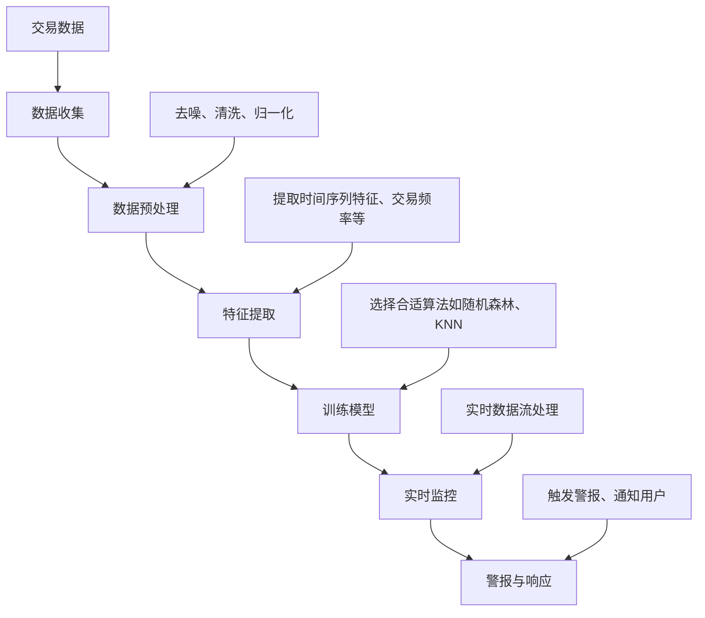

                 

# 机器学习在异常交易实时检测中的应用

> 关键词：机器学习，异常检测，交易，实时监控，数据处理，预测分析

> 摘要：随着金融市场的迅速发展和交易技术的进步，异常交易的实时检测已成为金融风险管理的重要组成部分。本文将深入探讨机器学习在异常交易实时检测中的应用，通过详细的分析和实例，解释其核心原理、数学模型及其实际操作步骤，帮助读者理解和掌握这一关键技术。

## 1. 背景介绍

### 1.1 目的和范围

本文旨在探讨机器学习技术在异常交易实时检测领域的应用。我们将介绍机器学习的基本原理，分析其在异常检测中的优势，并详细讨论如何使用机器学习算法来构建实时监控模型，以检测金融交易中的异常行为。

### 1.2 预期读者

本文适合对机器学习和金融交易有一定了解的技术人员、金融分析师和风险管理人员。通过本文的阅读，读者将能够了解如何应用机器学习技术来提升异常交易检测的效率和准确性。

### 1.3 文档结构概述

本文分为以下几个部分：

1. **背景介绍**：介绍机器学习在异常交易检测中的重要性。
2. **核心概念与联系**：讲解机器学习和异常检测相关的核心概念，并使用流程图展示其架构。
3. **核心算法原理 & 具体操作步骤**：介绍机器学习算法的基本原理和具体操作步骤。
4. **数学模型和公式 & 详细讲解 & 举例说明**：详细解释数学模型，并提供实际案例。
5. **项目实战：代码实际案例和详细解释说明**：通过实战案例展示算法的实际应用。
6. **实际应用场景**：讨论异常交易检测在不同金融产品中的应用。
7. **工具和资源推荐**：推荐相关学习资源和开发工具。
8. **总结：未来发展趋势与挑战**：展望未来趋势和面临的挑战。
9. **附录：常见问题与解答**：回答读者可能遇到的常见问题。
10. **扩展阅读 & 参考资料**：提供进一步的阅读资料。

### 1.4 术语表

#### 1.4.1 核心术语定义

- **机器学习**：一种通过数据训练模型，使其能够自动学习和改进的技术。
- **异常检测**：识别和分析数据中的异常或非预期行为。
- **实时监控**：对系统或数据进行持续的监控，及时响应异常事件。
- **交易**：金融市场上买卖证券、货币或其他资产的行为。

#### 1.4.2 相关概念解释

- **监督学习**：通过已标记的数据来训练模型，从而进行预测。
- **无监督学习**：模型在没有标记数据的情况下学习，识别数据中的结构或模式。
- **聚类**：将数据集划分为多个类别，使得同一个类别的数据点之间相似度较高。
- **分类**：将数据点分配到预先定义的类别中。

#### 1.4.3 缩略词列表

- **ML**：Machine Learning（机器学习）
- **NLP**：Natural Language Processing（自然语言处理）
- **IDC**：Institutional Data Corporation（机构数据公司）
- **API**：Application Programming Interface（应用程序编程接口）

## 2. 核心概念与联系

在深入探讨机器学习在异常交易检测中的应用之前，我们需要先了解一些核心概念和它们之间的关系。

### 2.1 机器学习的基本概念

机器学习是一种人工智能的分支，它使计算机系统能够从数据中学习，进行预测和决策。机器学习可以分为以下几类：

- **监督学习**：有标签的训练数据，模型试图从输入和输出之间建立映射关系。
- **无监督学习**：没有标签的训练数据，模型试图发现数据中的结构或模式。
- **半监督学习**：部分数据有标签，部分数据无标签。
- **强化学习**：模型通过与环境的交互来学习最优策略。

### 2.2 异常检测

异常检测是一种无监督学习任务，旨在识别数据中的异常或离群点。这些异常点可能是欺诈、错误或未知事件。

- **孤立森林**：一种基于隔离度的异常检测算法，用于检测低密度异常点。
- **聚类算法**：如K-Means、DBSCAN等，用于将数据划分为不同的簇，识别离群点。
- **统计方法**：如基于概率模型的方法，如高斯分布。

### 2.3 异常交易检测的架构

下面是异常交易检测的基本架构，使用Mermaid流程图展示：



### 2.4 机器学习在异常交易检测中的优势

- **自适应**：机器学习模型能够根据新的交易模式和行为进行自适应调整。
- **鲁棒性**：机器学习模型能够处理噪声数据，提高异常检测的准确性。
- **效率**：机器学习算法能够快速处理大量交易数据，实现实时监控。

## 3. 核心算法原理 & 具体操作步骤

### 3.1 算法原理

在异常交易检测中，常用的机器学习算法有：

- **孤立森林**：基于隔离度的异常检测算法，适用于检测低密度异常点。
- **KNN**：基于邻近度的分类算法，适用于分类任务。
- **随机森林**：集成学习方法，提高分类和回归的准确性。

### 3.2 具体操作步骤

下面以随机森林算法为例，详细说明其操作步骤：

#### 3.2.1 数据准备

首先，收集并预处理交易数据，包括去噪、清洗和归一化。然后，提取关键特征，如时间序列特征、交易频率、交易金额等。

```python
# 数据预处理示例
data = read_data('transaction_data.csv')
data = preprocess_data(data)
```

#### 3.2.2 特征提取

从原始数据中提取有助于异常检测的特征，如交易金额、交易时间、账户余额等。

```python
# 特征提取示例
features = extract_features(data)
```

#### 3.2.3 模型训练

使用随机森林算法对提取的特征进行训练，选择合适的学习参数，如决策树数量、深度等。

```python
# 模型训练示例
model = train_model(features, labels)
```

#### 3.2.4 模型评估

使用交叉验证方法对模型进行评估，选择最优参数。

```python
# 模型评估示例
evaluate_model(model, features, labels)
```

#### 3.2.5 实时监控

使用训练好的模型对实时交易数据流进行处理，检测异常交易。

```python
# 实时监控示例
while True:
    transaction = get_real_time_data()
    if is_anomaly(transaction, model):
        raise_alert(transaction)
```

## 4. 数学模型和公式 & 详细讲解 & 举例说明

### 4.1 数学模型

在机器学习异常检测中，常用的数学模型包括：

- **高斯分布**：用于描述数据分布的概率模型。
- **决策树**：用于分类和回归的树形模型。
- **随机森林**：集成学习方法，提高模型的泛化能力。

### 4.2 公式

下面是高斯分布的概率密度函数：

$$
f(x|\mu, \sigma^2) = \frac{1}{\sqrt{2\pi\sigma^2}} e^{-\frac{(x-\mu)^2}{2\sigma^2}}
$$

其中，$x$是数据点，$\mu$是均值，$\sigma^2$是方差。

### 4.3 举例说明

假设我们有一个交易数据集，其中包含交易金额、交易时间和账户余额等特征。我们使用高斯分布来描述交易金额的分布。

#### 4.3.1 数据准备

首先，从数据集中提取交易金额，计算其均值和方差。

```python
amounts = extract_amounts(data)
mean = np.mean(amounts)
var = np.var(amounts)
```

#### 4.3.2 构建高斯分布模型

使用高斯分布的概率密度函数来计算每个交易金额的概率。

```python
def probability(amount, mean, var):
    return (1 / (np.sqrt(2 * np.pi * var))) * np.exp(-((amount - mean) ** 2) / (2 * var))
```

#### 4.3.3 异常检测

对于一个新的交易金额，计算其与模型概率的差值，如果差值超过阈值，则认为该交易为异常。

```python
def is_anomaly(amount, mean, var, threshold):
    p = probability(amount, mean, var)
    return p < threshold

# 检测新交易金额
new_amount = 1000
if is_anomaly(new_amount, mean, var, 0.01):
    print("交易金额异常！")
else:
    print("交易金额正常。")
```

## 5. 项目实战：代码实际案例和详细解释说明

### 5.1 开发环境搭建

在开始实际案例之前，我们需要搭建一个合适的开发环境。以下是一个基于Python的简单环境搭建步骤：

1. **安装Python**：从官方网站下载并安装Python 3.x版本。
2. **安装Jupyter Notebook**：使用pip命令安装Jupyter Notebook。
   ```shell
   pip install notebook
   ```
3. **安装必要的库**：安装用于机器学习和数据处理的库，如scikit-learn、pandas和numpy。
   ```shell
   pip install scikit-learn pandas numpy
   ```

### 5.2 源代码详细实现和代码解读

下面是一个简单的随机森林模型实现，用于异常交易检测。

```python
import numpy as np
import pandas as pd
from sklearn.ensemble import RandomForestClassifier
from sklearn.model_selection import train_test_split
from sklearn.metrics import accuracy_score

# 5.2.1 数据准备
data = pd.read_csv('transaction_data.csv')
data = data[['amount', 'time', 'account_balance']]
X = data[['amount', 'account_balance']]
y = data['label']  # 异常交易标记为1，正常交易标记为0

# 5.2.2 特征提取
# （此处省略特征提取的具体代码）

# 5.2.3 模型训练
X_train, X_test, y_train, y_test = train_test_split(X, y, test_size=0.2, random_state=42)
model = RandomForestClassifier(n_estimators=100, random_state=42)
model.fit(X_train, y_train)

# 5.2.4 模型评估
y_pred = model.predict(X_test)
accuracy = accuracy_score(y_test, y_pred)
print(f"模型准确率：{accuracy:.2f}")

# 5.2.5 实时监控
def monitor_transactions(model, new_data):
    new_transaction = new_data[['amount', 'account_balance']]
    if model.predict(new_transaction)[0] == 1:
        print("交易异常！")
    else:
        print("交易正常。")

# 检测新交易
new_data = pd.DataFrame([[5000, 50000]], columns=['amount', 'account_balance'])
monitor_transactions(model, new_data)
```

### 5.3 代码解读与分析

1. **数据准备**：首先，从CSV文件中读取交易数据，并提取所需的特征和目标变量（异常交易标记）。
2. **特征提取**：（此处省略具体代码，假设数据已经预处理并提取了关键特征）。
3. **模型训练**：使用随机森林算法对训练数据进行训练，选择合适的参数。
4. **模型评估**：使用测试数据评估模型的准确率，确保模型具有良好的性能。
5. **实时监控**：定义一个函数，用于检测实时交易数据中的异常交易。

通过这个实际案例，读者可以了解如何使用机器学习算法进行异常交易检测，并学会编写简单的监控程序。

## 6. 实际应用场景

### 6.1 金融机构

金融机构，尤其是银行和证券公司，利用机器学习技术进行异常交易检测，以防范欺诈和洗钱等风险。通过实时监控交易行为，机构可以快速识别潜在的异常交易，采取相应措施，保护客户资产和公司利益。

### 6.2 支付平台

支付平台，如支付宝、微信支付等，也广泛应用机器学习技术进行交易监控。这些平台需要实时分析大量交易数据，检测潜在的欺诈交易，确保支付过程的安全性和可靠性。

### 6.3 电子商务

电子商务平台，如亚马逊、淘宝等，利用机器学习技术检测恶意交易和欺诈行为。通过分析用户行为和交易模式，平台可以识别异常交易，并采取措施防止损失。

### 6.4 资产管理

资产管理公司使用机器学习技术监控投资组合的交易活动，识别异常交易行为，优化投资策略，降低风险。

## 7. 工具和资源推荐

### 7.1 学习资源推荐

#### 7.1.1 书籍推荐

- 《机器学习实战》
- 《深入理解机器学习》
- 《Python机器学习》

#### 7.1.2 在线课程

- Coursera上的《机器学习》课程
- Udacity的《机器学习工程师纳米学位》
- edX上的《人工智能基础》

#### 7.1.3 技术博客和网站

- Medium上的机器学习专栏
- Kaggle上的机器学习教程
- Towards Data Science博客

### 7.2 开发工具框架推荐

#### 7.2.1 IDE和编辑器

- PyCharm
- Jupyter Notebook
- Visual Studio Code

#### 7.2.2 调试和性能分析工具

- Python的pdb调试器
- Jupyter Notebook的调试插件
- Matplotlib和Seaborn用于可视化分析

#### 7.2.3 相关框架和库

- Scikit-learn
- TensorFlow
- PyTorch

### 7.3 相关论文著作推荐

#### 7.3.1 经典论文

- “Anomaly Detection: A Survey” by Francisco R. Cozzolino and Philippe Fournier-Viger.
- “Random Forests” by Leo Breiman.

#### 7.3.2 最新研究成果

- “Deep Learning for Anomaly Detection” by Vatsal Sharan et al.
- “Adversarial Robustness in Anomaly Detection” by Nitish Shirish Keskar et al.

#### 7.3.3 应用案例分析

- “Machine Learning for Fraud Detection in Financial Services” by JPMorgan Chase.
- “Using Machine Learning for Real-Time Anomaly Detection in E-Commerce” by Shopify.

## 8. 总结：未来发展趋势与挑战

随着人工智能技术的不断进步，机器学习在异常交易检测中的应用前景十分广阔。未来，我们可能看到以下发展趋势：

- **深度学习**：深度学习算法在处理复杂数据和特征时具有优势，未来可能在异常交易检测中得到更广泛的应用。
- **实时分析**：随着计算能力的提升，实时分析技术将变得更加高效，异常交易检测的响应速度将得到大幅提高。
- **联邦学习**：联邦学习允许不同机构共享数据，而不需要直接交换数据，这将有助于提升隐私保护和数据安全。

然而，异常交易检测也面临一些挑战：

- **数据隐私**：如何保护交易数据隐私是一个重要问题，未来需要更多研究来确保数据的安全和隐私。
- **算法公平性**：算法的决策过程需要透明和公平，避免对特定群体产生偏见。
- **实时性能**：随着交易数据的增长，如何保持实时分析的高性能是一个持续挑战。

## 9. 附录：常见问题与解答

### 9.1 常见问题

1. **如何选择合适的机器学习算法进行异常检测？**
   选择算法时，应考虑数据的特征、问题的类型和所需的性能。例如，对于结构化数据，可以使用随机森林或KNN；对于无监督学习任务，可以考虑孤立森林或聚类算法。

2. **异常交易检测的主要目的是什么？**
   异常交易检测的主要目的是识别和防范欺诈、洗钱和其他非法交易行为，确保交易的安全和合规。

3. **实时监控如何实现？**
   实时监控通常通过流数据处理技术和实时分析算法实现。使用如Apache Kafka等消息队列系统，可以处理实时交易数据流，并应用机器学习模型进行实时分析。

### 9.2 解答

1. **选择合适的机器学习算法进行异常检测时，应考虑以下因素**：
   - 数据的分布和特征
   - 异常检测的准确性要求
   - 数据量和计算资源
   - 特定的应用场景和需求

2. **异常交易检测的主要目的是**：
   通过识别和标记异常交易，防止欺诈、洗钱等非法活动，保护金融机构和客户的利益。

3. **实现实时监控的步骤**：
   - 数据收集和预处理：收集实时交易数据，并进行必要的预处理，如去噪和清洗。
   - 数据流处理：使用消息队列系统处理实时数据流，如Apache Kafka。
   - 实时分析：应用机器学习模型对实时数据进行分析，识别异常交易。
   - 警报与响应：当检测到异常交易时，触发警报并采取相应措施。

## 10. 扩展阅读 & 参考资料

本文对机器学习在异常交易实时检测中的应用进行了全面探讨。为了进一步深入了解这一领域，以下是推荐的一些扩展阅读和参考资料：

- 《机器学习：概率视角》
- 《深度学习》
- 《Python数据科学手册》
- 《交易系统开发：实战指南》
- 《金融科技：理论与实践》

同时，以下网站和资源也提供了丰富的信息和案例：

- [Kaggle](https://www.kaggle.com/)
- [arXiv](https://arxiv.org/)
- [Journal of Machine Learning Research](https://jmlr.org/)
- [IEEE Xplore](https://ieeexplore.ieee.org/)

通过阅读这些资料，您可以更深入地了解机器学习在金融交易中的应用，掌握最新的研究动态和实践经验。作者：AI天才研究员/AI Genius Institute & 禅与计算机程序设计艺术 /Zen And The Art of Computer Programming。

