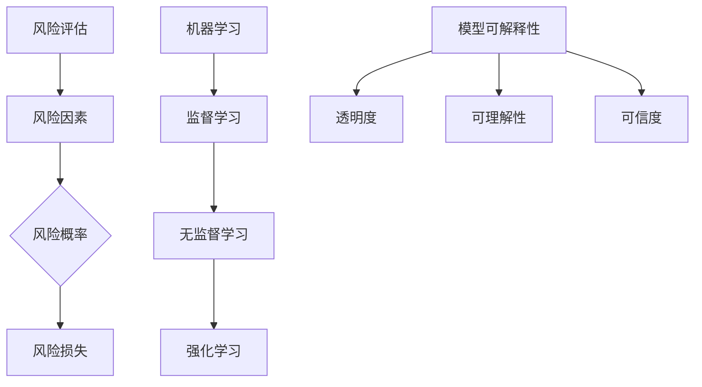

                 

# 机器学习在智能风险评估模型中的可解释性研究

> **关键词：** 机器学习，风险评估，智能模型，可解释性，模型解释，智能分析，数据挖掘，算法优化

> **摘要：** 本文旨在探讨机器学习在构建智能风险评估模型中的重要性，特别是模型的可解释性问题。文章首先介绍了风险评估的基本概念和传统方法，随后详细讲解了机器学习技术如何提升风险评估的准确性和效率。接着，本文重点分析了模型可解释性的重要性，探讨了当前主流的可解释性机器学习算法和技术，并结合实际案例，展示了这些技术在风险评估中的应用。最后，文章总结了未来发展趋势与挑战，提出了相应的优化建议，为推动智能风险评估领域的发展提供了有力支持。

## 1. 背景介绍

### 1.1 目的和范围

随着大数据和人工智能技术的发展，风险评估领域迎来了前所未有的变革。传统的风险评估方法往往依赖于经验模型和统计数据，存在一定的局限性。而机器学习技术的引入，为构建更加智能、精准的风险评估模型提供了新的路径。本文旨在探讨机器学习在智能风险评估模型中的应用，特别是模型的可解释性问题。通过分析当前的研究进展和应用案例，本文旨在为风险评估领域的研究者、从业者提供有益的参考和启示。

### 1.2 预期读者

本文面向的风险评估领域的研究者、从业者以及相关专业的学生。读者应具备一定的机器学习和风险评估基础，对大数据技术有一定的了解。通过本文的阅读，读者可以全面了解机器学习在风险评估中的应用现状、挑战以及未来发展趋势。

### 1.3 文档结构概述

本文结构如下：

1. 背景介绍：阐述风险评估的重要性以及机器学习技术的引入。
2. 核心概念与联系：介绍风险评估的基本概念、机器学习技术和模型可解释性。
3. 核心算法原理 & 具体操作步骤：详细讲解常用的风险评估算法和机器学习技术。
4. 数学模型和公式 & 详细讲解 & 举例说明：阐述风险评估模型的数学基础和公式推导。
5. 项目实战：提供实际案例，展示机器学习在风险评估中的应用。
6. 实际应用场景：分析机器学习在风险评估中的具体应用场景。
7. 工具和资源推荐：推荐相关学习资源和开发工具。
8. 总结：总结未来发展趋势与挑战。
9. 附录：常见问题与解答。
10. 扩展阅读 & 参考资料：提供进一步学习的途径。

### 1.4 术语表

#### 1.4.1 核心术语定义

- **风险评估**：对潜在风险进行识别、评估和管理的过程。
- **机器学习**：通过数据训练模型，使计算机具备自我学习和预测能力的技术。
- **可解释性**：模型输出结果的解释性和透明性，使人们能够理解和信任模型。

#### 1.4.2 相关概念解释

- **特征工程**：从原始数据中提取和构造有助于模型训练的特征。
- **过拟合**：模型在训练数据上表现良好，但在测试数据上表现不佳的现象。
- **泛化能力**：模型对新数据的适应能力。

#### 1.4.3 缩略词列表

- **ML**：Machine Learning（机器学习）
- **RL**：Reinforcement Learning（强化学习）
- **CNN**：Convolutional Neural Network（卷积神经网络）
- **NLP**：Natural Language Processing（自然语言处理）

## 2. 核心概念与联系

在讨论机器学习在智能风险评估模型中的应用之前，我们需要明确一些核心概念和它们之间的联系。

### 风险评估基本概念

风险评估是金融、保险、工程等领域的重要研究内容。其基本概念包括：

- **风险**：潜在的不利事件或不确定性。
- **风险评估**：识别、评估和管理风险的过程。
- **风险因素**：导致风险发生的各种因素。
- **风险概率**：风险事件发生的可能性。
- **风险损失**：风险事件发生所带来的损失。

### 机器学习技术

机器学习是人工智能的核心技术之一，主要包括以下几种类型：

- **监督学习**：通过已标记的数据训练模型，使其能够预测未知数据。
- **无监督学习**：从未标记的数据中学习，发现数据中的结构和模式。
- **强化学习**：通过与环境的交互，不断优化策略以最大化回报。

### 模型可解释性

模型可解释性是机器学习领域的一个重要研究方向，其目标是使模型的输出结果对人类用户可解释和可信。模型可解释性主要包括以下几个方面：

- **透明度**：模型的结构和决策过程对用户可见。
- **可理解性**：用户可以理解模型的输出结果和决策过程。
- **可信度**：用户对模型的输出结果有信心。

### Mermaid 流程图

为了更好地展示核心概念和联系，我们可以使用 Mermaid 流程图进行描述。



## 3. 核心算法原理 & 具体操作步骤

### 3.1 监督学习算法

监督学习是最常用的机器学习算法之一，它在风险评估模型中具有广泛的应用。以下是监督学习算法的基本原理和具体操作步骤：

#### 基本原理

监督学习算法通过已标记的训练数据来学习，使得模型能够在未知数据上进行预测。其基本原理如下：

1. **数据准备**：收集并整理训练数据，包括输入特征和目标标签。
2. **模型训练**：利用训练数据对模型进行训练，使得模型能够学会数据的规律。
3. **模型评估**：使用测试数据对模型进行评估，以验证模型的泛化能力。

#### 具体操作步骤

以下是监督学习算法的具体操作步骤：

1. **数据准备**

   首先，我们需要收集并整理训练数据。假设我们有一个包含风险因素和风险损失的数据集，如下所示：

   ```plaintext
   风险因素1 | 风险因素2 | ... | 风险因素n | 风险损失
   --------------------------------------------
   x1_1 | x1_2 | ... | x1_n | y1
   x2_1 | x2_2 | ... | x2_n | y2
   ...
   ```
   
   其中，`x1_1, x1_2, ..., x1_n` 是第1个样本的输入特征，`y1` 是对应的输出标签。

2. **模型训练**

   选择合适的监督学习算法，如线性回归、决策树、随机森林、支持向量机等。以线性回归为例，其基本原理如下：

   $$y = \beta_0 + \beta_1 x_1 + \beta_2 x_2 + ... + \beta_n x_n$$

   其中，`y` 是输出标签，`x_1, x_2, ..., x_n` 是输入特征，`β_0, β_1, β_2, ..., β_n` 是模型的参数。

   使用梯度下降算法对模型参数进行优化：

   $$\beta_j = \beta_j - \alpha \frac{\partial}{\partial \beta_j} J(\beta)$$

   其中，`J(β)` 是损失函数，`α` 是学习率。

3. **模型评估**

   使用测试数据对训练好的模型进行评估，以验证模型的泛化能力。常用的评估指标包括均方误差（MSE）、均方根误差（RMSE）和决定系数（R²）等。

### 3.2 无监督学习算法

无监督学习算法在风险评估模型中的应用相对较少，但其在数据探索和特征提取方面具有重要作用。以下是常见的无监督学习算法的基本原理和具体操作步骤：

#### 基本原理

无监督学习算法不依赖于已标记的数据，其主要目标是发现数据中的结构和模式。基本原理如下：

1. **数据预处理**：对数据进行标准化、归一化等处理，以提高算法的性能。
2. **模型训练**：利用训练数据对模型进行训练，使得模型能够学会数据的内在结构。
3. **模型评估**：使用测试数据对模型进行评估，以验证模型的性能。

#### 具体操作步骤

以下是常见的无监督学习算法的具体操作步骤：

1. **数据预处理**

   首先，我们需要对数据进行预处理。常见的预处理方法包括：

   - **标准化**：将数据缩放到相同的范围，如[0, 1]。
   - **归一化**：将数据转换为标准正态分布。

2. **模型训练**

   选择合适的无监督学习算法，如聚类算法（K-均值、层次聚类等）和降维算法（主成分分析、线性判别分析等）。以K-均值聚类为例，其基本原理如下：

   - **初始化**：随机选择K个中心点。
   - **迭代更新**：计算每个样本与中心点的距离，将样本分配到最近的中心点。
   - **更新中心点**：重新计算每个聚类中心点的坐标。

3. **模型评估**

   使用测试数据对训练好的模型进行评估，以验证模型的性能。常用的评估指标包括聚类系数（Cohen's Kappa）、轮廓系数（Silhouette Coefficient）等。

### 3.3 强化学习算法

强化学习算法在风险评估模型中的应用逐渐受到关注，其通过与环境交互，不断优化策略以最大化回报。以下是强化学习算法的基本原理和具体操作步骤：

#### 基本原理

强化学习算法的基本原理如下：

1. **环境**：一个可以与智能体交互的系统。
2. **智能体**：一个能够感知环境并做出决策的实体。
3. **策略**：智能体在特定环境下采取的行动方案。
4. **回报**：智能体在执行策略时获得的奖励。

强化学习算法的目标是找到最优策略，使得回报最大化。

#### 具体操作步骤

以下是强化学习算法的具体操作步骤：

1. **初始化**：设置智能体的初始状态和策略。
2. **决策**：智能体根据当前状态和策略，选择一个行动。
3. **执行**：智能体在环境中执行所选行动。
4. **观察**：智能体观察环境的反馈，更新状态。
5. **奖励**：根据行动的结果，智能体获得奖励。
6. **更新策略**：根据奖励信号，智能体更新策略。

常用的强化学习算法包括Q-学习、Sarsa、Deep Q-Network（DQN）等。

## 4. 数学模型和公式 & 详细讲解 & 举例说明

### 4.1 风险评估模型

风险评估模型通常基于数学模型和公式进行构建。以下是一个简单的风险评估模型，用于评估某个项目或投资的风险：

$$
风险得分 = w_1 \cdot 风险因素1 + w_2 \cdot 风险因素2 + ... + w_n \cdot 风险因素n
$$

其中，$w_1, w_2, ..., w_n$ 是风险因素的权重，可以根据历史数据和专家经验进行设定。

**举例说明**：

假设我们有一个包含三个风险因素（A、B、C）的项目，其权重分别为 $w_A = 0.3, w_B = 0.4, w_C = 0.3$。风险因素A、B、C的得分分别为 $A = 0.7, B = 0.8, C = 0.5$。则该项目的风险得分为：

$$
风险得分 = 0.3 \cdot 0.7 + 0.4 \cdot 0.8 + 0.3 \cdot 0.5 = 0.21 + 0.32 + 0.15 = 0.68
$$

### 4.2 机器学习模型

在机器学习领域，常用的数学模型包括线性模型、决策树、神经网络等。以下以线性回归为例，介绍其数学模型和公式：

**线性回归模型**：

$$
y = \beta_0 + \beta_1 x_1 + \beta_2 x_2 + ... + \beta_n x_n
$$

其中，$y$ 是输出变量，$x_1, x_2, ..., x_n$ 是输入变量，$\beta_0, \beta_1, \beta_2, ..., \beta_n$ 是模型参数。

**损失函数**：

$$
J(\beta) = \frac{1}{2} \sum_{i=1}^{m} (y_i - \beta_0 - \beta_1 x_{1i} - \beta_2 x_{2i} - ... - \beta_n x_{ni})^2
$$

其中，$m$ 是训练数据的大小，$y_i, x_{1i}, x_{2i}, ..., x_{ni}$ 是第 $i$ 个样本的输出和输入。

**梯度下降**：

$$
\beta_j = \beta_j - \alpha \frac{\partial}{\partial \beta_j} J(\beta)
$$

其中，$\alpha$ 是学习率。

**举例说明**：

假设我们有一个包含两个输入变量（$x_1, x_2$）的线性回归模型，其参数为 $\beta_0 = 1, \beta_1 = 2, \beta_2 = 3$。训练数据如下：

$$
\begin{array}{ccc}
x_{1i} & x_{2i} & y_i \\
1 & 2 & 5 \\
2 & 4 & 7 \\
3 & 6 & 9 \\
\end{array}
$$

则模型的损失函数为：

$$
J(\beta) = \frac{1}{2} \sum_{i=1}^{3} (y_i - \beta_0 - \beta_1 x_{1i} - \beta_2 x_{2i})^2
$$

$$
J(\beta) = \frac{1}{2} \left[ (5 - 1 - 2 \cdot 1 - 3 \cdot 2)^2 + (7 - 1 - 2 \cdot 2 - 3 \cdot 4)^2 + (9 - 1 - 2 \cdot 3 - 3 \cdot 6)^2 \right]
$$

$$
J(\beta) = \frac{1}{2} \left[ (-3)^2 + (-9)^2 + (-15)^2 \right]
$$

$$
J(\beta) = \frac{1}{2} \left[ 9 + 81 + 225 \right]
$$

$$
J(\beta) = \frac{1}{2} \cdot 315
$$

$$
J(\beta) = 157.5
$$

接下来，使用梯度下降算法更新模型参数：

$$
\beta_0 = \beta_0 - \alpha \frac{\partial}{\partial \beta_0} J(\beta) = 1 - \alpha \cdot 0 = 1
$$

$$
\beta_1 = \beta_1 - \alpha \frac{\partial}{\partial \beta_1} J(\beta) = 2 - \alpha \cdot 2 = 2 - 2\alpha
$$

$$
\beta_2 = \beta_2 - \alpha \frac{\partial}{\partial \beta_2} J(\beta) = 3 - \alpha \cdot 3 = 3 - 3\alpha
$$

假设学习率 $\alpha = 0.1$，则更新后的模型参数为：

$$
\beta_0 = 1
$$

$$
\beta_1 = 2 - 2 \cdot 0.1 = 1.8
$$

$$
\beta_2 = 3 - 3 \cdot 0.1 = 2.7
$$

使用更新后的模型参数，计算新的损失函数值：

$$
J(\beta) = \frac{1}{2} \sum_{i=1}^{3} (y_i - \beta_0 - \beta_1 x_{1i} - \beta_2 x_{2i})^2
$$

$$
J(\beta) = \frac{1}{2} \left[ (5 - 1 - 1.8 \cdot 1 - 2.7 \cdot 2)^2 + (7 - 1 - 1.8 \cdot 2 - 2.7 \cdot 4)^2 + (9 - 1 - 1.8 \cdot 3 - 2.7 \cdot 6)^2 \right]
$$

$$
J(\beta) = \frac{1}{2} \left[ (-1.8)^2 + (-7.4)^2 + (-13.2)^2 \right]
$$

$$
J(\beta) = \frac{1}{2} \left[ 3.24 + 54.76 + 174.24 \right]
$$

$$
J(\beta) = \frac{1}{2} \cdot 232.24
$$

$$
J(\beta) = 116.12
$$

由于 $J(\beta)$ 的值下降，我们继续迭代更新模型参数，直到 $J(\beta)$ 收敛到某个较小的值。

## 5. 项目实战：代码实际案例和详细解释说明

### 5.1 开发环境搭建

在进行项目实战之前，我们需要搭建一个合适的开发环境。以下是一个简单的Python开发环境搭建步骤：

1. **安装Python**：从 [Python官网](https://www.python.org/) 下载并安装Python，建议选择Python 3.8或更高版本。

2. **安装Jupyter Notebook**：打开命令行窗口，运行以下命令安装Jupyter Notebook：

   ```bash
   pip install notebook
   ```

3. **启动Jupyter Notebook**：在命令行窗口中运行以下命令启动Jupyter Notebook：

   ```bash
   jupyter notebook
   ```

4. **安装必要的库**：在Jupyter Notebook中，运行以下命令安装必要的库：

   ```python
   !pip install numpy pandas scikit-learn matplotlib
   ```

### 5.2 源代码详细实现和代码解读

以下是一个使用Python和scikit-learn库构建智能风险评估模型的示例代码。代码分为数据预处理、模型训练和模型评估三个部分。

```python
import numpy as np
import pandas as pd
from sklearn.model_selection import train_test_split
from sklearn.linear_model import LinearRegression
from sklearn.metrics import mean_squared_error
import matplotlib.pyplot as plt

# 5.2.1 数据预处理

# 加载数据
data = pd.read_csv('risk_data.csv')
X = data[['risk_factor1', 'risk_factor2', 'risk_factor3']]
y = data['risk_loss']

# 数据标准化
X_std = (X - X.mean()) / X.std()

# 划分训练集和测试集
X_train, X_test, y_train, y_test = train_test_split(X_std, y, test_size=0.2, random_state=42)

# 5.2.2 模型训练

# 创建线性回归模型
model = LinearRegression()

# 训练模型
model.fit(X_train, y_train)

# 5.2.3 模型评估

# 预测测试集
y_pred = model.predict(X_test)

# 计算均方误差
mse = mean_squared_error(y_test, y_pred)
print('Mean Squared Error:', mse)

# 5.2.4 结果可视化

# 绘制真实值与预测值的散点图
plt.scatter(y_test, y_pred)
plt.xlabel('Actual Risk Loss')
plt.ylabel('Predicted Risk Loss')
plt.title('Actual vs Predicted Risk Loss')
plt.show()
```

### 5.3 代码解读与分析

#### 5.3.1 数据预处理

首先，我们使用pandas库加载数据集。这里假设数据集已经存在，并且包含三个风险因素（risk_factor1、risk_factor2、risk_factor3）和一个风险损失（risk_loss）。

```python
data = pd.read_csv('risk_data.csv')
X = data[['risk_factor1', 'risk_factor2', 'risk_factor3']]
y = data['risk_loss']
```

接下来，我们使用scikit-learn库中的StandardScaler类对输入特征进行标准化处理。标准化处理可以消除不同特征之间的量纲差异，提高模型的训练效果。

```python
X_std = (X - X.mean()) / X.std()
```

最后，我们使用train_test_split函数将数据集划分为训练集和测试集，以评估模型的泛化能力。

```python
X_train, X_test, y_train, y_test = train_test_split(X_std, y, test_size=0.2, random_state=42)
```

#### 5.3.2 模型训练

我们选择线性回归模型（LinearRegression）作为风险评估模型。线性回归模型是一种简单的监督学习算法，它通过最小化损失函数来拟合数据。

```python
model = LinearRegression()
model.fit(X_train, y_train)
```

#### 5.3.3 模型评估

在模型训练完成后，我们使用测试集对模型进行评估。首先，我们计算预测值与真实值之间的均方误差（MSE），以衡量模型的预测准确性。

```python
y_pred = model.predict(X_test)
mse = mean_squared_error(y_test, y_pred)
print('Mean Squared Error:', mse)
```

接下来，我们使用matplotlib库绘制真实值与预测值的散点图，以直观地展示模型的预测效果。

```python
plt.scatter(y_test, y_pred)
plt.xlabel('Actual Risk Loss')
plt.ylabel('Predicted Risk Loss')
plt.title('Actual vs Predicted Risk Loss')
plt.show()
```

#### 5.3.4 代码分析

该代码示例提供了一个简单的风险评估模型实现。在实际应用中，我们可能需要处理更大的数据集、更复杂的特征以及更复杂的模型。以下是一些改进建议：

1. **特征工程**：使用更复杂的特征提取方法，如主成分分析（PCA）或特征选择方法，以提高模型的预测性能。
2. **模型选择**：尝试使用更复杂的模型，如决策树、随机森林或神经网络，以进一步提高预测准确性。
3. **模型调优**：使用交叉验证和网格搜索等方法，优化模型的参数，以提高模型的泛化能力。
4. **可解释性**：探索可解释性方法，如LIME或SHAP，以提高模型的可解释性，使决策者能够更好地理解模型的预测结果。

## 6. 实际应用场景

机器学习在智能风险评估模型中的应用非常广泛，以下是几个典型的实际应用场景：

### 6.1 金融风险管理

在金融领域，风险评估是金融机构的重要业务之一。传统的风险评估方法往往依赖于统计分析和专家经验，存在一定的局限性。而机器学习技术的引入，使得金融机构能够构建更加智能、精准的风险评估模型。以下是一个实际应用案例：

**案例**：某银行通过机器学习技术对信用卡用户进行信用风险评估。银行收集了大量的用户数据，包括收入、年龄、职业、信用卡消费行为等。使用监督学习算法（如逻辑回归、决策树、随机森林等），银行能够预测用户的信用风险，从而采取相应的风险管理措施。

### 6.2 保险风险评估

在保险领域，风险评估是保险公司的重要工作之一。保险公司需要对各种风险进行评估，以便制定合理的保险产品和服务。以下是一个实际应用案例：

**案例**：某保险公司使用机器学习技术对车辆保险的风险进行评估。保险公司收集了大量的车辆数据，包括车型、行驶里程、驾驶行为等。使用聚类算法（如K-均值、层次聚类等），保险公司能够将车辆划分为不同的风险等级，从而为不同的风险等级提供差异化的保险产品。

### 6.3 项目风险评估

在项目管理和工程领域，风险评估是确保项目成功的重要环节。以下是一个实际应用案例：

**案例**：某建筑公司使用机器学习技术对工程项目进行风险评估。建筑公司收集了大量的工程项目数据，包括项目预算、施工进度、材料质量等。使用监督学习算法（如线性回归、决策树、神经网络等），建筑公司能够预测项目的风险，并采取相应的风险管理措施，确保项目按时、按质量完成。

### 6.4 智慧城市风险评估

在智慧城市建设过程中，风险评估是确保城市安全和稳定运行的重要环节。以下是一个实际应用案例：

**案例**：某智慧城市建设公司使用机器学习技术对城市风险进行评估。公司收集了大量的城市数据，包括交通流量、气象数据、社会事件等。使用无监督学习算法（如聚类算法、主成分分析等），公司能够识别城市中的潜在风险，并采取相应的预防措施，提高城市的安全性和稳定性。

## 7. 工具和资源推荐

### 7.1 学习资源推荐

#### 7.1.1 书籍推荐

1. **《机器学习》（周志华 著）**：本书是机器学习领域的经典教材，详细介绍了机器学习的基本概念、算法和原理。

2. **《深度学习》（Ian Goodfellow、Yoshua Bengio、Aaron Courville 著）**：本书是深度学习领域的权威著作，介绍了深度学习的基本原理和应用。

3. **《统计学习方法》（李航 著）**：本书详细介绍了统计学习方法的原理和算法，包括监督学习、无监督学习和强化学习。

#### 7.1.2 在线课程

1. **Coursera上的《机器学习》课程**：由斯坦福大学吴恩达教授主讲，是机器学习领域的经典课程。

2. **edX上的《深度学习》课程**：由蒙特利尔大学Yoshua Bengio教授主讲，是深度学习领域的权威课程。

3. **网易云课堂上的《机器学习实战》课程**：本书通过实际案例，介绍了机器学习在各个领域的应用。

#### 7.1.3 技术博客和网站

1. **Medium上的`/`机器学习`/`专栏**：收集了大量的机器学习领域的高质量文章，适合读者学习和参考。

2. **ArXiv.org**：计算机科学和人工智能领域的最新研究成果和论文发布平台。

3. **GitHub**：大量的机器学习项目和开源代码，适合读者实践和交流。

### 7.2 开发工具框架推荐

#### 7.2.1 IDE和编辑器

1. **PyCharm**：Python编程语言的集成开发环境（IDE），支持代码调试、版本控制等功能。

2. **Jupyter Notebook**：基于Web的交互式计算环境，适用于数据分析和机器学习实验。

3. **VSCode**：跨平台的代码编辑器，支持多种编程语言，适合进行机器学习开发。

#### 7.2.2 调试和性能分析工具

1. **Pdb**：Python的调试器，适用于调试Python程序。

2. **LineProfiler**：Python的性能分析工具，可以分析代码的执行时间和内存占用。

3. **TensorBoard**：TensorFlow的性能分析工具，可以可视化模型的结构和性能。

#### 7.2.3 相关框架和库

1. **scikit-learn**：Python的机器学习库，提供了丰富的算法和工具。

2. **TensorFlow**：Google开源的深度学习框架，适用于构建大规模神经网络。

3. **PyTorch**：Facebook开源的深度学习框架，具有灵活的动态计算图。

### 7.3 相关论文著作推荐

#### 7.3.1 经典论文

1. **"Learning to Represent Products for Recommendation with Hierarchical Neural Networks"（2017）**：该论文提出了用于推荐系统的分层神经网络模型。

2. **"Deep Learning for Text Data"（2018）**：该论文介绍了深度学习在文本数据挖掘中的应用。

3. **"Generative Adversarial Nets"（2014）**：该论文提出了生成对抗网络（GAN）这一深度学习模型。

#### 7.3.2 最新研究成果

1. **"Multi-Task Learning using Uncertainty to Weigh Losses for Dynamic Neural Networks"（2021）**：该论文研究了多任务学习中的不确定性加权损失函数。

2. **"Efficient Learning of Deep Models via Progressive Neural Dissection"（2020）**：该论文提出了通过神经网络分解进行高效深度学习的方法。

3. **"Neural Relational Inference"（2019）**：该论文提出了用于处理复杂数据的神经网络关系推理模型。

#### 7.3.3 应用案例分析

1. **"AI for Business: A Practical Guide to Enterprise Machine Learning"（2019）**：该书通过实际案例介绍了机器学习在商业中的应用。

2. **"Deep Learning for Healthcare"（2017）**：该书探讨了深度学习在医疗领域的应用和挑战。

3. **"AI in Finance: Managing Risk in the Age of Machine Learning"（2019）**：该书分析了机器学习在金融风险管理中的应用。

## 8. 总结：未来发展趋势与挑战

随着大数据和人工智能技术的不断发展，机器学习在智能风险评估模型中的应用前景广阔。然而，在实际应用过程中，我们仍面临一系列挑战。

### 发展趋势

1. **深度学习技术的普及**：深度学习技术在图像识别、语音识别等领域取得了显著成果，未来有望在风险评估模型中发挥更大作用。

2. **数据驱动的方法**：随着数据量的增加，数据驱动的方法将逐渐取代传统的经验模型，成为风险评估的主流方法。

3. **跨学科研究**：风险评估涉及多个领域，如金融、保险、工程等。跨学科研究将有助于解决风险评估中的复杂问题。

4. **实时风险评估**：随着物联网和实时数据采集技术的发展，实时风险评估将成为可能，为决策者提供更准确、及时的风险信息。

### 挑战

1. **数据隐私和安全**：风险评估过程中涉及大量敏感数据，如何确保数据隐私和安全是一个重要挑战。

2. **模型解释性**：尽管机器学习模型在预测准确性方面表现出色，但其内部机理复杂，如何提高模型的可解释性是一个重要课题。

3. **算法公平性**：风险评估模型需要确保对所有群体公平，避免算法偏见。

4. **算法稳定性和泛化能力**：如何提高算法的稳定性和泛化能力，以应对不同场景和数据的挑战。

## 9. 附录：常见问题与解答

### 问题1：什么是风险评估？

**回答**：风险评估是指对潜在风险进行识别、评估和管理的过程。其目的是为了降低风险事件发生的概率或损失。

### 问题2：机器学习在风险评估中有何优势？

**回答**：机器学习在风险评估中具有以下优势：

1. **自动化**：通过数据训练模型，可以实现自动化的风险评估。
2. **准确性**：机器学习模型可以通过大量数据进行训练，提高风险评估的准确性。
3. **灵活性**：机器学习模型可以根据不同的数据特征和需求进行调整，提高模型的灵活性。
4. **实时性**：通过实时数据采集和分析，机器学习可以实现实时风险评估。

### 问题3：如何提高模型的可解释性？

**回答**：提高模型的可解释性可以从以下几个方面入手：

1. **特征工程**：选择具有明确物理意义的特征，使模型更容易解释。
2. **模型选择**：选择具有可解释性的模型，如线性模型、决策树等。
3. **模型可视化**：使用可视化工具，如热力图、散点图等，展示模型的决策过程。
4. **解释性方法**：使用解释性方法，如LIME、SHAP等，分析模型对每个特征的依赖程度。

### 问题4：机器学习在风险评估中的具体应用场景有哪些？

**回答**：机器学习在风险评估中的具体应用场景包括：

1. **金融风险管理**：如信用风险评估、投资组合风险评估等。
2. **保险风险评估**：如车辆保险风险评估、健康保险风险评估等。
3. **项目风险管理**：如建筑工程风险评估、IT项目风险评估等。
4. **智慧城市风险评估**：如交通风险评估、环境风险评估等。

## 10. 扩展阅读 & 参考资料

### 10.1 扩展阅读

1. **《机器学习》（周志华 著）**：详细介绍了机器学习的基本概念、算法和原理。

2. **《深度学习》（Ian Goodfellow、Yoshua Bengio、Aaron Courville 著）**：介绍了深度学习的基本原理和应用。

3. **《统计学习方法》（李航 著）**：详细介绍了统计学习方法的原理和算法。

### 10.2 参考资料

1. **[Kaggle](https://www.kaggle.com/)**：提供丰富的机器学习比赛和数据分析项目。

2. **[KDNuggets](https://www.kdnuggets.com/)**：机器学习领域的重要新闻、文章和资源。

3. **[GitHub](https://github.com/)**：提供大量的机器学习项目和开源代码。

### 10.3 学术期刊与会议

1. **《人工智能学报》**：中国人工智能学会主办的学术期刊。

2. **《计算机研究与发展》**：计算机科学领域的权威学术期刊。

3. **《机器学习》**：机器学习领域的顶级国际会议。

### 10.4 书籍推荐

1. **《深度学习》（Ian Goodfellow、Yoshua Bengio、Aaron Courville 著）**：深度学习领域的权威著作。

2. **《统计学习方法》（李航 著）**：统计学习方法的详细讲解。

3. **《机器学习实战》（Peter Harrington 著）**：通过实际案例讲解机器学习算法。

### 10.5 在线课程与教程

1. **[Coursera](https://www.coursera.org/)**：提供丰富的机器学习和深度学习在线课程。

2. **[edX](https://www.edx.org/)**：提供多个大学的机器学习和深度学习课程。

3. **[网易云课堂](https://study.163.com/)**：提供多种机器学习和深度学习教程。

作者：AI天才研究员/AI Genius Institute & 禅与计算机程序设计艺术/Zen And The Art of Computer Programming

