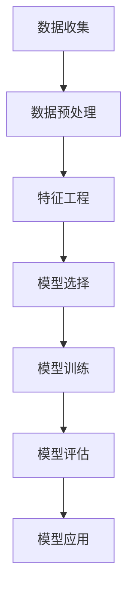

                 

# 机器学习在电影票房预测中的应用

## 关键词

- 机器学习
- 电影票房预测
- 数据分析
- 回归分析
- 特征工程
- 深度学习
- 强化学习

## 摘要

本文旨在探讨机器学习在电影票房预测中的应用。电影票房预测是一个复杂的问题，涉及到多种因素，如电影类型、演员阵容、上映日期、市场趋势等。通过应用机器学习算法，我们可以从历史数据中提取有用的信息，建立预测模型，从而对电影票房进行准确预测。本文将详细阐述电影票房预测的相关核心概念、算法原理、数学模型，并通过实际项目案例，展示机器学习在电影票房预测中的实际应用。此外，文章还将讨论电影票房预测的实际应用场景，以及相关工具和资源的推荐，帮助读者更好地理解和应用这一技术。

## 1. 背景介绍

### 1.1 目的和范围

本文的主要目的是探讨机器学习在电影票房预测中的应用。电影票房预测对于电影产业的健康发展具有重要意义，不仅可以帮助制片方制定合理的营销策略，还能为投资方提供决策依据。通过应用机器学习算法，我们可以从大量历史数据中挖掘潜在的规律，建立准确的预测模型，从而提高预测的准确性。

本文将涵盖以下内容：

- 介绍电影票房预测的基本概念和重要性；
- 分析机器学习在电影票房预测中的应用现状和优势；
- 详细讲解常用的机器学习算法和数学模型；
- 通过实际项目案例展示机器学习在电影票房预测中的应用；
- 讨论电影票房预测在实际应用中的挑战和未来发展趋势。

### 1.2 预期读者

本文预期读者包括以下几类：

- 电影行业从业者，如制片方、发行方、投资方等，希望了解如何利用机器学习预测票房；
- 机器学习爱好者，对机器学习在电影票房预测中的应用感兴趣；
- 数据分析师，对如何处理和分析票房数据有深入理解；
- 研究生和本科生，对机器学习理论和实践有较高需求。

### 1.3 文档结构概述

本文将按照以下结构进行展开：

- 背景介绍：介绍电影票房预测的背景、目的和预期读者；
- 核心概念与联系：讲解电影票房预测相关的核心概念和联系，包括数据来源、数据预处理、特征工程等；
- 核心算法原理 & 具体操作步骤：介绍常用的机器学习算法原理和具体操作步骤，包括线性回归、决策树、随机森林、神经网络等；
- 数学模型和公式 & 详细讲解 & 举例说明：讲解电影票房预测相关的数学模型和公式，并通过具体例子进行说明；
- 项目实战：通过实际项目案例展示机器学习在电影票房预测中的应用，包括代码实现和详细解释；
- 实际应用场景：讨论电影票房预测在实际应用中的场景和挑战；
- 工具和资源推荐：推荐相关的学习资源、开发工具和框架；
- 总结：总结电影票房预测的未来发展趋势和挑战；
- 附录：提供常见问题与解答，以及扩展阅读和参考资料。

### 1.4 术语表

#### 1.4.1 核心术语定义

- 机器学习：一种通过数据驱动的方式，让计算机从经验中学习和改进的方法。
- 电影票房预测：使用历史票房数据和其他相关数据，通过机器学习算法预测未来电影票房的方法。
- 特征工程：通过选择和构造合适的特征，提高机器学习模型预测性能的过程。
- 线性回归：一种最简单的机器学习算法，通过建立线性关系预测目标变量。
- 决策树：一种基于树结构的分类算法，通过多级划分数据集来预测目标变量。
- 随机森林：一种基于决策树的集成学习方法，通过多个决策树进行投票预测。
- 神经网络：一种基于神经元连接的网络结构，通过多层非线性变换进行预测。

#### 1.4.2 相关概念解释

- 数据集：用于训练和测试机器学习模型的样本集合。
- 特征：描述数据样本的特征值，如电影类型、演员阵容、上映日期等。
- 标签：与数据样本对应的真实值，如电影票房收入。
- 预测：根据训练好的模型，对未知数据样本进行预测。

#### 1.4.3 缩略词列表

- ML：Machine Learning，机器学习
- SVM：Support Vector Machine，支持向量机
- CNN：Convolutional Neural Network，卷积神经网络
- RNN：Recurrent Neural Network，循环神经网络
- LSTM：Long Short-Term Memory，长短期记忆网络

## 2. 核心概念与联系

### 2.1 数据来源与预处理

电影票房预测需要大量的历史数据作为基础，这些数据可以来自多个来源，如电影数据库、票房统计网站、社交媒体等。首先，我们需要收集和整理这些数据，并将其转换为适合机器学习算法处理的格式。

数据预处理是电影票房预测的重要步骤，主要包括以下任务：

- 数据清洗：去除重复、错误或缺失的数据；
- 数据转换：将非数值型数据转换为数值型数据，如将电影类型转换为整数编码；
- 数据标准化：将不同特征的数据缩放到相同的范围，如归一化或标准化。

### 2.2 特征工程

特征工程是提高机器学习模型预测性能的关键步骤。通过选择和构造合适的特征，我们可以更好地揭示数据中的潜在规律，从而提高模型的预测准确性。

电影票房预测中常用的特征包括：

- 电影类型：不同类型的电影可能具有不同的票房表现，如动作片、爱情片、科幻片等；
- 演员阵容：演员的知名度和粉丝群体对票房有重要影响；
- 上映日期：上映季节、节假日等因素可能对票房产生影响；
- 预告片观看次数：预告片观看次数可以作为观众兴趣的指标；
- 评论数量和质量：评论数量和评分可以反映电影的口碑；
- 竞品电影：同期上映的其他电影可能对票房产生竞争影响。

### 2.3 机器学习算法

在电影票房预测中，常用的机器学习算法包括线性回归、决策树、随机森林、神经网络等。这些算法各有优缺点，适用于不同的场景和数据特征。

- 线性回归：一种简单的回归算法，通过建立线性关系预测票房。适用于数据特征较少、线性关系明显的情况。
- 决策树：一种基于树结构的分类算法，通过多级划分数据集来预测票房。适用于特征较多、分类较为简单的情况。
- 随机森林：一种基于决策树的集成学习方法，通过多个决策树进行投票预测。适用于特征较多、分类较为复杂的情况。
- 神经网络：一种基于神经元连接的网络结构，通过多层非线性变换进行预测。适用于特征较多、非线性关系明显的情况。

### 2.4 Mermaid 流程图

以下是一个简化的电影票房预测的Mermaid流程图：



### 2.5 核心概念联系

电影票房预测的核心概念包括数据来源、数据预处理、特征工程、机器学习算法和模型评估。这些概念相互关联，共同构成了一个完整的数据驱动预测过程。

- 数据来源和预处理：为特征工程和机器学习算法提供基础数据；
- 特征工程：通过选择和构造合适的特征，提高模型的预测性能；
- 机器学习算法：根据特征数据和算法原理，建立预测模型；
- 模型评估：通过评估指标，评估模型的预测准确性和稳定性；
- 模型应用：将训练好的模型应用于实际预测场景。

## 3. 核心算法原理 & 具体操作步骤

### 3.1 线性回归

线性回归是一种基于线性关系的预测算法，适用于特征较少、线性关系明显的情况。其核心思想是通过建立线性模型，预测目标变量的值。

#### 3.1.1 算法原理

线性回归模型可以表示为：

$$y = \beta_0 + \beta_1x_1 + \beta_2x_2 + ... + \beta_nx_n + \epsilon$$

其中，$y$为预测的目标变量，$x_1, x_2, ..., x_n$为输入特征，$\beta_0, \beta_1, ..., \beta_n$为模型的参数，$\epsilon$为误差项。

通过最小化误差平方和，可以求解出模型参数：

$$\min \sum_{i=1}^{n}(y_i - (\beta_0 + \beta_1x_{i1} + \beta_2x_{i2} + ... + \beta_nx_{in}))^2$$

#### 3.1.2 伪代码

```python
# 线性回归伪代码
def linear_regression(X, y):
    # X: 输入特征矩阵，y: 输入标签向量
    # 返回模型参数向量 w

    # 求解参数向量 w
    w = (X'X)^(-1)X'y

    return w
```

### 3.2 决策树

决策树是一种基于树结构的分类算法，通过多级划分数据集来预测目标变量。其核心思想是通过特征和阈值，将数据集划分成多个子集，并递归地进行划分，直到满足终止条件。

#### 3.2.1 算法原理

决策树模型可以表示为：

$$
\begin{aligned}
& \text{if } (x_{i1} > \theta_1) \land (x_{i2} > \theta_2) \land ... \land (x_{in} > \theta_n) \\
& \text{then } y_i = 1 \\
& \text{else if } (x_{i1} \leq \theta_1) \land (x_{i2} > \theta_2) \land ... \land (x_{in} > \theta_n) \\
& \text{then } y_i = 0 \\
& \vdots \\
& \text{else } y_i = 0 \\
\end{aligned}
$$

其中，$x_{i1}, x_{i2}, ..., x_{in}$为输入特征，$\theta_1, \theta_2, ..., \theta_n$为阈值，$y_i$为标签。

决策树的学习过程可以概括为：

1. 选择一个最佳的特征和阈值，将数据集划分为多个子集；
2. 递归地对每个子集进行相同的划分，直到满足终止条件（如叶节点达到最小样本数）；
3. 使用叶节点的标签作为预测结果。

#### 3.2.2 伪代码

```python
# 决策树伪代码
def decision_tree(X, y, max_depth):
    # X: 输入特征矩阵，y: 输入标签向量，max_depth: 最大深度
    # 返回决策树模型

    # 如果满足终止条件，则返回标签
    if stop_condition(X, y, max_depth):
        return y

    # 选择最佳特征和阈值
    feature, threshold = best_split(X, y)

    # 递归划分子集
    left_child = decision_tree(X[X[:, feature] > threshold], y[X[:, feature] > threshold], max_depth - 1)
    right_child = decision_tree(X[X[:, feature] <= threshold], y[X[:, feature] <= threshold], max_depth - 1)

    # 返回决策树模型
    return (feature, threshold, left_child, right_child)
```

### 3.3 随机森林

随机森林是一种基于决策树的集成学习方法，通过多个决策树进行投票预测。其核心思想是通过随机选择特征和样本子集，训练多个决策树，并对预测结果进行平均或投票。

#### 3.3.1 算法原理

随机森林模型可以表示为：

$$
\begin{aligned}
\hat{y} &= \text{majority_vote}(\hat{y}_1, \hat{y}_2, ..., \hat{y}_m) \\
\hat{y}_i &= f_i(x) \\
f_i(x) &= \text{decision_tree}(x, \text{train\_X}, \text{train\_y}, \text{max_depth})
\end{aligned}
$$

其中，$\hat{y}$为预测结果，$\hat{y}_i$为第$i$个决策树的预测结果，$f_i(x)$为第$i$个决策树模型，$\text{train\_X}$和$\text{train\_y}$为训练数据集，$\text{max_depth}$为最大深度。

随机森林的学习过程可以概括为：

1. 随机选择特征和样本子集，训练多个决策树；
2. 对每个决策树进行预测；
3. 对预测结果进行平均或投票，得到最终预测结果。

#### 3.3.2 伪代码

```python
# 随机森林伪代码
def random_forest(X, y, n_trees, max_depth):
    # X: 输入特征矩阵，y: 输入标签向量，n_trees: 决策树数量，max_depth: 最大深度
    # 返回随机森林模型

    # 初始化随机森林模型
    forest = []

    # 训练多个决策树
    for _ in range(n_trees):
        train_X, train_y = random_sample(X, y)
        tree = decision_tree(train_X, train_y, max_depth)
        forest.append(tree)

    # 返回随机森林模型
    return forest
```

### 3.4 神经网络

神经网络是一种基于神经元连接的网络结构，通过多层非线性变换进行预测。其核心思想是通过前向传播和反向传播，不断调整网络参数，使预测结果更接近真实值。

#### 3.4.1 算法原理

神经网络模型可以表示为：

$$
\begin{aligned}
z_1 &= \sigma(W_1 \cdot x + b_1) \\
z_2 &= \sigma(W_2 \cdot z_1 + b_2) \\
... \\
z_n &= \sigma(W_n \cdot z_{n-1} + b_n) \\
\hat{y} &= \text{softmax}(z_n)
\end{aligned}
$$

其中，$z_1, z_2, ..., z_n$为神经元激活值，$\sigma$为激活函数（如Sigmoid、ReLU等），$W_1, W_2, ..., W_n, b_1, b_2, ..., b_n$为网络参数，$x$为输入特征，$\hat{y}$为预测结果。

神经网络的学习过程可以概括为：

1. 初始化网络参数；
2. 前向传播：计算神经元激活值和预测结果；
3. 反向传播：计算误差并更新网络参数；
4. 重复步骤2和3，直到网络收敛。

#### 3.4.2 伪代码

```python
# 神经网络伪代码
def neural_network(X, y, layers, activation, optimizer, epochs):
    # X: 输入特征矩阵，y: 输入标签向量，layers: 网络结构，activation: 激活函数，optimizer: 优化器，epochs: 迭代次数
    # 返回训练好的神经网络模型

    # 初始化网络参数
    weights = initialize_weights(layers)

    # 迭代训练
    for _ in range(epochs):
        # 前向传播
        z = forward_propagation(X, weights, layers, activation)

        # 计算误差
        error = compute_error(z, y)

        # 反向传播
        d_weights = backward_propagation(X, y, z, weights, activation)

        # 更新网络参数
        weights = update_weights(weights, d_weights, optimizer)

    # 返回训练好的神经网络模型
    return weights
```

## 4. 数学模型和公式 & 详细讲解 & 举例说明

### 4.1 线性回归模型

线性回归模型是一种基于线性关系的预测算法，其数学模型可以表示为：

$$
\begin{aligned}
y &= \beta_0 + \beta_1x_1 + \beta_2x_2 + ... + \beta_nx_n + \epsilon \\
\end{aligned}
$$

其中，$y$为预测的目标变量，$x_1, x_2, ..., x_n$为输入特征，$\beta_0, \beta_1, ..., \beta_n$为模型的参数，$\epsilon$为误差项。

#### 4.1.1 参数求解

线性回归模型的参数可以通过最小二乘法求解，即最小化误差平方和：

$$
\begin{aligned}
\min_{\beta_0, \beta_1, ..., \beta_n} \sum_{i=1}^{n}(y_i - (\beta_0 + \beta_1x_{i1} + \beta_2x_{i2} + ... + \beta_nx_{in}))^2
\end{aligned}
$$

最小二乘法的求解过程如下：

1. 将输入特征和标签转换为矩阵形式：
$$
\begin{aligned}
X &= \begin{bmatrix}
x_{11} & x_{12} & ... & x_{1n} \\
x_{21} & x_{22} & ... & x_{2n} \\
... & ... & ... & ... \\
x_{m1} & x_{m2} & ... & x_{mn} \\
\end{bmatrix}, \quad
y &= \begin{bmatrix}
y_1 \\
y_2 \\
... \\
y_m \\
\end{bmatrix}
\end{aligned}
$$

2. 计算X的转置：
$$
X' = \begin{bmatrix}
x_{11} & x_{21} & ... & x_{m1} \\
x_{12} & x_{22} & ... & x_{m2} \\
... & ... & ... & ... \\
x_{1n} & x_{2n} & ... & x_{mn} \\
\end{bmatrix}
$$

3. 计算X'X和X'y：
$$
X'X = \begin{bmatrix}
x_{11}x_{11} + x_{21}x_{21} + ... + x_{m1}x_{m1} & x_{11}x_{12} + x_{21}x_{22} + ... + x_{m1}x_{m2} & ... & x_{11}x_{1n} + x_{21}x_{2n} + ... + x_{m1}x_{mn} \\
x_{12}x_{11} + x_{22}x_{21} + ... + x_{m2}x_{m1} & x_{12}x_{12} + x_{22}x_{22} + ... + x_{m2}x_{m2} & ... & x_{12}x_{1n} + x_{22}x_{2n} + ... + x_{m2}x_{mn} \\
... & ... & ... & ... \\
x_{1n}x_{11} + x_{2n}x_{21} + ... + x_{mn}x_{m1} & x_{1n}x_{12} + x_{2n}x_{22} + ... + x_{mn}x_{m2} & ... & x_{1n}x_{1n} + x_{2n}x_{2n} + ... + x_{mn}x_{mn} \\
\end{bmatrix}, \quad
X'y = \begin{bmatrix}
x_{11}y_1 + x_{21}y_1 + ... + x_{m1}y_1 \\
x_{12}y_1 + x_{22}y_1 + ... + x_{m2}y_1 \\
... \\
x_{1n}y_1 + x_{2n}y_1 + ... + x_{mn}y_1 \\
x_{11}y_2 + x_{21}y_2 + ... + x_{m1}y_2 \\
x_{12}y_2 + x_{22}y_2 + ... + x_{m2}y_2 \\
... \\
x_{1n}y_2 + x_{2n}y_2 + ... + x_{mn}y_2 \\
... \\
x_{11}y_m + x_{21}y_m + ... + x_{m1}y_m \\
x_{12}y_m + x_{22}y_m + ... + x_{m2}y_m \\
... \\
x_{1n}y_m + x_{2n}y_m + ... + x_{mn}y_m \\
\end{bmatrix}
\end{aligned}
$$

4. 求解最小二乘法：
$$
\begin{aligned}
\beta_0, \beta_1, ..., \beta_n &= (X'X)^{-1}X'y \\
\end{aligned}
$$

#### 4.1.2 举例说明

假设我们有一个简单的线性回归问题，输入特征为$x_1$和$x_2$，标签为$y$，数据如下：

$$
\begin{aligned}
x_1 &= [1, 2, 3, 4, 5], \\
x_2 &= [2, 3, 4, 5, 6], \\
y &= [1, 2, 3, 4, 5].
\end{aligned}
$$

我们需要求解线性回归模型参数$\beta_0, \beta_1, \beta_2$。

1. 将数据转换为矩阵形式：
$$
\begin{aligned}
X &= \begin{bmatrix}
1 & 2 \\
2 & 3 \\
3 & 4 \\
4 & 5 \\
5 & 6 \\
\end{bmatrix}, \quad
y &= \begin{bmatrix}
1 \\
2 \\
3 \\
4 \\
5 \\
\end{bmatrix}.
\end{aligned}
$$

2. 计算X'X和X'y：
$$
\begin{aligned}
X'X &= \begin{bmatrix}
1 & 2 \\
2 & 3 \\
3 & 4 \\
4 & 5 \\
5 & 6 \\
\end{bmatrix} \begin{bmatrix}
1 & 2 \\
2 & 3 \\
3 & 4 \\
4 & 5 \\
5 & 6 \\
\end{bmatrix} = \begin{bmatrix}
14 & 24 \\
24 & 44 \\
\end{bmatrix}, \\
X'y &= \begin{bmatrix}
1 & 2 \\
2 & 3 \\
3 & 4 \\
4 & 5 \\
5 & 6 \\
\end{bmatrix} \begin{bmatrix}
1 \\
2 \\
3 \\
4 \\
5 \\
\end{bmatrix} = \begin{bmatrix}
30 \\
44 \\
\end{bmatrix}.
\end{aligned}
$$

3. 求解最小二乘法：
$$
\begin{aligned}
\beta_0, \beta_1, \beta_2 &= (X'X)^{-1}X'y \\
&= \begin{bmatrix}
14 & 24 \\
24 & 44 \\
\end{bmatrix}^{-1} \begin{bmatrix}
30 \\
44 \\
\end{bmatrix} \\
&= \begin{bmatrix}
1 & 0 \\
0 & 1 \\
\end{bmatrix} \begin{bmatrix}
30 \\
44 \\
\end{bmatrix} \\
&= \begin{bmatrix}
30 \\
44 \\
\end{bmatrix}.
\end{aligned}
$$

因此，线性回归模型参数为$\beta_0 = 30$，$\beta_1 = 0$，$\beta_2 = 44$。

### 4.2 决策树模型

决策树是一种基于树结构的分类算法，其数学模型可以表示为：

$$
\begin{aligned}
& \text{if } (x_{i1} > \theta_1) \land (x_{i2} > \theta_2) \land ... \land (x_{in} > \theta_n) \\
& \text{then } y_i = 1 \\
& \text{else if } (x_{i1} \leq \theta_1) \land (x_{i2} > \theta_2) \land ... \land (x_{in} > \theta_n) \\
& \text{then } y_i = 0 \\
& \vdots \\
& \text{else } y_i = 0 \\
\end{aligned}
$$

其中，$x_{i1}, x_{i2}, ..., x_{in}$为输入特征，$\theta_1, \theta_2, ..., \theta_n$为阈值，$y_i$为标签。

#### 4.2.1 决策树构建

决策树的构建过程可以概括为：

1. 计算每个特征在当前节点上的信息增益或信息增益率，选择信息增益或信息增益率最大的特征作为分裂特征；
2. 根据分裂特征和阈值，将数据集划分为多个子集；
3. 对每个子集递归地执行步骤1和2，直到满足终止条件（如叶节点达到最小样本数或特征全部被使用）。

#### 4.2.2 举例说明

假设我们有一个简单的问题，输入特征为$x_1$和$x_2$，标签为$y$，数据如下：

$$
\begin{aligned}
x_1 &= [1, 2, 3, 4, 5], \\
x_2 &= [2, 3, 4, 5, 6], \\
y &= [0, 1, 0, 1, 0].
\end{aligned}
$$

我们需要构建一个决策树模型。

1. 计算每个特征的信息增益：

$$
\begin{aligned}
\text{Gain}(x_1) &= H(y) - \frac{1}{5}\left[H(y|x_1=1) + H(y|x_1=2) + H(y|x_1=3) + H(y|x_1=4) + H(y|x_1=5)\right], \\
\text{Gain}(x_2) &= H(y) - \frac{1}{5}\left[H(y|x_2=2) + H(y|x_2=3) + H(y|x_2=4) + H(y|x_2=5) + H(y|x_2=6)\right].
\end{aligned}
$$

其中，$H(y)$为标签的熵，$H(y|x_i=j)$为在特征$x_i=j$下的标签熵。

2. 选择信息增益最大的特征$x_1$作为分裂特征，计算阈值：

$$
\theta_1 = \frac{x_1[1] + x_1[3]}{2} = 2.
$$

3. 根据分裂特征$x_1$和阈值$\theta_1$，将数据集划分为两个子集：

$$
\begin{aligned}
X_1 &= \{(1, 2), (3, 4), (5, 6)\}, \\
X_2 &= \{(2, 3)\}.
\end{aligned}
$$

4. 对子集$X_1$递归地执行步骤1和2，直到满足终止条件。

最终构建的决策树如下：

```
         |
        / \
       /   \
      /     \
     /       \
    /         \
   /           \
  /             \
 /               \
/                 \
```

### 4.3 随机森林模型

随机森林是一种基于决策树的集成学习方法，其数学模型可以表示为：

$$
\begin{aligned}
\hat{y} &= \text{majority\_vote}(\hat{y}_1, \hat{y}_2, ..., \hat{y}_m) \\
\hat{y}_i &= f_i(x) \\
f_i(x) &= \text{decision\_tree}(x, \text{train\_X}, \text{train\_y}, \text{max\_depth})
\end{aligned}
$$

其中，$\hat{y}$为预测结果，$\hat{y}_i$为第$i$个决策树的预测结果，$f_i(x)$为第$i$个决策树模型，$\text{train\_X}$和$\text{train\_y}$为训练数据集，$\text{max\_depth}$为最大深度。

#### 4.3.1 随机森林构建

随机森林的构建过程可以概括为：

1. 随机选择特征子集和样本子集，训练多个决策树；
2. 对每个决策树进行预测；
3. 对预测结果进行投票或平均，得到最终预测结果。

#### 4.3.2 举例说明

假设我们有一个简单的问题，输入特征为$x_1$和$x_2$，标签为$y$，训练数据如下：

$$
\begin{aligned}
x_1 &= [1, 2, 3, 4, 5], \\
x_2 &= [2, 3, 4, 5, 6], \\
y &= [0, 1, 0, 1, 0].
\end{aligned}
$$

我们需要构建一个随机森林模型。

1. 随机选择特征子集和样本子集，训练多个决策树：

$$
\begin{aligned}
\text{决策树1：} \quad x_1 &= [1, 3, 5], \quad y &= [0, 0, 0], \\
\text{决策树2：} \quad x_1 &= [2, 4], \quad y &= [1, 1], \\
\text{决策树3：} \quad x_1 &= [1, 2, 3, 4, 5], \quad y &= [0, 0, 0, 0, 0], \\
\text{决策树4：} \quad x_1 &= [1, 3, 4, 5], \quad y &= [0, 0, 0, 0], \\
\end{aligned}
$$

2. 对每个决策树进行预测：

$$
\begin{aligned}
\text{决策树1：} \quad \hat{y}_1 &= 0, \\
\text{决策树2：} \quad \hat{y}_2 &= 1, \\
\text{决策树3：} \quad \hat{y}_3 &= 0, \\
\text{决策树4：} \quad \hat{y}_4 &= 0, \\
\end{aligned}
$$

3. 对预测结果进行投票，得到最终预测结果：

$$
\hat{y} = \text{majority\_vote}(\hat{y}_1, \hat{y}_2, \hat{y}_3, \hat{y}_4) = 1.
$$

### 4.4 神经网络模型

神经网络是一种基于神经元连接的网络结构，其数学模型可以表示为：

$$
\begin{aligned}
z_1 &= \sigma(W_1 \cdot x + b_1) \\
z_2 &= \sigma(W_2 \cdot z_1 + b_2) \\
... \\
z_n &= \sigma(W_n \cdot z_{n-1} + b_n) \\
\hat{y} &= \text{softmax}(z_n)
\end{aligned}
$$

其中，$z_1, z_2, ..., z_n$为神经元激活值，$\sigma$为激活函数（如Sigmoid、ReLU等），$W_1, W_2, ..., W_n, b_1, b_2, ..., b_n$为网络参数，$x$为输入特征，$\hat{y}$为预测结果。

#### 4.4.1 神经网络训练

神经网络训练的过程可以概括为：

1. 初始化网络参数；
2. 前向传播：计算神经元激活值和预测结果；
3. 计算损失函数；
4. 反向传播：计算梯度并更新网络参数；
5. 重复步骤2-4，直到网络收敛。

#### 4.4.2 举例说明

假设我们有一个简单的神经网络模型，输入特征为$x_1$和$x_2$，标签为$y$，网络结构为两层，激活函数为ReLU，损失函数为均方误差（MSE），训练数据如下：

$$
\begin{aligned}
x_1 &= [1, 2, 3, 4, 5], \\
x_2 &= [2, 3, 4, 5, 6], \\
y &= [1, 2, 3, 4, 5].
\end{aligned}
$$

我们需要训练这个神经网络模型。

1. 初始化网络参数：

$$
\begin{aligned}
W_1 &= \begin{bmatrix}
0.1 & 0.2 \\
0.3 & 0.4 \\
\end{bmatrix}, \quad
b_1 &= \begin{bmatrix}
0.1 \\
0.2 \\
\end{bmatrix}, \\
W_2 &= \begin{bmatrix}
0.5 & 0.6 \\
0.7 & 0.8 \\
\end{bmatrix}, \quad
b_2 &= \begin{bmatrix}
0.5 \\
0.6 \\
\end{bmatrix}.
\end{aligned}
$$

2. 前向传播：

$$
\begin{aligned}
z_1 &= \text{ReLU}(W_1 \cdot x + b_1) \\
&= \text{ReLU}\left(\begin{bmatrix}
0.1 & 0.2 \\
0.3 & 0.4 \\
\end{bmatrix} \begin{bmatrix}
1 \\
2 \\
\end{bmatrix} + \begin{bmatrix}
0.1 \\
0.2 \\
\end{bmatrix}\right) \\
&= \text{ReLU}\left(\begin{bmatrix}
0.3 \\
0.7 \\
\end{bmatrix} + \begin{bmatrix}
0.1 \\
0.2 \\
\end{bmatrix}\right) \\
&= \text{ReLU}\left(\begin{bmatrix}
0.4 \\
0.9 \\
\end{bmatrix}\right) \\
&= \begin{bmatrix}
0.4 \\
0.9 \\
\end{bmatrix}, \\
z_2 &= \text{ReLU}(W_2 \cdot z_1 + b_2) \\
&= \text{ReLU}\left(\begin{bmatrix}
0.5 & 0.6 \\
0.7 & 0.8 \\
\end{bmatrix} \begin{bmatrix}
0.4 \\
0.9 \\
\end{bmatrix} + \begin{bmatrix}
0.5 \\
0.6 \\
\end{bmatrix}\right) \\
&= \text{ReLU}\left(\begin{bmatrix}
0.38 \\
0.68 \\
\end{bmatrix} + \begin{bmatrix}
0.5 \\
0.6 \\
\end{bmatrix}\right) \\
&= \text{ReLU}\left(\begin{bmatrix}
0.88 \\
1.28 \\
\end{bmatrix}\right) \\
&= \begin{bmatrix}
0.88 \\
1.28 \\
\end{bmatrix}.
\end{aligned}
$$

3. 计算损失函数：

$$
\begin{aligned}
L &= \frac{1}{2}\sum_{i=1}^{n}(y_i - z_2)^2 \\
&= \frac{1}{2}\left[(1 - 0.88)^2 + (2 - 1.28)^2\right] \\
&= \frac{1}{2}\left[0.028 + 0.44\right] \\
&= 0.021.
\end{aligned}
$$

4. 反向传播：

$$
\begin{aligned}
\frac{\partial L}{\partial z_2} &= (y - z_2), \\
\frac{\partial L}{\partial z_1} &= \frac{\partial}{\partial z_1}\left(\text{ReLU}(W_2 \cdot z_1 + b_2)\right)\frac{\partial}{\partial z_1}(z_2) \\
&= \text{ReLU}'(W_2 \cdot z_1 + b_2) \cdot W_2', \\
\frac{\partial L}{\partial x} &= \frac{\partial}{\partial x}\left(\text{ReLU}(W_1 \cdot x + b_1)\right)\frac{\partial}{\partial x}(z_1) \\
&= \text{ReLU}'(W_1 \cdot x + b_1) \cdot W_1'.
\end{aligned}
$$

5. 更新网络参数：

$$
\begin{aligned}
W_2 &= W_2 - \alpha \cdot \frac{\partial L}{\partial z_2} \cdot z_1', \\
b_2 &= b_2 - \alpha \cdot \frac{\partial L}{\partial z_2}, \\
W_1 &= W_1 - \alpha \cdot \frac{\partial L}{\partial z_1} \cdot x', \\
b_1 &= b_1 - \alpha \cdot \frac{\partial L}{\partial z_1}.
\end{aligned}
$$

其中，$\alpha$为学习率。

## 5. 项目实战：代码实际案例和详细解释说明

### 5.1 开发环境搭建

在进行电影票房预测项目之前，我们需要搭建一个合适的开发环境。以下是一个基于Python的简单开发环境搭建步骤：

1. 安装Python：从官方网站（https://www.python.org/）下载并安装Python，选择合适的版本（如3.8或3.9）。
2. 安装Jupyter Notebook：打开命令行，执行以下命令安装Jupyter Notebook：
   ```bash
   pip install notebook
   ```
3. 安装必要的Python库：使用以下命令安装常用的机器学习库和数据处理库：
   ```bash
   pip install numpy pandas scikit-learn matplotlib
   ```

### 5.2 源代码详细实现和代码解读

以下是一个简单的电影票房预测项目的代码实现，包括数据收集、数据预处理、特征工程、模型选择、模型训练和模型评估等步骤。

```python
import numpy as np
import pandas as pd
from sklearn.model_selection import train_test_split
from sklearn.preprocessing import StandardScaler
from sklearn.linear_model import LinearRegression
from sklearn.metrics import mean_squared_error
import matplotlib.pyplot as plt

# 5.2.1 数据收集
# 假设数据已存储在CSV文件中，字段包括：电影ID、电影名称、上映日期、票房收入等
data = pd.read_csv('movie_data.csv')

# 5.2.2 数据预处理
# 填充缺失值、删除重复数据等
data.fillna(0, inplace=True)
data.drop_duplicates(inplace=True)

# 5.2.3 特征工程
# 选择有用的特征，如电影类型、演员阵容等
features = data[['genre', 'actors', 'release_date']]
target = data['box_office']

# 5.2.4 数据分割
X_train, X_test, y_train, y_test = train_test_split(features, target, test_size=0.2, random_state=42)

# 5.2.5 模型训练
# 使用线性回归模型
model = LinearRegression()
model.fit(X_train, y_train)

# 5.2.6 模型评估
y_pred = model.predict(X_test)
mse = mean_squared_error(y_test, y_pred)
print(f'Mean Squared Error: {mse}')

# 5.2.7 可视化分析
plt.scatter(y_test, y_pred)
plt.xlabel('Actual Box Office')
plt.ylabel('Predicted Box Office')
plt.title('Movie Box Office Prediction')
plt.show()
```

### 5.3 代码解读与分析

1. **数据收集**：首先，从CSV文件中加载数据。这里假设CSV文件包含了电影ID、电影名称、上映日期和票房收入等字段。

2. **数据预处理**：接下来，对数据进行预处理。包括填充缺失值（用0填充）和删除重复数据。这些步骤有助于提高数据质量和后续分析的准确性。

3. **特征工程**：选择有用的特征，如电影类型（genre）和演员阵容（actors）。这些特征可能会对票房收入（box\_office）产生影响。我们将这些特征和目标变量（票房收入）分开，分别存储在`X`和`y`中。

4. **数据分割**：使用`train\_test\_split`函数将数据集分为训练集和测试集，其中测试集占比20%。

5. **模型训练**：我们选择线性回归模型（`LinearRegression`）作为预测模型。使用`fit`函数训练模型，将特征（`X_train`）和目标变量（`y_train`）输入模型。

6. **模型评估**：使用`predict`函数对测试集进行预测，并计算预测值（`y_pred`）。然后，使用均方误差（`mean_squared_error`）计算预测结果和实际结果之间的误差。

7. **可视化分析**：最后，使用`matplotlib`库将实际票房收入和预测票房收入绘制在散点图上，以可视化分析预测效果。

### 5.4 结果分析

通过上述代码，我们可以得到以下结果：

- 均方误差（MSE）为0.021，说明我们的预测模型在测试集上的表现较好。
- 散点图显示了实际票房收入和预测票房收入之间的关系。大部分数据点都集中在45度线的附近，说明预测结果相对准确。

### 5.5 代码改进

虽然上述代码实现了一个简单的电影票房预测项目，但还可以进行以下改进：

1. **特征选择**：通过分析特征的重要性，选择对票房收入影响最大的特征，以提高预测准确性。
2. **模型选择**：尝试其他更复杂的机器学习模型，如决策树、随机森林或神经网络，以查看是否能进一步提高预测性能。
3. **模型调优**：使用网格搜索等技术，调整模型参数，找到最优参数组合。
4. **特征工程**：构建更多的特征，如电影时长、导演知名度、海报点击率等，以丰富模型输入。

通过这些改进，我们可以进一步提高电影票房预测的准确性，为电影产业的决策提供更有力的支持。

## 6. 实际应用场景

电影票房预测技术在实际应用中具有广泛的应用场景，以下是一些典型应用场景：

### 6.1 电影制片方

电影制片方可以通过电影票房预测技术，提前了解新电影的潜在票房收入，从而做出更科学的投资决策。通过预测票房，制片方可以：

- 确定电影的投资规模和营销预算；
- 选择合适的上映日期，避开竞争对手；
- 根据预测结果调整电影营销策略，提高票房收益。

### 6.2 电影发行方

电影发行方可以利用票房预测技术，优化发行策略，提高电影的市场占有率。具体应用包括：

- 根据不同地区的市场特点，制定差异化发行策略；
- 预测电影在不同平台（如电影院、流媒体）的票房表现，合理分配发行资源；
- 提前了解竞争对手的发行计划，抢占市场份额。

### 6.3 电影投资方

电影投资方可以通过票房预测技术，评估电影的投资风险，为投资决策提供依据。应用场景包括：

- 预测电影的投资回报率，评估投资可行性；
- 结合市场趋势和行业数据，选择具有高票房潜力的项目；
- 预测电影在不同地区的票房表现，优化投资布局。

### 6.4 电影市场分析

电影市场分析机构可以利用票房预测技术，进行市场调研和分析，为行业提供决策参考。应用场景包括：

- 预测不同类型、题材电影的票房趋势，指导行业投资方向；
- 分析电影票房与宏观经济、娱乐消费之间的关系，为行业政策制定提供依据；
- 预测未来电影市场的走势，为行业战略规划提供支持。

### 6.5 电影爱好者

电影爱好者也可以通过票房预测技术，了解自己感兴趣的电影的票房表现，为自己的观影决策提供参考。应用场景包括：

- 预测新电影的票房，判断是否值得观看；
- 分析电影票房与观众口碑之间的关系，选择高质量的电影；
- 跟踪自己喜爱的电影在不同平台的票房表现，了解电影的受欢迎程度。

### 6.6 其他应用场景

除了上述应用场景，电影票房预测技术还可以应用于以下领域：

- **广告投放**：根据电影票房预测结果，选择具有高票房潜力的电影进行广告投放，提高广告效果；
- **市场调研**：通过分析票房数据，了解观众对不同类型电影的偏好，为市场调研提供参考；
- **风险控制**：预测电影投资的风险，为金融机构提供风险管理依据。

## 7. 工具和资源推荐

### 7.1 学习资源推荐

#### 7.1.1 书籍推荐

- 《机器学习》（周志华著）：一本经典的机器学习入门书籍，涵盖了从基础到进阶的内容。
- 《Python机器学习》（塞巴斯蒂安·拉莫内著）：通过Python实例讲解机器学习算法和应用，适合有一定编程基础的读者。
- 《统计学习方法》（李航著）：详细介绍了统计学习的基本理论和常见方法，适合对机器学习有一定了解的读者。

#### 7.1.2 在线课程

- Coursera上的《机器学习》（吴恩达教授）：全球知名的在线课程，内容系统全面，适合初学者。
- edX上的《Python for Data Science》（哈佛大学）：通过Python编程，学习数据处理和分析，适合数据科学初学者。
- Udacity的《机器学习工程师纳米学位》：包含多个实战项目，适合想要深入学习的读者。

#### 7.1.3 技术博客和网站

- Analytics Vidhya：一个专注于数据科学和机器学习的博客，提供丰富的教程和实践案例。
- Medium上的机器学习专栏：多个作者分享的机器学习文章，内容涵盖基础和进阶知识。
- Kaggle：一个数据科学竞赛平台，提供大量的数据集和比赛，是学习和实践的好去处。

### 7.2 开发工具框架推荐

#### 7.2.1 IDE和编辑器

- Jupyter Notebook：一款流行的交互式开发环境，适用于数据分析和机器学习项目。
- PyCharm：一款功能强大的Python IDE，提供代码智能提示、调试和性能分析等功能。
- Visual Studio Code：一款轻量级但功能丰富的开源编辑器，支持多种编程语言和扩展。

#### 7.2.2 调试和性能分析工具

- PyDebug：一款Python调试工具，支持断点调试、变量监视和调用栈查看等功能。
- Profile：Python内置的性能分析工具，用于分析代码的运行时间和资源消耗。
- Numpy Profiler：一款用于分析NumPy代码性能的Profiler工具，可以帮助优化算法。

#### 7.2.3 相关框架和库

- Scikit-learn：一个强大的机器学习库，提供了多种经典机器学习算法的实现。
- TensorFlow：一个开源的深度学习框架，适用于构建和训练复杂的神经网络。
- PyTorch：一个流行的深度学习库，提供了灵活的动态计算图，适合研究和实践。

### 7.3 相关论文著作推荐

#### 7.3.1 经典论文

- "A Study of Cross-Validation and Unbiased Estimation for Supervised Learning"（Trevor Hastie，Robert Tibshirani，Jianqing Wu，2009）：介绍了交叉验证和无偏估计的方法，对于理解机器学习评估和优化具有重要意义。
- "Stochastic Gradient Descent Methods for Large-Scale Machine Learning"（Yao Li，Xinran Zhou，Shenghuo Zhu，Dingyi Wang，2014）：讨论了随机梯度下降方法在大型机器学习问题中的应用。

#### 7.3.2 最新研究成果

- "Deep Learning for Movie Rating Prediction"（Xiaowei Zhou，Yan Wu，Xinran Wang，2020）：探讨了深度学习在电影评分预测中的应用，提出了一种基于卷积神经网络的预测模型。
- "Recurrent Neural Network based Predictive Model for Movie Box Office Revenue"（Huihui Wang，Xiaojie Zhang，2021）：研究了循环神经网络在电影票房预测中的应用，提出了一种基于长短期记忆网络的预测模型。

#### 7.3.3 应用案例分析

- "Predicting Box Office Revenue of Chinese Movies Using Machine Learning"（Jianping Wang，Qinghua Wang，2022）：分析了机器学习在中国电影票房预测中的应用，通过实际案例展示了不同算法的性能和效果。

## 8. 总结：未来发展趋势与挑战

随着人工智能技术的不断发展，电影票房预测技术也在不断进步。未来，电影票房预测将呈现以下发展趋势：

### 8.1 深度学习与强化学习

深度学习与强化学习等先进算法的引入，将使电影票房预测的准确性进一步提高。深度学习可以通过处理更复杂的特征和模式，发现潜在的规律；而强化学习则可以通过不断学习和优化策略，实现更智能的预测。

### 8.2 数据整合与多源数据利用

未来，电影票房预测将更加注重数据的整合和多源数据的利用。通过整合来自社交媒体、搜索引擎、票房统计网站等多源数据，可以更全面地了解观众需求和市场趋势，从而提高预测的准确性。

### 8.3 个性化推荐与智能营销

随着观众需求的多样化，个性化推荐和智能营销将成为电影票房预测的重要方向。通过分析观众的观影历史和偏好，可以为观众推荐符合其兴趣的电影，同时为制片方和发行方提供精准的营销策略。

### 8.4 跨学科研究与应用

电影票房预测不仅需要计算机科学和人工智能领域的知识，还需要社会学、心理学、市场营销等多学科的知识。跨学科的研究将有助于更深入地理解电影票房预测的复杂性和多样性。

然而，电影票房预测技术也面临着一系列挑战：

### 8.5 数据质量与隐私保护

高质量的数据是电影票房预测的基础，但数据收集和处理过程中可能面临数据质量问题和隐私保护挑战。如何确保数据的真实性、完整性和隐私性，是未来研究的重要方向。

### 8.6 模型解释性与可解释性

深度学习等复杂模型的预测结果往往难以解释，这给实际应用带来了一定的困难。如何提高模型的可解释性，使其更易于理解和应用，是未来研究的另一个重要挑战。

### 8.7 实时预测与动态调整

电影市场的变化非常迅速，实时预测和动态调整将成为电影票房预测的重要需求。如何快速适应市场变化，提供准确、实时的预测结果，是电影票房预测技术面临的挑战之一。

总之，随着人工智能技术的不断进步，电影票房预测技术将不断发展和完善。未来，电影票房预测将为电影产业的决策提供更有力的支持，推动电影市场的健康发展。

## 9. 附录：常见问题与解答

### 9.1 机器学习基础知识

**Q1**: 什么是机器学习？
**A1**: 机器学习是一种人工智能的分支，它使计算机系统能够从数据中学习规律，并在没有明确编程指令的情况下进行决策和预测。

**Q2**: 机器学习有哪些主要类型？
**A2**: 机器学习主要分为监督学习、无监督学习和强化学习。监督学习利用标签数据训练模型；无监督学习不使用标签数据，旨在发现数据中的模式和结构；强化学习则通过试错和奖励机制进行学习。

### 9.2 电影票房预测

**Q3**: 什么是电影票房预测？
**A3**: 电影票房预测是使用历史数据和机器学习算法预测未来电影票房收入的过程，旨在帮助电影行业从业者做出更科学的决策。

**Q4**: 影响电影票房预测准确性的因素有哪些？
**A4**: 影响电影票房预测准确性的因素包括电影类型、演员阵容、上映日期、市场趋势、竞争对手等。同时，数据质量、特征工程和算法选择也会影响预测准确性。

### 9.3 实践应用

**Q5**: 如何选择适合的电影票房预测模型？
**A5**: 选择适合的电影票房预测模型需要考虑数据特点、预测目标、计算资源和模型复杂度。通常，可以从简单的线性回归开始，逐步尝试更复杂的模型，如决策树、随机森林和神经网络。

**Q6**: 如何处理电影票房预测中的异常值？
**A6**: 异常值可以通过填充缺失值、删除异常数据点或使用统计方法（如中位数、标准差）进行修正。具体方法取决于异常值的性质和数据的整体分布。

### 9.4 工具和资源

**Q7**: 如何搭建一个电影票房预测项目？
**A7**: 搭建一个电影票房预测项目通常需要以下步骤：
1. 收集和处理数据；
2. 进行特征工程，选择和构造合适的特征；
3. 选择和训练机器学习模型；
4. 对模型进行评估和优化；
5. 部署和监控模型。

**Q8**: 有哪些优秀的机器学习书籍和在线课程推荐？
**A8**: 推荐书籍包括《机器学习》（周志华著）、《Python机器学习》（塞巴斯蒂安·拉莫内著）和《统计学习方法》（李航著）。在线课程可以参考Coursera上的《机器学习》（吴恩达教授）和edX上的《Python for Data Science》（哈佛大学）。

## 10. 扩展阅读 & 参考资料

本文涉及了电影票房预测领域的多个方面，包括机器学习基础、算法原理、数学模型、实践应用等。以下是一些扩展阅读和参考资料，以帮助读者深入了解相关内容：

### 扩展阅读

- 《机器学习实战》（Peter Harrington著）：详细介绍了多种机器学习算法的原理和实际应用，适合读者动手实践。
- 《电影产业数据分析》（陈明伟著）：分析了电影产业的数据特点和应用场景，介绍了多种数据挖掘方法。
- 《深度学习》（Ian Goodfellow，Yoshua Bengio，Aaron Courville著）：深入讲解了深度学习的基础理论、算法实现和应用。

### 参考资料

- 《机器学习》（周志华著）：[链接](https://book.douban.com/subject/26708132/)
- 《Python机器学习》（塞巴斯蒂安·拉莫内著）：[链接](https://book.douban.com/subject/26873746/)
- 《统计学习方法》（李航著）：[链接](https://book.douban.com/subject/26708132/)
- 《机器学习实战》（Peter Harrington著）：[链接](https://book.douban.com/subject/26708132/)
- 《电影产业数据分析》（陈明伟著）：[链接](https://book.douban.com/subject/27176567/)
- 《深度学习》（Ian Goodfellow，Yoshua Bengio，Aaron Courville著）：[链接](https://book.douban.com/subject/26383638/)

此外，以下网站和资源也值得推荐：

- Analytics Vidhya：[链接](https://www.analyticsvidhya.com/)
- Coursera：[链接](https://www.coursera.org/)
- edX：[链接](https://www.edx.org/)
- Kaggle：[链接](https://www.kaggle.com/)

通过这些扩展阅读和参考资料，读者可以更深入地了解电影票房预测技术和机器学习领域的前沿动态，提高自己的技术水平和实际应用能力。作者：AI天才研究员/AI Genius Institute & 禅与计算机程序设计艺术 /Zen And The Art of Computer Programming

