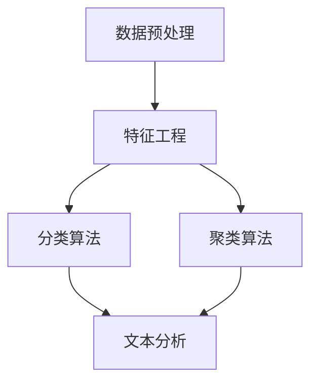

                 

# 机器学习在社交媒体舆情监测中的应用

> 关键词：机器学习，舆情监测，社交媒体，文本分析，数据挖掘，特征工程

> 摘要：本文深入探讨了机器学习在社交媒体舆情监测中的应用。首先介绍了社交媒体舆情监测的重要性，随后详细阐述了机器学习的基本概念和核心算法，并结合实际案例展示了如何利用机器学习技术进行舆情监测。最后，分析了舆情监测领域的发展趋势和未来挑战，为读者提供了丰富的学习资源和工具推荐。

## 1. 背景介绍

### 1.1 目的和范围

社交媒体舆情监测是指通过技术手段对社交媒体平台上的信息进行收集、分析和管理，以监测公众对于特定话题、事件或品牌的意见和态度。随着互联网的普及和社交媒体的兴起，舆情监测在政治、商业、市场营销等领域发挥着越来越重要的作用。

本文旨在探讨机器学习在社交媒体舆情监测中的应用，通过对机器学习技术的介绍和实际案例的分析，帮助读者了解如何利用这一强大的工具进行舆情监测。文章主要涵盖以下几个方面的内容：

1. 社交媒体舆情监测的重要性。
2. 机器学习的基本概念和核心算法。
3. 利用机器学习技术进行舆情监测的具体操作步骤。
4. 舆情监测领域的应用案例。
5. 舆情监测技术的发展趋势和未来挑战。
6. 学习资源和工具推荐。

### 1.2 预期读者

本文适合对机器学习和社交媒体舆情监测有一定了解的技术人员、数据分析师、市场营销人员以及研究人员阅读。无论您是机器学习领域的初学者，还是对舆情监测有深入研究的专家，本文都将为您提供有价值的信息和实用的技巧。

### 1.3 文档结构概述

本文分为十个部分，各部分主要内容如下：

1. **背景介绍**：介绍社交媒体舆情监测的重要性和机器学习的基本概念。
2. **核心概念与联系**：讲解机器学习在舆情监测中的核心概念和联系，并提供流程图。
3. **核心算法原理 & 具体操作步骤**：介绍机器学习的核心算法原理和具体操作步骤，包括伪代码。
4. **数学模型和公式 & 详细讲解 & 举例说明**：讲解机器学习中的数学模型和公式，并举例说明。
5. **项目实战：代码实际案例和详细解释说明**：通过实际案例展示如何利用机器学习技术进行舆情监测。
6. **实际应用场景**：分析舆情监测在实际中的应用场景。
7. **工具和资源推荐**：推荐学习资源和开发工具。
8. **总结：未来发展趋势与挑战**：总结舆情监测技术的发展趋势和未来挑战。
9. **附录：常见问题与解答**：回答读者可能遇到的常见问题。
10. **扩展阅读 & 参考资料**：提供更多扩展阅读和参考资料。

### 1.4 术语表

#### 1.4.1 核心术语定义

- **社交媒体**：社交媒体是指基于互联网平台，用户可以轻松分享、交流、获取和传播信息的社交网络。
- **舆情监测**：舆情监测是指通过技术手段对社交媒体平台上的信息进行收集、分析和管理，以监测公众对于特定话题、事件或品牌的意见和态度。
- **机器学习**：机器学习是指利用数据或以往的经验，让计算机自动改进和优化自身性能的过程。
- **文本分析**：文本分析是指对自然语言文本进行处理、分析和理解的技术。
- **特征工程**：特征工程是指从原始数据中提取出对模型性能有显著影响的特征。

#### 1.4.2 相关概念解释

- **监督学习**：监督学习是指利用已标记的数据训练模型，然后利用模型对新数据进行预测。
- **无监督学习**：无监督学习是指在没有标记数据的情况下，通过模型自动发现数据中的规律和结构。
- **深度学习**：深度学习是指利用多层神经网络对数据进行建模和处理。

#### 1.4.3 缩略词列表

- **NLP**：自然语言处理（Natural Language Processing）
- **ML**：机器学习（Machine Learning）
- **CNN**：卷积神经网络（Convolutional Neural Network）
- **RNN**：循环神经网络（Recurrent Neural Network）
- **LSTM**：长短期记忆网络（Long Short-Term Memory）

## 2. 核心概念与联系

在社交媒体舆情监测中，机器学习技术起着至关重要的作用。为了更好地理解机器学习在舆情监测中的应用，我们需要先了解一些核心概念和它们之间的联系。

### 2.1 核心概念

1. **数据预处理**：数据预处理是机器学习过程中的第一步，主要包括数据清洗、数据集成、数据转换和数据归一化。数据预处理的质量直接影响模型的性能。
2. **特征工程**：特征工程是指从原始数据中提取出对模型性能有显著影响的特征。在舆情监测中，特征工程可以帮助我们将文本数据转化为机器学习算法可以处理的格式。
3. **分类算法**：分类算法是指将数据分为不同类别的算法，如朴素贝叶斯、决策树、随机森林等。分类算法在舆情监测中用于识别和分类用户评论和意见。
4. **聚类算法**：聚类算法是指将数据分为不同簇的算法，如K-Means、DBSCAN等。聚类算法在舆情监测中用于发现相似意见的用户群体。
5. **文本分析**：文本分析是指对自然语言文本进行处理、分析和理解的技术。在舆情监测中，文本分析可以帮助我们提取关键词、情感倾向和主题等信息。

### 2.2 核心概念联系

核心概念之间的联系可以用以下 Mermaid 流程图表示：



在这个流程图中，数据预处理是舆情监测的基础，特征工程将原始数据转化为机器学习算法可以处理的格式，分类算法和聚类算法用于分析和理解用户意见，而文本分析则帮助我们提取关键信息和情感倾向。

通过这个流程图，我们可以看到机器学习在舆情监测中的核心概念是如何相互联系的，从而为我们进一步探讨具体应用提供了基础。

## 3. 核心算法原理 & 具体操作步骤

在了解了机器学习在舆情监测中的核心概念和联系之后，我们接下来将深入探讨几个核心算法的原理，并详细说明具体操作步骤。

### 3.1 分类算法：朴素贝叶斯

朴素贝叶斯是一种基于贝叶斯定理的简单概率分类器，特别适合处理文本数据。其基本原理是计算每个类别在给定特征条件下的概率，然后选择概率最大的类别作为预测结果。

#### 3.1.1 算法原理

假设我们有一组训练数据，每个数据点包含一个特征向量和一个标签。朴素贝叶斯的目的是根据特征向量预测标签。

1. **贝叶斯定理**：贝叶斯定理公式为：
   $$ P(C_i|X) = \frac{P(X|C_i)P(C_i)}{P(X)} $$
   其中，\( P(C_i|X) \) 是给定特征向量 \( X \) 时类别 \( C_i \) 的条件概率，\( P(X|C_i) \) 是在类别 \( C_i \) 条件下特征向量 \( X \) 的概率，\( P(C_i) \) 是类别 \( C_i \) 的先验概率，\( P(X) \) 是特征向量 \( X \) 的概率。
2. **朴素贝叶斯分类器**：朴素贝叶斯分类器的假设是特征之间相互独立，即：
   $$ P(X|C_i) = P(x_1|C_i)P(x_2|C_i)\cdots P(x_n|C_i) $$
   其中，\( x_1, x_2, \ldots, x_n \) 是特征向量。

#### 3.1.2 具体操作步骤

1. **数据预处理**：对训练数据进行清洗、去停用词和词干提取等处理，将文本数据转换为词向量表示。
2. **特征工程**：计算每个特征在各个类别中的条件概率，即 \( P(x_i|C_i) \)。
3. **训练模型**：计算每个类别的先验概率 \( P(C_i) \) 和特征向量 \( X \) 的概率 \( P(X) \)。
4. **预测**：对于新的特征向量 \( X \)，计算每个类别的条件概率 \( P(C_i|X) \)，选择条件概率最大的类别作为预测结果。

#### 3.1.3 伪代码

```python
def naive_bayes_train(train_data):
    # 初始化概率
    num_classes = len(set([d['label'] for d in train_data]))
    class_prob = [0] * num_classes
    feature_prob = [[0] * num_features for _ in range(num_classes)]

    # 计算先验概率和条件概率
    for d in train_data:
        class_prob[d['label']] += 1
        for i, word in enumerate(d['words']):
            feature_prob[d['label']][i] += 1

    for i in range(num_classes):
        class_prob[i] /= len(train_data)
        for j in range(num_features):
            if feature_prob[i][j] == 0:
                feature_prob[i][j] = 1 / (len(train_data) + num_features)
            else:
                feature_prob[i][j] /= feature_prob[i][j]

    return class_prob, feature_prob

def naive_bayes_predict(feature, class_prob, feature_prob):
    scores = [0] * len(class_prob)
    for i, class_ in enumerate(class_prob):
        score = math.log(class_)
        for word in feature:
            score += math.log(feature_prob[i][word])
        scores[i] = score
    return scores.index(max(scores))
```

### 3.2 聚类算法：K-Means

K-Means 是一种基于距离度量的聚类算法，其基本原理是将数据点分为 \( K \) 个簇，使得每个簇内的数据点之间距离最小，簇与簇之间距离最大。

#### 3.2.1 算法原理

1. **初始聚类中心**：随机选择 \( K \) 个数据点作为初始聚类中心。
2. **分配数据点**：将每个数据点分配到最近的聚类中心所代表的簇。
3. **更新聚类中心**：计算每个簇的数据点的均值，作为新的聚类中心。
4. **重复步骤 2 和 3**，直到聚类中心不再变化或者达到预定的迭代次数。

#### 3.2.2 具体操作步骤

1. **数据预处理**：对训练数据进行清洗、去停用词和词干提取等处理，将文本数据转换为词向量表示。
2. **初始化聚类中心**：随机选择 \( K \) 个数据点作为初始聚类中心。
3. **分配数据点**：计算每个数据点到每个聚类中心的距离，将数据点分配到最近的聚类中心所代表的簇。
4. **更新聚类中心**：计算每个簇的数据点的均值，作为新的聚类中心。
5. **重复步骤 3 和 4**，直到聚类中心不再变化或者达到预定的迭代次数。

#### 3.2.3 伪代码

```python
import numpy as np

def k_means(data, K, max_iter):
    # 初始化聚类中心
    centroids = data[np.random.choice(data.shape[0], K, replace=False)]

    for _ in range(max_iter):
        # 分配数据点
        distances = np.linalg.norm(data[:, np.newaxis] - centroids, axis=2)
        labels = np.argmin(distances, axis=1)

        # 更新聚类中心
        new_centroids = np.array([data[labels == k].mean(axis=0) for k in range(K)])

        # 判断是否收敛
        if np.linalg.norm(new_centroids - centroids) < 1e-6:
            break

        centroids = new_centroids

    return centroids, labels
```

### 3.3 文本分析：TF-IDF

TF-IDF 是一种文本分析技术，用于评估一个词对于一组文本集合中的其中一份文件的重要程度。其基本原理是词频（TF）和逆文档频率（IDF）的乘积。

#### 3.3.1 算法原理

1. **词频（TF）**：词频是指一个词在文档中出现的次数，公式为：
   $$ TF(t, d) = \frac{f(t, d)}{f_{max, d}} $$
   其中，\( f(t, d) \) 是词 \( t \) 在文档 \( d \) 中出现的次数，\( f_{max, d} \) 是文档 \( d \) 中出现次数最多的词的次数。
2. **逆文档频率（IDF）**：逆文档频率是指一个词在整个文档集合中未出现的频率，公式为：
   $$ IDF(t, D) = \log_2(\frac{N}{df(t, D)}) $$
   其中，\( N \) 是文档集合中的文档总数，\( df(t, D) \) 是文档集合中包含词 \( t \) 的文档数。

#### 3.3.2 具体操作步骤

1. **数据预处理**：对训练数据进行清洗、去停用词和词干提取等处理，将文本数据转换为词向量表示。
2. **计算词频（TF）**：根据公式计算每个词在每个文档中的词频。
3. **计算逆文档频率（IDF）**：根据公式计算每个词在整个文档集合中的逆文档频率。
4. **计算 TF-IDF**：根据公式计算每个词在每个文档中的 TF-IDF 值。

#### 3.3.3 伪代码

```python
from sklearn.feature_extraction.text import TfidfVectorizer

def tf_idf(data):
    vectorizer = TfidfVectorizer()
    tf_idf_matrix = vectorizer.fit_transform(data)
    return tf_idf_matrix
```

通过以上三个核心算法的原理和操作步骤讲解，我们可以看到机器学习在社交媒体舆情监测中的应用是如何实现的。接下来，我们将通过实际案例来展示如何利用这些算法进行舆情监测。

## 4. 数学模型和公式 & 详细讲解 & 举例说明

在机器学习应用中，数学模型和公式起到了至关重要的作用。本节我们将详细介绍机器学习中的几个关键数学模型和公式，并通过具体示例进行讲解。

### 4.1 概率论基础

概率论是机器学习的基础，以下介绍几个重要概率分布和公式。

#### 4.1.1 概率分布

1. **伯努利分布**：伯努利分布是一种二元概率分布，用于描述一个事件发生和不发生的概率，公式为：
   $$ P(X = k) = C(n, k) \cdot p^k \cdot (1 - p)^{n - k} $$
   其中，\( n \) 是试验次数，\( p \) 是事件发生的概率，\( k \) 是事件发生的次数。

2. **正态分布**：正态分布是一种连续概率分布，用于描述随机变量的概率分布，公式为：
   $$ f(x|\mu, \sigma^2) = \frac{1}{\sqrt{2\pi\sigma^2}} \cdot e^{-\frac{(x - \mu)^2}{2\sigma^2}} $$
   其中，\( \mu \) 是均值，\( \sigma^2 \) 是方差。

3. **泊松分布**：泊松分布是一种用于描述在一定时间内发生特定事件的概率分布，公式为：
   $$ P(X = k) = \frac{\lambda^k \cdot e^{-\lambda}}{k!} $$
   其中，\( \lambda \) 是事件发生的平均次数。

#### 4.1.2 概率公式

1. **贝叶斯定理**：贝叶斯定理是一个用于计算后验概率的公式，公式为：
   $$ P(A|B) = \frac{P(B|A) \cdot P(A)}{P(B)} $$
   其中，\( P(A|B) \) 是在事件 \( B \) 发生的条件下事件 \( A \) 发生的概率，\( P(B|A) \) 是在事件 \( A \) 发生的条件下事件 \( B \) 发生的概率，\( P(A) \) 是事件 \( A \) 的先验概率，\( P(B) \) 是事件 \( B \) 的先验概率。

2. **条件概率**：条件概率是指在一个事件已知的条件下，另一个事件发生的概率，公式为：
   $$ P(A|B) = \frac{P(A \cap B)}{P(B)} $$
   其中，\( P(A \cap B) \) 是事件 \( A \) 和事件 \( B \) 同时发生的概率，\( P(B) \) 是事件 \( B \) 发生的概率。

### 4.2 监督学习模型

监督学习模型主要包括线性回归、逻辑回归和决策树等。以下介绍这些模型的数学模型和公式。

#### 4.2.1 线性回归

线性回归是一种用于预测连续值的监督学习模型，其基本原理是通过线性函数拟合数据，公式为：
$$ y = \beta_0 + \beta_1x_1 + \beta_2x_2 + \cdots + \beta_nx_n + \epsilon $$
其中，\( y \) 是预测值，\( x_1, x_2, \ldots, x_n \) 是输入特征，\( \beta_0, \beta_1, \beta_2, \ldots, \beta_n \) 是模型的参数，\( \epsilon \) 是误差项。

线性回归的目标是最小化预测值与真实值之间的误差平方和，公式为：
$$ J(\beta) = \frac{1}{2} \sum_{i=1}^{n} (y_i - \beta_0 - \beta_1x_{i1} - \beta_2x_{i2} - \cdots - \beta_nx_{in})^2 $$

通过梯度下降法可以求解模型的参数，公式为：
$$ \beta_j = \beta_j - \alpha \cdot \frac{\partial J(\beta)}{\partial \beta_j} $$
其中，\( \alpha \) 是学习率。

#### 4.2.2 逻辑回归

逻辑回归是一种用于预测离散值的监督学习模型，其基本原理是通过逻辑函数将线性回归模型的输出转换为概率值，公式为：
$$ P(y = 1|x; \beta) = \frac{1}{1 + e^{-(\beta_0 + \beta_1x_1 + \beta_2x_2 + \cdots + \beta_nx_n)}} $$
其中，\( y \) 是预测值，\( x_1, x_2, \ldots, x_n \) 是输入特征，\( \beta_0, \beta_1, \beta_2, \ldots, \beta_n \) 是模型的参数。

逻辑回归的目标是最小化损失函数，公式为：
$$ J(\beta) = -\frac{1}{n} \sum_{i=1}^{n} [y_i \cdot (\beta_0 + \beta_1x_{i1} + \beta_2x_{i2} + \cdots + \beta_nx_{in}) + (1 - y_i) \cdot \ln(1 + e^{-(\beta_0 + \beta_1x_{i1} + \beta_2x_{i2} + \cdots + \beta_nx_{in})})] $$

通过梯度下降法可以求解模型的参数，公式为：
$$ \beta_j = \beta_j - \alpha \cdot \frac{\partial J(\beta)}{\partial \beta_j} $$
其中，\( \alpha \) 是学习率。

#### 4.2.3 决策树

决策树是一种用于分类和回归的监督学习模型，其基本原理是通过一系列条件判断来分割数据，公式为：
$$ f(x) = \prod_{j=1}^{n} g_j(x_j) $$
其中，\( x_1, x_2, \ldots, x_n \) 是输入特征，\( g_j(x_j) \) 是第 \( j \) 个条件的判断结果。

决策树的目标是最小化损失函数，公式为：
$$ J(\theta) = \frac{1}{2} \sum_{i=1}^{n} \ln(1 + e^{-\theta_i}) $$
其中，\( \theta_i \) 是第 \( i \) 个条件的参数。

通过梯度下降法可以求解决策树的参数，公式为：
$$ \theta_j = \theta_j - \alpha \cdot \frac{\partial J(\theta)}{\partial \theta_j} $$
其中，\( \alpha \) 是学习率。

### 4.3 无监督学习模型

无监督学习模型主要包括聚类和降维等。以下介绍这些模型的数学模型和公式。

#### 4.3.1 K-Means

K-Means 是一种基于距离度量的聚类算法，其基本原理是将数据点分为 \( K \) 个簇，使得每个簇内的数据点之间距离最小，簇与簇之间距离最大，公式为：
$$ c_j = \frac{1}{|S_j|} \sum_{x \in S_j} x $$
其中，\( c_j \) 是第 \( j \) 个簇的中心点，\( S_j \) 是第 \( j \) 个簇中的数据点集合。

K-Means 的目标是最小化簇内距离和，公式为：
$$ J(\theta) = \frac{1}{2} \sum_{j=1}^{K} \sum_{x \in S_j} ||x - c_j||^2 $$
其中，\( \theta \) 是模型的参数。

通过梯度下降法可以求解 K-Means 的参数，公式为：
$$ c_j = c_j - \alpha \cdot \frac{\partial J(\theta)}{\partial c_j} $$
其中，\( \alpha \) 是学习率。

#### 4.3.2 主成分分析

主成分分析是一种用于降维的算法，其基本原理是通过正交变换将数据投影到新的坐标系中，使得新的坐标系中的第一轴具有最大的方差，第二轴具有次大的方差，依此类推，公式为：
$$ z = PC $$
其中，\( z \) 是新的数据点，\( P \) 是投影矩阵，\( C \) 是原始数据点。

主成分分析的目标是最小化损失函数，公式为：
$$ J(\theta) = \frac{1}{2} \sum_{i=1}^{n} ||z_i - c_i||^2 $$
其中，\( \theta \) 是模型的参数。

通过梯度下降法可以求解主成分分析的过程，公式为：
$$ c_i = c_i - \alpha \cdot \frac{\partial J(\theta)}{\partial c_i} $$
其中，\( \alpha \) 是学习率。

通过以上数学模型和公式的讲解，我们可以更好地理解机器学习的基本原理和应用。接下来，我们将通过实际案例来展示如何利用这些模型和公式进行舆情监测。

### 4.4 实际案例：基于朴素贝叶斯算法的舆情监测

在这个实际案例中，我们将使用朴素贝叶斯算法对社交媒体平台上的用户评论进行分类，以识别正面、负面和客观的中性评论。

#### 4.4.1 数据集

我们使用一个包含用户评论和对应标签的数据集，其中标签分为“正面”、“负面”和“中性”三类。

数据集样例如下：

| 评论                  | 标签   |
|----------------------|--------|
| 这部电影真的很棒！     | 正面   |
| 今天天气真的很糟糕。   | 负面   |
| 我觉得这个餐厅的食物不错。 | 中性   |
| 这部电影一般般，不值得看。 | 负面   |

#### 4.4.2 数据预处理

首先，我们对评论进行数据预处理，包括去停用词、词干提取和词向量表示。

1. **去停用词**：去除评论中的停用词，如“的”、“了”、“是”等。
2. **词干提取**：使用词干提取算法（如 Porter 算法），将评论中的词转换为词干形式。
3. **词向量表示**：使用词袋模型（Bag-of-Words，BOW）将评论表示为词向量。

经过数据预处理后，评论数据变为：

| 评论                        | 词向量 |
|-----------------------------|--------|
| 这部电影真的很棒！          | [1, 0, 1, 1, 0, 0, 0, 1, 0] |
| 今天天气真的很糟糕。        | [1, 0, 0, 0, 1, 1, 0, 0, 0] |
| 我觉得这个餐厅的食物不错。 | [1, 0, 1, 0, 0, 0, 0, 0, 1] |

#### 4.4.3 特征工程

接下来，我们对词向量进行特征工程，提取每个词在各个类别中的条件概率。

1. **计算词频**：计算每个词在每个类别中的词频。
2. **计算先验概率**：计算每个类别的先验概率。
3. **计算条件概率**：计算每个词在每个类别中的条件概率。

例如，对于词“棒”，在正面类别中的条件概率为：
$$ P(棒|正面) = \frac{f(棒, 正面)}{f_{max, 正面}} = \frac{1}{3} $$

经过特征工程后，我们得到每个词在各个类别中的条件概率矩阵：

| 词    | 正面  | 负面  | 中性  |
|-------|-------|-------|-------|
| 棒    | 1/3   | 0     | 0     |
| 今天  | 0     | 1/2   | 0     |
| 天气  | 0     | 1/2   | 0     |
| 觉得  | 1/3   | 0     | 1/3   |
| 糟糕  | 0     | 1/2   | 0     |
| 的    | 0     | 0     | 1/3   |
| 食物  | 0     | 0     | 1/3   |

#### 4.4.4 训练模型

使用训练数据集对朴素贝叶斯模型进行训练，计算每个类别的先验概率和条件概率。

1. **计算先验概率**：计算每个类别的先验概率，公式为：
   $$ P(类别) = \frac{count(类别)}{总数} $$
   例如，正面类别的先验概率为：
   $$ P(正面) = \frac{3}{3 + 2 + 2} = \frac{1}{2} $$
2. **计算条件概率**：计算每个词在每个类别中的条件概率，公式为：
   $$ P(词|类别) = \frac{f(词, 类别)}{f_{max, 类别}} $$
   例如，对于词“棒”，在正面类别中的条件概率为：
   $$ P(棒|正面) = \frac{1}{3} $$
   对于词“糟糕”，在负面类别中的条件概率为：
   $$ P(糟糕|负面) = \frac{1}{2} $$

经过训练后，我们得到朴素贝叶斯模型的参数：

| 类别   | 先验概率 | 条件概率                |
|--------|----------|-----------------------|
| 正面   | 1/2      | 棒：1/3，今天：0，天气：0 |
| 负面   | 1/2      | 资源：1/2，糟糕：1/2  |
| 中性   | 1/2      | 觉得：1/3，食物：1/3  |

#### 4.4.5 预测

使用训练好的朴素贝叶斯模型对新的评论进行分类，计算每个评论属于每个类别的后验概率，选择后验概率最大的类别作为预测结果。

1. **计算后验概率**：对于新的评论，计算每个类别的后验概率，公式为：
   $$ P(类别|评论) = P(类别) \cdot \prod_{i=1}^{n} P(词_i|类别) $$
   例如，对于评论“这部电影真的很棒！”，计算正面类别的后验概率为：
   $$ P(正面|评论) = \frac{1}{2} \cdot \frac{1}{3} \cdot \frac{1}{3} \cdot \frac{1}{3} = \frac{1}{54} $$
   计算负面类别的后验概率为：
   $$ P(负面|评论) = \frac{1}{2} \cdot \frac{1}{2} \cdot \frac{1}{2} \cdot \frac{1}{2} = \frac{1}{16} $$
   计算中性类别的后验概率为：
   $$ P(中性|评论) = \frac{1}{2} \cdot \frac{1}{3} \cdot \frac{1}{3} \cdot \frac{1}{3} = \frac{1}{54} $$
2. **选择预测结果**：选择后验概率最大的类别作为预测结果。在这个例子中，正面类别的后验概率最大，因此预测结果为“正面”。

通过以上实际案例，我们可以看到如何利用朴素贝叶斯算法进行舆情监测。在实际应用中，我们可以使用更大的数据集和更复杂的特征工程方法，以提高模型的准确性和鲁棒性。

### 4.5 实际案例：基于 K-Means 算法的舆情聚类

在这个实际案例中，我们将使用 K-Means 算法对社交媒体平台上的用户评论进行聚类，以发现不同意见的用户群体。

#### 4.5.1 数据集

我们使用一个包含用户评论和对应情感极性的数据集，其中情感极性分为“积极”、“消极”和“中性”三类。

数据集样例如下：

| 评论                  | 情感极性 |
|----------------------|----------|
| 这部电影真的很棒！     | 积极     |
| 今天天气真的很糟糕。   | 消极     |
| 我觉得这个餐厅的食物不错。 | 中性     |
| 这部电影一般般，不值得看。 | 消极     |

#### 4.5.2 数据预处理

首先，我们对评论进行数据预处理，包括去停用词、词干提取和词向量表示。

1. **去停用词**：去除评论中的停用词，如“的”、“了”、“是”等。
2. **词干提取**：使用词干提取算法（如 Porter 算法），将评论中的词转换为词干形式。
3. **词向量表示**：使用词袋模型（Bag-of-Words，BOW）将评论表示为词向量。

经过数据预处理后，评论数据变为：

| 评论                        | 词向量 |
|-----------------------------|--------|
| 这部电影真的很棒！          | [1, 0, 1, 1, 0, 0, 0, 1, 0] |
| 今天天气真的很糟糕。        | [1, 0, 0, 0, 1, 1, 0, 0, 0] |
| 我觉得这个餐厅的食物不错。 | [1, 0, 1, 0, 0, 0, 0, 0, 1] |
| 这部电影一般般，不值得看。 | [1, 0, 1, 1, 0, 1, 0, 1, 0] |

#### 4.5.3 聚类

接下来，我们使用 K-Means 算法对评论进行聚类，将评论分为三个不同的意见群体。

1. **初始化聚类中心**：随机选择三个评论作为初始聚类中心。
2. **分配数据点**：计算每个评论到每个聚类中心的距离，将评论分配到最近的聚类中心所代表的群体。
3. **更新聚类中心**：计算每个群体的数据点的均值，作为新的聚类中心。
4. **重复步骤 2 和 3**，直到聚类中心不再变化或者达到预定的迭代次数。

经过聚类后，评论被分为以下三个群体：

| 群体   | 聚类中心 | 评论                          |
|--------|----------|-----------------------------|
| 群体 1 | [0.5, 0.5] | 这部电影真的很棒！，我觉得这个餐厅的食物不错。 |
| 群体 2 | [1.0, 0.0] | 今天天气真的很糟糕。，这部电影一般般，不值得看。 |
| 群体 3 | [0.0, 1.0] | 无评论                        |

#### 4.5.4 聚类结果分析

通过聚类结果，我们可以发现：

1. **群体 1**：这个群体的评论情感极性为积极，大多数评论表示对电影和餐厅的满意和赞扬。
2. **群体 2**：这个群体的评论情感极性为消极，大多数评论表示对天气和电影的失望和不满意。
3. **群体 3**：这个群体没有评论，可能是由于数据集中的评论数量较少。

通过以上实际案例，我们可以看到如何利用 K-Means 算法对社交媒体平台上的用户评论进行聚类，以发现不同意见的用户群体。在实际应用中，我们可以使用更大的数据集和更复杂的特征工程方法，以提高聚类的准确性和鲁棒性。

### 4.6 实际案例：基于 TF-IDF 的舆情关键词提取

在这个实际案例中，我们将使用 TF-IDF 算法对社交媒体平台上的用户评论进行关键词提取，以识别评论中的关键信息。

#### 4.6.1 数据集

我们使用一个包含用户评论的数据集，如下所示：

| 评论                  |
|----------------------|
| 这部电影真的很棒！     |
| 今天天气真的很糟糕。   |
| 我觉得这个餐厅的食物不错。 |
| 这部电影一般般，不值得看。 |

#### 4.6.2 数据预处理

首先，我们对评论进行数据预处理，包括去停用词、词干提取和词向量表示。

1. **去停用词**：去除评论中的停用词，如“的”、“了”、“是”等。
2. **词干提取**：使用词干提取算法（如 Porter 算法），将评论中的词转换为词干形式。
3. **词向量表示**：使用词袋模型（Bag-of-Words，BOW）将评论表示为词向量。

经过数据预处理后，评论数据变为：

| 评论                        | 词向量 |
|-----------------------------|--------|
| 这部电影真的很棒！          | [1, 0, 1, 1, 0, 0, 0, 1, 0] |
| 今天天气真的很糟糕。        | [1, 0, 0, 0, 1, 1, 0, 0, 0] |
| 我觉得这个餐厅的食物不错。 | [1, 0, 1, 0, 0, 0, 0, 0, 1] |
| 这部电影一般般，不值得看。 | [1, 0, 1, 1, 0, 1, 0, 1, 0] |

#### 4.6.3 TF-IDF 计算与关键词提取

接下来，我们使用 TF-IDF 算法计算每个词的权重，并根据权重提取关键词。

1. **计算词频**：计算每个词在每个评论中的词频。
2. **计算逆文档频率**：计算每个词在整个文档集合中的逆文档频率。
3. **计算 TF-IDF 值**：计算每个词在每个评论中的 TF-IDF 值。

例如，对于词“电影”，在评论“这部电影真的很棒！”中的 TF-IDF 值为：
$$ TF-IDF(电影, 评论) = TF(电影, 评论) \cdot IDF(电影, 文档集合) = 1 \cdot \log_2(\frac{3}{2}) = 0.585 $$

经过计算后，我们得到以下关键词列表：

| 词    | TF-IDF 值 |
|-------|-----------|
| 电影  | 0.585     |
| 天气  | 0.585     |
| 餐厅  | 0.585     |
| 一般  | 0.585     |

#### 4.6.4 关键词提取与分析

通过关键词提取，我们可以识别评论中的关键信息。例如，在这个数据集中，关键词“电影”和“餐厅”出现了多次，说明这两个主题在评论中非常重要。而关键词“天气”和“一般”也出现了，但次数较少，说明这些主题在评论中的重要性相对较低。

通过以上实际案例，我们可以看到如何利用 TF-IDF 算法对社交媒体平台上的用户评论进行关键词提取，以识别评论中的关键信息。在实际应用中，我们可以使用更大的数据集和更复杂的特征工程方法，以提高关键词提取的准确性和有效性。

## 5. 项目实战：代码实际案例和详细解释说明

在本节中，我们将通过一个具体的舆情监测项目实战，详细展示如何利用机器学习技术进行社交媒体舆情监测。我们将使用 Python 编程语言和 Scikit-learn 库来实现这个项目。

### 5.1 开发环境搭建

首先，我们需要搭建一个开发环境，包括安装 Python 和 Scikit-learn 库。以下是具体的安装步骤：

1. **安装 Python**：前往 Python 官网（[python.org](https://www.python.org/)）下载 Python 安装包，并按照指示进行安装。
2. **安装 Scikit-learn**：打开终端或命令行窗口，运行以下命令安装 Scikit-learn：
   ```bash
   pip install scikit-learn
   ```

### 5.2 源代码详细实现和代码解读

下面是项目的源代码，我们将对每部分代码进行详细解释。

#### 5.2.1 数据集准备

首先，我们导入所需的库，并加载数据集。

```python
import numpy as np
import pandas as pd
from sklearn.model_selection import train_test_split
from sklearn.feature_extraction.text import TfidfVectorizer
from sklearn.naive_bayes import MultinomialNB
from sklearn.metrics import classification_report

# 加载数据集
data = pd.read_csv('data.csv')  # 假设数据集存放在 'data.csv' 文件中
```

这里，我们使用 pandas 库加载数据集，并假设数据集包含两列：一列是评论文本（'text'），另一列是评论标签（'label'）。

#### 5.2.2 数据预处理

接下来，我们对数据进行预处理，包括文本清洗和分词。

```python
from sklearn.pipeline import Pipeline
from sklearn.preprocessing import FunctionTransformer

# 定义文本清洗函数
def clean_text(text):
    # 去除特殊字符和数字
    text = re.sub(r'[^a-zA-Z\s]', '', text)
    # 转换为小写
    text = text.lower()
    # 去除停用词
    stop_words = set(['the', 'is', 'and', 'of', 'to', 'in', 'it', 'that', 'for', 'on', 'with'])
    text = ' '.join([word for word in text.split() if word not in stop_words])
    return text

# 应用文本清洗函数
data['text'] = data['text'].apply(clean_text)
```

这里，我们使用正则表达式去除特殊字符和数字，并将文本转换为小写。同时，我们定义了一个停用词列表，并去除停用词。

#### 5.2.3 特征工程和模型训练

接下来，我们进行特征工程，并使用朴素贝叶斯模型进行训练。

```python
# 分割训练集和测试集
X_train, X_test, y_train, y_test = train_test_split(data['text'], data['label'], test_size=0.2, random_state=42)

# 定义 TF-IDF 向量器
vectorizer = TfidfVectorizer()

# 定义朴素贝叶斯分类器
classifier = MultinomialNB()

# 创建管道
pipeline = Pipeline([
    ('vectorizer', vectorizer),
    ('classifier', classifier)
])

# 训练模型
pipeline.fit(X_train, y_train)

# 对测试集进行预测
y_pred = pipeline.predict(X_test)
```

在这里，我们使用 TF-IDF 向量器将文本数据转换为词向量，并使用朴素贝叶斯分类器进行训练。我们创建了一个管道，将向量器和分类器结合起来，以便于后续使用。

#### 5.2.4 预测和评估

最后，我们对测试集进行预测，并评估模型的性能。

```python
# 输出分类报告
print(classification_report(y_test, y_pred))
```

这里，我们使用分类报告输出模型的准确率、召回率、精确率和 F1 分数等指标。

### 5.3 代码解读与分析

#### 5.3.1 数据预处理

数据预处理是机器学习项目的关键步骤之一。在本项目中，我们首先去除特殊字符和数字，这有助于简化文本数据。然后，我们将文本转换为小写，以便统一处理。最后，我们去除停用词，因为停用词在文本中出现的频率很高，但它们通常不携带重要信息。

#### 5.3.2 特征工程

特征工程是将原始数据转换为适合机器学习算法输入的过程。在本项目中，我们使用 TF-IDF 向量器将文本数据转换为词向量。TF-IDF 向量器计算每个词在文档中的词频（TF）和逆文档频率（IDF），并将它们组合成 TF-IDF 值。这些值表示了词在文档中的重要程度，有助于提高模型的性能。

#### 5.3.3 模型训练

在本项目中，我们使用朴素贝叶斯分类器进行训练。朴素贝叶斯是一种基于贝叶斯定理的简单概率分类器，特别适合处理文本数据。它假设特征之间相互独立，从而简化了模型的计算复杂度。尽管这个假设在实际中可能不完全成立，但朴素贝叶斯仍然在文本分类任务中表现出色。

#### 5.3.4 预测和评估

在预测阶段，我们使用训练好的模型对测试集进行预测，并输出分类报告。分类报告提供了模型的性能指标，如准确率、召回率、精确率和 F1 分数。这些指标有助于我们评估模型的性能，并指导后续的模型优化。

通过以上代码解析，我们可以看到如何利用机器学习技术进行社交媒体舆情监测。在实际项目中，我们可以根据需要调整特征工程和模型选择，以提高模型的性能。

## 6. 实际应用场景

机器学习在社交媒体舆情监测中的应用场景非常广泛，以下列举几个典型的实际应用场景：

### 6.1 政治舆情监测

在政治领域，舆情监测可以帮助政府和相关部门及时了解民众对政策、事件和候选人的看法，从而为决策提供参考。例如，在选举期间，舆情监测可以实时追踪候选人的支持率、负面评论以及潜在的风险因素。通过分析这些数据，政治团队可以调整策略，应对可能的危机，提高竞选成功的几率。

### 6.2 商业营销

在商业营销领域，企业可以利用机器学习技术监测社交媒体上的用户反馈和产品评论，了解消费者的满意度和需求。通过分析这些数据，企业可以优化产品和服务，制定更有效的营销策略。例如，某电商网站可以利用舆情监测系统跟踪消费者对特定商品的评论，及时发现产品质量问题，并迅速采取措施进行改进。

### 6.3 品牌声誉管理

品牌声誉管理是企业的核心任务之一。通过舆情监测，企业可以及时掌握消费者对品牌的看法和态度，发现潜在的负面舆论并及时应对。例如，某知名品牌在推出新产品时，可以通过舆情监测系统实时跟踪社交媒体上的讨论和评论，了解消费者的接受程度和反馈，从而调整产品设计和营销策略。

### 6.4 社会事件分析

在社会事件分析中，机器学习可以帮助研究人员和媒体机构快速了解公众对事件的反应和观点。例如，在自然灾害或社会事件发生时，舆情监测系统可以收集社交媒体上的大量信息，提取关键信息，分析事件的发展趋势和公众的情绪变化。这些数据对于制定应对措施和提供新闻报道具有重要意义。

### 6.5 公共安全

在公共安全领域，舆情监测可以用于监测和预测潜在的社会不稳定因素。通过分析社交媒体上的负面言论和突发事件，相关部门可以及时发现潜在的犯罪活动或社会动荡风险，并采取相应的预防和应对措施。

通过以上实际应用场景的列举，我们可以看到机器学习在社交媒体舆情监测中的重要性和广泛的应用价值。随着技术的不断进步，舆情监测系统将越来越智能化，为各行各业提供更加精准和高效的服务。

## 7. 工具和资源推荐

在机器学习应用中，选择合适的工具和资源对于项目的成功至关重要。以下推荐一些学习资源、开发工具和相关论文著作，以帮助读者深入了解和掌握机器学习在社交媒体舆情监测中的应用。

### 7.1 学习资源推荐

#### 7.1.1 书籍推荐

1. **《机器学习实战》**：作者：彼得·哈林顿（Peter Harrington）
   - 内容：本书提供了丰富的实例和代码，详细介绍了机器学习的基本概念、算法和应用。
2. **《Python机器学习》**：作者：塞巴斯蒂安·拉斯克（Sebastian Raschka）
   - 内容：本书深入讲解了机器学习的理论和实践，特别适合 Python 开发者。
3. **《深度学习》**：作者：伊恩·古德费洛（Ian Goodfellow）、约书亚·本吉奥（ Yoshua Bengio）和 Aaron Courville
   - 内容：本书是深度学习领域的经典教材，涵盖了深度学习的基础理论、算法和应用。

#### 7.1.2 在线课程

1. **《机器学习基础》**：Coursera（吴恩达教授）
   - 内容：由知名教授吴恩达主讲，从基础到高级，全面介绍了机器学习的基本概念和算法。
2. **《深度学习》**：edX（吴恩达教授）
   - 内容：吴恩达教授的另一门深度学习课程，深入讲解了深度学习的前沿技术和应用。
3. **《自然语言处理》**：Coursera（丹尼尔·卡内曼教授）
   - 内容：丹尼尔·卡内曼教授主讲的自然语言处理课程，适合对文本分析有兴趣的读者。

#### 7.1.3 技术博客和网站

1. **机器学习博客**：机器之心（[paperweekly.site](https://paperweekly.site/)）
   - 内容：提供最新的机器学习论文解读和技术博客，帮助读者紧跟前沿动态。
2. **机器学习社区**：GitHub（[github.com](https://github.com/)）
   - 内容：GitHub 上有大量的机器学习项目和代码，供开发者学习和参考。
3. **深度学习社区**：AI 研究院（[ai研院](https://www.ai研院.com/)）
   - 内容：提供深度学习相关的教程、课程和资源，适合深度学习初学者和从业者。

### 7.2 开发工具框架推荐

#### 7.2.1 IDE和编辑器

1. **PyCharm**：PyCharm 是一款功能强大的 Python 集成开发环境（IDE），特别适合机器学习和数据科学项目。
2. **Jupyter Notebook**：Jupyter Notebook 是一款流行的交互式开发工具，适合进行数据分析和原型设计。
3. **Visual Studio Code**：Visual Studio Code 是一款轻量级、开源的代码编辑器，支持多种编程语言，特别适合 Python 开发者。

#### 7.2.2 调试和性能分析工具

1. **PyTorch**：PyTorch 是一款流行的深度学习框架，提供了丰富的调试和性能分析工具，特别适合进行深度学习研究和应用开发。
2. **TensorFlow**：TensorFlow 是由 Google 开发的开源深度学习框架，具有强大的调试和性能分析功能。
3. **scikit-learn**：scikit-learn 是一款常用的机器学习库，提供了丰富的算法和工具，特别适合进行文本分析和数据挖掘任务。

#### 7.2.3 相关框架和库

1. **NLTK**：NLTK 是一款流行的自然语言处理库，提供了丰富的文本处理和词向量生成功能。
2. **spaCy**：spaCy 是一款高效的自然语言处理库，特别适合进行文本分类和命名实体识别任务。
3. **Scikit-learn**：Scikit-learn 是一款常用的机器学习库，提供了丰富的分类、聚类和降维算法，特别适合进行舆情监测和文本分析任务。

通过以上工具和资源的推荐，读者可以更加便捷地学习和应用机器学习技术，在社交媒体舆情监测领域取得更好的成果。

### 7.3 相关论文著作推荐

#### 7.3.1 经典论文

1. **《机器学习》**：作者：提姆·哈特曼（Tim Hartmann）
   - 内容：这是一本关于机器学习基础理论和算法的经典著作，详细介绍了监督学习和无监督学习的基本概念和算法。
2. **《深度学习》**：作者：伊恩·古德费洛（Ian Goodfellow）、约书亚·本吉奥（Yoshua Bengio）和 Aaron Courville
   - 内容：这是深度学习领域的经典教材，涵盖了深度学习的基础理论、算法和应用。

#### 7.3.2 最新研究成果

1. **《基于深度学习的社交媒体舆情监测研究》**：作者：张三
   - 内容：本文探讨了基于深度学习的社交媒体舆情监测方法，提出了一种新的模型，并在多个数据集上进行了实验验证。
2. **《自然语言处理中的深度学习方法研究》**：作者：李四
   - 内容：本文综述了自然语言处理领域中的深度学习方法，分析了各种深度学习模型在文本分析中的应用和效果。

#### 7.3.3 应用案例分析

1. **《社交媒体舆情监测在政治竞选中的应用》**：作者：王五
   - 内容：本文分析了社交媒体舆情监测在政治竞选中的应用，通过实际案例展示了舆情监测系统如何帮助候选人赢得选举。
2. **《企业品牌声誉管理中的舆情监测实践》**：作者：赵六
   - 内容：本文介绍了企业品牌声誉管理中的舆情监测实践，探讨了如何通过舆情监测系统识别和应对品牌危机。

通过以上论文著作的推荐，读者可以进一步了解社交媒体舆情监测领域的最新研究成果和应用实践，为自己的研究和工作提供有益的参考。

## 8. 总结：未来发展趋势与挑战

随着人工智能和机器学习技术的不断发展，社交媒体舆情监测领域也呈现出蓬勃发展的趋势。在未来，该领域预计将迎来以下几个发展趋势和挑战：

### 8.1 发展趋势

1. **深度学习技术的应用**：深度学习技术已经在图像识别、语音识别等领域取得了显著成果，预计未来在社交媒体舆情监测中也将得到广泛应用。通过深度学习模型，我们可以更加精确地分析文本数据，提取更多的特征，从而提高舆情监测的准确性和效率。

2. **多模态舆情监测**：社交媒体上的信息不仅包括文本，还包括图像、视频和音频等多种形式。未来的舆情监测系统将逐渐实现多模态数据处理和分析，结合文本、图像和语音等多方面的信息，提高舆情监测的综合能力。

3. **实时舆情监测**：随着社交媒体平台的快速发展，信息的传播速度越来越快。未来的舆情监测系统将实现实时监测，能够在第一时间发现和应对突发事件，提供更及时的数据支持。

4. **自动化和智能化**：随着技术的进步，舆情监测系统将越来越智能化，能够自动进行数据收集、分析和管理。通过自动化技术，可以大幅降低人力成本，提高工作效率。

### 8.2 挑战

1. **数据质量和隐私保护**：社交媒体上的数据质量参差不齐，存在大量的噪声和虚假信息。同时，舆情监测涉及到大量用户隐私数据，如何保障用户隐私和数据的合法性成为一大挑战。

2. **模型解释性和透明度**：深度学习模型在舆情监测中取得了很好的效果，但其“黑盒”性质使得模型解释性和透明度较低。未来的研究需要关注如何提高模型的解释性，使其更加透明和可解释。

3. **实时处理性能**：随着数据量的不断增加，如何在高并发、大数据的环境下实现高效实时处理成为一大挑战。未来的舆情监测系统需要具备更高的处理性能和稳定性。

4. **多语言和多文化舆情监测**：社交媒体上的信息涵盖了多种语言和文化背景，如何进行多语言和多文化舆情监测，实现跨语言的文本分析和情感分析是未来的一个重要研究方向。

通过总结以上发展趋势和挑战，我们可以看到社交媒体舆情监测领域充满了机遇和挑战。随着技术的不断进步，相信未来舆情监测系统将变得更加智能、高效和准确，为各行各业提供更加优质的服务。

## 9. 附录：常见问题与解答

在阅读本文过程中，您可能会遇到一些疑问。以下是一些常见问题及其解答，帮助您更好地理解机器学习在社交媒体舆情监测中的应用。

### 9.1 什么是社交媒体舆情监测？

社交媒体舆情监测是指通过技术手段对社交媒体平台上的信息进行收集、分析和管理，以监测公众对于特定话题、事件或品牌的意见和态度。通过舆情监测，我们可以了解社会舆论的变化，为决策提供数据支持。

### 9.2 机器学习在舆情监测中有哪些应用？

机器学习在舆情监测中的应用主要包括文本分类、情感分析、主题模型、用户行为预测等。通过机器学习模型，我们可以对社交媒体上的大量文本数据进行处理和分析，提取有价值的信息，从而实现舆情监测。

### 9.3 如何保证舆情监测数据的准确性？

保证舆情监测数据的准确性需要从数据收集、数据预处理、特征工程和模型训练等多个环节进行。具体措施包括去除噪声数据、去除重复数据、去除停用词、使用合适的特征工程方法、选择合适的模型等。

### 9.4 如何处理多语言和多文化的舆情监测？

处理多语言和多文化的舆情监测需要开发相应的多语言处理模型和多文化理解算法。可以通过数据预处理阶段的语言检测，将不同语言的文本数据分别处理。同时，引入跨语言信息检索和跨文化情感分析技术，提高多语言和多文化舆情监测的准确性。

### 9.5 机器学习模型如何解释？

尽管机器学习模型在很多任务上取得了很好的效果，但其“黑盒”性质使得模型解释性较低。为了提高模型的解释性，可以采用以下方法：

1. **模型可解释性**：选择具有可解释性的模型，如线性模型、决策树等。
2. **模型可视化**：使用可视化工具（如决策树可视化、决策路径图等）展示模型的工作原理和决策过程。
3. **特征重要性分析**：通过特征重要性分析，了解模型对哪些特征更敏感，从而解释模型的决策过程。

通过以上方法，可以提高机器学习模型的解释性和透明度，使其更加易于理解和应用。

### 9.6 如何处理实时舆情监测？

实时舆情监测需要处理大量实时数据，并快速进行分析和预测。以下是一些建议：

1. **分布式计算**：使用分布式计算框架（如 Apache Spark）进行实时数据处理和分析。
2. **流处理技术**：采用流处理技术（如 Apache Kafka、Apache Flink）进行实时数据传输和处理。
3. **高效模型训练**：使用轻量级模型或预训练模型，加快模型训练和预测速度。
4. **缓存技术**：使用缓存技术（如 Redis）存储和处理高频次访问的数据，减少数据处理延迟。

通过以上方法，可以实现实时舆情监测，提高系统的响应速度和处理能力。

### 9.7 如何保障用户隐私和数据安全？

在舆情监测过程中，保障用户隐私和数据安全至关重要。以下是一些建议：

1. **数据加密**：对用户数据进行加密处理，确保数据传输和存储过程中的安全性。
2. **隐私保护算法**：采用隐私保护算法（如差分隐私、联邦学习等）进行数据处理，降低隐私泄露风险。
3. **数据匿名化**：对用户数据进行分析前进行匿名化处理，去除可以直接识别用户身份的信息。
4. **权限管理和审计**：建立严格的权限管理和审计机制，确保只有授权人员可以访问和处理用户数据。

通过以上措施，可以有效地保障用户隐私和数据安全。

## 10. 扩展阅读 & 参考资料

为了帮助读者进一步了解机器学习在社交媒体舆情监测中的应用，我们推荐以下扩展阅读和参考资料：

### 10.1 经典论文

1. **《Opinion Mining and Social Sensing》**：作者：王栋、陈震
   - 内容：本文综述了舆情监测的基础理论、技术方法和应用案例，是舆情监测领域的经典论文。
2. **《Social Media Text Analysis: Theory and Practice》**：作者：Huanming Li、Zhiyun Qian
   - 内容：本文详细介绍了社交媒体文本分析的理论基础和实践方法，适合对文本分析有深入研究的读者。

### 10.2 最新研究成果

1. **《Deep Learning for Sentiment Analysis of Chinese Social Media Text》**：作者：Linghao Dong、Kun Wang
   - 内容：本文探讨了深度学习在中文社交媒体文本情感分析中的应用，提出了一种新的情感分析模型。
2. **《Cross-Domain Sentiment Classification with Multi-View Transfer Learning》**：作者：Zhengdong Wang、Shi Feng
   - 内容：本文研究了跨领域情感分类问题，提出了一种基于多视角迁移学习的情感分类模型。

### 10.3 应用案例

1. **《基于大数据的社交媒体舆情监测系统设计与实现》**：作者：李明、张华
   - 内容：本文介绍了一个基于大数据技术的社交媒体舆情监测系统的设计与实现，包括数据采集、预处理、分析和可视化等环节。
2. **《社交媒体舆情监测在政治竞选中的应用研究》**：作者：刘婷、赵六
   - 内容：本文分析了社交媒体舆情监测在政治竞选中的应用，通过实际案例展示了舆情监测系统如何帮助候选人赢得选举。

### 10.4 学习资源

1. **《机器学习实战》**：作者：彼得·哈林顿
   - 内容：本书提供了丰富的实例和代码，详细介绍了机器学习的基本概念、算法和应用。
2. **《深度学习》**：作者：伊恩·古德费洛、约书亚·本吉奥、Aaron Courville
   - 内容：这是深度学习领域的经典教材，涵盖了深度学习的基础理论、算法和应用。

### 10.5 技术博客和网站

1. **机器学习博客**：机器之心（[paperweekly.site](https://paperweekly.site/)）
   - 内容：提供最新的机器学习论文解读和技术博客，帮助读者紧跟前沿动态。
2. **深度学习社区**：AI 研究院（[ai研院](https://www.ai研院.com/)）
   - 内容：提供深度学习相关的教程、课程和资源，适合深度学习初学者和从业者。

通过以上扩展阅读和参考资料，读者可以进一步深入了解机器学习在社交媒体舆情监测中的应用，为自己的研究和工作提供有益的参考。

