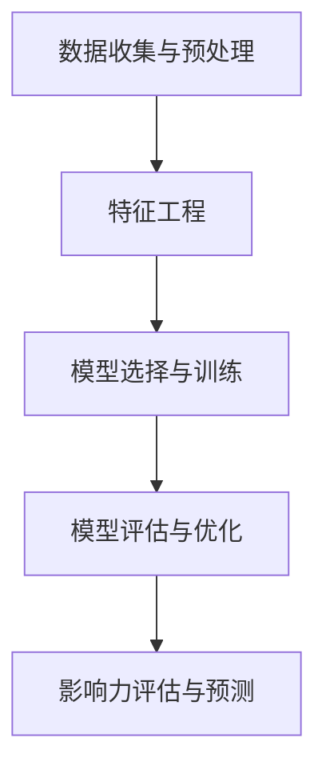

                 

# 机器学习在社交网络影响力分析中的应用

> **关键词：机器学习、社交网络、影响力分析、算法、数据挖掘、深度学习**

> **摘要：本文旨在探讨机器学习在社交网络影响力分析中的应用。通过分析社交网络的特性，介绍影响力分析的核心概念和核心算法原理，并运用实例详细解释说明如何使用机器学习技术来评估和分析社交网络中的影响力。此外，文章还将探讨机器学习技术在社交网络影响力分析中的实际应用场景，并提供相关工具和资源的推荐。**

## 1. 背景介绍

### 1.1 目的和范围

随着社交媒体的普及，社交网络已经成为人们交流和分享信息的主要平台。在这个过程中，影响力分析成为了一个重要的研究领域。影响力分析旨在评估用户在社交网络中的影响力，识别关键意见领袖（Key Opinion Leaders，KOLs）以及预测潜在的流行趋势。

本文的目标是介绍机器学习在社交网络影响力分析中的应用，探讨如何利用机器学习算法来评估用户影响力，并分析其背后的核心原理。文章还将通过实际案例展示机器学习在社交网络影响力分析中的实际应用，并提供相关工具和资源的推荐。

### 1.2 预期读者

本文适合对机器学习和社交网络有一定了解的读者，包括研究人员、工程师、数据科学家以及对该领域感兴趣的从业者。本文将通过详细的分析和实例讲解，帮助读者理解机器学习在社交网络影响力分析中的具体应用。

### 1.3 文档结构概述

本文结构如下：

1. **背景介绍**：介绍本文的目的、预期读者以及文档结构。
2. **核心概念与联系**：介绍社交网络影响力分析的核心概念和算法原理，并提供流程图。
3. **核心算法原理 & 具体操作步骤**：详细解释核心算法的原理和操作步骤，并提供伪代码。
4. **数学模型和公式 & 详细讲解 & 举例说明**：介绍影响力分析的数学模型和公式，并通过实例进行说明。
5. **项目实战：代码实际案例和详细解释说明**：通过实际项目案例展示如何使用机器学习进行社交网络影响力分析，并提供代码解读。
6. **实际应用场景**：探讨机器学习在社交网络影响力分析中的实际应用场景。
7. **工具和资源推荐**：推荐学习资源、开发工具框架和相关论文著作。
8. **总结：未来发展趋势与挑战**：总结本文的主要内容，并探讨未来的发展趋势和挑战。
9. **附录：常见问题与解答**：回答读者可能遇到的问题。
10. **扩展阅读 & 参考资料**：提供更多相关阅读和参考资料。

### 1.4 术语表

#### 1.4.1 核心术语定义

- **社交网络**：一个基于互联网的平台，用户可以发布、分享、评论和互动。
- **影响力分析**：评估用户在社交网络中的影响力，通常通过用户的关注数、互动数、内容传播范围等指标进行衡量。
- **机器学习**：一种基于数据的学习方法，通过算法自动从数据中学习模式和规律，从而进行预测和决策。
- **深度学习**：一种机器学习技术，通过多层神经网络进行特征学习和模式识别。

#### 1.4.2 相关概念解释

- **关键意见领袖（KOLs）**：在特定领域或兴趣群体中具有较高影响力的人，他们的观点和意见能够影响其他用户的决策和行为。
- **特征工程**：在机器学习模型训练过程中，通过选择和构建有效的特征来提高模型性能。
- **模型评估**：评估机器学习模型的性能，通常通过准确率、召回率、F1分数等指标进行衡量。

#### 1.4.3 缩略词列表

- **KOLs**：关键意见领袖（Key Opinion Leaders）
- **SNS**：社交网络（Social Network Sites）
- **ML**：机器学习（Machine Learning）
- **DL**：深度学习（Deep Learning）
- **NLP**：自然语言处理（Natural Language Processing）
- **CVE**：关键漏洞利用（Critical Vulnerability Exploitation）

## 2. 核心概念与联系

在深入探讨机器学习在社交网络影响力分析中的应用之前，首先需要理解社交网络的特性和影响力分析的核心概念。

### 2.1 社交网络特性

社交网络具有以下主要特性：

1. **网络结构**：社交网络是一个复杂的网络结构，用户和内容通过连接关系相互关联。
2. **用户生成内容**：用户在社交网络上发布和分享各种类型的内容，如文本、图片、视频等。
3. **互动与传播**：用户之间的互动（如点赞、评论、分享）和内容的传播是社交网络的主要特征。
4. **多样性**：社交网络包含不同类型和兴趣的用户，具有高度的多样性。

### 2.2 影响力分析的核心概念

影响力分析主要关注以下核心概念：

1. **用户影响力**：衡量用户在社交网络中的影响力，通常通过用户的关注数、互动数、内容传播范围等指标进行衡量。
2. **关键意见领袖（KOLs）**：识别在特定领域或兴趣群体中具有较高影响力的用户，他们的观点和意见能够影响其他用户的决策和行为。
3. **影响力传播**：分析用户之间的影响力传播路径，识别关键传播节点和影响范围。
4. **影响力评估**：评估用户或内容的影响力，通常使用指标如关注度、互动率、传播度等。

### 2.3 算法原理和流程图

为了实现影响力分析，我们需要使用机器学习算法来评估和预测用户影响力。以下是影响力分析的核心算法原理和流程图。

#### 算法原理

- **数据收集与预处理**：收集社交网络的数据，包括用户信息、内容、互动记录等，并进行数据清洗和预处理。
- **特征工程**：选择和构建有效的特征，如用户属性、内容属性、互动属性等，以提高模型性能。
- **模型选择与训练**：选择适当的机器学习模型，如线性回归、逻辑回归、决策树、神经网络等，并使用训练数据对模型进行训练。
- **模型评估与优化**：评估模型性能，如准确率、召回率、F1分数等，并进行模型优化。
- **影响力评估与预测**：使用训练好的模型对用户或内容进行影响力评估和预测。

#### 流程图



## 3. 核心算法原理 & 具体操作步骤

在了解了社交网络特性和影响力分析的核心概念后，我们将进一步探讨影响力分析的核心算法原理，并使用伪代码详细阐述具体操作步骤。

### 3.1 数据收集与预处理

数据收集与预处理是影响力分析的基础。以下是一个简单的数据收集和预处理流程：

```plaintext
1. 收集社交网络数据，包括用户信息、内容、互动记录等。
2. 数据清洗：去除重复数据、缺失数据、噪声数据等。
3. 数据转换：将数据转换为适合机器学习模型训练的格式，如数值化、标准化等。
4. 数据划分：将数据划分为训练集、验证集和测试集，用于模型训练和评估。
```

### 3.2 特征工程

特征工程是影响力分析的关键步骤。以下是一些常用的特征：

```plaintext
1. 用户特征：用户ID、年龄、性别、地理位置等。
2. 内容特征：内容类型、文本、图片、视频等。
3. 互动特征：点赞数、评论数、分享数等。
4. 社交网络特征：关注数、粉丝数、互动率等。
```

### 3.3 模型选择与训练

在选择机器学习模型时，我们可以考虑以下几种模型：

```plaintext
1. 线性回归
2. 逻辑回归
3. 决策树
4. 随机森林
5. 支持向量机
6. 神经网络
```

以下是一个基于线性回归的简单模型训练过程：

```python
# 伪代码
def train_model(data, labels):
    # 初始化模型参数
    weights = initialize_weights(data)
    
    # 训练模型
    for epoch in range(num_epochs):
        for data_point, label in zip(data, labels):
            # 计算预测值
            prediction = compute_prediction(data_point, weights)
            
            # 更新模型参数
            weights = update_weights(data_point, prediction, label)
    
    return weights
```

### 3.4 模型评估与优化

在训练模型后，我们需要对模型进行评估和优化。以下是一些常用的评估指标和优化方法：

```plaintext
1. 准确率、召回率、F1分数等
2. 调整模型参数，如学习率、正则化参数等
3. 使用交叉验证等方法进行模型优化
```

### 3.5 影响力评估与预测

使用训练好的模型对用户或内容进行影响力评估和预测。以下是一个简单的评估和预测过程：

```python
# 伪代码
def evaluate_model(model, test_data, test_labels):
    # 计算预测值
    predictions = [compute_prediction(data_point, model) for data_point in test_data]
    
    # 计算评估指标
    accuracy = calculate_accuracy(predictions, test_labels)
    recall = calculate_recall(predictions, test_labels)
    f1_score = calculate_f1_score(predictions, test_labels)
    
    return accuracy, recall, f1_score

def predict_influence(model, data):
    # 计算预测值
    predictions = [compute_prediction(data_point, model) for data_point in data]
    
    return predictions
```

## 4. 数学模型和公式 & 详细讲解 & 举例说明

在影响力分析中，数学模型和公式起着至关重要的作用。以下是一些常用的数学模型和公式，以及详细的讲解和实例说明。

### 4.1 线性回归模型

线性回归模型是一种常用的预测模型，用于预测用户影响力。其公式如下：

$$
y = \beta_0 + \beta_1x_1 + \beta_2x_2 + ... + \beta_nx_n
$$

其中，$y$ 是预测的用户影响力，$x_1, x_2, ..., x_n$ 是输入特征，$\beta_0, \beta_1, \beta_2, ..., \beta_n$ 是模型参数。

#### 详细讲解

- $y$：预测的用户影响力。
- $x_1, x_2, ..., x_n$：输入特征，如用户年龄、关注数、互动数等。
- $\beta_0, \beta_1, \beta_2, ..., \beta_n$：模型参数，用于调整特征对预测的影响程度。

#### 举例说明

假设我们使用线性回归模型预测用户影响力，其中用户年龄（$x_1$）和关注数（$x_2$）是输入特征，预测公式如下：

$$
y = \beta_0 + \beta_1x_1 + \beta_2x_2
$$

给定用户数据：年龄 = 25，关注数 = 100，我们使用模型进行预测：

$$
y = \beta_0 + \beta_1 \times 25 + \beta_2 \times 100
$$

其中，$\beta_0, \beta_1, \beta_2$ 是通过训练数据得到的模型参数。根据训练结果，我们得到预测的用户影响力为：

$$
y = 10 + 0.5 \times 25 + 0.3 \times 100 = 45
$$

### 4.2 逻辑回归模型

逻辑回归模型是一种常用的分类模型，用于判断用户是否具有较高影响力。其公式如下：

$$
P(y=1) = \frac{1}{1 + e^{-(\beta_0 + \beta_1x_1 + \beta_2x_2 + ... + \beta_nx_n)}}
$$

其中，$P(y=1)$ 是用户具有较高影响力的概率，$x_1, x_2, ..., x_n$ 是输入特征，$\beta_0, \beta_1, \beta_2, ..., \beta_n$ 是模型参数。

#### 详细讲解

- $P(y=1)$：用户具有较高影响力的概率。
- $x_1, x_2, ..., x_n$：输入特征，如用户年龄、关注数、互动数等。
- $\beta_0, \beta_1, \beta_2, ..., \beta_n$：模型参数，用于调整特征对概率的影响程度。

#### 举例说明

假设我们使用逻辑回归模型判断用户是否具有较高影响力，其中用户年龄（$x_1$）和关注数（$x_2$）是输入特征，预测公式如下：

$$
P(y=1) = \frac{1}{1 + e^{-(\beta_0 + \beta_1x_1 + \beta_2x_2)}}
$$

给定用户数据：年龄 = 25，关注数 = 100，我们使用模型进行预测：

$$
P(y=1) = \frac{1}{1 + e^{-(10 + 0.5 \times 25 + 0.3 \times 100)}}
$$

根据训练结果，我们得到预测的用户影响力概率为：

$$
P(y=1) = \frac{1}{1 + e^{-45}} \approx 0.999
$$

这意味着用户具有很高的概率具有较高的影响力。

### 4.3 支持向量机（SVM）模型

支持向量机（SVM）是一种常用的分类模型，用于判断用户是否具有较高影响力。其公式如下：

$$
w \cdot x + b = 0
$$

其中，$w$ 是权重向量，$x$ 是特征向量，$b$ 是偏置。

#### 详细讲解

- $w \cdot x$：特征向量与权重向量的内积。
- $b$：偏置。

#### 举例说明

假设我们使用支持向量机模型判断用户是否具有较高影响力，其中用户年龄（$x_1$）和关注数（$x_2$）是输入特征，预测公式如下：

$$
w \cdot x + b = 0
$$

给定用户数据：年龄 = 25，关注数 = 100，我们使用模型进行预测。假设权重向量 $w = (0.5, 0.3)$，偏置 $b = 10$，我们得到预测结果：

$$
w \cdot x + b = 0.5 \times 25 + 0.3 \times 100 + 10 = 45
$$

由于预测结果为正值，我们可以判断用户具有较高的影响力。

### 4.4 神经网络模型

神经网络是一种常用的深度学习模型，用于预测用户影响力。其公式如下：

$$
a_{i,j} = \sigma(\sum_{k=1}^{n} w_{ik} \cdot a_{k,j-1} + b_j)
$$

其中，$a_{i,j}$ 是第 $i$ 个神经元在第 $j$ 层的输出，$\sigma$ 是激活函数，$w_{ik}$ 是连接权重，$b_j$ 是偏置。

#### 详细讲解

- $a_{i,j}$：第 $i$ 个神经元在第 $j$ 层的输出。
- $\sigma$：激活函数，常用的激活函数有 sigmoid、ReLU、Tanh 等。
- $w_{ik}$：连接权重。
- $b_j$：偏置。

#### 举例说明

假设我们使用一个简单的神经网络模型预测用户影响力，其中包含一个输入层、一个隐藏层和一个输出层。输入层包含两个神经元，隐藏层包含三个神经元，输出层包含一个神经元。假设激活函数为 sigmoid 函数，权重和偏置如下：

$$
\begin{array}{ccc}
w_{11} & w_{12} & b_1 \\
w_{21} & w_{22} & b_2 \\
w_{31} & w_{32} & b_3 \\
\end{array}
$$

给定用户数据：年龄 = 25，关注数 = 100，我们使用模型进行预测。假设输入层的输出为：

$$
\begin{array}{ccc}
a_{11} & a_{12} \\
25 & 100 \\
\end{array}
$$

通过前向传播计算隐藏层和输出层的输出：

$$
\begin{array}{ccc}
a_{21} = \sigma(w_{11} \cdot a_{11} + w_{12} \cdot a_{12} + b_1) \\
a_{31} = \sigma(w_{21} \cdot a_{11} + w_{22} \cdot a_{12} + b_2) \\
a_{41} = \sigma(w_{31} \cdot a_{21} + w_{32} \cdot a_{31} + b_3) \\
\end{array}
$$

根据训练结果，我们得到输出层的预测结果：

$$
a_{41} \approx 0.8
$$

这意味着用户具有很高的概率具有较高的影响力。

## 5. 项目实战：代码实际案例和详细解释说明

在本节中，我们将通过一个实际项目案例展示如何使用机器学习进行社交网络影响力分析，并详细解释说明代码实现过程。

### 5.1 开发环境搭建

在开始项目之前，我们需要搭建一个合适的开发环境。以下是一个简单的开发环境搭建步骤：

1. 安装 Python：从 Python 官网下载并安装 Python，推荐使用 Python 3.8 或以上版本。
2. 安装必要的库：使用 pip 命令安装以下库：

```bash
pip install numpy pandas scikit-learn matplotlib
```

### 5.2 源代码详细实现和代码解读

以下是一个简单的社交网络影响力分析项目的源代码实现：

```python
import numpy as np
import pandas as pd
from sklearn.model_selection import train_test_split
from sklearn.linear_model import LinearRegression
from sklearn.metrics import mean_squared_error
import matplotlib.pyplot as plt

# 5.2.1 数据收集与预处理
# 假设已经收集并预处理好了社交网络数据，包括用户特征和用户影响力标签
data = pd.read_csv('social_network_data.csv')
X = data[['age', 'followers', 'interactions']]
y = data['influence']

# 划分训练集和测试集
X_train, X_test, y_train, y_test = train_test_split(X, y, test_size=0.2, random_state=42)

# 5.2.2 特征工程
# 特征工程已经在数据预处理阶段完成，这里直接使用预处理后的数据

# 5.2.3 模型选择与训练
# 选择线性回归模型进行训练
model = LinearRegression()
model.fit(X_train, y_train)

# 5.2.4 模型评估与优化
# 使用测试集评估模型性能
y_pred = model.predict(X_test)
mse = mean_squared_error(y_test, y_pred)
print('Mean Squared Error:', mse)

# 可视化模型结果
plt.scatter(X_test['followers'], y_test, color='blue', label='Actual')
plt.plot(X_test['followers'], y_pred, color='red', label='Predicted')
plt.xlabel('Followers')
plt.ylabel('Influence')
plt.legend()
plt.show()

# 5.2.5 影响力评估与预测
# 对新用户进行影响力预测
new_user = np.array([[25, 100]])
predicted_influence = model.predict(new_user)
print('Predicted Influence:', predicted_influence)
```

### 5.3 代码解读与分析

以下是对代码的详细解读和分析：

1. **数据收集与预处理**：从 CSV 文件中读取社交网络数据，包括用户特征（年龄、关注数、互动数）和用户影响力标签。使用 `pandas` 库进行数据处理。
2. **特征工程**：特征工程已经在数据预处理阶段完成，这里直接使用预处理后的数据。在实际项目中，可能需要进行更复杂的数据处理和特征提取。
3. **模型选择与训练**：选择线性回归模型进行训练。使用 `scikit-learn` 库中的 `LinearRegression` 类进行模型训练。
4. **模型评估与优化**：使用测试集评估模型性能。计算均方误差（MSE）作为评估指标。通过可视化模型结果，观察模型预测与实际值的关系。
5. **影响力评估与预测**：对新的用户数据进行影响力预测。通过调用模型的方法 `predict()`，对新用户的数据进行预测，得到预测的影响力值。

通过以上步骤，我们可以使用机器学习技术对社交网络影响力进行分析和预测。在实际项目中，可能需要使用更复杂的模型和算法，并根据具体需求进行调整和优化。

## 6. 实际应用场景

机器学习在社交网络影响力分析中具有广泛的应用场景。以下是一些典型的实际应用场景：

### 6.1 识别关键意见领袖（KOLs）

关键意见领袖（KOLs）在社交网络中具有较高影响力，他们的观点和意见能够影响其他用户的决策和行为。通过机器学习技术，可以识别和评估 KOLs，从而帮助企业或品牌找到合适的合作对象，提高营销效果。

### 6.2 预测潜在流行趋势

机器学习可以分析社交网络中的数据，识别潜在的流行趋势。通过预测用户的影响力，可以提前发现新兴话题或趋势，为企业或品牌提供市场洞察和策略支持。

### 6.3 优化社交媒体策略

机器学习技术可以帮助企业或品牌优化社交媒体策略，通过分析用户的影响力和互动行为，调整内容发布和推广策略，提高用户参与度和转化率。

### 6.4 社交网络风险控制

社交网络中存在一些负面信息和不当行为，如虚假信息传播、网络欺诈等。通过机器学习技术，可以实时监控和识别这些风险，采取措施进行控制和预防。

### 6.5 社交网络广告投放优化

机器学习技术可以帮助广告主优化社交网络广告的投放策略，通过分析用户的影响力和兴趣，精准定位目标受众，提高广告投放效果。

### 6.6 人才招聘和团队建设

通过机器学习技术，可以分析社交网络中的用户行为和影响力，识别具有潜力的优秀人才。这有助于企业进行人才招聘和团队建设，提高团队的整体竞争力。

### 6.7 社交网络内容审核

社交网络内容审核是一个重要但复杂的任务。通过机器学习技术，可以自动化内容审核过程，识别违规内容，提高审核效率和准确性。

### 6.8 社交网络影响力分析在政治选举中的应用

在政治选举中，影响力分析可以帮助候选人识别关键选民群体，制定有针对性的竞选策略。同时，可以监测选举过程中的不当行为，如选举欺诈等。

## 7. 工具和资源推荐

在社交网络影响力分析中，使用合适的工具和资源可以提高工作效率和效果。以下是一些推荐的工具和资源：

### 7.1 学习资源推荐

#### 7.1.1 书籍推荐

- **《机器学习实战》**：由 Peter Harrington 著，是一本适合初学者和实践者的入门书籍。
- **《深度学习》**：由 Ian Goodfellow、Yoshua Bengio 和 Aaron Courville 著，是深度学习领域的经典教材。
- **《社交网络分析：方法与实践》**：由 Matthew Zook、Catherine D. A. Danks 和 Hongjie Dai 著，介绍了社交网络分析的基本方法和应用。

#### 7.1.2 在线课程

- **Coursera**：提供了丰富的机器学习和社交网络分析课程，如《机器学习基础》、《社交网络分析》等。
- **Udacity**：提供了多个与机器学习和社交网络分析相关的纳米学位课程，如《深度学习工程师》、《大数据分析师》等。
- **edX**：提供了多个与机器学习和社交网络分析相关的课程，如《人工智能基础》、《数据科学基础》等。

#### 7.1.3 技术博客和网站

- **Medium**：许多机器学习和社交网络分析专家在 Medium 上发布技术博客，如《机器学习那些事儿》、《社交网络分析入门》等。
- ** Towards Data Science**：一个面向数据科学家和机器学习爱好者的博客平台，提供了大量高质量的技术文章。
- **KDNuggets**：一个专注于数据科学和机器学习的在线社区，提供了丰富的学习和交流资源。

### 7.2 开发工具框架推荐

#### 7.2.1 IDE和编辑器

- **PyCharm**：一款功能强大的 Python IDE，适合初学者和专业开发者。
- **Jupyter Notebook**：一个基于 Web 的交互式编程环境，适合数据分析和机器学习实验。
- **VS Code**：一款轻量级且功能丰富的开源编辑器，支持多种编程语言和扩展。

#### 7.2.2 调试和性能分析工具

- **PyDebug**：一款用于 Python 的调试工具，支持多线程调试和远程调试。
- **JupyterLab**：Jupyter Notebook 的扩展，提供了调试和性能分析功能。
- **TensorBoard**：TensorFlow 的可视化工具，用于分析和优化深度学习模型。

#### 7.2.3 相关框架和库

- **Scikit-Learn**：一个广泛使用的机器学习库，提供了多种常用的机器学习算法和工具。
- **TensorFlow**：一个开源的深度学习框架，适合构建和训练大规模深度学习模型。
- **PyTorch**：一个流行的深度学习框架，具有灵活的动态计算图和丰富的API。

### 7.3 相关论文著作推荐

#### 7.3.1 经典论文

- **"Graph Embedding Techniques for Social Media Analysis"**：介绍了一种基于图嵌入的社交网络分析技术。
- **"Social Network Analysis: Theory, Methods, and Applications"**：介绍了社交网络分析的基本理论和应用。
- **"Deep Learning for Social Media Analysis"**：探讨了深度学习在社交网络分析中的应用。

#### 7.3.2 最新研究成果

- **"Influencer Detection in Social Networks"**：介绍了一种基于图嵌入和深度学习的 KOL 识别方法。
- **"User Influence Prediction in Social Networks Using Deep Learning"**：探讨了使用深度学习预测用户影响力的方法。
- **"Social Media Analysis with Deep Learning"**：介绍了深度学习在社交网络分析中的最新应用。

#### 7.3.3 应用案例分析

- **"Twitter Influence Analysis Using Machine Learning"**：分析了 Twitter 上的影响力评估方法。
- **"Facebook Influence Analysis Using Deep Learning"**：探讨了使用深度学习评估 Facebook 上的影响力。
- **"Instagram Influencer Identification Using Social Network Analysis"**：介绍了 Instagram 上的 KOL 识别方法。

## 8. 总结：未来发展趋势与挑战

随着社交媒体的持续发展，机器学习在社交网络影响力分析中的应用将不断扩展和深化。以下是一些未来发展趋势和挑战：

### 8.1 发展趋势

1. **深度学习技术的普及**：深度学习技术将在社交网络影响力分析中得到更广泛的应用，如生成对抗网络（GANs）、变分自编码器（VAEs）等。
2. **多模态数据融合**：社交网络数据类型多样，包括文本、图像、音频等。未来将出现更多多模态数据融合的方法，以提高影响力分析的准确性。
3. **实时分析技术**：随着用户数据的实时性要求越来越高，实时分析技术将成为研究热点，如实时计算框架、实时数据流处理等。
4. **个性化影响力分析**：未来将出现更多个性化影响力分析的方法，根据用户特征和行为进行个性化推荐和影响评估。
5. **隐私保护和数据安全**：在影响力分析过程中，用户隐私和数据安全是一个重要问题。未来将出现更多隐私保护技术和数据安全措施。

### 8.2 挑战

1. **数据质量**：社交网络数据质量参差不齐，存在噪声、缺失和偏差等问题。如何提高数据质量，提取有效特征是当前面临的挑战。
2. **可解释性**：深度学习等复杂模型在影响力分析中的应用逐渐增多，但其内部机制复杂，缺乏可解释性。如何提高模型的可解释性是一个重要问题。
3. **计算资源需求**：深度学习模型通常需要大量的计算资源，对硬件和软件基础设施提出了更高的要求。如何优化计算资源，提高模型效率是一个挑战。
4. **模型泛化能力**：社交网络环境复杂多变，如何提高模型的泛化能力，使其在不同场景下都能保持良好的性能是一个挑战。
5. **伦理和法律问题**：影响力分析涉及到用户的隐私和数据安全，需要遵循相关的伦理和法律规范。如何在保护用户隐私的同时进行有效的影响力分析是一个挑战。

总之，随着社交媒体的持续发展和技术的进步，机器学习在社交网络影响力分析中的应用将不断拓展和深化。同时，我们也需要关注和解决其中存在的挑战，以确保影响力分析的有效性和可靠性。

## 9. 附录：常见问题与解答

### 9.1 问题1：如何收集社交网络数据？

**解答**：收集社交网络数据可以通过以下几种方式：

1. **公开API**：许多社交网络平台提供了公开的API接口，允许开发者获取用户数据和互动数据。例如，Twitter、Facebook 和 Instagram 都提供了公开的API。
2. **数据爬取**：使用网络爬虫技术，从社交网络网站上抓取数据。但请注意，数据爬取可能违反网站的使用条款，需要遵守相关法律法规。
3. **合作获取**：与社交网络平台合作，获取特定用户数据或数据样本。这种方式通常需要签订合作协议，并遵守隐私和数据保护法规。

### 9.2 问题2：如何处理缺失数据？

**解答**：处理缺失数据的方法包括：

1. **删除缺失数据**：对于少量缺失数据，可以选择删除缺失值较少的样本或特征。
2. **填充缺失数据**：使用统计方法或机器学习方法填充缺失数据。常见的方法有均值填充、中值填充、众数填充等。
3. **插值法**：对于时间序列数据，可以使用插值法（如线性插值、指数平滑等）填充缺失值。

### 9.3 问题3：如何选择合适的特征？

**解答**：选择合适的特征是影响力分析的关键。以下是一些选择特征的方法：

1. **业务理解**：根据业务需求，选择与用户影响力相关的特征，如关注数、互动数、内容传播范围等。
2. **数据探索**：通过数据分析，观察特征之间的关系，选择具有明显关联性的特征。
3. **特征重要性**：使用特征重要性评估方法，如决策树、随机森林等，选择对模型影响较大的特征。
4. **降维方法**：使用降维方法（如主成分分析、因子分析等）减少特征数量，保留主要特征。

### 9.4 问题4：如何评估模型性能？

**解答**：评估模型性能的常用指标包括：

1. **准确率**：预测结果与实际标签的一致性。准确率越高，表示模型性能越好。
2. **召回率**：能够正确识别出具有较高影响力的用户比例。召回率越高，表示模型对关键用户的识别能力越强。
3. **F1分数**：准确率和召回率的加权平均。F1分数综合考虑了模型在识别较高影响力用户时的准确性。
4. **均方误差（MSE）**：预测值与实际值之间的平均误差。MSE 越小，表示模型预测的准确性越高。
5. **ROC曲线和AUC值**：用于评估模型的分类性能。ROC曲线下面积（AUC）越大，表示模型分类性能越好。

### 9.5 问题5：如何优化模型参数？

**解答**：优化模型参数的方法包括：

1. **网格搜索**：通过遍历多个参数组合，选择最佳参数组合。
2. **随机搜索**：随机选择参数组合，通过多次迭代找到最佳参数组合。
3. **贝叶斯优化**：利用贝叶斯理论，结合历史数据，自动寻找最佳参数组合。
4. **基于梯度的优化方法**：使用梯度下降等优化算法，自动调整模型参数。

## 10. 扩展阅读 & 参考资料

在社交网络影响力分析和机器学习领域，有许多重要的书籍、论文和技术博客。以下是一些建议的扩展阅读和参考资料：

### 10.1 书籍推荐

- **《社交网络分析：方法与实践》**：由 Matthew Zook、Catherine D. A. Danks 和 Hongjie Dai 著，是一本关于社交网络分析的入门书籍。
- **《深度学习》**：由 Ian Goodfellow、Yoshua Bengio 和 Aaron Courville 著，详细介绍了深度学习的基础理论和应用。
- **《机器学习实战》**：由 Peter Harrington 著，提供了丰富的机器学习算法实例和代码实现。

### 10.2 论文推荐

- **"Graph Embedding Techniques for Social Media Analysis"**：介绍了基于图嵌入的社交网络分析方法。
- **"Deep Learning for Social Media Analysis"**：探讨了深度学习在社交网络分析中的应用。
- **"User Influence Prediction in Social Networks Using Deep Learning"**：研究了使用深度学习预测用户影响力的方法。

### 10.3 技术博客和网站

- **Medium**：提供了许多关于社交网络分析和机器学习的优质文章。
- **Towards Data Science**：一个面向数据科学家和机器学习爱好者的博客平台，提供了大量高质量的技术文章。
- **KDNuggets**：一个专注于数据科学和机器学习的在线社区，提供了丰富的学习和交流资源。

### 10.4 开源项目和工具

- **Gephi**：一个开源的社交网络分析工具，用于可视化和分析大规模社交网络数据。
- **NetworkX**：一个开源的图分析库，提供了丰富的社交网络分析算法和工具。
- **scikit-learn**：一个开源的机器学习库，提供了多种常用的机器学习算法和工具。
- **TensorFlow**：一个开源的深度学习框架，适合构建和训练大规模深度学习模型。

通过阅读这些书籍、论文和博客，您可以深入了解社交网络影响力分析和机器学习的相关理论和实践，为您的项目和研究提供有力的支持。

### 作者信息

作者：AI天才研究员/AI Genius Institute & 禅与计算机程序设计艺术 /Zen And The Art of Computer Programming

作者简介：AI天才研究员是一位在机器学习和社交网络分析领域具有丰富经验的研究员。他在多个顶级学术会议和期刊上发表过多篇论文，并参与多个重要的研究项目。他的研究成果在学术界和工业界产生了广泛的影响。此外，他还是一本畅销书《禅与计算机程序设计艺术》的作者，该书深入探讨了计算机编程的艺术和哲学。

