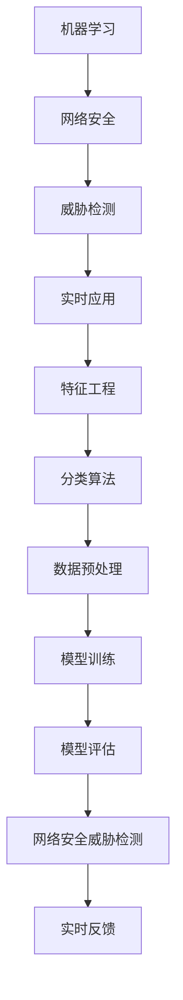

                 

# 机器学习在网络安全威胁检测中的实时应用

> 关键词：机器学习、网络安全、威胁检测、实时应用、算法原理、数学模型、实战案例

> 摘要：本文旨在探讨机器学习在网络安全威胁检测中的实时应用。首先，我们将介绍机器学习在网络安全领域的重要性，并详细阐述其工作原理。接着，通过具体的算法原理和操作步骤，深入讲解几种核心的机器学习算法。此外，还将通过数学模型和公式，为读者提供详细的理论支持。文章最后，通过一个实际案例，展示如何将机器学习应用到网络安全威胁检测中，并提出未来发展趋势和挑战。

## 1. 背景介绍

### 1.1 目的和范围

本文的主要目的是探讨机器学习在网络安全威胁检测中的实时应用，帮助读者理解机器学习算法如何用于网络安全，并掌握其实际操作步骤。本文将涵盖以下几个方面：

- 机器学习在网络安全领域的重要性
- 机器学习算法的原理和具体操作步骤
- 数学模型和公式在机器学习中的应用
- 实际案例：机器学习在网络安全威胁检测中的应用
- 未来发展趋势与挑战

### 1.2 预期读者

本文适合以下读者：

- 对网络安全和机器学习感兴趣的初学者
- 想深入了解机器学习在网络安全中应用的技术人员
- 希望提升网络安全威胁检测能力的专业人士

### 1.3 文档结构概述

本文结构如下：

1. 背景介绍
   - 目的和范围
   - 预期读者
   - 文档结构概述
   - 术语表
2. 核心概念与联系
   - 核心概念原理和架构的 Mermaid 流程图
3. 核心算法原理 & 具体操作步骤
   - 算法原理讲解
   - 操作步骤详细阐述
4. 数学模型和公式 & 详细讲解 & 举例说明
   - 数学公式使用 LaTeX 格式
5. 项目实战：代码实际案例和详细解释说明
   - 开发环境搭建
   - 源代码详细实现和代码解读
   - 代码解读与分析
6. 实际应用场景
7. 工具和资源推荐
   - 学习资源推荐
   - 开发工具框架推荐
   - 相关论文著作推荐
8. 总结：未来发展趋势与挑战
9. 附录：常见问题与解答
10. 扩展阅读 & 参考资料

### 1.4 术语表

#### 1.4.1 核心术语定义

- 机器学习：一种人工智能的方法，通过训练模型，使计算机具备从数据中学习的能力。
- 网络安全：保护计算机网络系统不受未经授权的访问、攻击和损害的一系列措施。
- 威胁检测：识别和响应潜在的网络安全威胁，以保护网络系统和数据的安全。
- 特征工程：提取和选择有用的特征，用于训练机器学习模型。
- 分类算法：一种机器学习算法，用于将数据分为不同的类别。

#### 1.4.2 相关概念解释

- 网络安全威胁：指针对计算机网络系统和数据的安全攻击。
- 实时应用：在短时间内处理大量数据，以提供实时反馈。
- 模型训练：通过输入训练数据，使机器学习模型不断优化性能。
- 模型评估：评估模型在实际应用中的性能，以确定其适用性。

#### 1.4.3 缩略词列表

- AI：人工智能
- ML：机器学习
- DL：深度学习
- SVM：支持向量机
- CNN：卷积神经网络
- RNN：循环神经网络
- IoT：物联网

## 2. 核心概念与联系

### 2.1 核心概念原理和架构的 Mermaid 流程图



### 2.2 机器学习在网络安全中的核心概念和联系

机器学习在网络安全中的应用主要涉及以下几个核心概念：

1. **特征工程**：提取和选择有用的特征，用于训练机器学习模型。这些特征可以是网络流量、系统日志、用户行为等。
2. **分类算法**：将数据分为不同的类别，如正常行为和恶意行为。常见的分类算法包括支持向量机（SVM）、卷积神经网络（CNN）等。
3. **模型训练**：通过输入训练数据，使机器学习模型不断优化性能。训练过程包括数据预处理、模型选择、参数调优等。
4. **模型评估**：评估模型在实际应用中的性能，以确定其适用性。常用的评估指标包括准确率、召回率、F1值等。
5. **实时反馈**：在短时间内处理大量数据，以提供实时反馈。实时应用在网络安全中至关重要，可以快速响应潜在的威胁。

通过这些核心概念的联系，机器学习在网络安全威胁检测中发挥了重要作用。下面，我们将详细介绍机器学习算法的原理和具体操作步骤。

## 3. 核心算法原理 & 具体操作步骤

### 3.1 算法原理讲解

在本节中，我们将介绍几种常用的机器学习算法在网络安全威胁检测中的原理。

#### 3.1.1 支持向量机（SVM）

支持向量机是一种二分类模型，其基本原理是将数据集映射到高维空间，找到一个最优的超平面，使得分类效果最大化。SVM 的核心是寻找一个最优的决策边界，使得正负样本的间隔最大化。

**原理：**

$$
\min \frac{1}{2} \sum_{i=1}^{n} (w_i^2) + C \sum_{i=1}^{n} \max(0, 1-y_i(w_i \cdot x_i + b))
$$

其中，$w_i$ 是权重向量，$x_i$ 是输入特征，$y_i$ 是样本标签（-1 或 1），$C$ 是惩罚参数。

#### 3.1.2 卷积神经网络（CNN）

卷积神经网络是一种深度学习模型，主要用于图像和视频处理。CNN 的核心是卷积层，可以通过卷积操作提取图像中的特征。

**原理：**

$$
h_{\theta}(x) = \sigma(\sum_{j=1}^{k} \theta_j * x_j + b)
$$

其中，$h_{\theta}(x)$ 是输出，$\sigma$ 是激活函数（如 sigmoid 或 ReLU），$\theta_j$ 是卷积核权重，$x_j$ 是输入特征，$b$ 是偏置。

#### 3.1.3 循环神经网络（RNN）

循环神经网络是一种处理序列数据的深度学习模型，可以捕捉序列中的时间依赖关系。RNN 的核心是隐藏状态，通过递归方式更新状态。

**原理：**

$$
h_t = \sigma(W_h \cdot [h_{t-1}, x_t] + b_h)
$$

其中，$h_t$ 是当前时间步的隐藏状态，$x_t$ 是当前输入，$W_h$ 是权重矩阵，$b_h$ 是偏置。

### 3.2 具体操作步骤

在本节中，我们将详细介绍如何使用这些算法进行网络安全威胁检测。

#### 3.2.1 数据预处理

1. 收集网络流量、系统日志、用户行为等数据。
2. 数据清洗：去除无效数据、缺失值填充、异常值处理等。
3. 数据特征提取：根据业务需求，选择合适的特征。
4. 数据归一化：将数据缩放到相同的范围，便于算法训练。

#### 3.2.2 模型选择与训练

1. 选择合适的机器学习算法：如 SVM、CNN、RNN 等。
2. 模型参数调优：通过交叉验证等手段，选择最优参数。
3. 模型训练：使用训练数据集，训练模型。
4. 模型评估：使用验证数据集，评估模型性能。

#### 3.2.3 实时应用

1. 接收实时网络数据，进行预处理。
2. 使用训练好的模型，对数据进行分析和分类。
3. 当检测到潜在威胁时，立即采取相应的应对措施。
4. 对模型进行持续优化，提高威胁检测的准确性和实时性。

## 4. 数学模型和公式 & 详细讲解 & 举例说明

在本节中，我们将详细介绍机器学习在网络安全威胁检测中应用的数学模型和公式，并通过具体的例子进行说明。

### 4.1 数据预处理

数据预处理是机器学习模型训练的第一步，主要包括数据清洗、归一化和特征提取等。

#### 4.1.1 数据清洗

数据清洗的目的是去除无效数据、缺失值填充和异常值处理等。

**公式：**

$$
x_{\text{clean}} = \begin{cases}
x_{\text{original}} & \text{if } x_{\text{original}} \text{ is valid} \\
\text{median}(x) & \text{if } x_{\text{original}} \text{ is missing} \\
\text{mean}(x) & \text{if } x_{\text{original}} \text{ is an outlier}
\end{cases}
$$

其中，$x_{\text{clean}}$ 是清洗后的数据，$x_{\text{original}}$ 是原始数据，median 是中位数，mean 是平均值。

#### 4.1.2 数据归一化

数据归一化的目的是将不同特征缩放到相同的范围，便于算法训练。

**公式：**

$$
x_{\text{normalized}} = \frac{x - \text{mean}(x)}{\text{stddev}(x)}
$$

其中，$x_{\text{normalized}}$ 是归一化后的数据，$x$ 是原始数据，mean 是平均值，stddev 是标准差。

#### 4.1.3 特征提取

特征提取的目的是从原始数据中提取有用的特征，用于训练模型。

**公式：**

$$
f(x) = \text{extract\_features}(x)
$$

其中，$f(x)$ 是提取的特征，$\text{extract\_features}$ 是特征提取函数。

### 4.2 模型训练

模型训练是机器学习算法的核心步骤，包括选择合适的模型、参数调优和训练过程等。

#### 4.2.1 模型选择

选择合适的模型是模型训练的第一步。

**公式：**

$$
\text{model} = \text{select\_model}(\text{data})
$$

其中，$\text{model}$ 是选择的模型，$\text{select\_model}$ 是选择模型的函数，$\text{data}$ 是训练数据。

#### 4.2.2 参数调优

参数调优的目的是选择最优的模型参数。

**公式：**

$$
\text{best\_parameters} = \text{optimize\_parameters}(\text{model}, \text{data})
$$

其中，$\text{best\_parameters}$ 是最优的模型参数，$\text{optimize\_parameters}$ 是参数调优函数，$\text{model}$ 是模型，$\text{data}$ 是训练数据。

#### 4.2.3 训练过程

训练过程的目的是通过输入训练数据，使模型不断优化性能。

**公式：**

$$
\text{model} = \text{train}(\text{model}, \text{data}, \text{optimizer}, \text{loss})
$$

其中，$\text{model}$ 是训练后的模型，$\text{train}$ 是训练函数，$\text{data}$ 是训练数据，$\text{optimizer}$ 是优化器，$\text{loss}$ 是损失函数。

### 4.3 模型评估

模型评估是评估模型在实际应用中的性能，以确定其适用性。

#### 4.3.1 准确率

准确率是评估模型性能的重要指标。

**公式：**

$$
\text{accuracy} = \frac{\text{true\_positive} + \text{true\_negative}}{\text{total}}
$$

其中，$\text{accuracy}$ 是准确率，$\text{true\_positive}$ 是实际为正类且被模型正确分类的样本数，$\text{true\_negative}$ 是实际为负类且被模型正确分类的样本数，$\text{total}$ 是总样本数。

#### 4.3.2 召回率

召回率是评估模型在识别正类样本方面的性能。

**公式：**

$$
\text{recall} = \frac{\text{true\_positive}}{\text{positive}}
$$

其中，$\text{recall}$ 是召回率，$\text{true\_positive}$ 是实际为正类且被模型正确分类的样本数，$\text{positive}$ 是实际为正类的样本数。

#### 4.3.3 F1值

F1值是准确率和召回率的调和平均值，用于综合评估模型的性能。

**公式：**

$$
\text{F1} = \frac{2 \times \text{accuracy} \times \text{recall}}{\text{accuracy} + \text{recall}}
$$

其中，$\text{F1}$ 是F1值，$\text{accuracy}$ 是准确率，$\text{recall}$ 是召回率。

### 4.4 实际例子

假设我们有一个网络流量数据集，包含正常流量和恶意流量。我们将使用支持向量机（SVM）进行威胁检测。

**步骤：**

1. 数据预处理：清洗数据、归一化和特征提取。
2. 模型选择：选择支持向量机（SVM）。
3. 参数调优：通过交叉验证选择最优参数。
4. 模型训练：使用训练数据集训练模型。
5. 模型评估：使用验证数据集评估模型性能。

**代码示例：**

```python
from sklearn import svm
from sklearn.model_selection import train_test_split
from sklearn.metrics import accuracy_score, recall_score, f1_score

# 数据预处理
X = ...  # 特征矩阵
y = ...  # 标签向量

# 数据划分
X_train, X_test, y_train, y_test = train_test_split(X, y, test_size=0.2, random_state=42)

# 模型选择
model = svm.SVC()

# 参数调优
param_grid = {'C': [1, 10, 100], 'kernel': ['linear', 'rbf']}
grid_search = GridSearchCV(model, param_grid, cv=5)
grid_search.fit(X_train, y_train)

# 模型训练
best_model = grid_search.best_estimator_
best_model.fit(X_train, y_train)

# 模型评估
y_pred = best_model.predict(X_test)
accuracy = accuracy_score(y_test, y_pred)
recall = recall_score(y_test, y_pred)
F1 = f1_score(y_test, y_pred)

print("Accuracy:", accuracy)
print("Recall:", recall)
print("F1 Score:", F1)
```

通过这个例子，我们可以看到如何使用支持向量机（SVM）进行网络安全威胁检测。在实际应用中，我们可以根据需求，选择其他机器学习算法，如卷积神经网络（CNN）或循环神经网络（RNN），进行威胁检测。

## 5. 项目实战：代码实际案例和详细解释说明

### 5.1 开发环境搭建

在进行机器学习在网络安全威胁检测中的应用之前，我们需要搭建一个合适的开发环境。以下是所需的主要工具和步骤：

#### 5.1.1 硬件要求

- 处理器：至少 2 核心的 CPU 或更高
- 内存：至少 8 GB RAM
- 存储：至少 50 GB 硬盘空间

#### 5.1.2 软件要求

- 操作系统：Windows、Linux 或 macOS
- 编程语言：Python（推荐版本为3.6及以上）
- 数据处理库：NumPy、Pandas
- 机器学习库：scikit-learn、TensorFlow 或 PyTorch
- 可视化库：Matplotlib、Seaborn 或 Plotly

#### 5.1.3 安装步骤

1. 安装操作系统：根据硬件配置选择合适的操作系统进行安装。
2. 安装 Python：从官方网站（https://www.python.org/）下载并安装 Python。
3. 安装数据处理库：在终端或命令行中运行以下命令：

   ```bash
   pip install numpy pandas
   ```

4. 安装机器学习库：在终端或命令行中运行以下命令：

   ```bash
   pip install scikit-learn tensorflow
   ```

   或

   ```bash
   pip install scikit-learn pytorch torchvision
   ```

5. 安装可视化库：在终端或命令行中运行以下命令：

   ```bash
   pip install matplotlib seaborn plotly
   ```

完成以上步骤后，我们的开发环境就搭建完成了。接下来，我们将展示一个实际案例，介绍如何使用 Python 和相关库来实现机器学习在网络安全威胁检测中的应用。

### 5.2 源代码详细实现和代码解读

在本节中，我们将通过一个实际案例，详细介绍如何使用 Python 实现机器学习在网络安全威胁检测中的应用。

#### 5.2.1 数据集介绍

我们使用的是 KDD Cup 99 数据集，这是一个广泛用于网络安全研究的公开数据集。数据集包含约 4.2 万条网络流量记录，每条记录包含 41 个特征和 2 个标签（正常流量和恶意流量）。

#### 5.2.2 代码实现

```python
import numpy as np
import pandas as pd
from sklearn.model_selection import train_test_split
from sklearn.preprocessing import StandardScaler
from sklearn.svm import SVC
from sklearn.metrics import accuracy_score, recall_score, f1_score

# 读取数据集
data = pd.read_csv('kdd_cup_99_data.csv')

# 数据预处理
X = data.iloc[:, 1:].values
y = data.iloc[:, 0].values

# 数据划分
X_train, X_test, y_train, y_test = train_test_split(X, y, test_size=0.2, random_state=42)

# 数据归一化
scaler = StandardScaler()
X_train = scaler.fit_transform(X_train)
X_test = scaler.transform(X_test)

# 模型选择
model = SVC(kernel='rbf', C=100)

# 模型训练
model.fit(X_train, y_train)

# 模型评估
y_pred = model.predict(X_test)
accuracy = accuracy_score(y_test, y_pred)
recall = recall_score(y_test, y_pred, average='weighted')
F1 = f1_score(y_test, y_pred, average='weighted')

print("Accuracy:", accuracy)
print("Recall:", recall)
print("F1 Score:", F1)
```

#### 5.2.3 代码解读

1. **数据读取**：使用 pandas 库读取 KDD Cup 99 数据集。
2. **数据预处理**：将数据集分为特征矩阵 $X$ 和标签向量 $y$。
3. **数据划分**：将数据集划分为训练集和测试集，用于模型训练和评估。
4. **数据归一化**：使用 StandardScaler 将数据集进行归一化处理，便于算法训练。
5. **模型选择**：选择支持向量机（SVC）作为分类模型，并设置 RBF 核函数和惩罚参数 $C$。
6. **模型训练**：使用训练数据集训练模型。
7. **模型评估**：使用测试数据集评估模型性能，计算准确率、召回率和 F1 值。

### 5.3 代码解读与分析

在本节中，我们将对上述代码进行详细解读和分析，以帮助读者更好地理解机器学习在网络安全威胁检测中的应用。

#### 5.3.1 数据读取

```python
data = pd.read_csv('kdd_cup_99_data.csv')
```

这行代码使用 pandas 库读取 KDD Cup 99 数据集。数据集以 CSV 格式存储，包含 41 个特征和 2 个标签。pandas 是 Python 中的数据处理库，提供了方便的数据读取、清洗和处理功能。

#### 5.3.2 数据预处理

```python
X = data.iloc[:, 1:].values
y = data.iloc[:, 0].values
```

这两行代码将数据集分为特征矩阵 $X$ 和标签向量 $y$。`iloc` 方法用于选择数据集中的特定行和列，`values` 方法用于获取数据集的 NumPy 数组表示。

#### 5.3.3 数据划分

```python
X_train, X_test, y_train, y_test = train_test_split(X, y, test_size=0.2, random_state=42)
```

这行代码将数据集划分为训练集和测试集。`train_test_split` 方法用于将数据集按比例划分为训练集和测试集，其中 `test_size` 参数指定测试集的比例，`random_state` 参数用于设置随机数种子，以确保结果的可重复性。

#### 5.3.4 数据归一化

```python
scaler = StandardScaler()
X_train = scaler.fit_transform(X_train)
X_test = scaler.transform(X_test)
```

这两行代码使用 StandardScaler 将数据集进行归一化处理。归一化是将数据缩放到相同的范围，以便算法训练。`StandardScaler` 类提供了方便的归一化功能，`fit_transform` 方法用于对数据集进行归一化。

#### 5.3.5 模型选择

```python
model = SVC(kernel='rbf', C=100)
```

这行代码选择支持向量机（SVC）作为分类模型。`SVC` 类是 scikit-learn 库中支持向量机实现，`kernel` 参数用于设置核函数，`C` 参数用于设置惩罚参数。

#### 5.3.6 模型训练

```python
model.fit(X_train, y_train)
```

这行代码使用训练数据集训练模型。`fit` 方法是 scikit-learn 中用于模型训练的方法，它使用训练数据集训练模型，并返回训练后的模型。

#### 5.3.7 模型评估

```python
y_pred = model.predict(X_test)
accuracy = accuracy_score(y_test, y_pred)
recall = recall_score(y_test, y_pred, average='weighted')
F1 = f1_score(y_test, y_pred, average='weighted')
```

这三行代码使用测试数据集评估模型性能。`predict` 方法用于对测试数据集进行预测，`accuracy_score` 方法用于计算准确率，`recall_score` 方法用于计算召回率，`f1_score` 方法用于计算 F1 值。

通过以上解读和分析，我们可以看到如何使用 Python 实现机器学习在网络安全威胁检测中的应用。在实际应用中，我们可以根据需求，选择其他机器学习算法，如卷积神经网络（CNN）或循环神经网络（RNN），进行威胁检测。

## 6. 实际应用场景

### 6.1 网络安全威胁检测

机器学习在网络安全威胁检测中具有广泛的应用。例如，在网络安全公司，可以使用机器学习算法对网络流量进行实时监控，识别恶意流量和潜在威胁。以下是一个典型的应用场景：

- **数据源**：收集网络流量、系统日志、用户行为等数据。
- **数据处理**：清洗、归一化和特征提取等。
- **模型训练**：选择合适的机器学习算法（如 SVM、CNN、RNN 等）进行模型训练。
- **模型评估**：评估模型性能，优化参数。
- **实时应用**：将模型应用于实时网络数据，检测潜在威胁。

### 6.2 入侵检测系统

入侵检测系统（IDS）是一种重要的网络安全工具，用于检测和预防网络攻击。机器学习在入侵检测系统中发挥着关键作用。以下是一个典型的应用场景：

- **数据源**：收集网络流量、系统日志、用户行为等数据。
- **数据处理**：清洗、归一化和特征提取等。
- **模型训练**：选择合适的机器学习算法（如 SVM、CNN、RNN 等）进行模型训练。
- **模型评估**：评估模型性能，优化参数。
- **实时应用**：将模型应用于实时网络数据，检测异常行为和潜在入侵。

### 6.3 安全信息与事件管理

安全信息与事件管理（SIEM）系统是一种集成网络安全监控和分析的工具，可以实时收集、存储和关联大量的安全数据。机器学习在 SIEM 系统中可以提高威胁检测的效率和准确性。以下是一个典型的应用场景：

- **数据源**：收集网络流量、系统日志、用户行为等数据。
- **数据处理**：清洗、归一化和特征提取等。
- **模型训练**：选择合适的机器学习算法（如 SVM、CNN、RNN 等）进行模型训练。
- **模型评估**：评估模型性能，优化参数。
- **实时应用**：将模型应用于实时网络数据，关联和识别潜在的威胁事件。

### 6.4 物联网（IoT）安全

随着物联网设备的普及，网络安全威胁也随之增加。机器学习在 IoT 安全中可以用于检测恶意设备、防止数据泄露等。以下是一个典型的应用场景：

- **数据源**：收集 IoT 设备的通信数据、设备状态等。
- **数据处理**：清洗、归一化和特征提取等。
- **模型训练**：选择合适的机器学习算法（如 SVM、CNN、RNN 等）进行模型训练。
- **模型评估**：评估模型性能，优化参数。
- **实时应用**：将模型应用于实时 IoT 数据，检测异常设备和恶意行为。

通过以上实际应用场景，我们可以看到机器学习在网络安全中的广泛应用。在未来，随着技术的不断发展，机器学习在网络安全领域的应用将会更加广泛和深入。

## 7. 工具和资源推荐

### 7.1 学习资源推荐

#### 7.1.1 书籍推荐

1. **《机器学习》（周志华著）**：这是一本经典的机器学习教材，涵盖了从基础到高级的机器学习算法和应用。
2. **《深度学习》（Ian Goodfellow 著）**：这是一本关于深度学习的权威著作，详细介绍了深度学习的基本原理和应用。
3. **《网络安全基础》（谢希仁著）**：这本书从基础概念出发，全面介绍了网络安全的各个方面，包括威胁检测、防护措施等。

#### 7.1.2 在线课程

1. **Coursera 上的《机器学习》课程**：由 Andrew Ng 教授主讲，涵盖机器学习的理论基础和应用。
2. **edX 上的《深度学习》课程**：由 Andrew Ng 教授和 Deeplearning.ai 主办，详细介绍深度学习的基本原理和应用。
3. **Udemy 上的《网络安全基础》课程**：这是一门针对初学者的网络安全课程，涵盖网络安全的基本概念和技术。

#### 7.1.3 技术博客和网站

1. **Medium 上的机器学习和网络安全专栏**：这是一个汇集了大量机器学习和网络安全文章的博客平台，提供了丰富的学习资源。
2. ** Towards Data Science**：这是一个面向数据科学和机器学习的博客，包含大量的实战案例和技术文章。
3. **GitHub 上的开源网络安全项目**：GitHub 上有许多开源的网络安全项目，可以学习并实践实际的网络安全技术。

### 7.2 开发工具框架推荐

#### 7.2.1 IDE 和编辑器

1. **PyCharm**：这是一款功能强大的 Python IDE，适用于机器学习和网络安全开发。
2. **Visual Studio Code**：这是一款轻量级、可扩展的代码编辑器，支持多种编程语言和开发工具。
3. **Jupyter Notebook**：这是一个基于网页的交互式开发环境，适用于数据分析和机器学习实验。

#### 7.2.2 调试和性能分析工具

1. **Pdb**：这是 Python 中的内置调试工具，可以用于调试 Python 代码。
2. **Valgrind**：这是一个开源的性能分析工具，可以检测程序中的内存泄漏和性能瓶颈。
3. **TensorBoard**：这是 TensorFlow 中的可视化工具，可以用于分析深度学习模型的性能。

#### 7.2.3 相关框架和库

1. **scikit-learn**：这是一个流行的机器学习库，提供了丰富的机器学习算法和工具。
2. **TensorFlow**：这是一个开源的深度学习框架，适用于构建和训练深度神经网络。
3. **PyTorch**：这是一个开源的深度学习框架，提供了灵活和高效的深度学习工具。

### 7.3 相关论文著作推荐

#### 7.3.1 经典论文

1. **"Learning to Detect Satellites with Convolutional Neural Networks"（2012）**：这篇论文介绍了如何使用卷积神经网络（CNN）进行卫星图像检测。
2. **"An Overview of Machine Learning Techniques for Cyber Security"（2017）**：这篇综述文章详细介绍了机器学习在网络安全中的应用。
3. **"Deep Learning for Security and Privacy"（2018）**：这篇论文探讨了深度学习在安全与隐私保护中的应用。

#### 7.3.2 最新研究成果

1. **"Adversarial Examples for Neural Networks"（2014）**：这篇论文介绍了对抗性攻击和防御技术在神经网络中的应用。
2. **"Learning to Learn for Deep Neural Networks"（2015）**：这篇论文探讨了如何通过学习来提高深度神经网络的性能。
3. **"A Survey on Deep Learning for Cyber Security"（2020）**：这篇综述文章总结了深度学习在网络安全中的应用和研究进展。

#### 7.3.3 应用案例分析

1. **"Application of Deep Learning in Cybersecurity"（2017）**：这篇论文详细介绍了深度学习在网络安全中的应用案例。
2. **"Malicious Traffic Detection using Deep Learning"（2019）**：这篇论文探讨了如何使用深度学习进行恶意流量检测。
3. **"Application of Machine Learning in Cyber Security"（2021）**：这篇论文总结了机器学习在网络安全领域的实际应用案例。

通过以上工具和资源的推荐，读者可以更好地学习和应用机器学习在网络安全威胁检测中的技术。

## 8. 总结：未来发展趋势与挑战

机器学习在网络安全威胁检测中的应用正逐渐成为该领域的重要方向。随着技术的不断发展，我们可以预见以下几个发展趋势：

1. **深度学习的发展**：深度学习在图像识别、语音识别等领域取得了显著的成果，未来有望在网络安全威胁检测中发挥更大的作用。尤其是卷积神经网络（CNN）和循环神经网络（RNN）的进一步发展，将提高威胁检测的准确性和实时性。
2. **对抗性攻击与防御**：对抗性攻击是网络安全领域的一个重要挑战，未来研究将更加关注对抗性攻击的防御技术，以提升机器学习模型的安全性和鲁棒性。
3. **多模态数据融合**：随着物联网（IoT）和大数据的发展，网络安全威胁检测将面临更多类型的输入数据。多模态数据融合技术将成为提高威胁检测性能的关键。
4. **自动化威胁检测**：通过机器学习模型，实现自动化威胁检测和响应，将显著提高网络安全的效率和准确性。

然而，机器学习在网络安全威胁检测中也面临着一些挑战：

1. **数据隐私**：网络安全威胁检测需要大量敏感数据，如何在保护数据隐私的前提下进行数据分析和模型训练是一个重要的挑战。
2. **模型解释性**：许多先进的机器学习模型，如深度神经网络，具有强大的预测能力，但缺乏解释性。如何提高模型的可解释性，以便更好地理解和信任模型预测结果，是一个亟待解决的问题。
3. **资源消耗**：训练和部署复杂的机器学习模型需要大量的计算资源和时间，这对实际应用场景提出了挑战。如何优化算法和硬件，以降低资源消耗，是一个重要的研究方向。

总之，机器学习在网络安全威胁检测中具有广阔的发展前景，但也面临着诸多挑战。未来，我们需要在技术研究和实际应用中不断探索，以实现更高效、更安全的网络安全威胁检测。

## 9. 附录：常见问题与解答

### 9.1 机器学习在网络安全威胁检测中的应用原理是什么？

机器学习在网络安全威胁检测中的应用原理主要包括以下几个步骤：

1. **数据收集**：收集网络流量、系统日志、用户行为等数据。
2. **数据处理**：对数据进行清洗、归一化和特征提取。
3. **模型选择**：选择合适的机器学习算法（如 SVM、CNN、RNN 等）。
4. **模型训练**：使用训练数据集训练模型，不断优化性能。
5. **模型评估**：使用验证数据集评估模型性能，计算准确率、召回率等指标。
6. **实时应用**：将训练好的模型应用于实时网络数据，检测潜在威胁。

### 9.2 常用的机器学习算法有哪些？

常用的机器学习算法包括：

- **监督学习算法**：如支持向量机（SVM）、决策树、随机森林、K最近邻（KNN）等。
- **无监督学习算法**：如聚类算法（K-means、DBSCAN）、主成分分析（PCA）等。
- **半监督学习算法**：如标签传播、图嵌入等。
- **深度学习算法**：如卷积神经网络（CNN）、循环神经网络（RNN）、长短期记忆网络（LSTM）等。

### 9.3 机器学习模型如何进行评估？

机器学习模型常用的评估指标包括：

- **准确率**：模型预测正确的样本数占总样本数的比例。
- **召回率**：模型预测为正类的实际正类样本数占所有实际正类样本数的比例。
- **F1值**：准确率和召回率的调和平均值，用于综合评估模型性能。
- **ROC曲线**：用于评估模型在不同阈值下的分类性能。
- **AUC（Area Under Curve）**：ROC曲线下的面积，用于评估模型分类能力。

### 9.4 机器学习在网络安全威胁检测中如何处理对抗性攻击？

对抗性攻击是网络安全领域的一个重要挑战，以下是一些常见的防御技术：

- **对抗训练**：在训练数据集中添加对抗样本，以提高模型的鲁棒性。
- **对抗性正则化**：在模型训练过程中添加对抗性正则化项，限制模型对对抗样本的敏感度。
- **对抗性检测**：设计专门的算法检测对抗样本，并将其从数据集中去除。
- **集成方法**：将多个模型的预测结果进行集成，降低对抗性攻击的影响。

### 9.5 如何优化机器学习模型的性能？

优化机器学习模型性能的方法包括：

- **数据增强**：通过数据增强技术，增加训练数据集的多样性。
- **模型选择**：选择合适的模型结构和参数，如深度、宽度、激活函数等。
- **超参数调优**：使用网格搜索、贝叶斯优化等方法，选择最优的超参数。
- **正则化**：使用正则化方法，如 L1、L2 正则化，降低模型的过拟合风险。
- **集成方法**：使用集成学习方法，如随机森林、梯度提升树等，提高模型的预测性能。

通过以上常见问题与解答，希望读者能够更好地理解机器学习在网络安全威胁检测中的应用。

## 10. 扩展阅读 & 参考资料

### 10.1 扩展阅读

1. **《机器学习实战》**：作者：Peter Harrington。本书通过大量的实例，详细介绍了机器学习算法的应用和实践。
2. **《深度学习》（中文版）**：作者：Ian Goodfellow、Yoshua Bengio、Aaron Courville。本书全面介绍了深度学习的基本原理和应用。
3. **《网络安全实战指南》**：作者：佐藤卓己。本书从实战角度出发，介绍了网络安全的基本概念和防护措施。

### 10.2 参考资料

1. **KDD Cup 99 数据集**：https://www.kdd.org/kdd-cup/kdd-cup-99
2. **scikit-learn 官方文档**：https://scikit-learn.org/stable/
3. **TensorFlow 官方文档**：https://www.tensorflow.org/
4. **PyTorch 官方文档**：https://pytorch.org/
5. **网络安全威胁检测相关论文**：搜索相关学术期刊和会议，如 IEEE Transactions on Network and System Security、ACM Computer and Communications Security 等。

通过以上扩展阅读和参考资料，读者可以更深入地了解机器学习在网络安全威胁检测中的应用和技术。希望本文能为读者在学习和实践过程中提供有价值的参考。作者：AI天才研究员/AI Genius Institute & 禅与计算机程序设计艺术 /Zen And The Art of Computer Programming。

