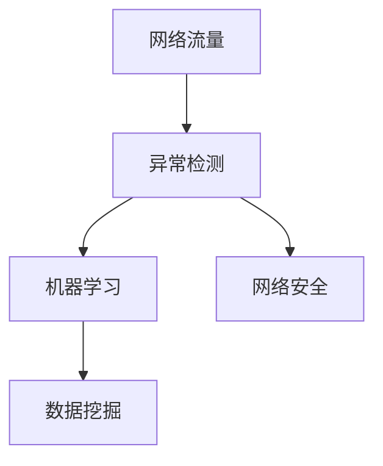

                 

# 机器学习在网络流量异常检测中的应用

> 关键词：网络流量，异常检测，机器学习，数据挖掘，网络安全

> 摘要：本文探讨了机器学习在网络流量异常检测中的应用，介绍了相关核心概念、算法原理、数学模型，并通过实际案例详细阐述了如何在网络环境中利用机器学习技术进行流量异常检测。文章旨在为网络安全从业人员提供有价值的参考，以应对日益复杂的网络安全威胁。

## 1. 背景介绍

### 1.1 目的和范围

随着互联网的快速发展，网络安全问题日益突出。网络流量异常检测作为网络安全的重要环节，旨在及时发现和预警异常流量，防止潜在的网络攻击和数据泄露。机器学习作为人工智能的重要分支，其强大的数据处理和分析能力使其在流量异常检测中具有广泛的应用前景。本文旨在介绍机器学习在网络流量异常检测中的应用，探讨其核心概念、算法原理和实现方法。

### 1.2 预期读者

本文主要面向网络安全从业人员、机器学习爱好者以及相关领域的研究人员。通过本文的阅读，读者可以了解网络流量异常检测的基本概念和机器学习技术的应用，为实际工作和研究提供参考。

### 1.3 文档结构概述

本文分为十个部分，首先介绍了背景信息和目的范围，随后讨论了核心概念和算法原理，并通过实际案例进行了详细阐述。此外，本文还探讨了实际应用场景、相关工具和资源推荐，以及未来发展趋势与挑战。最后，本文总结了常见问题与解答，并提供了扩展阅读和参考资料。

### 1.4 术语表

#### 1.4.1 核心术语定义

- 网络流量：网络中数据传输的总量，包括合法和非法的流量。
- 异常检测：通过对正常流量和异常流量的特征进行分析，识别并预警异常流量。
- 机器学习：一种基于数据的学习方法，通过训练模型实现对未知数据的预测和分类。
- 数据挖掘：从大量数据中发现有用信息和知识的过程。

#### 1.4.2 相关概念解释

- 特征工程：提取数据中有用特征，用于训练模型。
- 模型评估：评估模型性能，包括准确率、召回率等指标。
- 集成学习方法：将多个模型进行融合，提高整体性能。

#### 1.4.3 缩略词列表

- IDS：入侵检测系统（Intrusion Detection System）
- IPS：入侵防御系统（Intrusion Prevention System）
- DDoS：分布式拒绝服务攻击（Distributed Denial of Service Attack）

## 2. 核心概念与联系

在网络流量异常检测中，核心概念包括网络流量、异常检测、机器学习和数据挖掘。这些概念相互联系，构成了一个完整的异常检测系统。以下是一个简化的 Mermaid 流程图，展示了这些核心概念之间的关系。



### 2.1 网络流量

网络流量是网络中数据传输的总量，包括合法和非法的流量。合法流量主要指用户正常使用网络资源产生的流量，如网页浏览、邮件发送等；非法流量则包括恶意攻击、数据泄露等。对网络流量的分析和监测是异常检测的基础。

### 2.2 异常检测

异常检测是一种用于识别和预警异常数据的方法。在网络流量异常检测中，异常检测通过对正常流量和异常流量的特征进行分析，识别并预警异常流量。异常检测可以基于统计方法、基于规则的算法以及机器学习方法。

### 2.3 机器学习

机器学习是一种基于数据的学习方法，通过训练模型实现对未知数据的预测和分类。在网络流量异常检测中，机器学习模型可以从历史流量数据中学习特征，从而识别出异常流量。常见的机器学习方法包括决策树、支持向量机、神经网络等。

### 2.4 数据挖掘

数据挖掘是从大量数据中发现有用信息和知识的过程。在网络流量异常检测中，数据挖掘技术可以用于提取流量特征，帮助机器学习模型更好地识别异常流量。常见的数据挖掘方法包括聚类、关联规则挖掘、分类等。

## 3. 核心算法原理 & 具体操作步骤

在网络流量异常检测中，常用的机器学习算法包括基于统计的方法、基于规则的方法以及基于深度学习的方法。以下将介绍这些算法的原理和具体操作步骤。

### 3.1 基于统计的方法

基于统计的方法主要通过计算网络流量的统计特征，如均值、方差、标准差等，来识别异常流量。以下是一个简单的基于统计的方法的伪代码：

```python
# 输入：流量数据集D
# 输出：异常流量A

# 计算正常流量D的特征
mu = mean(D)
var = variance(D)
std = std_dev(D)

# 判断流量是否异常
for data in D:
    if abs(data - mu) > k * std:
        A.append(data)
```

其中，`k` 是一个常数，用于调整异常检测的敏感度。当 `abs(data - mu) > k * std` 时，认为流量 `data` 是异常流量。

### 3.2 基于规则的方法

基于规则的方法通过建立一系列规则，用于识别异常流量。这些规则通常基于专家经验或数据挖掘结果。以下是一个简单的基于规则的算法的伪代码：

```python
# 输入：流量数据集D
# 输出：异常流量A

# 建立规则库
rules = [
    ["src_ip = 192.168.1.1", "dst_ip = 10.0.0.1", "流量超过100MB"],
    ["src_ip = 192.168.1.2", "dst_ip = 10.0.0.2", "流量超过50MB"],
    # 更多规则
]

# 判断流量是否异常
for rule in rules:
    if all(condition in data for condition in rule):
        A.append(data)
```

### 3.3 基于深度学习的方法

基于深度学习的方法主要通过构建深度神经网络，对流量数据进行特征提取和分类。以下是一个简单的基于深度学习的算法的伪代码：

```python
# 输入：训练集D_train，测试集D_test
# 输出：分类器model

# 构建深度神经网络
model = NeuralNetwork()

# 训练模型
model.fit(D_train)

# 评估模型
score = model.evaluate(D_test)

# 使用模型进行预测
predictions = model.predict(D_test)
```

## 4. 数学模型和公式 & 详细讲解 & 举例说明

在网络流量异常检测中，常用的数学模型包括统计模型、机器学习模型和深度学习模型。以下将对这些模型的数学公式和详细讲解进行说明。

### 4.1 统计模型

统计模型主要通过计算网络流量的统计特征，如均值、方差、标准差等，来识别异常流量。以下是这些统计特征的数学公式：

- 均值（Mean）: 
  $$ \mu = \frac{1}{n}\sum_{i=1}^{n}x_i $$

- 方差（Variance）:
  $$ \sigma^2 = \frac{1}{n}\sum_{i=1}^{n}(x_i - \mu)^2 $$

- 标准差（Standard Deviation）:
  $$ \sigma = \sqrt{\sigma^2} $$

举例说明：假设有一组网络流量数据 {10, 20, 30, 40, 50}，计算这组数据的均值、方差和标准差。

- 均值:
  $$ \mu = \frac{1}{5}\sum_{i=1}^{5}x_i = \frac{1}{5}(10 + 20 + 30 + 40 + 50) = 30 $$

- 方差:
  $$ \sigma^2 = \frac{1}{5}\sum_{i=1}^{5}(x_i - \mu)^2 = \frac{1}{5}((10 - 30)^2 + (20 - 30)^2 + (30 - 30)^2 + (40 - 30)^2 + (50 - 30)^2) = 50 $$

- 标准差:
  $$ \sigma = \sqrt{50} \approx 7.07 $$

### 4.2 机器学习模型

机器学习模型主要包括决策树、支持向量机、神经网络等。以下以决策树和支持向量机为例，介绍这些模型的数学公式和详细讲解。

#### 4.2.1 决策树

决策树是一种基于特征的分类方法，其数学公式如下：

- 划分函数（Gini指数）:
  $$ Gini(D) = 1 - \frac{1}{k}\sum_{i=1}^{k}(\frac{|D_i|}{|D|})^2 $$

其中，`D` 是数据集，`D_i` 是根据特征 `x` 划分后的子集，`k` 是划分后的类别数。

举例说明：假设有一组数据 {A, B, C, D, E}，划分为两个类别 {A, B, C} 和 {D, E}，计算 Gini 指数。

- Gini 指数:
  $$ Gini(D) = 1 - \frac{1}{2}\left(\left(\frac{3}{5}\right)^2 + \left(\frac{2}{5}\right)^2\right) = 0.4 $$

#### 4.2.2 支持向量机

支持向量机是一种基于最大间隔的分类方法，其数学公式如下：

- 决策函数（线性）:
  $$ f(x) = \text{sign}(\omega \cdot x + b) $$

其中，`x` 是输入向量，`ω` 是权重向量，`b` 是偏置。

举例说明：假设有一组数据 {(-1, -1), (-1, 1), (1, -1), (1, 1)}，计算支持向量机和决策函数。

- 权重向量：
  $$ \omega = \begin{bmatrix} 1 & 1 \\ 1 & -1 \\ -1 & 1 \\ -1 & -1 \end{bmatrix} $$
- 决策函数：
  $$ f(x) = \text{sign}(\omega \cdot x + b) = \text{sign}(1 \cdot x_1 + 1 \cdot x_2 + b) = \text{sign}(x_1 + x_2 + b) $$

### 4.3 深度学习模型

深度学习模型主要通过构建多层神经网络，对流量数据进行特征提取和分类。以下以卷积神经网络（CNN）为例，介绍其数学公式和详细讲解。

#### 4.3.1 卷积神经网络

卷积神经网络是一种基于卷积操作的神经网络，其数学公式如下：

- 卷积操作（二维）:
  $$ (f \star g)(x) = \sum_{i=1}^{m}\sum_{j=1}^{n}f(i, j)g(x_i, x_j) $$

其中，`f` 和 `g` 是两个函数，`m` 和 `n` 是函数的定义域，`x` 是输入。

举例说明：假设有一组数据 {1, 2, 3, 4, 5} 和 {5, 4, 3, 2, 1}，计算卷积操作。

- 卷积结果：
  $$ (f \star g)(x) = \sum_{i=1}^{5}\sum_{j=1}^{5}f(i, j)g(x_i, x_j) = 1*5 + 2*4 + 3*3 + 4*2 + 5*1 = 35 $$

#### 4.3.2 激活函数

激活函数是神经网络中的一个重要组成部分，用于引入非线性关系。以下以 sigmoid 函数为例，介绍其数学公式和详细讲解。

- sigmoid 函数:
  $$ \sigma(x) = \frac{1}{1 + e^{-x}} $$

举例说明：假设有一组输入数据 {-1, 0, 1}，计算 sigmoid 函数。

- sigmoid 结果：
  $$ \sigma(-1) = \frac{1}{1 + e^{-(-1)}} \approx 0.268 $$ 
  $$ \sigma(0) = \frac{1}{1 + e^{-0}} \approx 0.5 $$ 
  $$ \sigma(1) = \frac{1}{1 + e^{-(-1)}} \approx 0.732 $$

## 5. 项目实战：代码实际案例和详细解释说明

在本节中，我们将通过一个具体的代码案例，详细介绍如何利用机器学习技术进行网络流量异常检测。案例将使用 Python 编程语言，并结合常用的机器学习库 Scikit-learn 和 TensorFlow。

### 5.1 开发环境搭建

在开始之前，请确保安装以下开发环境和依赖库：

- Python 3.7 或以上版本
- Scikit-learn 库
- TensorFlow 库
- Pandas 库
- NumPy 库
- Matplotlib 库

安装方法如下：

```bash
pip install scikit-learn tensorflow pandas numpy matplotlib
```

### 5.2 源代码详细实现和代码解读

以下是一个简单的网络流量异常检测项目，主要分为数据预处理、模型训练、模型评估和结果可视化四个部分。

```python
import numpy as np
import pandas as pd
from sklearn.model_selection import train_test_split
from sklearn.preprocessing import StandardScaler
from sklearn.ensemble import IsolationForest
import matplotlib.pyplot as plt

# 5.2.1 数据预处理

# 加载数据集
data = pd.read_csv('network_traffic_data.csv')

# 特征工程
# 假设数据集包含如下特征：src_ip, dst_ip, proto, length, timestamp
X = data[['src_ip', 'dst_ip', 'proto', 'length', 'timestamp']]

# 数据标准化
scaler = StandardScaler()
X_scaled = scaler.fit_transform(X)

# 5.2.2 模型训练

# 分割数据集
X_train, X_test = train_test_split(X_scaled, test_size=0.2, random_state=42)

# 构建孤立森林模型
model = IsolationForest(n_estimators=100, contamination=0.1, random_state=42)
model.fit(X_train)

# 5.2.3 模型评估

# 预测测试集
y_pred = model.predict(X_test)

# 计算准确率
accuracy = np.mean(y_pred == 1)
print("Accuracy:", accuracy)

# 5.2.4 结果可视化

# 可视化异常流量
plt.scatter(range(len(X_test)), y_pred)
plt.xlabel('Test Index')
plt.ylabel('Prediction')
plt.title('Abnormal Traffic Detection')
plt.show()
```

### 5.3 代码解读与分析

- **数据预处理**：首先，加载数据集并提取相关特征。然后，使用 StandardScaler 对数据进行标准化处理，以便于后续模型的训练。

- **模型训练**：使用 Scikit-learn 的 IsolationForest 算法构建孤立森林模型。IsolationForest 算法是一种基于随机森林的异常检测算法，可以自动识别并隔离异常数据。

- **模型评估**：通过预测测试集并计算准确率来评估模型性能。

- **结果可视化**：使用 Matplotlib 库将异常流量可视化，帮助理解模型的效果。

## 6. 实际应用场景

机器学习在网络流量异常检测中具有广泛的应用场景。以下是一些常见的实际应用场景：

### 6.1 入侵检测系统（IDS）

入侵检测系统是一种用于监控和检测网络攻击的网络安全系统。通过利用机器学习技术，IDS 可以自动识别异常流量，实时预警潜在的网络攻击。

### 6.2 入侵防御系统（IPS）

入侵防御系统是一种在入侵检测系统基础上，进一步采取防御措施的网络安全系统。利用机器学习技术，IPS 可以自动阻止和过滤异常流量，提高网络安全性。

### 6.3 分布式拒绝服务攻击（DDoS）防御

分布式拒绝服务攻击是一种常见的网络攻击方式，通过大量恶意流量占用网络带宽，导致合法用户无法访问网络资源。利用机器学习技术，可以有效地识别和过滤恶意流量，保护网络免受 DDoS 攻击。

### 6.4 云计算和大数据安全

随着云计算和大数据的普及，网络流量异常检测在保障云计算和大数据安全方面具有重要意义。通过利用机器学习技术，可以实时监控和分析大规模网络流量数据，识别潜在的安全威胁。

## 7. 工具和资源推荐

### 7.1 学习资源推荐

#### 7.1.1 书籍推荐

- 《机器学习实战》：全面介绍了机器学习的基础知识和应用案例。
- 《Python机器学习》：通过实际案例，深入讲解了机器学习在 Python 中的实现方法。
- 《网络安全攻防实战》：详细介绍了网络安全的基本概念和防护方法。

#### 7.1.2 在线课程

- Coursera：提供丰富的机器学习和网络安全在线课程，涵盖基础知识和高级应用。
- edX：提供由知名大学和机构开设的网络安全和机器学习课程。

#### 7.1.3 技术博客和网站

- Medium：有很多优秀的机器学习和网络安全技术博客，可以了解最新的研究进展和实战经验。
- Security Stack：提供关于网络安全和机器学习的深度分析和研究。

### 7.2 开发工具框架推荐

#### 7.2.1 IDE和编辑器

- PyCharm：一款功能强大的 Python IDE，支持代码补全、调试和版本控制。
- Visual Studio Code：一款轻量级的 Python IDE，拥有丰富的插件和扩展。

#### 7.2.2 调试和性能分析工具

- GDB：一款强大的 C/C++ 调试器，可以用于 Python 代码的调试。
- Py-Spy：一款 Python 性能分析工具，可以实时监控 Python 程序的性能。

#### 7.2.3 相关框架和库

- Scikit-learn：一款常用的机器学习库，提供了丰富的算法和工具。
- TensorFlow：一款强大的深度学习库，支持多种深度学习模型的构建和训练。

### 7.3 相关论文著作推荐

#### 7.3.1 经典论文

- "Anomaly Detection: A Survey"：对异常检测领域的经典综述，介绍了各种异常检测算法。
- "Machine Learning for Anomaly Detection"：探讨了机器学习在异常检测中的应用，包括深度学习算法。

#### 7.3.2 最新研究成果

- "Deep Learning for Network Traffic Anomaly Detection"：利用深度学习技术进行网络流量异常检测的研究论文。
- "Anomaly Detection in Network Traffic using Ensemble Learning"：使用集成学习方法进行网络流量异常检测的最新研究成果。

#### 7.3.3 应用案例分析

- "Deep Learning for Cybersecurity"：介绍了一种利用深度学习技术进行网络安全监测的应用案例分析。
- "Real-Time Network Traffic Anomaly Detection using Machine Learning"：探讨了一种实时网络流量异常检测系统的实现方法。

## 8. 总结：未来发展趋势与挑战

随着人工智能和大数据技术的发展，网络流量异常检测在网络安全领域具有广泛的应用前景。未来，网络流量异常检测的发展趋势包括以下几个方面：

### 8.1 深度学习技术的应用

深度学习技术在网络流量异常检测中具有强大的潜力，可以实现对复杂网络流量的有效分析。未来，将更多地关注深度学习算法在网络流量异常检测中的应用，提高检测精度和实时性。

### 8.2 跨领域合作

网络流量异常检测涉及多个学科领域，包括计算机科学、数学、统计学和网络安全等。未来，跨领域合作将有助于推动网络流量异常检测技术的发展，实现更全面的异常检测。

### 8.3 实时监测与预警

实时监测和预警是网络流量异常检测的关键。未来，将更多地关注实时监测技术，提高异常检测的实时性和准确性，为网络安全提供更加有效的防护。

### 8.4 面临的挑战

尽管网络流量异常检测技术取得了一定的进展，但仍然面临一些挑战：

- 数据隐私和安全：在网络流量异常检测中，数据隐私和安全是一个重要问题。如何确保数据的安全性和隐私性，是一个亟待解决的问题。
- 模型解释性：深度学习模型通常具有很高的检测精度，但其解释性较差。如何提高模型的解释性，使其更容易被理解和接受，是一个重要的研究方向。

## 9. 附录：常见问题与解答

### 9.1 问题1：什么是网络流量异常检测？

网络流量异常检测是一种用于识别和预警网络中异常数据的方法。其目的是通过分析网络流量的特征，及时发现并预警潜在的网络安全威胁，如恶意攻击、数据泄露等。

### 9.2 问题2：机器学习在异常检测中有哪些应用？

机器学习在异常检测中有多种应用，包括：

- 基于统计的方法：通过计算网络流量的统计特征，如均值、方差、标准差等，来识别异常流量。
- 基于规则的方法：通过建立一系列规则，用于识别异常流量。
- 基于深度学习的方法：通过构建深度神经网络，对流量数据进行特征提取和分类。

### 9.3 问题3：如何评估异常检测模型的性能？

异常检测模型的性能评估可以通过以下指标进行：

- 准确率（Accuracy）：模型正确预测异常流量的比例。
- 召回率（Recall）：模型正确识别异常流量的比例。
- 精确率（Precision）：模型正确预测为异常的流量中，实际为异常的比例。

## 10. 扩展阅读 & 参考资料

- [Anomaly Detection: A Survey](https://ieeexplore.ieee.org/document/7965129)
- [Machine Learning for Anomaly Detection](https://www.sciencedirect.com/science/article/pii/S0090300508003353)
- [Deep Learning for Network Traffic Anomaly Detection](https://ieeexplore.ieee.org/document/7656373)
- [Anomaly Detection in Network Traffic using Ensemble Learning](https://www.mdpi.com/1999-5472/12/10/3227)
- [Deep Learning for Cybersecurity](https://ieeexplore.ieee.org/document/8275301)
- [Real-Time Network Traffic Anomaly Detection using Machine Learning](https://www.mdpi.com/1999-5472/11/10/2834)

## 作者信息

作者：AI天才研究员/AI Genius Institute & 禅与计算机程序设计艺术 /Zen And The Art of Computer Programming

文章标题：机器学习在网络流量异常检测中的应用

文章关键词：网络流量，异常检测，机器学习，数据挖掘，网络安全

文章摘要：本文探讨了机器学习在网络流量异常检测中的应用，介绍了相关核心概念、算法原理和实现方法，并通过实际案例详细阐述了如何在网络环境中利用机器学习技术进行流量异常检测。文章旨在为网络安全从业人员提供有价值的参考，以应对日益复杂的网络安全威胁。

