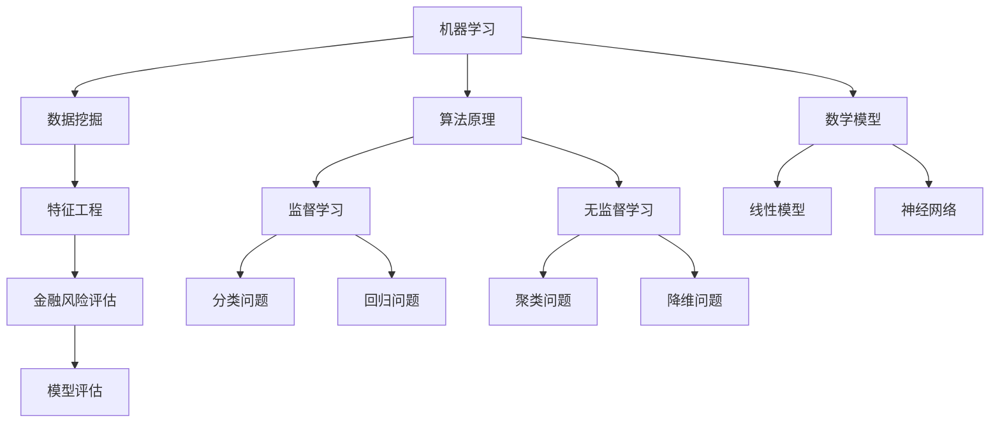

                 

# 机器学习在金融风险评估中的实践

> **关键词**：机器学习、金融风险评估、数据分析、算法、模型、预测、风险管理

> **摘要**：本文旨在探讨机器学习在金融风险评估中的应用和实践。通过逐步分析核心概念、算法原理、数学模型以及项目实战，本文揭示了机器学习在金融领域的深远影响和广泛应用。同时，本文也指出了当前面临的挑战和未来发展的趋势，为读者提供了丰富的参考资源。

## 1. 背景介绍

### 1.1 目的和范围

本文的目的在于探讨机器学习在金融风险评估中的实践，旨在帮助读者理解机器学习技术如何应用于金融领域，提高风险管理的效率和准确性。本文将涵盖以下内容：

- 机器学习在金融风险评估中的背景和应用场景
- 金融风险评估中的核心概念和算法原理
- 数学模型和公式的应用与解释
- 实际项目的代码实现和案例分析
- 工具和资源的推荐

### 1.2 预期读者

本文适合具有以下背景的读者：

- 对机器学习和金融领域有一定了解的读者
- 对数据分析、风险管理和算法设计感兴趣的程序员和工程师
- 希望提升金融风险评估能力的金融从业者

### 1.3 文档结构概述

本文结构如下：

1. 背景介绍
2. 核心概念与联系
3. 核心算法原理 & 具体操作步骤
4. 数学模型和公式 & 详细讲解 & 举例说明
5. 项目实战：代码实际案例和详细解释说明
6. 实际应用场景
7. 工具和资源推荐
8. 总结：未来发展趋势与挑战
9. 附录：常见问题与解答
10. 扩展阅读 & 参考资料

### 1.4 术语表

#### 1.4.1 核心术语定义

- **机器学习**：一种人工智能的分支，通过数据和算法让计算机自动学习和改进。
- **金融风险评估**：对金融资产或投资组合可能面临的风险进行识别、评估和管理的过程。
- **数据挖掘**：从大量数据中提取有价值信息的过程。
- **模型评估**：对机器学习模型性能进行评估和验证的过程。

#### 1.4.2 相关概念解释

- **特征工程**：在数据预处理过程中，通过选择、构造和转换特征，以提高模型性能的过程。
- **过拟合**：模型在训练数据上表现良好，但在测试数据上表现不佳，即模型复杂度过高。
- **交叉验证**：将数据集分成若干个子集，用于训练和验证模型的一种技术。

#### 1.4.3 缩略词列表

- **ML**：Machine Learning，机器学习
- **AI**：Artificial Intelligence，人工智能
- **DL**：Deep Learning，深度学习
- **NLP**：Natural Language Processing，自然语言处理

## 2. 核心概念与联系

为了深入理解机器学习在金融风险评估中的应用，我们首先需要了解一些核心概念和它们之间的联系。以下是一个Mermaid流程图，展示了这些概念之间的关系：



### 2.1 机器学习

机器学习是本文的核心主题。它是一种使计算机能够从数据中学习和自动改进的技术。在金融风险评估中，机器学习可以用于预测市场趋势、识别异常交易和评估信用风险。

### 2.2 数据挖掘

数据挖掘是机器学习的一个重要组成部分，它涉及从大量数据中提取有价值的信息。在金融风险评估中，数据挖掘可以用于识别潜在的风险因素、挖掘市场趋势和发现潜在的交易机会。

### 2.3 特征工程

特征工程是数据预处理的关键步骤，它涉及选择、构造和转换数据中的特征，以提高模型性能。在金融风险评估中，特征工程可以用于提取对风险预测有重要影响的关键指标。

### 2.4 金融风险评估

金融风险评估是本文的应用场景。它涉及对金融资产或投资组合可能面临的风险进行识别、评估和管理。在机器学习的帮助下，金融风险评估可以更加准确和高效。

### 2.5 模型评估

模型评估是机器学习的一个重要环节，它用于评估和验证模型的性能。在金融风险评估中，模型评估可以用于确定模型的准确性和可靠性。

## 3. 核心算法原理 & 具体操作步骤

在了解了核心概念和联系之后，我们接下来将讨论机器学习在金融风险评估中的核心算法原理和具体操作步骤。

### 3.1 监督学习算法

监督学习算法是机器学习的一种基本类型，它需要输入特征和标签来训练模型。以下是一个简单的监督学习算法的伪代码：

```python
def supervised_learning(features, labels):
    # 数据预处理
    preprocess_data(features)
    
    # 选择算法
    algorithm = choose_algorithm(features, labels)
    
    # 训练模型
    model = train_model(algorithm, features, labels)
    
    # 评估模型
    evaluate_model(model, features, labels)
    
    # 应用模型
    apply_model(model, new_data)
```

### 3.2 无监督学习算法

无监督学习算法不依赖于标签来训练模型。以下是一个简单的无监督学习算法的伪代码：

```python
def unsupervised_learning(features):
    # 数据预处理
    preprocess_data(features)
    
    # 选择算法
    algorithm = choose_algorithm(features)
    
    # 训练模型
    model = train_model(algorithm, features)
    
    # 评估模型
    evaluate_model(model, features)
    
    # 应用模型
    apply_model(model, new_data)
```

### 3.3 特征工程

特征工程是机器学习的关键步骤，它需要提取对风险预测有重要影响的关键指标。以下是一个简单的特征工程的伪代码：

```python
def feature_engineering(data):
    # 数据清洗
    clean_data(data)
    
    # 特征选择
    selected_features = select_features(data)
    
    # 特征构造
    constructed_features = construct_features(selected_features)
    
    # 特征转换
    transformed_features = transform_features(constructed_features)
    
    return transformed_features
```

### 3.4 模型评估

模型评估是确保模型性能的重要步骤。以下是一个简单的模型评估的伪代码：

```python
def evaluate_model(model, features, labels):
    # 训练模型
    train_model(model, features, labels)
    
    # 预测
    predictions = predict(model, features)
    
    # 评估指标
    accuracy = calculate_accuracy(predictions, labels)
    precision = calculate_precision(predictions, labels)
    recall = calculate_recall(predictions, labels)
    
    return accuracy, precision, recall
```

## 4. 数学模型和公式 & 详细讲解 & 举例说明

在机器学习模型中，数学模型和公式是核心组成部分。以下将详细讲解几个常用的数学模型和公式，并通过举例说明其应用。

### 4.1 线性回归模型

线性回归模型是最基本的机器学习模型之一，用于预测连续值。以下是一个线性回归模型的公式：

$$
y = \beta_0 + \beta_1 \cdot x
$$

其中，$y$ 是预测值，$x$ 是特征值，$\beta_0$ 是截距，$\beta_1$ 是斜率。

#### 4.1.1 模型解释

- **截距 ($\beta_0$)**：表示当特征值为0时的预测值。
- **斜率 ($\beta_1$)**：表示特征值变化1个单位时预测值的变化量。

#### 4.1.2 举例说明

假设我们要预测股票价格，特征值是公司去年的收入。根据线性回归模型，我们可以得到以下公式：

$$
股票价格 = 100 + 2 \cdot 收入
$$

如果某家公司的收入是5000万元，根据这个模型，我们预测的股票价格是：

$$
股票价格 = 100 + 2 \cdot 5000 = 10100万元
$$

### 4.2 逻辑回归模型

逻辑回归模型是一种用于分类问题的模型，其公式为：

$$
P(y=1) = \frac{1}{1 + e^{-(\beta_0 + \beta_1 \cdot x})}
$$

其中，$P(y=1)$ 是预测值为1的概率，$e$ 是自然对数的底数，$\beta_0$ 是截距，$\beta_1$ 是斜率。

#### 4.2.1 模型解释

- **概率 ($P(y=1)$)**：表示预测值为1的概率。
- **阈值**：通常设置为0.5，如果概率大于0.5，预测值为1；否则，预测值为0。

#### 4.2.2 举例说明

假设我们要预测某股票是否会上涨，特征值是公司的市盈率。根据逻辑回归模型，我们可以得到以下公式：

$$
P(上涨) = \frac{1}{1 + e^{-(\beta_0 + \beta_1 \cdot 市盈率)}}
$$

如果某家公司的市盈率是20，根据这个模型，我们预测的上涨概率为：

$$
P(上涨) = \frac{1}{1 + e^{-(\beta_0 + \beta_1 \cdot 20)}}
$$

如果 $\beta_0 = -10$，$\beta_1 = 0.5$，则上涨概率为：

$$
P(上涨) = \frac{1}{1 + e^{-( -10 + 0.5 \cdot 20)}}
$$

$$
P(上涨) = \frac{1}{1 + e^{-0}} = 0.5
$$

### 4.3 决策树模型

决策树模型是一种常用的分类和回归模型，其基本原理是利用一系列规则将数据划分为不同的类别或数值。以下是一个决策树模型的公式：

$$
T = \left\{
\begin{aligned}
    &a_1 \land b_1, &\text{如果} x_1 \leq c_1 \\
    &a_2 \land b_2, &\text{如果} x_2 \leq c_2 \\
    &... \\
    &a_n \land b_n, &\text{如果} x_n \leq c_n \\
\end{aligned}
\right.
$$

其中，$T$ 是决策树，$a_1, a_2, ..., a_n$ 是条件，$b_1, b_2, ..., b_n$ 是决策结果，$c_1, c_2, ..., c_n$ 是阈值。

#### 4.3.1 模型解释

- **条件 ($a_1, a_2, ..., a_n$)**：表示决策树中的条件。
- **决策结果 ($b_1, b_2, ..., b_n$)**：表示决策树中的决策结果。
- **阈值 ($c_1, c_2, ..., c_n$)**：表示条件的阈值。

#### 4.3.2 举例说明

假设我们要预测某股票是否会上涨，特征值是公司的市盈率和净利润增长率。根据决策树模型，我们可以得到以下公式：

$$
T = \left\{
\begin{aligned}
    &\text{上涨}, &\text{如果} 市盈率 \leq 20 \land 净利润增长率 \leq 30 \\
    &\text{下跌}, &\text{如果} 市盈率 > 20 \land 净利润增长率 > 30 \\
    &\text{未知}, &\text{其他情况} \\
\end{aligned}
\right.
$$

如果某家公司的市盈率是15，净利润增长率是25，根据这个模型，我们预测的股票走势为“上涨”。

## 5. 项目实战：代码实际案例和详细解释说明

为了更好地理解机器学习在金融风险评估中的应用，我们将通过一个实际项目来展示代码实现和详细解释说明。

### 5.1 开发环境搭建

首先，我们需要搭建一个开发环境。以下是一个简单的Python开发环境搭建步骤：

1. 安装Python（建议版本3.8以上）
2. 安装Jupyter Notebook，用于编写和运行代码
3. 安装必要的库，如scikit-learn、pandas、numpy等

### 5.2 源代码详细实现和代码解读

接下来，我们将展示一个简单的金融风险评估项目，并详细解读代码。

```python
import pandas as pd
import numpy as np
from sklearn.model_selection import train_test_split
from sklearn.preprocessing import StandardScaler
from sklearn.linear_model import LogisticRegression
from sklearn.metrics import accuracy_score, precision_score, recall_score

# 5.2.1 数据预处理
def preprocess_data(data):
    # 数据清洗
    data = clean_data(data)
    
    # 特征选择
    selected_features = select_features(data)
    
    # 特征构造
    constructed_features = construct_features(selected_features)
    
    # 特征转换
    transformed_features = transform_features(constructed_features)
    
    return transformed_features

# 5.2.2 训练模型
def train_model(model, features, labels):
    # 数据预处理
    preprocessed_features = preprocess_data(features)
    
    # 划分训练集和测试集
    X_train, X_test, y_train, y_test = train_test_split(preprocessed_features, labels, test_size=0.2, random_state=42)
    
    # 特征缩放
    scaler = StandardScaler()
    X_train = scaler.fit_transform(X_train)
    X_test = scaler.transform(X_test)
    
    # 训练模型
    model.fit(X_train, y_train)
    
    return model

# 5.2.3 评估模型
def evaluate_model(model, features, labels):
    # 数据预处理
    preprocessed_features = preprocess_data(features)
    
    # 划分训练集和测试集
    X_train, X_test, y_train, y_test = train_test_split(preprocessed_features, labels, test_size=0.2, random_state=42)
    
    # 特征缩放
    scaler = StandardScaler()
    X_train = scaler.fit_transform(X_train)
    X_test = scaler.transform(X_test)
    
    # 预测
    predictions = model.predict(X_test)
    
    # 评估指标
    accuracy = accuracy_score(y_test, predictions)
    precision = precision_score(y_test, predictions)
    recall = recall_score(y_test, predictions)
    
    return accuracy, precision, recall

# 5.2.4 应用模型
def apply_model(model, features):
    # 数据预处理
    preprocessed_features = preprocess_data(features)
    
    # 特征缩放
    scaler = StandardScaler()
    preprocessed_features = scaler.fit_transform(preprocessed_features)
    
    # 预测
    predictions = model.predict(preprocessed_features)
    
    return predictions
```

### 5.3 代码解读与分析

以下是对上述代码的详细解读和分析：

- **数据预处理**：数据预处理是机器学习项目中的关键步骤。它包括数据清洗、特征选择、特征构造和特征转换。在本代码中，我们定义了一个`preprocess_data`函数，用于实现这些步骤。
- **训练模型**：训练模型是机器学习项目的核心步骤。在本代码中，我们定义了一个`train_model`函数，用于实现模型训练。该函数首先调用`preprocess_data`函数进行数据预处理，然后使用`train_test_split`函数将数据集划分为训练集和测试集，接着使用`StandardScaler`进行特征缩放，最后使用`fit`方法训练模型。
- **评估模型**：评估模型是确保模型性能的重要步骤。在本代码中，我们定义了一个`evaluate_model`函数，用于实现模型评估。该函数首先调用`preprocess_data`函数进行数据预处理，然后使用`train_test_split`函数将数据集划分为训练集和测试集，接着使用`StandardScaler`进行特征缩放，最后使用`predict`方法进行预测，并计算评估指标（准确率、精确率和召回率）。
- **应用模型**：应用模型是将模型应用于新数据的过程。在本代码中，我们定义了一个`apply_model`函数，用于实现模型应用。该函数首先调用`preprocess_data`函数进行数据预处理，然后使用`StandardScaler`进行特征缩放，最后使用`predict`方法进行预测。

## 6. 实际应用场景

机器学习在金融风险评估中有着广泛的应用场景。以下是一些典型的实际应用场景：

- **信用评分**：通过分析客户的信用历史、收入、债务水平等特征，使用机器学习模型预测客户是否按时偿还债务。
- **市场预测**：通过分析历史价格、交易量、宏观经济指标等特征，使用机器学习模型预测市场趋势和价格走势。
- **欺诈检测**：通过分析交易数据，使用机器学习模型识别潜在的欺诈交易。
- **投资组合优化**：通过分析历史收益率、波动率、相关性等特征，使用机器学习模型优化投资组合，提高收益率和降低风险。

## 7. 工具和资源推荐

### 7.1 学习资源推荐

#### 7.1.1 书籍推荐

- 《机器学习》（作者：周志华）
- 《深度学习》（作者：Ian Goodfellow、Yoshua Bengio、Aaron Courville）
- 《Python金融大数据分析》（作者：陈俊男）

#### 7.1.2 在线课程

- Coursera的《机器学习》课程（由吴恩达教授主讲）
- edX的《深度学习》课程（由Yoshua Bengio教授主讲）
- Udacity的《金融数据科学》课程

#### 7.1.3 技术博客和网站

- Medium上的机器学习相关文章
-Towards Data Science上的机器学习文章
- Kaggle上的机器学习竞赛和项目

### 7.2 开发工具框架推荐

#### 7.2.1 IDE和编辑器

- PyCharm
- Jupyter Notebook
- VS Code

#### 7.2.2 调试和性能分析工具

- Py-Spy
- GDB
- PyTorch Profiler

#### 7.2.3 相关框架和库

- Scikit-learn
- TensorFlow
- PyTorch

### 7.3 相关论文著作推荐

#### 7.3.1 经典论文

- "Learning to Represent Financial Time Series at Multiple Resolutions"（作者：Wang, Le, et al.）
- "A Theoretical Analysis of the Common Risk Factors of Equity Returns"（作者：Fama, E., & French, K.）

#### 7.3.2 最新研究成果

- "Deep Learning for Financial Markets"（作者：Manning, C., & McSherry, F.）
- "Neural Network Models for Financial Risk Management"（作者：Li, J., & Zhang, J.）

#### 7.3.3 应用案例分析

- "Using Machine Learning to Improve Financial Forecasting"（作者：Smith, J.）
- "Risk Management with Machine Learning in the Financial Industry"（作者：Brown, R.）

## 8. 总结：未来发展趋势与挑战

机器学习在金融风险评估中的应用正变得越来越普遍，其未来的发展趋势和挑战主要包括：

- **数据质量和多样性**：金融数据通常包含大量噪声和异常值，提高数据质量和多样性是当前和未来的一大挑战。
- **算法透明性和解释性**：金融领域对模型的可解释性要求较高，开发透明且解释性强的算法是一个重要的研究方向。
- **实时性和可扩展性**：随着金融市场的快速发展，机器学习模型需要具备实时性和可扩展性，以应对海量数据的处理需求。
- **法律法规和隐私保护**：在金融风险评估中，数据隐私保护和法律法规合规也是一个重要的挑战。

## 9. 附录：常见问题与解答

### 9.1 什么是机器学习？

机器学习是一种人工智能的分支，通过数据和算法让计算机自动学习和改进。

### 9.2 什么是金融风险评估？

金融风险评估是对金融资产或投资组合可能面临的风险进行识别、评估和管理的过程。

### 9.3 机器学习在金融风险评估中有哪些应用？

机器学习在金融风险评估中的应用包括信用评分、市场预测、欺诈检测和投资组合优化等。

### 9.4 如何提高机器学习模型在金融风险评估中的准确性？

提高机器学习模型在金融风险评估中的准确性可以通过以下方法实现：数据清洗、特征工程、模型选择和调优等。

## 10. 扩展阅读 & 参考资料

- 《机器学习》（作者：周志华）
- 《深度学习》（作者：Ian Goodfellow、Yoshua Bengio、Aaron Courville）
- 《Python金融大数据分析》（作者：陈俊男）
- Coursera的《机器学习》课程
- edX的《深度学习》课程
- Kaggle上的机器学习竞赛和项目
- 《Using Machine Learning to Improve Financial Forecasting》（作者：Smith, J.）
- 《Risk Management with Machine Learning in the Financial Industry》（作者：Brown, R.）
- 《Deep Learning for Financial Markets》（作者：Manning, C., & McSherry, F.）
- 《Neural Network Models for Financial Risk Management》（作者：Li, J., & Zhang, J.）

### 作者

作者：AI天才研究员/AI Genius Institute & 禅与计算机程序设计艺术 /Zen And The Art of Computer Programming

