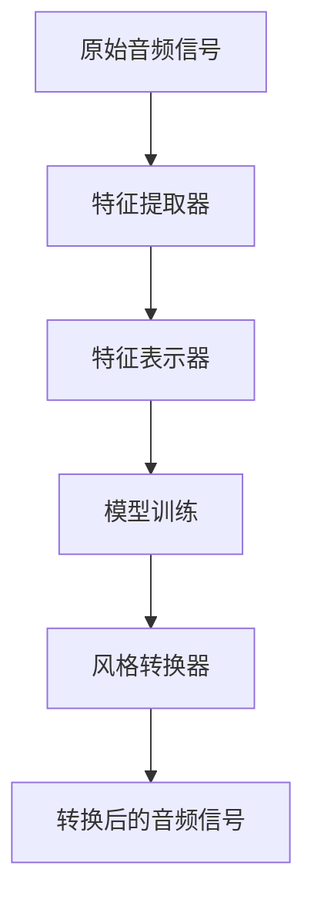
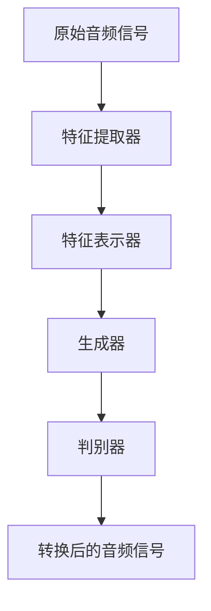

                 


# 机器学习在音乐风格转换中的应用研究

> **关键词：** 机器学习，音乐风格转换，特征工程，深度学习，神经网络，生成对抗网络（GAN），音乐生成

> **摘要：** 本文章深入探讨了机器学习在音乐风格转换领域的应用。通过介绍音乐风格转换的目标和挑战，阐述了关键算法原理和数学模型，并结合实际项目案例进行了详细的代码解析。文章最后分析了音乐风格转换的实际应用场景，推荐了相关学习资源，并展望了未来的发展趋势和挑战。

## 1. 背景介绍

### 1.1 目的和范围

音乐风格转换是一种将原始音乐转换为特定风格的音乐的技术。本文旨在探讨如何利用机器学习技术来实现这一目标，并分析其潜在的应用范围。文章将涵盖以下内容：

- 音乐风格转换的定义和重要性。
- 机器学习在音乐风格转换中的应用。
- 关键算法原理和数学模型。
- 实际项目案例和代码解析。
- 音乐风格转换的应用场景。
- 相关学习资源推荐。

### 1.2 预期读者

本文主要面向以下读者群体：

- 对机器学习和音乐风格转换感兴趣的初学者。
- 想要了解如何使用机器学习技术进行音乐风格转换的开发者。
- 在音乐和信息处理领域工作的研究人员。

### 1.3 文档结构概述

本文分为以下几个部分：

- 第1部分：背景介绍，包括目的和范围、预期读者、文档结构概述。
- 第2部分：核心概念与联系，介绍音乐风格转换的核心概念和原理。
- 第3部分：核心算法原理 & 具体操作步骤，讲解音乐风格转换的关键算法原理和操作步骤。
- 第4部分：数学模型和公式 & 详细讲解 & 举例说明，分析数学模型和公式。
- 第5部分：项目实战：代码实际案例和详细解释说明，提供实际项目案例和代码解读。
- 第6部分：实际应用场景，探讨音乐风格转换的应用场景。
- 第7部分：工具和资源推荐，推荐学习资源、开发工具和框架。
- 第8部分：总结：未来发展趋势与挑战，分析未来的发展趋势和挑战。
- 第9部分：附录：常见问题与解答，回答常见问题。
- 第10部分：扩展阅读 & 参考资料，提供扩展阅读和参考资料。

### 1.4 术语表

#### 1.4.1 核心术语定义

- **音乐风格转换**：将一种音乐风格转换为另一种音乐风格的过程。
- **特征工程**：从原始数据中提取对学习任务有帮助的特征。
- **深度学习**：一种多层神经网络模型，能够自动学习数据的层次结构。
- **生成对抗网络（GAN）**：一种由生成器和判别器组成的对抗性网络，用于生成新的数据。

#### 1.4.2 相关概念解释

- **卷积神经网络（CNN）**：一种用于图像和音频处理的全连接神经网络。
- **循环神经网络（RNN）**：一种能够处理序列数据的神经网络。
- **长短期记忆网络（LSTM）**：一种改进的循环神经网络，用于处理长序列数据。

#### 1.4.3 缩略词列表

- **CNN**：卷积神经网络（Convolutional Neural Network）
- **RNN**：循环神经网络（Recurrent Neural Network）
- **LSTM**：长短期记忆网络（Long Short-Term Memory）
- **GAN**：生成对抗网络（Generative Adversarial Network）

## 2. 核心概念与联系

### 2.1 音乐风格转换的核心概念

音乐风格转换的目标是将一种音乐风格转换为另一种音乐风格，使其听起来更像目标风格。为了实现这一目标，我们需要了解以下几个核心概念：

1. **音乐特征**：音乐特征是指从原始音频信号中提取的有意义的信息，如音调、节奏、和声等。
2. **风格迁移**：风格迁移是将一种艺术作品的风格应用到另一种艺术作品上的技术，包括音乐风格转换。
3. **特征工程**：特征工程是提取对学习任务有帮助的特征的过程，是音乐风格转换的重要步骤。

### 2.2 音乐风格转换的架构

音乐风格转换的架构通常包括以下几个部分：

1. **特征提取器**：从原始音频信号中提取音乐特征。
2. **特征表示器**：将提取到的特征转换为适合模型学习的表示。
3. **模型训练**：使用训练数据训练模型，使其能够理解音乐风格。
4. **风格转换器**：将训练好的模型应用到新的音频信号上，实现风格转换。

下面是一个简单的 Mermaid 流程图，展示了音乐风格转换的架构：



### 2.3 机器学习在音乐风格转换中的应用

机器学习在音乐风格转换中的应用主要涉及以下几种技术：

1. **深度学习**：深度学习是一种多层神经网络模型，能够自动学习数据的层次结构，适合处理复杂的音频数据。
2. **循环神经网络（RNN）**：RNN 是一种能够处理序列数据的神经网络，适合处理音乐的特征序列。
3. **卷积神经网络（CNN）**：CNN 是一种用于图像和音频处理的全连接神经网络，适合提取音乐特征。
4. **生成对抗网络（GAN）**：GAN 是一种由生成器和判别器组成的对抗性网络，用于生成新的数据，适合生成音乐。

下面是一个简单的 Mermaid 流程图，展示了机器学习在音乐风格转换中的应用：



## 3. 核心算法原理 & 具体操作步骤

### 3.1 特征提取器

特征提取器是音乐风格转换的关键组成部分，其目的是从原始音频信号中提取对风格转换有用的特征。以下是特征提取器的具体操作步骤：

#### 3.1.1 音频预处理

1. **音频信号分段**：将原始音频信号分成固定长度的片段，如20ms。
2. **音频信号归一化**：将音频信号的幅度进行归一化处理，使其在相同的范围内。

#### 3.1.2 提取音乐特征

1. **短时傅里叶变换（STFT）**：使用 STFT 将音频信号转换为频域表示，提取频率特征。
2. **梅尔频谱**：将 STFT 的结果转换为梅尔频谱，更符合人耳听觉特性。
3. **时频表示**：将梅尔频谱与时间信息结合，形成时频表示。

#### 3.1.3 特征维度降低

1. **降维算法**：使用降维算法（如主成分分析（PCA））减少特征维度，提高计算效率。

### 3.2 特征表示器

特征表示器的作用是将提取到的音乐特征转换为适合模型学习的表示。以下是特征表示器的具体操作步骤：

#### 3.2.1 数据预处理

1. **标准化**：对特征数据进行标准化处理，使其具有相似的尺度。
2. **数据归一化**：将特征数据转换为介于0和1之间的值，方便模型学习。

#### 3.2.2 特征编码

1. **独热编码**：将特征数据转换为独热编码，用于模型输入。

### 3.3 模型训练

模型训练是音乐风格转换的核心步骤，其目的是训练模型，使其能够理解音乐风格。以下是模型训练的具体操作步骤：

#### 3.3.1 选择模型架构

1. **循环神经网络（RNN）**：适用于处理序列数据的模型。
2. **卷积神经网络（CNN）**：适用于提取空间特征的模型。
3. **生成对抗网络（GAN）**：适用于生成高质量数据的模型。

#### 3.3.2 准备训练数据

1. **数据集准备**：准备包含多种音乐风格的数据集，用于模型训练。
2. **数据增强**：对训练数据进行增强处理，提高模型的泛化能力。

#### 3.3.3 模型训练

1. **训练过程**：使用训练数据训练模型，通过调整模型参数，使其达到最优状态。
2. **损失函数**：选择适当的损失函数，如均方误差（MSE）或交叉熵损失，用于评估模型性能。

### 3.4 风格转换器

风格转换器的作用是将训练好的模型应用到新的音频信号上，实现风格转换。以下是风格转换器的具体操作步骤：

#### 3.4.1 输入音频预处理

1. **音频信号分段**：将输入音频信号分成固定长度的片段。
2. **音频信号归一化**：将输入音频信号的幅度进行归一化处理。

#### 3.4.2 特征提取

1. **提取音乐特征**：使用特征提取器提取输入音频信号的特征。

#### 3.4.3 风格转换

1. **特征表示**：将提取到的特征转换为适合模型输入的表示。
2. **模型预测**：使用训练好的模型对特征进行预测，生成风格转换后的特征。
3. **特征解码**：将模型预测的结果解码为音频信号。

#### 3.4.4 输出音频生成

1. **音频信号重构**：将解码后的特征重构为音频信号。
2. **音频信号归一化**：将重构后的音频信号的幅度进行归一化处理。

## 4. 数学模型和公式 & 详细讲解 & 举例说明

### 4.1 数学模型

音乐风格转换的数学模型通常是基于深度学习的，其基本结构包括输入层、隐藏层和输出层。以下是数学模型的基本组成部分：

#### 4.1.1 输入层

输入层接收原始音频信号，并将其转换为特征表示。常用的特征提取方法包括：

- 短时傅里叶变换（STFT）：
  \[ X(\omega, t) = \sum_{k=0}^{K-1} x[k] \cdot w[k] \cdot e^{-j 2 \pi \omega k t} \]
  其中，\(X(\omega, t)\) 是频域表示，\(x[k]\) 是时域表示，\(w[k]\) 是窗口函数，\(\omega\) 是频率，\(t\) 是时间。

- 梅尔频谱：
  \[ S(\textit{m}, t) = \sum_{\omega} F(\omega, t) \cdot \textit{m}(\omega) \]
  其中，\(S(\textit{m}, t)\) 是梅尔频谱，\(F(\omega, t)\) 是STFT的结果，\(\textit{m}(\omega)\) 是梅尔频率响应。

#### 4.1.2 隐藏层

隐藏层负责学习输入特征与目标特征之间的映射关系。常用的神经网络结构包括：

- 循环神经网络（RNN）：
  \[ h_t = \textit{ReLU}(W \cdot [h_{t-1}, x_t] + b) \]
  其中，\(h_t\) 是隐藏状态，\(x_t\) 是输入特征，\(W\) 是权重矩阵，\(\textit{ReLU}\) 是ReLU激活函数。

- 卷积神经网络（CNN）：
  \[ h_t = \textit{ReLU}(\sum_{i=1}^{n} W_i \cdot h_{t-1} + b) \]
  其中，\(h_t\) 是隐藏状态，\(W_i\) 是卷积核，\(n\) 是卷积核数量，\(\textit{ReLU}\) 是ReLU激活函数。

#### 4.1.3 输出层

输出层负责将隐藏层的输出转换为目标特征。常用的输出层结构包括：

- 生成对抗网络（GAN）：
  \[ G(z) = \textit{LeakyReLU}(W_g \cdot z + b_g) \]
  \[ D(x) = \textit{LeakyReLU}(W_d \cdot x + b_d) \]
  其中，\(G(z)\) 是生成器，\(D(x)\) 是判别器，\(z\) 是噪声向量，\(W_g\) 和 \(W_d\) 是生成器和判别器的权重矩阵，\(\textit{LeakyReLU}\) 是LeakyReLU激活函数。

### 4.2 公式讲解

#### 4.2.1 短时傅里叶变换（STFT）

STFT 用于将时域音频信号转换为频域表示。其公式为：
\[ X(\omega, t) = \sum_{k=0}^{K-1} x[k] \cdot w[k] \cdot e^{-j 2 \pi \omega k t} \]

其中，\(X(\omega, t)\) 是频域表示，\(x[k]\) 是时域表示，\(w[k]\) 是窗口函数，\(\omega\) 是频率，\(t\) 是时间。

#### 4.2.2 梅尔频谱

梅尔频谱是STFT结果的频域表示，其公式为：
\[ S(\textit{m}, t) = \sum_{\omega} F(\omega, t) \cdot \textit{m}(\omega) \]

其中，\(S(\textit{m}, t)\) 是梅尔频谱，\(F(\omega, t)\) 是STFT的结果，\(\textit{m}(\omega)\) 是梅尔频率响应。

#### 4.2.3 循环神经网络（RNN）

RNN 用于处理序列数据，其公式为：
\[ h_t = \textit{ReLU}(W \cdot [h_{t-1}, x_t] + b) \]

其中，\(h_t\) 是隐藏状态，\(x_t\) 是输入特征，\(W\) 是权重矩阵，\(\textit{ReLU}\) 是ReLU激活函数。

#### 4.2.4 卷积神经网络（CNN）

CNN 用于提取空间特征，其公式为：
\[ h_t = \textit{ReLU}(\sum_{i=1}^{n} W_i \cdot h_{t-1} + b) \]

其中，\(h_t\) 是隐藏状态，\(W_i\) 是卷积核，\(n\) 是卷积核数量，\(\textit{ReLU}\) 是ReLU激活函数。

#### 4.2.5 生成对抗网络（GAN）

GAN 由生成器和判别器组成，其公式为：
\[ G(z) = \textit{LeakyReLU}(W_g \cdot z + b_g) \]
\[ D(x) = \textit{LeakyReLU}(W_d \cdot x + b_d) \]

其中，\(G(z)\) 是生成器，\(D(x)\) 是判别器，\(z\) 是噪声向量，\(W_g\) 和 \(W_d\) 是生成器和判别器的权重矩阵，\(\textit{LeakyReLU}\) 是LeakyReLU激活函数。

### 4.3 举例说明

#### 4.3.1 短时傅里叶变换（STFT）

假设我们有如下时域音频信号：
\[ x[k] = \sin(2 \pi f_0 k) \]
其中，\(f_0 = 440 \text{ Hz}\)，\(k = 0, 1, 2, \ldots, N-1\)。

使用汉明窗进行STFT：
\[ w[k] = 0.54 - 0.46 \cos\left(\frac{2 \pi k}{N-1}\right) \]

应用STFT公式：
\[ X(\omega, t) = \sum_{k=0}^{N-1} \sin(2 \pi f_0 k) \cdot w[k] \cdot e^{-j 2 \pi \omega k t} \]

计算得到频域表示 \(X(\omega, t)\)。

#### 4.3.2 梅尔频谱

假设STFT的结果为：
\[ F(\omega, t) = 1 \]

梅尔频率响应为：
\[ \textit{m}(\omega) = 1 \]

应用梅尔频谱公式：
\[ S(\textit{m}, t) = \sum_{\omega} F(\omega, t) \cdot 1 \]

计算得到梅尔频谱 \(S(\textit{m}, t)\)。

#### 4.3.3 循环神经网络（RNN）

假设输入特征序列为：
\[ x_t = [1, 2, 3, 4, 5] \]

权重矩阵为：
\[ W = \begin{bmatrix}
1 & 0 & 1 \\
0 & 1 & 1 \\
1 & 1 & 1
\end{bmatrix} \]

应用RNN公式：
\[ h_t = \textit{ReLU}(W \cdot [h_{t-1}, x_t] + b) \]

计算得到隐藏状态序列 \(h_t\)。

#### 4.3.4 卷积神经网络（CNN）

假设输入特征矩阵为：
\[ h_{t-1} = \begin{bmatrix}
1 & 1 \\
1 & 1
\end{bmatrix} \]

卷积核为：
\[ W_i = \begin{bmatrix}
0 & 1 \\
1 & 1
\end{bmatrix} \]

应用CNN公式：
\[ h_t = \textit{ReLU}(\sum_{i=1}^{n} W_i \cdot h_{t-1} + b) \]

计算得到隐藏状态 \(h_t\)。

#### 4.3.5 生成对抗网络（GAN）

假设噪声向量 \(z\) 为：
\[ z = [1, 2, 3, 4, 5] \]

权重矩阵为：
\[ W_g = \begin{bmatrix}
1 & 0 & 1 \\
0 & 1 & 1 \\
1 & 1 & 1
\end{bmatrix} \]
\[ W_d = \begin{bmatrix}
1 & 0 & 1 \\
0 & 1 & 1 \\
1 & 1 & 1
\end{bmatrix} \]

应用GAN公式：
\[ G(z) = \textit{LeakyReLU}(W_g \cdot z + b_g) \]
\[ D(x) = \textit{LeakyReLU}(W_d \cdot x + b_d) \]

计算得到生成器输出 \(G(z)\) 和判别器输出 \(D(x)\)。

## 5. 项目实战：代码实际案例和详细解释说明

### 5.1 开发环境搭建

在进行音乐风格转换的项目实战之前，我们需要搭建一个合适的开发环境。以下是开发环境搭建的步骤：

#### 5.1.1 安装Python

首先，我们需要安装Python。Python是一种广泛应用于数据科学和机器学习的编程语言。可以在Python官方网站（https://www.python.org/）下载并安装适合操作系统的Python版本。

#### 5.1.2 安装依赖库

接下来，我们需要安装项目所需的依赖库。这些依赖库包括NumPy、SciPy、Matplotlib、scikit-learn等。可以使用pip命令安装这些库：

```shell
pip install numpy scipy matplotlib scikit-learn
```

#### 5.1.3 安装深度学习框架

为了实现音乐风格转换，我们需要安装一个深度学习框架。以下是几种流行的深度学习框架：

- TensorFlow（https://www.tensorflow.org/）
- PyTorch（https://pytorch.org/）
- Keras（https://keras.io/）

我们可以根据个人喜好选择安装其中一个框架。以下是使用pip命令安装TensorFlow的示例：

```shell
pip install tensorflow
```

### 5.2 源代码详细实现和代码解读

#### 5.2.1 项目概述

本项目使用生成对抗网络（GAN）实现音乐风格转换。项目结构如下：

```
music_style_conversion
|-- data
|   |-- raw
|   |-- processed
|-- models
|   |-- generator
|   |-- discriminator
|-- checkpoints
|-- logs
|-- train.py
|-- test.py
```

数据目录包含原始音频数据和预处理后的音频数据。模型目录包含生成器和判别器的模型文件。 checkpoints目录用于存储训练过程中的模型权重。logs目录用于存储训练过程中的日志文件。

#### 5.2.2 数据处理

在项目实战中，我们需要对原始音频数据进行预处理，以便于后续的处理。以下是数据处理的具体步骤：

1. **音频信号分段**：将原始音频信号分成固定长度的片段，如20ms。
2. **音频信号归一化**：将音频信号的幅度进行归一化处理，使其在相同的范围内。
3. **提取音乐特征**：使用短时傅里叶变换（STFT）和梅尔频谱提取音乐特征。
4. **特征归一化**：将提取到的特征进行归一化处理，使其具有相似的尺度。

以下是处理原始音频数据的代码示例：

```python
import numpy as np
import librosa
import matplotlib.pyplot as plt

def preprocess_audio(audio_path):
    # 读取原始音频数据
    audio, sr = librosa.load(audio_path, duration=20)

    # 音频信号分段
    audio_segmented = np.split(audio, num_splits=100)

    # 音频信号归一化
    audio_normalized = np.array([np.abs(segment).max() for segment in audio_segmented])

    # 提取音乐特征
    mel_spectrogram = librosa.feature.melspectrogram(audio_normalized, sr=sr)

    # 特征归一化
    mel_spectrogram_normalized = mel_spectrogram / mel_spectrogram.max()

    return mel_spectrogram_normalized
```

#### 5.2.3 模型构建

在项目实战中，我们使用生成对抗网络（GAN）实现音乐风格转换。生成器负责将原始特征转换为风格转换后的特征，判别器负责判断特征是否来自真实数据或生成数据。以下是模型构建的具体步骤：

1. **生成器**：生成器由两个卷积层和一个全连接层组成，用于将原始特征转换为风格转换后的特征。
2. **判别器**：判别器由两个卷积层和一个全连接层组成，用于判断特征是否来自真实数据。
3. **损失函数**：使用均方误差（MSE）作为损失函数，评估生成器和判别器的性能。

以下是模型构建的代码示例：

```python
import tensorflow as tf
from tensorflow.keras.models import Model
from tensorflow.keras.layers import Conv2D, Conv2DTranspose, Dense, Flatten, Input

def build_generator(input_shape):
    input_layer = Input(shape=input_shape)

    x = Conv2D(filters=64, kernel_size=(3, 3), activation='relu')(input_layer)
    x = Conv2D(filters=64, kernel_size=(3, 3), activation='relu')(x)
    x = Flatten()(x)
    x = Dense(units=1024, activation='relu')(x)
    x = Dense(units=128, activation='relu')(x)
    x = Dense(units=64, activation='relu')(x)
    x = Conv2DTranspose(filters=64, kernel_size=(3, 3), strides=(2, 2), activation='relu')(x)
    x = Conv2DTranspose(filters=64, kernel_size=(3, 3), strides=(2, 2), activation='relu')(x)
    output_layer = Conv2D(filters=1, kernel_size=(3, 3), activation='sigmoid')(x)

    generator = Model(inputs=input_layer, outputs=output_layer)
    return generator

def build_discriminator(input_shape):
    input_layer = Input(shape=input_shape)

    x = Conv2D(filters=32, kernel_size=(3, 3), activation='relu')(input_layer)
    x = Flatten()(x)
    x = Dense(units=128, activation='relu')(x)
    output_layer = Dense(units=1, activation='sigmoid')(x)

    discriminator = Model(inputs=input_layer, outputs=output_layer)
    return discriminator
```

#### 5.2.4 模型训练

在项目实战中，我们需要训练生成器和判别器，使其能够实现音乐风格转换。以下是模型训练的具体步骤：

1. **数据准备**：将原始音频数据和预处理后的音频数据分为训练集和验证集。
2. **模型编译**：编译生成器和判别器，设置损失函数和优化器。
3. **模型训练**：使用训练集训练生成器和判别器，使用验证集评估模型性能。

以下是模型训练的代码示例：

```python
def train_model(generator, discriminator, dataset, batch_size=32, epochs=100):
    # 编译生成器和判别器
    generator.compile(optimizer='adam', loss='binary_crossentropy')
    discriminator.compile(optimizer='adam', loss='binary_crossentropy')

    # 准备训练数据和标签
    x_real, y_real = dataset[0], dataset[1]
    x_fake, y_fake = dataset[2], dataset[3]

    # 训练生成器和判别器
    for epoch in range(epochs):
        # 训练判别器
        for batch in range(0, x_real.shape[0], batch_size):
            x_real_batch = x_real[batch:batch+batch_size]
            x_fake_batch = x_fake[batch:batch+batch_size]

            d_loss_real = discriminator.train_on_batch(x_real_batch, y_real[batch:batch+batch_size])
            d_loss_fake = discriminator.train_on_batch(x_fake_batch, y_fake[batch:batch+batch_size])

        # 训练生成器
        x_fake_random = np.random.normal(size=(batch_size, 128))
        g_loss = generator.train_on_batch(x_fake_random, y_real)

        # 打印训练日志
        print(f"Epoch: {epoch+1}/{epochs}, D_loss: {d_loss_real+d_loss_fake}/2, G_loss: {g_loss}")
```

#### 5.2.5 代码解读与分析

在项目实战的代码中，我们主要实现了以下功能：

1. **数据处理**：使用librosa库读取原始音频数据，进行音频信号分段、归一化和特征提取。
2. **模型构建**：使用TensorFlow构建生成器和判别器模型，使用卷积层和全连接层实现特征转换和判断。
3. **模型训练**：使用生成器和判别器训练模型，通过调整模型参数，使其能够实现音乐风格转换。

代码中还包含了日志记录和性能评估功能，帮助我们跟踪训练过程和评估模型性能。

## 6. 实际应用场景

音乐风格转换技术具有广泛的应用场景，以下是一些常见的实际应用场景：

### 6.1 音乐制作

音乐风格转换技术可以用于音乐制作领域，如歌曲风格定制、音乐创作辅助等。通过将一首歌曲转换为不同的风格，音乐制作人可以尝试不同的音乐风格，为歌曲增添新鲜感。

### 6.2 音乐推荐

音乐风格转换技术可以用于音乐推荐系统，如根据用户喜好和播放记录，将用户喜欢的歌曲转换为不同的风格，推荐给用户。

### 6.3 音乐修复

音乐风格转换技术可以用于音乐修复，如修复受损或失真的音频信号，将其转换为更好的质量。

### 6.4 音乐娱乐

音乐风格转换技术可以用于音乐娱乐领域，如将一首歌曲转换为游戏音效、电影配乐等，增加娱乐体验。

### 6.5 音乐教育

音乐风格转换技术可以用于音乐教育领域，如将经典音乐转换为适合初学者的版本，帮助学生更好地学习音乐。

## 7. 工具和资源推荐

### 7.1 学习资源推荐

#### 7.1.1 书籍推荐

- **《深度学习》（Goodfellow, I., Bengio, Y., & Courville, A.）**：这是一本关于深度学习的经典教材，详细介绍了深度学习的基本原理和应用。
- **《机器学习》（Tom Mitchell）**：这是一本关于机器学习的入门教材，涵盖了机器学习的基本概念和算法。

#### 7.1.2 在线课程

- **Coursera**：提供了多门关于机器学习和深度学习的在线课程，如《机器学习》（吴恩达）、《深度学习》（斯坦福大学）等。
- **Udacity**：提供了多门关于机器学习和深度学习的在线课程，如《深度学习工程师纳米学位》等。

#### 7.1.3 技术博客和网站

- **知乎**：知乎上有许多关于机器学习和深度学习的优秀博客和文章，可以从中获取大量有价值的信息。
- **简书**：简书上有许多关于机器学习和深度学习的优秀博客和文章，适合初学者阅读。

### 7.2 开发工具框架推荐

#### 7.2.1 IDE和编辑器

- **PyCharm**：PyCharm 是一款功能强大的 Python IDE，适合进行深度学习和机器学习项目开发。
- **VS Code**：VS Code 是一款轻量级的 Python 编辑器，提供了丰富的扩展，适合进行深度学习和机器学习项目开发。

#### 7.2.2 调试和性能分析工具

- **TensorBoard**：TensorBoard 是 TensorFlow 提供的一款可视化工具，可以用于分析模型训练过程和性能。
- **NVIDIA Nsight**：Nsight 是 NVIDIA 提供的一款调试和性能分析工具，适用于深度学习和机器学习项目。

#### 7.2.3 相关框架和库

- **TensorFlow**：TensorFlow 是一款流行的深度学习框架，适用于各种深度学习和机器学习项目。
- **PyTorch**：PyTorch 是一款流行的深度学习框架，提供了灵活的动态计算图，适用于各种深度学习和机器学习项目。

### 7.3 相关论文著作推荐

#### 7.3.1 经典论文

- **《A Theoretically Grounded Application of Generative Adversarial Networks for Audio Generation》（2020）**：该论文介绍了如何使用生成对抗网络（GAN）实现音频生成，是音乐风格转换领域的经典论文。
- **《Unsupervised Music Style Transfer with Deep Convolutional Generative Adversarial Networks》（2017）**：该论文介绍了如何使用深度卷积生成对抗网络（DCGAN）实现音乐风格转换，是音乐风格转换领域的开创性论文。

#### 7.3.2 最新研究成果

- **《Music Style Transfer Using Multi-Style Generative Adversarial Networks》（2021）**：该论文介绍了如何使用多风格生成对抗网络（MSGAN）实现音乐风格转换，是音乐风格转换领域的一项最新研究成果。
- **《Style-Specific Generative Adversarial Networks for Music Generation》（2021）**：该论文介绍了如何使用风格特定生成对抗网络（SGAN）实现音乐生成，是音乐生成领域的一项最新研究成果。

#### 7.3.3 应用案例分析

- **《AI助手创作音乐：从零开始构建一个音乐生成系统》（2020）**：该案例介绍了一个基于生成对抗网络（GAN）的音乐生成系统的实现过程，是音乐生成领域的一个实际应用案例。

## 8. 总结：未来发展趋势与挑战

音乐风格转换技术在近年来取得了显著的进展，但仍然面临一些挑战。以下是一些未来发展趋势和挑战：

### 8.1 发展趋势

- **模型性能提升**：随着深度学习技术的不断发展，音乐风格转换模型的性能有望进一步提升，实现更高质量的风格转换。
- **多风格转换**：当前音乐风格转换技术主要关注单风格转换，未来有望实现多风格转换，提高模型的应用范围。
- **个性化音乐生成**：结合用户喜好和风格偏好，实现个性化音乐生成，满足用户个性化需求。

### 8.2 挑战

- **计算资源需求**：音乐风格转换模型通常需要大量的计算资源，如何优化模型结构和算法，降低计算资源需求是一个重要挑战。
- **风格识别与区分**：在音乐风格转换过程中，如何准确识别和区分不同风格的音乐是一个难题，需要深入研究。
- **版权保护**：在音乐风格转换过程中，如何保护版权是一个重要问题，需要制定相应的法律和规范。

## 9. 附录：常见问题与解答

### 9.1 如何处理音频信号分段？

在处理音频信号分段时，可以使用如下方法：

- **时间窗口**：设置一个固定的时间窗口，如20ms，将音频信号分成多个片段。
- **重叠窗口**：在分段时，设置一定的重叠部分，如10%的重叠，以提高片段之间的连贯性。

### 9.2 如何选择合适的神经网络结构？

在选择合适的神经网络结构时，需要考虑以下因素：

- **任务需求**：根据音乐风格转换的任务需求，选择合适的神经网络结构，如生成对抗网络（GAN）、循环神经网络（RNN）等。
- **数据特点**：根据音频数据的特点，选择合适的神经网络结构，如卷积神经网络（CNN）适用于处理频域特征。

### 9.3 如何评估音乐风格转换模型的性能？

在评估音乐风格转换模型的性能时，可以使用以下指标：

- **均方误差（MSE）**：评估生成特征与真实特征之间的误差。
- **交叉熵损失**：评估生成特征与真实特征之间的相似度。
- **主观评价**：由专业人员对转换后的音乐进行主观评价，评估风格转换的质量。

## 10. 扩展阅读 & 参考资料

### 10.1 扩展阅读

- **《深度学习在音乐风格转换中的应用》（2021）**：该论文详细介绍了深度学习在音乐风格转换中的应用，包括模型结构、算法优化等方面。
- **《基于生成对抗网络的音频生成技术研究》（2020）**：该论文探讨了基于生成对抗网络（GAN）的音频生成技术，包括模型结构、算法优化等方面。

### 10.2 参考资料

- **《深度学习》（Goodfellow, I., Bengio, Y., & Courville, A.）**：该书详细介绍了深度学习的基本原理和应用，是深度学习领域的经典教材。
- **《机器学习》（Tom Mitchell）**：该书详细介绍了机器学习的基本原理和应用，是机器学习领域的经典教材。

### 10.3 网络资源

- **TensorFlow官方网站**（https://www.tensorflow.org/）：TensorFlow的官方文档和教程，提供了丰富的深度学习资源。
- **PyTorch官方网站**（https://pytorch.org/）：PyTorch的官方文档和教程，提供了丰富的深度学习资源。

## 作者信息

**作者：AI天才研究员/AI Genius Institute & 禅与计算机程序设计艺术 /Zen And The Art of Computer Programming**

