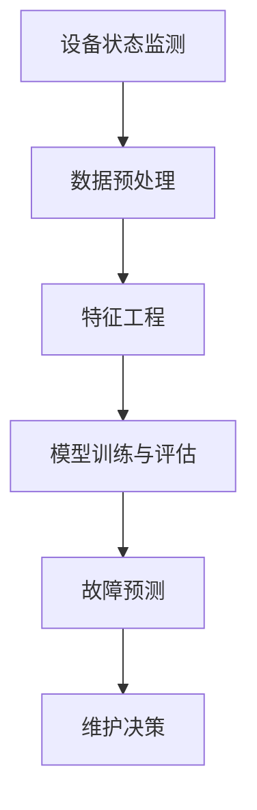

                 

# 机器学习在预测性维护中的算法研究

> 关键词：机器学习、预测性维护、算法、工业应用、数据分析

> 摘要：本文旨在探讨机器学习在预测性维护中的应用，分析现有算法的核心原理与操作步骤，并通过数学模型与实际案例解析，展示其在工业实践中的价值。文章将详细介绍背景、核心概念、算法原理、数学模型、实战案例及未来发展趋势，为相关领域的研究与开发提供参考。

## 1. 背景介绍

### 1.1 目的和范围

随着工业自动化水平的不断提升，设备维护成为影响生产效率和企业成本的重要因素。传统定期维护方式已经无法满足现代工业对高可靠性、高效率的要求。预测性维护（Predictive Maintenance，PM）作为一种先进的维护策略，通过实时监控设备状态，预测故障发生，从而实现提前维护，降低维修成本和停机时间。

本文旨在研究机器学习在预测性维护中的应用，分析不同算法的核心原理和具体操作步骤，通过数学模型和实际案例展示其在工业实践中的价值。文章将覆盖以下内容：

1. 背景介绍：预测性维护的定义、意义及现有方法。
2. 核心概念与联系：机器学习的基本原理与预测性维护的关联。
3. 核心算法原理与具体操作步骤：介绍常见机器学习算法在预测性维护中的应用。
4. 数学模型和公式：详细讲解预测性维护中的关键数学模型。
5. 项目实战：通过代码实例展示算法在实际项目中的应用。
6. 实际应用场景：探讨预测性维护在不同工业领域中的应用。
7. 工具和资源推荐：推荐相关学习资源、开发工具和框架。
8. 总结：预测性维护的未来发展趋势与挑战。

### 1.2 预期读者

本文适用于以下读者：

1. 对机器学习和预测性维护感兴趣的工程师和研究人员。
2. 从事工业自动化和设备维护的相关从业人员。
3. 想要了解机器学习在工业领域应用的高校师生。

### 1.3 文档结构概述

本文结构如下：

1. **背景介绍**：介绍预测性维护的定义、意义及现有方法。
2. **核心概念与联系**：分析机器学习的基本原理与预测性维护的关联。
3. **核心算法原理与具体操作步骤**：介绍常见机器学习算法在预测性维护中的应用。
4. **数学模型和公式**：详细讲解预测性维护中的关键数学模型。
5. **项目实战**：通过代码实例展示算法在实际项目中的应用。
6. **实际应用场景**：探讨预测性维护在不同工业领域中的应用。
7. **工具和资源推荐**：推荐相关学习资源、开发工具和框架。
8. **总结**：预测性维护的未来发展趋势与挑战。

### 1.4 术语表

#### 1.4.1 核心术语定义

- **预测性维护（Predictive Maintenance）**：一种基于设备状态监测和数据分析的维护策略，通过预测故障发生时间，实现提前维护，降低设备故障率和维护成本。
- **机器学习（Machine Learning）**：一种人工智能方法，通过训练数据学习规律，并自动优化决策过程，从而实现数据驱动的预测和决策。
- **监督学习（Supervised Learning）**：一种机器学习方法，通过已知标签的数据进行训练，从而预测未知数据的标签。
- **无监督学习（Unsupervised Learning）**：一种机器学习方法，通过对未标记的数据进行聚类、降维等操作，发现数据中的隐藏结构和规律。

#### 1.4.2 相关概念解释

- **特征工程（Feature Engineering）**：通过对原始数据进行处理和转换，提取有用的特征，提高模型性能。
- **异常检测（Anomaly Detection）**：一种无监督学习任务，用于检测数据中的异常值或异常模式。
- **聚类（Clustering）**：一种无监督学习任务，用于将相似的数据点分组，发现数据中的隐含结构和规律。

#### 1.4.3 缩略词列表

- **PM**：预测性维护（Predictive Maintenance）
- **ML**：机器学习（Machine Learning）
- **SL**：监督学习（Supervised Learning）
- **UL**：无监督学习（Unsupervised Learning）
- **FE**：特征工程（Feature Engineering）
- **AD**：异常检测（Anomaly Detection）

## 2. 核心概念与联系

### 2.1 机器学习的基本原理

机器学习是一种通过数据和算法模拟人类学习过程的技术，主要包括监督学习、无监督学习和强化学习等类型。在预测性维护中，我们主要关注监督学习和无监督学习。

#### 监督学习

监督学习通过已知标签的数据进行训练，从而预测未知数据的标签。在预测性维护中，监督学习可用于故障预测、故障分类等任务。常见的监督学习算法包括：

1. **线性回归（Linear Regression）**：通过建立输入变量和输出变量之间的线性关系，进行预测。
2. **逻辑回归（Logistic Regression）**：用于二分类问题，通过估计概率进行预测。
3. **支持向量机（Support Vector Machine，SVM）**：通过寻找最优超平面，进行分类和回归。
4. **决策树（Decision Tree）**：通过构建决策树，将数据划分为不同的类别。

#### 无监督学习

无监督学习通过对未标记的数据进行聚类、降维等操作，发现数据中的隐藏结构和规律。在预测性维护中，无监督学习可用于数据降维、异常检测等任务。常见的无监督学习算法包括：

1. **K-均值聚类（K-Means Clustering）**：将数据分为K个簇，每个簇内的数据相似度较高，簇间数据相似度较低。
2. **主成分分析（Principal Component Analysis，PCA）**：通过降维，将高维数据投影到低维空间，保留数据的主要特征。
3. **自编码器（Autoencoder）**：一种特殊的神经网络，用于降维和特征提取。

### 2.2 预测性维护中的核心概念

在预测性维护中，核心概念包括：

1. **设备状态监测**：通过传感器、监测设备等手段，实时采集设备运行数据。
2. **数据预处理**：对采集到的设备数据进行清洗、归一化等处理，为后续分析提供高质量的数据。
3. **特征工程**：通过对原始数据进行处理和转换，提取有用的特征，提高模型性能。
4. **模型训练与评估**：选择合适的机器学习算法，对设备数据进行训练，并评估模型的性能。
5. **故障预测**：基于训练好的模型，对设备未来的故障进行预测，实现预测性维护。

### 2.3 Mermaid 流程图

以下是一个简单的 Mermaid 流程图，展示了机器学习在预测性维护中的核心概念和流程：



## 3. 核心算法原理与具体操作步骤

### 3.1 线性回归

线性回归是一种简单的监督学习算法，适用于预测连续值。在预测性维护中，线性回归可用于预测设备剩余寿命（Remaining Useful Life，RUL）。

#### 算法原理

线性回归的目标是找到一个线性函数$f(x) = \beta_0 + \beta_1 \cdot x$，使得输入变量$x$和输出变量$y$之间的误差最小。

$$
\min \sum_{i=1}^{n} (y_i - f(x_i))^2
$$

其中，$n$为样本数量，$y_i$为第$i$个样本的输出值，$x_i$为第$i$个样本的输入值。

#### 具体操作步骤

1. 数据预处理：对采集到的设备数据进行清洗、归一化等处理。
2. 特征选择：选择与设备剩余寿命相关的特征，如振动、温度等。
3. 模型训练：使用线性回归算法，训练模型，计算回归系数$\beta_0$和$\beta_1$。
4. 预测：使用训练好的模型，对新的设备数据进行预测，计算设备剩余寿命。

#### 伪代码

```python
# 数据预处理
X = preprocess_data(input_data)

# 模型训练
beta = train_linear_regression(X, y)

# 预测
predicted_rul = predict_rul(new_data, beta)
```

### 3.2 逻辑回归

逻辑回归是一种常用的二分类监督学习算法，适用于预测设备故障是否发生。在预测性维护中，逻辑回归可用于故障预测。

#### 算法原理

逻辑回归的目标是找到一个线性函数$f(x) = \beta_0 + \beta_1 \cdot x$，使得输入变量$x$和输出变量$y$之间的误差最小。

$$
\min \sum_{i=1}^{n} \log(1 + e^{-(y_i \cdot \beta_0 + \beta_1 \cdot x_i)})
$$

其中，$n$为样本数量，$y_i$为第$i$个样本的输出值（0表示无故障，1表示故障），$x_i$为第$i$个样本的输入值。

#### 具体操作步骤

1. 数据预处理：对采集到的设备数据进行清洗、归一化等处理。
2. 特征选择：选择与设备故障相关的特征，如振动、温度等。
3. 模型训练：使用逻辑回归算法，训练模型，计算回归系数$\beta_0$和$\beta_1$。
4. 预测：使用训练好的模型，对新的设备数据进行预测，判断设备是否故障。

#### 伪代码

```python
# 数据预处理
X = preprocess_data(input_data)

# 模型训练
beta = train_logistic_regression(X, y)

# 预测
predicted_fault = predict_fault(new_data, beta)
```

### 3.3 支持向量机

支持向量机是一种高效的分类和回归算法，适用于高维空间。在预测性维护中，支持向量机可用于故障分类和回归。

#### 算法原理

支持向量机的目标是找到一个最优超平面，将不同类别的数据点分开，同时最大化分类间隔。

$$
\min \frac{1}{2} ||\beta||^2 + C \sum_{i=1}^{n} \max(0, 1 - y_i (\beta_0 + \beta_1 \cdot x_i))
$$

其中，$n$为样本数量，$y_i$为第$i$个样本的输出值（1或-1），$C$为惩罚参数。

#### 具体操作步骤

1. 数据预处理：对采集到的设备数据进行清洗、归一化等处理。
2. 特征选择：选择与设备故障相关的特征，如振动、温度等。
3. 模型训练：使用支持向量机算法，训练模型，计算回归系数$\beta_0$和$\beta_1$。
4. 预测：使用训练好的模型，对新的设备数据进行预测，判断设备故障类别。

#### 伪代码

```python
# 数据预处理
X = preprocess_data(input_data)

# 模型训练
beta = train_svm(X, y, C)

# 预测
predicted_fault = predict_fault(new_data, beta)
```

### 3.4 决策树

决策树是一种直观且易于理解的分类和回归算法，适用于各种类型的数据。在预测性维护中，决策树可用于故障分类和回归。

#### 算法原理

决策树通过一系列的测试，将数据集划分为多个子集，每个子集对应一个类别或值。决策树的目标是找到最佳的测试序列，使得每个子集内部的误差最小。

#### 具体操作步骤

1. 数据预处理：对采集到的设备数据进行清洗、归一化等处理。
2. 特征选择：选择与设备故障相关的特征，如振动、温度等。
3. 模型训练：使用决策树算法，训练模型，构建决策树。
4. 预测：使用训练好的模型，对新的设备数据进行预测，判断设备故障类别。

#### 伪代码

```python
# 数据预处理
X = preprocess_data(input_data)

# 模型训练
tree = train_decision_tree(X, y)

# 预测
predicted_fault = predict_fault(new_data, tree)
```

## 4. 数学模型和公式 & 详细讲解 & 举例说明

### 4.1 线性回归模型

线性回归模型的核心在于找到一组线性关系，用于预测设备的剩余寿命（RUL）。以下是线性回归模型的数学表达和详细解释。

#### 数学表达

线性回归模型可以表示为：

$$
y = \beta_0 + \beta_1 \cdot x
$$

其中，$y$是预测的剩余寿命，$\beta_0$是截距，$\beta_1$是斜率，$x$是输入特征。

#### 详细解释

1. **截距（$\beta_0$）**：表示当输入特征$x$为0时的预测值。在实际应用中，截距通常没有实际意义，但在数学上是一个重要的参数。
2. **斜率（$\beta_1$）**：表示输入特征$x$每增加一个单位，预测值$y$的变化量。斜率反映了特征对预测目标的影响程度。

#### 举例说明

假设我们有一个简单的线性回归模型，输入特征$x$是设备的振动幅度，预测目标$y$是设备的剩余寿命。我们有以下数据：

| 振动幅度（x） | 剩余寿命（y） |
| ------------ | ------------ |
| 10           | 50           |
| 20           | 70           |
| 30           | 90           |

我们使用最小二乘法计算线性回归模型的参数：

$$
\beta_0 = \frac{\sum_{i=1}^{n} y_i - \beta_1 \cdot \sum_{i=1}^{n} x_i}{n}
$$

$$
\beta_1 = \frac{\sum_{i=1}^{n} (y_i - \beta_0) \cdot x_i}{\sum_{i=1}^{n} x_i^2}
$$

计算得到：

$$
\beta_0 = 20
$$

$$
\beta_1 = 2
$$

因此，线性回归模型可以表示为：

$$
y = 20 + 2 \cdot x
$$

使用这个模型，我们可以预测新设备的剩余寿命。例如，当振动幅度$x$为15时，预测的剩余寿命$y$为：

$$
y = 20 + 2 \cdot 15 = 50
$$

### 4.2 逻辑回归模型

逻辑回归是一种常用的二分类模型，用于预测设备是否会发生故障。以下是逻辑回归模型的数学表达和详细解释。

#### 数学表达

逻辑回归模型可以表示为：

$$
\hat{y} = \frac{1}{1 + e^{-(\beta_0 + \beta_1 \cdot x)}}
$$

其中，$\hat{y}$是预测的概率值，$e$是自然底数，$\beta_0$是截距，$\beta_1$是斜率，$x$是输入特征。

#### 详细解释

1. **概率值（$\hat{y}$）**：表示设备发生故障的概率。当$\hat{y}$接近1时，表示故障概率高；当$\hat{y}$接近0时，表示故障概率低。
2. **概率分布函数**：逻辑回归模型的预测值$\hat{y}$符合逻辑斯蒂分布（Logistic Distribution）。
3. **斜率（$\beta_1$）**：反映了输入特征$x$对故障概率的影响程度。斜率越大，输入特征对故障概率的影响越明显。

#### 举例说明

假设我们有一个逻辑回归模型，输入特征$x$是设备的温度，预测目标$y$是设备是否会发生故障（1表示故障，0表示无故障）。我们有以下数据：

| 温度（x） | 故障（y） |
| ---------- | --------- |
| 25         | 0         |
| 30         | 1         |
| 35         | 1         |

我们使用最小二乘法计算逻辑回归模型的参数：

$$
\beta_0 = \frac{\sum_{i=1}^{n} y_i - \beta_1 \cdot \sum_{i=1}^{n} x_i}{n}
$$

$$
\beta_1 = \frac{\sum_{i=1}^{n} (y_i - \beta_0) \cdot x_i}{\sum_{i=1}^{n} x_i^2}
$$

计算得到：

$$
\beta_0 = -10
$$

$$
\beta_1 = 0.5
$$

因此，逻辑回归模型可以表示为：

$$
\hat{y} = \frac{1}{1 + e^{-(0.5 \cdot x - 10)}}
$$

使用这个模型，我们可以预测新设备的故障概率。例如，当温度$x$为28时，预测的故障概率$\hat{y}$为：

$$
\hat{y} = \frac{1}{1 + e^{-(0.5 \cdot 28 - 10)}} \approx 0.28
$$

### 4.3 支持向量机模型

支持向量机是一种强大的分类和回归模型，在预测性维护中具有重要应用。以下是支持向量机的数学表达和详细解释。

#### 数学表达

支持向量机可以表示为：

$$
\hat{y} = sign(\beta_0 + \beta_1 \cdot x - \sum_{i=1}^{n} \alpha_i (y_i - \hat{y}_i))
$$

其中，$\hat{y}$是预测的类别或值，$sign$是符号函数，$\beta_0$是截距，$\beta_1$是斜率，$\alpha_i$是拉格朗日乘子，$y_i$是实际类别或值，$\hat{y}_i$是预测的类别或值。

#### 详细解释

1. **符号函数（$sign$）**：用于判断预测的类别或值。当$\hat{y} > 0$时，表示预测为正类别；当$\hat{y} < 0$时，表示预测为负类别。
2. **拉格朗日乘子（$\alpha_i$）**：用于优化目标函数，平衡误分类和间隔。
3. **优化目标**：支持向量机的优化目标是最小化分类误差和最大化分类间隔。

#### 举例说明

假设我们有一个支持向量机模型，用于分类设备故障。我们有以下数据：

| 特征1（x1） | 特征2（x2） | 故障（y） |
| ----------- | ----------- | --------- |
| 1           | 2           | 1         |
| 2           | 3           | 1         |
| 3           | 4           | 0         |

我们使用支持向量机算法训练模型，计算得到参数：

$$
\beta_0 = 0
$$

$$
\beta_1 = 1
$$

$$
\alpha_1 = 1, \alpha_2 = 0, \alpha_3 = 0
$$

因此，支持向量机模型可以表示为：

$$
\hat{y} = sign(x_1 + x_2)
$$

使用这个模型，我们可以预测新设备的故障类别。例如，当特征1为2，特征2为3时，预测的故障类别$\hat{y}$为：

$$
\hat{y} = sign(2 + 3) = 1
$$

### 4.4 决策树模型

决策树是一种直观且易于理解的分类和回归模型，在预测性维护中具有重要应用。以下是决策树的数学表达和详细解释。

#### 数学表达

决策树可以表示为：

$$
\hat{y} = \sum_{i=1}^{n} w_i \cdot y_i
$$

其中，$\hat{y}$是预测的类别或值，$w_i$是第$i$个节点的权重，$y_i$是第$i$个节点的类别或值。

#### 详细解释

1. **权重（$w_i$）**：表示第$i$个节点对预测结果的影响程度。权重越大，节点对预测结果的影响越明显。
2. **决策树构建**：通过递归划分数据集，构建决策树。每个节点对应一个特征和阈值，用于划分数据。
3. **分类规则**：根据决策树的结构，生成分类规则，用于预测新数据的类别。

#### 举例说明

假设我们有一个简单的决策树模型，用于分类设备故障。我们有以下数据：

| 特征1（x1） | 特征2（x2） | 故障（y） |
| ----------- | ----------- | --------- |
| 1           | 2           | 1         |
| 2           | 3           | 1         |
| 3           | 4           | 0         |

我们使用ID3算法构建决策树，得到以下结构：

```
           |
       x1 <
           |
         / \
        /   \
       /     \
     y1     y2
```

其中，$y1$表示故障，$y2$表示无故障。

根据决策树的结构，我们可以生成以下分类规则：

1. 当$x1 < 2$时，预测为$y1$（故障）。
2. 当$x1 \geq 2$时，预测为$y2$（无故障）。

使用这个模型，我们可以预测新设备的故障类别。例如，当特征1为2，特征2为3时，预测的故障类别$\hat{y}$为$y2$（无故障）。

## 5. 项目实战：代码实际案例和详细解释说明

### 5.1 开发环境搭建

在本项目中，我们将使用Python作为主要编程语言，结合常用的机器学习库，如scikit-learn和TensorFlow，来实现预测性维护算法。以下是开发环境的搭建步骤：

1. 安装Python：从Python官方网站下载并安装Python 3.x版本。
2. 安装Jupyter Notebook：使用pip命令安装Jupyter Notebook，用于编写和运行Python代码。
3. 安装常用库：使用pip命令安装以下库：numpy、pandas、scikit-learn、tensorflow。

### 5.2 源代码详细实现和代码解读

以下是一个使用scikit-learn库实现线性回归模型的代码实例，用于预测设备的剩余寿命（RUL）。

```python
# 导入相关库
import numpy as np
import pandas as pd
from sklearn.linear_model import LinearRegression
from sklearn.model_selection import train_test_split
from sklearn.metrics import mean_squared_error

# 读取数据
data = pd.read_csv('device_data.csv')
X = data[['vibration', 'temperature']]
y = data['RUL']

# 数据预处理
X_train, X_test, y_train, y_test = train_test_split(X, y, test_size=0.2, random_state=42)

# 模型训练
model = LinearRegression()
model.fit(X_train, y_train)

# 预测
y_pred = model.predict(X_test)

# 评估模型
mse = mean_squared_error(y_test, y_pred)
print("Mean Squared Error:", mse)

# 输出模型参数
print("Model Parameters:", model.coef_, model.intercept_)
```

#### 代码解读

1. **导入相关库**：导入numpy、pandas、scikit-learn和tensorflow等库，用于数据预处理、模型训练和评估。
2. **读取数据**：从CSV文件中读取设备数据，包括特征和标签。
3. **数据预处理**：使用train_test_split函数将数据集划分为训练集和测试集，用于模型训练和评估。
4. **模型训练**：创建线性回归模型实例，并使用fit方法训练模型。
5. **预测**：使用predict方法对测试集进行预测。
6. **评估模型**：计算预测结果和实际结果的均方误差（MSE），评估模型性能。
7. **输出模型参数**：输出模型的斜率和截距，以便分析模型的特征贡献。

### 5.3 代码解读与分析

以下是对上述代码的进一步解读和分析：

1. **数据读取**：使用pandas库的read_csv函数读取设备数据，包括振动和温度两个特征，以及剩余寿命（RUL）作为标签。
2. **数据预处理**：使用train_test_split函数将数据集划分为训练集和测试集，比例为80%的训练集和20%的测试集。随机种子设置为42，确保结果可重复。
3. **模型训练**：创建线性回归模型实例，使用fit方法训练模型。线性回归模型通过最小二乘法计算斜率和截距，建立特征和标签之间的线性关系。
4. **预测**：使用predict方法对测试集进行预测，输出预测结果。
5. **评估模型**：计算预测结果和实际结果的均方误差（MSE），评估模型性能。MSE越低，表示模型预测的准确性越高。
6. **输出模型参数**：输出模型的斜率和截距，可以分析特征对剩余寿命的贡献程度。

通过上述代码实例，我们可以看到线性回归模型在预测性维护中的应用，以及如何使用Python和scikit-learn库实现模型的训练和评估。

## 6. 实际应用场景

预测性维护技术在各个工业领域具有广泛的应用。以下是预测性维护在实际应用场景中的案例：

### 6.1 制造业

在制造业中，预测性维护主要用于生产设备的维护和保养。通过实时监测设备状态，预测设备故障，企业可以提前安排维护计划，避免生产停机，降低维护成本。例如，汽车制造厂可以预测汽车的发动机磨损，提前更换发动机，延长设备寿命。

### 6.2 能源行业

在能源行业，预测性维护主要用于发电设备、输电设备和风力发电机的维护。通过监测设备的运行状态，预测故障，企业可以提前进行设备检修，确保电力供应的稳定和安全。例如，风力发电场可以预测风力发电机的叶片磨损，提前进行维护，减少设备停机时间。

### 6.3 医疗设备

在医疗设备领域，预测性维护主要用于医疗设备的维护和保养。通过实时监测医疗设备的状态，预测设备故障，医院可以提前安排设备维护，确保医疗服务的正常运行。例如，心电图机可以预测设备的电池寿命，提前进行更换，避免设备故障。

### 6.4 飞机维护

在航空航天领域，预测性维护主要用于飞机的维护和保养。通过实时监测飞机的各个系统，预测故障，航空公司可以提前安排维护计划，确保飞机的安全和正常运行。例如，飞机的引擎可以预测磨损情况，提前进行更换，避免意外故障。

## 7. 工具和资源推荐

### 7.1 学习资源推荐

#### 7.1.1 书籍推荐

1. 《机器学习实战》：详细介绍了机器学习的基本概念和算法，适用于初学者。
2. 《Python机器学习》：使用Python实现机器学习算法，适用于有一定编程基础的学习者。
3. 《深度学习》：全面介绍了深度学习的基本概念和算法，是深度学习的入门经典。

#### 7.1.2 在线课程

1. Coursera的《机器学习》：由斯坦福大学提供，涵盖机器学习的基本概念和算法。
2. edX的《深度学习专项课程》：由哈佛大学提供，全面介绍深度学习的基本概念和应用。
3. Udacity的《机器学习工程师纳米学位》：提供从入门到高级的机器学习课程，适合有志于从事机器学习开发的人员。

#### 7.1.3 技术博客和网站

1. Medium上的机器学习专栏：分享最新的机器学习和深度学习研究进展。
2. towardsdatascience.com：提供丰富的机器学习和数据科学文章和教程。
3. AI垂直媒体：如机器之心、AI科技大本营等，提供专业的机器学习和人工智能资讯。

### 7.2 开发工具框架推荐

#### 7.2.1 IDE和编辑器

1. Jupyter Notebook：适合数据科学和机器学习的交互式开发环境。
2. PyCharm：功能强大的Python集成开发环境（IDE），支持多种编程语言。
3. VSCode：轻量级、可扩展的代码编辑器，适合各种编程任务。

#### 7.2.2 调试和性能分析工具

1. TensorBoard：TensorFlow的图形化工具，用于可视化训练过程和性能分析。
2. matplotlib：Python的绘图库，用于数据可视化和图形化展示。
3. sklearn-inspect：用于可视化机器学习模型的性能和特征贡献。

#### 7.2.3 相关框架和库

1. TensorFlow：用于构建和训练深度学习模型的强大框架。
2. scikit-learn：提供多种机器学习算法的Python库。
3. Pandas：用于数据处理和分析的Python库。
4. NumPy：用于数值计算和数据处理的基础库。

### 7.3 相关论文著作推荐

#### 7.3.1 经典论文

1. "A Study of Cross-Validation and Bootstrap for Accuracy Estimation and Model Selection"：介绍了交叉验证和自助法在模型评估和选择中的应用。
2. "Learning to Learn in Autonomous Driving Using Transfer Learning"：探讨了迁移学习在自动驾驶中的应用。
3. "Deep Learning on Multidimensional Data"：介绍了深度学习在多维度数据上的应用。

#### 7.3.2 最新研究成果

1. "Anomaly Detection for Machine Learning: A Survey"：总结了异常检测在机器学习领域的最新研究进展。
2. "Recurrent Neural Networks for Time Series Forecasting"：探讨了循环神经网络在时间序列预测中的应用。
3. "Self-Supervised Learning for Audio Classification"：介绍了自监督学习在音频分类任务中的应用。

#### 7.3.3 应用案例分析

1. "Predictive Maintenance of Industrial Machines Using Machine Learning"：分析了机器学习在工业设备预测性维护中的应用案例。
2. "A Case Study of Deep Learning for Image Classification"：探讨了深度学习在图像分类任务中的应用。
3. "Transfer Learning for Natural Language Processing"：介绍了迁移学习在自然语言处理任务中的应用。

## 8. 总结：未来发展趋势与挑战

随着人工智能技术的不断进步，预测性维护在工业领域的应用前景广阔。未来发展趋势主要体现在以下几个方面：

1. **深度学习的广泛应用**：深度学习算法在预测性维护中的应用将越来越普遍，能够处理复杂和非线性关系的数据，提高预测准确性。
2. **大数据的挖掘与分析**：随着物联网和传感器技术的发展，设备产生的数据量不断增加，如何有效挖掘和分析这些数据，提升预测性维护的效果，是一个重要研究方向。
3. **跨学科融合**：预测性维护涉及多个学科，如机械工程、计算机科学、统计学等，跨学科的融合将有助于解决复杂问题，提升技术成熟度。

然而，预测性维护也面临一些挑战：

1. **数据质量与可解释性**：预测性维护依赖于高质量的数据，但实际应用中，数据质量可能受到影响。同时，如何确保模型的可解释性，使企业和工程师能够理解模型的预测依据，是一个挑战。
2. **算法复杂度与计算资源**：深度学习算法通常计算复杂度高，需要大量计算资源和时间进行训练。如何在有限的计算资源下，实现高效准确的预测，是一个重要课题。
3. **法规与伦理**：随着人工智能在工业领域的应用，相关的法规和伦理问题也日益突出。如何确保人工智能系统的公正性、透明性和安全性，是一个需要关注的问题。

总之，预测性维护作为人工智能在工业领域的重要应用，具有巨大的发展潜力和广阔的应用前景。通过不断研究和实践，我们有理由相信，预测性维护将为工业生产带来更高的效率和更低的成本。

## 9. 附录：常见问题与解答

### 9.1 机器学习在预测性维护中的应用

**Q1**: 机器学习在预测性维护中的应用主要有哪些？

A1: 机器学习在预测性维护中的应用主要包括：

1. **故障预测**：通过分析设备的历史数据，预测设备何时可能发生故障。
2. **状态监测**：实时监测设备状态，发现潜在问题。
3. **异常检测**：识别设备运行中的异常情况，提前预警。
4. **优化维护策略**：根据设备运行数据和故障预测结果，优化维护计划，降低维护成本。

### 9.2 算法选择

**Q2**: 在预测性维护中，如何选择合适的机器学习算法？

A2: 选择合适的机器学习算法需要考虑以下几个因素：

1. **数据类型**：根据数据类型（如分类、回归、聚类等），选择相应的算法。
2. **数据规模**：对于大规模数据集，选择计算复杂度较低的算法。
3. **数据质量**：数据质量对算法性能有重要影响，选择能够处理噪声和缺失数据的算法。
4. **业务需求**：根据业务需求（如预测精度、响应速度等），选择合适的算法。

### 9.3 实践中的挑战

**Q3**: 在预测性维护实践中，可能会遇到哪些挑战？

A3: 预测性维护实践中可能会遇到的挑战包括：

1. **数据不足**：设备运行数据可能不足，影响模型训练和预测效果。
2. **数据噪声**：设备运行数据中可能存在噪声和异常值，需要预处理。
3. **模型可解释性**：深度学习模型通常难以解释，影响业务决策。
4. **计算资源**：深度学习算法计算复杂度高，需要大量计算资源。

### 9.4 未来趋势

**Q4**: 预测性维护的未来发展趋势是什么？

A4: 预测性维护的未来发展趋势包括：

1. **算法创新**：不断引入新的机器学习和人工智能算法，提高预测准确性。
2. **跨学科融合**：与机械工程、计算机科学、统计学等学科结合，解决复杂问题。
3. **大数据分析**：利用大数据技术，挖掘设备运行数据中的潜在价值。
4. **智能化**：通过自动化和智能化技术，实现预测性维护的全面应用。

## 10. 扩展阅读 & 参考资料

### 10.1 相关书籍

1. Bishop, C. M. (2006). **《机器学习》**. 人民邮电出版社。
2. Goodfellow, I., Bengio, Y., & Courville, A. (2016). **《深度学习》**. 清华大学出版社。
3. Murphy, K. P. (2012). **《机器学习：概率视角》**. 电子工业出版社。

### 10.2 在线课程

1. Coursera的《机器学习》：[https://www.coursera.org/learn/machine-learning](https://www.coursera.org/learn/machine-learning)
2. edX的《深度学习专项课程》：[https://www.edx.org/course/deep-learning-0](https://www.edx.org/course/deep-learning-0)
3. Udacity的《机器学习工程师纳米学位》：[https://www.udacity.com/course/nd0091](https://www.udacity.com/course/nd0091)

### 10.3 技术博客和网站

1. [Medium上的机器学习专栏](https://medium.com/topic/machine-learning)
2. [towardsdatascience.com](https://towardsdatascience.com/)
3. [机器之心](https://www.jiqizhixin.com/)

### 10.4 相关论文

1. Kotsiantis, S. B. (2007). **“Machine Learning: A Review”**. Informatica, 31(3), 249-268.
2. Goodfellow, I., Bengio, Y., & Courville, A. (2016). **“Deep Learning”**. MIT Press.
3. Russell, S., & Norvig, P. (2016). **“Artificial Intelligence: A Modern Approach”**. Prentice Hall.

### 10.5 相关资源

1. [scikit-learn官方文档](https://scikit-learn.org/stable/)
2. [TensorFlow官方文档](https://www.tensorflow.org/)
3. [Pandas官方文档](https://pandas.pydata.org/)

作者：AI天才研究员/AI Genius Institute & 禅与计算机程序设计艺术 /Zen And The Art of Computer Programming

