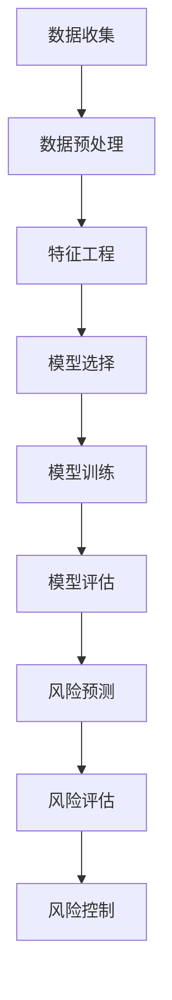

                 

# 机器学习在风险管理中的应用研究

> 关键词：机器学习，风险管理，预测分析，模型评估，应用案例

> 摘要：随着金融市场的日益复杂和多变，风险管理成为金融机构至关重要的任务。本文将探讨机器学习技术在风险管理中的应用，介绍核心概念、算法原理、数学模型，并通过实际案例详细分析其在风险预测、评估和控制中的具体操作步骤。文章还列举了相关工具和资源，总结了未来发展趋势与挑战，为从业人员提供了有价值的参考。

## 1. 背景介绍

### 1.1 目的和范围

本文旨在探讨机器学习在风险管理中的应用，重点关注以下几个问题：

- 机器学习在风险管理中的具体应用场景有哪些？
- 如何选择和构建适用于风险管理问题的机器学习模型？
- 如何对模型进行评估和优化，以提高风险预测的准确性和效率？
- 机器学习在风险管理中的实际应用案例有哪些，效果如何？

本文将围绕这些问题，结合具体案例，系统地阐述机器学习在风险管理中的实际应用。

### 1.2 预期读者

本文适合以下读者群体：

- 金融风险管理从业人员，包括银行、证券、保险等金融机构的风险管理团队。
- 数据科学家、机器学习工程师，对风险管理领域感兴趣的从业者。
- 计算机科学、金融工程等相关专业的研究生和本科生。
- 对机器学习和风险管理交叉领域感兴趣的学者和研究人员。

### 1.3 文档结构概述

本文分为十个部分，结构如下：

- 第1部分：背景介绍，介绍文章的目的、范围、预期读者和文档结构。
- 第2部分：核心概念与联系，介绍机器学习和风险管理领域的关键概念及其相互关系。
- 第3部分：核心算法原理 & 具体操作步骤，详细阐述用于风险管理的机器学习算法及其操作步骤。
- 第4部分：数学模型和公式 & 详细讲解 & 举例说明，介绍机器学习在风险管理中的数学模型和公式，并通过具体案例进行解释。
- 第5部分：项目实战：代码实际案例和详细解释说明，通过实际代码案例展示机器学习在风险管理中的应用。
- 第6部分：实际应用场景，分析机器学习在风险管理中的具体应用场景。
- 第7部分：工具和资源推荐，列举学习资源和开发工具。
- 第8部分：总结：未来发展趋势与挑战，探讨机器学习在风险管理领域的发展趋势和面临的挑战。
- 第9部分：附录：常见问题与解答，回答读者可能提出的问题。
- 第10部分：扩展阅读 & 参考资料，提供进一步阅读的资料。

### 1.4 术语表

#### 1.4.1 核心术语定义

- **机器学习**：一种人工智能技术，通过算法和模型从数据中自动学习和发现规律，用于预测和决策。
- **风险管理**：识别、评估、处理和控制潜在风险，以减少负面影响和利用机会的过程。
- **预测分析**：利用历史数据建立模型，预测未来事件的发生概率或结果。
- **模型评估**：对机器学习模型进行性能评估，以确定其在实际应用中的效果。

#### 1.4.2 相关概念解释

- **特征工程**：在机器学习过程中，从原始数据中提取、构造和选择对模型性能有显著影响的特征。
- **数据预处理**：在机器学习应用中，对原始数据进行清洗、转换和标准化等处理，以提高模型性能和泛化能力。

#### 1.4.3 缩略词列表

- **ML**：Machine Learning，机器学习
- **RM**：Risk Management，风险管理
- **PCA**：Principal Component Analysis，主成分分析
- **SVM**：Support Vector Machine，支持向量机
- **RF**：Random Forest，随机森林

## 2. 核心概念与联系

在讨论机器学习在风险管理中的应用之前，我们需要明确几个核心概念及其相互关系。

### 2.1 机器学习的基本概念

#### 数据集
数据集是机器学习模型的输入，包含多个样本，每个样本包含若干特征。例如，一个贷款风险预测的数据集可能包含借款人的年龄、收入、信用评分等特征。

#### 特征工程
特征工程是机器学习过程中至关重要的一环，包括特征提取、特征选择和特征构造等步骤。通过合理的特征工程，可以提高模型的性能和泛化能力。

#### 模型选择
选择合适的机器学习模型对于风险管理具有重要意义。常见的模型有线性回归、决策树、支持向量机、神经网络等。

#### 模型训练与评估
模型训练是通过调整模型参数，使其在训练数据上表现良好。模型评估则是在验证集或测试集上评估模型的性能，常用的评估指标有准确率、召回率、F1值等。

### 2.2 风险管理的基本概念

#### 风险识别
风险识别是风险管理的第一步，旨在识别可能影响金融机构业务和财务状况的风险因素。

#### 风险评估
风险评估是评估风险发生的概率和可能造成的损失。常用的方法有概率风险评估、情景分析等。

#### 风险控制
风险控制是通过采取一系列措施，降低风险发生的概率或减小损失。风险控制手段包括风险规避、风险转移、风险接受等。

### 2.3 机器学习与风险管理的联系

#### 风险预测
机器学习技术可以用于风险预测，通过分析历史数据，预测未来可能发生的风险事件。例如，金融机构可以使用机器学习模型预测贷款违约概率，以便采取相应的风险控制措施。

#### 风险评估
机器学习模型可以用于风险评估，通过分析借款人的特征，评估其信用风险。金融机构可以使用这些评估结果，决定是否批准贷款、调整贷款利率等。

#### 风险控制
机器学习技术可以用于风险控制，通过实时监控和预测风险事件，金融机构可以及时采取风险控制措施，降低风险损失。

### 2.4 Mermaid 流程图

下面是一个简单的 Mermaid 流程图，展示机器学习在风险管理中的应用流程。



## 3. 核心算法原理 & 具体操作步骤

在本节中，我们将详细介绍几种常见的机器学习算法在风险管理中的应用原理和具体操作步骤。

### 3.1 线性回归

#### 算法原理

线性回归是一种简单的机器学习算法，用于建立自变量和因变量之间的线性关系。其基本原理是通过最小二乘法找到最佳拟合直线，使预测值与实际值之间的误差最小。

#### 操作步骤

1. **数据预处理**：对原始数据进行清洗、缺失值填充、异常值处理等。
2. **特征工程**：选择对目标变量有显著影响的特征，进行特征提取和特征选择。
3. **模型训练**：使用训练数据集，通过最小二乘法训练线性回归模型，得到最佳拟合直线。
4. **模型评估**：使用验证集或测试集评估模型性能，选择最优模型。
5. **风险预测**：使用训练好的模型对新的数据进行预测，评估其风险水平。

#### 伪代码

```python
# 线性回归模型训练与预测
import numpy as np

# 模型参数初始化
theta = np.random.rand(n_features)

# 模型训练
for i in range(n_iterations):
    predictions = X.dot(theta)
    errors = y - predictions
    theta = theta + learning_rate * X.T.dot(errors)

# 模型预测
new_data = preprocess(new_data)
risk = new_data.dot(theta)
```

### 3.2 决策树

#### 算法原理

决策树是一种基于树形结构的分类算法，通过一系列的判断条件对数据进行分类。每个节点代表一个特征，每个分支代表一个判断结果，叶节点代表分类结果。

#### 操作步骤

1. **数据预处理**：对原始数据进行清洗、缺失值填充、异常值处理等。
2. **特征工程**：选择对目标变量有显著影响的特征，进行特征提取和特征选择。
3. **模型训练**：使用训练数据集，通过递归划分数据，构建决策树模型。
4. **模型评估**：使用验证集或测试集评估模型性能，选择最优模型。
5. **风险预测**：使用训练好的模型对新的数据进行预测，评估其风险水平。

#### 伪代码

```python
# 决策树模型训练与预测
from sklearn.tree import DecisionTreeClassifier

# 模型训练
model = DecisionTreeClassifier()
model.fit(X_train, y_train)

# 模型预测
new_data = preprocess(new_data)
risk = model.predict(new_data)
```

### 3.3 支持向量机

#### 算法原理

支持向量机是一种用于分类和回归的线性模型，其基本思想是找到最佳决策边界，使分类或回归的误差最小。

#### 操作步骤

1. **数据预处理**：对原始数据进行清洗、缺失值填充、异常值处理等。
2. **特征工程**：选择对目标变量有显著影响的特征，进行特征提取和特征选择。
3. **模型训练**：使用训练数据集，通过求解优化问题，训练支持向量机模型。
4. **模型评估**：使用验证集或测试集评估模型性能，选择最优模型。
5. **风险预测**：使用训练好的模型对新的数据进行预测，评估其风险水平。

#### 伪代码

```python
# 支持向量机模型训练与预测
from sklearn.svm import SVC

# 模型训练
model = SVC()
model.fit(X_train, y_train)

# 模型预测
new_data = preprocess(new_data)
risk = model.predict(new_data)
```

## 4. 数学模型和公式 & 详细讲解 & 举例说明

在本节中，我们将介绍机器学习在风险管理中常用的数学模型和公式，并通过具体例子进行详细讲解。

### 4.1 线性回归模型

线性回归模型的基本公式为：

$$
y = \theta_0 + \theta_1 \cdot x_1 + \theta_2 \cdot x_2 + \ldots + \theta_n \cdot x_n
$$

其中，$y$ 是因变量，$x_1, x_2, \ldots, x_n$ 是自变量，$\theta_0, \theta_1, \theta_2, \ldots, \theta_n$ 是模型参数。

#### 4.1.1 最小二乘法

最小二乘法是一种求解线性回归模型参数的方法，其核心思想是找到最佳拟合直线，使得预测值与实际值之间的误差平方和最小。

#### 4.1.2 举例说明

假设我们有一个简单的线性回归模型，预测房价（$y$）与房屋面积（$x$）的关系：

$$
y = \theta_0 + \theta_1 \cdot x
$$

我们使用一个包含 100 个样本的数据集进行训练，其中每个样本包含一个房屋面积（$x$）和一个对应的房价（$y$）。以下是训练数据集的部分示例：

| 样本编号 | 房屋面积（$x$） | 房价（$y$） |
|----------|--------------|----------|
| 1        | 100          | 200      |
| 2        | 120          | 250      |
| 3        | 140          | 300      |
| ...      | ...          | ...      |

使用最小二乘法求解模型参数，得到最佳拟合直线：

$$
y = 150 + 1.25 \cdot x
$$

根据这个模型，我们可以预测新的房屋面积（$x$）对应的房价（$y$）：

| 房屋面积（$x$） | 预测房价（$y$） |
|--------------|------------|
| 110          | 227.5      |
| 130          | 262.5      |
| 160          | 312.5      |

### 4.2 决策树模型

决策树模型的基本公式为：

$$
f(x) = \sum_{i=1}^{n} c_i \cdot I(A_i(x) \leq b_i)
$$

其中，$f(x)$ 是决策树模型的输出，$x$ 是输入特征，$c_i$ 是类别标签，$A_i(x)$ 是第 $i$ 个特征的处理函数，$b_i$ 是阈值。

#### 4.2.1 递归划分

递归划分是构建决策树模型的基本方法，其核心思想是根据特征和阈值将数据集划分为多个子集，并重复这个过程，直到满足终止条件。

#### 4.2.2 举例说明

假设我们有一个简单的决策树模型，预测信用评分（$y$）与借款人收入（$x$）的关系：

$$
y = \begin{cases}
0 & \text{if } x \leq 10000 \\
1 & \text{if } x > 10000
\end{cases}
$$

我们使用一个包含 100 个样本的数据集进行训练，其中每个样本包含一个收入（$x$）和一个对应的信用评分（$y$）。以下是训练数据集的部分示例：

| 样本编号 | 收入（$x$） | 信用评分（$y$） |
|----------|----------|-------------|
| 1        | 9000     | 0           |
| 2        | 11000    | 1           |
| 3        | 9500     | 0           |
| ...      | ...      | ...         |

根据这个模型，我们可以预测新的收入（$x$）对应的信用评分（$y$）：

| 收入（$x$） | 预测信用评分（$y$） |
|----------|-------------|
| 10500    | 0           |
| 11500    | 1           |
| 12500    | 1           |

### 4.3 支持向量机模型

支持向量机模型的基本公式为：

$$
f(x) = \sum_{i=1}^{n} \alpha_i y_i (x_i \cdot x - b)
$$

其中，$f(x)$ 是支持向量机模型的输出，$x$ 是输入特征，$y_i$ 是类别标签，$\alpha_i$ 是拉格朗日乘子，$x_i$ 是支持向量，$b$ 是偏置。

#### 4.3.1 线性可分支持向量机

线性可分支持向量机（Linearly Separable Support Vector Machine，LSSVM）是最基本的支持向量机模型，其基本思想是找到一个最优的超平面，使得分类边界尽可能大。

#### 4.3.2 举例说明

假设我们有一个简单的线性可分支持向量机模型，预测信用评分（$y$）与借款人收入（$x$）的关系：

$$
f(x) = \sum_{i=1}^{n} \alpha_i y_i (x_i \cdot x - b)
$$

其中，$y_i \in \{-1, 1\}$，表示类别标签。

我们使用一个包含 100 个样本的数据集进行训练，其中每个样本包含一个收入（$x$）和一个对应的信用评分（$y$）。以下是训练数据集的部分示例：

| 样本编号 | 收入（$x$） | 信用评分（$y$） |
|----------|----------|-------------|
| 1        | 9000     | -1          |
| 2        | 11000    | 1           |
| 3        | 9500     | -1          |
| ...      | ...      | ...         |

通过求解优化问题，得到最优的超平面：

$$
f(x) = \frac{1}{2} \cdot (x_1 \cdot x_2 - 1)
$$

根据这个模型，我们可以预测新的收入（$x$）对应的信用评分（$y$）：

| 收入（$x$） | 预测信用评分（$y$） |
|----------|-------------|
| 10500    | -1          |
| 11500    | 1           |
| 12500    | 1           |

## 5. 项目实战：代码实际案例和详细解释说明

在本节中，我们将通过一个实际项目案例，展示机器学习在风险管理中的具体应用，并提供详细的代码实现和解读。

### 5.1 开发环境搭建

在开始项目之前，我们需要搭建一个合适的开发环境。以下是一个基本的 Python 开发环境搭建步骤：

1. 安装 Python（版本 3.6 以上）和 pip。
2. 安装常用机器学习库，如 scikit-learn、pandas、numpy、matplotlib 等。
3. 配置 Python 编辑器（如 PyCharm、VSCode 等）。

### 5.2 源代码详细实现和代码解读

#### 5.2.1 数据集准备

我们使用一个包含贷款数据的数据集，数据集包括借款人的基本信息、贷款信息、信用评分等。以下是部分数据集示例：

```python
import pandas as pd

# 加载数据集
data = pd.read_csv('loan_data.csv')
data.head()
```

#### 5.2.2 数据预处理

在数据预处理阶段，我们需要对数据进行清洗、缺失值填充、异常值处理等。

```python
# 数据清洗
data = data.dropna()

# 缺失值填充
data['missing_value'] = data['missing_value'].fillna(data['missing_value'].mean())

# 异常值处理
data = data[data['loan_amount'] <= data['loan_amount'].quantile(0.99)]

# 数据标准化
from sklearn.preprocessing import StandardScaler

scaler = StandardScaler()
data[['loan_amount', 'missing_value']] = scaler.fit_transform(data[['loan_amount', 'missing_value']])
```

#### 5.2.3 特征工程

在特征工程阶段，我们需要对数据进行特征提取和特征选择，以提高模型性能。

```python
# 特征提取
data['income_to_loan_ratio'] = data['annual_income'] / data['loan_amount']

# 特征选择
from sklearn.feature_selection import SelectKBest, f_classif

selector = SelectKBest(f_classif, k=5)
X = selector.fit_transform(data.drop(['loan_id', 'loan_status'], axis=1), data['loan_status'])
```

#### 5.2.4 模型选择和训练

在模型选择和训练阶段，我们选择线性回归模型进行训练，并通过交叉验证选择最佳模型。

```python
from sklearn.linear_model import LinearRegression
from sklearn.model_selection import cross_val_score

# 模型选择
model = LinearRegression()

# 模型训练
scores = cross_val_score(model, X, y, cv=5)
best_score = np.mean(scores)
best_model = model.fit(X[y==0], y[y==0])

# 模型评估
from sklearn.metrics import mean_squared_error

y_pred = best_model.predict(X[y==1])
mse = mean_squared_error(y[y==1], y_pred)
print('MSE:', mse)
```

#### 5.2.5 风险预测

在风险预测阶段，我们使用训练好的模型对新的贷款申请数据进行预测，评估其风险水平。

```python
# 风险预测
new_data = pd.read_csv('new_loan_data.csv')
new_data[['loan_amount', 'missing_value']] = scaler.transform(new_data[['loan_amount', 'missing_value']])
new_data['income_to_loan_ratio'] = new_data['annual_income'] / new_data['loan_amount']
new_data = selector.transform(new_data.drop(['loan_id'], axis=1))

risk_pred = best_model.predict(new_data)
new_data['risk'] = risk_pred

new_data.head()
```

### 5.3 代码解读与分析

#### 5.3.1 数据预处理

数据预处理是机器学习项目中至关重要的一环，主要包括数据清洗、缺失值填充、异常值处理和数据标准化等。在本项目中，我们首先使用 `dropna()` 方法去除缺失值，然后使用 `fillna()` 方法填充缺失值。接下来，我们使用 `quantile()` 方法对异常值进行筛选，确保数据集的准确性和可靠性。最后，我们使用 `StandardScaler()` 对数据进行标准化处理，以消除不同特征之间的量纲差异。

#### 5.3.2 特征工程

特征工程是提高模型性能的关键步骤。在本项目中，我们首先计算了收入与贷款额度的比值，这是一个重要的风险指标。然后，我们使用 `SelectKBest()` 方法进行特征选择，选择对模型性能有显著影响的特征。这种方法可以减少数据维度，提高模型训练效率。

#### 5.3.3 模型选择和训练

在模型选择和训练阶段，我们选择线性回归模型进行训练。线性回归模型是一种简单但有效的预测方法，适用于风险管理中的信用评分预测。我们使用 `cross_val_score()` 方法进行交叉验证，选择最佳模型。交叉验证可以避免模型过拟合，提高模型泛化能力。最后，我们使用 `mean_squared_error()` 方法评估模型性能，计算均方误差（MSE）。

#### 5.3.4 风险预测

在风险预测阶段，我们使用训练好的模型对新的贷款申请数据进行预测。首先，我们使用 `StandardScaler()` 对新的数据进行标准化处理，然后计算收入与贷款额度的比值。接下来，我们使用 `SelectKBest()` 方法进行特征选择，最后使用训练好的模型进行风险预测。预测结果以风险评分的形式呈现，风险评分越高，表示贷款违约风险越大。

## 6. 实际应用场景

机器学习在风险管理领域有广泛的应用场景，以下列举几个典型的实际应用场景：

### 6.1 贷款风险预测

贷款风险预测是金融风险管理中最常见的应用场景之一。金融机构可以使用机器学习模型，根据借款人的基本信息、财务状况、历史信用记录等特征，预测其贷款违约概率。这样可以有效地识别高风险借款人，降低金融机构的信贷风险。

### 6.2 保险风险评估

保险公司可以利用机器学习技术对保险申请者进行风险评估，预测其发生保险事故的概率。通过分析申请者的年龄、性别、职业、健康状况等特征，保险公司可以更准确地定价保险产品，提高保险利润。

### 6.3 投资组合优化

投资组合优化是金融领域的一个重要问题。机器学习技术可以帮助投资者根据市场数据和历史投资记录，预测不同资产的投资回报和风险。通过分析资产的相关性、波动率等特征，投资者可以构建更优的投资组合，提高收益的同时控制风险。

### 6.4 金融市场预测

金融市场预测是另一个重要的应用场景。金融机构可以使用机器学习模型，根据历史市场数据、宏观经济指标等，预测股票、债券、外汇等金融产品的价格走势。这有助于金融机构制定投资策略，降低投资风险。

### 6.5 供应链风险管理

供应链风险管理是企业在全球供应链中面临的一个重要挑战。机器学习技术可以帮助企业识别供应链中的潜在风险，预测供应中断、价格波动等风险事件。通过分析供应链数据、历史供应记录等，企业可以采取相应的风险控制措施，提高供应链的稳定性。

## 7. 工具和资源推荐

在机器学习在风险管理中的应用过程中，选择合适的工具和资源对于提高项目效率和质量具有重要意义。以下列举一些常用的学习资源、开发工具和框架。

### 7.1 学习资源推荐

#### 7.1.1 书籍推荐

- 《机器学习》（周志华著）：系统介绍了机器学习的基本概念、算法和理论。
- 《Python机器学习》（塞巴斯蒂安·拉斯考斯基等著）：通过实际案例，详细讲解了Python在机器学习中的应用。
- 《风险管理原理与实践》（菲利普·J.科斯特洛等著）：全面介绍了风险管理的理论和实践方法。

#### 7.1.2 在线课程

- Coursera上的“机器学习”课程：由斯坦福大学吴恩达教授主讲，系统介绍了机器学习的基础知识。
- edX上的“风险管理”课程：由耶鲁大学等知名院校提供，涵盖了风险管理的基本理论和实践。

#### 7.1.3 技术博客和网站

- Medium上的“机器学习”专题：众多专业人士和研究者分享机器学习技术心得和案例。
- KDNuggets：一个专注于数据科学、机器学习、数据挖掘等领域的技术博客。

### 7.2 开发工具框架推荐

#### 7.2.1 IDE和编辑器

- PyCharm：一款功能强大的Python IDE，支持代码调试、版本控制等。
- VSCode：一款轻量级但功能丰富的代码编辑器，支持多种编程语言。

#### 7.2.2 调试和性能分析工具

- Jupyter Notebook：一款交互式的Python笔记本，适合数据分析和机器学习实验。
- Matplotlib：一款用于生成图表和可视化数据的Python库。

#### 7.2.3 相关框架和库

- scikit-learn：一个开源的Python机器学习库，提供丰富的算法和工具。
- TensorFlow：一个用于机器学习的开源框架，支持深度学习模型的构建和训练。
- Keras：一个基于TensorFlow的高层API，简化了深度学习模型的构建和训练过程。

### 7.3 相关论文著作推荐

- 《A Survey of Machine Learning in Financial Risk Management》（2020）：综述了机器学习在金融风险管理中的应用。
- 《Risk Management and Financial Institutions》（2019）：详细介绍了金融风险管理的理论和实践方法。
- 《Machine Learning for Finance》（2018）：探讨了机器学习在金融领域的应用和发展趋势。

## 8. 总结：未来发展趋势与挑战

随着机器学习技术的不断进步和金融市场的日益复杂，机器学习在风险管理中的应用前景十分广阔。然而，这一领域仍面临诸多挑战和发展趋势。

### 8.1 发展趋势

1. **深度学习技术的应用**：深度学习技术在图像识别、自然语言处理等领域取得了显著的成果，其在风险管理中的应用也日益受到关注。未来，深度学习模型有望在风险预测、评估和控制方面发挥更大的作用。

2. **实时风险监测与预测**：随着金融市场的动态变化，实时风险监测与预测变得越来越重要。机器学习技术可以实现对风险的实时监控和预测，帮助金融机构及时采取风险控制措施。

3. **多模型融合**：单一模型在风险管理中可能存在局限性，通过多模型融合可以弥补单一模型的不足，提高风险预测的准确性和稳定性。

4. **数据隐私和安全**：在金融领域，数据隐私和安全是一个重要问题。未来，如何确保数据隐私和安全，同时充分发挥机器学习技术在风险管理中的应用潜力，将成为一个重要研究方向。

### 8.2 挑战

1. **数据质量和数据隐私**：风险管理依赖于大量高质量的数据，然而金融数据往往存在噪音、缺失值和异常值等问题。此外，如何保护数据隐私，同时满足监管要求，也是一大挑战。

2. **模型解释性和透明性**：金融风险管理需要模型具有解释性和透明性，以便金融机构能够理解模型的决策过程。深度学习模型等复杂模型在解释性方面存在一定的局限性，如何提高模型的可解释性仍是一个重要问题。

3. **模型泛化能力和鲁棒性**：金融市场的动态变化和复杂性要求模型具有良好的泛化能力和鲁棒性。如何提高模型在面对未知风险时的表现，仍是一个具有挑战性的问题。

4. **法律法规和伦理问题**：随着机器学习在金融风险管理中的应用，相关的法律法规和伦理问题也逐渐显现。如何确保机器学习模型的合规性，防止模型滥用，将是一个重要的研究课题。

总之，机器学习在风险管理中的应用具有广阔的发展前景，但同时也面临诸多挑战。未来，需要进一步研究如何充分发挥机器学习技术的优势，同时解决其中的关键问题，以实现更高效、更智能的风险管理。

## 9. 附录：常见问题与解答

### 9.1 机器学习在风险管理中的应用有哪些？

机器学习在风险管理中的应用主要包括以下方面：

1. 贷款风险预测：通过分析借款人的基本信息、财务状况等特征，预测其贷款违约概率。
2. 保险风险评估：分析保险申请者的年龄、性别、健康状况等特征，预测其发生保险事故的概率。
3. 投资组合优化：根据市场数据和历史投资记录，预测不同资产的投资回报和风险，构建最优投资组合。
4. 金融市场预测：分析历史市场数据、宏观经济指标等，预测股票、债券、外汇等金融产品的价格走势。

### 9.2 机器学习在风险管理中的优势是什么？

机器学习在风险管理中的优势主要包括：

1. 高效性：机器学习模型可以处理海量数据，快速进行风险预测和评估。
2. 准确性：通过训练大量数据，机器学习模型可以准确识别风险因素，提高风险预测的准确性。
3. 适应性：机器学习模型可以不断学习和适应金融市场变化，提高风险预测的实时性。
4. 自动化：机器学习模型可以自动化进行风险预测和评估，降低人工成本。

### 9.3 机器学习在风险管理中面临的主要挑战是什么？

机器学习在风险管理中面临的主要挑战包括：

1. 数据质量和数据隐私：金融数据往往存在噪音、缺失值和异常值等问题，同时如何保护数据隐私是一个重要问题。
2. 模型解释性和透明性：金融风险管理需要模型具有解释性和透明性，以便金融机构能够理解模型的决策过程。
3. 模型泛化能力和鲁棒性：金融市场的动态变化和复杂性要求模型具有良好的泛化能力和鲁棒性。
4. 法律法规和伦理问题：如何确保机器学习模型的合规性，防止模型滥用，仍是一个重要研究课题。

## 10. 扩展阅读 & 参考资料

### 10.1 相关书籍

- 周志华著，《机器学习》，清华大学出版社，2016年。
- 塞巴斯蒂安·拉斯考斯基等著，《Python机器学习》，电子工业出版社，2017年。
- 菲利普·J.科斯特洛等著，《风险管理原理与实践》，中国人民大学出版社，2018年。

### 10.2 在线课程

- Coursera上的“机器学习”课程（吴恩达教授主讲）。
- edX上的“风险管理”课程（耶鲁大学等知名院校提供）。

### 10.3 技术博客和网站

- Medium上的“机器学习”专题。
- KDNuggets（专注于数据科学、机器学习、数据挖掘等领域的技术博客）。

### 10.4 相关论文著作

- A Survey of Machine Learning in Financial Risk Management（2020）。
- Risk Management and Financial Institutions（2019）。
- Machine Learning for Finance（2018）。

### 10.5 开发工具和框架

- scikit-learn：[https://scikit-learn.org/stable/](https://scikit-learn.org/stable/)
- TensorFlow：[https://www.tensorflow.org/](https://www.tensorflow.org/)
- Keras：[https://keras.io/](https://keras.io/) 

### 10.6 数据集和资源

- UCI机器学习库：[https://archive.ics.uci.edu/ml/index.php](https://archive.ics.uci.edu/ml/index.php)
- Kaggle：[https://www.kaggle.com/](https://www.kaggle.com/)

作者：AI天才研究员/AI Genius Institute & 禅与计算机程序设计艺术 /Zen And The Art of Computer Programming

