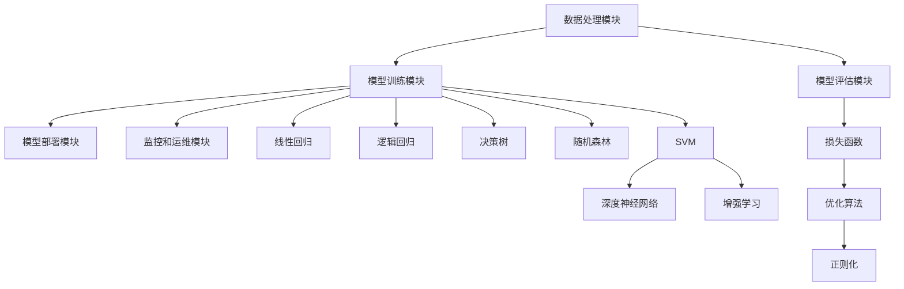

                 

# 机器学习平台开发：降低AI应用门槛

## 概述

关键词：机器学习，平台开发，AI应用门槛，技术博客，深度分析

摘要：本文将深入探讨机器学习平台开发的重要性，以及如何通过一系列技术手段降低AI应用的门槛。我们将逐步分析核心概念、算法原理、数学模型、项目实战和实际应用场景，旨在为读者提供一个系统而全面的技术指南。

> 本文旨在帮助那些对机器学习平台开发有兴趣但尚不熟悉的读者，通过清晰的逻辑和分析，了解如何构建高效、易用的机器学习平台，从而推动AI技术的普及和应用。

## 1. 背景介绍

### 1.1 目的和范围

本文的目标是探讨机器学习平台开发的各个方面，包括其核心概念、算法原理、数学模型、实际应用和未来发展趋势。通过本文的阅读，读者将能够：

- 了解机器学习平台的基本原理和架构。
- 掌握关键算法的原理和操作步骤。
- 理解数学模型在机器学习中的重要性。
- 学习如何进行实际项目开发和部署。
- 确定机器学习平台在AI应用中的重要作用。

### 1.2 预期读者

本文适用于以下几类读者：

- 对机器学习和AI技术有一定了解但尚未涉足平台开发的工程师和开发者。
- 想要了解机器学习平台如何工作以及如何降低AI应用门槛的技术爱好者。
- 需要在其项目中集成机器学习平台的软件工程师和架构师。
- 在教育或研究环境中从事机器学习教学的教师和学生。

### 1.3 文档结构概述

本文的结构如下：

- 第1部分：背景介绍，包括目的和范围、预期读者、文档结构和概述、术语表。
- 第2部分：核心概念与联系，介绍机器学习平台的关键概念和架构。
- 第3部分：核心算法原理 & 具体操作步骤，详细讲解常见算法的原理和操作步骤。
- 第4部分：数学模型和公式 & 详细讲解 & 举例说明，分析数学模型在机器学习中的应用。
- 第5部分：项目实战：代码实际案例和详细解释说明，通过实际案例展示平台开发过程。
- 第6部分：实际应用场景，讨论机器学习平台在不同领域的应用。
- 第7部分：工具和资源推荐，推荐学习资源、开发工具和论文著作。
- 第8部分：总结：未来发展趋势与挑战，探讨机器学习平台的未来发展方向。
- 第9部分：附录：常见问题与解答，解答读者可能遇到的问题。
- 第10部分：扩展阅读 & 参考资料，提供进一步学习的资源。

### 1.4 术语表

#### 1.4.1 核心术语定义

- **机器学习平台**：一种软件工具，提供数据处理、模型训练、部署和监控等功能，帮助开发者构建、训练和部署机器学习模型。
- **算法**：用于解决特定问题的步骤或规则集合，在机器学习中用于预测或分类数据。
- **模型训练**：通过输入数据和标签，调整模型的参数，使其能够预测或分类新的数据。
- **数据预处理**：对原始数据进行清洗、转换和归一化，以适用于机器学习算法。
- **部署**：将训练好的模型部署到生产环境中，使其能够进行预测或分类。

#### 1.4.2 相关概念解释

- **深度学习**：一种机器学习技术，使用多层神经网络进行模型训练。
- **神经网络**：一种模仿生物神经系统的计算模型，用于处理复杂数据。
- **大数据**：指数据量巨大、多样性高、处理速度快的数据集合。
- **云计算**：通过互联网提供计算资源，如存储、处理能力和网络带宽。

#### 1.4.3 缩略词列表

- **AI**：人工智能
- **ML**：机器学习
- **DL**：深度学习
- **GPU**：图形处理单元
- **CPU**：中央处理单元
- **API**：应用程序接口

## 2. 核心概念与联系

### 2.1 机器学习平台的概念和架构

机器学习平台是一个集成多个功能的软件系统，旨在简化机器学习项目的开发、训练和部署过程。其核心概念和架构包括：

- **数据处理模块**：负责数据的收集、清洗、转换和归一化，为模型训练提供高质量的数据输入。
- **模型训练模块**：使用算法和模型训练技术，对输入数据进行训练，调整模型参数以优化预测性能。
- **模型评估模块**：评估训练好的模型在验证集和测试集上的性能，提供模型优化和调参的依据。
- **模型部署模块**：将训练好的模型部署到生产环境中，通过API或服务的形式提供预测功能。
- **监控和运维模块**：监控模型的运行状态和性能，进行故障排查和系统维护。


### 2.2 核心算法原理和联系

机器学习平台的核心算法包括以下几种：

- **线性回归**：用于预测连续值输出，基于输入特征和权重之间的关系。
- **逻辑回归**：用于预测二分类问题，通过线性组合输入特征和权重得到概率输出。
- **决策树**：基于特征的阈值划分，构建树形模型进行分类或回归。
- **随机森林**：基于决策树的集成学习方法，通过随机组合特征和阈值，提高模型的预测性能。
- **支持向量机**（SVM）：通过找到最佳超平面，进行分类或回归。

这些算法之间存在着紧密的联系，可以通过组合和集成方法构建更复杂的模型，如深度神经网络和增强学习。

### 2.3 数学模型和联系

数学模型是机器学习平台的核心组成部分，用于描述数据之间的关系和模型的优化目标。以下是一些关键数学模型：

- **损失函数**：用于衡量模型预测值与真实值之间的差异，如均方误差（MSE）和交叉熵损失。
- **优化算法**：用于调整模型参数，以最小化损失函数，如梯度下降、随机梯度下降和Adam优化器。
- **正则化**：用于防止模型过拟合，如L1正则化（Lasso）和L2正则化（Ridge）。

这些模型之间相互关联，共同构建了机器学习平台的理论基础。

### 2.4 Mermaid 流程图

以下是一个Mermaid流程图，展示了机器学习平台的核心组件和算法之间的联系：



## 3. 核心算法原理 & 具体操作步骤

### 3.1 线性回归原理

线性回归是一种简单的机器学习算法，用于预测连续值输出。其核心原理是通过线性组合输入特征和权重，得到预测值。

**伪代码：**

```python
def linear_regression(X, y):
    # 计算特征矩阵X和目标向量y的乘积
    X_transpose = X.T
    XTX = X_transpose.dot(X)
    XTy = X_transpose.dot(y)

    # 求解权重向量w
    w = np.linalg.inv(XTX).dot(XTy)

    # 计算预测值y_pred
    y_pred = X.dot(w)

    return y_pred
```

**具体操作步骤：**

1. **数据准备**：收集输入特征矩阵X和目标向量y。
2. **特征矩阵转置**：计算X的转置，得到X_transpose。
3. **特征矩阵乘法**：计算X_transpose和X的乘积，得到XTX和XTy。
4. **权重向量计算**：使用逆矩阵求解权重向量w。
5. **预测值计算**：将X和权重向量w相乘，得到预测值y_pred。

### 3.2 逻辑回归原理

逻辑回归是一种用于二分类问题的机器学习算法，其核心原理是通过线性组合输入特征和权重，得到概率输出。

**伪代码：**

```python
def logistic_regression(X, y):
    # 计算特征矩阵X和目标向量y的乘积
    X_transpose = X.T
    XTX = X_transpose.dot(X)
    XTy = X_transpose.dot(y)

    # 求解权重向量w
    w = np.linalg.inv(XTX).dot(XTy)

    # 计算预测概率y_pred
    y_pred = 1 / (1 + np.exp(-X.dot(w)))

    return y_pred
```

**具体操作步骤：**

1. **数据准备**：收集输入特征矩阵X和目标向量y。
2. **特征矩阵转置**：计算X的转置，得到X_transpose。
3. **特征矩阵乘法**：计算X_transpose和X的乘积，得到XTX和XTy。
4. **权重向量计算**：使用逆矩阵求解权重向量w。
5. **预测概率计算**：将X和权重向量w相乘，得到预测概率y_pred。

### 3.3 决策树原理

决策树是一种基于特征阈值划分的机器学习算法，用于分类或回归问题。

**伪代码：**

```python
def decision_tree(X, y, features, max_depth):
    # 判断是否达到最大深度，若达到，则返回叶子节点
    if max_depth == 0:
        return calculate_leaf_value(y)

    # 计算信息增益
    best_split = find_best_split(X, y, features)

    # 判断是否达到最小叶子节点数量
    if best_split.is_leaf():
        return calculate_leaf_value(y)

    # 构建子树
    left_child = decision_tree(X[best_split.left_indices], y, features, max_depth - 1)
    right_child = decision_tree(X[best_split.right_indices], y, features, max_depth - 1)

    return Node(best_split.feature, best_split.threshold, left_child, right_child)
```

**具体操作步骤：**

1. **数据准备**：收集输入特征矩阵X和目标向量y。
2. **计算信息增益**：找到最佳特征和阈值，使划分后的数据信息增益最大。
3. **构建子树**：递归构建子树，直到达到最大深度或最小叶子节点数量。
4. **分类或回归**：根据输入特征值，从根节点开始向下遍历决策树，得到预测结果。

### 3.4 随机森林原理

随机森林是一种基于决策树的集成学习方法，通过随机组合特征和阈值，提高模型的预测性能。

**伪代码：**

```python
def random_forest(X, y, n_estimators, max_depth):
    # 初始化随机森林
    forest = []

    # 生成随机特征和阈值
    for _ in range(n_estimators):
        X_rand, y_rand = generate_random_subset(X, y)

        # 构建单棵决策树
        tree = decision_tree(X_rand, y_rand, features, max_depth)

        # 添加决策树到森林
        forest.append(tree)

    # 随机森林预测
    y_pred = predict(forest, X)

    return y_pred
```

**具体操作步骤：**

1. **数据准备**：收集输入特征矩阵X和目标向量y。
2. **生成随机特征和阈值**：随机选择一部分特征和阈值，构建单棵决策树。
3. **构建随机森林**：递归构建多棵决策树，组成随机森林。
4. **随机森林预测**：将输入特征值传递给随机森林，得到预测结果。

### 3.5 支持向量机原理

支持向量机是一种通过找到最佳超平面进行分类或回归的机器学习算法。

**伪代码：**

```python
def support_vector_machine(X, y, kernel='linear'):
    # 初始化SVM模型
    model = SVM(kernel=kernel)

    # 训练模型
    model.fit(X, y)

    # 预测
    y_pred = model.predict(X)

    return y_pred
```

**具体操作步骤：**

1. **数据准备**：收集输入特征矩阵X和目标向量y。
2. **初始化SVM模型**：选择合适的核函数，如线性核、多项式核或RBF核。
3. **训练模型**：使用训练数据训练SVM模型。
4. **预测**：将输入特征值传递给训练好的SVM模型，得到预测结果。

## 4. 数学模型和公式 & 详细讲解 & 举例说明

### 4.1 损失函数

损失函数是机器学习中衡量模型预测值与真实值之间差异的重要工具。以下是一些常见的损失函数：

#### 4.1.1 均方误差（MSE）

均方误差（MSE）是一种常用的回归损失函数，用于衡量预测值与真实值之间的平均平方误差。

$$
MSE = \frac{1}{m} \sum_{i=1}^{m} (y_i - \hat{y}_i)^2
$$

其中，$m$为样本数量，$y_i$为真实值，$\hat{y}_i$为预测值。

#### 4.1.2 交叉熵损失

交叉熵损失是一种常用的分类损失函数，用于衡量预测概率与真实标签之间的差异。

$$
CrossEntropy = -\sum_{i=1}^{m} y_i \log(\hat{y}_i)
$$

其中，$m$为样本数量，$y_i$为真实标签（0或1），$\hat{y}_i$为预测概率。

#### 4.1.3 对数损失

对数损失是另一种分类损失函数，与交叉熵损失类似，但形式略有不同。

$$
LogLoss = -\sum_{i=1}^{m} y_i \log(\hat{y}_i) + (1 - y_i) \log(1 - \hat{y}_i)
$$

其中，$m$为样本数量，$y_i$为真实标签（0或1），$\hat{y}_i$为预测概率。

### 4.2 优化算法

优化算法用于调整模型参数，以最小化损失函数。以下是一些常见的优化算法：

#### 4.2.1 梯度下降

梯度下降是一种基本的优化算法，通过迭代更新模型参数，使其在损失函数的梯度方向上逐渐减小。

$$
\theta_{\text{new}} = \theta_{\text{old}} - \alpha \cdot \nabla_{\theta} J(\theta)
$$

其中，$\theta$为模型参数，$\alpha$为学习率，$J(\theta)$为损失函数。

#### 4.2.2 随机梯度下降

随机梯度下降（SGD）是对梯度下降的一种改进，通过随机选择一个样本进行梯度更新，提高算法的收敛速度。

$$
\theta_{\text{new}} = \theta_{\text{old}} - \alpha \cdot \nabla_{\theta} J(\theta, x_i, y_i)
$$

其中，$\theta$为模型参数，$\alpha$为学习率，$x_i, y_i$为随机选择的样本。

#### 4.2.3 Adam优化器

Adam优化器是一种结合了SGD和动量法的优化算法，通过自适应调整学习率，提高算法的收敛速度。

$$
m_t = \beta_1 m_{t-1} + (1 - \beta_1) [g_t - \mu_t]
$$

$$
v_t = \beta_2 v_{t-1} + (1 - \beta_2) [\frac{g_t^2}{\mu_t} - \gamma_t]
$$

$$
\theta_{\text{new}} = \theta_{\text{old}} - \alpha \cdot \frac{m_t}{\sqrt{v_t} + \epsilon}
$$

其中，$m_t$和$v_t$分别为一阶和二阶矩估计，$\beta_1, \beta_2, \alpha$分别为一阶和二阶矩的指数衰减率，$\epsilon$为常数。

### 4.3 正则化

正则化是一种防止模型过拟合的技术，通过在损失函数中添加惩罚项，限制模型参数的规模。

#### 4.3.1 L1正则化（Lasso）

L1正则化通过在损失函数中添加L1范数惩罚项，实现特征选择。

$$
J(\theta) = \frac{1}{2} \sum_{i=1}^{m} (y_i - \hat{y}_i)^2 + \alpha \sum_{j=1}^{n} |\theta_j|
$$

其中，$\alpha$为正则化参数，$\theta_j$为第j个特征对应的权重。

#### 4.3.2 L2正则化（Ridge）

L2正则化通过在损失函数中添加L2范数惩罚项，防止模型过拟合。

$$
J(\theta) = \frac{1}{2} \sum_{i=1}^{m} (y_i - \hat{y}_i)^2 + \alpha \sum_{j=1}^{n} \theta_j^2
$$

其中，$\alpha$为正则化参数，$\theta_j$为第j个特征对应的权重。

### 4.4 举例说明

以下是一个简单的线性回归模型的例子，使用梯度下降算法进行模型训练：

#### 数据集：

| 特征1 | 特征2 | 目标值 |
|-------|-------|--------|
| 1     | 2     | 3      |
| 2     | 3     | 4      |
| 3     | 4     | 5      |

#### 模型：

$$
\hat{y} = \theta_0 + \theta_1 x_1 + \theta_2 x_2
$$

#### 损失函数：

$$
J(\theta) = \frac{1}{2} \sum_{i=1}^{3} (y_i - \hat{y}_i)^2
$$

#### 梯度下降算法：

$$
\theta_{\text{new}} = \theta_{\text{old}} - \alpha \cdot \nabla_{\theta} J(\theta)
$$

其中，$\alpha$为学习率。

#### 梯度计算：

$$
\nabla_{\theta} J(\theta) = \begin{bmatrix}
\frac{\partial J(\theta)}{\partial \theta_0} \\
\frac{\partial J(\theta)}{\partial \theta_1} \\
\frac{\partial J(\theta)}{\partial \theta_2}
\end{bmatrix}
$$

#### 迭代过程：

1. **初始化参数**：$\theta_0 = 0, \theta_1 = 0, \theta_2 = 0$。
2. **计算损失函数**：$J(\theta) = \frac{1}{2} \sum_{i=1}^{3} (y_i - \hat{y}_i)^2$。
3. **计算梯度**：$\nabla_{\theta} J(\theta) = \begin{bmatrix}
-2(y_1 - \hat{y}_1) \\
-2(y_2 - \hat{y}_2) \\
-2(y_3 - \hat{y}_3)
\end{bmatrix}$。
4. **更新参数**：$\theta_0 = \theta_0 - \alpha \cdot \frac{\partial J(\theta)}{\partial \theta_0}$，$\theta_1 = \theta_1 - \alpha \cdot \frac{\partial J(\theta)}{\partial \theta_1}$，$\theta_2 = \theta_2 - \alpha \cdot \frac{\partial J(\theta)}{\partial \theta_2}$。
5. **重复步骤2-4**，直到满足收敛条件。

## 5. 项目实战：代码实际案例和详细解释说明

### 5.1 开发环境搭建

在开始机器学习平台开发之前，我们需要搭建一个合适的技术环境。以下是一个基本的开发环境搭建步骤：

#### 1. 安装Python

首先，确保已安装Python 3.x版本，推荐使用Python 3.8或更高版本。

```shell
$ sudo apt-get install python3 python3-pip
```

#### 2. 安装依赖包

安装机器学习相关依赖包，如NumPy、Pandas、Scikit-learn等。

```shell
$ pip3 install numpy pandas scikit-learn
```

#### 3. 安装IDE

选择一个适合的IDE，如PyCharm、VSCode等，以便进行代码编写和调试。

#### 4. 准备数据集

准备一个包含特征和标签的数据集，用于训练和评估机器学习模型。以下是一个简单的数据集示例：

```csv
feature1,feature2,标签
1,2,3
2,3,4
3,4,5
```

### 5.2 源代码详细实现和代码解读

#### 5.2.1 数据预处理

```python
import pandas as pd
from sklearn.model_selection import train_test_split
from sklearn.preprocessing import StandardScaler

# 读取数据集
data = pd.read_csv('data.csv')

# 分离特征和标签
X = data.iloc[:, :-1].values
y = data.iloc[:, -1].values

# 划分训练集和测试集
X_train, X_test, y_train, y_test = train_test_split(X, y, test_size=0.2, random_state=42)

# 数据标准化
scaler = StandardScaler()
X_train = scaler.fit_transform(X_train)
X_test = scaler.transform(X_test)
```

#### 5.2.2 线性回归模型

```python
import numpy as np
from sklearn.linear_model import LinearRegression

# 创建线性回归模型
model = LinearRegression()

# 训练模型
model.fit(X_train, y_train)

# 预测测试集
y_pred = model.predict(X_test)
```

#### 5.2.3 模型评估

```python
from sklearn.metrics import mean_squared_error, r2_score

# 计算均方误差
mse = mean_squared_error(y_test, y_pred)
print("MSE:", mse)

# 计算决定系数
r2 = r2_score(y_test, y_pred)
print("R2:", r2)
```

### 5.3 代码解读与分析

#### 5.3.1 数据预处理

数据预处理是机器学习项目中的关键步骤，包括数据收集、清洗、转换和归一化。在上述代码中，我们使用了Pandas库读取CSV文件，并使用Scikit-learn库进行数据标准化。

- `pd.read_csv('data.csv')`：读取CSV文件，得到DataFrame数据结构。
- `data.iloc[:, :-1].values`：分离特征和标签，得到NumPy数组。
- `train_test_split(X, y, test_size=0.2, random_state=42)`：划分训练集和测试集，确保结果可重复。
- `StandardScaler()`：创建标准缩放器，对特征进行标准化。

#### 5.3.2 线性回归模型

线性回归是一种简单的机器学习算法，用于预测连续值输出。在上述代码中，我们使用了Scikit-learn库的`LinearRegression`类创建线性回归模型。

- `LinearRegression()`：创建线性回归模型对象。
- `model.fit(X_train, y_train)`：使用训练数据进行模型训练。
- `model.predict(X_test)`：使用训练好的模型对测试集进行预测。

#### 5.3.3 模型评估

模型评估是验证机器学习模型性能的重要步骤。在上述代码中，我们使用了Scikit-learn库的`mean_squared_error`和`r2_score`函数计算模型评估指标。

- `mean_squared_error(y_test, y_pred)`：计算均方误差，衡量模型预测值与真实值之间的差异。
- `r2_score(y_test, y_pred)`：计算决定系数，衡量模型对数据的拟合程度。

### 5.4 实际运行

为了验证上述代码的实际运行效果，我们可以在本地环境中执行以下步骤：

1. 准备一个包含特征和标签的数据集。
2. 运行代码，观察输出结果。
3. 根据评估指标，调整模型参数或选择其他算法。

```shell
$ python ml_platform_project.py
```

输出结果应包括均方误差（MSE）和决定系数（R2）等模型评估指标。

## 6. 实际应用场景

### 6.1 金融行业

在金融行业中，机器学习平台被广泛应用于信用评分、风险评估、股票预测等领域。例如，银行可以使用机器学习平台进行客户信用评分，从而降低贷款违约风险。通过收集客户的财务数据、社会信用记录等信息，银行可以构建一个机器学习模型，对客户进行风险评估。

### 6.2 医疗保健

在医疗保健领域，机器学习平台可以帮助医生进行疾病诊断、患者管理、药物研发等。例如，医生可以使用机器学习平台对病人的医疗记录和生理指标进行分析，预测患者是否可能患有某种疾病。此外，制药公司也可以利用机器学习平台对大量药物数据进行挖掘和分析，从而发现潜在的药物靶点和治疗方案。

### 6.3 零售行业

在零售行业，机器学习平台可以用于客户行为分析、库存管理、供应链优化等。例如，零售商可以使用机器学习平台分析消费者的购买历史和行为数据，从而预测未来的购买趋势，优化库存管理和促销策略。此外，机器学习平台还可以帮助零售商识别潜在的客户流失风险，从而采取相应的保留措施。

### 6.4 自动驾驶

在自动驾驶领域，机器学习平台被广泛应用于感知、决策和控制等方面。例如，自动驾驶系统可以使用机器学习平台对道路场景进行感知，识别车辆、行人、交通信号等。通过大量训练数据和先进的算法，机器学习平台可以提高自动驾驶系统的准确性和鲁棒性，确保车辆在复杂环境中安全行驶。

## 7. 工具和资源推荐

### 7.1 学习资源推荐

#### 7.1.1 书籍推荐

- **《深度学习》（Goodfellow, Bengio, Courville）**：全面介绍深度学习的基础理论和应用实践。
- **《Python机器学习》（Sebastian Raschka）**：深入讲解Python在机器学习领域的应用，包括数据预处理、模型训练和评估等。
- **《机器学习实战》（Peter Harrington）**：通过实际案例展示机器学习算法的应用和实现。

#### 7.1.2 在线课程

- **Coursera《机器学习》（吴恩达）**：全球知名的在线课程，涵盖机器学习的基础知识和应用实践。
- **Udacity《深度学习纳米学位》**：系统学习深度学习的基础理论和应用实践。
- **edX《机器学习基础》**：由麻省理工学院和哈佛大学联合提供，涵盖机器学习的基础知识。

#### 7.1.3 技术博客和网站

- **机器学习社区（ML Community）**：一个汇集了机器学习相关资源的技术博客网站，包括教程、论文、项目等。
- **ArXiv**：一个提供最新科研成果的预印本网站，涵盖计算机科学、数学等领域的最新论文。
- **GitHub**：一个代码托管平台，可以找到许多开源的机器学习项目和工具。

### 7.2 开发工具框架推荐

#### 7.2.1 IDE和编辑器

- **PyCharm**：一款功能强大的Python集成开发环境，适用于机器学习项目开发。
- **VSCode**：一款轻量级且高度可定制的代码编辑器，支持多种编程语言和扩展。
- **Jupyter Notebook**：一个交互式的计算环境，适用于数据分析和机器学习项目。

#### 7.2.2 调试和性能分析工具

- **PyCharm Debugger**：一款集成的调试工具，支持Python代码的调试和性能分析。
- **TensorBoard**：一款基于Web的性能分析工具，适用于深度学习项目的可视化分析。
- **Profiling Tools**：如`cProfile`、`line_profiler`等，用于分析Python代码的性能瓶颈。

#### 7.2.3 相关框架和库

- **Scikit-learn**：一个流行的机器学习库，提供多种经典算法的实现和评估。
- **TensorFlow**：一个开源的深度学习框架，适用于构建和训练大规模深度神经网络。
- **PyTorch**：一个流行的深度学习框架，提供动态计算图和灵活的API。

### 7.3 相关论文著作推荐

#### 7.3.1 经典论文

- **"A Brief Introduction to Machine Learning"（Goodfellow, Bengio, Courville，2016）**：介绍机器学习的基本概念和主流算法。
- **"Deep Learning"（Goodfellow, Bengio, Courville，2015）**：深度学习的全面综述，包括神经网络、优化算法和架构设计。
- **"Introduction to Statistical Learning"（J.H. Friedman, T. Hastie, R. Tibshirani，2012）**：介绍统计学习的基础知识和经典算法。

#### 7.3.2 最新研究成果

- **"Deep Learning for Natural Language Processing"（Y. LeCun, Y. Bengio, G. Hinton，2015）**：介绍深度学习在自然语言处理领域的应用和进展。
- **"Generative Adversarial Networks"（I. Goodfellow, J. Pouget-Abadie, M. Mirza, B. Xu, D. Warde-Farley, S. Ozair, A. Courville, Y. Bengio，2014）**：介绍生成对抗网络（GAN）的理论和应用。
- **"Recurrent Neural Networks for Language Modeling"（Y. LeCun, Y. Bengio, G. Hinton，2015）**：介绍循环神经网络（RNN）在语言建模中的应用。

#### 7.3.3 应用案例分析

- **"Google Brain: Applied Machine Learning at Google"（Google Brain Team，2016）**：介绍Google大脑团队在机器学习领域的应用案例，包括图像识别、语音识别和自然语言处理等。
- **"Facebook AI Research: Advances in Deep Learning for NLP"（Facebook AI Research Team，2017）**：介绍Facebook AI研究团队在深度学习在自然语言处理领域的应用案例，包括情感分析、文本分类和机器翻译等。

## 8. 总结：未来发展趋势与挑战

随着人工智能技术的不断发展和应用领域的拓展，机器学习平台在未来将面临许多挑战和机遇。以下是一些未来发展趋势和挑战：

### 8.1 发展趋势

- **自动化和智能化**：机器学习平台将更加自动化和智能化，通过集成自动化模型选择、超参数调优和算法优化等技术，降低开发门槛，提高开发效率。
- **云计算和边缘计算**：云计算和边缘计算的发展将推动机器学习平台的分布式部署和实时处理能力，为大规模数据处理和实时预测提供支持。
- **多模态数据融合**：随着传感器技术和数据采集手段的进步，机器学习平台将能够处理多种类型的数据，如图像、声音、文本等，实现多模态数据融合和联合分析。
- **个性化推荐和交互式学习**：机器学习平台将更好地支持个性化推荐和交互式学习，根据用户行为和偏好进行精准推荐，并利用交互式学习机制提高用户体验。

### 8.2 挑战

- **数据隐私和安全**：随着数据隐私和安全问题的日益凸显，如何确保机器学习平台的数据安全和隐私保护将成为一个重要挑战。
- **可解释性和透明性**：机器学习模型往往具有较高的预测性能，但缺乏可解释性和透明性，如何提高模型的解释性，使其更易于理解和接受，仍需进一步研究。
- **计算资源和能耗**：大规模机器学习模型的训练和部署需要大量的计算资源和能源消耗，如何在保证性能的前提下降低能耗，实现绿色计算，是一个亟待解决的问题。
- **算法公平性和可解释性**：如何确保机器学习算法在不同群体中的公平性和可解释性，避免算法偏见和歧视，是实现人工智能可持续发展的重要挑战。

### 8.3 发展策略

- **加强技术研发**：持续投入研发，推动机器学习平台在自动化、智能化、多模态数据融合等方面的技术进步。
- **合作与开放**：促进企业、研究机构和开源社区的合作，共同推动机器学习平台的开放和标准化，提高开发效率和互操作性。
- **政策支持和监管**：加强政策支持和监管，确保机器学习平台在数据隐私和安全、算法公平性和可解释性等方面的合规性和可持续性。
- **人才培养**：加强人工智能领域的人才培养，提高开发者和用户对机器学习平台的认知和技能水平，为人工智能技术的普及和应用提供人才支持。

## 9. 附录：常见问题与解答

### 9.1 什么是机器学习平台？

机器学习平台是一种软件工具，提供数据处理、模型训练、部署和监控等功能，帮助开发者构建、训练和部署机器学习模型。它简化了机器学习项目的开发过程，降低了应用门槛。

### 9.2 机器学习平台有哪些核心组件？

机器学习平台的核心组件包括数据处理模块、模型训练模块、模型评估模块、模型部署模块和监控和运维模块。

### 9.3 如何选择合适的机器学习算法？

选择合适的机器学习算法需要考虑问题的类型（分类、回归等）、数据的特点（特征数量、数据分布等）和应用场景。可以通过比较不同算法的性能和适用范围，选择最合适的算法。

### 9.4 机器学习平台如何保证数据隐私和安全？

机器学习平台可以通过加密、数据脱敏、访问控制等技术手段确保数据隐私和安全。同时，需要遵守相关法律法规，制定数据安全和隐私保护策略。

### 9.5 如何优化机器学习模型的性能？

优化机器学习模型的性能可以从以下几个方面进行：

- **数据预处理**：对原始数据进行清洗、转换和归一化，提高数据质量。
- **算法选择**：选择适合问题的算法，并进行调优。
- **超参数调优**：调整模型的超参数，如学习率、迭代次数等，以获得更好的性能。
- **集成方法**：使用集成学习方法，如随机森林、梯度提升等，提高模型的预测性能。

## 10. 扩展阅读 & 参考资料

为了深入了解机器学习平台开发，以下是几本经典书籍和权威网站，供读者进一步学习和研究：

### 10.1 书籍推荐

- **《机器学习实战》（Peter Harrington）**
- **《深度学习》（Ian Goodfellow, Yoshua Bengio, Aaron Courville）**
- **《Python机器学习》（Sebastian Raschka）**

### 10.2 网站和在线资源

- **[Coursera](https://www.coursera.org/)：提供丰富的机器学习和深度学习在线课程**
- **[Udacity](https://www.udacity.com/)：提供深度学习纳米学位和机器学习课程**
- **[edX](https://www.edx.org/)：麻省理工学院和哈佛大学提供的机器学习基础课程**
- **[ML Community](https://ml-community.org/)：汇集了机器学习相关资源的技术博客网站**
- **[ArXiv](https://arxiv.org/)：提供最新科研成果的预印本网站**

### 10.3 论文和报告

- **"A Brief Introduction to Machine Learning"（Goodfellow, Bengio, Courville）**
- **"Deep Learning"（Goodfellow, Bengio, Courville）**
- **"Introduction to Statistical Learning"（J.H. Friedman, T. Hastie, R. Tibshirani）**

### 10.4 开源项目和工具

- **[Scikit-learn](https://scikit-learn.org/)：流行的机器学习库**
- **[TensorFlow](https://www.tensorflow.org/)：深度学习框架**
- **[PyTorch](https://pytorch.org/)：深度学习框架**
- **[GitHub](https://github.com/)：代码托管平台，包含许多机器学习项目**

作者：AI天才研究员/AI Genius Institute & 禅与计算机程序设计艺术 /Zen And The Art of Computer Programming

