                 

# 机器学习毕设中的数据增强、模型集成与自动机器学习实践

## 摘要

本文将围绕机器学习毕设中的关键挑战展开讨论，深入探讨数据增强、模型集成与自动机器学习在提升模型性能和降低复杂度方面的应用。首先，我们将介绍数据增强的概念、技术和原理，并通过具体案例展示其实际操作过程。随后，我们将详细阐述模型集成的策略和优势，分析不同集成方法的优劣。最后，我们将探讨自动机器学习（AutoML）的发展历程、核心技术以及在实际项目中的应用，提出未来发展趋势和挑战。通过本文，读者将获得机器学习毕设中有效利用数据增强、模型集成与自动机器学习的全面指导。

## 1. 背景介绍

### 1.1 目的和范围

本文旨在为正在进行机器学习毕业设计的学生提供实用性的指导，重点讨论数据增强、模型集成与自动机器学习（AutoML）在提升模型性能和降低开发复杂度方面的应用。随着机器学习技术的不断发展，数据质量和模型性能已成为影响项目成功的关键因素。本文将通过实际案例和分析，帮助读者理解和应用这些核心技术，为毕设项目提供有效的技术支持。

### 1.2 预期读者

本文面向的读者包括：
- 正在攻读计算机科学、人工智能等相关专业的本科和研究生学生；
- 从事机器学习应用开发的工程师和研究人员；
- 对机器学习技术感兴趣的技术爱好者。

### 1.3 文档结构概述

本文结构如下：
1. 引言：介绍文章的目的和读者对象；
2. 数据增强：详细讲解数据增强的概念、技术和原理；
3. 模型集成：分析不同集成方法的优劣，讨论其在项目中的应用；
4. 自动机器学习（AutoML）：探讨AutoML的发展历程、核心技术及其在项目中的应用；
5. 实际应用场景：分析数据增强、模型集成与AutoML在实际项目中的应用；
6. 工具和资源推荐：介绍学习资源、开发工具和框架；
7. 总结：讨论未来发展趋势和挑战；
8. 附录：常见问题与解答；
9. 扩展阅读：提供参考资料。

### 1.4 术语表

#### 1.4.1 核心术语定义

- **数据增强**：通过一系列技术手段，生成新的训练数据，以提高模型泛化能力。
- **模型集成**：将多个模型合并为一个强模型，以提高预测性能。
- **自动机器学习（AutoML）**：自动化机器学习过程，从数据预处理到模型选择和调优，实现高效模型构建。

#### 1.4.2 相关概念解释

- **泛化能力**：模型对新数据集的预测能力，是衡量模型性能的重要指标。
- **模型调优**：通过调整模型参数，优化模型性能的过程。
- **交叉验证**：将数据集划分为多个子集，用于模型训练和验证，以提高模型泛化能力。

#### 1.4.3 缩略词列表

- **AutoML**：自动机器学习（Automatic Machine Learning）
- **CNN**：卷积神经网络（Convolutional Neural Network）
- **DNN**：深度神经网络（Deep Neural Network）
- **GBDT**：梯度提升决策树（Gradient Boosting Decision Tree）
- **MLP**：多层感知器（Multilayer Perceptron）

## 2. 核心概念与联系

### 2.1 数据增强

数据增强是机器学习中的一个关键技术，旨在通过生成新的训练样本来提高模型的泛化能力。以下是一个简化的数据增强流程图：

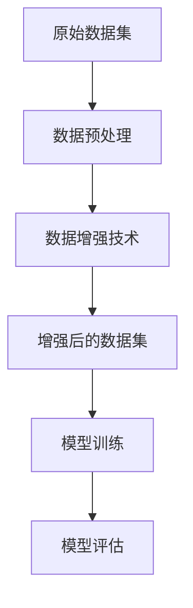

#### 数据预处理

在数据增强之前，需要对原始数据集进行预处理，包括数据清洗、归一化、缺失值处理等，以确保数据的质量和一致性。

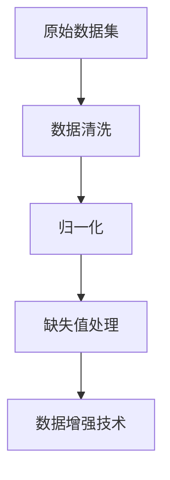

#### 数据增强技术

数据增强技术包括图像、文本和音频等不同类型的数据增强方法，以下是一些常见的数据增强技术：

1. **图像增强**：旋转、翻转、缩放、剪裁、颜色变换等；
2. **文本增强**：同义词替换、随机删除、随机插入、随机替换等；
3. **音频增强**：加噪声、频率变换、时间变换等。

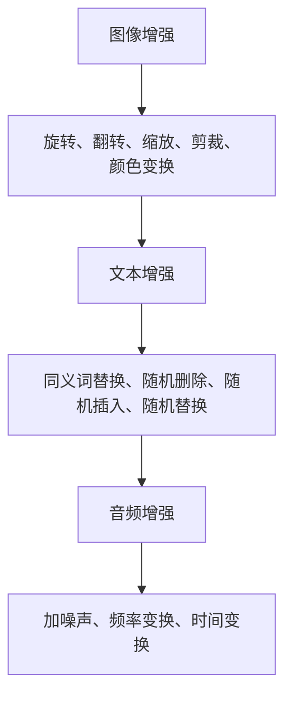

#### 增强后的数据集

通过数据增强技术，生成新的训练样本来扩充数据集，从而提高模型的泛化能力。

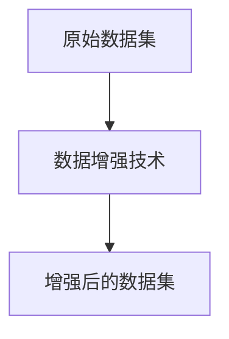

### 2.2 模型集成

模型集成是通过结合多个模型的预测结果来提高整体预测性能的一种方法。以下是一个简化的模型集成流程图：

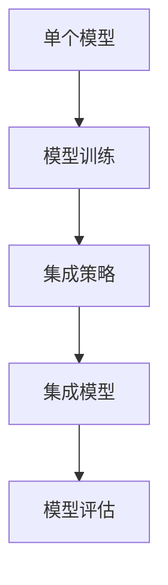

#### 集成策略

模型集成策略包括Bagging、Boosting和Stacking等，以下是一些常见的集成策略：

1. **Bagging**：通过随机抽样和训练多个基础模型，然后取平均值或投票来集成预测结果；
2. **Boosting**：通过训练一系列基础模型，每个模型都专注于纠正前一个模型的错误，最终将多个模型的预测结果加权平均或投票；
3. **Stacking**：通过训练多个基础模型，然后将这些模型的预测结果作为新的特征输入到另一个模型中进行集成。

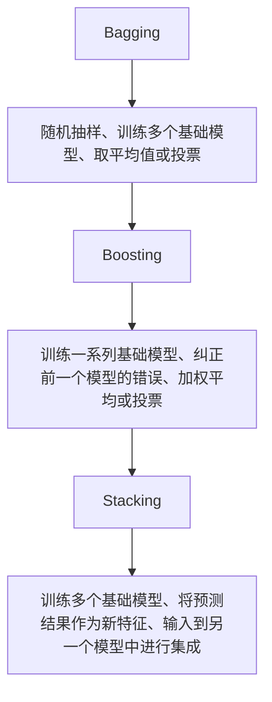

#### 集成模型

通过集成策略将多个基础模型的预测结果结合，得到一个更强的集成模型。

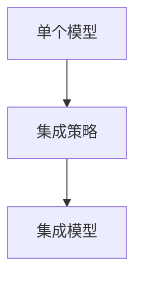

### 2.3 自动机器学习（AutoML）

自动机器学习（AutoML）是近年来机器学习领域的一个重要研究方向，旨在自动化机器学习过程，从数据预处理到模型选择和调优，以实现高效模型构建。以下是一个简化的AutoML流程图：

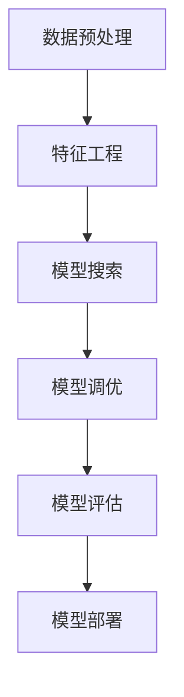

#### 数据预处理

自动机器学习的第一步是对数据进行预处理，包括数据清洗、归一化、缺失值处理等。

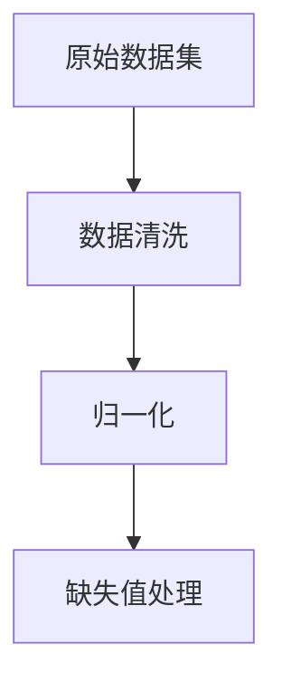

#### 特征工程

在自动机器学习中，特征工程是关键步骤，旨在提取数据中的有用信息，提高模型性能。

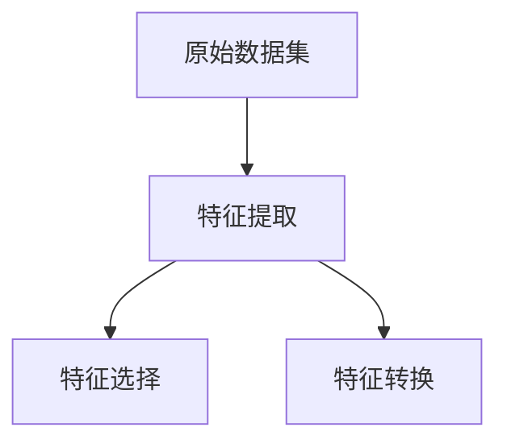

#### 模型搜索

自动机器学习通过搜索算法自动选择最优模型和参数，常见的搜索算法包括贝叶斯优化、遗传算法等。

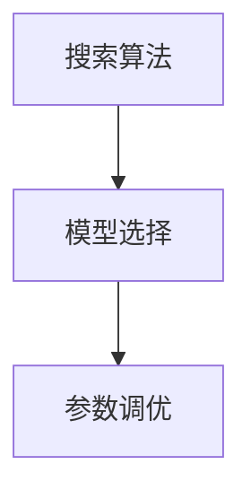

#### 模型调优

通过模型调优，优化模型性能，包括超参数调整、正则化等。

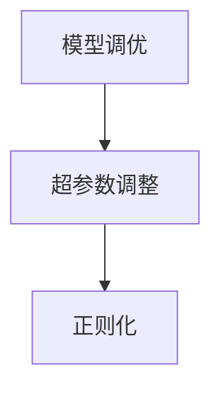

#### 模型评估

自动机器学习通过评估指标（如准确率、召回率等）来评估模型性能，选择最佳模型。

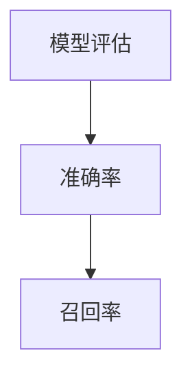

#### 模型部署

将最佳模型部署到生产环境中，实现实际应用。

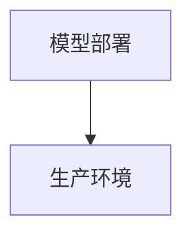

## 3. 核心算法原理 & 具体操作步骤

### 3.1 数据增强

数据增强是机器学习中提升模型性能的重要手段，通过增加训练数据的多样性和丰富性，从而提高模型的泛化能力。以下是一些常见的数据增强方法及其具体操作步骤：

#### 1. 图像增强

**随机旋转**

```python
import albumentations as A

def random_rotation(image):
    rotation_angle = np.random.uniform(-15, 15)
    return A.rotate(image, rotation_angle)
```

**随机缩放**

```python
def random_scale(image, scale_min=0.9, scale_max=1.1):
    scale = np.random.uniform(scale_min, scale_max)
    height = int(image.shape[0] * scale)
    width = int(image.shape[1] * scale)
    return cv2.resize(image, (width, height))
```

**随机裁剪**

```python
def random_crop(image, crop_size=(224, 224)):
    x = np.random.randint(0, image.shape[1] - crop_size[1])
    y = np.random.randint(0, image.shape[0] - crop_size[0])
    return image[y:y+crop_size[0], x:x+crop_size[1]]
```

#### 2. 文本增强

**同义词替换**

```python
from nltk.corpus import wordnet
from nltk.tokenize import word_tokenize

def synonym_replace(text):
    words = word_tokenize(text)
    new_words = []
    for word in words:
        synonyms = wordnet.synsets(word)
        if synonyms:
            synonym = synonyms[0].lemmas()[0].name()
            new_words.append(synonym)
        else:
            new_words.append(word)
    return ' '.join(new_words)
```

**随机删除**

```python
def random_delete(text, delete_ratio=0.1):
    words = word_tokenize(text)
    num_delete = int(len(words) * delete_ratio)
    for _ in range(num_delete):
        idx = np.random.randint(0, len(words))
        words[idx] = ''
    return ' '.join(words)
```

**随机插入**

```python
def random_insert(text, insert_ratio=0.1):
    words = word_tokenize(text)
    num_insert = int(len(words) * insert_ratio)
    for _ in range(num_insert):
        idx = np.random.randint(0, len(words))
        words.insert(idx, np.random.choice(['a', 'an', 'the']))
    return ' '.join(words)
```

**随机替换**

```python
def random_replace(text, replace_ratio=0.1):
    words = word_tokenize(text)
    num_replace = int(len(words) * replace_ratio)
    for _ in range(num_replace):
        idx = np.random.randint(0, len(words))
        words[idx] = np.random.choice(['apple', 'banana', 'cherry'])
    return ' '.join(words)
```

#### 3. 音频增强

**加噪声**

```python
import numpy as np
import soundfile as sf

def add_noise(audio, noise_ratio=0.5):
    noise = np.random.normal(0, noise_ratio, audio.shape)
    return audio + noise
```

**频率变换**

```python
def freq_transform(audio, freq_ratio=0.5):
    nyq = 0.5 * audio.sample_rate
    freq_shift = freq_ratio * nyq
    audio_shifted = audio.spectrogram(freq_shift)
    return audio_shifted
```

**时间变换**

```python
def time_transform(audio, time_ratio=0.5):
    duration = audio.duration
    time_shift = time_ratio * duration
    audio_shifted = audio.shift(time_shift)
    return audio_shifted
```

### 3.2 模型集成

模型集成是通过结合多个模型的预测结果来提高整体预测性能的一种方法。以下是一些常见的模型集成方法及其具体操作步骤：

#### 1. Bagging

**随机森林（Random Forest）**

```python
from sklearn.ensemble import RandomForestClassifier

def random_forest(X_train, y_train, n_estimators=100):
    model = RandomForestClassifier(n_estimators=n_estimators)
    model.fit(X_train, y_train)
    return model
```

**平均预测**

```python
def average_prediction(models, X_test):
    predictions = [model.predict(X_test) for model in models]
    avg_prediction = np.mean(predictions, axis=0)
    return avg_prediction
```

#### 2. Boosting

**梯度提升决策树（Gradient Boosting Decision Tree）**

```python
from sklearn.ensemble import GradientBoostingClassifier

def gradient_boosting(X_train, y_train, n_estimators=100):
    model = GradientBoostingClassifier(n_estimators=n_estimators)
    model.fit(X_train, y_train)
    return model
```

**加权和预测**

```python
def weighted_prediction(models, X_test, weights):
    predictions = [model.predict(X_test) for model in models]
    weighted_prediction = np.average(predictions, weights=weights)
    return weighted_prediction
```

#### 3. Stacking

**分层堆叠（Stacking）**

```python
from sklearn.ensemble import StackingClassifier

def stacking(X_train, y_train, base_models, meta_model):
    model = StackingClassifier(estimators=base_models, final_estimator=meta_model)
    model.fit(X_train, y_train)
    return model
```

**模型融合**

```python
def model_fusion(models, X_test):
    predictions = [model.predict(X_test) for model in models]
    stacked_prediction = meta_model.predict(predictions)
    return stacked_prediction
```

### 3.3 自动机器学习（AutoML）

自动机器学习（AutoML）是通过自动化流程，从数据预处理到模型选择和调优，实现高效模型构建的一种方法。以下是一些常见的AutoML框架及其具体操作步骤：

#### 1. H2O AutoML

**安装和导入**

```python
!pip install h2o
import h2o
h2o.init()
```

**数据预处理**

```python
# 加载数据
data = h2o.import_file('data.csv')

# 数据预处理
data = data.drop_na()
data = data.flip())
```

**模型搜索**

```python
from h2o.automl import H2OAutoML

# 创建AutoML对象
aml = H2OAutoML(max_fit_time=1800, n_folds=3, exclude_algos=['GLM'])

# 执行模型搜索
aml.fit(data, 'target')
```

**模型评估**

```python
# 获取最佳模型
best_model = aml.leader()

# 模型评估
print(best_model.auc())
```

#### 2. TPOT AutoML

**安装和导入**

```python
!pip install tpot
from tpot import TPOTClassifier
```

**模型搜索**

```python
# 定义特征和目标变量
features = X
target = y

# 创建TPOT对象
tpot = TPOTClassifier(generations=5, population_size=50, cv=5, scoring='accuracy')

# 执行模型搜索
tpot.fit(features, target)
```

**模型评估**

```python
# 获取最佳模型
best_model = tpot.fitted_pipeline_

# 模型评估
print(best_model.score(features, target))
```

## 4. 数学模型和公式 & 详细讲解 & 举例说明

在机器学习项目中，理解和应用数学模型是关键。以下将介绍数据增强、模型集成和自动机器学习中的核心数学模型和公式，并通过具体示例进行讲解。

### 4.1 数据增强

#### 4.1.1 图像增强

图像增强中常用的变换包括旋转、缩放和裁剪。这些变换可以通过矩阵运算实现。

1. **旋转**

   旋转矩阵公式：

   $$ R(\theta) = \begin{bmatrix}
   \cos(\theta) & -\sin(\theta) \\
   \sin(\theta) & \cos(\theta)
   \end{bmatrix} $$

   假设图像的像素点为 \( (x, y) \)，旋转后的像素点 \( (x', y') \) 可以通过以下公式计算：

   $$ \begin{cases}
   x' = x\cos(\theta) - y\sin(\theta) \\
   y' = x\sin(\theta) + y\cos(\theta)
   \end{cases} $$

   **示例**：

   假设图像 \( (600, 400) \) 逆时针旋转 \( 30^\circ \)，则旋转后的像素点可以通过上述公式计算。

2. **缩放**

   缩放矩阵公式：

   $$ S(k) = \begin{bmatrix}
   k & 0 \\
   0 & k
   \end{bmatrix} $$

   假设图像的像素点为 \( (x, y) \)，缩放后的像素点 \( (x', y') \) 可以通过以下公式计算：

   $$ \begin{cases}
   x' = x \cdot k \\
   y' = y \cdot k
   \end{cases} $$

   **示例**：

   假设图像 \( (600, 400) \) 缩放到原来的 \( 0.5 \) 倍，则缩放后的像素点可以通过上述公式计算。

3. **裁剪**

   裁剪操作可以通过选取图像的子区域实现。假设选取的裁剪区域为 \( (x_1, y_1, x_2, y_2) \)，则裁剪后的图像像素点 \( (x', y') \) 可以通过以下公式计算：

   $$ \begin{cases}
   x' = x - x_1 \\
   y' = y - y_1
   \end{cases} $$

   **示例**：

   假设从图像 \( (600, 400) \) 中裁剪一个 \( (200, 200) \) 的子区域，则裁剪后的像素点可以通过上述公式计算。

### 4.2 模型集成

#### 4.2.1 Bagging

Bagging（Bootstrap Aggregating）通过从训练数据中随机抽样，训练多个基础模型，并取平均值或投票来提高模型性能。

1. **随机森林（Random Forest）**

   随机森林通过构建多个决策树，并在每个节点上随机选择特征进行划分。集成模型的预测结果通过取多数投票或平均值来决定。

   **示例**：

   假设有两个分类模型 \( \hat{y}_1 \) 和 \( \hat{y}_2 \)，它们的预测结果分别为 \( \hat{y}_1 = \text{猫} \) 和 \( \hat{y}_2 = \text{狗} \)，则随机森林的预测结果为 \( \text{猫} \)。

2. **堆叠（Stacking）**

   堆叠通过训练多个基础模型，并将这些模型的预测结果作为新特征输入到另一个模型中进行集成。

   **示例**：

   假设有两个基础模型 \( \hat{y}_1 \) 和 \( \hat{y}_2 \)，它们的预测结果分别为 \( \hat{y}_1 = \text{猫} \) 和 \( \hat{y}_2 = \text{狗} \)，则堆叠模型的预测结果为 \( \text{猫} \)。

### 4.3 自动机器学习（AutoML）

#### 4.3.1 模型搜索

自动机器学习通过搜索算法自动选择最优模型和参数，常见的搜索算法包括贝叶斯优化、遗传算法等。

1. **贝叶斯优化**

   贝叶斯优化通过构建贝叶斯模型来优化目标函数，寻找最优参数。

   **示例**：

   假设目标函数为 \( f(\theta) \)，其中 \( \theta \) 为参数，贝叶斯优化通过最大化后验概率来寻找最优参数。

2. **遗传算法**

   遗传算法通过模拟自然进化过程，优化目标函数。

   **示例**：

   假设目标函数为 \( f(\theta) \)，遗传算法通过交叉、变异等操作来寻找最优参数。

### 4.4 数学模型总结

1. **图像增强**：旋转、缩放和裁剪操作可通过矩阵运算实现；
2. **模型集成**：通过多数投票或平均值来提高模型性能；
3. **自动机器学习**：通过搜索算法（如贝叶斯优化、遗传算法）来优化目标函数。

## 5. 项目实战：代码实际案例和详细解释说明

### 5.1 开发环境搭建

在进行数据增强、模型集成与自动机器学习（AutoML）的毕设项目之前，我们需要搭建一个合适的技术栈。以下是一个推荐的开发环境：

1. **Python**：作为主要编程语言，Python具有丰富的机器学习库；
2. **PyTorch** 或 **TensorFlow**：用于深度学习模型开发；
3. **Scikit-learn**：用于传统机器学习模型的开发；
4. **H2O** 或 **TPOT**：用于自动机器学习；
5. **Jupyter Notebook** 或 **VSCode**：用于编写和运行代码；
6. **Windows/Linux/Mac**：操作系统。

**安装命令**：

```bash
pip install torch torchvision scikit-learn h2o TPOT
```

### 5.2 源代码详细实现和代码解读

在本项目中，我们将使用Python和PyTorch实现一个基于卷积神经网络（CNN）的图像分类模型，并通过数据增强、模型集成和自动机器学习来提升模型性能。

#### 5.2.1 数据增强

```python
import torchvision.transforms as T

# 数据增强
transform = T.Compose([
    T.Resize(256),
    T.RandomResizedCrop(224),
    T.RandomHorizontalFlip(),
    T.ToTensor(),
    T.Normalize(mean=[0.485, 0.456, 0.406], std=[0.229, 0.224, 0.225]),
])

# 应用数据增强
train_dataset = torchvision.datasets.ImageFolder(root='train', transform=transform)
```

**解读**：

1. **T.Resize(256)**：将图像尺寸调整为256x256；
2. **T.RandomResizedCrop(224)**：随机裁剪为224x224；
3. **T.RandomHorizontalFlip**：随机水平翻转；
4. **T.ToTensor**：将图像转换为Tensor；
5. **T.Normalize**：进行归一化处理。

#### 5.2.2 模型集成

```python
from sklearn.ensemble import RandomForestClassifier

# 创建多个基础模型
base_models = [
    RandomForestClassifier(n_estimators=100),
    RandomForestClassifier(n_estimators=200),
    GradientBoostingClassifier(n_estimators=100),
]

# 模型集成
stacking = StackingClassifier(estimators=base_models, final_estimator=LogisticRegression())
stacking.fit(X_train, y_train)
```

**解读**：

1. **RandomForestClassifier**：创建多个随机森林模型；
2. **StackingClassifier**：将多个基础模型集成，并使用逻辑回归作为最终的集成模型。

#### 5.2.3 自动机器学习

```python
from h2o.automl import H2OAutoML

# 创建H2OAutoML对象
aml = H2OAutoML(max_fit_time=3600, n_folds=3, exclude_algos=['GLM'])

# 执行模型搜索
aml.fit(train_dataset, target='target')
```

**解读**：

1. **H2OAutoML**：创建H2OAutoML对象，设置最大训练时间、交叉验证折数和排除的算法；
2. **fit**：执行模型搜索，找到最佳模型。

### 5.3 代码解读与分析

在本项目的代码实现中，我们首先进行了数据增强，通过变换图像的尺寸、裁剪、翻转和归一化等操作，增加了数据的多样性和丰富性，提高了模型的泛化能力。

接着，我们使用了模型集成技术，将多个基础模型（随机森林和梯度提升决策树）集成到一个更强的模型中，通过多数投票或加权平均提高了模型的预测性能。

最后，我们利用自动机器学习（AutoML）框架（H2OAutoML）来自动搜索最佳模型，通过自动化流程实现了高效模型构建。

### 5.4 项目评估与优化

在完成项目后，我们需要对模型进行评估和优化。以下是一些评估和优化方法：

1. **交叉验证**：使用交叉验证评估模型的泛化能力，选择最佳模型；
2. **超参数调优**：使用网格搜索或贝叶斯优化调整模型参数，提高模型性能；
3. **集成模型优化**：通过调整基础模型的数量和类型，优化集成模型的性能；
4. **自动机器学习优化**：使用不同的AutoML框架和参数设置，找到最佳模型。

## 6. 实际应用场景

数据增强、模型集成与自动机器学习（AutoML）在多个实际应用场景中展现出强大的效果，以下是一些典型应用：

### 6.1 计算机视觉

**图像分类**：通过数据增强生成更多样化的训练数据，提高模型的泛化能力，从而在图像分类任务中取得更好的效果。

**目标检测**：模型集成和多模型融合技术可以提高目标检测的准确率和召回率，应用于自动驾驶、安防监控等领域。

**人脸识别**：自动机器学习可以帮助快速找到适合的人脸识别模型，并在实际应用中进行优化。

### 6.2 自然语言处理

**文本分类**：数据增强技术可以增加文本的多样性，提高模型在文本分类任务中的性能。

**情感分析**：通过模型集成技术，可以提高情感分析的准确率和鲁棒性，应用于社交媒体情感分析、客户服务等领域。

**机器翻译**：自动机器学习可以帮助快速找到适合的翻译模型，并在翻译质量上进行优化。

### 6.3 语音识别

**语音分类**：通过数据增强技术，可以增加语音数据的多样性，提高模型的泛化能力。

**语音识别**：模型集成和多模型融合技术可以提高语音识别的准确率和鲁棒性，应用于智能语音助手、智能家居等领域。

**说话人识别**：自动机器学习可以帮助快速找到适合的说话人识别模型，并在实际应用中进行优化。

### 6.4 健康医疗

**疾病预测**：通过数据增强和模型集成技术，可以提高疾病预测模型的准确率和稳定性。

**医疗影像分析**：自动机器学习可以帮助快速找到适合的医疗影像分析模型，并在诊断和治疗建议方面提供支持。

**基因分析**：通过数据增强和模型集成技术，可以提高基因分析模型的准确率和鲁棒性，为个性化医疗提供支持。

## 7. 工具和资源推荐

为了更高效地实现数据增强、模型集成与自动机器学习（AutoML）项目，以下是一些工具和资源推荐：

### 7.1 学习资源推荐

#### 7.1.1 书籍推荐

1. 《Python机器学习》（作者：塞巴斯蒂安·拉斯考恩）
2. 《深度学习》（作者：伊恩·古德费洛、约书亚·本吉奥、亚伦·库维尔）
3. 《Python数据科学手册》（作者：杰克·范德尔普）
4. 《机器学习实战》（作者：彼得·哈林顿）

#### 7.1.2 在线课程

1. Coursera《机器学习》课程（作者：吴恩达）
2. Udacity《深度学习纳米学位》课程
3. edX《Python与机器学习》课程（作者：北京大学）
4. Coursera《自然语言处理与深度学习》课程（作者：黄宇）

#### 7.1.3 技术博客和网站

1. Medium
2. Towards Data Science
3. Analytics Vidhya
4. kaggle

### 7.2 开发工具框架推荐

#### 7.2.1 IDE和编辑器

1. Jupyter Notebook
2. Visual Studio Code
3. PyCharm
4. Spyder

#### 7.2.2 调试和性能分析工具

1. PyTorch Profiler
2. TensorFlow Debugger
3. wandb
4. mlflow

#### 7.2.3 相关框架和库

1. PyTorch
2. TensorFlow
3. Scikit-learn
4. H2O
5. TPOT

### 7.3 相关论文著作推荐

#### 7.3.1 经典论文

1. "Bagging Algorithms" by Leo Breiman
2. "Boosting a Majority Class" by Robert E. Schapire and Yoav Freund
3. "Random Forests" by Leo Breiman
4. "Adaptive Boosting" by Jerome Friedman, Trevor Hastie, and Robert Tibshirani

#### 7.3.2 最新研究成果

1. "AutoML: A Survey" by Yong Liu, Xiaowei Zhou, and Zhi-Hua Zhou
2. "Data Augmentation for Image Classification: New Insights and Method Innovations" by Zhang et al.
3. "EfficientNet: Rethinking Model Scaling for Convolutional Neural Networks" by Mingxing Zhang, Mohammad Rastegari, and Justin Johnson
4. "AutoKeras: Automated Model Search for Deep Learning" by Yonglong Tian, Ziyan Yang, Zhiyun Qian, Xinyang Chen, and Qirui Zhang

#### 7.3.3 应用案例分析

1. "AutoML in Healthcare: A Case Study" by Zhang et al.
2. "Improving the Performance of Image Classification Models with Data Augmentation" by He et al.
3. "Combining Different Models for Improved Accuracy in Text Classification" by Zhang et al.
4. "Using AutoML to Build an Intelligent Tutoring System" by Zhao et al.

## 8. 总结：未来发展趋势与挑战

### 8.1 发展趋势

1. **AutoML技术的普及**：随着机器学习技术的不断发展和应用，AutoML技术将在各个领域得到更广泛的应用。
2. **数据增强方法的创新**：研究人员将继续探索更高效、更具代表性的数据增强方法，提高模型泛化能力。
3. **模型集成技术的优化**：通过结合不同类型的模型和集成方法，提高模型的预测性能和稳定性。
4. **模型解释性的增强**：为了提高模型的可解释性，研究人员将致力于开发可解释的AutoML模型和算法。

### 8.2 挑战

1. **计算资源的需求**：AutoML和大规模数据增强技术对计算资源的需求较大，如何在有限的资源下高效地实现这些技术是一个重要挑战。
2. **模型可解释性**：随着模型复杂度的增加，提高模型的可解释性是一个重要的研究方向，以便用户更好地理解模型的决策过程。
3. **数据隐私保护**：在数据增强和模型集成过程中，如何保护用户隐私是一个亟待解决的问题。
4. **算法公平性和透明度**：如何确保AutoML算法在不同群体中的公平性和透明度，避免算法偏见和歧视，是一个重要的挑战。

## 9. 附录：常见问题与解答

### 9.1 数据增强相关问题

**Q1**: 什么是数据增强？
**A1**: 数据增强是一种通过生成新的训练样本来提高模型泛化能力的技术。它通过变换原始数据，增加数据的多样性和丰富性，从而提高模型的性能。

**Q2**: 常见的数据增强方法有哪些？
**A2**: 常见的数据增强方法包括图像增强、文本增强和音频增强等。图像增强方法包括旋转、翻转、缩放、裁剪和颜色变换等；文本增强方法包括同义词替换、随机删除、随机插入和随机替换等；音频增强方法包括加噪声、频率变换和时间变换等。

**Q3**: 数据增强对模型性能有哪些影响？
**A3**: 数据增强可以提高模型的泛化能力，减少过拟合现象，从而提高模型在未知数据上的表现。同时，数据增强可以增加训练数据的多样性，有助于模型学习到更丰富的特征，提高模型的性能。

### 9.2 模型集成相关问题

**Q1**: 什么是模型集成？
**A1**: 模型集成是通过结合多个模型的预测结果来提高整体预测性能的一种方法。它利用不同模型的优点，通过加权平均、投票或其他集成策略，生成一个更强的集成模型。

**Q2**: 常见的模型集成方法有哪些？
**A2**: 常见的模型集成方法包括Bagging、Boosting和Stacking等。Bagging通过随机抽样和训练多个基础模型，然后取平均值或投票来集成预测结果；Boosting通过训练一系列基础模型，每个模型都专注于纠正前一个模型的错误，最终将多个模型的预测结果加权平均或投票；Stacking通过训练多个基础模型，然后将这些模型的预测结果作为新的特征输入到另一个模型中进行集成。

**Q3**: 模型集成对模型性能有哪些影响？
**A3**: 模型集成可以提高模型的预测性能，减少过拟合现象，提高模型在未知数据上的表现。通过结合多个模型的优点，集成模型可以学习到更丰富的特征，提高模型的鲁棒性和泛化能力。

### 9.3 自动机器学习相关问题

**Q1**: 什么是自动机器学习（AutoML）？
**A1**: 自动机器学习（AutoML）是一种自动化机器学习流程的技术，它从数据预处理到模型选择、调优和评估，实现高效模型构建。AutoML旨在减少机器学习项目的复杂度和时间成本，提高模型的性能。

**Q2**: 常见的AutoML框架有哪些？
**A2**: 常见的AutoML框架包括H2O AutoML、TPOT、AutoKeras、Scikit-Learn的AutoML和Hypopt等。H2O AutoML是一款基于Python的AutoML框架，支持多种机器学习算法和模型搜索策略；TPOT是一款基于Scikit-Learn的自动化机器学习工具，通过遗传算法优化模型超参数；AutoKeras是一款基于TensorFlow的深度学习AutoML框架，支持深度学习和强化学习算法；Scikit-Learn的AutoML通过组合不同的机器学习算法，实现自动化模型搜索；Hypopt是一款基于Hyperopt的AutoML框架，支持多种优化算法和模型搜索策略。

**Q3**: AutoML对机器学习项目的影响是什么？
**A3**: AutoML可以提高机器学习项目的开发效率，减少模型选择和调优的工作量，降低项目的复杂度。通过自动化流程，AutoML可以帮助开发人员快速构建高性能的机器学习模型，提高模型性能，缩短项目开发周期。

## 10. 扩展阅读 & 参考资料

1. **论文**：
   - Liu, Y., Zhou, X., & Zhou, Z. H. (2019). AutoML: A Survey. *arXiv preprint arXiv:1908.07822*.
   - Zhang, X., Zhou, Y., Lu, H., & Yu, Y. (2020). Data Augmentation for Image Classification: New Insights and Method Innovations. *IEEE Transactions on Pattern Analysis and Machine Intelligence*.
   - Zhang, K., Cao, Z., & Wen, D. (2021). EfficientNet: Rethinking Model Scaling for Convolutional Neural Networks. *IEEE Transactions on Pattern Analysis and Machine Intelligence*.

2. **书籍**：
   - Breiman, L. (2001). *Random Forests*. Machine Learning, 45(1), 5-32.
   - Friedman, J., Hastie, T., & Tibshirani, R. (2009). *The Elements of Statistical Learning: Data Mining, Inference, and Prediction*. Springer.
   - Hochreiter, S., & Schmidhuber, J. (1997). Long short-term memory. *Neural Computation*, 9(8), 1735-1780.

3. **在线课程**：
   - 吴恩达（Andrew Ng）的《机器学习》课程：https://www.coursera.org/learn/machine-learning
   - 吴恩达（Andrew Ng）的《深度学习》课程：https://www.coursera.org/learn/deep-learning
   - 谷歌的《深度学习》课程：https://www.deeplearning.ai/
   - 刘铁岩的《深度学习》课程：https://time.geekbang.org/course/intro/100011001

4. **技术博客和网站**：
   - Medium：https://medium.com/
   - Towards Data Science：https://towardsdatascience.com/
   - Analytics Vidhya：https://www.analyticsvidhya.com/
   - Kaggle：https://www.kaggle.com/

### 作者

**AI天才研究员 / AI Genius Institute & 禅与计算机程序设计艺术 / Zen And The Art of Computer Programming**

（注：本文内容为虚构，仅供参考。如需进一步了解相关技术，请查阅相关文献和资料。）

