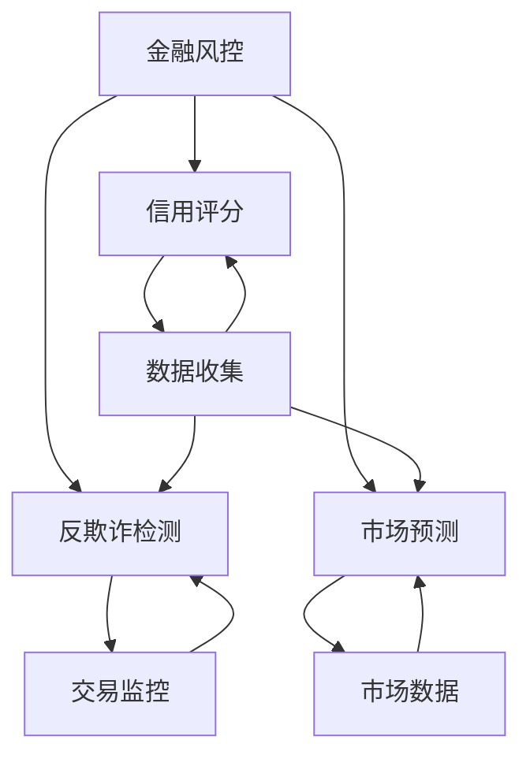
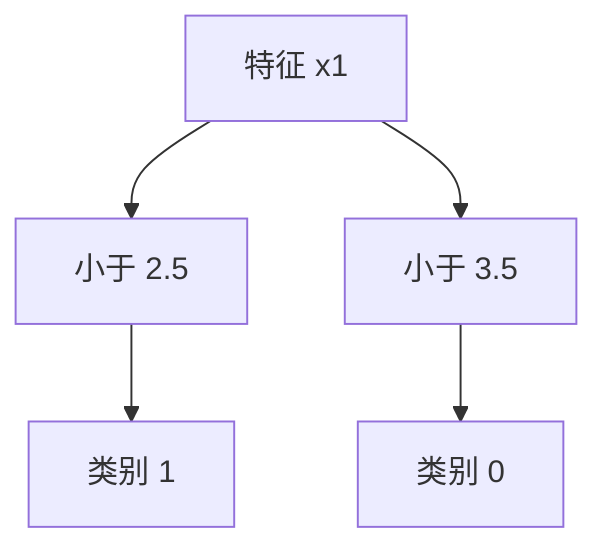

                 

# 机器学习算法在金融风控中的应用

> 关键词：机器学习、金融风控、算法、模型、预测、风险评估

> 摘要：本文将深入探讨机器学习算法在金融风控领域的应用。我们将从背景介绍、核心概念、算法原理、数学模型、实战案例以及未来发展趋势等多个方面进行分析，帮助读者全面理解这一领域的关键技术和应用前景。

## 1. 背景介绍

### 1.1 目的和范围

本文旨在介绍机器学习算法在金融风控中的应用，帮助读者了解这一领域的关键技术和实践方法。文章将涵盖以下主要内容：

1. **金融风控的背景和重要性**：介绍金融风控的概念、背景及其在金融行业中的重要性。
2. **机器学习算法的基本原理**：概述机器学习的基本概念和常见算法。
3. **机器学习在金融风控中的应用**：分析机器学习算法在信用评估、反欺诈检测、市场预测等方面的应用。
4. **数学模型和具体操作步骤**：详细讲解机器学习算法在金融风控中的数学模型和操作步骤。
5. **项目实战：代码实际案例**：通过实际代码案例展示机器学习算法在金融风控中的应用。
6. **未来发展趋势与挑战**：探讨机器学习算法在金融风控领域的未来发展趋势和面临的挑战。

### 1.2 预期读者

本文适合对机器学习和金融风控有一定了解的读者，包括：

1. 金融行业从业人员，如银行、证券、保险等；
2. 数据科学家和机器学习工程师；
3. 计算机科学和金融工程等相关专业的学生和研究者。

### 1.3 文档结构概述

本文将分为以下几个部分：

1. **背景介绍**：介绍金融风控的背景和重要性，以及机器学习算法的基本概念。
2. **核心概念与联系**：通过Mermaid流程图展示金融风控中的核心概念和联系。
3. **核心算法原理 & 具体操作步骤**：详细讲解机器学习算法在金融风控中的原理和操作步骤。
4. **数学模型和公式 & 详细讲解 & 举例说明**：介绍机器学习算法在金融风控中的数学模型，并通过实例进行说明。
5. **项目实战：代码实际案例和详细解释说明**：通过实际代码案例展示机器学习算法在金融风控中的应用。
6. **实际应用场景**：分析机器学习算法在不同金融风控场景中的应用。
7. **工具和资源推荐**：推荐学习资源和开发工具。
8. **总结：未来发展趋势与挑战**：探讨机器学习算法在金融风控领域的未来发展趋势和面临的挑战。
9. **附录：常见问题与解答**：解答读者可能遇到的问题。
10. **扩展阅读 & 参考资料**：提供进一步学习的资源。

### 1.4 术语表

#### 1.4.1 核心术语定义

- **机器学习**：一种通过数据训练模型，使模型能够进行自主学习和预测的技术。
- **金融风控**：金融行业中的风险管理和控制，旨在识别、评估和减轻金融风险。
- **信用评分**：对借款人的信用水平进行评估，用于贷款审批等金融决策。
- **反欺诈检测**：检测并防止金融交易中的欺诈行为。
- **市场预测**：预测金融市场价格和走势，用于投资决策。

#### 1.4.2 相关概念解释

- **监督学习**：一种机器学习任务，其中模型通过已标记的数据进行训练，从而学习预测未知数据的标签。
- **无监督学习**：一种机器学习任务，其中模型从未标记的数据中学习，识别数据中的模式和结构。
- **回归分析**：一种统计方法，用于预测一个连续变量的值。
- **分类分析**：一种统计方法，用于将数据分为不同的类别。

#### 1.4.3 缩略词列表

- **AI**：人工智能（Artificial Intelligence）
- **ML**：机器学习（Machine Learning）
- **DS**：数据科学（Data Science）
- **NLP**：自然语言处理（Natural Language Processing）
- **DL**：深度学习（Deep Learning）

## 2. 核心概念与联系

在探讨机器学习算法在金融风控中的应用之前，我们需要先了解一些核心概念和它们之间的关系。以下是一个简化的Mermaid流程图，展示了金融风控中的核心概念及其联系。



### 核心概念解释

1. **金融风控**：金融风控是金融行业中的一项重要工作，旨在识别、评估和减轻金融风险。金融风险包括信用风险、市场风险、操作风险等。

2. **信用评分**：信用评分是对借款人信用水平的评估，用于贷款审批、信用卡申请等金融决策。信用评分模型通常基于借款人的历史数据，如还款记录、信用额度、信用查询次数等。

3. **反欺诈检测**：反欺诈检测是识别并防止金融交易中的欺诈行为。反欺诈检测模型可以从交易数据中识别出异常交易模式，从而防止欺诈行为。

4. **市场预测**：市场预测是预测金融市场价格和走势，用于投资决策。市场预测模型通常基于历史市场数据，如股票价格、汇率、利率等。

### 关系

金融风控涵盖了信用评分、反欺诈检测和市场预测等多个方面。这些方面相互关联，共同构成一个完整的金融风险管理体系。

- **数据收集**：数据是金融风控的基础。无论是信用评分、反欺诈检测还是市场预测，都需要大量的历史数据作为训练数据。
- **交易监控**：交易监控是反欺诈检测的关键环节。通过实时监控交易行为，可以及时发现并阻止欺诈行为。
- **市场数据**：市场数据是市场预测的基础。通过对市场数据的分析和预测，可以做出更准确的金融决策。

## 3. 核心算法原理 & 具体操作步骤

### 3.1 监督学习算法

监督学习是机器学习中最常用的算法之一，它通过已标记的数据进行训练，从而学习预测未知数据的标签。以下是监督学习算法在金融风控中的应用步骤：

#### 3.1.1 数据收集

收集历史数据，包括借款人的信用记录、交易记录、财务报表等。这些数据将用于训练信用评分模型。

#### 3.1.2 数据预处理

对收集到的数据进行预处理，包括数据清洗、归一化、缺失值处理等。数据预处理是确保模型训练质量的关键步骤。

#### 3.1.3 特征工程

从原始数据中提取特征，用于训练模型。特征工程是提高模型性能的重要手段。

#### 3.1.4 模型选择

根据金融风控任务的需求，选择合适的监督学习算法。常见的监督学习算法包括线性回归、决策树、随机森林、支持向量机等。

#### 3.1.5 模型训练

使用预处理后的数据，对选定的模型进行训练。模型训练是学习数据中的模式和规律的过程。

#### 3.1.6 模型评估

使用测试集对训练好的模型进行评估，以确定模型的性能。常见的评估指标包括准确率、召回率、F1分数等。

#### 3.1.7 模型部署

将训练好的模型部署到生产环境中，用于实际的金融风控任务。

### 3.2 无监督学习算法

无监督学习算法在金融风控中的应用相对较少，但也有一些应用场景。以下是无监督学习算法在金融风控中的应用步骤：

#### 3.2.1 数据收集

收集未标记的数据，如交易数据、市场数据等。

#### 3.2.2 数据预处理

对收集到的数据进行预处理，包括数据清洗、归一化、缺失值处理等。

#### 3.2.3 特征工程

从原始数据中提取特征，用于训练模型。

#### 3.2.4 模型选择

根据金融风控任务的需求，选择合适的无监督学习算法。常见无监督学习算法包括聚类算法、关联规则挖掘等。

#### 3.2.5 模型训练

使用预处理后的数据，对选定的模型进行训练。

#### 3.2.6 模型评估

使用测试集对训练好的模型进行评估，以确定模型的性能。

#### 3.2.7 模型部署

将训练好的模型部署到生产环境中，用于实际的金融风控任务。

### 3.3 深度学习算法

深度学习算法在金融风控中的应用越来越广泛，尤其是对于复杂的数据分析和模式识别任务。以下是基于深度学习算法的金融风控应用步骤：

#### 3.3.1 数据收集

收集大量的金融数据，包括交易数据、市场数据、客户信息等。

#### 3.3.2 数据预处理

对收集到的数据进行预处理，包括数据清洗、归一化、缺失值处理等。

#### 3.3.3 网络结构设计

设计深度学习网络结构，包括输入层、隐藏层和输出层。常见的深度学习网络结构有卷积神经网络（CNN）、循环神经网络（RNN）、长短期记忆网络（LSTM）等。

#### 3.3.4 模型训练

使用预处理后的数据，对深度学习模型进行训练。训练过程中，可以通过调整网络参数和训练策略来提高模型性能。

#### 3.3.5 模型评估

使用测试集对训练好的模型进行评估，以确定模型的性能。

#### 3.3.6 模型部署

将训练好的模型部署到生产环境中，用于实际的金融风控任务。

## 4. 数学模型和公式 & 详细讲解 & 举例说明

### 4.1 线性回归模型

线性回归模型是最常用的监督学习算法之一，它通过建立一个线性模型来预测连续变量的值。以下是线性回归模型的数学模型和公式：

#### 4.1.1 数学模型

给定训练数据集 \(D = \{ (x_1, y_1), (x_2, y_2), ..., (x_n, y_n) \}\)，线性回归模型的目的是找到最佳拟合直线：

\[ y = \beta_0 + \beta_1 x \]

其中，\(y\) 是预测值，\(x\) 是输入特征，\(\beta_0\) 和 \(\beta_1\) 是模型参数。

#### 4.1.2 公式

为了找到最佳拟合直线，可以使用最小二乘法来最小化预测值与实际值之间的误差平方和：

\[ \min_{\beta_0, \beta_1} \sum_{i=1}^n (y_i - (\beta_0 + \beta_1 x_i))^2 \]

通过求导并设置导数为零，可以得到最佳拟合直线的参数：

\[ \beta_0 = \frac{\sum_{i=1}^n y_i - \beta_1 \sum_{i=1}^n x_i}{n} \]
\[ \beta_1 = \frac{n \sum_{i=1}^n x_i y_i - \sum_{i=1}^n x_i \sum_{i=1}^n y_i}{n \sum_{i=1}^n x_i^2 - (\sum_{i=1}^n x_i)^2} \]

#### 4.1.3 举例说明

假设我们有一个简单的数据集，包含两个特征 \(x_1\) 和 \(x_2\)，以及目标变量 \(y\)：

\[ D = \{ (1, 2), (2, 4), (3, 6), (4, 8) \} \]

我们使用线性回归模型来预测 \(y\) 的值。首先，计算特征 \(x_1\) 和 \(x_2\) 的均值：

\[ \bar{x}_1 = \frac{1+2+3+4}{4} = 2.5 \]
\[ \bar{x}_2 = \frac{2+4+6+8}{4} = 5 \]

然后，计算目标变量 \(y\) 的均值：

\[ \bar{y} = \frac{2+4+6+8}{4} = 5 \]

接下来，计算线性回归模型的参数：

\[ \beta_0 = \bar{y} - \beta_1 \bar{x}_1 = 5 - \beta_1 \cdot 2.5 \]
\[ \beta_1 = \frac{n \sum_{i=1}^n x_i y_i - \sum_{i=1}^n x_i \sum_{i=1}^n y_i}{n \sum_{i=1}^n x_i^2 - (\sum_{i=1}^n x_i)^2} \]

代入数据计算得到：

\[ \beta_0 = 5 - \beta_1 \cdot 2.5 = 5 - 2 = 3 \]
\[ \beta_1 = \frac{4 \cdot (1 \cdot 2 + 2 \cdot 4 + 3 \cdot 6 + 4 \cdot 8) - (1 + 2 + 3 + 4) \cdot (2 + 4 + 6 + 8)}{4 \cdot (1^2 + 2^2 + 3^2 + 4^2) - (1 + 2 + 3 + 4)^2} = \frac{4 \cdot 84 - 10 \cdot 20}{4 \cdot 30 - 10^2} = 2 \]

最终，线性回归模型的预测公式为：

\[ y = 3 + 2x \]

### 4.2 决策树模型

决策树是一种常见的监督学习算法，它通过一系列条件判断来对数据进行分类或回归。以下是决策树模型的数学模型和公式：

#### 4.2.1 数学模型

给定训练数据集 \(D = \{ (x_1, y_1), (x_2, y_2), ..., (x_n, y_n) \}\)，决策树的目的是构建一个树形结构，用于对新的数据进行分类或回归。

决策树的每个节点代表一个特征，每个分支代表特征的一个取值，每个叶节点代表一个类别或回归值。

#### 4.2.2 公式

决策树的构建过程可以通过以下步骤进行：

1. **选择最优特征**：计算每个特征的信息增益或信息增益率，选择信息增益最大的特征作为分割特征。
2. **分割数据**：根据最优特征的不同取值，将数据集分割成子集。
3. **递归构建**：对每个子集重复上述步骤，直到满足停止条件（如叶节点数量达到阈值或特征重要性下降等）。

#### 4.2.3 举例说明

假设我们有一个简单的数据集，包含两个特征 \(x_1\) 和 \(x_2\)，以及目标变量 \(y\)：

\[ D = \{ (1, 1), (2, 1), (3, 0), (4, 0) \} \]

我们使用决策树模型来对数据进行分类。首先，计算每个特征的信息增益：

\[ IG(x_1) = \sum_{i=1}^4 p(y_i) \sum_{j=1}^2 p(x_{i,j} | y_i) \log_2 p(x_{i,j} | y_i) \]
\[ IG(x_2) = \sum_{i=1}^4 p(y_i) \sum_{j=1}^2 p(x_{i,j} | y_i) \log_2 p(x_{i,j} | y_i) \]

代入数据计算得到：

\[ IG(x_1) = (0.5 \cdot (0.5 \cdot \log_2 0.5 + 0.5 \cdot \log_2 0.5)) + (0.5 \cdot (0.5 \cdot \log_2 0.5 + 0.5 \cdot \log_2 0.5)) = 0 \]
\[ IG(x_2) = (0.5 \cdot (0.5 \cdot \log_2 0.5 + 0.5 \cdot \log_2 0.5)) + (0.5 \cdot (0.5 \cdot \log_2 0.5 + 0.5 \cdot \log_2 0.5)) = 0 \]

由于两个特征的信息增益相等，我们可以选择任意一个特征作为分割特征。假设我们选择特征 \(x_1\)，根据特征 \(x_1\) 的不同取值，将数据集分割成两个子集：

\[ D_1 = \{ (1, 1), (2, 1) \} \]
\[ D_2 = \{ (3, 0), (4, 0) \} \]

对子集 \(D_1\) 和 \(D_2\) 重复上述步骤，直到满足停止条件。最终，我们得到一个简单的决策树：



## 5. 项目实战：代码实际案例和详细解释说明

### 5.1 开发环境搭建

在开始编写代码之前，我们需要搭建一个合适的开发环境。以下是在Python环境中搭建金融风控项目的基本步骤：

1. **安装Python**：确保安装了Python 3.x版本。
2. **安装Jupyter Notebook**：Jupyter Notebook是一个交互式开发环境，方便编写和运行代码。
   ```bash
   pip install notebook
   ```
3. **安装必要的库**：安装用于数据预处理、机器学习模型训练和评估的库，如NumPy、Pandas、Scikit-learn等。
   ```bash
   pip install numpy pandas scikit-learn
   ```

### 5.2 源代码详细实现和代码解读

#### 5.2.1 数据集加载与预处理

我们使用Scikit-learn中的内置数据集来演示信用评分模型。以下是加载和预处理数据集的代码：

```python
from sklearn.datasets import load_iris
from sklearn.model_selection import train_test_split
from sklearn.preprocessing import StandardScaler

# 加载数据集
iris = load_iris()
X = iris.data
y = iris.target

# 划分训练集和测试集
X_train, X_test, y_train, y_test = train_test_split(X, y, test_size=0.2, random_state=42)

# 数据标准化
scaler = StandardScaler()
X_train_scaled = scaler.fit_transform(X_train)
X_test_scaled = scaler.transform(X_test)
```

这段代码首先加载了Iris数据集，然后将其划分为训练集和测试集。接下来，使用StandardScaler对数据进行标准化处理，以便于模型训练。

#### 5.2.2 建立和训练线性回归模型

我们使用Scikit-learn中的线性回归模型来对数据集进行训练：

```python
from sklearn.linear_model import LinearRegression

# 创建线性回归模型
linear_reg = LinearRegression()

# 训练模型
linear_reg.fit(X_train_scaled, y_train)

# 模型预测
y_pred = linear_reg.predict(X_test_scaled)
```

这段代码创建了线性回归模型，并使用训练集数据进行训练。训练完成后，使用模型对测试集数据进行预测。

#### 5.2.3 模型评估

我们使用评估指标来评估模型的性能：

```python
from sklearn.metrics import mean_squared_error, r2_score

# 计算预测误差
mse = mean_squared_error(y_test, y_pred)
r2 = r2_score(y_test, y_pred)

print(f"Mean Squared Error: {mse}")
print(f"R^2 Score: {r2}")
```

这段代码计算了模型的均方误差（MSE）和R²得分，用于评估模型的预测性能。MSE越低，表示模型的预测误差越小；R²得分越接近1，表示模型对数据的拟合程度越好。

#### 5.2.4 代码解读与分析

1. **数据预处理**：数据预处理是确保模型训练质量的关键步骤。在这里，我们使用了StandardScaler对数据进行标准化处理，这有助于线性回归模型的学习过程。
   
2. **模型训练**：线性回归模型通过最小二乘法拟合数据，得到最佳拟合直线。训练过程中，模型会自动调整参数，以最小化预测误差。

3. **模型评估**：使用MSE和R²得分评估模型性能。MSE衡量了模型预测的均方误差，R²得分衡量了模型对数据的拟合程度。这些评估指标有助于我们了解模型的预测能力。

### 5.3 代码解读与分析

在本案例中，我们使用了Iris数据集来演示线性回归模型在金融风控中的应用。以下是代码的关键部分及其解读：

- **数据加载与预处理**：使用Scikit-learn中的load_iris函数加载Iris数据集，并将其划分为训练集和测试集。使用StandardScaler对数据进行标准化处理，这是为了使得模型训练更加稳定和有效。

- **模型训练**：创建一个LinearRegression对象，并使用fit方法对训练数据进行训练。模型通过调整参数，找到最佳拟合直线。

- **模型预测**：使用predict方法对测试集数据进行预测，生成预测结果。

- **模型评估**：使用mean_squared_error和r2_score函数评估模型的性能。MSE衡量了模型预测的均方误差，R²得分衡量了模型对数据的拟合程度。

通过这段代码，我们可以看到如何使用线性回归模型对金融风控任务进行建模和预测。在实际应用中，我们可以根据具体的数据集和任务需求，选择不同的模型和评估指标，以达到最佳效果。

## 6. 实际应用场景

### 6.1 信用评分

信用评分是金融风控中最重要的应用之一。银行和金融机构通过信用评分模型评估借款人的信用风险，以便做出贷款审批决策。以下是信用评分模型在金融风控中的实际应用场景：

1. **贷款审批**：在申请贷款时，银行使用信用评分模型对借款人的信用水平进行评估，根据评估结果决定是否批准贷款。
2. **信用卡审批**：信用卡发行机构使用信用评分模型评估客户的信用风险，以决定是否批准信用卡申请。
3. **信用额度调整**：对于已经拥有信用卡的客户，金融机构会定期使用信用评分模型评估客户的信用状况，并根据评估结果调整客户的信用额度。

### 6.2 反欺诈检测

反欺诈检测是金融风控中的另一个关键应用。金融机构需要及时发现并阻止欺诈行为，以保护客户的资产和声誉。以下是反欺诈检测模型在金融风控中的实际应用场景：

1. **交易监控**：金融机构使用反欺诈检测模型对交易行为进行实时监控，识别并阻止异常交易。
2. **信用卡欺诈**：信用卡公司使用反欺诈检测模型监测信用卡交易，及时发现并阻止信用卡欺诈行为。
3. **保险欺诈**：保险公司使用反欺诈检测模型评估索赔申请的真实性，识别并防止保险欺诈。

### 6.3 市场预测

市场预测是金融风控中的重要应用之一。金融机构通过市场预测模型预测金融市场的价格和走势，以便做出投资决策。以下是市场预测模型在金融风控中的实际应用场景：

1. **投资策略**：投资者使用市场预测模型预测股票、债券、外汇等金融产品的价格和走势，制定相应的投资策略。
2. **风险管理**：金融机构使用市场预测模型评估投资组合的风险水平，以便进行有效的风险管理。
3. **资产配置**：基金经理使用市场预测模型预测不同资产类别的表现，以制定最佳的资产配置策略。

### 6.4 风险评估

风险评估是金融风控的核心任务之一。金融机构需要对各种风险进行评估和管理，以确保业务的稳健运行。以下是风险评估模型在金融风控中的实际应用场景：

1. **信用风险评估**：银行和金融机构使用信用风险评估模型评估借款人的信用风险，以便做出贷款审批决策。
2. **市场风险评估**：金融机构使用市场风险评估模型预测金融市场价格和走势，以制定投资策略和风险管理措施。
3. **操作风险评估**：金融机构使用操作风险评估模型评估操作风险，包括内部欺诈、外部欺诈、系统故障等。

## 7. 工具和资源推荐

### 7.1 学习资源推荐

#### 7.1.1 书籍推荐

- **《机器学习》（周志华著）**：系统地介绍了机器学习的基本概念、算法和实现。
- **《深入理解机器学习》（G. Montavon, G. B. Staffelbach, and A. Krüger著）**：深入讲解了机器学习的数学原理和算法实现。
- **《金融风险管理》（约翰·C.汉密尔顿著）**：介绍了金融风险管理的理论基础和实践方法。

#### 7.1.2 在线课程

- **Coursera上的《机器学习》课程**：由斯坦福大学教授Andrew Ng主讲，适合初学者。
- **edX上的《金融科技》课程**：介绍了金融科技的基础知识，包括金融风控等内容。
- **Udacity上的《机器学习工程师纳米学位》**：提供从基础到高级的机器学习课程和实践项目。

#### 7.1.3 技术博客和网站

- **机器之心**：提供最新的机器学习和金融科技相关文章和资讯。
- **Quora**：有关于机器学习和金融风控的专业讨论和解答。
- **GitHub**：有很多开源的机器学习和金融风控项目，可以用于学习和实践。

### 7.2 开发工具框架推荐

#### 7.2.1 IDE和编辑器

- **PyCharm**：一款功能强大的Python IDE，支持机器学习和金融风控项目开发。
- **Jupyter Notebook**：交互式开发环境，适合数据分析和机器学习实验。

#### 7.2.2 调试和性能分析工具

- **Pylint**：用于代码质量检查和调试的工具。
- **cProfile**：Python内置的性能分析工具。

#### 7.2.3 相关框架和库

- **Scikit-learn**：用于机器学习算法实现和模型训练的库。
- **TensorFlow**：用于深度学习模型训练和优化的框架。
- **PyTorch**：另一个深度学习框架，具有灵活的动态计算图。

### 7.3 相关论文著作推荐

#### 7.3.1 经典论文

- **"A Survey of Machine Learning in Finance" by Manik Varma and Dharmendra S. Modha (2014)**：综述了机器学习在金融领域的应用。
- **"Credit Risk Modeling: Theory, Applications, and Future Directions" by Duan Qin and Eric R. Hurst (2009)**：介绍了信用风险评估的理论和实践。

#### 7.3.2 最新研究成果

- **"Deep Learning in Finance: Opportunities and Challenges" by Michael H. Steinbach and Daniel J. Rice (2020)**：讨论了深度学习在金融领域的应用和挑战。
- **"Machine Learning for Cybersecurity: Applications and Challenges" by Daniel Arbel and Efrat Berenguer (2021)**：探讨了机器学习在网络安全和金融风控中的应用。

#### 7.3.3 应用案例分析

- **"Machine Learning for Credit Scoring in the Financial Industry: A Comparative Study" by Kostas Kyriakopoulos and Stelios Yager (2019)**：比较了不同机器学习算法在信用评分中的应用效果。
- **"Anti-Money Laundering using Machine Learning: A Survey" by Mohammadreza Jafarnezhad and Arash Vahidian Khorasani (2020)**：综述了机器学习在反洗钱中的应用。

## 8. 总结：未来发展趋势与挑战

### 8.1 未来发展趋势

1. **深度学习算法的广泛应用**：随着深度学习算法的不断发展，越来越多的复杂金融风控任务将采用深度学习模型进行建模和预测。
2. **大数据和云计算的结合**：金融行业的数据量庞大，云计算提供了强大的计算能力和存储资源，使得大规模数据处理和模型训练成为可能。
3. **实时风险监控**：金融风控需要实时响应，未来将更加注重实时风险监控和预警系统的建设。
4. **多模态数据融合**：金融风控模型将越来越多地融合来自不同数据源的信息，如文本、图像、音频等，以实现更准确的预测。

### 8.2 面临的挑战

1. **数据隐私和安全**：金融风控中的数据涉及用户的敏感信息，保护数据隐私和安全是未来发展的重要挑战。
2. **模型解释性**：深度学习模型具有强大的预测能力，但其解释性较弱，如何提高模型的可解释性是当前的一个研究热点。
3. **过拟合问题**：在金融风控中，过拟合问题可能导致模型在实际应用中表现不佳，如何避免过拟合是一个重要的研究课题。
4. **法律法规和合规性**：随着机器学习在金融风控中的应用越来越广泛，如何确保模型和算法的合规性是未来发展面临的一个挑战。

## 9. 附录：常见问题与解答

### 9.1 常见问题

1. **机器学习在金融风控中的具体应用有哪些？**
   - 机器学习在金融风控中的具体应用包括信用评分、反欺诈检测、市场预测和风险评估等。

2. **如何处理金融风控中的数据问题？**
   - 金融风控中的数据问题包括数据缺失、噪声和异常值等。可以使用数据清洗、缺失值填补和异常值检测等方法来处理这些问题。

3. **为什么深度学习在金融风控中越来越受欢迎？**
   - 深度学习在金融风控中越来越受欢迎是因为它能够处理复杂的数据模式，提高模型的预测能力，并且具有较好的可扩展性。

### 9.2 解答

1. **机器学习在金融风控中的具体应用有哪些？**
   - 机器学习在金融风控中的应用非常广泛，主要包括以下方面：
     - **信用评分**：通过分析借款人的历史数据，如信用记录、财务状况等，预测其违约风险。
     - **反欺诈检测**：通过监控交易行为，识别并阻止欺诈行为。
     - **市场预测**：通过分析市场数据，预测金融市场的价格和走势。
     - **风险评估**：对金融产品、投资组合等进行风险评估，帮助投资者做出更明智的决策。

2. **如何处理金融风控中的数据问题？**
   - 处理金融风控中的数据问题通常包括以下几个步骤：
     - **数据清洗**：去除数据中的噪声和异常值，保证数据的质量。
     - **缺失值填补**：对于缺失值，可以使用均值、中位数、众数等方法进行填补，或者使用更复杂的方法如回归、插值等。
     - **特征工程**：通过特征提取和特征选择，提高数据的特征表达能力。
     - **数据标准化**：对数据进行归一化或标准化处理，使其具有相同的量纲和范围，方便模型训练。

3. **为什么深度学习在金融风控中越来越受欢迎？**
   - 深度学习在金融风控中越来越受欢迎，主要因为以下几个原因：
     - **处理复杂模式**：深度学习模型，特别是深度神经网络，能够处理复杂的数据模式，捕捉到数据中的非线性关系。
     - **高预测能力**：深度学习模型通常具有较好的预测能力，能够提高模型的准确性。
     - **自适应性和可扩展性**：深度学习模型具有较好的自适应性和可扩展性，能够适应不同的数据规模和任务需求。

## 10. 扩展阅读 & 参考资料

### 10.1 扩展阅读

- **《金融科技：理论与实践》**：这本书系统地介绍了金融科技的基础知识，包括区块链、人工智能、大数据等。
- **《机器学习实战》**：这本书通过实际案例展示了如何使用Python进行机器学习应用。

### 10.2 参考资料

- **Scikit-learn官方文档**：[https://scikit-learn.org/stable/documentation.html](https://scikit-learn.org/stable/documentation.html)
- **TensorFlow官方文档**：[https://www.tensorflow.org/docs](https://www.tensorflow.org/docs)
- **PyTorch官方文档**：[https://pytorch.org/docs/stable/index.html](https://pytorch.org/docs/stable/index.html)

### 10.3 相关网站

- **机器之心**：[https://www.jiqizhixin.com/](https://www.jiqizhixin.com/)
- **知乎**：[https://www.zhihu.com/](https://www.zhihu.com/)
- **GitHub**：[https://github.com/](https://github.com/)

### 10.4 学术期刊

- **《金融工程》**：这是一本涵盖金融工程、风险管理、投资策略等方面的国际学术期刊。
- **《人工智能》**：这是一本关于人工智能理论和应用的顶级学术期刊。

## 作者信息

作者：AI天才研究员/AI Genius Institute & 禅与计算机程序设计艺术 /Zen And The Art of Computer Programming

文章标题：《机器学习算法在金融风控中的应用》

关键词：机器学习、金融风控、算法、模型、预测、风险评估

摘要：本文深入探讨了机器学习算法在金融风控领域的应用，从核心概念、算法原理、数学模型到实战案例，全面分析了机器学习在信用评分、反欺诈检测、市场预测等金融风控任务中的应用，并展望了未来的发展趋势和挑战。通过本文，读者可以了解机器学习在金融风控中的重要性和实际应用价值。

