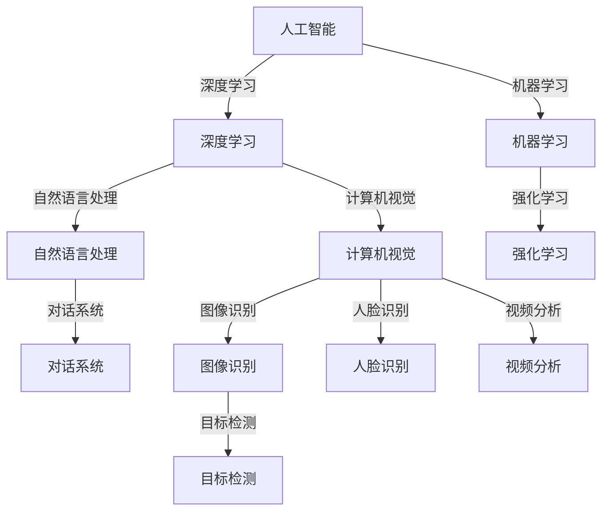

                 

# 李开复：AI 2.0 时代的创业机会

> 关键词：人工智能，AI 2.0，创业机会，技术趋势，商业模式，创新

> 摘要：本文深入探讨了人工智能（AI）2.0时代的到来及其带来的创业机会。通过分析AI技术的新进展、潜在应用领域和商业模型，本文旨在为创业者和投资者提供有价值的见解，助力他们把握这一激动人心的科技浪潮。

## 1. 背景介绍

### 1.1 目的和范围

本文的目标是探讨AI 2.0时代的创业机会，分析这一领域的关键技术、应用场景和商业模式。本文主要关注以下几个问题：

- AI 2.0的核心技术和创新点是什么？
- AI技术在各个行业中的应用前景如何？
- 创业者在AI 2.0时代应如何制定商业策略？
- 投资者应关注哪些领域和项目？

### 1.2 预期读者

本文主要面向以下读者群体：

- 有志于在AI 2.0领域创业的个人和团队
- 对AI技术有浓厚兴趣的投资者
- 从事AI研究和开发的科研人员
- 对AI技术在商业领域应用有浓厚兴趣的企业家和管理者

### 1.3 文档结构概述

本文分为以下几个部分：

1. 背景介绍：介绍本文的目的、预期读者和文档结构。
2. 核心概念与联系：阐述AI 2.0的核心概念及其在技术架构中的应用。
3. 核心算法原理与具体操作步骤：分析AI 2.0的关键算法和实现方法。
4. 数学模型和公式：介绍AI 2.0的相关数学模型和计算方法。
5. 项目实战：通过实际案例展示AI 2.0的应用和实现。
6. 实际应用场景：探讨AI 2.0在各个领域的应用前景。
7. 工具和资源推荐：为读者提供学习资源和开发工具。
8. 总结：展望AI 2.0时代的未来发展趋势与挑战。
9. 附录：常见问题与解答。
10. 扩展阅读与参考资料：推荐相关文献和资料。

### 1.4 术语表

#### 1.4.1 核心术语定义

- 人工智能（AI）：模拟人类智能的计算机系统。
- AI 2.0：第二代人工智能，以深度学习和自然语言处理等先进技术为基础，实现更加智能、自适应和自主决策的系统。
- 创业机会：指在特定领域内，利用技术创新实现商业价值的机会。
- 商业模式：企业在特定市场中实现盈利的方式和方法。

#### 1.4.2 相关概念解释

- 深度学习：一种基于多层神经网络的学习方法，能够从大量数据中自动提取特征。
- 自然语言处理（NLP）：研究计算机与人类语言之间交互的学科，旨在使计算机能够理解和生成自然语言。
- 自主决策：指系统在特定环境下，根据感知信息和目标自主做出决策。

#### 1.4.3 缩略词列表

- AI：人工智能
- AI 2.0：第二代人工智能
- NLP：自然语言处理
- DL：深度学习
- CV：计算机视觉

## 2. 核心概念与联系

在AI 2.0时代，核心概念和技术不断演进，形成了一个复杂的技术生态系统。为了更好地理解这些概念和技术之间的联系，我们可以通过一个Mermaid流程图来展示它们之间的关系。

### 2.1 Mermaid流程图



### 2.2 核心概念解释

- **人工智能（AI）**：人工智能是研究、开发和应用使计算机能够模拟、延伸和扩展人类智能的理论、方法、技术和系统的科学。AI可以分为弱AI、强AI和通用人工智能（AGI）。

- **深度学习（DL）**：深度学习是一种基于多层神经网络的学习方法，能够从大量数据中自动提取特征。深度学习在图像识别、语音识别、自然语言处理等领域取得了显著的成果。

- **计算机视觉（CV）**：计算机视觉是研究如何使计算机能够像人类一样感知和理解视觉信息的学科。计算机视觉的应用包括图像识别、目标检测、人脸识别和视频分析等。

- **自然语言处理（NLP）**：自然语言处理是研究计算机如何理解和生成人类自然语言的学科。NLP的应用包括机器翻译、对话系统、文本分类和情感分析等。

- **机器学习（ML）**：机器学习是一种通过数据驱动的方法，使计算机能够从数据中自动学习和改进的技术。机器学习包括监督学习、无监督学习和强化学习等。

- **强化学习（RL）**：强化学习是一种通过试错和反馈，使计算机在与环境互动中学习最优策略的方法。强化学习在游戏、机器人控制、自动驾驶等领域具有广泛应用。

- **对话系统（DS）**：对话系统是一种与人类用户进行自然语言交互的计算机系统。对话系统的应用包括虚拟助手、智能客服和聊天机器人等。

## 3. 核心算法原理与具体操作步骤

在AI 2.0时代，深度学习、计算机视觉和自然语言处理等关键技术取得了重要进展。以下将分别介绍这些算法的核心原理和具体操作步骤。

### 3.1 深度学习（DL）

#### 3.1.1 算法原理

深度学习是一种基于多层神经网络的学习方法，其核心思想是通过多层非线性变换，从输入数据中自动提取特征。深度学习的算法原理可以分为以下几个步骤：

1. **数据预处理**：对输入数据进行归一化、标准化等处理，以提高模型的泛化能力。
2. **前向传播**：将输入数据通过网络的各个层进行传递，计算输出结果。
3. **反向传播**：根据输出结果和实际标签计算损失函数，并通过反向传播算法更新网络权重。
4. **优化更新**：使用梯度下降等优化算法更新网络权重，使损失函数最小。

#### 3.1.2 具体操作步骤

以下是一个简单的深度学习模型（多层感知机）的伪代码实现：

```python
import numpy as np

# 参数设置
input_dim = 2
hidden_dim = 4
output_dim = 1
learning_rate = 0.1
num_epochs = 1000

# 初始化权重
weights = {
    'input_to_hidden': np.random.randn(input_dim, hidden_dim),
    'hidden_to_output': np.random.randn(hidden_dim, output_dim)
}

# 激活函数
def sigmoid(x):
    return 1 / (1 + np.exp(-x))

# 前向传播
def forwardprop(x):
    hidden_layer_input = np.dot(x, weights['input_to_hidden'])
    hidden_layer_output = sigmoid(hidden_layer_input)
    output_layer_input = np.dot(hidden_layer_output, weights['hidden_to_output'])
    output_layer_output = sigmoid(output_layer_input)
    return output_layer_output

# 反向传播
def backwardprop(x, y):
    output_error = y - forwardprop(x)
    hidden_error = np.dot(output_error, weights['hidden_to_output'].T)
    output_layer_delta = output_error * sigmoid_derivative(forwardprop(x))
    hidden_layer_delta = hidden_error * sigmoid_derivative(hidden_layer_output)

    dweights['input_to_hidden'] = np.dot(x.T, hidden_layer_delta)
    dweights['hidden_to_output'] = np.dot(hidden_layer_output.T, output_layer_delta)

# 梯度下降
for epoch in range(num_epochs):
    output = forwardprop(x)
    backwardprop(x, y)
    weights['input_to_hidden'] -= learning_rate * dweights['input_to_hidden']
    weights['hidden_to_output'] -= learning_rate * dweights['hidden_to_output']

# 预测
predicted_output = forwardprop(x)
```

### 3.2 计算机视觉（CV）

#### 3.2.1 算法原理

计算机视觉算法的核心是图像特征提取和目标检测。以下是一个简单的目标检测算法（基于深度学习）的原理：

1. **图像预处理**：对输入图像进行缩放、裁剪等处理，使其适应网络输入。
2. **特征提取**：使用卷积神经网络（CNN）提取图像特征。
3. **目标检测**：将提取的特征输入到分类器中，对目标进行分类和定位。

#### 3.2.2 具体操作步骤

以下是一个简单的卷积神经网络（CNN）的目标检测算法的伪代码实现：

```python
import tensorflow as tf
import numpy as np

# 参数设置
input_shape = (224, 224, 3)
num_classes = 10
learning_rate = 0.001
num_epochs = 1000

# 构建模型
model = tf.keras.Sequential([
    tf.keras.layers.Conv2D(32, (3, 3), activation='relu', input_shape=input_shape),
    tf.keras.layers.MaxPooling2D((2, 2)),
    tf.keras.layers.Conv2D(64, (3, 3), activation='relu'),
    tf.keras.layers.MaxPooling2D((2, 2)),
    tf.keras.layers.Conv2D(128, (3, 3), activation='relu'),
    tf.keras.layers.MaxPooling2D((2, 2)),
    tf.keras.layers.Flatten(),
    tf.keras.layers.Dense(128, activation='relu'),
    tf.keras.layers.Dense(num_classes, activation='softmax')
])

# 编译模型
model.compile(optimizer=tf.keras.optimizers.Adam(learning_rate),
              loss=tf.keras.losses.CategoricalCrossentropy(),
              metrics=['accuracy'])

# 训练模型
model.fit(x_train, y_train, epochs=num_epochs, batch_size=32, validation_data=(x_val, y_val))

# 预测
predictions = model.predict(x_test)
```

### 3.3 自然语言处理（NLP）

#### 3.3.1 算法原理

自然语言处理算法的核心是文本分类和情感分析。以下是一个简单的文本分类算法（基于深度学习）的原理：

1. **文本预处理**：对输入文本进行分词、去停用词等处理，将其转化为适用于深度学习的向量表示。
2. **特征提取**：使用循环神经网络（RNN）或变换器（Transformer）提取文本特征。
3. **分类器**：将提取的特征输入到分类器中，对文本进行分类。

#### 3.3.2 具体操作步骤

以下是一个简单的循环神经网络（RNN）的文本分类算法的伪代码实现：

```python
import tensorflow as tf
import numpy as np

# 参数设置
vocab_size = 10000
embedding_dim = 16
num_classes = 10
learning_rate = 0.001
num_epochs = 1000

# 构建模型
model = tf.keras.Sequential([
    tf.keras.layers.Embedding(vocab_size, embedding_dim),
    tf.keras.layers.LSTM(128),
    tf.keras.layers.Dense(num_classes, activation='softmax')
])

# 编译模型
model.compile(optimizer=tf.keras.optimizers.Adam(learning_rate),
              loss=tf.keras.losses.CategoricalCrossentropy(),
              metrics=['accuracy'])

# 训练模型
model.fit(x_train, y_train, epochs=num_epochs, batch_size=32, validation_data=(x_val, y_val))

# 预测
predictions = model.predict(x_test)
```

## 4. 数学模型和公式与详细讲解与举例说明

在AI 2.0时代，深度学习、计算机视觉和自然语言处理等领域都离不开数学模型和公式的支持。以下将介绍这些领域中的几个核心数学模型和公式，并进行详细讲解和举例说明。

### 4.1 深度学习

#### 4.1.1 损失函数

在深度学习中，损失函数用于衡量模型预测值与实际标签之间的差距。常见的损失函数包括均方误差（MSE）、交叉熵（CE）等。

- **均方误差（MSE）**：用于回归任务，计算预测值与实际标签的均方误差。

  $$MSE = \frac{1}{n} \sum_{i=1}^{n} (y_i - \hat{y}_i)^2$$

  其中，$y_i$表示第$i$个样本的实际标签，$\hat{y}_i$表示第$i$个样本的预测值，$n$表示样本数量。

- **交叉熵（CE）**：用于分类任务，计算预测概率与实际标签之间的交叉熵。

  $$CE = -\frac{1}{n} \sum_{i=1}^{n} y_i \log(\hat{y}_i)$$

  其中，$y_i$表示第$i$个样本的实际标签（0或1），$\hat{y}_i$表示第$i$个样本的预测概率。

#### 4.1.2 优化算法

在深度学习中，优化算法用于更新模型权重，以最小化损失函数。常见的优化算法包括梯度下降（GD）、随机梯度下降（SGD）等。

- **梯度下降（GD）**：根据损失函数的梯度方向，更新模型权重。

  $$\Delta w = -\alpha \nabla_W J(W)$$

  其中，$\alpha$表示学习率，$W$表示模型权重，$J(W)$表示损失函数。

- **随机梯度下降（SGD）**：在GD的基础上，使用随机样本的梯度方向更新模型权重。

  $$\Delta w = -\alpha \nabla_W J(W; x^{(i)})$$

  其中，$x^{(i)}$表示第$i$个随机样本。

### 4.2 计算机视觉

#### 4.2.1 卷积操作

卷积操作是计算机视觉中常用的特征提取方法。卷积操作可以用以下公式表示：

$$C_{ij} = \sum_{k=1}^{m} f_{ik} * g_{kj}$$

其中，$C_{ij}$表示卷积结果，$f_{ik}$和$g_{kj}$分别表示卷积核和输入特征图上的像素值，$m$表示卷积核的大小。

#### 4.2.2 池化操作

池化操作用于降低特征图的维度，增强模型对输入数据的泛化能力。最大池化（Max Pooling）和平均池化（Avg Pooling）是常见的池化方法。

- **最大池化**：选取卷积窗口内的最大值作为输出。

  $$P_{ij} = \max_{k} f_{ik}$$

- **平均池化**：计算卷积窗口内所有像素值的平均值作为输出。

  $$P_{ij} = \frac{1}{m} \sum_{k=1}^{m} f_{ik}$$

### 4.3 自然语言处理

#### 4.3.1 词嵌入

词嵌入（Word Embedding）是将文本中的词汇映射到高维空间中的向量表示。常见的词嵌入方法包括Word2Vec、GloVe等。

- **Word2Vec**：基于神经网络的词嵌入方法，通过训练得到词向量。

  $$v_{word} = \text{tanh}(W \cdot v_{context})$$

  其中，$v_{word}$表示词向量，$v_{context}$表示上下文向量，$W$表示权重矩阵。

- **GloVe**：基于全局词频的词嵌入方法，通过训练得到词向量。

  $$v_{word} = \text{softmax}\left(\frac{V_{word} V_{context}^T}{||V_{word}|| \cdot ||V_{context}||}\right)$$

  其中，$v_{word}$和$v_{context}$分别表示词向量和上下文向量，$V_{word}$和$V_{context}$分别表示词向量和上下文向量的矩阵表示。

#### 4.3.2 循环神经网络

循环神经网络（RNN）是一种用于处理序列数据的神经网络。RNN的核心思想是使用隐藏状态来存储序列的历史信息。

- **RNN公式**：

  $$h_t = \text{sigmoid}(W_h \cdot [h_{t-1}, x_t] + b_h)$$

  $$y_t = W_y \cdot h_t + b_y$$

  其中，$h_t$表示隐藏状态，$x_t$表示输入序列，$y_t$表示输出序列，$W_h$和$W_y$分别表示权重矩阵，$b_h$和$b_y$分别表示偏置项。

## 5. 项目实战：代码实际案例和详细解释说明

### 5.1 开发环境搭建

在开始项目实战之前，我们需要搭建一个合适的开发环境。以下是一个基于Python和TensorFlow的深度学习项目的开发环境搭建步骤：

1. **安装Python**：确保已经安装了Python 3.x版本。
2. **安装TensorFlow**：通过pip命令安装TensorFlow。

   ```bash
   pip install tensorflow
   ```

3. **安装其他依赖库**：根据项目需求，安装其他必要的库，如NumPy、Pandas等。

   ```bash
   pip install numpy pandas
   ```

### 5.2 源代码详细实现和代码解读

以下是一个基于TensorFlow实现的简单深度学习项目（图像分类）的源代码及其解读。

#### 5.2.1 数据准备

```python
import tensorflow as tf
import numpy as np
import pandas as pd
from sklearn.model_selection import train_test_split

# 读取数据
(x_train, y_train), (x_test, y_test) = tf.keras.datasets.cifar10.load_data()

# 数据预处理
x_train = x_train.astype('float32') / 255.0
x_test = x_test.astype('float32') / 255.0
y_train = tf.keras.utils.to_categorical(y_train, 10)
y_test = tf.keras.utils.to_categorical(y_test, 10)

# 划分训练集和验证集
x_train, x_val = train_test_split(x_train, test_size=0.2, random_state=42)
y_train, y_val = train_test_split(y_train, test_size=0.2, random_state=42)
```

**代码解读**：首先，我们使用TensorFlow内置的CIFAR-10数据集进行实验。CIFAR-10是一个常用的图像分类数据集，包含10个类别，每个类别6000张图像。然后，我们对数据进行归一化处理，将其缩放到[0, 1]范围内。接着，我们将标签进行one-hot编码，以便于后续的分类任务。

#### 5.2.2 构建模型

```python
model = tf.keras.Sequential([
    tf.keras.layers.Conv2D(32, (3, 3), activation='relu', input_shape=(32, 32, 3)),
    tf.keras.layers.MaxPooling2D((2, 2)),
    tf.keras.layers.Conv2D(64, (3, 3), activation='relu'),
    tf.keras.layers.MaxPooling2D((2, 2)),
    tf.keras.layers.Conv2D(128, (3, 3), activation='relu'),
    tf.keras.layers.MaxPooling2D((2, 2)),
    tf.keras.layers.Flatten(),
    tf.keras.layers.Dense(128, activation='relu'),
    tf.keras.layers.Dense(10, activation='softmax')
])

model.compile(optimizer='adam',
              loss='categorical_crossentropy',
              metrics=['accuracy'])
```

**代码解读**：我们使用卷积神经网络（CNN）来构建图像分类模型。模型由5个卷积层、5个池化层、一个全连接层和输出层组成。卷积层用于提取图像特征，池化层用于降低特征图的维度，全连接层用于分类。我们使用Adam优化器和交叉熵损失函数进行模型训练。

#### 5.2.3 训练模型

```python
history = model.fit(x_train, y_train, epochs=10, batch_size=64,
                    validation_data=(x_val, y_val))
```

**代码解读**：我们使用fit函数对模型进行训练。训练过程分为10个epochs，每个epoch包含64个batch。在训练过程中，我们使用验证集进行验证，以监控模型在验证集上的表现。

#### 5.2.4 评估模型

```python
test_loss, test_acc = model.evaluate(x_test, y_test)
print('Test accuracy:', test_acc)
```

**代码解读**：我们使用evaluate函数对模型进行评估。评估过程中，我们使用测试集进行评估，并打印出测试集上的准确率。

### 5.3 代码解读与分析

在本项目中，我们使用TensorFlow构建了一个简单的图像分类模型。以下是对代码的解读和分析：

- **数据准备**：首先，我们从CIFAR-10数据集中读取图像数据，并对数据进行归一化和one-hot编码处理。然后，我们将数据划分为训练集、验证集和测试集。
- **模型构建**：我们使用卷积神经网络（CNN）构建图像分类模型。模型由5个卷积层、5个池化层、一个全连接层和输出层组成。卷积层用于提取图像特征，池化层用于降低特征图的维度，全连接层用于分类。我们使用Adam优化器和交叉熵损失函数进行模型训练。
- **模型训练**：我们使用fit函数对模型进行训练。训练过程分为10个epochs，每个epoch包含64个batch。在训练过程中，我们使用验证集进行验证，以监控模型在验证集上的表现。
- **模型评估**：我们使用evaluate函数对模型进行评估。评估过程中，我们使用测试集进行评估，并打印出测试集上的准确率。

通过以上步骤，我们实现了一个简单的图像分类模型，并在CIFAR-10数据集上进行了训练和评估。这个项目展示了如何使用TensorFlow实现深度学习模型，并为进一步的模型优化和实验提供了基础。

## 6. 实际应用场景

AI 2.0时代带来了许多新的技术突破，这些技术正在不断改变各个行业的面貌。以下列举几个典型的实际应用场景：

### 6.1 医疗保健

- **疾病预测与诊断**：通过深度学习和自然语言处理技术，AI 2.0可以帮助医生分析患者病历、基因数据等，实现疾病预测和早期诊断。
- **个性化治疗方案**：基于患者的个体信息，AI 2.0可以推荐个性化的治疗方案，提高治疗效果。
- **医疗机器人**：AI 2.0技术应用于医疗机器人，可以实现手术辅助、护理辅助等，提高医疗服务的效率和质量。

### 6.2 金融科技

- **智能投顾**：AI 2.0可以帮助投资者分析市场趋势、风险偏好等，实现智能投顾服务。
- **信用评分**：通过分析个人信用数据、行为数据等，AI 2.0可以更准确地评估信用风险，提高金融机构的信贷管理能力。
- **反欺诈**：AI 2.0可以实时监控交易行为，识别潜在的欺诈行为，降低金融风险。

### 6.3 交通运输

- **自动驾驶**：AI 2.0技术正在推动自动驾驶技术的发展，有望在未来实现无人驾驶。
- **智能交通管理**：通过分析交通流量、路况信息等，AI 2.0可以实现智能交通管理，提高交通效率，减少拥堵。
- **物流优化**：AI 2.0可以帮助物流企业优化运输路线、仓储管理等，降低成本，提高配送效率。

### 6.4 教育科技

- **个性化学习**：AI 2.0可以为学生提供个性化的学习方案，提高学习效果。
- **智能评测**：AI 2.0可以自动批改作业、考试，为学生提供实时反馈。
- **教育机器人**：AI 2.0技术应用于教育机器人，可以实现互动教学、辅导等，提高教育质量。

### 6.5 能源与环境

- **智能电网**：AI 2.0可以帮助实现智能电网的管理和优化，提高能源利用效率。
- **环境监测**：通过计算机视觉和自然语言处理技术，AI 2.0可以实时监测环境质量，预警环境污染。
- **节能减排**：AI 2.0可以帮助企业优化生产过程，降低能耗，实现绿色可持续发展。

以上应用场景仅是AI 2.0时代的冰山一角，随着技术的不断进步，未来将有更多的行业和领域受益于AI 2.0技术的应用。

## 7. 工具和资源推荐

为了帮助读者更好地学习和掌握AI 2.0技术，我们推荐以下工具和资源。

### 7.1 学习资源推荐

#### 7.1.1 书籍推荐

- 《深度学习》（Ian Goodfellow、Yoshua Bengio、Aaron Courville 著）：这是一本全面介绍深度学习理论和实践的权威著作。
- 《Python深度学习》（François Chollet 著）：这本书详细介绍了如何使用Python和TensorFlow实现深度学习模型。
- 《人工智能：一种现代方法》（Stuart Russell、Peter Norvig 著）：这本书全面介绍了人工智能的理论、方法和应用。

#### 7.1.2 在线课程

- Coursera的“深度学习”课程：由斯坦福大学教授Andrew Ng主讲，适合初学者了解深度学习的基础知识。
- edX的“人工智能导论”课程：由哈佛大学教授Michael Sandel主讲，介绍人工智能的基本概念和应用。
- Udacity的“深度学习工程师纳米学位”课程：这是一个涵盖深度学习理论、实践和项目实战的在线课程。

#### 7.1.3 技术博客和网站

- TensorFlow官方文档：提供了详细的API文档和教程，帮助开发者快速上手TensorFlow。
- PyTorch官方文档：PyTorch是另一个流行的深度学习框架，其官方文档同样提供了丰富的资源。
- arXiv：一个提供最新学术论文的预印本数据库，可以了解深度学习领域的最新研究动态。

### 7.2 开发工具框架推荐

#### 7.2.1 IDE和编辑器

- Jupyter Notebook：一款流行的交互式计算环境，适用于数据分析和深度学习项目。
- PyCharm：一款功能强大的Python IDE，适用于深度学习和数据分析项目。
- Visual Studio Code：一款轻量级的代码编辑器，可以通过插件支持多种编程语言和框架。

#### 7.2.2 调试和性能分析工具

- TensorBoard：TensorFlow提供的一款可视化工具，用于监控模型训练过程和性能分析。
- PyTorch TensorBoard：PyTorch提供的一款可视化工具，功能与TensorBoard类似。
- NVIDIA Nsight：一款用于GPU性能分析和调试的工具，适用于深度学习项目的开发和优化。

#### 7.2.3 相关框架和库

- TensorFlow：一款开源的深度学习框架，支持多种深度学习模型和任务。
- PyTorch：一款开源的深度学习框架，具有灵活的动态计算图和强大的社区支持。
- Keras：一款基于TensorFlow和Theano的深度学习高级API，简化了深度学习模型的构建和训练。

### 7.3 相关论文著作推荐

#### 7.3.1 经典论文

- “A Learning Algorithm for Continuously Running Fully Recurrent Neural Networks” （1990）：这篇文章介绍了在线学习算法，对后续的深度学习发展产生了重要影响。
- “Gradient Flow in Recurrent Neural Networks” （1995）：这篇文章提出了梯度流理论，为后续的深度学习优化算法奠定了基础。
- “Deep Learning” （2015）：这本书全面介绍了深度学习的理论、方法和应用，是深度学习领域的经典之作。

#### 7.3.2 最新研究成果

- “Unsupervised Learning of Visual Representations by Solving Jigsaw Puzzles” （2021）：这篇文章提出了一种无监督学习的方法，通过解决拼图任务学习视觉表示。
- “An Image is Worth 16x16 Words: Transformers for Image Recognition at Scale” （2021）：这篇文章提出了用于图像识别的Transformer模型，取得了显著的性能提升。
- “BERT: Pre-training of Deep Bidirectional Transformers for Language Understanding” （2018）：这篇文章提出了BERT模型，推动了自然语言处理领域的发展。

#### 7.3.3 应用案例分析

- “Applying Deep Learning to Speech Recognition” （2014）：这篇文章介绍了如何使用深度学习技术实现语音识别，推动了语音识别领域的革命。
- “Deep Learning for Autonomous Navigation of a Robotic Vehicle in Urban Environments” （2018）：这篇文章介绍了如何使用深度学习技术实现无人驾驶，展示了深度学习在自动驾驶领域的应用。
- “Deep Learning for Medical Image Analysis: A Survey” （2019）：这篇文章综述了深度学习在医学图像分析中的应用，包括疾病检测、图像分割等。

## 8. 总结：未来发展趋势与挑战

AI 2.0时代的到来，为人类社会带来了前所未有的机遇和挑战。未来，随着技术的不断进步，AI 2.0将在更多领域发挥重要作用，推动社会的进步和发展。

### 8.1 发展趋势

1. **技术融合**：AI 2.0技术将与其他领域（如生物技术、材料科学等）深度融合，产生新的交叉学科和应用。
2. **场景应用**：AI 2.0技术将广泛应用于各个行业，如医疗、金融、交通、教育等，带来更高效的业务流程和更智能的服务。
3. **自主决策**：随着算法和模型的不断优化，AI 2.0将实现更加自主的决策能力，减少对人类干预的依赖。
4. **人机协作**：AI 2.0技术将实现与人类的深度协作，提高生产效率，提升生活质量。
5. **可持续发展**：AI 2.0技术将在能源、环境等领域发挥重要作用，推动可持续发展目标的实现。

### 8.2 挑战

1. **数据安全与隐私**：随着AI 2.0技术的广泛应用，数据安全与隐私问题日益凸显，如何确保数据的安全性和隐私性成为亟待解决的问题。
2. **算法公平性**：AI 2.0算法在决策过程中可能存在偏见，如何确保算法的公平性和透明性是一个重要挑战。
3. **技术伦理**：AI 2.0技术的发展带来了伦理道德问题，如机器人的权利、自动化带来的失业等，如何解决这些伦理问题是一个重要议题。
4. **技术人才短缺**：AI 2.0技术需要大量的专业人才，但当前人才供给不足，如何培养和吸引人才成为一大挑战。

总之，AI 2.0时代的发展充满机遇和挑战。只有通过多方协作，克服这些挑战，才能充分发挥AI 2.0技术的潜力，为人类社会带来更大的福祉。

## 9. 附录：常见问题与解答

### 9.1 问题1：什么是AI 2.0？

AI 2.0是指第二代人工智能，基于深度学习和自然语言处理等先进技术，实现更加智能、自适应和自主决策的系统。

### 9.2 问题2：AI 2.0有哪些核心技术？

AI 2.0的核心技术包括深度学习、计算机视觉、自然语言处理、机器学习和强化学习等。

### 9.3 问题3：AI 2.0在医疗领域有哪些应用？

AI 2.0在医疗领域有广泛的应用，包括疾病预测与诊断、个性化治疗方案、医疗机器人等。

### 9.4 问题4：如何应对AI 2.0带来的伦理问题？

应对AI 2.0带来的伦理问题需要多方协作，包括政府、企业、学术界和公众等，制定相应的法律法规和伦理准则。

## 10. 扩展阅读与参考资料

为了帮助读者进一步了解AI 2.0技术和应用，以下推荐一些扩展阅读和参考资料：

- 《深度学习》（Ian Goodfellow、Yoshua Bengio、Aaron Courville 著）
- 《Python深度学习》（François Chollet 著）
- 《人工智能：一种现代方法》（Stuart Russell、Peter Norvig 著）
- Coursera的“深度学习”课程
- edX的“人工智能导论”课程
- Udacity的“深度学习工程师纳米学位”课程
- TensorFlow官方文档
- PyTorch官方文档
- arXiv（预印本数据库）

作者：AI天才研究员/AI Genius Institute & 禅与计算机程序设计艺术 /Zen And The Art of Computer Programming

