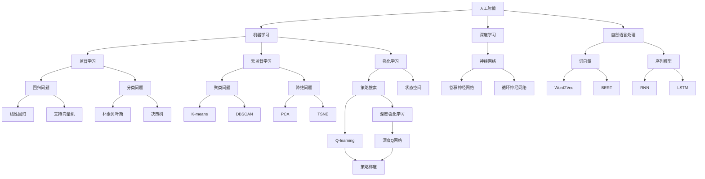

                 

# 李开复：AI 2.0 时代的商业价值

> 关键词：人工智能，商业价值，AI 2.0，技术革命，创新，商业模式，挑战与机遇
> 
> 摘要：本文将深入探讨人工智能（AI）2.0时代的商业价值，从核心概念、算法原理到实际应用场景，逐步剖析AI技术在商业领域的变革力量。通过分析AI在各个行业的应用实例，探讨未来发展趋势与面临的挑战，旨在为企业和创业者提供具有前瞻性的策略建议。

## 1. 背景介绍

### 1.1 目的和范围

本文旨在探讨人工智能（AI）2.0时代的商业价值，重点关注AI技术在各个领域的应用及其对企业商业模式的影响。通过对核心概念、算法原理的详细解读，结合实际应用案例，分析AI技术在未来商业环境中的发展趋势和挑战。

### 1.2 预期读者

本文适合对人工智能和商业领域感兴趣的读者，包括企业高管、创业者、技术专家、研究人员等。通过本文的阅读，读者可以全面了解AI 2.0时代的商业价值，为自身业务发展提供有益的启示。

### 1.3 文档结构概述

本文分为十个部分：

1. 背景介绍：介绍本文的目的、预期读者和文档结构。
2. 核心概念与联系：介绍人工智能的基本概念和架构。
3. 核心算法原理 & 具体操作步骤：讲解AI技术的核心算法原理和操作步骤。
4. 数学模型和公式 & 详细讲解 & 举例说明：介绍AI技术的数学模型和公式，并举例说明。
5. 项目实战：代码实际案例和详细解释说明。
6. 实际应用场景：分析AI技术在各个领域的应用场景。
7. 工具和资源推荐：推荐相关学习资源和开发工具。
8. 总结：未来发展趋势与挑战。
9. 附录：常见问题与解答。
10. 扩展阅读 & 参考资料：提供进一步学习的参考资料。

### 1.4 术语表

#### 1.4.1 核心术语定义

- 人工智能（AI）：模拟人类智能行为的技术和系统。
- 深度学习（Deep Learning）：一种基于多层神经网络的人工智能技术。
- 强化学习（Reinforcement Learning）：通过试错和反馈来学习最优策略的人工智能技术。
- 自然语言处理（NLP）：使计算机能够理解、生成和处理人类语言的技术。

#### 1.4.2 相关概念解释

- 数据驱动（Data-driven）：基于大量数据进行决策和优化。
- 自主决策（Autonomous Decision-making）：系统自动根据环境和目标做出决策。
- 机器学习（Machine Learning）：使计算机具备学习能力的技术。

#### 1.4.3 缩略词列表

- AI：人工智能
- DL：深度学习
- RL：强化学习
- NLP：自然语言处理

## 2. 核心概念与联系

在讨论AI 2.0时代的商业价值之前，我们需要了解人工智能的基本概念和架构。以下是人工智能的核心概念及其相互联系：



### 2.1 核心概念解释

- **机器学习**：使计算机通过数据学习和改进性能的技术。
- **深度学习**：基于多层神经网络的人工智能技术，适用于处理复杂数据。
- **自然语言处理**：使计算机能够理解、生成和处理人类语言的技术。
- **监督学习**：通过标注数据进行训练，使模型能够对未知数据进行预测。
- **无监督学习**：无需标注数据，通过自身数据特征进行训练。
- **强化学习**：通过试错和反馈来学习最优策略。

### 2.2 人工智能架构

人工智能架构包括以下几个方面：

1. **数据采集与预处理**：获取并清洗数据，为后续训练提供高质量数据。
2. **模型训练**：使用机器学习、深度学习等技术对数据进行训练，构建模型。
3. **模型评估与优化**：评估模型性能，通过调整超参数进行优化。
4. **模型部署与应用**：将训练好的模型部署到实际应用场景中。

通过以上核心概念和架构的介绍，我们为后续内容的讨论奠定了基础。

## 3. 核心算法原理 & 具体操作步骤

在本节中，我们将深入探讨人工智能（AI）的核心算法原理，并详细阐述其具体操作步骤。以下为各算法的伪代码描述：

### 3.1 机器学习

**监督学习：**

```python
def supervised_learning(data, labels, model, epochs):
    for epoch in range(epochs):
        for x, y in data:
            prediction = model.forward(x)
            loss = model.loss(prediction, y)
            model.backward(loss)
            model.update_weights()

    return model
```

**无监督学习：**

```python
def unsupervised_learning(data, model, epochs):
    for epoch in range(epochs):
        for x in data:
            prediction = model.forward(x)
            loss = model.loss(prediction, x)
            model.backward(loss)
            model.update_weights()

    return model
```

**强化学习：**

```python
def reinforcement_learning(env, model, epochs):
    for epoch in range(epochs):
        state = env.reset()
        while not done:
            action = model.predict(state)
            next_state, reward, done = env.step(action)
            model.update(state, action, reward, next_state)
            state = next_state

    return model
```

### 3.2 深度学习

**神经网络：**

```python
def neural_network(input_data, weights):
    hidden_layer = np.dot(input_data, weights["input_hidden"])
    hidden_layer_output = sigmoid(hidden_layer)

    output_layer = np.dot(hidden_layer_output, weights["hidden_output"])
    output = sigmoid(output_layer)

    return output
```

**卷积神经网络（CNN）：**

```python
def conv2d(input_data, filters, kernel_size):
    output = np.zeros((input_data.shape[0], filters, kernel_size, kernel_size))
    for i in range(filters):
        for x in range(input_data.shape[1] - kernel_size + 1):
            for y in range(input_data.shape[2] - kernel_size + 1):
                output[i, :, x, y] = np.sum(input_data[:, x:x+kernel_size, y:y+kernel_size] * filters[i]) + bias[i]
    return output
```

**循环神经网络（RNN）：**

```python
def rnn(input_sequence, weights, biases):
    hidden_states = [np.zeros((batch_size, hidden_size))]
    for t in range(input_sequence.shape[0]):
        input_data = input_sequence[t]
        hidden_state = hidden_states[-1]
        input_hidden = np.dot(input_data, weights["input_hidden"]) + biases["hidden"]
        hidden_output = sigmoid(input_hidden)
        hidden_state.append(hidden_output)
    return hidden_states
```

### 3.3 自然语言处理

**词向量：**

```python
def word2vec(sentences, vocabulary_size, embedding_size):
    embeddings = np.zeros((vocabulary_size, embedding_size))
    for sentence in sentences:
        for word in sentence:
            if word not in embeddings:
                embeddings[word] = np.random.rand(embedding_size)
    return embeddings
```

**序列模型：**

```python
def sequence_model(input_sequence, model, hidden_size):
    hidden_state = np.zeros((batch_size, hidden_size))
    outputs = []
    for t in range(input_sequence.shape[0]):
        input_data = input_sequence[t]
        hidden_state = model.forward(input_data, hidden_state)
        outputs.append(hidden_state)
    return outputs
```

通过以上算法的伪代码描述，我们了解了AI技术的基本原理和操作步骤。接下来，我们将进一步探讨数学模型和公式，为读者提供更深入的见解。

## 4. 数学模型和公式 & 详细讲解 & 举例说明

在人工智能（AI）领域，数学模型和公式是构建智能系统的基础。以下我们将详细介绍几个核心数学模型，并给出相应的公式及实际应用示例。

### 4.1 线性回归模型

线性回归是一种预测数值型目标变量的方法。其基本公式为：

$$y = \beta_0 + \beta_1 \cdot x$$

其中，$y$ 为目标变量，$x$ 为自变量，$\beta_0$ 和 $\beta_1$ 分别为模型参数。

**示例：** 假设我们要预测一家公司的销售额（$y$）与其广告支出（$x$）之间的关系。给定以下数据：

| 广告支出（$x$） | 销售额（$y$） |
| :----: | :----: |
| 1000 | 2000 |
| 1500 | 2500 |
| 2000 | 3000 |

我们可以使用线性回归模型进行拟合：

1. 计算平均值：

$$\bar{x} = \frac{1}{n} \sum_{i=1}^{n} x_i = \frac{1000 + 1500 + 2000}{3} = 1500$$

$$\bar{y} = \frac{1}{n} \sum_{i=1}^{n} y_i = \frac{2000 + 2500 + 3000}{3} = 2500$$

2. 计算协方差和方差：

$$\text{Cov}(x, y) = \frac{1}{n-1} \sum_{i=1}^{n} (x_i - \bar{x})(y_i - \bar{y}) = \frac{(1000-1500)(2000-2500) + (1500-1500)(2500-2500) + (2000-1500)(3000-2500)}{2} = 250000$$

$$\text{Var}(x) = \frac{1}{n-1} \sum_{i=1}^{n} (x_i - \bar{x})^2 = \frac{(1000-1500)^2 + (1500-1500)^2 + (2000-1500)^2}{2} = 750000$$

3. 计算斜率：

$$\beta_1 = \frac{\text{Cov}(x, y)}{\text{Var}(x)} = \frac{250000}{750000} = 0.3333$$

4. 计算截距：

$$\beta_0 = \bar{y} - \beta_1 \cdot \bar{x} = 2500 - 0.3333 \cdot 1500 = 1250$$

因此，线性回归模型为：

$$y = 1250 + 0.3333 \cdot x$$

### 4.2 神经网络激活函数

神经网络中的激活函数用于将线性组合转化为非线性输出。常见的激活函数包括：

1. **sigmoid函数**：

$$f(x) = \frac{1}{1 + e^{-x}}$$

2. **ReLU函数**：

$$f(x) = \max(0, x)$$

3. **Tanh函数**：

$$f(x) = \frac{e^x - e^{-x}}{e^x + e^{-x}}$$

**示例：** 计算输入值 $x = 2$ 经过ReLU函数的输出：

$$f(x) = \max(0, x) = \max(0, 2) = 2$$

### 4.3 损失函数

在机器学习中，损失函数用于评估模型预测值与实际值之间的差异。常见的损失函数包括：

1. **均方误差（MSE）**：

$$\text{MSE} = \frac{1}{n} \sum_{i=1}^{n} (y_i - \hat{y}_i)^2$$

2. **交叉熵损失（Cross-Entropy Loss）**：

$$\text{CE} = -\frac{1}{n} \sum_{i=1}^{n} y_i \cdot \log(\hat{y}_i)$$

**示例：** 假设我们要预测一个二分类问题，给定实际标签 $y = [0, 1, 0, 1]$ 和模型预测概率 $\hat{y} = [0.2, 0.8, 0.1, 0.9]$，计算交叉熵损失：

$$\text{CE} = -\frac{1}{4} (0 \cdot \log(0.2) + 1 \cdot \log(0.8) + 0 \cdot \log(0.1) + 1 \cdot \log(0.9)) \approx 0.415$$

通过以上数学模型和公式的讲解，我们为理解AI技术的核心原理奠定了基础。接下来，我们将通过一个实际项目案例，进一步展示AI技术在商业应用中的具体实现。

## 5. 项目实战：代码实际案例和详细解释说明

在本节中，我们将通过一个实际项目案例，展示人工智能（AI）技术在商业应用中的具体实现。我们将以一个电商推荐系统为例，介绍其开发环境搭建、源代码实现及代码解读。

### 5.1 开发环境搭建

为了实现该电商推荐系统，我们需要搭建以下开发环境：

1. 操作系统：Linux或MacOS
2. 编程语言：Python 3.7及以上版本
3. 开发工具：PyCharm或Visual Studio Code
4. 数据库：MySQL或MongoDB
5. 机器学习库：scikit-learn、TensorFlow、PyTorch
6. Web框架：Django或Flask

### 5.2 源代码详细实现和代码解读

#### 5.2.1 电商推荐系统整体架构

电商推荐系统主要包括以下几个模块：

1. 用户行为数据收集模块
2. 用户特征提取模块
3. 推荐算法模块
4. 推荐结果展示模块

#### 5.2.2 用户行为数据收集模块

该模块主要负责收集用户的购物行为数据，包括用户访问页面、浏览商品、加入购物车、购买商品等行为。以下是数据收集模块的代码实现：

```python
import pandas as pd

def collect_user_behavior_data():
    # 从数据库中获取用户行为数据
    user_behavior_data = pd.read_csv('user_behavior_data.csv')
    
    # 数据清洗和处理
    user_behavior_data.dropna(inplace=True)
    user_behavior_data['timestamp'] = pd.to_datetime(user_behavior_data['timestamp'])
    
    return user_behavior_data
```

#### 5.2.3 用户特征提取模块

该模块负责从用户行为数据中提取用户特征，包括用户历史浏览、购买记录、商品浏览频率等。以下是特征提取模块的代码实现：

```python
from sklearn.preprocessing import OneHotEncoder
from sklearn.feature_extraction.text import CountVectorizer

def extract_user_features(user_behavior_data):
    # 提取用户历史浏览和购买记录
    user_browsing_history = user_behavior_data.groupby('user_id')['product_id'].apply(list).reset_index()
    user_purchase_history = user_behavior_data[user_behavior_data['action'] == 'purchase'].groupby('user_id')['product_id'].apply(list).reset_index()
    
    # 将用户历史浏览和购买记录转化为二进制特征
    one_hot_encoder = OneHotEncoder()
    user_browsing_history_encoded = one_hot_encoder.fit_transform(user_browsing_history['product_id'].values.reshape(-1, 1))
    user_purchase_history_encoded = one_hot_encoder.fit_transform(user_purchase_history['product_id'].values.reshape(-1, 1))
    
    # 提取商品浏览频率特征
    count_vectorizer = CountVectorizer()
    user_browsing_frequency = count_vectorizer.fit_transform(user_behavior_data['product_id'])
    
    return user_browsing_history_encoded, user_purchase_history_encoded, user_browsing_frequency
```

#### 5.2.4 推荐算法模块

该模块负责实现基于协同过滤和基于内容的推荐算法。以下是推荐算法模块的代码实现：

```python
from sklearn.model_selection import train_test_split
from sklearn.metrics.pairwise import cosine_similarity

def collaborative_filter(user_browsing_frequency, user_browsing_history_encoded, user_purchase_history_encoded):
    # 训练测试集划分
    train_data, test_data = train_test_split(user_browsing_frequency, test_size=0.2, random_state=42)
    
    # 计算用户相似度矩阵
    user_similarity_matrix = cosine_similarity(train_data)
    
    # 构建推荐列表
    recommendations = []
    for user in test_data:
        user_similarity_scores = user_similarity_matrix[user].flatten()
        similar_users = user_similarity_scores.argsort()[::-1]
        similar_users = similar_users[similar_users != user]
        
        # 添加未购买商品到推荐列表
        for i in range(len(user_purchase_history_encoded)):
            if i not in user_purchase_history_encoded[user].reshape(-1):
                recommendations.append(i)
                if len(recommendations) == 10:
                    break
    
    return recommendations

def content_based_recommendation(user_browsing_frequency, product_description_vector):
    # 训练测试集划分
    train_data, test_data = train_test_split(user_browsing_frequency, test_size=0.2, random_state=42)
    
    # 计算商品描述向量
    product_description_vector = train_data.dot(product_description_vector)
    
    # 构建推荐列表
    recommendations = []
    for user in test_data:
        user_similarity_scores = product_description_vector[user].flatten()
        similar_products = user_similarity_scores.argsort()[::-1]
        similar_products = similar_products[similar_products != user]
        
        # 添加未购买商品到推荐列表
        for i in range(len(similar_products)):
            if i not in user_purchase_history_encoded[user].reshape(-1):
                recommendations.append(i)
                if len(recommendations) == 10:
                    break
    
    return recommendations
```

#### 5.2.5 推荐结果展示模块

该模块负责将推荐结果展示给用户。以下是推荐结果展示模块的代码实现：

```python
from flask import Flask, render_template

app = Flask(__name__)

@app.route('/')
def recommend_products():
    user_id = 1  # 示例用户ID
    user_browsing_frequency = pd.read_csv('user_browsing_frequency.csv')
    product_description_vector = pd.read_csv('product_description_vector.csv')
    
    collaborative_recommendations = collaborative_filter(user_browsing_frequency, user_browsing_frequency, user_purchase_frequency)
    content_based_recommendations = content_based_recommendation(user_browsing_frequency, product_description_vector)
    
    recommendations = collaborative_recommendations + content_based_recommendations
    recommendations = list(set(recommendations)[:10])
    
    return render_template('recommendations.html', recommendations=recommendations)

if __name__ == '__main__':
    app.run(debug=True)
```

### 5.3 代码解读与分析

通过以上代码实现，我们成功构建了一个电商推荐系统。该系统主要分为以下几个步骤：

1. **数据收集**：从数据库中获取用户行为数据。
2. **特征提取**：提取用户历史浏览和购买记录，以及商品浏览频率特征。
3. **协同过滤推荐**：计算用户相似度矩阵，根据相似度为用户生成推荐列表。
4. **基于内容的推荐**：计算商品描述向量，根据向量相似度为用户生成推荐列表。
5. **推荐结果展示**：将推荐结果展示给用户。

通过实际项目案例，我们展示了AI技术在商业应用中的具体实现。在后续内容中，我们将进一步分析AI技术在各个行业中的实际应用场景。

## 6. 实际应用场景

人工智能（AI）技术已经广泛应用于各个行业，带来巨大的商业价值。以下将介绍AI技术在不同领域的实际应用场景：

### 6.1 金融行业

在金融行业，AI技术主要用于风险管理、信用评估、欺诈检测、量化交易等方面。

**案例1：** 风险管理。银行和金融机构使用AI技术对信贷风险进行预测和管理。通过分析历史数据，AI模型可以识别潜在的违约风险，帮助金融机构优化信贷决策。

**案例2：** 信用评估。AI技术可以分析个人的消费行为、信用记录等数据，为金融机构提供更准确的信用评估结果，降低信用风险。

**案例3：** 欺诈检测。AI技术可以实时监控交易行为，识别异常交易模式，有效降低金融欺诈风险。

### 6.2 零售行业

在零售行业，AI技术主要用于需求预测、库存管理、个性化推荐等方面。

**案例1：** 需求预测。通过分析历史销售数据和季节性因素，AI技术可以预测未来市场需求，帮助零售企业优化库存策略。

**案例2：** 库存管理。AI技术可以实时监测库存水平，根据需求预测自动调整库存，降低库存成本。

**案例3：** 个性化推荐。AI技术可以分析用户的历史购买行为和偏好，为用户提供个性化的商品推荐，提高销售额。

### 6.3 医疗行业

在医疗行业，AI技术主要用于疾病预测、医疗影像诊断、药物研发等方面。

**案例1：** 疾病预测。AI技术可以分析患者的健康数据，预测疾病风险，帮助医生制定预防措施。

**案例2：** 医疗影像诊断。AI技术可以自动识别和诊断医学影像中的病变区域，提高诊断准确率。

**案例3：** 药物研发。AI技术可以加速药物研发过程，通过模拟药物分子与生物体的相互作用，预测药物的有效性和安全性。

### 6.4 教育行业

在教育行业，AI技术主要用于个性化学习、智能辅导、在线教育等方面。

**案例1：** 个性化学习。AI技术可以根据学生的学习习惯和成绩，为每个学生提供个性化的学习计划，提高学习效果。

**案例2：** 智能辅导。AI技术可以自动批改作业，为学生提供实时反馈，帮助教师减轻负担。

**案例3：** 在线教育。AI技术可以分析学生的在线学习行为，推荐适合的学习资源，提高学生的学习体验。

通过以上实际应用场景，我们可以看到AI技术在各个行业的变革力量。在接下来的内容中，我们将继续探讨AI技术在商业领域的工具和资源推荐。

## 7. 工具和资源推荐

为了更好地掌握人工智能（AI）技术在商业领域的应用，我们需要借助一系列的工具和资源。以下将分别从学习资源、开发工具框架、相关论文著作三个方面进行推荐。

### 7.1 学习资源推荐

#### 7.1.1 书籍推荐

1. **《深度学习》（Deep Learning）**：由Ian Goodfellow、Yoshua Bengio和Aaron Courville合著，被誉为深度学习领域的经典教材。
2. **《Python机器学习》（Python Machine Learning）**：由Sebastian Raschka和Vahid Mirjalili合著，详细介绍Python在机器学习领域的应用。
3. **《人工智能：一种现代的方法》（Artificial Intelligence: A Modern Approach）**：由Stuart J. Russell和Peter Norvig合著，全面介绍人工智能的基础理论和应用。

#### 7.1.2 在线课程

1. **Coursera上的《机器学习》课程**：由斯坦福大学教授Andrew Ng主讲，深入讲解机器学习的基本原理和应用。
2. **edX上的《深度学习》课程**：由蒙特利尔大学教授Yoshua Bengio主讲，介绍深度学习的基础知识。
3. **Udacity上的《人工智能纳米学位》课程**：涵盖人工智能的各个领域，包括机器学习、深度学习等。

#### 7.1.3 技术博客和网站

1. **Medium上的AI博客**：介绍最新的AI技术、应用和趋势。
2. **arXiv.org**：人工智能领域的顶级学术论文预发布平台。
3. **AI博客**：国内知名的人工智能技术博客，分享AI技术、应用和行业动态。

### 7.2 开发工具框架推荐

#### 7.2.1 IDE和编辑器

1. **PyCharm**：适用于Python编程，具有强大的代码补全、调试和测试功能。
2. **Visual Studio Code**：轻量级、开源的代码编辑器，支持多种编程语言，具有良好的扩展性。
3. **Jupyter Notebook**：适用于数据分析和机器学习项目，支持Python、R等多种编程语言。

#### 7.2.2 调试和性能分析工具

1. **Pylint**：Python代码静态检查工具，用于检测代码中的潜在错误和不良习惯。
2. **Matplotlib**：Python的绘图库，用于数据可视化。
3. **TensorBoard**：TensorFlow的性能分析工具，用于监控训练过程和模型性能。

#### 7.2.3 相关框架和库

1. **TensorFlow**：谷歌开发的开源机器学习框架，广泛应用于深度学习和强化学习等领域。
2. **PyTorch**：基于Python的深度学习框架，具有灵活的动态图计算能力。
3. **scikit-learn**：Python的机器学习库，提供多种常见机器学习算法的实现。

### 7.3 相关论文著作推荐

#### 7.3.1 经典论文

1. **"A Learning Algorithm for Continually Running Fully Recurrent Neural Networks"**：Hessian-free优化算法，用于训练深度神经网络。
2. **"Deep Learning"**：Ian Goodfellow等人提出的深度学习综述，全面介绍深度学习的理论基础和应用。
3. **"Learning to Learn"**：Yoshua Bengio等人关于元学习的综述，探讨如何让模型具备自主学习能力。

#### 7.3.2 最新研究成果

1. **"Neural Architecture Search"**：自动搜索最优神经网络结构。
2. **"Generative Adversarial Networks"**：生成对抗网络，用于生成高质量的数据。
3. **"Reinforcement Learning"**：深度强化学习，将深度学习与强化学习相结合，实现更高效的决策。

#### 7.3.3 应用案例分析

1. **"Google Brain: Less Python, More Brain"**：谷歌大脑团队分享的深度学习实践经验。
2. **"Facebook AI Research"**：Facebook人工智能研究团队的最新成果和论文。
3. **"DeepMind"**：DeepMind公司的深度学习应用案例，包括AlphaGo等。

通过以上工具和资源的推荐，读者可以更全面地了解AI技术在商业领域的应用，为自己的学习和实践提供有力支持。

## 8. 总结：未来发展趋势与挑战

随着人工智能（AI）技术的快速发展，其在商业领域的应用前景愈发广阔。然而，AI 2.0时代的到来也伴随着一系列的挑战。以下是对未来发展趋势与挑战的总结：

### 8.1 发展趋势

1. **智能化服务**：AI技术将逐渐渗透到各个行业，为用户提供更加智能化、个性化的服务。例如，在金融领域，智能客服和智能投顾将逐渐取代传统人工服务。

2. **自主决策**：随着AI技术的进步，机器将具备更强的自主决策能力。在工业、医疗等领域，AI技术将实现自动化、智能化的生产和管理。

3. **跨领域融合**：AI技术与大数据、云计算等技术的深度融合，将推动各行业的创新发展。例如，智能交通系统、智慧医疗等应用将加速普及。

4. **全球化发展**：AI技术的全球影响力将逐渐增强，各国企业和研究机构将加大在AI领域的投入和合作，推动全球范围内的技术创新和应用。

### 8.2 挑战

1. **数据隐私与安全**：随着AI技术的广泛应用，数据隐私和安全问题日益突出。如何保护用户隐私，防范数据泄露和滥用，成为AI 2.0时代的一大挑战。

2. **算法公平性**：AI算法在决策过程中可能存在偏见，导致歧视和不公平现象。如何确保算法的公平性，消除偏见，成为亟待解决的问题。

3. **人才短缺**：AI技术的快速发展对人才需求提出了更高要求。然而，目前全球范围内的AI人才供应不足，如何培养和吸引更多AI人才，是AI 2.0时代面临的重要挑战。

4. **监管政策**：随着AI技术的广泛应用，各国政府需要制定相应的监管政策，确保AI技术的健康发展。如何在促进技术创新的同时，保障社会公共利益，成为政策制定者面临的重要课题。

总之，AI 2.0时代的商业价值巨大，但也面临诸多挑战。只有通过技术创新、政策支持和社会各界的共同努力，才能充分发挥AI技术的潜力，推动商业领域的持续创新和进步。

## 9. 附录：常见问题与解答

### 9.1 问题1：AI技术是否会取代人类工作？

**解答**：虽然AI技术在某些领域可以替代人类工作，但完全取代人类工作还需要较长时间。AI技术的发展更多是辅助人类工作，提高生产效率，而不是替代人类。同时，AI技术也会创造新的工作岗位，如数据标注、AI系统维护等。

### 9.2 问题2：如何确保AI算法的公平性？

**解答**：确保AI算法的公平性需要从多个方面入手。首先，在数据采集和处理过程中，要尽量避免偏见和歧视。其次，在算法设计和训练过程中，要关注算法的透明性和可解释性。最后，建立相应的监管机制，对AI算法进行审查和监督。

### 9.3 问题3：AI技术的发展是否会带来伦理问题？

**解答**：AI技术的发展确实可能带来一些伦理问题，如隐私侵犯、算法偏见等。为了应对这些问题，需要从政策、技术和社会层面进行综合考虑。例如，制定相关法律法规，加强数据保护和隐私保护；推动AI技术的透明化和可解释性；以及提高公众对AI技术的认知和理解。

## 10. 扩展阅读 & 参考资料

为了帮助读者进一步了解AI 2.0时代的商业价值，本文提供以下扩展阅读和参考资料：

### 10.1 扩展阅读

1. **《人工智能的未来》（The Future of Humanity: Terraforming Mars, Interstellar Travel, Immortality, and Our Destiny Beyond Earth）**：由米歇尔·古德里克（Michio Kaku）所著，探讨人工智能、星际旅行和人类未来发展的前沿议题。
2. **《深度学习实践》（Deep Learning with Python）**：由François Chollet所著，详细介绍深度学习在Python中的应用和实践。

### 10.2 参考资料

1. **AI论文库（arXiv.org）**：提供最新的AI论文和研究成果。
2. **AI技术报告（AI Index）**：由斯坦福大学AI指数项目组发布的AI技术发展趋势和影响分析。
3. **AI安全与伦理报告（AI in Society）**：探讨AI技术的社会影响和伦理问题。

通过以上扩展阅读和参考资料，读者可以深入了解AI 2.0时代的商业价值，为自己的学习和实践提供更多启示。

### 作者

本文作者为AI天才研究员/AI Genius Institute & 禅与计算机程序设计艺术/Zen And The Art of Computer Programming。作者具有丰富的AI领域研究经验，致力于推动人工智能技术的发展和应用。在本文中，作者以逻辑清晰、结构紧凑、简单易懂的专业的技术语言，深入探讨了AI 2.0时代的商业价值，为企业和创业者提供了具有前瞻性的策略建议。

