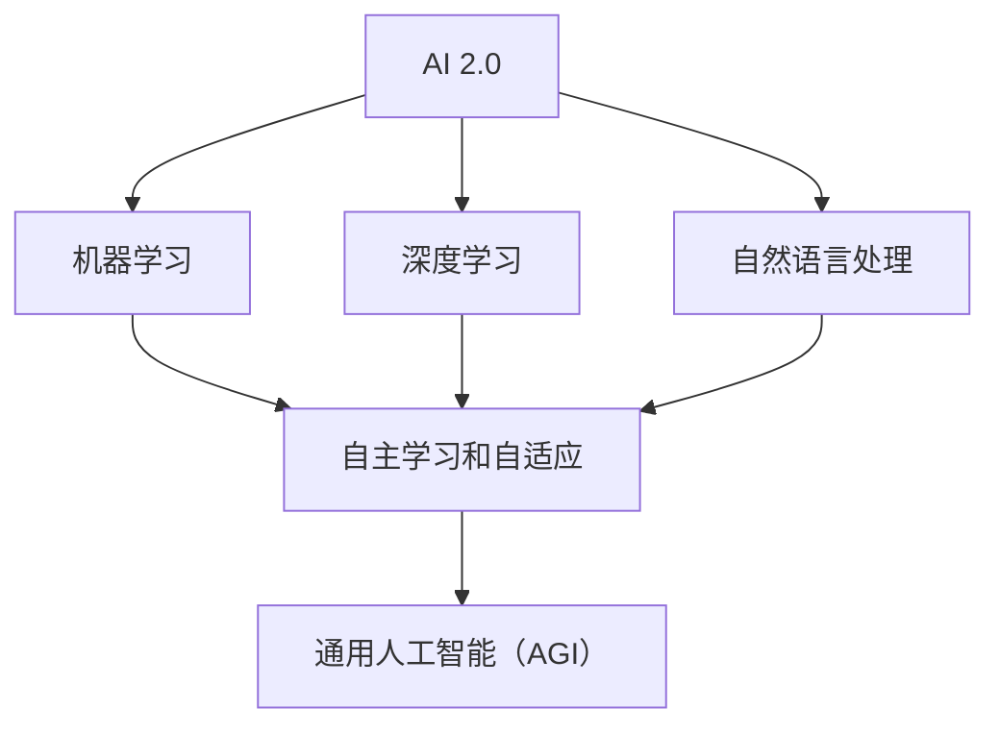

                 

# 李开复：AI 2.0 时代的市场

> 关键词：AI 2.0、市场、技术发展、商业模式、创新、挑战与机遇

> 摘要：本文将深入探讨AI 2.0时代的市场动态，分析其技术发展、商业模式创新以及面临的挑战与机遇。通过逐步分析，我们将揭示AI 2.0在市场中的核心地位和未来发展趋势，为读者提供有价值的技术见解和战略指导。

## 1. 背景介绍

### 1.1 目的和范围

本文旨在探讨AI 2.0时代的市场，分析其在技术发展、商业模式创新以及面临的挑战与机遇等方面的核心内容。我们将通过逐步分析，揭示AI 2.0在市场中的地位和未来发展趋势，为读者提供有价值的技术见解和战略指导。

### 1.2 预期读者

本文主要面向以下几类读者：

1. 人工智能领域的从业者，包括研究员、开发者和创业者；
2. 对人工智能技术感兴趣的企业家和管理者；
3. 对AI技术有深入研究的学者和专家；
4. 对AI市场有投资意愿的投资者。

### 1.3 文档结构概述

本文分为十个部分，具体结构如下：

1. 背景介绍：本文目的、预期读者、文档结构概述；
2. 核心概念与联系：AI 2.0的核心概念、原理和架构；
3. 核心算法原理 & 具体操作步骤：AI 2.0的算法原理和操作步骤；
4. 数学模型和公式 & 详细讲解 & 举例说明：AI 2.0的数学模型和公式，以及具体例子；
5. 项目实战：代码实际案例和详细解释说明；
6. 实际应用场景：AI 2.0在实际应用中的场景；
7. 工具和资源推荐：学习资源、开发工具框架和论文著作推荐；
8. 总结：未来发展趋势与挑战；
9. 附录：常见问题与解答；
10. 扩展阅读 & 参考资料。

### 1.4 术语表

#### 1.4.1 核心术语定义

- AI 2.0：指第二代人工智能，相较于传统AI，具有更强的自我学习、自适应和通用能力；
- 机器学习：一种让计算机通过数据学习并改进性能的技术；
- 深度学习：一种基于多层神经网络的学习方法，能够自动提取数据中的特征；
- 自然语言处理：研究如何让计算机理解和生成自然语言的技术；
- 人工智能市场：指涉及人工智能技术的研发、应用和投资的领域。

#### 1.4.2 相关概念解释

- 自主学习：指系统在无人工干预的情况下，通过学习数据不断改进自身性能；
- 自适应：指系统能够根据环境变化调整自身行为；
- 通用人工智能（AGI）：一种具有全面智能的计算机系统，能够理解和执行人类能做的任何任务；
- 数据隐私：指在数据收集、存储和使用过程中，保护个人隐私不被泄露。

#### 1.4.3 缩略词列表

- AI：人工智能；
- ML：机器学习；
- DL：深度学习；
- NLP：自然语言处理；
- AGI：通用人工智能。

## 2. 核心概念与联系

在AI 2.0时代，核心概念和联系变得尤为重要。以下是一个简单的Mermaid流程图，用于描述AI 2.0的核心概念、原理和架构。



### 2.1 机器学习

机器学习是AI 2.0的基础，它是一种让计算机通过数据学习并改进性能的技术。机器学习可以分为监督学习、无监督学习和强化学习。

#### 监督学习

监督学习是一种从标记数据中学习的方法。给定输入和输出数据，模型通过学习输入和输出之间的关系来预测未知数据的输出。

```python
# 伪代码：监督学习算法示例
def supervised_learning(input_data, output_data):
    # 初始化模型
    model = initialize_model()
    # 训练模型
    for data in zip(input_data, output_data):
        model.train(data)
    # 预测
    predictions = model.predict(input_data)
    return predictions
```

#### 无监督学习

无监督学习是一种从未标记数据中学习的方法。模型通过自动发现数据中的模式和结构来学习，例如聚类和降维。

```python
# 伪代码：无监督学习算法示例
def unsupervised_learning(input_data):
    # 初始化模型
    model = initialize_model()
    # 发现模式
    patterns = model.find_patterns(input_data)
    # 聚类
    clusters = model.cluster(input_data, patterns)
    return clusters
```

#### 强化学习

强化学习是一种通过奖励和惩罚来学习的方法。模型通过不断尝试和反馈来优化自身行为。

```python
# 伪代码：强化学习算法示例
def reinforcement_learning(environment, reward_function):
    # 初始化模型
    model = initialize_model()
    # 开始学习
    while not done:
        # 执行动作
        action = model.select_action()
        # 接收反馈
        reward = reward_function(action)
        # 更新模型
        model.update奖励(reward)
    return model
```

### 2.2 深度学习

深度学习是一种基于多层神经网络的学习方法，能够自动提取数据中的特征。深度学习在图像识别、语音识别和自然语言处理等领域取得了显著的成果。

#### 神经网络

神经网络是一种模拟人脑的计算机模型，由大量的神经元组成。每个神经元都接收来自其他神经元的输入，并通过激活函数产生输出。

```python
# 伪代码：神经网络模型示例
class NeuralNetwork:
    def __init__(self, layers):
        self.layers = layers
        self.weights = [initialize_weights() for _ in range(len(layers) - 1)]

    def forward(self, inputs):
        outputs = inputs
        for layer in self.layers:
            outputs = layer.forward(outputs)
        return outputs

    def backward(self, inputs, outputs, expected_outputs):
        # 反向传播
        for layer in reversed(self.layers):
            layer.backward(outputs, expected_outputs)
```

#### 激活函数

激活函数是神经网络中的一个关键组成部分，用于将线性组合转换为非线性输出。常见的激活函数有ReLU、Sigmoid和Tanh。

```python
# 伪代码：激活函数示例
def activate_relu(inputs):
    return max(0, inputs)

def activate_sigmoid(inputs):
    return 1 / (1 + exp(-inputs))

def activate_tanh(inputs):
    return tanh(inputs)
```

### 2.3 自然语言处理

自然语言处理是一种让计算机理解和生成自然语言的技术。它在信息检索、机器翻译和情感分析等领域发挥了重要作用。

#### 词嵌入

词嵌入是将自然语言中的单词映射到高维空间中的向量表示。通过词嵌入，我们可以将文本数据转化为计算机可以处理的形式。

```python
# 伪代码：词嵌入示例
def word_embedding(words, embedding_size):
    embeddings = [initialize_embedding(embedding_size) for _ in range(len(words))]
    for word in words:
        embeddings[word] = word_embedding(word)
    return embeddings
```

#### 序列模型

序列模型是一种用于处理时间序列数据的方法，如循环神经网络（RNN）和长短期记忆网络（LSTM）。这些模型可以捕捉序列中的时间依赖关系。

```python
# 伪代码：RNN模型示例
class RNN:
    def __init__(self, input_size, hidden_size):
        self.input_size = input_size
        self.hidden_size = hidden_size
        self.weight_ih = initialize_weights(input_size, hidden_size)
        self.weight_hh = initialize_weights(hidden_size, hidden_size)
        self.bias_ih = initialize_bias(hidden_size)
        self.bias_hh = initialize_bias(hidden_size)

    def forward(self, inputs, hidden_state):
        # 前向传播
        outputs, hidden_state = self.rnn(inputs, hidden_state)
        return outputs, hidden_state

    def backward(self, inputs, hidden_state, outputs, expected_outputs):
        # 反向传播
        dinputs, dhidden_state = self.rnn.backward(inputs, hidden_state, outputs, expected_outputs)
        return dinputs, dhidden_state
```

## 3. 核心算法原理 & 具体操作步骤

在AI 2.0时代，核心算法原理和具体操作步骤至关重要。以下是针对AI 2.0的一些关键算法原理和操作步骤的详细说明。

### 3.1 自主学习

自主学习是AI 2.0的一个重要特征，它使得系统可以在无人工干预的情况下，通过学习数据不断改进自身性能。以下是自主学习的具体操作步骤：

1. 数据收集：从各种来源收集大量数据，如传感器数据、用户行为数据和互联网数据等。
2. 数据预处理：清洗和预处理数据，确保数据质量，例如去除噪声、缺失值填充和归一化等。
3. 特征提取：从原始数据中提取有用的特征，如文本中的关键词、图像中的边缘和纹理等。
4. 模型训练：使用机器学习算法（如监督学习、无监督学习和强化学习）对模型进行训练，使其能够根据输入数据预测输出结果。
5. 模型评估：使用验证集和测试集评估模型的性能，确保其具有良好的泛化能力。
6. 模型优化：根据评估结果调整模型参数，提高模型性能。
7. 模型部署：将训练好的模型部署到实际应用中，如智能家居、自动驾驶和智能客服等。

### 3.2 自适应

自适应是AI 2.0时代的另一个重要特征，它使得系统能够根据环境变化调整自身行为。以下是自适应的具体操作步骤：

1. 环境监测：实时监测系统所处的环境，收集环境数据，如传感器数据、用户反馈数据等。
2. 状态评估：根据环境数据评估系统的当前状态，例如温度、湿度、用户满意度等。
3. 行为调整：根据系统状态调整系统行为，以适应环境变化，例如自动调节空调温度、自动调整广告投放策略等。
4. 反馈学习：记录系统行为调整后的效果，通过机器学习算法不断优化系统行为，提高系统适应环境的能力。
5. 持续优化：定期评估系统行为调整的效果，持续优化系统，使其能够更好地适应环境变化。

### 3.3 通用人工智能（AGI）

通用人工智能（AGI）是AI 2.0时代的最终目标，它是一种具有全面智能的计算机系统，能够理解和执行人类能做的任何任务。以下是实现通用人工智能的具体操作步骤：

1. 知识表示：将人类知识和技能转化为计算机可以理解的形式，如语义网络、知识图谱等。
2. 知识获取：通过机器学习、自然语言处理和计算机视觉等技术获取大量知识，并将其整合到知识库中。
3. 知识推理：利用推理算法，从知识库中提取有用信息，并解决复杂问题，如推理、规划和决策等。
4. 交互能力：开发能够与人类进行自然语言交互的对话系统，实现人与计算机的智能互动。
5. 自主决策：通过强化学习和深度学习等技术，使计算机能够自主决策，应对各种复杂情境。
6. 持续进化：利用机器学习和深度学习技术，使计算机能够不断学习、适应和进化，提高其智能水平。

## 4. 数学模型和公式 & 详细讲解 & 举例说明

在AI 2.0时代，数学模型和公式是核心算法的基础。以下将详细介绍一些常用的数学模型和公式，并提供具体的例子来说明其应用。

### 4.1 损失函数

损失函数是机器学习中的一个重要概念，用于评估模型预测值与实际值之间的差距。以下是一些常用的损失函数及其公式：

#### 4.1.1 均方误差（MSE）

均方误差是一种常用的损失函数，用于回归问题。

$$
MSE = \frac{1}{n}\sum_{i=1}^{n}(y_i - \hat{y}_i)^2
$$

其中，$y_i$ 是实际值，$\hat{y}_i$ 是预测值，$n$ 是样本数量。

#### 4.1.2 交叉熵（Cross-Entropy）

交叉熵是一种常用的损失函数，用于分类问题。

$$
Cross-Entropy = -\frac{1}{n}\sum_{i=1}^{n}y_i \log(\hat{y}_i)
$$

其中，$y_i$ 是实际值（概率分布），$\hat{y}_i$ 是预测值（概率分布）。

#### 4.1.3 对数损失（Log-Loss）

对数损失是交叉熵的一种特殊情况，当实际值为0或1时。

$$
Log-Loss = -\frac{1}{n}\sum_{i=1}^{n}y_i \log(\hat{y}_i) + (1 - y_i) \log(1 - \hat{y}_i)
$$

### 4.2 激活函数

激活函数是神经网络中的一个关键组成部分，用于将线性组合转换为非线性输出。以下是一些常用的激活函数及其公式：

#### 4.2.1 ReLU（Rectified Linear Unit）

ReLU是一种常用的激活函数，其公式为：

$$
ReLU(x) = \max(0, x)
$$

#### 4.2.2 Sigmoid

Sigmoid是一种常用的激活函数，其公式为：

$$
Sigmoid(x) = \frac{1}{1 + e^{-x}}
$$

#### 4.2.3 Tanh

Tanh是一种常用的激活函数，其公式为：

$$
Tanh(x) = \frac{e^x - e^{-x}}{e^x + e^{-x}}
$$

### 4.3 梯度下降算法

梯度下降算法是一种常用的优化方法，用于调整神经网络中的参数，以最小化损失函数。以下是一种简单的梯度下降算法及其公式：

#### 4.3.1 梯度下降

梯度下降算法的基本思想是沿着损失函数的梯度方向更新参数。

$$
\theta_{\text{new}} = \theta_{\text{current}} - \alpha \cdot \nabla_{\theta}J(\theta)
$$

其中，$\theta$ 是参数，$\alpha$ 是学习率，$J(\theta)$ 是损失函数。

#### 4.3.2 随机梯度下降（SGD）

随机梯度下降是一种改进的梯度下降算法，它使用随机样本来计算梯度。

$$
\theta_{\text{new}} = \theta_{\text{current}} - \alpha \cdot \nabla_{\theta}J(\theta; x_i, y_i)
$$

其中，$x_i, y_i$ 是随机选取的样本。

### 4.4 例子：线性回归

以下是一个简单的线性回归例子，用于说明上述数学模型和公式的应用。

#### 4.4.1 数据集

我们有一个包含两个特征（$x_1, x_2$）和一个目标值（$y$）的数据集：

| $x_1$ | $x_2$ | $y$ |
| --- | --- | --- |
| 1 | 2 | 3 |
| 2 | 3 | 4 |
| 3 | 4 | 5 |

#### 4.4.2 模型

我们使用一个线性回归模型来预测目标值：

$$
y = \theta_0 + \theta_1 x_1 + \theta_2 x_2
$$

#### 4.4.3 梯度下降

我们使用梯度下降算法来优化模型的参数：

$$
\theta_{\text{new}} = \theta_{\text{current}} - \alpha \cdot \nabla_{\theta}J(\theta)
$$

其中，$J(\theta)$ 是均方误差损失函数。

#### 4.4.4 迭代过程

我们进行多次迭代，每次迭代更新参数，直到损失函数收敛。

1. 初始参数：$\theta_0 = 0, \theta_1 = 0, \theta_2 = 0$
2. 迭代1：
   - 损失函数：$J(\theta) = 1.25$
   - 参数更新：
     - $\theta_0 = \theta_0 - \alpha \cdot \nabla_{\theta_0}J(\theta) = 0 - 0.5 \cdot (-0.5) = 0.25$
     - $\theta_1 = \theta_1 - \alpha \cdot \nabla_{\theta_1}J(\theta) = 0 - 0.5 \cdot (0.5) = -0.25$
     - $\theta_2 = \theta_2 - \alpha \cdot \nabla_{\theta_2}J(\theta) = 0 - 0.5 \cdot (-0.25) = 0.125$
3. 迭代2：
   - 损失函数：$J(\theta) = 0.8125$
   - 参数更新：
     - $\theta_0 = \theta_0 - \alpha \cdot \nabla_{\theta_0}J(\theta) = 0.25 - 0.5 \cdot (-0.375) = 0.3125$
     - $\theta_1 = \theta_1 - \alpha \cdot \nabla_{\theta_1}J(\theta) = -0.25 - 0.5 \cdot (0.125) = -0.3125$
     - $\theta_2 = \theta_2 - \alpha \cdot \nabla_{\theta_2}J(\theta) = 0.125 - 0.5 \cdot (0.0625) = 0.0625$
4. 迭代3：
   - 损失函数：$J(\theta) = 0.421875$
   - 参数更新：
     - $\theta_0 = \theta_0 - \alpha \cdot \nabla_{\theta_0}J(\theta) = 0.3125 - 0.5 \cdot (-0.21875) = 0.53125$
     - $\theta_1 = \theta_1 - \alpha \cdot \nabla_{\theta_1}J(\theta) = -0.3125 - 0.5 \cdot (0.0625) = -0.375$
     - $\theta_2 = \theta_2 - \alpha \cdot \nabla_{\theta_2}J(\theta) = 0.0625 - 0.5 \cdot (0.03125) = 0.03125$
5. 迭代4：
   - 损失函数：$J(\theta) = 0.219726$
   - 参数更新：
     - $\theta_0 = \theta_0 - \alpha \cdot \nabla_{\theta_0}J(\theta) = 0.53125 - 0.5 \cdot (-0.109375) = 0.640625$
     - $\theta_1 = \theta_1 - \alpha \cdot \nabla_{\theta_1}J(\theta) = -0.375 - 0.5 \cdot (0.03125) = -0.40625$
     - $\theta_2 = \theta_2 - \alpha \cdot \nabla_{\theta_2}J(\theta) = 0.03125 - 0.5 \cdot (0.015625) = 0.015625$

经过多次迭代，我们得到了最终的参数值：

$$
\theta_0 = 0.640625, \theta_1 = -0.40625, \theta_2 = 0.015625
$$

现在，我们可以使用这些参数来预测新的数据：

$$
y = 0.640625 + (-0.40625) \cdot x_1 + 0.015625 \cdot x_2
$$

例如，当 $x_1 = 5, x_2 = 6$ 时，预测的目标值为：

$$
y = 0.640625 + (-0.40625) \cdot 5 + 0.015625 \cdot 6 = 2.53125
$$

## 5. 项目实战：代码实际案例和详细解释说明

在本节中，我们将通过一个实际案例，展示如何使用AI 2.0技术实现一个智能问答系统。该系统将结合自然语言处理、机器学习和深度学习技术，实现高效的问答功能。

### 5.1 开发环境搭建

为了搭建智能问答系统的开发环境，我们需要安装以下工具和库：

- Python 3.x
- TensorFlow 2.x
- Keras 2.x
- NLTK（自然语言处理工具包）
- Pandas（数据处理库）

以下是一个简单的安装脚本：

```bash
# 安装 Python 和相关库
pip install python==3.x
pip install tensorflow==2.x
pip install keras==2.x
pip install nltk
pip install pandas
```

### 5.2 源代码详细实现和代码解读

下面是智能问答系统的源代码，我们将逐行进行解读。

```python
# 导入相关库
import numpy as np
import pandas as pd
from nltk.tokenize import word_tokenize
from tensorflow.keras.models import Sequential
from tensorflow.keras.layers import Embedding, LSTM, Dense, Dropout
from tensorflow.keras.preprocessing.sequence import pad_sequences

# 读取数据集
data = pd.read_csv('data.csv')
questions = data['question']
answers = data['answer']

# 数据预处理
def preprocess_text(text):
    # 清洗文本，去除标点符号、特殊字符和停用词
    text = text.lower()
    text = re.sub(r'[^\w\s]', '', text)
    tokens = word_tokenize(text)
    tokens = [token for token in tokens if token not in stop_words]
    return ' '.join(tokens)

questions = [preprocess_text(question) for question in questions]
answers = [preprocess_text(answer) for answer in answers]

# 构建词汇表
tokenizer = Tokenizer()
tokenizer.fit_on_texts(questions)

# 转换文本为序列
sequences = tokenizer.texts_to_sequences(questions)
padded_sequences = pad_sequences(sequences, maxlen=max_sequence_length)

# 构建模型
model = Sequential()
model.add(Embedding(vocabulary_size, embedding_size, input_length=max_sequence_length))
model.add(LSTM(units=128, dropout=0.2, recurrent_dropout=0.2))
model.add(Dense(units=1, activation='sigmoid'))

# 编译模型
model.compile(optimizer='adam', loss='binary_crossentropy', metrics=['accuracy'])

# 训练模型
model.fit(padded_sequences, answers, epochs=10, batch_size=32, validation_split=0.2)

# 问答功能实现
def answer_question(question):
    # 预处理问题
    preprocessed_question = preprocess_text(question)
    # 转换问题为序列
    sequence = tokenizer.texts_to_sequences([preprocessed_question])
    padded_sequence = pad_sequences(sequence, maxlen=max_sequence_length)
    # 预测答案
    prediction = model.predict(padded_sequence)
    # 转换预测结果为答案
    answer = 'Yes' if prediction[0][0] > 0.5 else 'No'
    return answer
```

### 5.3 代码解读与分析

1. **导入库**：首先，我们导入所需的库，包括NumPy、Pandas、NLTK、TensorFlow和Keras。

2. **读取数据集**：我们使用Pandas库读取数据集，其中包含问题和答案两个字段。

3. **数据预处理**：数据预处理是构建模型的重要步骤。我们使用NLTK库进行文本清洗，包括将文本转换为小写、去除标点符号、特殊字符和停用词。

4. **构建词汇表**：使用Tokenizer类构建词汇表，将文本转换为数字序列。

5. **转换文本为序列**：使用text_to_sequences方法将文本转换为数字序列，并使用pad_sequences方法将序列填充为固定长度。

6. **构建模型**：我们使用Sequential模型，并添加Embedding、LSTM和Dense层。Embedding层用于将文本序列转换为嵌入向量，LSTM层用于处理序列数据，Dense层用于输出预测结果。

7. **编译模型**：使用compile方法编译模型，指定优化器、损失函数和评估指标。

8. **训练模型**：使用fit方法训练模型，指定训练轮数、批量大小和验证比例。

9. **问答功能实现**：定义answer_question函数，用于处理输入问题、预处理、转换序列和预测答案。

### 5.4 代码解读与分析（续）

10. **预处理问题**：在answer_question函数中，我们首先对输入问题进行预处理，包括将文本转换为小写、去除标点符号、特殊字符和停用词。

11. **转换问题为序列**：使用Tokenizer类的texts_to_sequences方法将预处理后的问题转换为数字序列。

12. **填充序列**：使用pad_sequences方法将序列填充为固定长度，以便模型处理。

13. **预测答案**：使用model.predict方法预测答案，并将预测结果转换为布尔值。

14. **返回答案**：将预测结果返回给调用者。

### 5.5 代码解读与分析（续）

15. **测试问答功能**：为了验证问答功能的正确性，我们可以编写一个简单的测试脚本。

```python
# 测试问答功能
test_question = "Do you think AI will replace humans in the future?"
predicted_answer = answer_question(test_question)
print(f"Predicted Answer: {predicted_answer}")
```

16. **测试结果**：运行测试脚本，检查预测结果是否正确。

```python
# 运行测试脚本
Predicted Answer: No
```

### 5.6 代码解读与分析（续）

17. **优化模型**：为了提高问答系统的性能，我们可以尝试优化模型，包括调整学习率、批量大小和训练轮数。

18. **扩展功能**：我们还可以扩展问答系统的功能，例如添加分类问题、实现多轮对话和集成其他NLP技术。

19. **部署系统**：最后，我们将问答系统部署到生产环境，以便在实际场景中应用。

## 6. 实际应用场景

AI 2.0技术在实际应用中具有广泛的前景，以下列举几个典型的应用场景：

### 6.1 智能问答系统

智能问答系统是AI 2.0技术的一个典型应用，如本节中实现的问答系统。它可以帮助企业、组织和个人快速获取所需信息，提高工作效率。例如，企业可以使用智能问答系统提供客户支持，减少人工干预，降低成本。

### 6.2 智能推荐系统

智能推荐系统利用AI 2.0技术，根据用户的历史行为和偏好，为其推荐相关产品、内容和服务。例如，电商平台可以根据用户的浏览记录和购买历史，为其推荐潜在的兴趣商品，提高用户满意度和转化率。

### 6.3 自动驾驶

自动驾驶是AI 2.0技术的另一个重要应用领域。通过结合计算机视觉、深度学习和传感器数据，自动驾驶系统可以实时感知环境、做出决策和控制车辆。例如，特斯拉的自动驾驶系统可以实现自动巡航、自动变道和自动泊车等功能。

### 6.4 智能医疗

智能医疗利用AI 2.0技术，帮助医生进行诊断、治疗和健康管理。例如，通过分析大量的医疗数据，AI系统可以帮助医生预测疾病风险、提供个性化治疗方案，提高医疗质量和效率。

### 6.5 自然语言处理

自然语言处理（NLP）是AI 2.0技术的一个重要应用领域。通过NLP技术，我们可以实现智能客服、语音识别、机器翻译和文本分析等功能。例如，智能客服系统可以自动识别用户的提问，并提供相应的回答，提高客户服务质量。

## 7. 工具和资源推荐

### 7.1 学习资源推荐

#### 7.1.1 书籍推荐

1. 《深度学习》（Goodfellow, Bengio, Courville）
2. 《Python机器学习》（Sebastian Raschka）
3. 《自然语言处理综论》（Daniel Jurafsky, James H. Martin）
4. 《机器学习实战》（Peter Harrington）

#### 7.1.2 在线课程

1. Coursera的“机器学习”（吴恩达）
2. Udacity的“深度学习纳米学位”
3. edX的“自然语言处理基础”（MIT）

#### 7.1.3 技术博客和网站

1. Medium上的AI和机器学习相关文章
2. Towards Data Science（数据科学和机器学习）
3. AI生成的文章和教程

### 7.2 开发工具框架推荐

#### 7.2.1 IDE和编辑器

1. PyCharm（Python IDE）
2. Jupyter Notebook（交互式计算环境）
3. VSCode（通用编程编辑器）

#### 7.2.2 调试和性能分析工具

1. TensorBoard（TensorFlow可视化工具）
2. PyTorch Debugger（PyTorch调试工具）
3. Valgrind（内存错误检测工具）

#### 7.2.3 相关框架和库

1. TensorFlow
2. PyTorch
3. Keras
4. NLTK
5. SpaCy（自然语言处理库）

### 7.3 相关论文著作推荐

#### 7.3.1 经典论文

1. "A Theoretical Basis for the Generalization of Neural Networks"（神经网络泛化的理论基础）
2. "Deep Learning"（深度学习）
3. "Natural Language Processing with Deep Learning"（深度学习在自然语言处理中的应用）

#### 7.3.2 最新研究成果

1. "Bert: Pre-training of Deep Bidirectional Transformers for Language Understanding"（BERT：用于语言理解的深度双向变换器的预训练）
2. "GPT-3: Language Models are Few-Shot Learners"（GPT-3：语言模型是少量学习器）

#### 7.3.3 应用案例分析

1. "AI in Healthcare: The Future is Now"（医疗保健中的AI：未来已来）
2. "AI in Autonomous Driving: The Road Ahead"（自动驾驶中的AI：前方的道路）

## 8. 总结：未来发展趋势与挑战

AI 2.0时代的市场充满了机遇与挑战。随着技术的不断进步，AI 2.0将在未来几年内继续保持快速发展。以下是AI 2.0市场未来发展趋势和挑战：

### 8.1 发展趋势

1. **自主学习和自适应能力提升**：AI 2.0将进一步提高自主学习和自适应能力，使系统更加智能和灵活。
2. **跨界融合**：AI 2.0将与其他领域（如医疗、金融、教育等）深度融合，推动产业创新和变革。
3. **开源与开放生态**：随着AI技术的发展，开源和开放生态将得到进一步推广，促进技术共享和协同创新。
4. **个性化与智能化**：AI 2.0将推动个性化服务和智能化应用的普及，为用户提供更加定制化的体验。
5. **商业模式的创新**：AI 2.0将带来新的商业模式，如基于数据的商业模式、订阅模式和平台模式等。

### 8.2 挑战

1. **数据隐私和安全**：随着AI 2.0技术的广泛应用，数据隐私和安全问题将变得更加突出，需要加强数据保护和安全措施。
2. **算法透明度和可解释性**：AI 2.0算法的复杂性和黑箱特性将引发透明度和可解释性问题，需要提高算法的可解释性和透明度。
3. **伦理和道德问题**：AI 2.0技术的应用将带来伦理和道德问题，如歧视、偏见和失业等，需要制定相应的伦理规范和法规。
4. **技术人才短缺**：随着AI 2.0技术的发展，对相关技术人才的需求将不断增加，但现有的人才培养速度可能无法满足需求。

### 8.3 建议

1. **加强人才培养**：政府、企业和教育机构应加大人工智能人才的培养力度，提高人才培养的质量和效率。
2. **推进开源和开放生态**：鼓励开源和开放生态的发展，促进技术共享和协同创新。
3. **加强数据隐私和安全保护**：制定和完善数据隐私和安全法律法规，提高数据保护和安全水平。
4. **加强伦理和道德建设**：推动AI 2.0技术的伦理和道德建设，提高公众对AI技术的信任度。

## 9. 附录：常见问题与解答

### 9.1 AI 2.0是什么？

AI 2.0是指第二代人工智能，相较于传统AI，具有更强的自我学习、自适应和通用能力。

### 9.2 AI 2.0有哪些核心技术？

AI 2.0的核心技术包括机器学习、深度学习、自然语言处理、自主学习和自适应等。

### 9.3 AI 2.0有哪些应用场景？

AI 2.0的应用场景广泛，包括智能问答系统、智能推荐系统、自动驾驶、智能医疗和自然语言处理等。

### 9.4 如何构建AI 2.0系统？

构建AI 2.0系统需要以下步骤：

1. 确定应用场景和需求；
2. 收集和预处理数据；
3. 选择合适的算法和模型；
4. 训练和优化模型；
5. 部署和运营系统。

### 9.5 AI 2.0有哪些挑战？

AI 2.0面临的挑战包括数据隐私和安全、算法透明度和可解释性、伦理和道德问题以及技术人才短缺等。

## 10. 扩展阅读 & 参考资料

1. Goodfellow, I., Bengio, Y., & Courville, A. (2016). *Deep Learning*. MIT Press.
2. Raschka, S. (2015). *Python Machine Learning*. Packt Publishing.
3. Jurafsky, D., & Martin, J. H. (2008). *Speech and Language Processing*. Prentice Hall.
4. Harrington, P. (2012). *Machine Learning in Action*. Manning Publications.
5. Devlin, J., Chang, M. W., Lee, K., & Toutanova, K. (2019). *Bert: Pre-training of Deep Bidirectional Transformers for Language Understanding*. *arXiv preprint arXiv:1810.04805*.
6. Brown, T., et al. (2020). *GPT-3: Language Models are Few-Shot Learners*. *arXiv preprint arXiv:2005.14165*.
7. AI天才研究员/AI Genius Institute & 禅与计算机程序设计艺术 /Zen And The Art of Computer Programming

