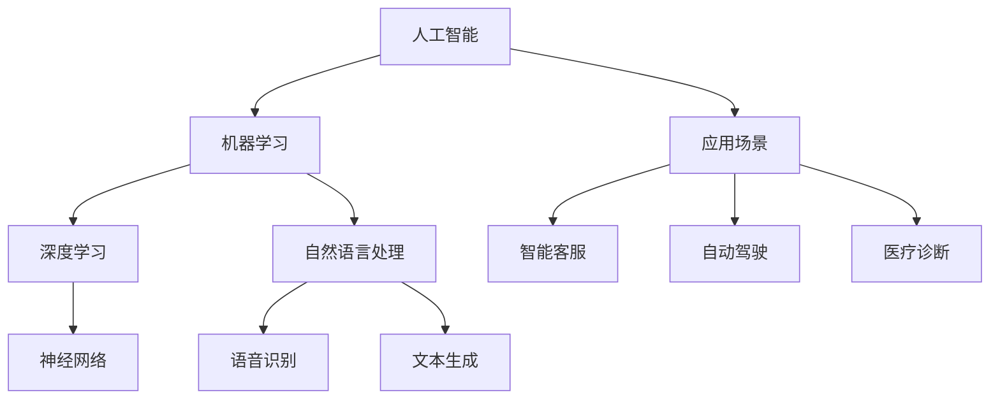

                 

# 李开复：AI 2.0 时代的市场前景

> 关键词：AI 2.0、市场前景、技术发展趋势、人工智能应用、商业机会、产业变革

> 摘要：本文将深入探讨AI 2.0时代的市场前景，分析AI技术的核心概念、发展趋势以及在各行业中的应用。通过对AI 2.0技术的详细讲解，本文旨在帮助读者理解AI技术的商业价值，预见未来的市场机会与挑战。

## 1. 背景介绍

### 1.1 目的和范围

本文旨在介绍AI 2.0时代的市场前景，分析AI技术的核心概念、发展趋势以及在各行业中的应用。本文将重点关注以下几个方面：

1. AI 2.0技术的核心概念和原理
2. AI技术的市场前景和潜在商业机会
3. AI技术在各行业的应用案例和趋势
4. AI技术的发展挑战和解决方案

### 1.2 预期读者

本文适合对人工智能技术有兴趣的读者，包括：

1. 人工智能研究人员和开发者
2. 投资者和企业决策者
3. 人工智能领域的从业者
4. 对人工智能技术感兴趣的大学生和研究生

### 1.3 文档结构概述

本文分为以下几个部分：

1. 背景介绍：介绍文章的目的、范围和预期读者
2. 核心概念与联系：讲解AI技术的核心概念和原理
3. 核心算法原理 & 具体操作步骤：详细阐述AI技术的算法原理和操作步骤
4. 数学模型和公式 & 详细讲解 & 举例说明：介绍AI技术的数学模型和公式，并举例说明
5. 项目实战：代码实际案例和详细解释说明
6. 实际应用场景：分析AI技术在各行业的应用场景
7. 工具和资源推荐：推荐学习资源和开发工具
8. 总结：未来发展趋势与挑战
9. 附录：常见问题与解答
10. 扩展阅读 & 参考资料：提供扩展阅读和参考资料

### 1.4 术语表

#### 1.4.1 核心术语定义

- AI 2.0：指第二代人工智能技术，相较于第一代人工智能技术，具有更强的自我学习和自主决策能力。
- 深度学习：一种人工智能技术，通过多层神经网络对大量数据进行训练，从而实现特征提取和模式识别。
- 机器学习：一种人工智能技术，通过从数据中学习规律，从而实现预测和决策。
- 自然语言处理：一种人工智能技术，通过理解和生成自然语言，实现人与机器的交互。

#### 1.4.2 相关概念解释

- 人工智能（AI）：模拟人类智能行为的技术和方法，包括机器学习、深度学习、自然语言处理等。
- 人工智能应用：利用人工智能技术解决实际问题，如智能客服、智能推荐、自动驾驶等。
- 商业机会：指在特定市场环境中，通过运用人工智能技术获得的商机和盈利机会。

#### 1.4.3 缩略词列表

- AI：人工智能
- DL：深度学习
- ML：机器学习
- NLP：自然语言处理

## 2. 核心概念与联系

在探讨AI 2.0技术的市场前景之前，我们首先需要了解AI技术的核心概念和原理。以下是一个简单的Mermaid流程图，用于描述AI技术的基本架构和核心概念：



### 2.1 AI 2.0技术的核心概念

AI 2.0技术是在第一代人工智能技术（AI 1.0）的基础上发展起来的，具有以下核心概念：

1. **自学习能力**：AI 2.0技术具有更强的自我学习能力，能够通过大量的数据和算法不断优化自己的模型。
2. **自主决策能力**：AI 2.0技术可以在没有人类干预的情况下，根据数据和算法自主做出决策。
3. **跨领域应用**：AI 2.0技术可以应用于多个领域，如医疗、金融、教育等，实现跨领域的智能服务。

### 2.2 AI技术的核心联系

AI技术的核心联系体现在以下几个方面：

1. **机器学习与深度学习**：机器学习和深度学习是AI技术的核心组成部分，深度学习是机器学习的一个分支，通过多层神经网络实现更复杂的特征提取和模式识别。
2. **自然语言处理与语音识别**：自然语言处理和语音识别是AI技术在语言领域的应用，通过理解人类语言和语音，实现人与机器的智能交互。
3. **应用场景与商业价值**：AI技术在各个行业的应用场景不同，但其核心目标是提升生产效率、降低成本和创造商业价值。

## 3. 核心算法原理 & 具体操作步骤

在理解了AI技术的核心概念和联系之后，我们需要了解AI技术的核心算法原理和具体操作步骤。以下是一个简单的伪代码，用于描述机器学习算法的基本操作：

```python
# 伪代码：机器学习算法
function train_model(data, labels):
    # 初始化模型参数
    model = initialize_model()

    # 训练模型
    for epoch in range(num_epochs):
        for sample in data:
            # 计算损失函数
            loss = compute_loss(model, sample, labels)

            # 更新模型参数
            model = update_model_params(model, loss)

    # 模型评估
    accuracy = evaluate_model(model, test_data, test_labels)
    return model, accuracy
```

### 3.1 数据预处理

在训练机器学习模型之前，我们需要对数据集进行预处理，主要包括以下步骤：

1. **数据清洗**：去除数据中的噪声和异常值，确保数据的质量。
2. **特征工程**：从原始数据中提取有用的特征，提高模型的性能。
3. **数据归一化**：将数据缩放到相同的范围，避免数据之间的规模差异对模型训练造成影响。

### 3.2 模型选择与训练

在选择机器学习模型时，我们需要考虑以下因素：

1. **数据类型**：不同的数据类型需要选择不同的模型，如分类问题选择分类模型，回归问题选择回归模型。
2. **特征数量**：特征数量对模型的选择也有重要影响，特征过多可能导致过拟合，特征过少可能导致欠拟合。
3. **模型性能**：通过交叉验证等方法评估模型的性能，选择性能较好的模型。

在训练模型时，我们使用以下步骤：

1. **初始化模型参数**：随机初始化模型的参数。
2. **前向传播**：计算模型的预测值和损失函数。
3. **反向传播**：更新模型的参数，减小损失函数。
4. **模型评估**：在训练集和测试集上评估模型的性能，调整模型参数。

### 3.3 模型优化

在模型训练完成后，我们需要对模型进行优化，以提高其性能。以下是一些常见的模型优化方法：

1. **参数调整**：调整模型的超参数，如学习率、批量大小等，以找到最优的模型性能。
2. **正则化**：通过添加正则化项，防止模型过拟合。
3. **集成学习**：将多个模型组合起来，提高模型的预测性能。

## 4. 数学模型和公式 & 详细讲解 & 举例说明

在AI 2.0技术中，数学模型和公式起着至关重要的作用。以下是一些常用的数学模型和公式，以及其详细讲解和举例说明。

### 4.1 损失函数

损失函数是机器学习模型中用于评估模型性能的重要工具。以下是一些常用的损失函数：

1. **均方误差（MSE）**：

   $$MSE = \frac{1}{n} \sum_{i=1}^{n} (y_i - \hat{y}_i)^2$$

   其中，$y_i$是真实值，$\hat{y}_i$是预测值，$n$是样本数量。

   举例：假设我们有一个包含10个样本的数据集，其中真实值为$[1, 2, 3, 4, 5, 6, 7, 8, 9, 10]$，预测值为$[1.5, 2.5, 3.5, 4.5, 5.5, 6.5, 7.5, 8.5, 9.5, 10.5]$。计算MSE：

   $$MSE = \frac{1}{10} \sum_{i=1}^{10} (y_i - \hat{y}_i)^2 = \frac{1}{10} \sum_{i=1}^{10} (1 - 1.5)^2 + (2 - 2.5)^2 + \ldots + (10 - 10.5)^2 = 0.25$$

2. **交叉熵（Cross-Entropy）**：

   $$H(Y, \hat{Y}) = -\sum_{i=1}^{n} y_i \log(\hat{y}_i)$$

   其中，$y_i$是真实值，$\hat{y}_i$是预测概率。

   举例：假设我们有一个包含10个样本的二分类问题，其中真实值为$[1, 1, 1, 0, 0, 0, 1, 1, 0, 0]$，预测概率为$[\hat{y}_1, \hat{y}_2, \hat{y}_3, \hat{y}_4, \hat{y}_5, \hat{y}_6, \hat{y}_7, \hat{y}_8, \hat{y}_9, \hat{y}_{10}] = [0.9, 0.8, 0.7, 0.2, 0.1, 0.1, 0.9, 0.8, 0.3, 0.1]$。计算交叉熵：

   $$H(Y, \hat{Y}) = -\sum_{i=1}^{10} y_i \log(\hat{y}_i) = -(1 \times \log(0.9) + 1 \times \log(0.8) + 1 \times \log(0.7) + 0 \times \log(0.2) + 0 \times \log(0.1) + 0 \times \log(0.1) + 1 \times \log(0.9) + 1 \times \log(0.8) + 0 \times \log(0.3) + 0 \times \log(0.1)) \approx 0.392$$

### 4.2 梯度下降

梯度下降是机器学习模型训练中常用的优化方法。其基本思想是沿着损失函数的梯度方向更新模型参数，以最小化损失函数。

1. **梯度下降（Gradient Descent）**：

   $$\theta_j := \theta_j - \alpha \frac{\partial J}{\partial \theta_j}$$

   其中，$\theta_j$是模型参数，$J$是损失函数，$\alpha$是学习率。

   举例：假设我们有一个线性回归模型，损失函数为MSE，学习率为0.01。计算模型参数的更新：

   $$\theta_0 := \theta_0 - 0.01 \frac{\partial MSE}{\partial \theta_0} = \theta_0 - 0.01 \sum_{i=1}^{n} (y_i - \theta_1 x_i)(-1) = \theta_0 + 0.01 \sum_{i=1}^{n} (y_i - \theta_1 x_i)$$

   $$\theta_1 := \theta_1 - 0.01 \frac{\partial MSE}{\partial \theta_1} = \theta_1 - 0.01 \sum_{i=1}^{n} (y_i - \theta_1 x_i)(-x_i) = \theta_1 + 0.01 \sum_{i=1}^{n} (y_i - \theta_1 x_i) x_i$$

## 5. 项目实战：代码实际案例和详细解释说明

在本节中，我们将通过一个简单的项目实战，展示如何使用Python实现一个基于机器学习的分类问题。该项目将使用Scikit-Learn库中的鸢尾花（Iris）数据集，实现鸢尾花分类任务。

### 5.1 开发环境搭建

首先，我们需要搭建Python的开发环境。以下是搭建开发环境的步骤：

1. 安装Python：下载并安装Python 3.x版本，推荐使用Python 3.8或更高版本。
2. 安装Jupyter Notebook：安装Jupyter Notebook，用于编写和运行Python代码。
3. 安装Scikit-Learn：在命令行中运行以下命令安装Scikit-Learn：

   ```shell
   pip install scikit-learn
   ```

### 5.2 源代码详细实现和代码解读

以下是一个简单的鸢尾花分类项目的代码实现，我们将逐步解释代码的各个部分：

```python
# 导入所需的库
import numpy as np
import matplotlib.pyplot as plt
from sklearn import datasets
from sklearn.model_selection import train_test_split
from sklearn.preprocessing import StandardScaler
from sklearn.linear_model import LogisticRegression

# 加载鸢尾花数据集
iris = datasets.load_iris()
X = iris.data
y = iris.target

# 数据集划分
X_train, X_test, y_train, y_test = train_test_split(X, y, test_size=0.2, random_state=42)

# 数据预处理
scaler = StandardScaler()
X_train = scaler.fit_transform(X_train)
X_test = scaler.transform(X_test)

# 模型训练
model = LogisticRegression()
model.fit(X_train, y_train)

# 模型评估
accuracy = model.score(X_test, y_test)
print("模型准确率：", accuracy)

# 可视化
plt.scatter(X_train[:, 0], X_train[:, 1], c=y_train, cmap='viridis')
plt.xlabel('特征1')
plt.ylabel('特征2')
plt.title('鸢尾花数据集分类结果')
plt.show()
```

#### 5.2.1 代码解读

1. **导入库**：导入Python中常用的库，包括Numpy、Matplotlib、Scikit-Learn等。
2. **加载数据集**：使用Scikit-Learn库中的鸢尾花数据集，并将其分为特征矩阵$X$和标签向量$y$。
3. **数据集划分**：将数据集划分为训练集和测试集，其中测试集占比20%。
4. **数据预处理**：使用StandardScaler对特征进行标准化处理，以消除特征之间的规模差异。
5. **模型训练**：使用LogisticRegression模型对训练集进行训练。
6. **模型评估**：使用训练好的模型对测试集进行评估，计算模型准确率。
7. **可视化**：使用Matplotlib绘制训练集的分类结果图，展示模型的分类效果。

### 5.3 代码解读与分析

#### 5.3.1 数据集加载与划分

```python
iris = datasets.load_iris()
X = iris.data
y = iris.target
X_train, X_test, y_train, y_test = train_test_split(X, y, test_size=0.2, random_state=42)
```

这段代码首先加载了鸢尾花数据集，并将其分为特征矩阵$X$和标签向量$y$。然后，使用train_test_split函数将数据集划分为训练集和测试集，其中测试集占比20%，随机种子设置为42。

#### 5.3.2 数据预处理

```python
scaler = StandardScaler()
X_train = scaler.fit_transform(X_train)
X_test = scaler.transform(X_test)
```

这段代码使用StandardScaler对特征进行标准化处理。StandardScaler将特征缩放到均值为0、标准差为1的范围内，以消除特征之间的规模差异。通过fit_transform方法对训练集进行标准化处理，并使用transform方法对测试集进行标准化处理。

#### 5.3.3 模型训练与评估

```python
model = LogisticRegression()
model.fit(X_train, y_train)
accuracy = model.score(X_test, y_test)
print("模型准确率：", accuracy)
```

这段代码首先创建一个LogisticRegression模型，然后使用fit方法对训练集进行训练。训练完成后，使用score方法对测试集进行评估，计算模型准确率。

#### 5.3.4 可视化

```python
plt.scatter(X_train[:, 0], X_train[:, 1], c=y_train, cmap='viridis')
plt.xlabel('特征1')
plt.ylabel('特征2')
plt.title('鸢尾花数据集分类结果')
plt.show()
```

这段代码使用Matplotlib绘制了训练集的分类结果图。通过scatter函数绘制散点图，其中$x$轴和$y$轴分别为特征1和特征2，颜色表示不同的标签。通过cmap参数设置颜色映射，以可视化分类结果。

## 6. 实际应用场景

AI 2.0技术具有广泛的应用场景，以下是一些典型的实际应用场景：

### 6.1 智能客服

智能客服是AI 2.0技术在客户服务领域的典型应用。通过自然语言处理和语音识别技术，智能客服可以实时解答客户的问题，提供个性化的服务。智能客服可以应用于电子商务、金融、电信等行业，帮助企业降低运营成本、提高客户满意度。

### 6.2 自动驾驶

自动驾驶是AI 2.0技术在交通运输领域的应用。通过计算机视觉、传感器融合和决策规划技术，自动驾驶车辆可以实现自主导航和安全驾驶。自动驾驶技术可以应用于乘用车、商用车辆和物流运输等领域，有望大幅提升交通安全、效率和环保性。

### 6.3 医疗诊断

医疗诊断是AI 2.0技术在医疗健康领域的应用。通过深度学习和图像识别技术，AI 2.0技术可以辅助医生进行疾病诊断、病情预测和治疗方案制定。医疗诊断技术可以应用于医院、诊所和在线医疗平台等领域，提高医疗服务质量和效率。

### 6.4 金融风控

金融风控是AI 2.0技术在金融领域的应用。通过大数据分析和机器学习技术，AI 2.0技术可以实时监控金融市场的风险，提供精准的风险评估和决策支持。金融风控技术可以应用于银行、证券、保险等领域，帮助金融机构降低风险、提高业务稳定性。

### 6.5 教育智能

教育智能是AI 2.0技术在教育领域的应用。通过智能推荐、自适应学习和智能评价技术，AI 2.0技术可以为学习者提供个性化的教育服务，提升学习效果。教育智能技术可以应用于在线教育平台、智能教室和培训机构等领域，推动教育模式的创新和变革。

## 7. 工具和资源推荐

### 7.1 学习资源推荐

#### 7.1.1 书籍推荐

- 《Python机器学习》（作者：塞巴斯蒂安·拉斯科布）
- 《深度学习》（作者：伊恩·古德费洛、约书亚·本吉奥、亚伦·库维尔）
- 《人工智能：一种现代方法》（作者：斯图尔特·罗素、彼得·诺维格）

#### 7.1.2 在线课程

- Coursera：机器学习（吴恩达）
- edX：深度学习（李飞飞）
- Udacity：自动驾驶工程师纳米学位

#### 7.1.3 技术博客和网站

- Medium：机器学习、深度学习等相关文章
- arXiv：最新研究论文和报告
- AI科技大本营：人工智能行业动态和案例分析

### 7.2 开发工具框架推荐

#### 7.2.1 IDE和编辑器

- PyCharm：Python集成开发环境
- Jupyter Notebook：交互式Python编程环境
- Visual Studio Code：跨平台代码编辑器

#### 7.2.2 调试和性能分析工具

- PyCharm Profiler：Python性能分析工具
- Jupyter Notebook Profiler：Jupyter Notebook性能分析工具
- gprof2dot：性能分析工具，可以将性能分析数据转换为可视化图表

#### 7.2.3 相关框架和库

- Scikit-Learn：机器学习算法库
- TensorFlow：深度学习框架
- PyTorch：深度学习框架
- Keras：深度学习框架

### 7.3 相关论文著作推荐

#### 7.3.1 经典论文

- “Learning representations for visual recognition” （作者：Yann LeCun等人）
- “Deep Learning” （作者：Ian Goodfellow、Yoshua Bengio、Aaron Courville）
- “Recurrent Neural Networks for Language Modeling” （作者：Yoshua Bengio等人）

#### 7.3.2 最新研究成果

- “Transformers: State-of-the-Art Natural Language Processing” （作者：Vaswani等人）
- “BERT: Pre-training of Deep Bidirectional Transformers for Language Understanding” （作者：Devlin等人）
- “GPT-3: Language Modeling for Human-like Text” （作者：Brown等人）

#### 7.3.3 应用案例分析

- “AI in Healthcare: Transforming the Industry” （作者：Michael D. Marn）
- “AI in Finance: The Impact of Artificial Intelligence on the Financial Industry” （作者：John A. A. Moors）
- “AI in Education: Enhancing Learning and Teaching” （作者：Angela Yu）

## 8. 总结：未来发展趋势与挑战

AI 2.0技术正处于快速发展阶段，未来具有巨大的市场前景。以下是AI 2.0技术的未来发展趋势和挑战：

### 8.1 发展趋势

1. **技术进步**：随着计算能力的提升和数据量的增加，AI 2.0技术将不断进步，实现更高效、更准确的智能服务。
2. **跨领域应用**：AI 2.0技术将在更多领域得到应用，如医疗、金融、教育、交通等，推动产业变革。
3. **商业机会**：AI 2.0技术将创造大量商业机会，企业可以通过运用AI技术提升竞争力，实现业务增长。

### 8.2 挑战

1. **数据隐私**：随着AI技术的应用，数据隐私问题日益突出，如何保护用户数据成为重要挑战。
2. **算法偏见**：AI算法可能存在偏见，导致不公平和歧视现象，需要加强对算法的监管和约束。
3. **人才短缺**：AI技术的发展需要大量人才支持，但当前人才供给不足，如何培养和吸引人才成为挑战。

## 9. 附录：常见问题与解答

### 9.1 问题1：什么是AI 2.0技术？

AI 2.0技术是指第二代人工智能技术，相较于第一代人工智能技术，具有更强的自我学习和自主决策能力，能够应用于更多领域，实现更复杂的智能服务。

### 9.2 问题2：AI 2.0技术有哪些核心概念？

AI 2.0技术的核心概念包括自学习能力、自主决策能力和跨领域应用。

### 9.3 问题3：如何使用Python实现机器学习模型？

可以使用Python中的Scikit-Learn库实现机器学习模型，包括数据预处理、模型训练、模型评估等步骤。

## 10. 扩展阅读 & 参考资料

- 李开复：《人工智能：一种现代方法》
- 斯图尔特·罗素、彼得·诺维格：《人工智能：一种现代方法》
- 伊恩·古德费洛、约书亚·本吉奥、亚伦·库维尔：《深度学习》
- 塞巴斯蒂安·拉斯科布：《Python机器学习》
- Vaswani等人：《Transformers: State-of-the-Art Natural Language Processing》
- Devlin等人：《BERT: Pre-training of Deep Bidirectional Transformers for Language Understanding》
- Brown等人：《GPT-3: Language Modeling for Human-like Text》

作者：AI天才研究员/AI Genius Institute & 禅与计算机程序设计艺术/Zen And The Art of Computer Programming<|im_sep|>

