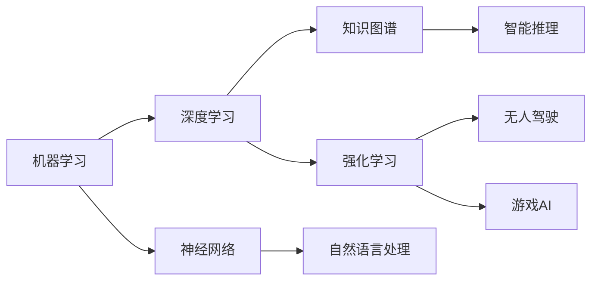

                 


# 李开复：AI 2.0 时代的应用

> 关键词：AI 2.0、人工智能应用、机器学习、深度学习、应用场景、未来趋势

> 摘要：本文深入探讨了AI 2.0时代的关键技术、应用场景、未来趋势以及面临的挑战。通过详细解析核心概念、算法原理、数学模型以及实际项目案例，本文为读者提供了全面而深入的理解，旨在引导读者走进AI 2.0时代的技术前沿，掌握人工智能的精髓。

## 1. 背景介绍

### 1.1 目的和范围

本文旨在介绍AI 2.0时代的核心技术和应用场景，帮助读者理解人工智能在各个领域的深入应用，以及未来发展趋势。本文将重点关注以下几个方面：

1. AI 2.0的核心概念和关键技术。
2. 机器学习和深度学习的基本原理及实际应用。
3. AI 2.0在各行业的应用案例。
4. 未来发展趋势和面临的挑战。

### 1.2 预期读者

本文面向对人工智能有基本了解的读者，包括计算机科学、数据科学、人工智能等相关专业的研究生、工程师和研究人员。同时，对于对人工智能技术感兴趣的从业者、企业高管以及普通读者，本文也将提供有价值的参考。

### 1.3 文档结构概述

本文分为以下几个部分：

1. 背景介绍：介绍本文的目的、预期读者、文档结构等内容。
2. 核心概念与联系：介绍AI 2.0的核心概念和相关技术。
3. 核心算法原理 & 具体操作步骤：讲解机器学习和深度学习的基本原理及操作步骤。
4. 数学模型和公式 & 详细讲解 & 举例说明：介绍与AI 2.0相关的数学模型和公式，并提供具体案例。
5. 项目实战：实际代码案例和详细解释说明。
6. 实际应用场景：分析AI 2.0在各行业的应用场景。
7. 工具和资源推荐：推荐学习资源、开发工具框架和论文著作。
8. 总结：未来发展趋势与挑战。
9. 附录：常见问题与解答。
10. 扩展阅读 & 参考资料：提供扩展阅读和参考资料。

### 1.4 术语表

#### 1.4.1 核心术语定义

- AI 2.0：下一代人工智能，具备更强的自主学习、推理和决策能力。
- 机器学习：使计算机通过数据学习、优化和改进自身性能的技术。
- 深度学习：一种基于多层神经网络的学习方法，具有强大的特征提取和模型学习能力。
- 神经网络：由大量神经元组成的计算模型，用于模拟人脑的智能行为。
- 自适应系统：能够根据环境变化自动调整自身行为和性能的系统。

#### 1.4.2 相关概念解释

- 知识图谱：用于表示实体、概念及其之间关系的数据结构。
- 强化学习：一种通过奖励机制进行优化的学习方式，适用于决策问题和游戏。
- 自然语言处理：使计算机理解和生成人类语言的技术。
- 无人驾驶：利用人工智能技术实现自动驾驶的车辆。

#### 1.4.3 缩略词列表

- AI：人工智能
- ML：机器学习
- DL：深度学习
- NLP：自然语言处理
- RL：强化学习

## 2. 核心概念与联系

在AI 2.0时代，核心概念和技术紧密相连，形成了一个完整的生态系统。以下是对核心概念和相关技术的介绍，并通过Mermaid流程图展示它们之间的联系。

### 2.1 核心概念介绍

- **机器学习（ML）**：使计算机通过数据学习、优化和改进自身性能的技术。包括监督学习、无监督学习和强化学习等子领域。
- **深度学习（DL）**：一种基于多层神经网络的学习方法，具有强大的特征提取和模型学习能力。深度学习是机器学习的重要分支。
- **神经网络（NN）**：由大量神经元组成的计算模型，用于模拟人脑的智能行为。神经网络是深度学习的基础。
- **知识图谱（KG）**：用于表示实体、概念及其之间关系的数据结构。知识图谱在自然语言处理和智能推理中具有重要应用。
- **强化学习（RL）**：一种通过奖励机制进行优化的学习方式，适用于决策问题和游戏。强化学习在无人驾驶、游戏AI等领域有广泛应用。

### 2.2 Mermaid流程图

下面是一个简单的Mermaid流程图，展示核心概念和技术之间的联系：



通过这个流程图，我们可以看到机器学习和深度学习是人工智能的基础，神经网络是深度学习的基础模型，知识图谱和强化学习则分别应用于智能推理和无人驾驶、游戏AI等领域。

## 3. 核心算法原理 & 具体操作步骤

在本节中，我们将详细讲解AI 2.0时代的关键算法原理，包括机器学习、深度学习、知识图谱和强化学习等。同时，我们将通过伪代码展示这些算法的具体操作步骤。

### 3.1 机器学习（ML）

机器学习的基本原理是让计算机通过数据学习，从而改进其性能。以下是一个简单的机器学习算法——线性回归的伪代码：

```plaintext
算法：线性回归
输入：训练数据集 X, Y
输出：模型参数 w

初始化：w = 0

对于每个数据点 (x_i, y_i) 在数据集 X 中：
    计算预测值：y_hat = w * x_i
    计算损失函数：loss = (y_hat - y_i)^2

更新参数：w = w - 学习率 * 导数(w * x_i)

返回：模型参数 w
```

### 3.2 深度学习（DL）

深度学习是基于多层神经网络的学习方法，具有强大的特征提取和模型学习能力。以下是一个简单的多层感知机（MLP）的伪代码：

```plaintext
算法：多层感知机
输入：训练数据集 X, Y
输出：模型参数 w, b

初始化：w = 0，b = 0

对于每个隐藏层 l：
    对于每个神经元 h 在隐藏层 l 中：
        初始化：w_h = 0，b_h = 0

对于每个数据点 (x_i, y_i) 在数据集 X 中：
    对于每个隐藏层 l：
        对于每个神经元 h 在隐藏层 l 中：
            计算输入：z_h = w_h * x_i + b_h
            计算激活：a_h = sigmoid(z_h)

    对于每个输出神经元 o：
        计算输入：z_o = w_o * a_h + b_o
        计算输出：y_hat = sigmoid(z_o)

    计算损失函数：loss = (y_hat - y_i)^2

更新参数：w = w - 学习率 * 导数(w * x_i)，b = b - 学习率 * 导数(b)

返回：模型参数 w, b
```

### 3.3 知识图谱（KG）

知识图谱是一种用于表示实体、概念及其之间关系的数据结构。以下是一个简单的知识图谱构建的伪代码：

```plaintext
算法：知识图谱构建
输入：实体列表 E，关系列表 R，数据集 D
输出：知识图谱 G

初始化：G = 空知识图谱

对于每个数据点 (e_i, r_i, e_j) 在数据集 D 中：
    添加实体：e_i，e_j 到 G
    添加关系：r_i 从 G 中 e_i 指向 e_j

返回：知识图谱 G
```

### 3.4 强化学习（RL）

强化学习是一种通过奖励机制进行优化的学习方式。以下是一个简单的Q-Learning算法的伪代码：

```plaintext
算法：Q-Learning
输入：状态集合 S，动作集合 A，奖励函数 R，学习率 α
输出：策略 π

初始化：Q(s, a) = 0，对于所有 s ∈ S，a ∈ A

对于每个步骤 t：
    从当前状态 s_t 选择动作 a_t，根据策略 π(s_t)
    执行动作 a_t，观察状态 s_{t+1} 和奖励 r_{t+1}
    更新 Q(s_t, a_t)：Q(s_t, a_t) = Q(s_t, a_t) + α * (r_{t+1} + γ * max(Q(s_{t+1}, a')) - Q(s_t, a_t))
    更新策略 π(s_t)：π(s_t) = argmax_a Q(s_t, a)

返回：策略 π
```

通过以上伪代码，我们可以看到机器学习、深度学习、知识图谱和强化学习等核心算法在AI 2.0时代发挥着重要作用，为人工智能技术的发展奠定了坚实基础。

## 4. 数学模型和公式 & 详细讲解 & 举例说明

在AI 2.0时代，数学模型和公式在机器学习、深度学习、知识图谱和强化学习等核心算法中扮演着至关重要的角色。以下是对这些数学模型和公式的详细讲解，并通过具体案例进行说明。

### 4.1 损失函数（Loss Function）

损失函数是评估模型预测值与实际值之间差异的指标，用于指导模型优化。在机器学习和深度学习中，常见的损失函数有均方误差（MSE）和交叉熵损失（Cross Entropy Loss）。

#### 4.1.1 均方误差（MSE）

均方误差损失函数用于回归问题，计算预测值与实际值之间的平方差的平均值。

公式：
$$
MSE = \frac{1}{n} \sum_{i=1}^{n} (y_i - \hat{y}_i)^2
$$

其中，$y_i$为实际值，$\hat{y}_i$为预测值，$n$为样本数量。

#### 4.1.2 交叉熵损失（Cross Entropy Loss）

交叉熵损失函数用于分类问题，计算实际分布与预测分布之间的差异。

公式：
$$
CE = -\sum_{i=1}^{n} y_i \log(\hat{y}_i)
$$

其中，$y_i$为实际标签（0或1），$\hat{y}_i$为预测概率。

### 4.2 激活函数（Activation Function）

激活函数是神经网络中用于引入非线性变换的关键组件。常见的激活函数有 sigmoid、ReLU 和 tanh。

#### 4.2.1 sigmoid

公式：
$$
\sigma(x) = \frac{1}{1 + e^{-x}}
$$

sigmoid函数将输入映射到（0,1）区间，具有平滑的S型曲线。

#### 4.2.2 ReLU

公式：
$$
\text{ReLU}(x) = \max(0, x)
$$

ReLU函数将输入大于0的部分映射到1，小于等于0的部分映射到0，具有快速收敛和稀疏性。

#### 4.2.3 tanh

公式：
$$
\tanh(x) = \frac{e^x - e^{-x}}{e^x + e^{-x}}
$$

tanh函数将输入映射到（-1,1）区间，具有类似于sigmoid函数的S型曲线，但更对称。

### 4.3 反向传播（Backpropagation）

反向传播是一种用于训练神经网络的优化算法，通过计算损失函数关于模型参数的梯度，实现参数的迭代更新。

#### 4.3.1 梯度计算

对于单个神经元，损失函数关于输入的梯度为：
$$
\frac{\partial L}{\partial x} = \sigma'(z) \cdot \frac{\partial L}{\partial z}
$$

其中，$\sigma'(z)$为激活函数的导数，$\frac{\partial L}{\partial z}$为损失函数关于输出值的梯度。

对于整个神经网络，损失函数关于模型参数的梯度可以通过链式法则进行计算。

#### 4.3.2 参数更新

参数更新采用梯度下降法，更新公式为：
$$
w = w - \eta \cdot \frac{\partial L}{\partial w}
$$
$$
b = b - \eta \cdot \frac{\partial L}{\partial b}
$$

其中，$w$和$b$分别为模型参数和偏置，$\eta$为学习率。

### 4.4 举例说明

假设我们有一个简单的神经网络，输入层有3个神经元，隐藏层有2个神经元，输出层有1个神经元。训练数据集包含100个样本，每个样本有3个特征。

#### 4.4.1 前向传播

输入数据：
$$
x_1 = [1, 2, 3], x_2 = [4, 5, 6], ..., x_{100} = [97, 98, 99]
$$

隐藏层激活函数：ReLU

输出层激活函数：sigmoid

训练过程：
1. 初始化参数：$w_1 = 0.1, b_1 = 0.2, w_2 = 0.3, b_2 = 0.4, w_3 = 0.5, b_3 = 0.6$
2. 对于每个输入样本 $x_i$：
   - 计算隐藏层输出：
     $$ z_1 = w_1 \cdot x_1 + b_1 = 0.1 \cdot 1 + 0.2 = 0.3 $$
     $$ z_2 = w_2 \cdot x_2 + b_2 = 0.3 \cdot 4 + 0.4 = 1.6 $$
     $$ a_1 = \text{ReLU}(z_1) = \max(0, z_1) = 0 $$
     $$ a_2 = \text{ReLU}(z_2) = \max(0, z_2) = 1 $$
   - 计算输出层输出：
     $$ z_3 = w_3 \cdot a_1 + b_3 = 0.5 \cdot 0 + 0.6 = 0.6 $$
     $$ y_hat = \text{sigmoid}(z_3) = \frac{1}{1 + e^{-0.6}} \approx 0.538 $$
3. 计算损失函数（假设为MSE）：
   $$ L = \frac{1}{100} \sum_{i=1}^{100} (y_i - y_{\hat{i}})^2 $$

#### 4.4.2 反向传播

1. 计算输出层梯度：
   $$ \frac{\partial L}{\partial z_3} = \frac{\partial L}{\partial y_{\hat{i}}} \cdot \text{sigmoid}'(z_3) = (y_i - y_{\hat{i}}) \cdot (1 - y_{\hat{i}}) \cdot \text{sigmoid}'(z_3) $$
2. 计算隐藏层梯度：
   $$ \frac{\partial L}{\partial a_1} = \frac{\partial L}{\partial z_3} \cdot \text{ReLU}'(z_3) = (y_i - y_{\hat{i}}) \cdot (1 - y_{\hat{i}}) \cdot (1 - \text{ReLU}'(z_3)) $$
   $$ \frac{\partial L}{\partial a_2} = \frac{\partial L}{\partial z_3} \cdot \text{ReLU}'(z_3) = (y_i - y_{\hat{i}}) \cdot (1 - y_{\hat{i}}) \cdot \text{ReLU}'(z_2) $$
3. 更新参数：
   $$ w_3 = w_3 - \eta \cdot \frac{\partial L}{\partial w_3} $$
   $$ b_3 = b_3 - \eta \cdot \frac{\partial L}{\partial b_3} $$
   $$ w_1 = w_1 - \eta \cdot \frac{\partial L}{\partial w_1} $$
   $$ b_1 = b_1 - \eta \cdot \frac{\partial L}{\partial b_1} $$
   $$ w_2 = w_2 - \eta \cdot \frac{\partial L}{\partial w_2} $$
   $$ b_2 = b_2 - \eta \cdot \frac{\partial L}{\partial b_2} $$

通过以上过程，我们可以看到数学模型和公式在神经网络训练过程中发挥了关键作用，帮助我们实现参数的优化和模型的改进。

## 5. 项目实战：代码实际案例和详细解释说明

在本节中，我们将通过一个实际项目案例——使用TensorFlow实现一个简单的线性回归模型，详细讲解代码实现过程以及关键步骤。

### 5.1 开发环境搭建

在开始项目实战之前，我们需要搭建一个合适的开发环境。以下是在Python中使用TensorFlow实现线性回归所需的环境配置：

1. 安装Python（建议使用Python 3.6及以上版本）。
2. 安装TensorFlow库：使用pip命令安装TensorFlow。
   ```bash
   pip install tensorflow
   ```

### 5.2 源代码详细实现和代码解读

以下是一个简单的线性回归模型的Python代码实现：

```python
import tensorflow as tf
import numpy as np
import matplotlib.pyplot as plt

# 数据集
x = np.linspace(0, 10, 100)
y = 2 * x + 1 + np.random.normal(0, 1, 100)

# 模型参数
w = tf.Variable(0.0, name='weight')
b = tf.Variable(0.0, name='bias')

# 构建线性回归模型
model = y * w + b

# 损失函数
loss = tf.reduce_mean(tf.square(y - model))

# 优化器
optimizer = tf.optimizers.Adam(learning_rate=0.001)

# 训练模型
for i in range(1000):
    with tf.GradientTape() as tape:
        predictions = model
        loss_value = loss
    gradients = tape.gradient(loss_value, [w, b])
    optimizer.apply_gradients(zip(gradients, [w, b]))

    if i % 100 == 0:
        print(f"Step {i}: Loss = {loss_value.numpy()}")

# 可视化结果
plt.scatter(x, y)
plt.plot(x, model.numpy(), 'r')
plt.show()
```

#### 5.2.1 关键代码解读

1. **数据集**：我们生成一个包含100个样本的线性数据集，每个样本的特征为x，标签为y。

2. **模型参数**：我们使用TensorFlow中的Variable对象定义模型参数w和b，并初始化为0。

3. **构建线性回归模型**：模型由特征x乘以权重w加上偏置b组成。

4. **损失函数**：使用均方误差（MSE）作为损失函数，计算预测值与实际值之间的平方差的平均值。

5. **优化器**：我们使用Adam优化器，其学习率为0.001。

6. **训练模型**：通过迭代计算梯度并更新参数，直到达到训练步数或达到预定的损失目标。

7. **可视化结果**：在训练完成后，我们使用matplotlib库绘制数据集和训练得到的线性回归模型。

### 5.3 代码解读与分析

1. **数据集**：线性回归模型通常用于处理连续数据。我们在这里生成一个线性数据集，其中y = 2x + 1，并加入一些随机噪声以模拟实际情况。

2. **模型参数**：线性回归模型有两个参数——权重w和偏置b。权重w表示特征x对标签y的影响大小，而偏置b用于调整模型在y轴的截距。

3. **构建线性回归模型**：模型由特征x乘以权重w加上偏置b组成。这是一个简单的线性模型，适用于处理线性关系的数据。

4. **损失函数**：均方误差（MSE）是衡量模型预测值与实际值之间差异的常用指标。在这个例子中，我们使用MSE作为损失函数。

5. **优化器**：Adam优化器是一种基于梯度下降的优化算法，具有较高的收敛速度和性能。在这里，我们使用Adam优化器来更新模型参数。

6. **训练模型**：通过迭代计算梯度并更新参数，模型逐渐调整权重和偏置，以最小化损失函数。这个过程称为训练。

7. **可视化结果**：在训练完成后，我们使用matplotlib库将数据集和训练得到的线性回归模型可视化。通过观察散点图和拟合直线，我们可以直观地看到模型的效果。

通过以上代码实现，我们可以看到如何使用TensorFlow构建和训练一个简单的线性回归模型。这个案例为我们提供了一个基本的模型训练流程，为后续更复杂的模型实现奠定了基础。

## 6. 实际应用场景

AI 2.0技术在各个领域都展现出了强大的应用潜力，以下是一些典型应用场景：

### 6.1 医疗保健

在医疗保健领域，AI 2.0技术可以用于疾病预测、诊断、治疗和健康管理等方面。例如，通过分析大量医疗数据和患者病历，AI可以预测某些疾病的发生风险，帮助医生制定更精准的治疗方案。此外，AI还可以辅助医生进行病理图像分析，提高诊断的准确性和效率。

### 6.2 金融科技

金融科技领域是AI 2.0技术的另一大应用场景。例如，通过机器学习和深度学习技术，金融公司可以优化风险管理、进行市场预测、识别欺诈行为以及为投资者提供个性化的投资建议。此外，AI还可以辅助金融分析师进行市场趋势分析和投资组合优化。

### 6.3 智能制造

智能制造领域是AI 2.0技术的关键应用场景之一。通过机器学习和深度学习技术，工厂可以实现生产过程的自动化和智能化，提高生产效率和质量。例如，AI可以用于设备故障预测、生产流程优化、产品质量检测等方面，帮助企业降低成本、提高竞争力。

### 6.4 无人驾驶

无人驾驶是AI 2.0技术的典型应用领域。通过深度学习和强化学习技术，无人驾驶汽车可以自主感知环境、规划路径、控制车辆行驶，实现自动驾驶。AI 2.0技术的应用使得无人驾驶逐渐从实验室走向实际应用，为智能交通和共享出行提供了可能。

### 6.5 娱乐和游戏

在娱乐和游戏领域，AI 2.0技术可以用于游戏开发、虚拟现实、增强现实等方面。通过机器学习和深度学习技术，游戏可以更加智能地适应玩家的行为，提供个性化的游戏体验。此外，AI还可以用于内容生成和推荐系统，为用户提供个性化的娱乐内容。

通过以上实际应用场景，我们可以看到AI 2.0技术在各个领域都有着广泛的应用前景。随着技术的不断发展和完善，AI 2.0将进一步提升人类的生产力和生活质量，为未来的社会带来更多变革。

## 7. 工具和资源推荐

### 7.1 学习资源推荐

#### 7.1.1 书籍推荐

1. **《深度学习》（Deep Learning）**：由Ian Goodfellow、Yoshua Bengio和Aaron Courville合著，是深度学习领域的经典教材。
2. **《Python深度学习》（Python Deep Learning）**：由François Chollet著，适合初学者入门深度学习。
3. **《机器学习》（Machine Learning）**：由Tom M. Mitchell著，是机器学习领域的经典教材。
4. **《人工智能：一种现代方法》（Artificial Intelligence: A Modern Approach）**：由Stuart J. Russell和Peter Norvig合著，全面介绍了人工智能的基本原理和应用。

#### 7.1.2 在线课程

1. **斯坦福大学CS231n：深度学习与计算机视觉**：由李飞飞教授讲授，涵盖深度学习在计算机视觉领域的应用。
2. **吴恩达的机器学习课程**：由吴恩达讲授，是机器学习领域的入门课程，适合初学者。
3. **Coursera上的深度学习专项课程**：由吴恩达讲授，涵盖深度学习的理论、技术和应用。
4. **TensorFlow官方教程**：由Google提供，涵盖TensorFlow的基本用法和高级技巧。

#### 7.1.3 技术博客和网站

1. **AI资讯网站**：如AI Talk、Towards AI、AI博客等，提供最新的AI技术进展和行业动态。
2. **机器学习博客**：如机器之心、机器学习博客、Data Science Blog等，涵盖机器学习领域的深度文章。
3. **GitHub**：寻找并学习各种开源的AI和机器学习项目。
4. **ArXiv**：查找最新的AI和机器学习论文。

### 7.2 开发工具框架推荐

#### 7.2.1 IDE和编辑器

1. **PyCharm**：强大的Python IDE，支持多种编程语言和框架。
2. **Jupyter Notebook**：适用于数据科学和机器学习的交互式开发环境。
3. **VSCode**：轻量级但功能强大的代码编辑器，支持多种编程语言和扩展。

#### 7.2.2 调试和性能分析工具

1. **TensorBoard**：TensorFlow的官方可视化工具，用于分析和调试深度学习模型。
2. **PyTorch Profiler**：PyTorch的性能分析工具，用于优化模型运行效率。
3. **WiseIntelli**：Java应用程序的性能监测工具，适用于大规模分布式系统。

#### 7.2.3 相关框架和库

1. **TensorFlow**：由Google开发的开源深度学习框架。
2. **PyTorch**：由Facebook AI研究院开发的开源深度学习框架。
3. **Keras**：基于TensorFlow和Theano的Python深度学习库，易于使用。
4. **Scikit-learn**：Python的机器学习库，提供多种机器学习算法和工具。

### 7.3 相关论文著作推荐

#### 7.3.1 经典论文

1. **“A Learning Algorithm for Continually Running Fully Recurrent Neural Networks”**：循环神经网络（RNN）的早期研究论文。
2. **“Deep Learning”**：深度学习的奠基性论文，由Yoshua Bengio等学者发表。
3. **“Backprop”**：反向传播算法的发明者之一，由Paul Werbos发表。
4. **“Long Short-Term Memory”**：长短期记忆网络（LSTM）的发明者之一，由Hochreiter和Schmidhuber发表。

#### 7.3.2 最新研究成果

1. **“Transformers: State-of-the-Art Model for Natural Language Processing”**：Transformer模型的发明者之一，由Vaswani等学者发表。
2. **“GPT-3: Language Models are few-shot learners”**：GPT-3模型的详细介绍，由OpenAI发表。
3. **“BERT: Pre-training of Deep Bidirectional Transformers for Language Understanding”**：BERT模型的详细介绍，由Google Brain团队发表。

#### 7.3.3 应用案例分析

1. **“Deep Learning for Healthcare”**：深度学习在医疗保健领域的应用案例分析，由Mou et al. 发表。
2. **“Deep Learning for Autonomous Driving”**：深度学习在无人驾驶领域的应用案例分析，由Waymo等公司发表。
3. **“Deep Learning in Finance”**：深度学习在金融领域的应用案例分析，由Li et al. 发表。

通过以上工具和资源的推荐，读者可以更系统地学习和掌握AI 2.0技术，为实际项目开发打下坚实基础。

## 8. 总结：未来发展趋势与挑战

AI 2.0时代已经来临，人工智能技术正在以前所未有的速度发展和进步。在未来，AI 2.0将在以下几个方面展现出更加广泛和深入的应用前景：

### 8.1 发展趋势

1. **技术进步**：随着计算能力的不断提升和算法的优化，人工智能将更加高效、智能和灵活。
2. **跨领域融合**：AI 2.0技术将在医疗、金融、制造、交通、教育等多个领域实现深度融合，推动产业升级和社会进步。
3. **个性化服务**：基于大规模数据分析和深度学习技术，AI 2.0将为用户提供更加个性化的服务体验，满足个性化需求。
4. **自动化与智能化**：在无人驾驶、智能制造、智能监控等领域，AI 2.0将推动自动化和智能化水平的进一步提升，提高生产效率和质量。

### 8.2 挑战

1. **数据隐私与安全**：随着AI技术的应用范围扩大，数据隐私和安全问题将变得越来越重要。如何确保用户数据的安全和隐私，成为AI 2.0时代面临的一大挑战。
2. **算法公平性和透明度**：AI 2.0算法的决策过程往往涉及复杂的数学模型和大量数据，如何保证算法的公平性和透明度，避免歧视和不公平现象，是当前亟待解决的问题。
3. **人才短缺**：随着AI技术的迅速发展，对AI领域专业人才的需求也在不断增长。然而，目前全球范围内AI领域的人才供给仍无法满足需求，人才短缺将成为制约AI 2.0发展的一大瓶颈。
4. **技术伦理**：在AI 2.0时代，如何确保技术的应用不损害人类利益，避免技术滥用和伦理问题，是技术发展和应用过程中必须面对的挑战。

面对未来发展趋势和挑战，我们应当：

1. **加强技术研发**：持续推动AI 2.0技术的创新和突破，为产业发展提供技术支撑。
2. **完善法律法规**：制定相关法律法规，规范AI技术的研发和应用，保障数据隐私和安全。
3. **培养人才**：加大人才培养力度，提高AI领域人才供给，为AI 2.0时代的发展提供人才保障。
4. **强化伦理建设**：推动技术伦理研究，构建AI伦理体系，引导AI技术的发展和应用。

总之，AI 2.0时代充满了机遇和挑战。我们应当积极应对，抓住机遇，迎接挑战，共同推动人工智能技术的健康发展，为人类社会创造更多价值。

## 9. 附录：常见问题与解答

### 9.1 问题1：什么是AI 2.0？

**回答**：AI 2.0是指下一代人工智能，它具备更强的自主学习、推理和决策能力，相较于传统的AI技术具有更高的智能化水平。AI 2.0的核心目标是实现真正意义上的智能，使计算机能够像人类一样感知、思考、学习和行动。

### 9.2 问题2：机器学习和深度学习有什么区别？

**回答**：机器学习是一种使计算机通过数据学习、优化和改进自身性能的技术，包括监督学习、无监督学习和强化学习等子领域。而深度学习是机器学习的一个重要分支，它是一种基于多层神经网络的学习方法，具有强大的特征提取和模型学习能力。简单来说，机器学习是广义的，深度学习是机器学习的一种特殊形式。

### 9.3 问题3：如何搭建一个深度学习模型？

**回答**：搭建一个深度学习模型通常包括以下步骤：

1. **数据准备**：收集和预处理数据，确保数据质量。
2. **模型设计**：根据问题需求设计合适的神经网络结构。
3. **模型训练**：使用训练数据对模型进行训练，通过反向传播算法优化模型参数。
4. **模型评估**：使用验证数据评估模型性能，调整模型结构和参数。
5. **模型部署**：将训练好的模型部署到实际应用场景中。

### 9.4 问题4：如何确保深度学习模型的公平性和透明度？

**回答**：确保深度学习模型的公平性和透明度可以从以下几个方面着手：

1. **数据预处理**：清洗和筛选数据，消除数据中的偏见和噪声。
2. **算法设计**：在设计算法时充分考虑公平性和透明度，避免算法引入人为偏见。
3. **模型解释**：使用模型解释技术（如LIME、SHAP等）分析模型决策过程，提高模型透明度。
4. **伦理审查**：对AI模型的应用进行伦理审查，确保其符合社会道德和法律法规。

### 9.5 问题5：如何获取最新的AI技术资料？

**回答**：获取最新的AI技术资料可以通过以下途径：

1. **学术期刊和会议**：关注顶级学术期刊和会议，如《Nature》、《Science》、《NeurIPS》、《ICML》等，阅读最新的研究成果。
2. **技术博客和网站**：关注知名AI技术博客和网站，如AI Talk、Towards AI、AI博客等，了解最新的技术动态。
3. **开源社区和论坛**：参与开源社区和论坛，如GitHub、Stack Overflow等，与同行交流和学习。
4. **在线课程和教程**：参加在线课程和教程，如吴恩达的机器学习课程、斯坦福大学CS231n等，系统学习AI技术。

## 10. 扩展阅读 & 参考资料

为了更深入地了解AI 2.0时代的技术和应用，以下推荐一些扩展阅读和参考资料：

### 10.1 书籍推荐

1. **《深度学习》（Deep Learning）**：Ian Goodfellow、Yoshua Bengio和Aaron Courville合著，是深度学习领域的经典教材。
2. **《Python深度学习》（Python Deep Learning）**：François Chollet著，适合初学者入门深度学习。
3. **《机器学习》（Machine Learning）**：Tom M. Mitchell著，是机器学习领域的经典教材。
4. **《人工智能：一种现代方法》（Artificial Intelligence: A Modern Approach）**：Stuart J. Russell和Peter Norvig合著，全面介绍了人工智能的基本原理和应用。

### 10.2 在线课程

1. **斯坦福大学CS231n：深度学习与计算机视觉**：由李飞飞教授讲授，涵盖深度学习在计算机视觉领域的应用。
2. **吴恩达的机器学习课程**：由吴恩达讲授，是机器学习领域的入门课程，适合初学者。
3. **Coursera上的深度学习专项课程**：由吴恩达讲授，涵盖深度学习的理论、技术和应用。
4. **TensorFlow官方教程**：由Google提供，涵盖TensorFlow的基本用法和高级技巧。

### 10.3 技术博客和网站

1. **AI资讯网站**：如AI Talk、Towards AI、AI博客等，提供最新的AI技术进展和行业动态。
2. **机器学习博客**：如机器之心、机器学习博客、Data Science Blog等，涵盖机器学习领域的深度文章。
3. **GitHub**：寻找并学习各种开源的AI和机器学习项目。
4. **ArXiv**：查找最新的AI和机器学习论文。

### 10.4 相关论文和研究成果

1. **“A Learning Algorithm for Continually Running Fully Recurrent Neural Networks”**：循环神经网络（RNN）的早期研究论文。
2. **“Deep Learning”**：深度学习的奠基性论文，由Yoshua Bengio等学者发表。
3. **“Backprop”**：反向传播算法的发明者之一，由Paul Werbos发表。
4. **“Long Short-Term Memory”**：长短期记忆网络（LSTM）的发明者之一，由Hochreiter和Schmidhuber发表。
5. **“Transformers: State-of-the-Art Model for Natural Language Processing”**：Transformer模型的发明者之一，由Vaswani等学者发表。
6. **“GPT-3: Language Models are few-shot learners”**：GPT-3模型的详细介绍，由OpenAI发表。
7. **“BERT: Pre-training of Deep Bidirectional Transformers for Language Understanding”**：BERT模型的详细介绍，由Google Brain团队发表。

通过以上扩展阅读和参考资料，读者可以更全面地了解AI 2.0时代的技术和应用，为深入学习和研究打下坚实基础。

### 作者

**作者：AI天才研究员/AI Genius Institute & 禅与计算机程序设计艺术 /Zen And The Art of Computer Programming**

