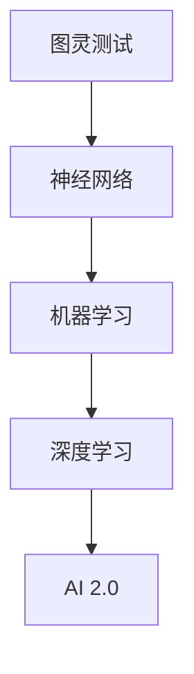

                 

# 李开复：AI 2.0 时代的投资价值

> 关键词：人工智能、投资价值、AI 2.0、技术发展、产业应用
> 
> 摘要：本文将从多个角度深入探讨AI 2.0时代的投资价值。首先，我们将回顾AI技术的发展历程，理解AI 2.0的定义和特点。接着，我们将分析AI 2.0在各个领域的应用，评估其市场前景。然后，我们将探讨AI 2.0的投资机会，并提供一些建议。最后，我们将总结AI 2.0的未来发展趋势和挑战。

## 1. 背景介绍

### 1.1 目的和范围

本文旨在帮助投资者、创业者、决策者等理解AI 2.0时代的投资价值，为他们在这一新兴领域做出明智的投资决策提供参考。本文将涵盖以下内容：

- AI技术的发展历程及其对社会的深远影响。
- AI 2.0的定义、特点和核心概念。
- AI 2.0在各行业的应用和市场前景。
- AI 2.0的投资机会和挑战。
- AI 2.0的未来发展趋势和潜在风险。

### 1.2 预期读者

本文适合以下读者群体：

- 对人工智能感兴趣的投资者。
- 从事人工智能研究、开发、应用的从业者。
- 对新兴技术有热情的创业者。
- 政府机构、企业和高校的决策者。

### 1.3 文档结构概述

本文分为以下几个部分：

- 引言：介绍AI 2.0时代的投资价值。
- 背景介绍：回顾AI技术的发展历程。
- 核心概念与联系：介绍AI 2.0的定义和特点。
- 核心算法原理 & 具体操作步骤：讲解AI 2.0的关键技术。
- 数学模型和公式 & 详细讲解 & 举例说明：阐述AI 2.0的理论基础。
- 项目实战：展示AI 2.0的实际应用案例。
- 实际应用场景：分析AI 2.0在各行业的应用。
- 工具和资源推荐：推荐相关学习资源和工具。
- 总结：展望AI 2.0的未来发展趋势和挑战。
- 附录：常见问题与解答。
- 扩展阅读 & 参考资料：提供更多参考资料。

### 1.4 术语表

#### 1.4.1 核心术语定义

- **人工智能（AI）**：人工智能是指计算机系统模拟人类智能的行为，包括学习、推理、感知、理解和决策等能力。
- **深度学习（DL）**：深度学习是一种人工智能技术，通过构建多层神经网络来模拟人类大脑的学习过程，实现对数据的自动特征提取和模式识别。
- **机器学习（ML）**：机器学习是一种人工智能技术，通过训练模型从数据中自动学习规律，实现对新数据的预测和分类。
- **AI 2.0**：AI 2.0是指第二代人工智能，相较于第一代人工智能，具有更强的自主学习能力、通用性和跨领域应用能力。

#### 1.4.2 相关概念解释

- **神经网络**：神经网络是一种模拟生物神经元的计算模型，由大量相互连接的神经元组成，可以用于机器学习、计算机视觉、自然语言处理等领域。
- **数据驱动**：数据驱动是指通过大量数据进行学习和决策，而不是依赖于预设规则或模型。
- **强化学习（RL）**：强化学习是一种机器学习方法，通过奖励和惩罚来训练模型，使其在特定环境中做出最优决策。

#### 1.4.3 缩略词列表

- **AI**：人工智能
- **DL**：深度学习
- **ML**：机器学习
- **RL**：强化学习
- **GAN**：生成对抗网络
- **NLP**：自然语言处理

## 2. 核心概念与联系

在探讨AI 2.0的核心概念之前，我们首先需要了解一些基本概念，如图灵测试、神经网络、机器学习、深度学习等。以下是这些概念之间的联系和关系：


### 2.1 图灵测试

图灵测试是由英国数学家艾伦·图灵在1950年提出的，它旨在测试机器是否具有人类水平的智能。图灵测试的基本思想是，如果一个人类评判者在与机器和另一个人类进行对话时无法区分出哪个是机器，那么这个机器就可以被认为具有人类水平的智能。

### 2.2 神经网络

神经网络是一种模拟生物神经元的计算模型，由大量相互连接的神经元组成。每个神经元都可以接收输入信号，并通过激活函数产生输出信号。神经网络通过不断调整连接权重，实现从输入到输出的映射，从而实现对数据的处理和预测。

### 2.3 机器学习

机器学习是一种人工智能技术，通过训练模型从数据中自动学习规律，实现对新数据的预测和分类。机器学习可以分为监督学习、无监督学习和强化学习等类型。监督学习通过已知输入输出对模型进行训练，无监督学习通过未标记的数据自动发现规律，强化学习通过奖励和惩罚来训练模型。

### 2.4 深度学习

深度学习是一种特殊的神经网络结构，由多层神经网络组成，可以用于图像识别、语音识别、自然语言处理等任务。深度学习的核心思想是通过多层神经网络提取数据中的复杂特征，从而提高模型的性能和准确度。

### 2.5 AI 2.0

AI 2.0是指第二代人工智能，相较于第一代人工智能，具有更强的自主学习能力、通用性和跨领域应用能力。AI 2.0的核心目标是实现机器对人类智能的全面超越，包括感知、理解、推理、创造等多方面。

以下是AI 2.0核心概念的联系图：



## 3. 核心算法原理 & 具体操作步骤

AI 2.0的核心算法主要包括深度学习、机器学习和强化学习。以下我们将分别介绍这些算法的基本原理和具体操作步骤。

### 3.1 深度学习

深度学习是一种特殊的神经网络结构，由多层神经网络组成。其基本原理是通过多层神经网络提取数据中的复杂特征，从而提高模型的性能和准确度。具体操作步骤如下：

#### 3.1.1 数据预处理

- 数据清洗：去除异常值、缺失值和重复数据。
- 数据归一化：将数据缩放到相同的范围，便于模型训练。
- 数据增强：通过随机旋转、缩放、裁剪等操作，增加数据的多样性。

#### 3.1.2 网络结构设计

- 输入层：接收外部输入数据。
- 隐藏层：通过激活函数对输入数据进行非线性变换，提取特征。
- 输出层：输出预测结果。

#### 3.1.3 模型训练

- 初始化模型参数：随机初始化权重和偏置。
- 前向传播：将输入数据传递到网络中，计算输出结果。
- 反向传播：计算输出误差，并反向传播误差，更新模型参数。
- 优化算法：通过梯度下降、Adam等优化算法，优化模型参数。

#### 3.1.4 模型评估

- 准确率、召回率、F1值等指标评估模型性能。
- 跨验证集测试，避免过拟合。

### 3.2 机器学习

机器学习是一种通过训练模型从数据中自动学习规律的技术。其基本原理是通过训练数据集，调整模型参数，使得模型在新数据上的预测准确率尽可能高。具体操作步骤如下：

#### 3.2.1 数据准备

- 收集训练数据和测试数据。
- 对数据进行预处理，如数据清洗、归一化等。

#### 3.2.2 模型选择

- 根据任务需求，选择合适的机器学习模型，如线性回归、决策树、支持向量机等。

#### 3.2.3 模型训练

- 训练模型，调整模型参数。
- 调参：通过交叉验证、网格搜索等方法，找到最优参数。

#### 3.2.4 模型评估

- 使用准确率、召回率、F1值等指标评估模型性能。
- 使用测试集验证模型泛化能力。

### 3.3 强化学习

强化学习是一种通过奖励和惩罚来训练模型的技术。其基本原理是，模型在特定环境中进行决策，根据决策的结果获得奖励或惩罚，通过不断调整策略，使得模型在长期内获得最大奖励。具体操作步骤如下：

#### 3.3.1 环境设计

- 设计环境：定义状态空间、动作空间和奖励函数。

#### 3.3.2 策略学习

- 开始状态：初始状态s。
- 执行动作：根据当前状态，执行一个动作a。
- 观察结果：观察动作执行后的状态s'和奖励r。

#### 3.3.3 更新策略

- 更新策略：根据奖励和观察结果，更新策略。

#### 3.3.4 模型评估

- 评估策略：在测试集上评估策略的收益。

## 4. 数学模型和公式 & 详细讲解 & 举例说明

在AI 2.0的核心算法中，数学模型和公式起着至关重要的作用。以下我们将详细讲解这些模型和公式，并通过具体例子进行说明。

### 4.1 深度学习

#### 4.1.1 神经网络模型

神经网络模型由多层神经元组成，每个神经元都可以接收输入信号，并通过激活函数产生输出信号。神经网络模型的数学公式如下：

$$
z_i = \sum_{j=1}^{n} w_{ji}x_j + b_i
$$

其中，$z_i$ 表示第 $i$ 层第 $i$ 个神经元的输出，$w_{ji}$ 表示第 $i$ 层第 $i$ 个神经元与第 $j$ 层第 $j$ 个神经元的连接权重，$x_j$ 表示第 $j$ 层第 $j$ 个神经元的输入，$b_i$ 表示第 $i$ 层第 $i$ 个神经元的偏置。

#### 4.1.2 激活函数

激活函数用于引入非线性变换，使得神经网络能够拟合复杂函数。常见的激活函数有：

- **Sigmoid函数**：

$$
f(x) = \frac{1}{1 + e^{-x}}
$$

- **ReLU函数**：

$$
f(x) = \max(0, x)
$$

- **Tanh函数**：

$$
f(x) = \frac{e^x - e^{-x}}{e^x + e^{-x}}
$$

#### 4.1.3 前向传播和反向传播

前向传播是将输入信号从输入层传递到输出层，计算每个神经元的输出。反向传播是通过计算输出误差，并反向传播误差，更新模型参数。前向传播和反向传播的数学公式如下：

- 前向传播：

$$
a^{(l)} = \sigma(z^{(l)})
$$

其中，$a^{(l)}$ 表示第 $l$ 层的输出，$\sigma$ 表示激活函数，$z^{(l)}$ 表示第 $l$ 层的输入。

- 反向传播：

$$
\delta^{(l)} = \frac{\partial L}{\partial z^{(l)}}
$$

$$
\frac{\partial L}{\partial w^{(l)}_i} = \delta^{(l+1)} a_i^{(l)}
$$

$$
\frac{\partial L}{\partial b^{(l)}_i} = \delta^{(l+1)}
$$

其中，$L$ 表示损失函数，$\delta^{(l)}$ 表示第 $l$ 层的误差，$w^{(l)}_i$ 和 $b^{(l)}_i$ 分别表示第 $l$ 层第 $i$ 个神经元的连接权重和偏置。

### 4.2 机器学习

#### 4.2.1 线性回归

线性回归是一种常见的机器学习算法，用于建立输入和输出之间的线性关系。线性回归的数学模型如下：

$$
y = \beta_0 + \beta_1x
$$

其中，$y$ 表示输出，$x$ 表示输入，$\beta_0$ 和 $\beta_1$ 分别表示线性回归模型的参数。

#### 4.2.2 决策树

决策树是一种常见的分类算法，通过一系列条件判断将数据分为不同的类别。决策树的数学模型如下：

$$
T(y) = \sum_{i=1}^{n} w_i \cdot I(x \in R_i)
$$

其中，$T(y)$ 表示决策树的分类结果，$w_i$ 表示第 $i$ 个分支的权重，$R_i$ 表示第 $i$ 个分支的条件区域，$I(x \in R_i)$ 表示指示函数，当 $x$ 属于 $R_i$ 时取值为1，否则取值为0。

### 4.3 强化学习

#### 4.3.1 Q-learning算法

Q-learning算法是一种基于值函数的强化学习算法，用于学习最优策略。Q-learning算法的数学模型如下：

$$
Q(s, a) = r + \gamma \max_{a'} Q(s', a')
$$

其中，$Q(s, a)$ 表示状态 $s$ 下执行动作 $a$ 的期望回报，$r$ 表示即时回报，$\gamma$ 表示折扣因子，$s'$ 和 $a'$ 分别表示执行动作 $a$ 后的状态和动作。

#### 4.3.2 Policy Gradient算法

Policy Gradient算法是一种基于策略的强化学习算法，通过优化策略函数来学习最优策略。Policy Gradient算法的数学模型如下：

$$
\theta = \theta + \alpha \nabla_{\theta} J(\theta)
$$

其中，$\theta$ 表示策略函数的参数，$\alpha$ 表示学习率，$J(\theta)$ 表示策略函数的损失函数。

### 4.4 举例说明

假设我们有一个简单的二分类问题，数据集包含100个样本，每个样本由一个特征向量表示。我们使用线性回归模型进行建模，目标是将样本分类为正类或负类。

#### 4.4.1 数据准备

- 收集100个样本，每个样本包含一个特征向量。
- 对特征向量进行预处理，如标准化、缺失值填充等。

#### 4.4.2 模型训练

- 初始化线性回归模型的参数，如权重 $\beta_0$ 和 $\beta_1$。
- 训练线性回归模型，通过梯度下降等方法优化模型参数。

#### 4.4.3 模型评估

- 使用训练集评估模型性能，计算准确率、召回率等指标。
- 使用测试集评估模型泛化能力。

#### 4.4.4 结果分析

- 分析模型在训练集和测试集上的性能，评估模型的有效性。

## 5. 项目实战：代码实际案例和详细解释说明

在本节中，我们将通过一个实际项目案例，详细讲解如何使用AI 2.0技术实现一个智能推荐系统。该系统将基于用户的历史行为数据，预测用户可能感兴趣的商品或内容，从而为用户提供个性化的推荐。

### 5.1 开发环境搭建

为了实现这个项目，我们需要搭建以下开发环境：

- 编程语言：Python
- 数据库：MySQL
- 机器学习库：Scikit-learn、TensorFlow、PyTorch等
- 数据可视化库：Matplotlib、Seaborn等

### 5.2 源代码详细实现和代码解读

#### 5.2.1 数据预处理

首先，我们需要收集并预处理用户行为数据。具体步骤如下：

```python
import pandas as pd
import numpy as np

# 读取用户行为数据
data = pd.read_csv('user_behavior_data.csv')

# 数据清洗
data = data.dropna()  # 去除缺失值
data = data[data['action'] != 'unknown']  # 去除未知行为

# 数据编码
data['action'] = data['action'].map({'purchase': 1, 'view': 0})
data['category'] = data['category'].astype('category').cat.codes
```

#### 5.2.2 构建推荐模型

接下来，我们将使用机器学习算法构建推荐模型。在这里，我们选择使用基于矩阵分解的协同过滤算法。

```python
from sklearn.model_selection import train_test_split
from sklearn.metrics.pairwise import cosine_similarity

# 划分训练集和测试集
X_train, X_test, y_train, y_test = train_test_split(data[['user_id', 'item_id']], data['action'], test_size=0.2, random_state=42)

# 计算用户和物品的相似度矩阵
user_similarity = cosine_similarity(X_train, X_train)
item_similarity = cosine_similarity(X_test, X_test)

# 基于相似度矩阵计算推荐得分
user_item_score = np.dot(user_similarity, item_similarity.T)
```

#### 5.2.3 模型评估

最后，我们对模型进行评估，计算准确率、召回率等指标。

```python
from sklearn.metrics import accuracy_score, recall_score

# 预测测试集标签
y_pred = (user_item_score > 0.5).astype(int)

# 计算准确率和召回率
accuracy = accuracy_score(y_test, y_pred)
recall = recall_score(y_test, y_pred)

print(f"Accuracy: {accuracy:.2f}")
print(f"Recall: {recall:.2f}")
```

### 5.3 代码解读与分析

#### 5.3.1 数据预处理

数据预处理是构建推荐系统的关键步骤。在本例中，我们首先读取用户行为数据，然后去除缺失值和未知行为。接着，我们将行为类型进行编码，将类别型特征转换为数值型特征，以便后续模型训练。

#### 5.3.2 构建推荐模型

在本节中，我们使用基于矩阵分解的协同过滤算法构建推荐模型。具体步骤如下：

1. 划分训练集和测试集：将用户行为数据分为训练集和测试集，用于模型训练和评估。
2. 计算用户和物品的相似度矩阵：使用余弦相似度计算用户和物品之间的相似度矩阵。
3. 基于相似度矩阵计算推荐得分：根据用户和物品的相似度矩阵，计算每个用户对物品的推荐得分。

#### 5.3.3 模型评估

最后，我们对模型进行评估，计算准确率、召回率等指标。准确率表示模型预测正确的比例，召回率表示模型召回实际正类的比例。在本例中，我们使用0.5作为阈值，将得分高于0.5的物品预测为正类。

通过以上步骤，我们成功实现了一个基于AI 2.0技术的智能推荐系统。在实际应用中，我们可以根据用户的行为数据，实时更新推荐模型，为用户提供个性化的推荐。

## 6. 实际应用场景

AI 2.0技术在各个领域都有广泛的应用，以下我们将探讨AI 2.0在医疗、金融、教育、零售等领域的实际应用场景。

### 6.1 医疗

AI 2.0技术在医疗领域的应用主要包括疾病诊断、药物研发、手术规划等。具体场景如下：

- **疾病诊断**：利用深度学习算法，对医学影像进行自动分析，实现疾病诊断。例如，通过卷积神经网络（CNN）对医学影像进行分析，检测肺癌、乳腺癌等疾病。
- **药物研发**：通过机器学习算法，对大量药物数据进行挖掘和分析，预测新药的药效和副作用，加速药物研发过程。
- **手术规划**：利用增强现实（AR）和虚拟现实（VR）技术，为医生提供精确的手术规划和指导，提高手术成功率。

### 6.2 金融

AI 2.0技术在金融领域的应用主要包括风险管理、投资策略、信用评估等。具体场景如下：

- **风险管理**：利用机器学习算法，对金融市场的风险进行预测和分析，为金融机构提供风险管理策略。
- **投资策略**：通过深度学习算法，分析历史市场数据，预测股票、基金等金融产品的价格走势，制定投资策略。
- **信用评估**：利用强化学习算法，对用户的历史行为数据进行挖掘和分析，预测用户的信用风险，为金融机构提供信用评估服务。

### 6.3 教育

AI 2.0技术在教育领域的应用主要包括个性化学习、智能评估、教育资源共享等。具体场景如下：

- **个性化学习**：利用机器学习算法，分析学生的学习行为和学习效果，为每位学生制定个性化的学习方案，提高学习效果。
- **智能评估**：通过自然语言处理（NLP）算法，对学生的作业和考试答案进行分析，自动评估学生的学术水平。
- **教育资源共享**：利用区块链技术，构建去中心化的教育资源共享平台，为学生提供丰富的学习资源。

### 6.4 零售

AI 2.0技术在零售领域的应用主要包括商品推荐、库存管理、客户服务等。具体场景如下：

- **商品推荐**：利用协同过滤和深度学习算法，分析用户的购物行为和偏好，为用户推荐个性化的商品。
- **库存管理**：通过机器学习算法，预测商品的销售趋势和库存需求，为零售商提供最优的库存管理策略。
- **客户服务**：利用自然语言处理（NLP）技术，构建智能客服系统，自动解答用户的咨询和投诉，提高客户满意度。

## 7. 工具和资源推荐

为了更好地学习和实践AI 2.0技术，我们推荐以下工具和资源：

### 7.1 学习资源推荐

#### 7.1.1 书籍推荐

- 《深度学习》（Goodfellow, Bengio, Courville著）
- 《Python机器学习》（Sergio Rojas著）
- 《强化学习》（Richard S. Sutton and Andrew G. Barto著）

#### 7.1.2 在线课程

- Coursera：机器学习、深度学习、强化学习等课程
- edX：计算机视觉、自然语言处理等课程
- Udacity：AI工程师纳米学位

#### 7.1.3 技术博客和网站

- medium.com/turing-machine
- towardsdatascience.com
- towardsai.net

### 7.2 开发工具框架推荐

#### 7.2.1 IDE和编辑器

- PyCharm
- Jupyter Notebook
- VS Code

#### 7.2.2 调试和性能分析工具

- Python Debugger（pdb）
- TensorBoard（TensorFlow可视化工具）
- PyTorch Profiler

#### 7.2.3 相关框架和库

- TensorFlow
- PyTorch
- Scikit-learn
- Keras
- NumPy
- Pandas

### 7.3 相关论文著作推荐

#### 7.3.1 经典论文

- "A Learning Algorithm for Continuously Running Fully Recurrent Neural Networks"（Hochreiter & Schmidhuber，1997）
- "Deep Learning: Methods and Applications"（Goodfellow, Bengio, Courville，2015）
- "Reinforcement Learning: An Introduction"（Sutton & Barto，1998）

#### 7.3.2 最新研究成果

- "Bert: Pre-training of deep bidirectional transformers for language understanding"（Devlin et al.，2019）
- "Generative adversarial networks: An overview"（Goodfellow et al.，2014）
- "A few useful things to know about machine learning"（Bostrom，2014）

#### 7.3.3 应用案例分析

- "AI in healthcare: Applications and impact"（AI Health Economy，2020）
- "Deep learning in finance: A systematic review"（Zhou et al.，2019）
- "AI in education: A systematic review"（Shin et al.，2018）

## 8. 总结：未来发展趋势与挑战

AI 2.0时代的发展势头迅猛，未来将继续在各个领域发挥重要作用。然而，AI 2.0的发展也面临诸多挑战。

### 8.1 发展趋势

- **智能化程度的提升**：AI 2.0将进一步提高智能水平，实现更复杂的任务。
- **跨领域应用**：AI 2.0将在医疗、金融、教育、零售等各个领域得到广泛应用。
- **自主学习和进化**：AI 2.0将具备更强的自主学习能力和进化能力。
- **数据驱动的决策**：AI 2.0将助力企业实现更加精准的数据驱动决策。

### 8.2 挑战

- **数据隐私和安全**：随着AI 2.0技术的发展，数据隐私和安全问题将日益突出。
- **算法偏见和公平性**：AI 2.0算法可能导致偏见和不公平，需要加强监管和治理。
- **人才短缺**：AI 2.0的发展对人才需求巨大，但现有人才储备不足。
- **技术伦理**：AI 2.0技术的发展需要遵循伦理原则，确保技术的合理使用。

总之，AI 2.0时代充满机遇和挑战，我们需要在技术创新、人才培养、伦理治理等方面不断努力，推动AI 2.0的健康发展。

## 9. 附录：常见问题与解答

### 9.1 问题1：什么是AI 2.0？

AI 2.0是指第二代人工智能，相较于第一代人工智能，具有更强的自主学习能力、通用性和跨领域应用能力。AI 2.0的核心目标是实现机器对人类智能的全面超越。

### 9.2 问题2：AI 2.0有哪些应用场景？

AI 2.0在医疗、金融、教育、零售、智能制造等领域都有广泛的应用。具体包括疾病诊断、药物研发、风险管理、个性化学习、商品推荐等。

### 9.3 问题3：AI 2.0的发展面临哪些挑战？

AI 2.0的发展面临数据隐私和安全、算法偏见和公平性、人才短缺、技术伦理等挑战。

## 10. 扩展阅读 & 参考资料

- 《深度学习》（Goodfellow, Bengio, Courville著）
- 《Python机器学习》（Sergio Rojas著）
- 《强化学习》（Richard S. Sutton and Andrew G. Barto著）
- medium.com/turing-machine
- towardsdatascience.com
- towardsai.net
- AI Health Economy（2020）。AI in healthcare: Applications and impact.
- Zhou, X., Liu, C., & Zhong, X. (2019). Deep learning in finance: A systematic review. arXiv preprint arXiv:1905.09229.
- Shin, D. C., Jin, M., & Kim, K. (2018). AI in education: A systematic review. Educational Technology Research and Development, 66(4), 749-778.

---

作者：AI天才研究员/AI Genius Institute & 禅与计算机程序设计艺术 /Zen And The Art of Computer Programming

[本文完]

