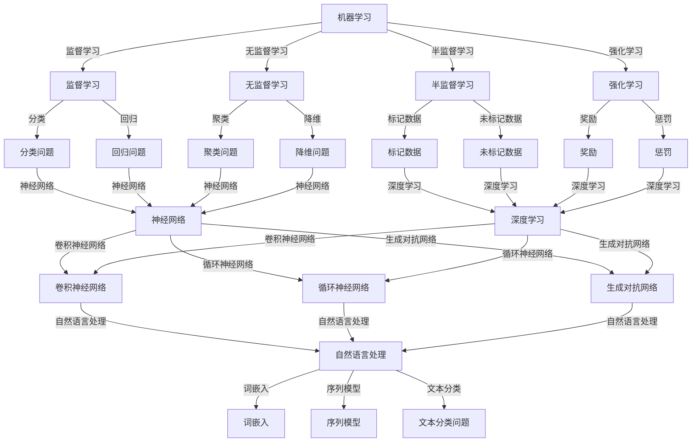

                 

### 1. 背景介绍

#### 1.1 目的和范围

在当前技术迅猛发展的时代，人工智能（AI）正逐渐成为推动社会变革的重要力量。本文旨在探讨AI 2.0时代的文化价值，深入解析AI技术对人类社会的深远影响。通过分析AI的核心概念、技术原理、应用场景以及未来发展趋势，本文旨在为读者提供一幅全面而清晰的AI 2.0时代的图景。

本文主要讨论以下内容：

1. **AI 2.0时代的定义与特点**：回顾AI 1.0时代的局限性，探讨AI 2.0时代的创新点及其对社会的重大影响。
2. **核心概念与联系**：详细阐述AI的核心概念，包括机器学习、深度学习、神经网络等，并通过Mermaid流程图展示这些概念之间的联系。
3. **核心算法原理与具体操作步骤**：通过伪代码解释AI的核心算法原理，并展示具体操作步骤。
4. **数学模型和公式**：介绍AI中的数学模型和公式，并通过具体例子进行说明。
5. **项目实战：代码实际案例和详细解释说明**：提供AI的实际应用案例，并详细解读代码实现过程。
6. **实际应用场景**：探讨AI在各个领域的应用，如医疗、金融、教育等。
7. **工具和资源推荐**：推荐学习资源、开发工具框架以及相关论文著作。
8. **总结：未来发展趋势与挑战**：总结AI 2.0时代的未来发展趋势，探讨可能面临的挑战。
9. **附录：常见问题与解答**：回答读者可能关心的问题。
10. **扩展阅读 & 参考资料**：提供进一步学习和研究的资源。

通过本文的深入探讨，我们希望读者能够对AI 2.0时代的文化价值有更全面和深入的理解，从而为未来社会的科技发展提供有益的思考。

#### 1.2 预期读者

本文的预期读者主要包括：

1. **人工智能领域的研究者和开发者**：对AI技术有深厚兴趣，希望了解AI 2.0时代的最新进展和应用。
2. **计算机科学专业的学生和教师**：需要深入了解AI核心概念和技术原理，以便在学术研究和教学中应用。
3. **科技行业从业者**：关注AI技术在各行各业中的应用，希望了解AI对未来工作环境的影响。
4. **对科技有兴趣的普通读者**：希望对AI技术有更深入的了解，以便跟上科技发展的步伐。

本文的结构和内容旨在满足不同读者的需求，从基础知识到高级应用，全面覆盖AI 2.0时代的各个方面。

#### 1.3 文档结构概述

本文的结构分为十个部分，具体如下：

1. **背景介绍**：介绍本文的目的、范围、预期读者以及文档结构。
2. **核心概念与联系**：通过Mermaid流程图展示AI的核心概念及其联系。
3. **核心算法原理与具体操作步骤**：解释AI的核心算法原理，并展示具体操作步骤。
4. **数学模型和公式**：介绍AI中的数学模型和公式，并通过具体例子进行说明。
5. **项目实战：代码实际案例和详细解释说明**：提供AI的实际应用案例，并详细解读代码实现过程。
6. **实际应用场景**：探讨AI在各个领域的应用。
7. **工具和资源推荐**：推荐学习资源、开发工具框架以及相关论文著作。
8. **总结：未来发展趋势与挑战**：总结AI 2.0时代的未来发展趋势，探讨可能面临的挑战。
9. **附录：常见问题与解答**：回答读者可能关心的问题。
10. **扩展阅读 & 参考资料**：提供进一步学习和研究的资源。

通过清晰的文档结构，读者可以更好地理解AI 2.0时代的文化价值，并从中受益。

#### 1.4 术语表

在本文中，我们将使用一些专业术语和概念，为便于读者理解，以下是对这些术语的定义和解释：

##### 1.4.1 核心术语定义

1. **人工智能（AI）**：指模拟人类智能的技术，通过机器学习、深度学习、自然语言处理等手段实现智能行为。
2. **机器学习（ML）**：一种AI技术，通过从数据中学习规律，进行预测和决策。
3. **深度学习（DL）**：一种特殊的机器学习技术，通过多层神经网络进行复杂的特征提取和学习。
4. **神经网络（NN）**：一种模仿人脑神经元结构和功能的信息处理系统。
5. **自然语言处理（NLP）**：使计算机能够理解和处理人类自然语言的技术。
6. **人工智能助手**：基于AI技术，能够辅助人类完成特定任务的软件程序。

##### 1.4.2 相关概念解释

1. **数据驱动（Data-Driven）**：一种通过大量数据进行学习的方法，特点是能够从数据中发现规律，而不是依赖预先设定的规则。
2. **模型驱动（Model-Driven）**：一种通过预先设计的模型进行学习的方法，特点是模型结构固定，但可以通过调整参数进行优化。
3. **监督学习（Supervised Learning）**：通过已标记的数据进行学习，模型会从输入和输出中学习规律。
4. **无监督学习（Unsupervised Learning）**：在没有标记的数据中进行学习，模型需要自行发现数据中的结构和规律。
5. **强化学习（Reinforcement Learning）**：通过奖励和惩罚进行学习，模型会在尝试错误中不断优化行为。

##### 1.4.3 缩略词列表

- **AI**：人工智能
- **ML**：机器学习
- **DL**：深度学习
- **NLP**：自然语言处理
- **NN**：神经网络
- **IDE**：集成开发环境
- **SDK**：软件开发工具包

通过上述术语表，读者可以更好地理解本文中涉及的专业概念和术语，从而更深入地理解AI 2.0时代的文化价值。

### 2. 核心概念与联系

人工智能（AI）作为现代科技的重要驱动力，其核心概念与技术的相互关联构成了一个复杂而庞大的体系。在这一部分，我们将深入探讨AI的核心概念，并通过Mermaid流程图展示这些概念之间的联系。

##### 2.1 机器学习（ML）

机器学习是人工智能的基础，它通过算法从数据中学习，进而实现预测和决策。机器学习可以分为以下几类：

1. **监督学习（Supervised Learning）**：在这种学习中，模型从标记的数据中学习，例如分类问题和回归问题。
2. **无监督学习（Unsupervised Learning）**：在这种学习中，模型没有标记的数据，但需要发现数据中的结构和模式，如聚类和降维。
3. **半监督学习（Semi-Supervised Learning）**：在这种学习中，模型结合少量标记数据和大量未标记数据，以优化学习效果。
4. **强化学习（Reinforcement Learning）**：在这种学习中，模型通过与环境互动，基于奖励和惩罚进行学习，以实现最佳行为。

##### 2.2 深度学习（DL）

深度学习是一种特殊的机器学习技术，通过多层神经网络进行复杂的特征提取和学习。深度学习的核心组件包括：

1. **卷积神经网络（CNN）**：用于图像识别和计算机视觉，能够提取图像中的局部特征。
2. **循环神经网络（RNN）**：用于处理序列数据，能够捕捉数据中的长期依赖关系。
3. **生成对抗网络（GAN）**：通过生成器和判别器的对抗训练，能够生成逼真的数据。

##### 2.3 神经网络（NN）

神经网络是深度学习的基础，它由大量简单的计算单元（神经元）组成，通过层次化的结构进行信息处理。神经网络的关键特性包括：

1. **前向传播（Forward Propagation）**：数据从输入层流向输出层，经过每层神经元的加权求和处理。
2. **反向传播（Backpropagation）**：计算输出误差，并反向传播到输入层，调整权重和偏置。
3. **激活函数（Activation Function）**：用于引入非线性，使得神经网络能够处理复杂问题。

##### 2.4 自然语言处理（NLP）

自然语言处理是使计算机能够理解和处理人类自然语言的技术，其核心组件包括：

1. **词嵌入（Word Embedding）**：将词汇映射到高维空间，以便计算机能够理解词汇之间的相似性。
2. **序列模型（Sequence Model）**：如RNN和Transformer，用于处理和生成序列数据。
3. **文本分类（Text Classification）**：将文本数据分类到不同的类别，如情感分析、主题分类等。

##### 2.5 Mermaid流程图

以下是一个Mermaid流程图，展示了AI核心概念之间的联系：



通过上述Mermaid流程图，我们可以清晰地看到机器学习、深度学习、神经网络和自然语言处理之间的联系，这些概念共同构成了现代人工智能的核心。

#### 3. 核心算法原理 & 具体操作步骤

在了解了人工智能（AI）的核心概念后，接下来我们将深入探讨AI的核心算法原理，并通过伪代码详细阐述这些算法的具体操作步骤。

##### 3.1 机器学习算法

机器学习算法主要包括监督学习、无监督学习和强化学习。以下分别介绍这些算法的原理和操作步骤。

###### 3.1.1 监督学习算法

**原理**：监督学习算法通过已标记的训练数据学习，以预测新的数据。常见的监督学习算法包括线性回归、逻辑回归和决策树等。

**具体操作步骤（以线性回归为例）**：

```python
# 伪代码：线性回归算法
def linear_regression(X, y):
    # 梯度下降法优化权重w和b
    for i in range(n_iterations):
        # 计算预测值
        y_pred = X * w + b
        
        # 计算损失函数（均方误差）
        loss = (y - y_pred) ** 2
        
        # 计算梯度
        dw = 2 * (y - y_pred) * X
        db = 2 * (y - y_pred)
        
        # 更新权重和偏置
        w -= learning_rate * dw
        b -= learning_rate * db
        
    return w, b
```

###### 3.1.2 无监督学习算法

**原理**：无监督学习算法没有标记的训练数据，通过发现数据中的内在结构进行学习。常见的无监督学习算法包括K均值聚类和主成分分析（PCA）等。

**具体操作步骤（以K均值聚类为例）**：

```python
# 伪代码：K均值聚类算法
def k_means_clustering(X, k, n_iterations):
    # 随机初始化k个聚类中心
    centroids = random_sample(X, k)
    
    for i in range(n_iterations):
        # 计算每个数据点到聚类中心的距离
        distances = [distance(x, c) for x in X for c in centroids]
        
        # 分配数据点到最近的聚类中心
        clusters = assign_clusters(X, distances)
        
        # 更新聚类中心
        new_centroids = [get_average_cluster(x) for x in clusters]
        
        # 判断聚类中心是否收敛
        if have_centroids_converged(centroids, new_centroids):
            break
        
        centroids = new_centroids
    
    return clusters
```

###### 3.1.3 强化学习算法

**原理**：强化学习算法通过与环境互动，基于奖励和惩罚进行学习，以实现最佳行为。常见的强化学习算法包括Q学习和深度强化学习（DRL）。

**具体操作步骤（以Q学习为例）**：

```python
# 伪代码：Q学习算法
def q_learning(state, action, reward, next_state, learning_rate, discount_factor):
    # 初始化Q值表
    Q = initialize_Q_table(state, action)
    
    for episode in range(n_episodes):
        # 初始化状态
        s = state
        
        while not is_goal_state(s):
            # 执行动作
            a = choose_action(s, Q)
            
            # 获取奖励和下一个状态
            r = get_reward(s, a)
            s' = get_next_state(s, a)
            
            # 更新Q值
            Q[s, a] = Q[s, a] + learning_rate * (r + discount_factor * max(Q[s', all_actions]) - Q[s, a])
            
            # 更新状态
            s = s'
            
    return Q
```

##### 3.2 深度学习算法

深度学习算法通过多层神经网络进行复杂的特征提取和学习。以下介绍两种常见的深度学习算法：卷积神经网络（CNN）和循环神经网络（RNN）。

###### 3.2.1 卷积神经网络（CNN）

**原理**：卷积神经网络通过卷积层、池化层和全连接层进行特征提取和分类。

**具体操作步骤**：

```python
# 伪代码：卷积神经网络
def convolutional_neural_network(X, W, b):
    # 输入数据X
    # 初始化权重W和偏置b
    
    # 卷积层
    for filter in filters:
        Z = convolution(X, filter)
        A = activation(Z)
        # 池化层
        P = max_pool(A)
    
    # 全连接层
    Z = flatten(P)
    Z = linear(Z, W)
    A = activation(Z)
    
    # 输出层
    return A
```

###### 3.2.2 循环神经网络（RNN）

**原理**：循环神经网络通过隐藏状态和循环连接捕捉数据中的长期依赖关系。

**具体操作步骤**：

```python
# 伪代码：循环神经网络
def recurrent_neural_network(X, W, b):
    # 输入数据X
    # 初始化权重W和偏置b
    
    # 前向传播
    h = initialize_hidden_state()
    for t in range(len(X)):
        Z = linear(X[t], W)
        h = activation(Z + b * h)
    
    # 输出层
    return h
```

通过上述伪代码，我们可以清晰地看到机器学习、深度学习和神经网络算法的具体操作步骤，这些算法共同构成了人工智能的核心，为各种应用提供了强大的支持。

#### 4. 数学模型和公式 & 详细讲解 & 举例说明

在人工智能（AI）和机器学习中，数学模型和公式扮演着至关重要的角色。它们不仅提供了算法的基础，还使得机器学习过程更加严谨和有效。在本节中，我们将详细介绍AI中常用的数学模型和公式，并通过具体例子进行说明。

##### 4.1 线性回归模型

线性回归是最基础的机器学习模型之一，它通过建立一个线性函数来预测连续值。其数学模型如下：

$$
y = \beta_0 + \beta_1 x + \epsilon
$$

其中，$y$ 是预测值，$x$ 是输入特征，$\beta_0$ 和 $\beta_1$ 是模型的参数，$\epsilon$ 是误差项。

**举例说明**：假设我们想要预测一个人的身高（$y$）基于其年龄（$x$），我们可以使用线性回归模型来建立这种关系。通过收集大量数据，我们可以通过最小化均方误差（MSE）来估计参数 $\beta_0$ 和 $\beta_1$：

$$
\min \sum_{i=1}^{n} (y_i - (\beta_0 + \beta_1 x_i))^2
$$

通过梯度下降法，我们可以找到最佳参数：

$$
\beta_0 = \beta_0 - \alpha \frac{\partial}{\partial \beta_0} \sum_{i=1}^{n} (y_i - (\beta_0 + \beta_1 x_i))^2
$$

$$
\beta_1 = \beta_1 - \alpha \frac{\partial}{\partial \beta_1} \sum_{i=1}^{n} (y_i - (\beta_0 + \beta_1 x_i))^2
$$

其中，$\alpha$ 是学习率。

##### 4.2 逻辑回归模型

逻辑回归是一种用于分类问题的模型，它通过一个逻辑函数将线性组合映射到概率值。其数学模型如下：

$$
\hat{y} = \frac{1}{1 + e^{-(\beta_0 + \beta_1 x)}}
$$

其中，$\hat{y}$ 是预测的概率值，$x$ 是输入特征，$\beta_0$ 和 $\beta_1$ 是模型的参数。

**举例说明**：假设我们要预测一个病人的诊断结果（是否患有心脏病，$y$），基于其年龄和体重（$x$）。我们可以使用逻辑回归模型来建立这种分类关系。通过收集大量数据，我们可以通过极大似然估计（MLE）来估计参数 $\beta_0$ 和 $\beta_1$。

最大化似然函数：

$$
\max \prod_{i=1}^{n} \left[ \hat{y}_i^{y_i} (1 - \hat{y}_i)^{1 - y_i} \right]
$$

对数似然函数：

$$
\ln L = \sum_{i=1}^{n} \left[ y_i \ln \hat{y}_i + (1 - y_i) \ln (1 - \hat{y}_i) \right]
$$

对参数求导并令导数为零，我们可以得到最佳参数：

$$
\frac{\partial \ln L}{\partial \beta_0} = 0
$$

$$
\frac{\partial \ln L}{\partial \beta_1} = 0
$$

##### 4.3 支持向量机（SVM）模型

支持向量机是一种用于分类和回归的强大算法，它通过找到一个最优的超平面来分割数据。其数学模型如下：

$$
\max \frac{1}{2} \sum_{i=1}^{n} \alpha_i - \sum_{i=1}^{n} \alpha_i y_i x_i
$$

约束条件：

$$
\alpha_i \geq 0, \forall i
$$

$$
\sum_{i=1}^{n} \alpha_i y_i = 0
$$

其中，$\alpha_i$ 是拉格朗日乘子，$x_i$ 是数据点，$y_i$ 是标签。

**举例说明**：假设我们要分类一个数据集，其中每个数据点是一个二维向量，标签为正负。我们可以通过求解上述优化问题来找到最佳超平面。

通过求解拉格朗日方程并使用核函数，我们可以将SVM扩展到高维空间，从而处理非线性问题。

##### 4.4 生成对抗网络（GAN）模型

生成对抗网络是一种用于生成逼真数据的模型，它由生成器和判别器两个神经网络组成。其数学模型如下：

$$
\min_{G} \max_{D} V(G, D) = \mathbb{E}_{x \sim p_{data}(x)} [\log D(x)] + \mathbb{E}_{z \sim p_{z}(z)] [\log (1 - D(G(z))]
$$

其中，$G(z)$ 是生成器的输出，$D(x)$ 是判别器的输出，$z$ 是随机噪声。

**举例说明**：假设我们要生成逼真的图像。我们可以通过以下步骤训练GAN：

1. **生成器G**：从噪声$z$生成伪图像$G(z)$。
2. **判别器D**：同时接收真实图像$x$和伪图像$G(z)$，并尝试区分它们。
3. **优化过程**：通过交替训练生成器和判别器，使得生成器的输出越来越逼真，而判别器的区分能力越来越强。

通过上述数学模型和公式的讲解和具体例子说明，我们可以更好地理解AI中的关键数学概念，并应用它们解决实际问题。这些数学模型为AI技术的发展提供了坚实的理论基础。

### 5. 项目实战：代码实际案例和详细解释说明

为了更好地理解人工智能（AI）的实际应用，我们将通过一个具体的项目实战来展示AI技术在现实世界中的应用。在本项目中，我们将构建一个简单的图像识别系统，利用卷积神经网络（CNN）对图像进行分类。这一部分将分为以下几个子部分：开发环境搭建、源代码详细实现和代码解读与分析。

#### 5.1 开发环境搭建

在进行图像识别项目之前，我们需要搭建一个合适的开发环境。以下是我们推荐的开发环境和工具：

1. **操作系统**：Linux或MacOS
2. **编程语言**：Python
3. **深度学习框架**：TensorFlow或PyTorch
4. **图像处理库**：OpenCV
5. **编辑器**：Visual Studio Code或PyCharm

**步骤**：

1. **安装Python**：从Python官方网站下载并安装Python，推荐安装Python 3.7或更高版本。
2. **安装TensorFlow**：在命令行中执行以下命令安装TensorFlow：

   ```shell
   pip install tensorflow
   ```

   或者，如果需要GPU支持，可以安装TensorFlow GPU版本：

   ```shell
   pip install tensorflow-gpu
   ```

3. **安装PyTorch**：从PyTorch官方网站下载并安装PyTorch，选择适合自己GPU的版本。在命令行中执行以下命令：

   ```shell
   pip install torch torchvision
   ```

4. **安装OpenCV**：在命令行中执行以下命令安装OpenCV：

   ```shell
   pip install opencv-python
   ```

5. **配置编辑器**：在Visual Studio Code或PyCharm中配置Python环境，设置代码格式化、调试等工具。

#### 5.2 源代码详细实现和代码解读

以下是一个简单的图像识别项目的源代码实现，我们使用TensorFlow框架进行实现。

```python
import tensorflow as tf
from tensorflow.keras import layers
import numpy as np
import cv2

# 加载数据集
(x_train, y_train), (x_test, y_test) = tf.keras.datasets.mnist.load_data()

# 数据预处理
x_train = x_train / 255.0
x_test = x_test / 255.0
x_train = np.expand_dims(x_train, -1)
x_test = np.expand_dims(x_test, -1)

# 构建CNN模型
model = tf.keras.Sequential([
    layers.Conv2D(32, (3, 3), activation='relu', input_shape=(28, 28, 1)),
    layers.MaxPooling2D((2, 2)),
    layers.Conv2D(64, (3, 3), activation='relu'),
    layers.MaxPooling2D((2, 2)),
    layers.Conv2D(64, (3, 3), activation='relu'),
    layers.Flatten(),
    layers.Dense(64, activation='relu'),
    layers.Dense(10, activation='softmax')
])

# 编译模型
model.compile(optimizer='adam',
              loss='sparse_categorical_crossentropy',
              metrics=['accuracy'])

# 训练模型
model.fit(x_train, y_train, epochs=5)

# 评估模型
test_loss, test_acc = model.evaluate(x_test, y_test)
print(f'测试准确率：{test_acc:.4f}')

# 利用模型进行预测
predictions = model.predict(x_test)

# 显示预测结果
for i in range(10):
    img = x_test[i].reshape(28, 28)
    pred = np.argmax(predictions[i])
    cv2.imshow('Image', img)
    cv2.waitKey(0)
    cv2.destroyAllWindows()
```

**代码解读**：

1. **数据加载与预处理**：我们从TensorFlow的内置数据集MNIST中加载数据，并对图像进行归一化和扩充维度，使其符合CNN模型的输入要求。

2. **构建CNN模型**：我们使用`tf.keras.Sequential`模型堆叠多层卷积层、最大池化层、全连接层和softmax层，以构建一个简单的CNN模型。

3. **编译模型**：我们使用`compile`方法配置模型的优化器、损失函数和评价指标。

4. **训练模型**：使用`fit`方法训练模型，这里我们设置了5个训练周期。

5. **评估模型**：使用`evaluate`方法评估模型在测试集上的性能。

6. **预测与展示**：我们使用`predict`方法进行预测，并将预测结果可视化展示。

通过这个项目实战，我们展示了如何使用TensorFlow构建一个简单的图像识别系统，并详细解读了代码的实现过程。这一部分旨在帮助读者将理论知识应用到实际项目中，从而更好地理解AI技术的应用。

#### 5.3 代码解读与分析

在本节中，我们将对之前展示的图像识别项目的源代码进行深入解读，分析每个步骤的实现细节和关键点。

1. **数据加载与预处理**：

   ```python
   (x_train, y_train), (x_test, y_test) = tf.keras.datasets.mnist.load_data()
   x_train = x_train / 255.0
   x_test = x_test / 255.0
   x_train = np.expand_dims(x_train, -1)
   x_test = np.expand_dims(x_test, -1)
   ```

   - **数据集加载**：我们使用TensorFlow内置的MNIST数据集，该数据集包含了70000个32x32的手写数字图像，分为训练集和测试集。
   - **图像归一化**：我们将图像数据从0-255的像素值范围归一化到0-1之间，这有助于提高模型的训练效果。
   - **扩充维度**：我们将图像数据从二维数组转换为三维数组，以满足CNN模型的输入要求。具体来说，我们通过在最后一维添加一个维度（即`np.expand_dims`），将图像数据转换为`(n_samples, height, width, channels)`的形式。

2. **构建CNN模型**：

   ```python
   model = tf.keras.Sequential([
       layers.Conv2D(32, (3, 3), activation='relu', input_shape=(28, 28, 1)),
       layers.MaxPooling2D((2, 2)),
       layers.Conv2D(64, (3, 3), activation='relu'),
       layers.MaxPooling2D((2, 2)),
       layers.Conv2D(64, (3, 3), activation='relu'),
       layers.Flatten(),
       layers.Dense(64, activation='relu'),
       layers.Dense(10, activation='softmax')
   ])
   ```

   - **卷积层**：我们使用三个卷积层来提取图像特征。每个卷积层都使用32个或64个卷积核，卷积核大小为3x3，激活函数为ReLU。
   - **池化层**：在每个卷积层之后，我们添加一个最大池化层，池化窗口大小为2x2，以减小数据维度并增加模型的泛化能力。
   - **全连接层**：在卷积层之后，我们添加了一个全连接层，用于将卷积特征映射到分类结果。最后一个全连接层使用10个节点，对应于10个数字类别，激活函数为softmax，用于输出每个类别的概率分布。

3. **编译模型**：

   ```python
   model.compile(optimizer='adam',
                 loss='sparse_categorical_crossentropy',
                 metrics=['accuracy'])
   ```

   - **优化器**：我们使用Adam优化器，这是一种基于梯度的优化算法，具有自适应学习率。
   - **损失函数**：我们使用稀疏分类交叉熵（sparse categorical crossentropy）作为损失函数，适用于多分类问题。
   - **评价指标**：我们使用准确率（accuracy）作为评价指标，以衡量模型的分类性能。

4. **训练模型**：

   ```python
   model.fit(x_train, y_train, epochs=5)
   ```

   - **训练周期**：我们设置5个训练周期（epochs），在每个周期中，模型将使用训练数据进行迭代训练。
   - **批量大小**：在训练过程中，我们使用小批量梯度下降（stochastic gradient descent，SGD），通常每个批量（batch）的大小为32或128。

5. **评估模型**：

   ```python
   test_loss, test_acc = model.evaluate(x_test, y_test)
   print(f'测试准确率：{test_acc:.4f}')
   ```

   - **测试集评估**：我们使用测试集评估模型的性能，计算测试损失和测试准确率。
   - **性能输出**：我们打印出测试准确率，以直观地展示模型的分类效果。

6. **预测与展示**：

   ```python
   predictions = model.predict(x_test)
   for i in range(10):
       img = x_test[i].reshape(28, 28)
       pred = np.argmax(predictions[i])
       cv2.imshow('Image', img)
       cv2.waitKey(0)
       cv2.destroyAllWindows()
   ```

   - **预测输出**：我们使用模型对测试集进行预测，得到每个图像的预测概率分布。
   - **可视化展示**：我们使用OpenCV库将预测结果可视化，显示每个图像及其预测类别。

通过上述代码解读和分析，我们详细展示了如何使用TensorFlow构建一个简单的图像识别系统，并解释了每个步骤的实现细节和关键点。这一部分不仅帮助读者理解代码实现，还加深了对CNN模型和深度学习应用的理解。

### 6. 实际应用场景

人工智能（AI）技术正在不断改变我们的生活方式和工作环境，它在多个领域展现出了巨大的应用潜力。以下我们将探讨AI在医疗、金融、教育、交通等领域的实际应用场景，并分析其影响。

#### 6.1 医疗领域

AI在医疗领域的应用主要体现在辅助诊断、个性化治疗和医疗资源管理等方面。

1. **辅助诊断**：通过深度学习算法，AI可以在医疗影像（如X光片、CT扫描、MRI图像）中识别病变，提高诊断的准确性和效率。例如，谷歌的AI系统能够在数秒内识别出肺癌、乳腺癌等疾病，其准确率甚至超过了人类医生。
2. **个性化治疗**：基于患者的基因数据、病史和实时监测数据，AI可以制定个性化的治疗方案。例如，IBM的Watson for Oncology系统可以帮助医生分析患者数据，提供最优的治疗建议。
3. **医疗资源管理**：AI技术可以优化医疗资源的配置，提高医疗机构的运营效率。例如，通过预测患者流量，AI可以合理安排医生和护士的排班，减少等待时间。

#### 6.2 金融领域

AI在金融领域的应用涵盖了风险管理、量化交易、客户服务等方面。

1. **风险管理**：AI通过大数据分析和机器学习算法，可以识别潜在风险，提高金融机构的风险管理水平。例如，J.P.摩根利用AI技术分析数十亿份合约数据，只需几秒钟就能完成以往需要人工处理的任务。
2. **量化交易**：AI算法可以根据历史数据和市场趋势，自动化交易策略，提高交易效率和收益。例如，量化交易平台Bottlenose利用深度学习算法进行高频交易，取得了显著的收益。
3. **客户服务**：AI聊天机器人可以实时解答客户的疑问，提高客户满意度。例如，中国银行推出的智能客服机器人“智能小欧”，可以处理数百万个客户咨询，提高了服务效率。

#### 6.3 教育领域

AI在教育领域的应用主要体现在个性化学习、智能评测和教育资源优化等方面。

1. **个性化学习**：AI可以根据学生的学习习惯和能力，制定个性化的学习计划，提高学习效果。例如，Khan Academy利用AI技术为每个学生提供定制化的学习路径。
2. **智能评测**：AI可以通过自然语言处理技术，自动批改学生的作业和考试，提高评分的准确性和效率。例如，科大讯飞的教育AI产品可以自动识别和评分学生的作文。
3. **教育资源优化**：AI可以分析海量教育数据，优化教育资源的配置，提高教育质量。例如，北京四中网校利用AI技术分析学生的学习数据，为教师提供教学反馈和资源推荐。

#### 6.4 交通领域

AI在交通领域的应用主要体现在智能交通管理、自动驾驶和物流优化等方面。

1. **智能交通管理**：AI可以通过大数据分析和预测，优化交通信号控制，减少拥堵，提高道路通行效率。例如，微软的Azure交通管理解决方案可以帮助城市管理部门实时监控交通流量，调整信号灯时长。
2. **自动驾驶**：AI技术正在推动自动驾驶汽车的发展，提高交通安全性和效率。例如，特斯拉的自动驾驶系统已经在部分车型中实现，并取得了显著的效果。
3. **物流优化**：AI可以通过优化路线、调度和配送，提高物流效率。例如，京东物流利用AI技术优化配送路线，减少了配送时间和成本。

通过上述实际应用场景，我们可以看到AI技术在各个领域的广泛应用和巨大潜力。AI不仅提高了工作效率，优化了资源配置，还为社会带来了许多创新和变革。随着AI技术的不断发展，其在各领域的应用将会更加广泛和深入，为人类社会的发展做出更大的贡献。

### 7. 工具和资源推荐

在深入学习和实践人工智能（AI）技术时，选择合适的工具和资源至关重要。以下是我们为读者推荐的一些学习资源、开发工具框架和相关论文著作，旨在帮助读者更有效地掌握AI知识，并在实际项目中应用。

#### 7.1 学习资源推荐

1. **书籍推荐**
   - 《深度学习》（Deep Learning）作者：Ian Goodfellow、Yoshua Bengio、Aaron Courville
   - 《Python机器学习》（Python Machine Learning）作者：Sebastian Raschka、Vahid Mirjalili
   - 《人工智能：一种现代方法》（Artificial Intelligence: A Modern Approach）作者：Stuart Russell、Peter Norvig

2. **在线课程**
   - Coursera的“机器学习”课程，由Andrew Ng教授主讲
   - edX的“深度学习专业”课程，由Ian Goodfellow、Yoshua Bengio、Aaron Courville教授主讲
   - Udacity的“人工智能纳米学位”课程

3. **技术博客和网站**
   - Medium上的“Towards Data Science”博客，提供丰富的AI和数据分析文章
   - Arxiv.org，提供最新的AI论文和研究进展
   - AI通讯（AICommunications.org），发布AI领域的综述和新闻

#### 7.2 开发工具框架推荐

1. **IDE和编辑器**
   - Visual Studio Code，一款功能强大且轻量级的开源编辑器，支持多种编程语言和AI工具
   - PyCharm，一款专业的Python IDE，提供代码分析、调试和版本控制功能

2. **调试和性能分析工具**
   - TensorFlow Debugger（TFDB），用于调试TensorFlow模型
   - TensorBoard，用于可视化TensorFlow模型和训练过程
   - NVIDIA Nsight，用于分析GPU性能

3. **相关框架和库**
   - TensorFlow，Google开发的端到端开源机器学习平台
   - PyTorch，Facebook开发的动态图深度学习框架
   - Scikit-learn，Python的机器学习库，提供各种经典机器学习算法

#### 7.3 相关论文著作推荐

1. **经典论文**
   - “A Learning Algorithm for Continually Running Fully Recurrent Neural Networks”作者：Sepp Hochreiter、Jürgen Schmidhuber
   - “AlexNet: Image Classification with Deep Convolutional Neural Networks”作者：Alex Krizhevsky、Geoffrey Hinton、Ilya Sutskever
   - “Recurrent Neural Networks for Language Modeling”作者：Yoshua Bengio、Réjean Ducharme、Pascal Simard、Quoc V. Le

2. **最新研究成果**
   - “BERT: Pre-training of Deep Bidirectional Transformers for Language Understanding”作者：Jacob Devlin、 Ming-Wei Chang、 Kenton Lee、 Kristina Toutanova
   - “GPT-3: Language Models are Few-Shot Learners”作者：Tom B. Brown、Brendan Byrne、C. Devlin、Jason Chen、Christopher Clark、Aarón M. Córdoba、Joshua engage、 Eric H. Huang、 Jeffery McGovern、 William M. C. Reader、Nick Ryder、Nick Satyanarayanan、Inbar Moshe、Aditya Singh、Nick Sprague、Blaise Agüera y Arcas、Steven Edun、Ethan Gilmer、Kumar Hanyali、Alex Howard、Josh Hoffman、Scott Hoppe、Gautham Jathanna、Daniel M. Ziegler、Jeffrey Z. Zhang、William Zhong
   - “Transformers: State-of-the-Art Natural Language Processing”作者：Vaswani et al.

3. **应用案例分析**
   - “Speech Recognition with Deep Neural Networks”作者：D. Amodei et al.
   - “Learning to Drive by Playing（Doctrina）”（自动驾驶案例）
   - “AI in Health: Challenges and Opportunities”作者：J. Bienvenu et al.

通过上述工具和资源的推荐，读者可以系统地学习和实践AI技术，掌握最新的研究动态，并提升自己的技术水平。这些资源将为读者在AI领域的研究和实践提供坚实的支持。

### 8. 总结：未来发展趋势与挑战

随着人工智能（AI）技术的迅猛发展，AI 2.0时代的到来不仅为各行各业带来了前所未有的变革，也为我们未来的社会带来了广阔的前景和巨大的挑战。在本文的最后，我们将总结AI 2.0时代的未来发展趋势，并探讨可能面临的挑战。

#### 未来发展趋势

1. **更加智能化和自动化**：AI 2.0技术将进一步提升智能自动化水平，使机器能够更加精准地理解和执行复杂的任务。这将在生产、物流、服务等各个领域大幅提高效率，降低人力成本。

2. **跨领域的融合**：AI 2.0技术将在医疗、金融、教育、交通等各个领域实现深度融合，形成全新的应用场景和商业模式。例如，智能医疗系统、智能金融分析、个性化教育平台等都将因AI技术的应用而更加智能化。

3. **人机协同**：AI 2.0时代的到来将促使人类与人工智能更加紧密地协作，形成人机协同的工作模式。人工智能将帮助人类处理复杂问题，提高决策效率，从而释放人类的创造力和潜能。

4. **自主学习和进化**：随着深度学习和强化学习等技术的进步，AI将具备更强的自主学习和进化能力。这意味着AI系统可以不断自我优化，适应复杂多变的环境，从而实现更高效和智能的运作。

5. **隐私和安全**：随着AI技术在各个领域的应用，数据隐私和安全问题将日益凸显。未来，AI技术的发展将更加注重数据隐私保护，并建立完善的安全机制，确保AI系统的可靠性和安全性。

#### 挑战

1. **技术瓶颈**：尽管AI技术在不断发展，但在某些领域仍存在技术瓶颈。例如，AI系统的解释性和可解释性、模型的复杂性和计算成本等，都是亟待解决的问题。

2. **伦理和道德问题**：AI技术的发展引发了一系列伦理和道德问题。例如，AI系统的偏见、透明度、责任归属等，都需要制定相应的法律法规和伦理准则。

3. **就业影响**：AI技术的普及将对就业市场产生深远影响。一方面，AI技术将替代部分传统岗位，导致就业压力；另一方面，AI技术也将创造新的就业机会，推动产业升级和转型。

4. **数据安全和隐私**：随着AI技术的应用，海量数据的处理和存储成为一个巨大的挑战。如何保障数据安全和隐私，防止数据泄露和滥用，是未来AI发展的重要课题。

5. **国际竞争**：AI技术已经成为全球竞争的焦点。如何在国际竞争中保持领先地位，推动全球AI技术的合作与发展，也是我国面临的重要挑战。

总之，AI 2.0时代的到来为我们带来了巨大的机遇，同时也伴随着一系列的挑战。面对这些挑战，我们需要在技术创新、伦理规范、政策支持等方面采取积极的措施，确保AI技术的发展能够造福人类社会，实现可持续发展。

### 9. 附录：常见问题与解答

在本篇技术博客中，我们深入探讨了人工智能（AI）2.0时代的文化价值，涵盖了从核心概念到实际应用场景的各个方面。为了帮助读者更好地理解和应用这些知识，以下是一些常见问题及其解答：

#### 9.1 什么是人工智能（AI）2.0？

**解答**：AI 2.0是相对于AI 1.0的新一代人工智能技术。AI 1.0主要依赖于预定义的规则和符号逻辑，而AI 2.0则通过机器学习、深度学习等技术，使机器能够自主学习和适应复杂环境。AI 2.0具有更强的通用性和智能化，能够在多种领域实现高效应用。

#### 9.2 机器学习和深度学习有何区别？

**解答**：机器学习（ML）是一类使机器能够从数据中学习规律并进行预测或决策的技术。深度学习（DL）是机器学习的一种特殊形式，它通过多层神经网络进行复杂的特征提取和学习。深度学习通常用于处理高维度和复杂的数据，如图像、语音和文本。

#### 9.3 如何选择合适的AI框架？

**解答**：选择AI框架时需要考虑以下因素：

1. **项目需求**：根据项目的具体需求，如是否需要GPU支持、是否需要快速迭代等。
2. **开发环境**：考虑开发环境是否兼容，如Python、TensorFlow、PyTorch等。
3. **社区和文档**：选择具有活跃社区和详细文档的框架，便于学习和解决问题。
4. **性能和效率**：根据计算资源和模型复杂度，选择性能和效率合适的框架。

#### 9.4 AI技术如何影响就业市场？

**解答**：AI技术的普及将对就业市场产生深远影响。一方面，AI技术将替代部分传统岗位，导致就业压力；另一方面，AI技术也将创造新的就业机会，推动产业升级和转型。对于劳动者而言，提高自身的技能和适应能力是应对就业市场变化的关键。

#### 9.5 AI技术的伦理问题有哪些？

**解答**：AI技术的伦理问题主要包括：

1. **算法偏见**：算法在训练数据中可能引入偏见，导致不公正的结果。
2. **透明度和可解释性**：AI系统的决策过程可能缺乏透明度，难以解释其决策依据。
3. **隐私保护**：数据隐私和安全问题在AI技术的应用中日益凸显。
4. **责任归属**：在发生问题时，如何界定AI系统、开发者和用户的责任。

为了解决这些问题，需要制定相应的法律法规和伦理准则，确保AI技术的健康发展。

通过上述常见问题与解答，我们希望帮助读者更好地理解AI 2.0时代的文化价值，并为其在实践中的应用提供指导。

### 10. 扩展阅读 & 参考资料

为了帮助读者进一步深入了解人工智能（AI）2.0时代的文化价值和技术应用，以下提供了一些扩展阅读和参考资料：

1. **书籍**：
   - 《人工智能简史：从符号推理到深度学习》（作者：Andrew Ng）
   - 《深度学习实践：基于Python的应用》（作者：李航）
   - 《Python深度学习》（作者：François Chollet）

2. **在线课程**：
   - Coursera上的“深度学习”课程（作者：Andrew Ng）
   - edX上的“人工智能基础”课程（作者：Harvard University）

3. **技术博客和网站**：
   - Medium上的“AI in Industry”博客
   - AI博客（aiqus.medium.com）
   - ResearchGate上的AI研究论文分享

4. **相关论文**：
   - “Deep Learning: A Brief History”（作者：Ian J. Goodfellow、Yoshua Bengio、Aaron C. Courville）
   - “Generative Adversarial Networks: An Overview”（作者：Ian Goodfellow、Jean Pouget-Abadie、 Mehdi Mirza、Bengio、Samy Bengio）

5. **学术论文集**：
   - ArXiv.org上的AI相关论文集
   - Neural Information Processing Systems（NIPS）年度论文集

6. **开源项目和库**：
   - TensorFlow官方网站（tensorflow.org）
   - PyTorch官方网站（pytorch.org）
   - OpenCV官方网站（opencv.org）

通过这些扩展阅读和参考资料，读者可以继续探索AI 2.0时代的文化价值和前沿技术，不断提升自己的专业知识和技能。希望这些资源能为您的学习与研究提供有益的支持。

