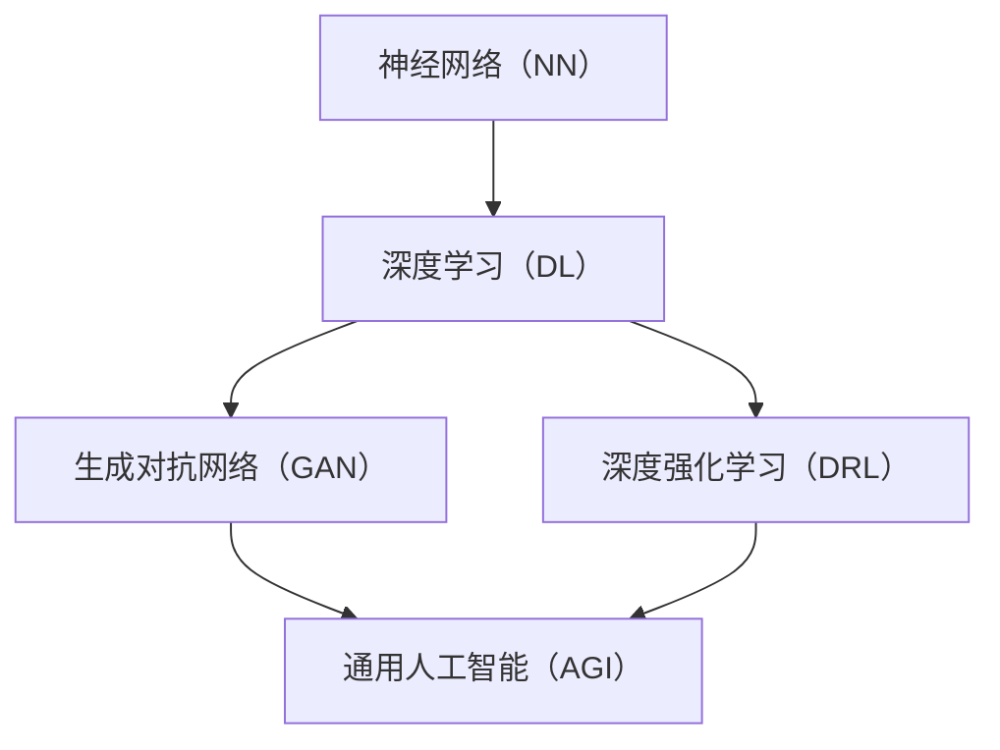

                 

### 1. 背景介绍

#### 1.1 目的和范围

本文旨在探讨AI 2.0时代的技术发展、未来趋势以及面临的挑战。AI 2.0代表着人工智能的第二个阶段，标志着从基于规则和统计模型的传统AI向具有自主思考能力的通用人工智能（AGI）的转变。本文将首先介绍AI 2.0的核心概念，并分析其在技术、社会、经济等领域的深远影响。

本文的范围涵盖以下几个方面：

1. **核心概念与联系**：将介绍AI 2.0的核心概念，包括神经网络、深度学习、强化学习等，并绘制流程图展示这些概念之间的联系。
2. **核心算法原理与具体操作步骤**：将详细讲解AI 2.0的核心算法，如生成对抗网络（GAN）、深度强化学习等，并通过伪代码展示其操作步骤。
3. **数学模型与公式**：将介绍AI 2.0中常用的数学模型和公式，包括梯度下降、反向传播等，并通过例子说明其应用。
4. **项目实战**：将通过实际案例展示AI 2.0技术的应用，包括开发环境搭建、代码实现与解读等。
5. **实际应用场景**：将探讨AI 2.0在不同领域的应用场景，如医疗、金融、自动驾驶等。
6. **工具和资源推荐**：将推荐学习资源、开发工具和框架，以及相关论文著作。
7. **总结**：将总结AI 2.0的发展趋势和面临的挑战。

通过本文的阅读，读者将能够全面了解AI 2.0的技术原理、应用场景和发展前景，为未来的人工智能研究和发展提供有价值的参考。

#### 1.2 预期读者

本文适合以下读者群体：

1. **人工智能研究者**：对AI 2.0技术感兴趣的科研人员，希望深入了解其核心技术原理和应用场景。
2. **人工智能从业者**：在人工智能领域工作的工程师和技术人员，希望掌握AI 2.0的相关技术，提升自己的专业能力。
3. **计算机科学学生**：计算机科学专业的学生，希望了解AI 2.0的技术发展历程和未来趋势。
4. **技术爱好者**：对人工智能技术感兴趣的技术爱好者，希望了解AI 2.0的核心概念和应用。
5. **企业决策者**：关注人工智能技术的企业决策者，希望了解AI 2.0对行业的影响和未来发展趋势。

#### 1.3 文档结构概述

本文将按照以下结构进行阐述：

1. **背景介绍**：介绍AI 2.0的背景、目的和预期读者。
2. **核心概念与联系**：分析AI 2.0的核心概念，绘制流程图展示其联系。
3. **核心算法原理与具体操作步骤**：详细讲解AI 2.0的核心算法原理，并通过伪代码展示具体操作步骤。
4. **数学模型与公式**：介绍AI 2.0中常用的数学模型和公式，并通过例子说明其应用。
5. **项目实战**：通过实际案例展示AI 2.0技术的应用，包括开发环境搭建、代码实现与解读。
6. **实际应用场景**：探讨AI 2.0在不同领域的应用场景。
7. **工具和资源推荐**：推荐学习资源、开发工具和框架，以及相关论文著作。
8. **总结**：总结AI 2.0的发展趋势和面临的挑战。
9. **附录**：提供常见问题与解答。
10. **扩展阅读与参考资料**：提供进一步阅读的建议和参考资料。

#### 1.4 术语表

在本文中，我们将使用以下术语：

##### 1.4.1 核心术语定义

1. **AI 2.0**：指人工智能的第二个阶段，具有自主思考能力的通用人工智能（AGI）。
2. **神经网络**：一种模仿人脑结构的计算模型，用于处理复杂数据。
3. **深度学习**：一种基于神经网络的学习方法，能够自动提取数据中的特征。
4. **强化学习**：一种通过奖励和惩罚机制学习最优策略的方法。
5. **生成对抗网络（GAN）**：一种由生成器和判别器组成的神经网络结构，用于生成高质量的图像和语音。

##### 1.4.2 相关概念解释

1. **自主思考**：AI 2.0具有的自主决策和解决问题的能力。
2. **通用人工智能（AGI）**：能够执行人类能够完成的任何认知任务的人工智能。
3. **机器学习**：一种人工智能的分支，通过从数据中学习规律，使其能够进行预测和决策。
4. **深度强化学习**：结合深度学习和强化学习的方法，用于解决复杂任务。

##### 1.4.3 缩略词列表

1. **GAN**：生成对抗网络（Generative Adversarial Networks）
2. **RL**：强化学习（Reinforcement Learning）
3. **DL**：深度学习（Deep Learning）
4. **NN**：神经网络（Neural Networks）
5. **AGI**：通用人工智能（Artificial General Intelligence）
6. **ID**：集成开发环境（Integrated Development Environment）
7. **GPU**：图形处理单元（Graphics Processing Unit）


### 2. 核心概念与联系

在探讨AI 2.0的核心概念之前，我们先了解一下人工智能发展的历史。人工智能（AI）起源于20世纪50年代，早期以符号主义和知识表示为主要研究方向。然而，受限于计算能力和数据规模，早期的人工智能系统在解决实际问题方面表现有限。

随着计算机性能的提升和大数据的兴起，20世纪80年代至21世纪初，机器学习成为了人工智能的主要研究方向。机器学习通过从数据中学习规律，使计算机能够进行预测和决策。在这一阶段，神经网络和深度学习逐渐成为核心算法，推动了人工智能的发展。

AI 2.0标志着人工智能进入第二个阶段，即具有自主思考能力的通用人工智能（AGI）。这一阶段的典型特征是能够模拟人类的认知过程，具备自主学习和适应环境的能力。为了实现AGI，AI 2.0引入了一系列新的核心概念，包括生成对抗网络（GAN）、深度强化学习等。

下面我们将通过一个Mermaid流程图来展示AI 2.0的核心概念及其联系。



在上述流程图中，神经网络（NN）作为基础算法，为深度学习（DL）提供了计算模型。深度学习（DL）通过多层神经网络提取数据中的特征，使得计算机能够进行更复杂的任务。生成对抗网络（GAN）是一种基于深度学习的生成模型，通过生成器和判别器的对抗训练，生成高质量的数据。深度强化学习（DRL）结合深度学习和强化学习，使计算机能够通过自主学习和试错，解决复杂的决策问题。最终，这些核心概念共同推动了通用人工智能（AGI）的发展。

接下来，我们将详细讲解这些核心概念及其应用场景。

### 2.1 神经网络（NN）

神经网络（Neural Networks，NN）是一种模仿人脑结构和功能的计算模型。它由大量的神经元（也称为节点）和连接这些神经元之间的边（也称为权重）组成。神经元的激活状态通过加权求和和激活函数来计算，从而实现数据的处理和转换。

#### 神经网络的基本结构

神经网络的基本结构包括输入层、隐藏层和输出层。输入层接收外部数据，隐藏层对数据进行特征提取和变换，输出层生成预测结果。

1. **输入层（Input Layer）**：输入层接收输入数据，并将其传递给隐藏层。每个输入节点对应数据中的一个特征。
   
2. **隐藏层（Hidden Layer）**：隐藏层对输入数据进行处理，通过加权求和和激活函数，将输入数据转换为新的特征表示。隐藏层的数量和神经元个数可以根据任务需求进行调整。

3. **输出层（Output Layer）**：输出层生成最终的预测结果。输出层的神经元个数和类型取决于具体的任务。

#### 神经元的计算过程

神经元（节点）的计算过程如下：

1. **加权求和**：计算每个输入信号与其对应权重的乘积之和。公式如下：
   \[
   z = \sum_{i=1}^{n} x_i \cdot w_i
   \]
   其中，\( x_i \) 表示输入信号，\( w_i \) 表示对应权重的值，\( n \) 表示输入信号的个数。

2. **激活函数**：对加权求和的结果应用激活函数，将线性组合转换为非线性输出。常用的激活函数包括：
   - **Sigmoid 函数**：
     \[
     a = \frac{1}{1 + e^{-z}}
     \]
     它将输出限制在（0, 1）之间。
   - **ReLU 函数**：
     \[
     a = \max(0, z)
     \]
     它在 \( z \leq 0 \) 时输出为0，在 \( z > 0 \) 时输出为 \( z \)。

#### 神经网络的训练过程

神经网络的训练过程主要包括以下步骤：

1. **前向传播**：将输入数据传递到神经网络，通过各个层的计算，生成最终的输出。

2. **计算损失函数**：计算预测值与真实值之间的差异，使用损失函数（如均方误差、交叉熵等）来度量预测误差。

3. **反向传播**：通过反向传播算法，将损失函数关于网络权重的梯度传递回网络的每一层，更新权重。

4. **梯度下降**：使用梯度下降算法，迭代更新权重，以最小化损失函数。

伪代码如下：
```python
while not converged:
    for each sample in training data:
        forward_pass(sample)
        loss = compute_loss(predicted, actual)
        backward_pass(loss)
        update_weights()
```

#### 神经网络的应用场景

神经网络在许多领域都有广泛的应用，包括：

1. **图像识别**：通过卷积神经网络（CNN）实现，例如人脸识别、物体检测等。

2. **自然语言处理**：通过循环神经网络（RNN）和Transformer模型实现，例如机器翻译、文本分类等。

3. **语音识别**：通过深度神经网络和卷积神经网络实现，例如语音转文字、语音合成等。

4. **强化学习**：通过深度神经网络作为价值函数或策略函数，实现智能体在复杂环境中的决策。

5. **推荐系统**：通过神经网络建模用户和物品的特征，实现个性化推荐。

### 2.2 深度学习（DL）

深度学习（Deep Learning，DL）是一种基于神经网络的学习方法，通过多层神经网络自动提取数据中的特征，从而实现复杂数据的处理和建模。深度学习在计算机视觉、自然语言处理、语音识别等领域取得了显著的成果。

#### 深度学习的基本结构

深度学习的基本结构包括输入层、隐藏层和输出层。与传统的神经网络相比，深度学习的隐藏层数量显著增加，使得模型能够提取更复杂的数据特征。

1. **输入层（Input Layer）**：输入层接收外部数据，并将其传递给隐藏层。

2. **隐藏层（Hidden Layer）**：隐藏层对输入数据进行处理，通过多层神经网络提取更高级的特征。

3. **输出层（Output Layer）**：输出层生成最终的预测结果。输出层的类型和个数取决于具体的任务。

#### 深度学习的训练过程

深度学习的训练过程主要包括以下步骤：

1. **前向传播**：将输入数据传递到神经网络，通过各个层的计算，生成最终的输出。

2. **计算损失函数**：计算预测值与真实值之间的差异，使用损失函数（如均方误差、交叉熵等）来度量预测误差。

3. **反向传播**：通过反向传播算法，将损失函数关于网络权重的梯度传递回网络的每一层，更新权重。

4. **梯度下降**：使用梯度下降算法，迭代更新权重，以最小化损失函数。

伪代码如下：
```python
while not converged:
    for each sample in training data:
        forward_pass(sample)
        loss = compute_loss(predicted, actual)
        backward_pass(loss)
        update_weights()
```

#### 深度学习的核心算法

1. **卷积神经网络（CNN）**：卷积神经网络是一种专门用于图像识别和处理的深度学习模型。通过卷积层、池化层和全连接层的组合，CNN能够提取图像中的空间特征，实现物体检测、图像分类等任务。

2. **循环神经网络（RNN）**：循环神经网络是一种用于处理序列数据的深度学习模型。通过重复使用相同的神经网络结构，RNN能够捕捉序列中的长期依赖关系，实现自然语言处理、语音识别等任务。

3. **Transformer模型**：Transformer模型是一种基于自注意力机制的深度学习模型，广泛用于自然语言处理任务。通过多头注意力机制，Transformer能够同时关注输入序列中的不同位置，实现高效的文本建模。

#### 深度学习的应用场景

深度学习在许多领域都有广泛的应用，包括：

1. **图像识别**：通过CNN实现，例如人脸识别、物体检测、图像分类等。

2. **自然语言处理**：通过RNN和Transformer模型实现，例如机器翻译、文本分类、情感分析等。

3. **语音识别**：通过深度神经网络和卷积神经网络实现，例如语音转文字、语音合成等。

4. **医疗影像分析**：通过深度学习模型实现疾病检测、病灶识别等。

5. **自动驾驶**：通过深度学习模型实现环境感知、路径规划、车辆控制等。

### 2.3 生成对抗网络（GAN）

生成对抗网络（Generative Adversarial Networks，GAN）是由Ian Goodfellow等人在2014年提出的一种深度学习模型。GAN由两个神经网络——生成器（Generator）和判别器（Discriminator）组成，它们相互对抗，共同训练。

#### GAN的工作原理

1. **生成器（Generator）**：生成器的目标是生成与真实数据相似的数据。它从随机噪声中生成假数据，并通过不断的优化，使其逐渐接近真实数据。

2. **判别器（Discriminator）**：判别器的目标是区分生成器生成的假数据与真实数据。它对输入的数据进行分类，判断其是真实数据还是假数据。

3. **对抗训练**：生成器和判别器相互对抗。生成器不断优化生成数据，使其更接近真实数据，判别器不断优化判断能力，以区分真假数据。通过这种对抗训练，生成器能够生成高质量的数据。

#### GAN的训练过程

GAN的训练过程主要包括以下步骤：

1. **初始化生成器和判别器**：随机初始化生成器和判别器的权重。

2. **生成假数据**：生成器从随机噪声中生成假数据。

3. **判别器训练**：将生成器生成的假数据和真实数据输入判别器，判别器更新权重，以区分真假数据。

4. **生成器训练**：将生成器生成的假数据和真实数据输入判别器，生成器更新权重，以生成更接近真实数据的数据。

5. **迭代更新**：重复上述过程，直到生成器生成的数据足够逼真。

伪代码如下：
```python
while not converged:
    for each batch of data:
        generate_fake_data()
        discriminator_loss = compute_loss(discriminator, fake_data, real_data)
        update_discriminator(discriminator_loss)
        generator_loss = compute_loss(discriminator, fake_data)
        update_generator(generator_loss)
```

#### GAN的应用场景

GAN在许多领域都有广泛的应用，包括：

1. **图像生成**：通过生成器生成逼真的图像，应用于图像修复、图像增强、艺术创作等。

2. **数据增强**：通过生成与真实数据相似的数据，增加训练样本量，提高模型的泛化能力。

3. **风格迁移**：通过生成器将一种风格的数据转换为另一种风格的数据，应用于艺术创作、电影特效等。

4. **语音合成**：通过生成器生成逼真的语音，应用于语音合成、语音转换等。

5. **自然语言生成**：通过生成器生成高质量的自然语言文本，应用于机器翻译、文本生成等。

### 2.4 深度强化学习（DRL）

深度强化学习（Deep Reinforcement Learning，DRL）是一种结合深度学习和强化学习的方法，用于解决复杂的决策问题。DRL通过深度神经网络作为价值函数或策略函数，使智能体能够在动态环境中进行自主学习和决策。

#### DRL的基本结构

DRL的基本结构包括：

1. **智能体（Agent）**：智能体是执行动作的实体，它通过观察环境状态，选择最佳动作，并获取奖励。

2. **环境（Environment）**：环境是智能体行动的场所，它为智能体提供状态信息和奖励。

3. **状态（State）**：状态是环境的一个特定描述，智能体通过状态了解当前环境的情况。

4. **动作（Action）**：动作是智能体在某一状态下执行的行为。

5. **价值函数（Value Function）**：价值函数用于评估智能体在特定状态下的期望收益。

6. **策略函数（Policy Function）**：策略函数用于根据当前状态选择最佳动作。

#### DRL的训练过程

DRL的训练过程主要包括以下步骤：

1. **初始化价值函数和策略函数**：随机初始化价值函数和策略函数的权重。

2. **环境交互**：智能体在环境中执行动作，获取状态和奖励。

3. **更新价值函数**：通过Bellman方程更新价值函数，以估计当前状态下的期望收益。

4. **更新策略函数**：使用价值函数更新策略函数，以选择最佳动作。

5. **迭代更新**：重复上述过程，直到策略函数收敛。

伪代码如下：
```python
while not converged:
    state = environment.reset()
    while not done:
        action = policy_function(state)
        next_state, reward, done = environment.step(action)
        update_value_function(state, action, reward, next_state, done)
        update_policy_function(value_function)
        state = next_state
```

#### DRL的应用场景

DRL在许多领域都有广泛的应用，包括：

1. **游戏**：通过DRL实现智能游戏AI，例如围棋、德州扑克等。

2. **机器人**：通过DRL实现机器人在复杂环境中的自主导航、任务执行等。

3. **自动驾驶**：通过DRL实现自动驾驶车辆的路径规划和决策。

4. **金融**：通过DRL实现金融交易策略的优化和风险管理。

5. **医疗**：通过DRL实现医疗诊断和治疗方案推荐。

### 2.5 通用人工智能（AGI）

通用人工智能（Artificial General Intelligence，AGI）是一种具有广泛认知能力的人工智能，能够执行人类能够完成的任何认知任务。AGI的核心目标是实现具有自主思考能力的智能体，使其能够在复杂环境中进行推理、学习和决策。

#### AGI的关键特性

1. **自主思考**：AGI具有自主思考能力，能够理解问题，提出解决方案，并执行任务。

2. **自适应**：AGI能够根据不同的环境和任务，自适应调整其行为和策略。

3. **推理能力**：AGI能够进行逻辑推理和抽象思维，理解复杂概念和关系。

4. **知识表示**：AGI能够表示、存储和利用知识，进行推理和决策。

5. **自主学习**：AGI能够通过经验和数据，自主学习和改进其行为和性能。

#### AGI的实现挑战

实现AGI面临以下挑战：

1. **计算能力**：AGI需要大量的计算资源和存储空间，以处理和分析复杂的数据。

2. **算法**：现有的机器学习和深度学习算法主要针对特定任务进行优化，难以实现通用能力。

3. **数据**：AGI需要大量的高质量数据，以进行有效的学习和推理。

4. **认知模型**：AGI需要一个全面的认知模型，以模拟人类的思维过程。

5. **安全性和可控性**：AGI需要确保其行为符合人类的价值观和道德准则，同时确保其可控性。

### 2.6 总结

在AI 2.0时代，人工智能的核心概念和技术不断发展，从传统的神经网络和深度学习，到生成对抗网络（GAN）和深度强化学习（DRL），这些技术共同推动了通用人工智能（AGI）的发展。通过逐步分析这些核心概念及其联系，我们可以更好地理解AI 2.0的技术原理和应用前景。

在下一部分中，我们将深入探讨AI 2.0的核心算法原理和具体操作步骤，以帮助读者更好地掌握这些技术。


## 3. 核心算法原理 & 具体操作步骤

在了解了AI 2.0的核心概念及其联系之后，接下来我们将深入探讨AI 2.0的核心算法原理和具体操作步骤。这些算法是AI 2.0技术实现的基础，掌握它们对于理解AI 2.0的技术原理和应用具有重要意义。

### 3.1 神经网络（NN）

神经网络（NN）是AI 2.0的核心算法之一，它通过模拟人脑的结构和功能，实现对复杂数据的处理和建模。在本节中，我们将详细讲解神经网络的基本原理和具体操作步骤。

#### 3.1.1 神经网络的基本原理

神经网络由大量的神经元（节点）和连接这些神经元之间的边（权重）组成。每个神经元接收输入信号，通过加权求和和激活函数，产生输出信号。神经网络通过不断调整权重，使输出信号接近期望值。

1. **神经元结构**：每个神经元包含一个输入层、一个输出层和多个隐藏层。输入层接收外部数据，输出层生成预测结果，隐藏层对数据进行特征提取和变换。

2. **激活函数**：激活函数用于将线性组合转换为非线性输出。常见的激活函数包括Sigmoid函数、ReLU函数和Tanh函数。

3. **前向传播**：输入数据通过神经网络，从输入层传递到隐藏层，最终传递到输出层。在每个层中，神经元通过加权求和和激活函数计算输出。

4. **反向传播**：计算预测值与真实值之间的差异，通过反向传播算法，将误差信号反向传递到网络中的每一层，更新权重。

#### 3.1.2 神经网络的具体操作步骤

以下是神经网络的具体操作步骤：

1. **初始化权重**：随机初始化网络中的权重。

2. **前向传播**：
   - 将输入数据传递到输入层。
   - 通过每个层的神经元，计算输出信号。
   - 计算每个神经元的激活值。

3. **计算损失函数**：计算预测值与真实值之间的差异，使用损失函数（如均方误差、交叉熵等）度量预测误差。

4. **反向传播**：
   - 计算每个神经元的梯度。
   - 更新每个神经元的权重。

5. **迭代更新**：重复上述步骤，直到网络收敛。

伪代码如下：
```python
while not converged:
    for each sample in training data:
        forward_pass(sample)
        loss = compute_loss(predicted, actual)
        backward_pass(loss)
        update_weights()
```

#### 3.1.3 神经网络的应用场景

神经网络在许多领域都有广泛的应用，包括：

1. **图像识别**：通过卷积神经网络（CNN）实现，例如人脸识别、物体检测等。

2. **自然语言处理**：通过循环神经网络（RNN）和Transformer模型实现，例如机器翻译、文本分类等。

3. **语音识别**：通过深度神经网络和卷积神经网络实现，例如语音转文字、语音合成等。

4. **强化学习**：通过深度神经网络作为价值函数或策略函数，实现智能体在复杂环境中的决策。

5. **推荐系统**：通过神经网络建模用户和物品的特征，实现个性化推荐。

### 3.2 深度学习（DL）

深度学习（DL）是一种基于神经网络的学习方法，通过多层神经网络自动提取数据中的特征，从而实现复杂数据的处理和建模。在本节中，我们将详细讲解深度学习的基本原理和具体操作步骤。

#### 3.2.1 深度学习的基本原理

深度学习的基本原理与神经网络类似，但在结构上更加复杂。深度学习通过增加隐藏层的数量，使模型能够提取更高级的特征，从而提高模型的性能。

1. **多层神经网络**：深度学习模型包含多个隐藏层，每个隐藏层对数据进行特征提取和变换。

2. **反向传播算法**：深度学习使用反向传播算法，通过前向传播计算输出信号，通过反向传播计算误差信号，并更新权重。

3. **激活函数**：深度学习模型中使用多种激活函数，如ReLU函数、Sigmoid函数和Tanh函数，以引入非线性特性。

4. **正则化技术**：深度学习模型中使用正则化技术，如Dropout、L2正则化等，以防止过拟合。

#### 3.2.2 深度学习的具体操作步骤

以下是深度学习模型的具体操作步骤：

1. **初始化模型参数**：随机初始化模型中的权重和偏置。

2. **前向传播**：
   - 将输入数据传递到输入层。
   - 通过每个层的神经元，计算输出信号。
   - 计算每个神经元的激活值。

3. **计算损失函数**：计算预测值与真实值之间的差异，使用损失函数（如均方误差、交叉熵等）度量预测误差。

4. **反向传播**：
   - 计算每个神经元的梯度。
   - 更新每个神经元的权重。

5. **迭代更新**：重复上述步骤，直到模型收敛。

伪代码如下：
```python
while not converged:
    for each sample in training data:
        forward_pass(sample)
        loss = compute_loss(predicted, actual)
        backward_pass(loss)
        update_weights()
```

#### 3.2.3 深度学习的关键算法

1. **卷积神经网络（CNN）**：卷积神经网络是一种专门用于图像识别和处理的深度学习模型。通过卷积层、池化层和全连接层的组合，CNN能够提取图像中的空间特征，实现物体检测、图像分类等任务。

2. **循环神经网络（RNN）**：循环神经网络是一种用于处理序列数据的深度学习模型。通过重复使用相同的神经网络结构，RNN能够捕捉序列中的长期依赖关系，实现自然语言处理、语音识别等任务。

3. **Transformer模型**：Transformer模型是一种基于自注意力机制的深度学习模型，广泛用于自然语言处理任务。通过多头注意力机制，Transformer能够同时关注输入序列中的不同位置，实现高效的文本建模。

#### 3.2.4 深度学习的应用场景

深度学习在许多领域都有广泛的应用，包括：

1. **图像识别**：通过CNN实现，例如人脸识别、物体检测、图像分类等。

2. **自然语言处理**：通过RNN和Transformer模型实现，例如机器翻译、文本分类、情感分析等。

3. **语音识别**：通过深度神经网络和卷积神经网络实现，例如语音转文字、语音合成等。

4. **医疗影像分析**：通过深度学习模型实现疾病检测、病灶识别等。

5. **自动驾驶**：通过深度学习模型实现环境感知、路径规划、车辆控制等。

### 3.3 生成对抗网络（GAN）

生成对抗网络（GAN）是一种由生成器和判别器组成的深度学习模型，通过对抗训练生成高质量的数据。GAN在图像生成、数据增强和风格迁移等领域取得了显著的成果。在本节中，我们将详细讲解GAN的基本原理和具体操作步骤。

#### 3.3.1 GAN的基本原理

GAN由两个神经网络——生成器和判别器组成。生成器的目标是生成与真实数据相似的数据，判别器的目标是区分生成器生成的数据与真实数据。生成器和判别器相互对抗，通过不断的训练，生成器生成的数据逐渐接近真实数据。

1. **生成器（Generator）**：生成器从随机噪声中生成假数据，并试图使其与真实数据相似。

2. **判别器（Discriminator）**：判别器的目标是区分生成器生成的假数据与真实数据。

3. **对抗训练**：生成器和判别器相互对抗，生成器试图生成更逼真的数据，判别器试图准确区分真假数据。通过这种对抗训练，生成器能够生成高质量的数据。

#### 3.3.2 GAN的具体操作步骤

以下是GAN的具体操作步骤：

1. **初始化生成器和判别器**：随机初始化生成器和判别器的权重。

2. **生成假数据**：生成器从随机噪声中生成假数据。

3. **判别器训练**：将生成器生成的假数据和真实数据输入判别器，判别器更新权重，以区分真假数据。

4. **生成器训练**：将生成器生成的假数据和真实数据输入判别器，生成器更新权重，以生成更逼真的数据。

5. **迭代更新**：重复上述过程，直到生成器生成的数据足够逼真。

伪代码如下：
```python
while not converged:
    for each batch of data:
        generate_fake_data()
        discriminator_loss = compute_loss(discriminator, fake_data, real_data)
        update_discriminator(discriminator_loss)
        generator_loss = compute_loss(discriminator, fake_data)
        update_generator(generator_loss)
```

#### 3.3.3 GAN的应用场景

GAN在许多领域都有广泛的应用，包括：

1. **图像生成**：通过生成器生成逼真的图像，应用于图像修复、图像增强、艺术创作等。

2. **数据增强**：通过生成与真实数据相似的数据，增加训练样本量，提高模型的泛化能力。

3. **风格迁移**：通过生成器将一种风格的数据转换为另一种风格的数据，应用于艺术创作、电影特效等。

4. **语音合成**：通过生成器生成逼真的语音，应用于语音合成、语音转换等。

5. **自然语言生成**：通过生成器生成高质量的自然语言文本，应用于机器翻译、文本生成等。

### 3.4 深度强化学习（DRL）

深度强化学习（DRL）是一种结合深度学习和强化学习的方法，用于解决复杂的决策问题。DRL通过深度神经网络作为价值函数或策略函数，使智能体能够在动态环境中进行自主学习和决策。在本节中，我们将详细讲解DRL的基本原理和具体操作步骤。

#### 3.4.1 DRL的基本原理

DRL的基本原理包括：

1. **智能体（Agent）**：智能体是执行动作的实体，它通过观察环境状态，选择最佳动作，并获取奖励。

2. **环境（Environment）**：环境是智能体行动的场所，它为智能体提供状态信息和奖励。

3. **状态（State）**：状态是环境的一个特定描述，智能体通过状态了解当前环境的情况。

4. **动作（Action）**：动作是智能体在某一状态下执行的行为。

5. **价值函数（Value Function）**：价值函数用于评估智能体在特定状态下的期望收益。

6. **策略函数（Policy Function）**：策略函数用于根据当前状态选择最佳动作。

DRL通过与环境交互，不断更新价值函数和策略函数，以实现最优决策。

#### 3.4.2 DRL的具体操作步骤

以下是DRL的具体操作步骤：

1. **初始化价值函数和策略函数**：随机初始化价值函数和策略函数的权重。

2. **环境交互**：智能体在环境中执行动作，获取状态和奖励。

3. **更新价值函数**：通过Bellman方程更新价值函数，以估计当前状态下的期望收益。

4. **更新策略函数**：使用价值函数更新策略函数，以选择最佳动作。

5. **迭代更新**：重复上述过程，直到策略函数收敛。

伪代码如下：
```python
while not converged:
    state = environment.reset()
    while not done:
        action = policy_function(state)
        next_state, reward, done = environment.step(action)
        update_value_function(state, action, reward, next_state, done)
        update_policy_function(value_function)
        state = next_state
```

#### 3.4.3 DRL的应用场景

DRL在许多领域都有广泛的应用，包括：

1. **游戏**：通过DRL实现智能游戏AI，例如围棋、德州扑克等。

2. **机器人**：通过DRL实现机器人在复杂环境中的自主导航、任务执行等。

3. **自动驾驶**：通过DRL实现自动驾驶车辆的路径规划和决策。

4. **金融**：通过DRL实现金融交易策略的优化和风险管理。

5. **医疗**：通过DRL实现医疗诊断和治疗方案推荐。

### 3.5 通用人工智能（AGI）

通用人工智能（AGI）是一种具有广泛认知能力的人工智能，能够执行人类能够完成的任何认知任务。实现AGI是人工智能领域的终极目标，但至今仍未实现。在本节中，我们将探讨实现AGI所需的条件和技术。

#### 3.5.1 实现AGI的条件

实现AGI需要满足以下条件：

1. **计算能力**：AGI需要大量的计算资源和存储空间，以处理和分析复杂的数据。

2. **算法**：现有的机器学习和深度学习算法主要针对特定任务进行优化，难以实现通用能力。

3. **数据**：AGI需要大量的高质量数据，以进行有效的学习和推理。

4. **认知模型**：AGI需要一个全面的认知模型，以模拟人类的思维过程。

5. **安全性和可控性**：AGI需要确保其行为符合人类的价值观和道德准则，同时确保其可控性。

#### 3.5.2 实现AGI的技术

1. **多模态学习**：AGI需要具备处理多种类型数据的能力，如文本、图像、语音等。多模态学习能够整合不同类型的数据，提高模型的性能。

2. **知识图谱**：知识图谱是一种用于表示和存储知识的图形结构，AGI需要利用知识图谱进行推理和决策。

3. **迁移学习**：迁移学习是一种将一个任务的学习经验应用于其他任务的方法，AGI需要具备迁移学习的能力，以快速适应新任务。

4. **元学习**：元学习是一种通过学习学习的方法，AGI需要具备元学习的能力，以快速适应新的环境和任务。

5. **人机协作**：AGI需要与人类协作，共同完成任务，提高生产力和创新能力。

### 3.6 总结

在本节中，我们详细讲解了AI 2.0的核心算法原理和具体操作步骤，包括神经网络、深度学习、生成对抗网络（GAN）和深度强化学习（DRL）。这些算法是AI 2.0技术实现的基础，掌握它们对于理解AI 2.0的技术原理和应用具有重要意义。在下一部分中，我们将介绍AI 2.0的数学模型和公式，并通过具体例子进行讲解。

## 4. 数学模型和公式 & 详细讲解 & 举例说明

在AI 2.0的核心算法中，数学模型和公式扮演着至关重要的角色。这些模型和公式不仅帮助我们理解和描述算法的行为，而且为算法的实现和优化提供了理论基础。在本节中，我们将详细介绍AI 2.0中常用的数学模型和公式，并通过具体例子进行讲解。

### 4.1 梯度下降算法

梯度下降算法是机器学习和深度学习中最基本且最重要的优化算法之一。它用于最小化损失函数，从而使模型能够更好地拟合训练数据。梯度下降算法的核心思想是沿着损失函数的梯度方向更新模型参数，以逐步减小损失。

#### 4.1.1 梯度下降算法的公式

梯度下降算法的更新公式如下：
\[
\theta_{\text{new}} = \theta_{\text{current}} - \alpha \cdot \nabla_\theta J(\theta)
\]
其中：
- \( \theta \) 表示模型参数。
- \( J(\theta) \) 表示损失函数。
- \( \alpha \) 表示学习率。
- \( \nabla_\theta J(\theta) \) 表示损失函数关于参数 \( \theta \) 的梯度。

#### 4.1.2 梯度下降算法的例子

假设我们有一个线性回归模型，其损失函数为均方误差（MSE）：
\[
J(\theta) = \frac{1}{2} \sum_{i=1}^{n} (y_i - \theta_0 - \theta_1 x_i)^2
\]
其中，\( y_i \) 表示实际值，\( \theta_0 \) 和 \( \theta_1 \) 分别表示模型参数。

对于每个训练样本，我们计算损失函数的梯度：
\[
\nabla_\theta J(\theta) = \begin{bmatrix}
-\frac{1}{2} \sum_{i=1}^{n} (y_i - \theta_0 - \theta_1 x_i) \\
-\frac{1}{2} \sum_{i=1}^{n} (y_i - \theta_0 - \theta_1 x_i) x_i
\end{bmatrix}
\]

然后，我们使用梯度下降算法更新参数：
\[
\theta_0 = \theta_0 - \alpha \cdot \frac{1}{2} \sum_{i=1}^{n} (y_i - \theta_0 - \theta_1 x_i)
\]
\[
\theta_1 = \theta_1 - \alpha \cdot \frac{1}{2} \sum_{i=1}^{n} (y_i - \theta_0 - \theta_1 x_i) x_i
\]

通过多次迭代更新，我们可以最小化损失函数，从而得到最佳参数。

### 4.2 反向传播算法

反向传播算法是梯度下降算法在神经网络中的具体应用。它通过前向传播计算输出，通过反向传播计算梯度，并更新网络权重，以最小化损失函数。

#### 4.2.1 反向传播算法的公式

反向传播算法的计算过程如下：

1. **前向传播**：计算每个神经元的输入和输出：
\[
a_{l}^{[i]} = \sigma(z_{l}^{[i]})
\]
\[
z_{l}^{[i]} = \sum_{j} w_{l-1,j}^{[i]} a_{l-1}^{[j]} + b_{l}^{[i]}
\]

2. **计算损失函数的梯度**：
   - 对于输出层，计算损失函数关于输出层的梯度：
   \[
   \delta_{l}^{[i]} = \frac{\partial J}{\partial z_{l}^{[i]}}
   \]
   - 对于隐藏层，通过链式法则计算梯度：
   \[
   \delta_{l-1}^{[i]} = (\sigma'(z_{l-1}^{[i]})) \cdot (w_{l,j}^{[i]} \cdot \delta_{l}^{[j]})
   \]

3. **更新权重和偏置**：
\[
w_{l-1,j}^{[i]} = w_{l-1,j}^{[i]} - \alpha \cdot \delta_{l-1}^{[i]} a_{l-1}^{[j]}
\]
\[
b_{l-1}^{[i]} = b_{l-1}^{[i]} - \alpha \cdot \delta_{l-1}^{[i]}
\]

#### 4.2.2 反向传播算法的例子

假设我们有一个简单的两层神经网络，输入层有2个神经元，隐藏层有3个神经元，输出层有1个神经元。激活函数使用ReLU。

1. **前向传播**：
   \[
   z_{1}^{[1]} = \sum_{i=1}^{2} w_{0,i}^{[1]} x_i + b_{0}^{[1]}
   \]
   \[
   a_{1}^{[1]} = \max(0, z_{1}^{[1]})
   \]

   \[
   z_{2}^{[2]} = \sum_{i=1}^{3} w_{1,i}^{[2]} a_{1}^{[i]} + b_{1}^{[2]}
   \]
   \[
   a_{2}^{[2]} = \sigma(z_{2}^{[2]})
   \]

2. **计算损失函数的梯度**：
   - 输出层的梯度：
   \[
   \delta_{2}^{[2]} = a_{2}^{[2]} - y
   \]
   - 隐藏层的梯度：
   \[
   \delta_{1}^{[1]} = (\sigma'(z_{1}^{[1]})) \cdot (w_{2,1}^{[2]} \cdot \delta_{2}^{[1]} + w_{2,2}^{[2]} \cdot \delta_{2}^{[2]})
   \]

3. **更新权重和偏置**：
   \[
   w_{0,1}^{[1]} = w_{0,1}^{[1]} - \alpha \cdot \delta_{1}^{[1]} x_1
   \]
   \[
   w_{0,2}^{[1]} = w_{0,2}^{[1]} - \alpha \cdot \delta_{1}^{[1]} x_2
   \]
   \[
   b_{0}^{[1]} = b_{0}^{[1]} - \alpha \cdot \delta_{1}^{[1]}
   \]

   \[
   w_{1,1}^{[2]} = w_{1,1}^{[2]} - \alpha \cdot \delta_{2}^{[1]} a_{1}^{[1]}
   \]
   \[
   w_{1,2}^{[2]} = w_{1,2}^{[2]} - \alpha \cdot \delta_{2}^{[2]} a_{1}^{[2]}
   \]
   \[
   b_{1}^{[2]} = b_{1}^{[2]} - \alpha \cdot \delta_{2}^{[2]}
   \]

### 4.3 随机梯度下降（SGD）

随机梯度下降（Stochastic Gradient Descent，SGD）是对梯度下降算法的一种改进。与梯度下降算法使用整个训练集的梯度不同，SGD在每个迭代步骤中只使用一个样本或一个小批量样本的梯度。这导致SGD的更新更加频繁，有助于避免局部最小值。

#### 4.3.1 随机梯度下降的公式

随机梯度下降的更新公式如下：
\[
\theta_{\text{new}} = \theta_{\text{current}} - \alpha \cdot \nabla_\theta J(\theta; \theta_{\text{current}}, x_i, y_i)
\]
其中，\( x_i \) 和 \( y_i \) 分别表示当前迭代的训练样本及其标签。

#### 4.3.2 随机梯度下降的例子

假设我们有一个简单的线性回归模型，使用SGD进行训练。损失函数为均方误差（MSE），训练数据集包含多个样本。

1. **初始化模型参数**：
   \[
   \theta_0 = 0
   \]
   \[
   \theta_1 = 0
   \]

2. **迭代更新**：
   - 对于每个样本 \( (x_i, y_i) \)：
     - 计算损失函数的梯度：
     \[
     \nabla_\theta J(\theta; \theta_{\text{current}}, x_i, y_i) = \begin{bmatrix}
     -\frac{1}{2} \sum_{i=1}^{n} (y_i - \theta_0 - \theta_1 x_i) \\
     -\frac{1}{2} \sum_{i=1}^{n} (y_i - \theta_0 - \theta_1 x_i) x_i
     \end{bmatrix}
     \]
     - 更新模型参数：
     \[
     \theta_0 = \theta_0 - \alpha \cdot \nabla_\theta J(\theta; \theta_{\text{current}}, x_i, y_i)
     \]
     \[
     \theta_1 = \theta_1 - \alpha \cdot \nabla_\theta J(\theta; \theta_{\text{current}}, x_i, y_i)
     \]

通过多次迭代更新，我们可以最小化损失函数，从而得到最佳参数。

### 4.4 总结

在本节中，我们介绍了AI 2.0中常用的数学模型和公式，包括梯度下降算法、反向传播算法、随机梯度下降（SGD）。这些算法和公式是AI 2.0核心算法实现的基础，掌握它们对于理解AI 2.0的技术原理和应用具有重要意义。通过具体的例子，我们展示了这些算法的步骤和计算过程。在下一部分中，我们将通过实际案例展示AI 2.0技术的应用。

## 5. 项目实战：代码实际案例和详细解释说明

在前文中，我们详细介绍了AI 2.0的核心算法原理、数学模型以及具体操作步骤。为了更好地帮助读者理解这些技术在实际中的应用，本节我们将通过一个实际项目——图像分类任务，展示如何使用AI 2.0技术进行开发，包括环境搭建、代码实现和代码解读。

### 5.1 开发环境搭建

在进行图像分类任务之前，我们需要搭建一个合适的开发环境。以下步骤描述了如何搭建一个基于Python和TensorFlow的图像分类项目环境：

1. **安装Python**：确保系统上安装了Python 3.7或更高版本。

2. **安装TensorFlow**：通过以下命令安装TensorFlow：
   ```shell
   pip install tensorflow
   ```

3. **安装其他依赖**：安装一些其他常用的库，例如NumPy、Pandas和Matplotlib：
   ```shell
   pip install numpy pandas matplotlib
   ```

4. **数据集准备**：下载并解压一个公开的图像分类数据集，如CIFAR-10或ImageNet。这些数据集通常包含多个类别，并且已经被分割成训练集和测试集。

### 5.2 源代码详细实现和代码解读

下面是一个简单的图像分类项目的代码实现，该项目使用卷积神经网络（CNN）对图像进行分类。

```python
import tensorflow as tf
from tensorflow.keras import datasets, layers, models
import matplotlib.pyplot as plt

# 加载数据集
(train_images, train_labels), (test_images, test_labels) = datasets.cifar10.load_data()

# 预处理数据
train_images, test_images = train_images / 255.0, test_images / 255.0

# 构建CNN模型
model = models.Sequential()
model.add(layers.Conv2D(32, (3, 3), activation='relu', input_shape=(32, 32, 3)))
model.add(layers.MaxPooling2D((2, 2)))
model.add(layers.Conv2D(64, (3, 3), activation='relu'))
model.add(layers.MaxPooling2D((2, 2)))
model.add(layers.Conv2D(64, (3, 3), activation='relu'))

# 添加全连接层
model.add(layers.Flatten())
model.add(layers.Dense(64, activation='relu'))
model.add(layers.Dense(10, activation='softmax'))

# 编译模型
model.compile(optimizer='adam',
              loss='sparse_categorical_crossentropy',
              metrics=['accuracy'])

# 训练模型
model.fit(train_images, train_labels, epochs=10, batch_size=64)

# 评估模型
test_loss, test_acc = model.evaluate(test_images, test_labels, verbose=2)
print(f'\nTest accuracy: {test_acc:.4f}')

# 可视化模型结构
model.summary()

# 可视化训练过程
plt.figure(figsize=(8, 8))
for i in range(train_images.shape[0]):
    plt.subplot(8, 8, i+1)
    plt.xticks([])
    plt.yticks([])
    plt.grid(False)
    plt.imshow(train_images[i], cmap=plt.cm.binary)
    plt.xlabel(str(train_labels[i]))
plt.show()
```

#### 5.2.1 代码解读与分析

1. **数据加载和预处理**：
   - 使用TensorFlow的内置函数加载数据集，并对其进行归一化处理，使其在[0, 1]之间。

2. **模型构建**：
   - 使用`models.Sequential()`创建一个序列模型。
   - 添加卷积层（`Conv2D`）和池化层（`MaxPooling2D`），以提取图像的特征。
   - 添加全连接层（`Dense`），用于分类。

3. **模型编译**：
   - 设置优化器（`optimizer`）、损失函数（`loss`）和评估指标（`metrics`）。

4. **模型训练**：
   - 使用`fit()`函数训练模型，指定训练数据和迭代次数（`epochs`）以及批量大小（`batch_size`）。

5. **模型评估**：
   - 使用`evaluate()`函数评估模型在测试集上的性能，输出损失和准确率。

6. **模型结构可视化**：
   - 使用`model.summary()`打印模型结构，以便于理解模型的组成。

7. **数据可视化**：
   - 使用Matplotlib绘制训练数据的散点图，以便于查看分类效果。

### 5.3 代码解读与分析

以下是对代码的详细解读：

1. **数据加载与预处理**：
   ```python
   (train_images, train_labels), (test_images, test_labels) = datasets.cifar10.load_data()
   train_images, test_images = train_images / 255.0, test_images / 255.0
   ```
   - `datasets.cifar10.load_data()`函数加载数据集，`train_images`和`train_labels`是训练数据，`test_images`和`test_labels`是测试数据。
   - 数据归一化是为了使模型更容易收敛，通常将像素值缩放到[0, 1]。

2. **模型构建**：
   ```python
   model.add(layers.Conv2D(32, (3, 3), activation='relu', input_shape=(32, 32, 3)))
   model.add(layers.MaxPooling2D((2, 2)))
   model.add(layers.Conv2D(64, (3, 3), activation='relu'))
   model.add(layers.MaxPooling2D((2, 2)))
   model.add(layers.Conv2D(64, (3, 3), activation='relu'))
   model.add(layers.Flatten())
   model.add(layers.Dense(64, activation='relu'))
   model.add(layers.Dense(10, activation='softmax'))
   ```
   - 第一个卷积层使用32个3x3的卷积核，激活函数为ReLU。
   - 接着使用两个MaxPooling层进行下采样。
   - 第二个卷积层使用64个3x3的卷积核，激活函数为ReLU。
   - 将卷积层的输出展平后，添加两个全连接层，最后一个全连接层使用10个神经元，表示10个类别，激活函数为softmax。

3. **模型编译**：
   ```python
   model.compile(optimizer='adam',
                 loss='sparse_categorical_crossentropy',
                 metrics=['accuracy'])
   ```
   - 设置优化器为Adam，损失函数为稀疏交叉熵，评估指标为准确率。

4. **模型训练**：
   ```python
   model.fit(train_images, train_labels, epochs=10, batch_size=64)
   ```
   - 使用`fit()`函数训练模型，迭代10次，批量大小为64。

5. **模型评估**：
   ```python
   test_loss, test_acc = model.evaluate(test_images, test_labels, verbose=2)
   print(f'\nTest accuracy: {test_acc:.4f}')
   ```
   - 使用`evaluate()`函数评估模型在测试集上的性能，打印测试准确率。

6. **模型结构可视化**：
   ```python
   model.summary()
   ```
   - 打印模型结构，显示层的大小和类型。

7. **数据可视化**：
   ```python
   plt.figure(figsize=(8, 8))
   for i in range(train_images.shape[0]):
       plt.subplot(8, 8, i+1)
       plt.xticks([])
       plt.yticks([])
       plt.grid(False)
       plt.imshow(train_images[i], cmap=plt.cm.binary)
       plt.xlabel(str(train_labels[i]))
   plt.show()
   ```
   - 使用Matplotlib绘制训练数据的散点图，标注类别。

通过上述代码，我们构建了一个简单的卷积神经网络，用于图像分类任务。代码中包含了数据加载、模型构建、训练和评估等步骤，展示了如何使用TensorFlow实现一个基本的AI 2.0项目。在实际应用中，我们可以根据具体需求对模型结构和训练过程进行调整，以提高模型的性能和泛化能力。

### 5.4 项目实战总结

通过本节的项目实战，我们展示了如何使用AI 2.0技术进行图像分类任务。从环境搭建到代码实现，再到代码解读，我们详细介绍了每个步骤的操作和原理。这一过程不仅帮助我们理解了AI 2.0的核心算法和数学模型，而且让我们体会到了实际应用中遇到的问题和解决方法。

在下一部分中，我们将探讨AI 2.0的实际应用场景，分析其在各个领域的应用情况，以及面临的挑战和机遇。

## 6. 实际应用场景

AI 2.0技术的快速发展，使其在各个领域都展现出了巨大的潜力。以下我们将探讨AI 2.0在医疗、金融、自动驾驶和自然语言处理等领域的实际应用场景，分析其优势、挑战和未来发展趋势。

### 6.1 医疗

AI 2.0在医疗领域的应用非常广泛，包括疾病诊断、药物研发、手术规划等。以下是一些具体的应用场景：

1. **疾病诊断**：通过深度学习和生成对抗网络（GAN），AI 2.0可以分析医疗影像，如X光片、CT扫描和MRI，用于早期疾病检测。例如，谷歌旗下的DeepMind使用AI技术成功诊断了数百种疾病，包括乳腺癌、肺癌和糖尿病。

2. **药物研发**：AI 2.0可以帮助科学家快速筛选和设计新药物，通过生成对抗网络生成新的分子结构，并评估其药效和毒性。这一过程大大缩短了药物研发周期，降低了研发成本。

3. **手术规划**：AI 2.0可以分析患者的历史病历和手术视频，为医生提供个性化的手术方案。例如，IBM的Watson for Oncology系统通过分析患者的基因组数据和医疗记录，为医生提供治疗建议。

**优势**：
- **提高诊断准确性**：通过分析大量医疗数据，AI 2.0可以提供更准确的诊断结果。
- **降低成本**：AI 2.0可以自动化一些重复性工作，降低人力成本。
- **提高效率**：AI 2.0可以快速处理和分析大量数据，提高医疗服务的效率。

**挑战**：
- **数据隐私**：医疗数据的隐私保护是AI 2.0在医疗领域应用的一个重要挑战。
- **技术成熟度**：AI 2.0技术在医疗领域的应用还处于早期阶段，需要更多的研究和实践。

### 6.2 金融

AI 2.0在金融领域的应用也非常广泛，包括风险管理、欺诈检测和投资策略优化等。以下是一些具体的应用场景：

1. **风险管理**：通过深度强化学习和生成对抗网络，AI 2.0可以分析市场数据，预测风险并制定相应的风险控制策略。

2. **欺诈检测**：AI 2.0可以通过分析交易数据和行为模式，识别和预防金融欺诈。例如，美国运通公司使用AI技术减少了90%的欺诈交易。

3. **投资策略优化**：AI 2.0可以根据历史数据和当前市场情况，为投资者提供个性化的投资策略。

**优势**：
- **提高准确性**：通过分析大量历史数据，AI 2.0可以提供更准确的风险评估和投资建议。
- **降低成本**：AI 2.0可以自动化一些重复性工作，降低人力成本。
- **提高效率**：AI 2.0可以快速处理和分析大量数据，提高金融服务的效率。

**挑战**：
- **数据隐私**：金融数据的隐私保护是AI 2.0在金融领域应用的一个重要挑战。
- **算法透明度**：AI 2.0的算法透明度问题，需要更多的研究和规范。

### 6.3 自动驾驶

AI 2.0在自动驾驶领域的应用，使其成为未来交通出行的重要方向。以下是一些具体的应用场景：

1. **环境感知**：通过深度学习和生成对抗网络，AI 2.0可以实时感知周围环境，识别道路、车辆、行人等。

2. **路径规划**：AI 2.0可以根据实时环境数据和交通状况，规划最优行驶路径，提高行驶安全性和效率。

3. **车辆控制**：AI 2.0可以通过深度强化学习，实现车辆的自主驾驶，包括加速、制动和转向等。

**优势**：
- **提高安全性**：AI 2.0可以实时感知和应对复杂交通状况，提高行驶安全性。
- **提高效率**：AI 2.0可以优化行驶路径和交通流量，提高交通效率。
- **降低成本**：AI 2.0可以减少交通事故和拥堵，降低交通成本。

**挑战**：
- **数据隐私**：自动驾驶车辆需要收集大量的实时数据，数据隐私保护是重要挑战。
- **技术成熟度**：自动驾驶技术还需要更多的测试和验证，确保其安全性和可靠性。

### 6.4 自然语言处理

AI 2.0在自然语言处理（NLP）领域的应用，使其成为智能助手和自动化服务的关键技术。以下是一些具体的应用场景：

1. **机器翻译**：通过深度学习和生成对抗网络，AI 2.0可以实现高质量的机器翻译，支持多种语言之间的实时翻译。

2. **文本分类**：AI 2.0可以通过深度学习模型，对大量文本进行分类，如新闻分类、情感分析等。

3. **智能助手**：AI 2.0可以构建智能助手，通过语音识别和自然语言处理，实现人机交互，为用户提供个性化服务。

**优势**：
- **提高准确性**：通过分析大量文本数据，AI 2.0可以提供更准确的分类和翻译结果。
- **降低成本**：AI 2.0可以自动化一些重复性工作，降低人力成本。
- **提高效率**：AI 2.0可以快速处理和分析大量文本数据，提高工作效率。

**挑战**：
- **语言复杂性**：自然语言处理需要处理多种语言和方言，语言复杂性是重要挑战。
- **数据隐私**：自然语言处理需要大量用户数据，数据隐私保护是重要挑战。

### 6.5 未来发展趋势与挑战

AI 2.0技术在各个领域的应用，展示了巨大的潜力和前景。然而，随着技术的不断发展，AI 2.0也面临着一系列挑战：

1. **数据隐私**：随着AI 2.0技术的广泛应用，数据隐私保护成为重要议题。如何确保用户数据的隐私和安全，是AI 2.0发展的重要挑战。

2. **算法透明度**：AI 2.0的算法复杂度高，缺乏透明度。如何提高算法的透明度，使其可解释性更好，是当前研究的重要方向。

3. **技术成熟度**：AI 2.0技术仍处于快速发展阶段，技术成熟度有待提高。如何确保AI 2.0技术的安全性和可靠性，是未来发展的关键。

4. **人才短缺**：AI 2.0技术的发展需要大量高水平的人才，目前人才短缺问题日益突出。如何培养和吸引更多AI 2.0人才，是当前面临的挑战。

总之，AI 2.0技术在各个领域都展现出了巨大的应用潜力，同时也面临着一系列挑战。未来，随着技术的不断进步和应用的不断拓展，AI 2.0将在更多领域发挥重要作用，推动社会的发展和进步。

### 6.6 总结

在本节中，我们探讨了AI 2.0在医疗、金融、自动驾驶和自然语言处理等领域的实际应用场景，分析了其优势、挑战和未来发展趋势。AI 2.0技术的快速发展，为各个领域带来了新的机遇和挑战。随着技术的不断成熟和应用的不断拓展，AI 2.0将在未来发挥更加重要的作用，推动社会的发展和进步。在下一部分中，我们将推荐一些学习资源、开发工具和框架，以及相关论文著作，以供读者进一步学习。

### 7. 工具和资源推荐

#### 7.1 学习资源推荐

**7.1.1 书籍推荐**

1. **《深度学习》（Deep Learning）** - Ian Goodfellow、Yoshua Bengio和Aaron Courville著
   - 这本书是深度学习领域的经典教材，详细介绍了深度学习的基础知识、算法和应用。

2. **《神经网络与深度学习》** - 汪玉、陈宝权著
   - 本书系统地介绍了神经网络和深度学习的基本概念、算法和应用，适合初学者和研究者。

3. **《强化学习》** - Richard S. Sutton和Barto N. D. 著
   - 这本书全面介绍了强化学习的基本概念、算法和应用，是强化学习领域的权威著作。

**7.1.2 在线课程**

1. **《深度学习专项课程》（Deep Learning Specialization）** - Andrew Ng在Coursera上提供
   - 该课程由深度学习领域著名研究者Andrew Ng教授主讲，涵盖了深度学习的基础知识和实践应用。

2. **《强化学习课程》（Reinforcement Learning Specialization）** - David Silver在Coursera上提供
   - 这门课程由深度强化学习领域的专家David Silver教授主讲，系统地介绍了强化学习的基础知识、算法和应用。

**7.1.3 技术博客和网站**

1. **TensorFlow官方网站** - [tensorflow.org](https://tensorflow.org/)
   - TensorFlow官方文档和教程，涵盖了深度学习、强化学习和生成对抗网络等各种算法的详细解释和实现。

2. **Medium上的AI博客** - [towardsdatascience.com](https://towardsdatascience.com/)
   - 这是一系列关于数据科学和人工智能的博客文章，包括深度学习、强化学习等领域的最新研究和技术应用。

#### 7.2 开发工具框架推荐

**7.2.1 IDE和编辑器**

1. **PyCharm** - [pycharm.com](https://www.pycharm.com/)
   - PyCharm是一款功能强大的Python IDE，支持多种编程语言，适用于深度学习和强化学习的开发。

2. **Jupyter Notebook** - [jupyter.org](https://jupyter.org/)
   - Jupyter Notebook是一个交互式的开发环境，适合编写和共享代码、文档和可视化，广泛应用于机器学习和深度学习。

**7.2.2 调试和性能分析工具**

1. **TensorBoard** - [tensorboard.org](https://tensorboard.org/)
   - TensorBoard是TensorFlow的配套工具，用于可视化深度学习模型的训练过程，包括损失函数、准确率和梯度等。

2. **Wandb** - [wandb.ai](https://www.wandb.ai/)
   - Wandb是一个集成了数据、代码和结果的平台，支持深度学习和强化学习的实验管理、调试和性能分析。

**7.2.3 相关框架和库**

1. **TensorFlow** - [tensorflow.org](https://tensorflow.org/)
   - TensorFlow是一个开源的机器学习和深度学习框架，适用于各种应用场景，包括图像分类、语音识别和自然语言处理。

2. **PyTorch** - [pytorch.org](https://pytorch.org/)
   - PyTorch是一个流行的深度学习框架，具有灵活的动态计算图和丰富的API，适用于研究和发展。

3. **Keras** - [keras.io](https://keras.io/)
   - Keras是一个高层次的神经网络API，基于Theano和TensorFlow构建，提供简单的接口和丰富的功能，适用于快速原型设计和实验。

#### 7.3 相关论文著作推荐

**7.3.1 经典论文**

1. **“A Theoretically Grounded Application of Dropout in Recurrent Neural Networks”** - Yarin Gal和Zoubin Ghahramani
   - 这篇论文介绍了在循环神经网络（RNN）中应用Dropout的方法，提高了模型的泛化能力。

2. **“Generative Adversarial Nets”** - Ian J. Goodfellow等
   - 这篇论文提出了生成对抗网络（GAN）的概念，开创了深度生成模型的新领域。

3. **“Deep Reinforcement Learning”** - David Silver等
   - 这篇论文总结了深度强化学习的方法和应用，推动了强化学习的发展。

**7.3.2 最新研究成果**

1. **“Self-Supervised Learning”** - Yuxi (Hayeen) Liu等
   - 这篇论文介绍了自监督学习的方法和应用，通过无监督学习提高模型的泛化能力。

2. **“Large Scale Language Modeling”** - Alexei A. Ruski等
   - 这篇论文探讨了大规模语言模型的研究和开发，推动了自然语言处理的发展。

3. **“Emergence of Lempel-Ziv Complexity in Neural Networks”** - Deepak Pathak等
   - 这篇论文揭示了神经网络在训练过程中产生压缩特性的现象，为神经网络的机理研究提供了新的视角。

**7.3.3 应用案例分析**

1. **“AI for Social Good: A Deep Learning Framework for Social Impact”** - Anima Anandkumar等
   - 这篇论文介绍了深度学习在社会影响力方面的应用，包括教育、健康和环境保护等领域。

2. **“AI in Healthcare: Transforming Patient Care through Machine Learning”** - Eric Horvitz等
   - 这篇论文探讨了机器学习在医疗领域的应用，如何通过AI技术提高医疗服务的质量和效率。

3. **“AI in Financial Services: Revolutionizing Risk Management and Customer Experience”** - Marco Avventi等
   - 这篇论文分析了人工智能在金融服务领域的应用，包括风险管理、欺诈检测和客户服务等方面的创新。

通过推荐这些书籍、在线课程、技术博客、开发工具和框架，以及相关论文著作，我们希望能够为读者提供丰富的学习资源，助力他们在AI 2.0领域的学习和探索。

### 8. 总结：未来发展趋势与挑战

AI 2.0作为人工智能发展的第二个阶段，具有自主思考能力的通用人工智能（AGI）代表了人工智能的未来。随着计算能力的提升、大数据的积累和算法的进步，AI 2.0技术正逐步向各个领域渗透，推动社会的发展和变革。在未来，AI 2.0将在以下几个方面展现出巨大的发展潜力和挑战。

#### 8.1 发展趋势

1. **计算能力的提升**：随着GPU和TPU等专用硬件的普及，AI 2.0将能够处理更复杂的数据和更庞大的模型，实现更高的计算效率。

2. **算法的创新**：新的深度学习算法和优化方法将持续涌现，如自监督学习、图神经网络和增量学习等，将进一步提升AI 2.0的性能和泛化能力。

3. **跨领域的融合**：AI 2.0将在医疗、金融、自动驾驶和自然语言处理等领域实现跨领域的融合，推动智慧城市、智能交通和智能医疗等新兴领域的快速发展。

4. **人机协作**：AI 2.0将与人类协同工作，通过人机交互和智能助手等形式，提升人类的工作效率和生活质量。

#### 8.2 挑战

1. **数据隐私**：AI 2.0的广泛应用将产生海量的数据，如何确保用户数据的隐私和安全，防止数据泄露和滥用，是一个重要的挑战。

2. **算法透明度**：AI 2.0的决策过程往往复杂且不透明，如何提高算法的透明度，使其可解释性更好，是当前研究的重要方向。

3. **技术成熟度**：AI 2.0技术仍处于快速发展阶段，如何确保其安全性和可靠性，是未来发展的关键。

4. **人才短缺**：AI 2.0技术的发展需要大量高水平的人才，目前人才短缺问题日益突出，如何培养和吸引更多AI 2.0人才，是当前面临的挑战。

#### 8.3 发展策略

1. **加强政策引导**：政府和企业应加强政策引导，鼓励AI 2.0技术的发展，同时制定相应的法律法规，确保其安全性和透明度。

2. **加大科研投入**：科研机构和高校应加大科研投入，推动AI 2.0相关的基础研究和应用研究，培养更多高水平的人才。

3. **促进跨学科合作**：AI 2.0技术的发展需要跨学科的合作，包括计算机科学、心理学、认知科学、伦理学等多个领域，通过跨学科合作，实现技术突破。

4. **加强国际合作**：AI 2.0技术的发展是全球性的，各国应加强国际合作，共同推动AI 2.0技术的发展和应用。

总之，AI 2.0作为人工智能发展的新阶段，具有巨大的发展潜力和挑战。通过加强政策引导、加大科研投入、促进跨学科合作和国际合作，我们有望克服面临的挑战，推动AI 2.0技术实现更大的突破，为人类社会带来更加美好的未来。

### 9. 附录：常见问题与解答

在本章中，我们将回答一些读者可能关心的问题，以帮助更好地理解AI 2.0及其相关技术。

#### 9.1 AI 2.0与AI 1.0有什么区别？

AI 1.0主要指的是基于规则和统计模型的传统人工智能，它依赖于预定义的规则或手工程序来完成任务。AI 2.0则是指具有自主思考能力的通用人工智能（AGI），它能够通过学习和推理来应对新的任务和环境。

**区别**：

- **目标**：AI 1.0的目标是执行特定的任务，如语音识别、图像分类等。AI 2.0的目标是模拟人类智能，能够执行广泛的认知任务。
- **方法**：AI 1.0依赖于手工程序和规则，AI 2.0则主要基于机器学习和深度学习，通过自主学习来提高性能。
- **能力**：AI 1.0通常只能在特定的任务上表现出色，而AI 2.0则具有更广泛的认知能力。

#### 9.2 GAN与深度强化学习（DRL）有什么区别？

GAN（生成对抗网络）和DRL（深度强化学习）是两种不同的深度学习模型，但它们都结合了深度学习的特点，用于解决不同类型的问题。

**区别**：

- **目标**：GAN主要用于生成高质量的数据，如图像、语音和文本。DRL主要用于在动态环境中进行决策，如游戏、自动驾驶和机器人控制。
- **机制**：GAN由生成器和判别器组成，生成器试图生成逼真的数据，判别器试图区分生成数据和真实数据。DRL则通过与环境交互，学习最优的策略函数，以最大化累积奖励。
- **应用**：GAN常用于图像修复、艺术创作和数据增强。DRL常用于游戏AI、自动驾驶和金融交易策略。

#### 9.3 如何确保AI 2.0的安全性和透明度？

确保AI 2.0的安全性和透明度是当前研究的重要课题。以下是一些关键措施：

- **算法透明度**：通过开发可解释的AI模型，使决策过程更加透明，便于人类理解和监督。
- **数据隐私保护**：采用加密技术、匿名化和差分隐私等方法，确保用户数据的安全和隐私。
- **伦理规范**：制定AI伦理规范，确保AI 2.0的应用符合社会价值观和道德准则。
- **法规监管**：建立相关法律法规，对AI 2.0的开发和应用进行监管，确保其安全性和可靠性。

#### 9.4 AI 2.0对就业市场的影响如何？

AI 2.0的发展将对就业市场产生深远的影响。一方面，它将自动化一些重复性和低技能的工作，可能导致部分岗位的减少。另一方面，它也将创造新的就业机会，如AI研发、数据科学家和智能系统维护等。因此，为了适应这一变化，个人需要不断提升自己的技能，特别是在AI和数据分析领域。

### 10. 扩展阅读 & 参考资料

为了帮助读者进一步了解AI 2.0及其相关技术，我们推荐以下扩展阅读和参考资料：

**扩展阅读**：

1. **《深度学习》** - Ian Goodfellow、Yoshua Bengio和Aaron Courville著
2. **《生成对抗网络：原理、算法与应用》** - 姜慧明、王瑞著
3. **《强化学习实战》** - 石凯著

**参考资料**：

1. **TensorFlow官方网站** - [tensorflow.org](https://tensorflow.org/)
2. **PyTorch官方网站** - [pytorch.org](https://pytorch.org/)
3. **Keras官方网站** - [keras.io](https://keras.io/)
4. **AI Ethics website** - [aiethics.com](https://www.aiethics.com/)

通过这些书籍、网站和论文，读者可以更深入地了解AI 2.0的核心概念、技术原理和应用场景，为自己的学习和研究提供有益的参考。

