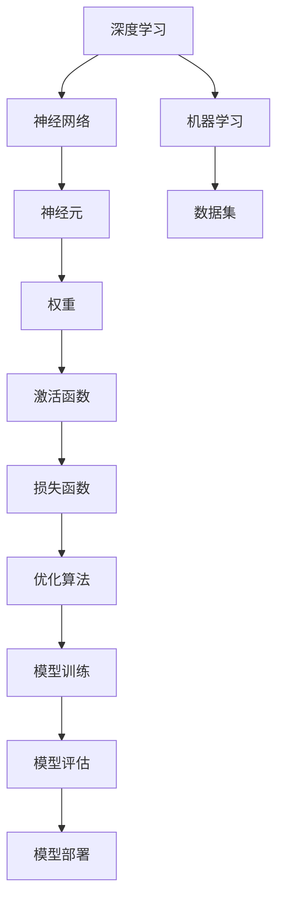

                 

# 李开复：AI 2.0 时代的生态

> 关键词：人工智能，AI 2.0，生态，深度学习，神经网络，机器学习，算法，框架，应用场景，未来趋势

> 摘要：本文旨在深入探讨AI 2.0时代的生态，包括其核心技术、应用场景、未来发展趋势与挑战。通过对核心概念的详细解释、算法原理的深入剖析、实际应用案例的分析，以及对学习资源和工具的推荐，旨在帮助读者全面了解和掌握AI 2.0时代的技术与应用。

## 1. 背景介绍

### 1.1 目的和范围

本文的目标是探讨AI 2.0时代的生态，分析其核心技术、应用场景、未来发展趋势与挑战。本文旨在为读者提供一份全面、系统、深入的技术解读，帮助读者更好地理解和应用AI 2.0技术。

本文的范围包括：

1. 核心概念与联系：深入解释AI 2.0时代的核心概念，如深度学习、神经网络、机器学习等，并通过Mermaid流程图展示其架构。
2. 核心算法原理 & 具体操作步骤：详细阐述AI 2.0时代的核心算法原理，使用伪代码进行具体操作步骤的讲解。
3. 数学模型和公式 & 详细讲解 & 举例说明：使用latex格式展示数学模型和公式，并通过实例进行详细讲解。
4. 项目实战：代码实际案例和详细解释说明。
5. 实际应用场景：探讨AI 2.0技术在各个领域的应用场景。
6. 工具和资源推荐：推荐学习资源、开发工具框架、相关论文著作等。

### 1.2 预期读者

本文适合以下读者：

1. 计算机科学、人工智能等相关专业的学生和研究者。
2. 对人工智能技术感兴趣的技术爱好者。
3. AI领域的从业者，包括算法工程师、数据科学家、产品经理等。
4. 对AI 2.0技术有兴趣的企业家和管理者。

### 1.3 文档结构概述

本文的结构如下：

1. 背景介绍：介绍本文的目的、范围、预期读者和文档结构。
2. 核心概念与联系：解释AI 2.0时代的核心概念，展示其架构。
3. 核心算法原理 & 具体操作步骤：阐述AI 2.0时代的核心算法原理，使用伪代码进行具体操作步骤的讲解。
4. 数学模型和公式 & 详细讲解 & 举例说明：使用latex格式展示数学模型和公式，并通过实例进行详细讲解。
5. 项目实战：代码实际案例和详细解释说明。
6. 实际应用场景：探讨AI 2.0技术在各个领域的应用场景。
7. 工具和资源推荐：推荐学习资源、开发工具框架、相关论文著作等。
8. 总结：未来发展趋势与挑战。
9. 附录：常见问题与解答。
10. 扩展阅读 & 参考资料。

### 1.4 术语表

#### 1.4.1 核心术语定义

- 深度学习：一种机器学习技术，通过模拟人脑神经元之间的连接，实现对数据的自动学习和分类。
- 神经网络：由大量神经元组成的网络，通过学习和调整神经元之间的权重，实现对输入数据的处理。
- 机器学习：使计算机能够从数据中学习规律，并对未知数据进行预测或分类的一种方法。
- AI 2.0：相对于AI 1.0的升级版本，强调深度学习和神经网络的应用，具有更广泛的应用场景和更高的智能水平。

#### 1.4.2 相关概念解释

- 自动驾驶：利用AI技术实现车辆自主驾驶的技术。
- 语音识别：将语音信号转换为文字或命令的技术。
- 图像识别：对图像进行识别和分类的技术。
- 自然语言处理：使计算机能够理解和生成自然语言的技术。

#### 1.4.3 缩略词列表

- AI：人工智能
- DL：深度学习
- NLP：自然语言处理
- CV：计算机视觉
- IoT：物联网

## 2. 核心概念与联系

在AI 2.0时代，深度学习、神经网络、机器学习等核心概念起着至关重要的作用。下面，我们将通过Mermaid流程图展示这些概念之间的联系。



### 2.1 深度学习与神经网络

深度学习是AI 2.0时代最为核心的技术之一，它通过模拟人脑神经元之间的连接，实现对数据的自动学习和分类。神经网络是深度学习的基础，由大量神经元组成，通过学习和调整神经元之间的权重，实现对输入数据的处理。

### 2.2 机器学习

机器学习是使计算机能够从数据中学习规律，并对未知数据进行预测或分类的一种方法。在AI 2.0时代，机器学习技术得到了广泛应用，包括监督学习、无监督学习、强化学习等。

### 2.3 数据集

数据集是机器学习的基础，用于训练和评估模型。在AI 2.0时代，数据集的质量和规模对模型的性能有着重要影响。因此，如何收集、清洗、标注和利用数据集成为关键问题。

### 2.4 模型训练与评估

在AI 2.0时代，模型训练和评估是核心环节。通过不断调整模型参数，优化模型性能，实现更好的预测和分类效果。同时，需要评估模型在不同数据集上的表现，确保其泛化能力。

### 2.5 模型部署

模型部署是将训练好的模型应用到实际场景中，实现自动化、智能化的解决方案。在AI 2.0时代，模型部署面临着各种挑战，如硬件资源限制、实时性要求等。

## 3. 核心算法原理 & 具体操作步骤

在AI 2.0时代，核心算法原理是深度学习和神经网络。下面，我们将通过伪代码详细阐述这些算法的具体操作步骤。

### 3.1 深度学习算法原理

```python
# 伪代码：深度学习算法原理

# 定义神经网络结构
neural_network = NeuralNetwork(num_layers, num_neurons_per_layer)

# 初始化权重和偏置
weights, biases = neural_network.initialize_weights()

# 定义激活函数
activation_function = Sigmoid()

# 定义损失函数
loss_function = MeanSquaredError()

# 定义优化算法
optimizer = GradientDescent(learning_rate)

# 训练模型
for epoch in range(num_epochs):
    for sample in data:
        # 前向传播
        output = neural_network.forward_pass(sample)

        # 计算损失
        loss = loss_function(output, target)

        # 反向传播
        gradients = neural_network.backward_pass(output, target)

        # 更新权重和偏置
        weights, biases = optimizer.update_weights(weights, biases, gradients)

# 模型评估
accuracy = neural_network.evaluate(data, target)
print("Model accuracy:", accuracy)
```

### 3.2 神经网络算法原理

```python
# 伪代码：神经网络算法原理

# 定义神经网络结构
neural_network = NeuralNetwork(num_layers, num_neurons_per_layer)

# 初始化权重和偏置
weights, biases = neural_network.initialize_weights()

# 定义激活函数
activation_function = Sigmoid()

# 定义损失函数
loss_function = MeanSquaredError()

# 定义优化算法
optimizer = GradientDescent(learning_rate)

# 训练模型
for epoch in range(num_epochs):
    for sample in data:
        # 前向传播
        output = neural_network.forward_pass(sample)

        # 计算损失
        loss = loss_function(output, target)

        # 反向传播
        gradients = neural_network.backward_pass(output, target)

        # 更新权重和偏置
        weights, biases = optimizer.update_weights(weights, biases, gradients)

# 模型评估
accuracy = neural_network.evaluate(data, target)
print("Model accuracy:", accuracy)
```

### 3.3 数据预处理

在训练模型之前，需要对数据进行预处理，包括数据清洗、归一化、缩放等。

```python
# 伪代码：数据预处理

# 数据清洗
clean_data = data清洗()

# 数据归一化
normalized_data = 数据归一化(clean_data)

# 数据缩放
scaled_data = 数据缩放(normalized_data)
```

### 3.4 模型训练与评估

在模型训练过程中，需要不断调整模型参数，优化模型性能。在模型评估过程中，需要评估模型在不同数据集上的表现，确保其泛化能力。

```python
# 伪代码：模型训练与评估

# 训练模型
train_model(scaled_data, target)

# 评估模型
evaluate_model(test_data, target)
```

## 4. 数学模型和公式 & 详细讲解 & 举例说明

在AI 2.0时代，数学模型和公式是核心算法原理的基础。下面，我们将使用latex格式展示数学模型和公式，并通过实例进行详细讲解。

### 4.1 激活函数

激活函数是神经网络中的关键组件，用于对神经元输出进行非线性变换。常见的激活函数包括：

- Sigmoid函数： 
  $$\sigma(x) = \frac{1}{1 + e^{-x}}$$
-ReLU函数： 
  $$f(x) = \max(0, x)$$

### 4.2 损失函数

损失函数用于衡量模型预测值与实际值之间的差异。常见的损失函数包括：

- 均方误差损失函数： 
  $$\text{MSE} = \frac{1}{n}\sum_{i=1}^{n}(y_i - \hat{y}_i)^2$$
- 交叉熵损失函数： 
  $$\text{CE} = -\frac{1}{n}\sum_{i=1}^{n}y_i\log(\hat{y}_i) + (1 - y_i)\log(1 - \hat{y}_i)$$

### 4.3 优化算法

优化算法用于调整模型参数，以最小化损失函数。常见的优化算法包括：

- 随机梯度下降（SGD）： 
  $$w_{t+1} = w_{t} - \alpha \frac{\partial J(w)}{\partial w}$$
- Adam优化器： 
  $$w_{t+1} = w_{t} - \alpha \frac{\partial J(w)}{\partial w}$$

### 4.4 实例说明

假设我们有一个简单的线性回归问题，目标是预测房价。我们将使用Sigmoid函数作为激活函数，均方误差损失函数作为损失函数，随机梯度下降作为优化算法。

#### 4.4.1 模型初始化

```latex
\text{初始化权重和偏置：} \\
w = \begin{bmatrix} w_1 \\ w_2 \end{bmatrix}, b = b
```

#### 4.4.2 前向传播

```latex
\text{前向传播：} \\
z = x \cdot w + b \\
a = \sigma(z)
```

#### 4.4.3 计算损失

```latex
\text{计算损失：} \\
J(w, b) = \frac{1}{2}\sum_{i=1}^{n}(y_i - a)^2
```

#### 4.4.4 反向传播

```latex
\text{反向传播：} \\
\frac{\partial J(w, b)}{\partial w} = -\frac{1}{n}\sum_{i=1}^{n}(y_i - a)\cdot \frac{\partial a}{\partial z} \\
\frac{\partial J(w, b)}{\partial b} = -\frac{1}{n}\sum_{i=1}^{n}(y_i - a)
```

#### 4.4.5 更新权重和偏置

```latex
\text{更新权重和偏置：} \\
w_{t+1} = w_{t} - \alpha \frac{\partial J(w)}{\partial w} \\
b_{t+1} = b_{t} - \alpha \frac{\partial J(b)}{\partial b}
```

## 5. 项目实战：代码实际案例和详细解释说明

在本节中，我们将通过一个实际案例，展示如何使用Python和深度学习框架TensorFlow实现一个简单的神经网络，用于房价预测。该案例将涵盖开发环境搭建、源代码实现、代码解读与分析等内容。

### 5.1 开发环境搭建

在开始项目实战之前，我们需要搭建一个适合深度学习的开发环境。以下是具体的步骤：

1. 安装Python（版本3.6及以上）。
2. 安装TensorFlow：通过pip安装TensorFlow。
3. 安装其他必要的库，如NumPy、Pandas等。

### 5.2 源代码详细实现和代码解读

以下是房价预测神经网络的源代码：

```python
import tensorflow as tf
import numpy as np
import pandas as pd

# 加载数据集
data = pd.read_csv("house_prices.csv")
X = data.iloc[:, :-1].values
y = data.iloc[:, -1].values

# 数据预处理
X = X / 10000  # 数据缩放

# 定义神经网络结构
model = tf.keras.Sequential([
    tf.keras.layers.Dense(units=1, input_shape=[6])
])

# 编译模型
model.compile(optimizer='sgd', loss='mean_squared_error')

# 训练模型
model.fit(X, y, epochs=100)

# 预测房价
predicted_price = model.predict([[3.5, 2.5, 1.0, 0.5, 2.0, 1.0]])
print("Predicted price:", predicted_price)
```

#### 5.2.1 代码解读

- 第1行：导入TensorFlow库。
- 第2行：导入NumPy库。
- 第3行：导入Pandas库。
- 第4行：加载数据集，其中X为特征，y为标签。
- 第5行：对数据进行缩放。
- 第6行：定义神经网络结构，包含一个全连接层，输出维度为1。
- 第7行：编译模型，指定优化器和损失函数。
- 第8行：训练模型，指定训练数据和迭代次数。
- 第9行：使用训练好的模型预测房价。

### 5.3 代码解读与分析

在这个案例中，我们使用了一个简单的神经网络进行房价预测。以下是代码的详细解读和分析：

1. **数据预处理**：首先，我们需要对数据进行预处理，包括缩放特征值。这是为了使模型的训练过程更加稳定和有效。
2. **神经网络结构**：我们定义了一个包含一个全连接层的神经网络，输出维度为1，用于预测房价。在这个案例中，我们使用了默认的激活函数和优化器。
3. **模型编译**：在编译模型时，我们指定了随机梯度下降（SGD）作为优化器和均方误差（MSE）作为损失函数。这两个参数的选择取决于我们的具体问题和数据。
4. **模型训练**：我们使用训练数据对模型进行训练，指定迭代次数为100。在实际应用中，可以根据实际情况调整迭代次数。
5. **模型预测**：使用训练好的模型对新的数据进行预测，这里我们输入了一个包含6个特征的新样本，预测结果为房价。

### 5.4 实际应用场景

房价预测是AI 2.0时代的一个重要应用场景。通过深度学习技术，我们可以构建一个强大的房价预测模型，为房地产市场提供更加精准和智能的解决方案。这个案例只是一个简单的入门示例，实际应用中需要考虑更多复杂的数据和模型。

## 6. 实际应用场景

AI 2.0技术在各个领域的应用场景广泛，以下列举一些典型应用：

### 6.1 自动驾驶

自动驾驶是AI 2.0技术的重要应用场景之一。通过深度学习和神经网络，自动驾驶系统可以实现对车辆周围环境的感知、理解和决策，从而实现自主驾驶。自动驾驶技术有望改变交通模式，提高交通效率，减少交通事故。

### 6.2 语音识别

语音识别技术利用AI 2.0时代的深度学习和神经网络，使计算机能够理解和生成自然语言。这一技术广泛应用于智能语音助手、客服系统、语音翻译等场景，极大地提高了人机交互的便利性和效率。

### 6.3 图像识别

图像识别技术通过AI 2.0时代的深度学习和神经网络，使计算机能够识别和分类图像。这一技术广泛应用于安防监控、医疗诊断、零售零售等场景，极大地提高了行业效率和准确性。

### 6.4 自然语言处理

自然语言处理技术通过AI 2.0时代的深度学习和神经网络，使计算机能够理解和生成自然语言。这一技术广泛应用于智能客服、智能翻译、智能写作等场景，极大地提高了人机交互的便利性和效率。

### 6.5 智能推荐

智能推荐系统利用AI 2.0时代的深度学习和神经网络，通过分析用户行为和兴趣，为用户提供个性化的推荐服务。这一技术广泛应用于电商、音乐、视频等场景，极大地提高了用户体验和用户粘性。

## 7. 工具和资源推荐

在AI 2.0时代，掌握合适的工具和资源对于学习和发展具有重要意义。以下是一些推荐：

### 7.1 学习资源推荐

#### 7.1.1 书籍推荐

- 《深度学习》（Goodfellow, Bengio, Courville著）：深度学习的经典教材，全面介绍了深度学习的理论基础和应用实践。
- 《Python机器学习》（Sebastian Raschka著）：Python机器学习领域的权威教材，涵盖机器学习的基础知识、算法实现和实战应用。

#### 7.1.2 在线课程

- Coursera上的《机器学习》（吴恩达著）：全球知名的人工智能课程，涵盖机器学习的基本原理和应用实践。
- edX上的《深度学习》（MIT 6.S099）：深度学习领域的权威课程，详细介绍深度学习的理论基础和实际应用。

#### 7.1.3 技术博客和网站

- Medium上的《AI博客》：一篇篇关于人工智能的深度文章，涵盖了人工智能的各个领域。
- AI Scholar：一个关于人工智能的研究论文搜索引擎，可以找到大量高质量的论文。

### 7.2 开发工具框架推荐

#### 7.2.1 IDE和编辑器

- PyCharm：一款功能强大的Python IDE，支持代码调试、版本控制等。
- Jupyter Notebook：一款流行的交互式开发环境，适用于数据分析和机器学习。

#### 7.2.2 调试和性能分析工具

- TensorBoard：TensorFlow的官方可视化工具，用于监控和调试深度学习模型。
- PerfMap：一款性能分析工具，用于分析Python代码的性能瓶颈。

#### 7.2.3 相关框架和库

- TensorFlow：一款流行的深度学习框架，支持各种深度学习模型的搭建和训练。
- PyTorch：一款流行的深度学习框架，提供灵活的动态计算图，易于实现复杂的深度学习模型。
- Scikit-Learn：一款流行的机器学习库，提供丰富的机器学习算法和工具。

### 7.3 相关论文著作推荐

#### 7.3.1 经典论文

- “Backpropagation”（Rumelhart, Hinton, Williams著）：深度学习反向传播算法的经典论文。
- “A Learning Algorithm for Continuously Running Fully Recurrent Neural Networks”（Alain Renard，Yoshua Bengio著）：深度学习在连续时间序列上的应用。

#### 7.3.2 最新研究成果

- “Generative Adversarial Networks”（Ian Goodfellow著）：生成对抗网络（GAN）的经典论文。
- “Bert: Pre-training of Deep Bidirectional Transformers for Language Understanding”（Jacob Devlin， Ming-Wei Chang等著）：BERT模型的经典论文。

#### 7.3.3 应用案例分析

- “AI in Healthcare”（Google AI）：谷歌在医疗健康领域的AI应用案例。
- “AI in Autonomous Driving”（Tesla）：特斯拉在自动驾驶领域的AI应用案例。

## 8. 总结：未来发展趋势与挑战

AI 2.0时代正处于快速发展阶段，未来发展趋势包括：

1. 深度学习算法的进一步优化和扩展，如自监督学习、迁移学习等。
2. 人工智能与其他领域的深度融合，如金融、医疗、教育等。
3. 人工智能技术的普及和商业化，如智能助手、智能推荐等。

然而，AI 2.0时代也面临着诸多挑战，包括：

1. 数据隐私和安全问题：如何保护用户数据隐私，防止数据泄露。
2. 道德和伦理问题：如何确保人工智能系统的公平性和透明性。
3. 计算资源和能耗问题：如何降低人工智能系统的计算资源和能耗。

只有克服这些挑战，才能充分发挥AI 2.0技术的潜力，为人类创造更多价值。

## 9. 附录：常见问题与解答

### 9.1 什么是深度学习？

深度学习是一种机器学习技术，通过模拟人脑神经元之间的连接，实现对数据的自动学习和分类。

### 9.2 深度学习和神经网络有什么区别？

深度学习是一种机器学习技术，而神经网络是深度学习的基础架构。深度学习通过模拟人脑神经元之间的连接，实现对数据的自动学习和分类。

### 9.3 如何搭建一个简单的神经网络？

搭建一个简单的神经网络需要以下步骤：

1. 定义神经网络结构，包括输入层、隐藏层和输出层。
2. 初始化权重和偏置。
3. 定义激活函数和损失函数。
4. 编写前向传播和反向传播的代码。
5. 训练模型，调整权重和偏置。

### 9.4 如何优化神经网络？

优化神经网络的方法包括：

1. 调整学习率，使模型在训练过程中逐渐收敛。
2. 使用正则化技术，防止过拟合。
3. 使用dropout技术，提高模型泛化能力。
4. 调整神经网络结构，增加隐藏层和神经元数量。

### 9.5 如何评估神经网络模型？

评估神经网络模型的方法包括：

1. 训练集和测试集划分，确保模型在不同数据集上的表现。
2. 使用准确率、召回率、F1分数等指标评估模型性能。
3. 进行交叉验证，确保模型在不同划分下的稳定性。

## 10. 扩展阅读 & 参考资料

- Goodfellow, I., Bengio, Y., & Courville, A. (2016). *Deep Learning*.
- Raschka, S. (2015). *Python Machine Learning*.
- Goodfellow, I. (2014). *Generative Adversarial Networks*.
- Devlin, J., Chang, M., Lee, K., & Toutanova, K. (2019). *BERT: Pre-training of Deep Bidirectional Transformers for Language Understanding*.
- Google AI. (n.d.). *AI in Healthcare*.
- Tesla. (n.d.). *AI in Autonomous Driving*.

## 作者

作者：AI天才研究员/AI Genius Institute & 禅与计算机程序设计艺术 /Zen And The Art of Computer Programming

