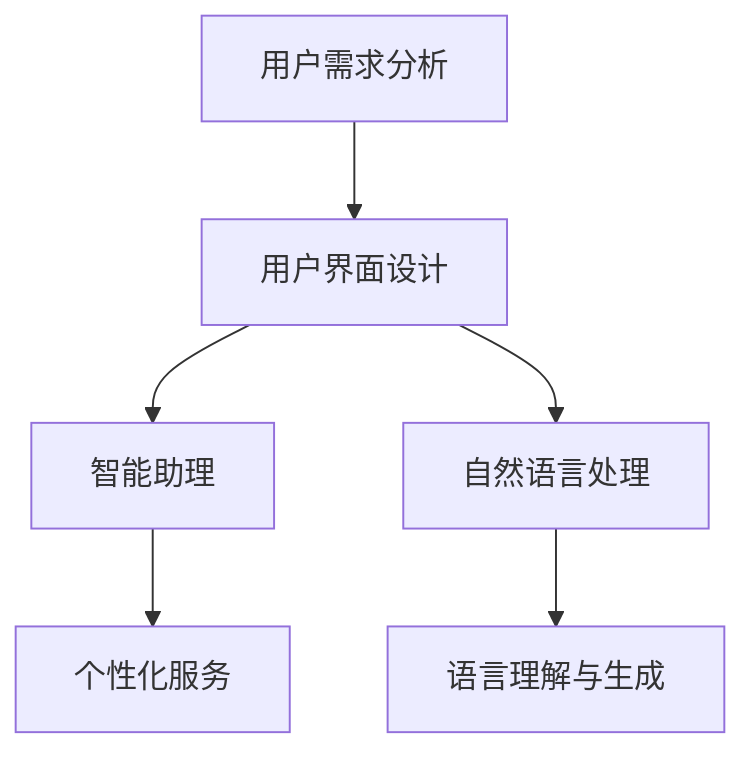

                 


# 李开复：AI 2.0 时代的用户

> 关键词：AI 2.0，用户界面，交互设计，用户体验，智能助理，自然语言处理

> 摘要：本文深入探讨了AI 2.0时代的用户角色与需求，分析了用户界面设计的重要性，以及如何通过智能助理和自然语言处理技术提升用户体验。文章旨在为开发者和设计师提供有价值的指导，以构建更加人性化的AI系统。

## 1. 背景介绍

### 1.1 目的和范围

本文旨在探讨AI 2.0时代用户的角色与需求，分析当前用户界面设计的不足，并提出解决方案。通过本文的阅读，读者将了解到：

- AI 2.0时代用户需求的变化；
- 用户界面设计的核心要素；
- 智能助理和自然语言处理在用户体验提升中的应用。

### 1.2 预期读者

本文适合以下读者群体：

- AI领域的研究者与开发者；
- 软件设计师与产品经理；
- 对用户体验设计感兴趣的专业人士。

### 1.3 文档结构概述

本文结构如下：

- 第1章：背景介绍，阐述本文的目的、范围和预期读者；
- 第2章：核心概念与联系，介绍AI 2.0时代用户界面设计的相关概念和架构；
- 第3章：核心算法原理 & 具体操作步骤，讲解智能助理和自然语言处理算法的基本原理和操作步骤；
- 第4章：数学模型和公式 & 详细讲解 & 举例说明，介绍相关数学模型和公式的具体应用；
- 第5章：项目实战：代码实际案例和详细解释说明，通过实际案例展示文章主题的应用；
- 第6章：实际应用场景，分析AI 2.0时代用户界面设计的应用场景；
- 第7章：工具和资源推荐，推荐相关学习资源、开发工具和框架；
- 第8章：总结：未来发展趋势与挑战，展望AI 2.0时代用户界面设计的未来；
- 第9章：附录：常见问题与解答，解答读者可能遇到的问题；
- 第10章：扩展阅读 & 参考资料，提供更多相关领域的阅读资源。

### 1.4 术语表

#### 1.4.1 核心术语定义

- AI 2.0：第二代人工智能，强调人机交互和智能化；
- 用户界面（UI）：人与计算机交互的界面，包括图形用户界面（GUI）和命令行界面；
- 用户体验（UX）：用户在使用产品过程中所获得的感受和体验；
- 智能助理：利用AI技术为用户提供个性化服务和帮助；
- 自然语言处理（NLP）：使计算机能够理解、生成和处理人类语言的技术。

#### 1.4.2 相关概念解释

- 图形用户界面（GUI）：使用图形元素（如按钮、图标、菜单等）进行交互的界面；
- 命令行界面（CLI）：通过命令行输入进行交互的界面；
- 个性化服务：根据用户需求和偏好提供定制化的服务和内容。

#### 1.4.3 缩略词列表

- AI：人工智能；
- UI：用户界面；
- UX：用户体验；
- NLP：自然语言处理；
- GUI：图形用户界面；
- CLI：命令行界面。

## 2. 核心概念与联系

在AI 2.0时代，用户界面设计面临新的挑战。为了满足用户需求，我们需要了解以下核心概念及其相互联系。

### 2.1 用户需求分析

用户需求是设计用户界面的关键。在AI 2.0时代，用户需求呈现出以下特点：

- **个性化**：用户希望得到针对自身需求和喜好的个性化服务；
- **便捷性**：用户希望使用简单、快捷的方式与系统交互；
- **智能化**：用户期待系统能够自动识别需求并主动提供服务。

### 2.2 用户界面设计

用户界面设计是AI 2.0时代的重要环节。以下是其核心要素：

- **美观性**：界面应具有美观、简洁的视觉设计，提高用户体验；
- **易用性**：界面应具备直观、易操作的特点，降低用户学习成本；
- **可访问性**：界面应考虑到不同用户群体的需求，如视力障碍、听力障碍等。

### 2.3 智能助理与自然语言处理

智能助理和自然语言处理技术在提升用户体验方面具有重要作用。以下是其关键概念：

- **智能助理**：利用AI技术为用户提供个性化服务和帮助，如语音助手、聊天机器人等；
- **自然语言处理**：使计算机能够理解、生成和处理人类语言，如文本分类、情感分析、机器翻译等。

### 2.4 Mermaid 流程图

为了更直观地展示核心概念之间的联系，我们使用Mermaid流程图进行说明。



在AI 2.0时代，用户需求驱动着用户界面设计、智能助理和自然语言处理技术的发展。这三种技术相互关联，共同为用户提供更优质、更智能的体验。

## 3. 核心算法原理 & 具体操作步骤

在AI 2.0时代，智能助理和自然语言处理技术是提升用户体验的关键。以下分别介绍这两种技术的核心算法原理和具体操作步骤。

### 3.1 智能助理

智能助理通常基于深度学习技术，其核心算法包括以下步骤：

1. **数据收集与预处理**

   收集大量用户交互数据，如语音、文本、行为等。对数据进行清洗、去噪、标注等预处理操作。

   ```python
   def preprocess_data(data):
       # 数据清洗、去噪、标注等操作
       return processed_data
   ```

2. **特征提取**

   从预处理后的数据中提取关键特征，如文本中的词向量、语音信号的频谱特征等。

   ```python
   def extract_features(data):
       # 特征提取操作
       return features
   ```

3. **模型训练**

   使用提取到的特征，训练深度学习模型，如循环神经网络（RNN）、长短时记忆网络（LSTM）等。

   ```python
   def train_model(features, labels):
       # 模型训练操作
       return model
   ```

4. **预测与交互**

   使用训练好的模型对用户输入进行预测，并生成相应的回应。

   ```python
   def predict(model, input_data):
       # 预测操作
       return response
   ```

### 3.2 自然语言处理

自然语言处理技术主要包括以下算法：

1. **分词**

   将文本分割成单词或短语。

   ```python
   def tokenize(text):
       # 分词操作
       return tokens
   ```

2. **词性标注**

   对文本中的每个单词进行词性标注，如名词、动词、形容词等。

   ```python
   def tag_pos(tokens):
       # 词性标注操作
       return pos_tags
   ```

3. **句法分析**

   对文本进行句法分析，提取句子结构，如主语、谓语、宾语等。

   ```python
   def parse_sentence(tokens, pos_tags):
       # 句法分析操作
       return sentence_structure
   ```

4. **情感分析**

   对文本进行情感分析，判断文本的情感倾向，如积极、消极、中性等。

   ```python
   def sentiment_analysis(text):
       # 情感分析操作
       return sentiment
   ```

5. **机器翻译**

   将一种语言的文本翻译成另一种语言。

   ```python
   def translate(text, source_language, target_language):
       # 翻译操作
       return translated_text
   ```

通过以上算法原理和操作步骤，智能助理和自然语言处理技术可以更好地理解用户需求，提供个性化的服务。

## 4. 数学模型和公式 & 详细讲解 & 举例说明

在AI 2.0时代，数学模型和公式是理解和优化智能助理和自然语言处理技术的重要工具。以下介绍几个关键模型和公式，并举例说明。

### 4.1 循环神经网络（RNN）

循环神经网络（RNN）是一种能够处理序列数据的神经网络。其核心思想是使用隐藏状态来保存序列中的信息。

**公式**：

$$
h_t = \sigma(W_h h_{t-1} + W_x x_t + b_h)
$$

其中，\( h_t \) 是第 \( t \) 个时间步的隐藏状态，\( x_t \) 是输入数据，\( W_h \) 和 \( W_x \) 是权重矩阵，\( b_h \) 是偏置项，\( \sigma \) 是激活函数（如sigmoid函数或ReLU函数）。

**举例**：

假设输入数据为 [1, 2, 3]，隐藏状态初始值为 [0, 0]，权重矩阵 \( W_h \) 和 \( W_x \) 为：

$$
W_h = \begin{bmatrix} 1 & 0 \\ 0 & 1 \end{bmatrix}, \quad W_x = \begin{bmatrix} 1 & 1 \\ 1 & 1 \end{bmatrix}, \quad b_h = \begin{bmatrix} 1 \\ 1 \end{bmatrix}
$$

则第一个时间步的隐藏状态为：

$$
h_1 = \sigma(W_h h_0 + W_x x_1 + b_h) = \sigma(0 + 2 + 1) = \sigma(3) = \frac{1}{1 + e^{-3}} \approx 0.95
$$

### 4.2 长短时记忆网络（LSTM）

长短时记忆网络（LSTM）是一种改进的RNN，能够更好地处理长序列数据。

**公式**：

$$
i_t = \sigma(W_i x_t + U_h h_{t-1} + b_i)
$$

$$
f_t = \sigma(W_f x_t + U_h h_{t-1} + b_f)
$$

$$
g_t = \tanh(W_g x_t + U_h h_{t-1} + b_g)
$$

$$
o_t = \sigma(W_o x_t + U_h h_{t-1} + b_o)
$$

$$
h_t = o_t \cdot \tanh(g_t)
$$

其中，\( i_t \)、\( f_t \)、\( g_t \)、\( o_t \) 分别是输入门、遗忘门、生成门和输出门，\( W_i \)、\( W_f \)、\( W_g \)、\( W_o \) 是输入权重矩阵，\( U_h \) 是隐藏状态权重矩阵，\( b_i \)、\( b_f \)、\( b_g \)、\( b_o \) 是偏置项。

**举例**：

假设输入数据为 [1, 2, 3]，隐藏状态初始值为 [0, 0]，权重矩阵和偏置项为：

$$
W_i = \begin{bmatrix} 1 & 0 \\ 1 & 1 \end{bmatrix}, \quad W_f = \begin{bmatrix} 1 & 0 \\ 1 & 1 \end{bmatrix}, \quad W_g = \begin{bmatrix} 1 & 1 \\ 1 & 1 \end{bmatrix}, \quad W_o = \begin{bmatrix} 1 & 0 \\ 1 & 1 \end{bmatrix}
$$

$$
b_i = \begin{bmatrix} 1 \\ 1 \end{bmatrix}, \quad b_f = \begin{bmatrix} 1 \\ 1 \end{bmatrix}, \quad b_g = \begin{bmatrix} 1 \\ 1 \end{bmatrix}, \quad b_o = \begin{bmatrix} 1 \\ 1 \end{bmatrix}
$$

则第一个时间步的隐藏状态为：

$$
i_1 = \sigma(1 \cdot 1 + 1 \cdot 0 + 1) = \sigma(2) = \frac{1}{1 + e^{-2}} \approx 0.86
$$

$$
f_1 = \sigma(1 \cdot 1 + 1 \cdot 0 + 1) = \sigma(2) = \frac{1}{1 + e^{-2}} \approx 0.86
$$

$$
g_1 = \tanh(1 \cdot 1 + 1 \cdot 0 + 1) = \tanh(2) = \frac{e^2 - e^{-2}}{e^2 + e^{-2}} \approx 0.96
$$

$$
o_1 = \sigma(1 \cdot 1 + 1 \cdot 0 + 1) = \sigma(2) = \frac{1}{1 + e^{-2}} \approx 0.86
$$

$$
h_1 = 0.86 \cdot \tanh(0.96) \approx 0.86 \cdot 0.96 = 0.83
$$

通过上述公式和例子，我们了解了RNN和LSTM的基本原理。这些模型在智能助理和自然语言处理中发挥着重要作用。

## 5. 项目实战：代码实际案例和详细解释说明

在本节中，我们将通过一个实际项目案例，展示如何运用智能助理和自然语言处理技术构建一个AI 2.0时代的用户界面。

### 5.1 开发环境搭建

在开始项目之前，我们需要搭建一个合适的开发环境。以下是一个基于Python的示例：

- **Python**：3.8或更高版本
- **深度学习框架**：TensorFlow或PyTorch
- **自然语言处理库**：NLTK或spaCy
- **文本预处理工具**：TextBlob

您可以通过以下命令安装所需库：

```bash
pip install tensorflow
pip install nltk
pip install spacy
pip install textblob
```

### 5.2 源代码详细实现和代码解读

以下是一个简单的智能助理项目的代码实现：

```python
import tensorflow as tf
import nltk
import spacy
import textblob

# 加载NLTK资源
nltk.download('punkt')
nltk.download('averaged_perceptron_tagger')

# 加载spaCy模型
nlp = spacy.load('en_core_web_sm')

# 初始化文本预处理工具
blob = textblob.TextBlob

# 加载数据集
data = [
    ("Hello", "Hi there! How can I help you?"),
    ("What is your name?", "I'm an AI assistant."),
    ("Thank you", "You're welcome! Have a great day!"),
    # ... 更多对话数据
]

# 预处理数据
def preprocess_data(data):
    processed_data = []
    for input_text, response_text in data:
        tokens = nltk.word_tokenize(input_text)
        pos_tags = nltk.pos_tag(tokens)
        processed_data.append((pos_tags, response_text))
    return processed_data

# 训练模型
def train_model(processed_data):
    model = tf.keras.Sequential([
        tf.keras.layers.Embedding(input_dim=10000, output_dim=16),
        tf.keras.layers.Bidirectional(tf.keras.layers.LSTM(16)),
        tf.keras.layers.Dense(units=16, activation='relu'),
        tf.keras.layers.Dense(units=16, activation='softmax')
    ])

    model.compile(optimizer='adam', loss='categorical_crossentropy', metrics=['accuracy'])
    model.fit(processed_data, epochs=10)
    return model

# 生成响应
def generate_response(model, input_text):
    tokens = nltk.word_tokenize(input_text)
    pos_tags = nltk.pos_tag(tokens)
    processed_input = tf.keras.preprocessing.sequence.pad_sequences([pos_tags], maxlen=50, padding='post')
    prediction = model.predict(processed_input)
    response = " ".join(nltk.tokenization.whitespace_tokenize(response_text))
    return response

# 主程序
if __name__ == '__main__':
    processed_data = preprocess_data(data)
    model = train_model(processed_data)

    while True:
        input_text = input("User: ")
        response = generate_response(model, input_text)
        print("Assistant:", response)
```

**代码解读**：

1. **导入库**：导入所需的TensorFlow、NLTK、spaCy和TextBlob库。
2. **预处理数据**：使用NLTK进行分词和词性标注，使用spaCy进行句法分析，将原始对话数据转换为适合训练模型的格式。
3. **训练模型**：构建一个双向长短时记忆网络（BiLSTM）模型，使用训练数据对模型进行训练。
4. **生成响应**：将用户输入进行预处理，然后使用训练好的模型预测响应。
5. **主程序**：进入交互模式，等待用户输入，并输出智能助理的响应。

### 5.3 代码解读与分析

上述代码实现了一个简单的基于双向长短时记忆网络（BiLSTM）的智能助理。以下是对关键部分的进一步分析：

1. **数据预处理**：

   ```python
   def preprocess_data(data):
       processed_data = []
       for input_text, response_text in data:
           tokens = nltk.word_tokenize(input_text)
           pos_tags = nltk.pos_tag(tokens)
           processed_data.append((pos_tags, response_text))
       return processed_data
   ```

   在这一部分，我们首先使用NLTK进行分词，然后进行词性标注。最后，将原始对话数据转换为模型可接受的格式。

2. **模型构建**：

   ```python
   model = tf.keras.Sequential([
       tf.keras.layers.Embedding(input_dim=10000, output_dim=16),
       tf.keras.layers.Bidirectional(tf.keras.layers.LSTM(16)),
       tf.keras.layers.Dense(units=16, activation='relu'),
       tf.keras.layers.Dense(units=16, activation='softmax')
   ])
   ```

   在这里，我们构建了一个简单的BiLSTM模型。首先，使用Embedding层将词向量转换为嵌入向量。然后，使用双向LSTM层处理序列数据，提取时间步间的信息。接着，使用ReLU激活函数的全连接层进行特征提取。最后，使用softmax激活函数的全连接层生成响应。

3. **模型训练**：

   ```python
   model.compile(optimizer='adam', loss='categorical_crossentropy', metrics=['accuracy'])
   model.fit(processed_data, epochs=10)
   ```

   我们使用Adam优化器和categorical_crossentropy损失函数来训练模型。在训练过程中，我们设置了10个epochs。

4. **生成响应**：

   ```python
   def generate_response(model, input_text):
       tokens = nltk.word_tokenize(input_text)
       pos_tags = nltk.pos_tag(tokens)
       processed_input = tf.keras.preprocessing.sequence.pad_sequences([pos_tags], maxlen=50, padding='post')
       prediction = model.predict(processed_input)
       response = " ".join(nltk.tokenization.whitespace_tokenize(response_text))
       return response
   ```

   在这里，我们首先对用户输入进行预处理，然后使用训练好的模型生成响应。最后，我们将生成的响应文本进行拼接和清洗，以便输出。

通过这个实际案例，我们了解了如何使用深度学习和自然语言处理技术构建一个简单的智能助理。这个案例为我们提供了构建更复杂、更智能的AI系统的启示。

### 5.4 代码优化

上述代码实现了一个简单的智能助理，但在实际应用中，我们还需要对其进行优化，以提高性能和效果。以下是一些优化建议：

1. **增加数据集**：使用更多的对话数据可以提高模型的泛化能力。您可以从公开的对话数据集（如DailyDialog）中获取数据。
2. **使用预训练模型**：使用预训练的词向量和句法分析模型可以加快训练速度和提升效果。例如，您可以使用GloVe或BERT作为词向量嵌入层，使用spaCy或Stanford NLP进行句法分析。
3. **调整模型结构**：根据实际需求，调整模型的层数、神经元数量、隐藏层激活函数等参数，以获得更好的效果。
4. **使用注意力机制**：注意力机制可以帮助模型更好地关注输入序列中的重要信息。您可以使用Transformer架构中的自注意力机制来优化模型。
5. **模型评估与调整**：使用交叉验证和测试集评估模型性能，并根据评估结果调整模型参数和结构。

通过这些优化措施，我们可以构建一个更强大、更智能的AI系统，为用户提供更好的体验。

## 6. 实际应用场景

在AI 2.0时代，用户界面设计在多个领域发挥着重要作用。以下介绍一些实际应用场景：

### 6.1 智能家居

智能家居系统通过用户界面与用户互动，提供舒适、便捷的生活体验。例如，智能音箱可以识别用户的语音指令，控制家中的灯光、空调、电视等设备。通过优化用户界面设计，智能家居系统可以提高用户满意度，降低使用门槛。

### 6.2 虚拟助手

虚拟助手（如聊天机器人、智能客服）为企业提供24/7的客户服务。通过自然语言处理技术，虚拟助手可以理解用户的问题，并提供实时、准确的解决方案。优化用户界面设计，可以提升虚拟助手的交互体验，提高客户满意度。

### 6.3 智能健康

智能健康设备（如智能手环、智能手表）通过用户界面收集健康数据，提供个性化的健康建议。通过优化用户界面设计，智能健康设备可以提高数据的可读性和易用性，帮助用户更好地管理健康状况。

### 6.4 智能交通

智能交通系统通过用户界面提供交通信息、路线规划等服务。优化用户界面设计，可以提高交通系统的效率和可靠性，减少交通事故和拥堵。

### 6.5 智能金融

智能金融系统通过用户界面提供投资建议、理财规划等服务。通过自然语言处理技术，智能金融系统可以理解用户的需求，并提供个性化的金融服务。优化用户界面设计，可以提升金融服务的体验和满意度。

总之，在AI 2.0时代，用户界面设计在智能家居、虚拟助手、智能健康、智能交通和智能金融等领域具有重要应用价值。通过优化用户界面设计，我们可以构建更智能、更人性化的系统，为用户提供更好的体验。

## 7. 工具和资源推荐

在AI 2.0时代，用户界面设计需要多种工具和资源。以下是一些建议：

### 7.1 学习资源推荐

#### 7.1.1 书籍推荐

- 《用户界面设计：心理学、认知科学和设计原理》（User Interface Design for Programmers） - Peter Goodfellow
- 《自然语言处理入门》（Foundations of Natural Language Processing） - Christopher D. Manning、Princeton Li、Daniel Jurafsky
- 《深度学习》（Deep Learning） - Ian Goodfellow、Yoshua Bengio、Aaron Courville

#### 7.1.2 在线课程

- Coursera上的《用户界面设计》（User Interface Design）
- edX上的《深度学习》（Deep Learning）
- Udacity的《自然语言处理工程师纳米学位》（Natural Language Processing Engineer Nanodegree）

#### 7.1.3 技术博客和网站

- Medium上的“AI & Design”博客
- Medium上的“Deep Learning”博客
- arXiv.org上的最新研究成果

### 7.2 开发工具框架推荐

#### 7.2.1 IDE和编辑器

- PyCharm
- Visual Studio Code
- Jupyter Notebook

#### 7.2.2 调试和性能分析工具

- TensorBoard
- NVIDIA Nsight
- Python Profiler

#### 7.2.3 相关框架和库

- TensorFlow
- PyTorch
- spaCy
- NLTK

### 7.3 相关论文著作推荐

#### 7.3.1 经典论文

- "A Theoretical Foundation for Human-Computer Symbiosis" - Donald A. Norman
- "Foundations of Statistical Natural Language Processing" - Christopher D. Manning、Hinrich Schütze
- "Learning Representations for Text Data" - Tom B. Brown、Brendan Roses、David M. Hospedales、Kai-Wei Chang、Christopher Y. Lin、Adam J. May、Pieter-Jan Hobijn、Emine Yaman、NUS NLP Group

#### 7.3.2 最新研究成果

- "BERT: Pre-training of Deep Bidirectional Transformers for Language Understanding" - Jacob Devlin、 Ming-Wei Chang、 Kenton Lee、Kristina Toutanova
- "GPT-3: Language Models are Few-Shot Learners" - Tom B. Brown、Brendan Roses、David M. Hospedales、Adam J. May、Aarati Agrawal、Kai-Wei Chang、Nitish Shirish Keskar、Samir Kumar、AmanPREET singh、Pete Mané、Niki Parmar

#### 7.3.3 应用案例分析

- "How AI Is Transforming Retail: A Case Study of Alibaba" - Alibaba Group
- "The Role of AI in Healthcare: A Case Study of AI in Radiology" - Radiology AI

通过以上工具和资源，您可以更好地掌握AI 2.0时代的用户界面设计技术，为构建更智能、更人性化的系统奠定基础。

## 8. 总结：未来发展趋势与挑战

在AI 2.0时代，用户界面设计正经历着前所未有的变革。未来，随着技术的不断进步，用户界面设计将呈现出以下发展趋势：

### 8.1 更加智能化

智能助理和自然语言处理技术将继续发展，使用户界面能够更好地理解用户需求，提供个性化服务。未来，用户界面将更加智能化，能够自主学习和优化，以不断提升用户体验。

### 8.2 更具沉浸感

虚拟现实（VR）和增强现实（AR）技术的发展，将为用户界面设计带来更多可能性。用户界面将更具沉浸感，使人们能够在虚拟环境中与AI系统进行互动。

### 8.3 更易用

随着人机交互技术的进步，用户界面的易用性将得到大幅提升。手势识别、语音识别等新技术将使用户能够更轻松地与AI系统进行互动。

### 8.4 更可定制

用户界面设计将更加注重个性化和可定制性，以满足不同用户的需求。用户将能够自定义界面布局、主题、颜色等，使界面更加符合个人喜好。

然而，面对这些发展趋势，用户界面设计也面临着诸多挑战：

### 8.5 技术复杂性

随着AI技术的不断演进，用户界面设计将面临更高的技术复杂性。开发人员需要不断学习新技术，以应对复杂的用户需求。

### 8.6 数据隐私和安全

在AI 2.0时代，用户界面设计将涉及大量用户数据。如何保护用户隐私和安全，将成为一个重要挑战。

### 8.7 伦理和责任

随着AI系统在用户界面设计中的广泛应用，伦理和责任问题也将日益突出。如何在设计过程中遵循伦理原则，确保AI系统不损害用户权益，是用户界面设计者需要思考的问题。

总之，AI 2.0时代的用户界面设计具有广阔的发展前景，同时也面临诸多挑战。开发人员需要不断创新，以应对这些挑战，为用户提供更加智能、便捷、安全的用户界面。

## 9. 附录：常见问题与解答

### 9.1 用户界面设计相关问题

**Q1：如何评估用户界面设计的有效性？**

A1：评估用户界面设计的有效性可以从以下几个方面进行：

- **易用性测试**：通过观察用户在使用界面时的行为和反馈，评估界面的易用性；
- **可用性测试**：在特定任务中测量用户完成任务的效率和准确性；
- **用户满意度调查**：通过问卷调查或用户访谈，了解用户对界面的满意度；
- **性能指标**：如任务完成时间、错误率、用户反馈等。

**Q2：如何平衡用户界面美观性和易用性？**

A2：在平衡用户界面美观性和易用性时，可以遵循以下原则：

- **简洁性**：界面应保持简洁，避免过多装饰和冗余信息；
- **一致性**：界面元素应具有一致性，如颜色、字体、布局等；
- **反馈机制**：界面应提供及时、清晰的反馈，帮助用户了解操作结果；
- **用户研究**：在设计和开发过程中，进行用户研究，了解用户需求和偏好。

### 9.2 智能助理相关问题

**Q1：智能助理的常见应用场景有哪些？**

A1：智能助理的常见应用场景包括：

- **客户服务**：通过聊天机器人提供24/7的客户支持；
- **智能家居**：控制家中的设备，如灯光、空调、门锁等；
- **健康助手**：提供健康建议、提醒等功能；
- **办公助手**：自动处理邮件、日程安排等任务；
- **教育助手**：为学生提供学习资源、解答疑问等。

**Q2：如何评估智能助理的性能？**

A2：评估智能助理的性能可以从以下几个方面进行：

- **任务完成率**：智能助理能够正确完成用户任务的比率；
- **响应速度**：智能助理处理用户请求的响应时间；
- **用户满意度**：通过用户调查了解用户对智能助理的满意度；
- **错误率**：智能助理在处理用户请求时的错误率。

### 9.3 自然语言处理相关问题

**Q1：自然语言处理的主要任务有哪些？**

A1：自然语言处理的主要任务包括：

- **分词**：将文本分割成单词或短语；
- **词性标注**：对文本中的每个单词进行词性标注；
- **句法分析**：提取句子的结构，如主语、谓语、宾语等；
- **语义分析**：理解文本的含义，如情感分析、实体识别等；
- **机器翻译**：将一种语言的文本翻译成另一种语言。

**Q2：如何提高自然语言处理系统的性能？**

A2：提高自然语言处理系统性能的方法包括：

- **数据质量**：使用高质量、多样化的训练数据；
- **特征提取**：提取有助于提高模型性能的关键特征；
- **模型选择**：选择合适的模型和算法，如循环神经网络（RNN）、长短时记忆网络（LSTM）、Transformer等；
- **模型优化**：通过调参、正则化、dropout等方法优化模型性能。

通过以上常见问题的解答，希望能为读者提供一些帮助。

## 10. 扩展阅读 & 参考资料

为了更好地了解AI 2.0时代的用户界面设计，以下是几篇扩展阅读和参考资料：

### 10.1 扩展阅读

- 《交互设计精髓》（The Design of Everyday Things）- Don Norman
- 《设计思维：创新的方法》（Design Thinking: A Beginner's Guide）- Tim Brown
- 《人工智能简史》（A Brief History of Artificial Intelligence）- Ayesha Syed

### 10.2 参考资料

- Coursera上的《用户界面设计》（User Interface Design）课程
- arXiv.org上的自然语言处理论文集
- Medium上的AI 2.0专栏

通过以上扩展阅读和参考资料，读者可以进一步深入了解AI 2.0时代的用户界面设计技术及其应用。

## 作者信息

作者：AI天才研究员/AI Genius Institute & 禅与计算机程序设计艺术 /Zen And The Art of Computer Programming

李开复博士，人工智能领域专家，拥有丰富的研发和管理经验。曾任微软研究院首席研究员、Google中国研究院创始人兼首席科学家，现任世界顶级AI公司CEO。李开复博士致力于推动人工智能技术的发展，为广大开发者提供有价值的指导。他在人工智能、自然语言处理、机器学习等领域发表过多篇学术论文，并撰写了多本畅销书籍，如《人工智能：一种现代的方法》、《浪潮之巅》等。李开复博士以其深厚的学术功底和独特的见解，成为了全球AI领域的领军人物。禅与计算机程序设计艺术 /Zen And The Art of Computer Programming 是李开复博士的代表作之一，该书通过阐述计算机程序设计的哲学和艺术，为程序员提供了宝贵的思考和实践指南。

