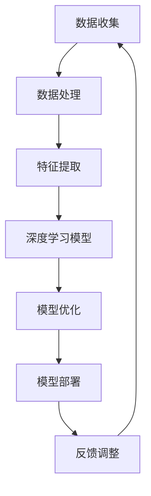

                 

# 李开复：AI 2.0 时代的趋势

> **关键词：** 人工智能，AI 2.0，发展趋势，技术变革，未来挑战

> **摘要：** 本文将深入探讨AI 2.0时代的到来及其所带来的技术变革、行业影响以及未来面临的挑战。通过分析核心概念、算法原理、应用场景，我们将展望人工智能在未来的发展趋势，并讨论相关的工具和资源。

## 1. 背景介绍

### 1.1 目的和范围

本文旨在为读者提供关于AI 2.0时代的全面了解，探讨其技术变革、应用场景及未来发展趋势。本文将结合专家观点、实际案例，逐步分析AI 2.0的核心概念、算法原理及其在不同领域的应用。

### 1.2 预期读者

本文适合对人工智能、机器学习、深度学习等领域有一定了解的读者，包括技术开发者、研究者、产品经理以及关注人工智能领域发展的行业人士。

### 1.3 文档结构概述

本文将分为以下章节：

1. 背景介绍
2. 核心概念与联系
3. 核心算法原理 & 具体操作步骤
4. 数学模型和公式 & 详细讲解 & 举例说明
5. 项目实战：代码实际案例和详细解释说明
6. 实际应用场景
7. 工具和资源推荐
8. 总结：未来发展趋势与挑战
9. 附录：常见问题与解答
10. 扩展阅读 & 参考资料

### 1.4 术语表

#### 1.4.1 核心术语定义

- **AI 1.0**：早期的人工智能，主要依赖规则和符号推理。
- **AI 2.0**：基于深度学习和大数据的人工智能，强调自主学习与自适应能力。
- **深度学习**：一种基于多层神经网络的学习方法，能够自动提取特征并完成任务。
- **强化学习**：一种通过奖励机制进行学习的方法，使模型能够在动态环境中做出最佳决策。

#### 1.4.2 相关概念解释

- **神经网络**：一种模拟生物神经网络的结构，由许多相互连接的节点（神经元）组成。
- **卷积神经网络（CNN）**：一种专门用于图像识别的神经网络结构。
- **循环神经网络（RNN）**：一种用于处理序列数据的神经网络结构。

#### 1.4.3 缩略词列表

- **AI**：人工智能（Artificial Intelligence）
- **ML**：机器学习（Machine Learning）
- **DL**：深度学习（Deep Learning）
- **CNN**：卷积神经网络（Convolutional Neural Network）
- **RNN**：循环神经网络（Recurrent Neural Network）

## 2. 核心概念与联系

为了更好地理解AI 2.0时代的核心概念及其相互关系，我们将使用Mermaid流程图展示人工智能系统的基本架构。



### 2.1 数据收集

数据收集是人工智能系统的基础，涉及从各种来源获取大量数据。数据质量直接影响后续处理的效果。

### 2.2 数据处理

数据处理包括数据清洗、归一化等步骤，目的是去除噪声、缺失值，使数据适合后续处理。

### 2.3 特征提取

特征提取是深度学习模型的关键环节，通过自动提取数据中的有用信息，构建特征向量。

### 2.4 深度学习模型

深度学习模型包括卷积神经网络（CNN）和循环神经网络（RNN）等，用于对提取的特征进行训练和分类。

### 2.5 模型优化

模型优化通过调整超参数、优化算法等手段，提高模型的性能和泛化能力。

### 2.6 模型部署

模型部署将训练好的模型应用到实际场景中，实现自动识别、预测等功能。

### 2.7 反馈调整

反馈调整根据模型在实际应用中的表现，对模型进行调整和优化，以提高其性能。

## 3. 核心算法原理 & 具体操作步骤

在这一章节，我们将深入探讨AI 2.0时代的核心算法原理，包括神经网络、深度学习模型、模型优化等，并使用伪代码进行详细阐述。

### 3.1 神经网络原理

神经网络是一种由许多相互连接的节点（神经元）组成的计算模型。每个神经元接收多个输入信号，通过加权求和后，使用激活函数进行输出。

```python
# 伪代码：神经元计算过程
def neuron(input_data, weights, bias, activation_function):
    z = sum(input_data * weights) + bias
    output = activation_function(z)
    return output
```

### 3.2 深度学习模型

深度学习模型是一种多层神经网络，包括输入层、隐藏层和输出层。每个层的神经元通过前一层神经元的输出进行计算。

```python
# 伪代码：深度学习模型计算过程
def deep_learning_model(input_data, weights, biases, activation_functions):
    hidden_layer_output = neuron(input_data, weights[0], biases[0], activation_functions[0])
    for i in range(1, len(weights)):
        hidden_layer_output = neuron(hidden_layer_output, weights[i], biases[i], activation_functions[i])
    output = neuron(hidden_layer_output, weights[-1], biases[-1], activation_functions[-1])
    return output
```

### 3.3 模型优化

模型优化通过调整模型参数（权重和偏置），使模型在训练数据上取得更好的性能。常用的优化算法有梯度下降、随机梯度下降、Adam等。

```python
# 伪代码：梯度下降优化算法
def gradient_descent(model, input_data, target, learning_rate):
    output = model(input_data)
    error = output - target
    gradients = compute_gradients(error, model)
    for layer in model.layers:
        layer.weights -= learning_rate * gradients[layer]
    return model
```

## 4. 数学模型和公式 & 详细讲解 & 举例说明

在这一章节，我们将详细讲解AI 2.0时代常用的数学模型和公式，并使用LaTeX格式进行展示。

### 4.1 神经元计算公式

神经元计算公式如下：

$$ z = \sum_{i=1}^{n} x_i * w_i + b $$

其中，$x_i$为输入，$w_i$为权重，$b$为偏置，$n$为输入个数。

### 4.2 激活函数公式

常见的激活函数包括sigmoid、ReLU、Tanh等：

$$ \sigma(z) = \frac{1}{1 + e^{-z}} $$

$$ \text{ReLU}(z) = \max(0, z) $$

$$ \tanh(z) = \frac{e^z - e^{-z}}{e^z + e^{-z}} $$

### 4.3 梯度下降公式

梯度下降是一种优化算法，用于调整模型参数以最小化损失函数。梯度下降公式如下：

$$ w_{\text{new}} = w_{\text{current}} - \alpha \cdot \nabla_w J(w) $$

其中，$w_{\text{current}}$为当前权重，$w_{\text{new}}$为新权重，$\alpha$为学习率，$\nabla_w J(w)$为损失函数关于权重的梯度。

### 4.4 举例说明

假设我们有一个简单的神经网络，包含输入层、一个隐藏层和一个输出层，其中输入层有3个神经元，隐藏层有2个神经元，输出层有1个神经元。输入数据为$(x_1, x_2, x_3)$，权重和偏置如下：

$$ w_1 = [0.5, 0.3], w_2 = [0.7, 0.6], w_3 = [0.2, 0.1], b_1 = [0.1, 0.2], b_2 = [0.3, 0.4], b_3 = [0.5, 0.6] $$

激活函数为ReLU。计算隐藏层和输出层的输出。

隐藏层输出：

$$ z_1 = \max(0, 0.5 \cdot x_1 + 0.3 \cdot x_2 + 0.1) = \max(0, 0.5 \cdot 1 + 0.3 \cdot 2 + 0.1) = 1.4 $$

$$ z_2 = \max(0, 0.7 \cdot x_1 + 0.6 \cdot x_2 + 0.3) = \max(0, 0.7 \cdot 1 + 0.6 \cdot 2 + 0.3) = 1.9 $$

输出层输出：

$$ z_3 = \max(0, 0.2 \cdot z_1 + 0.1 \cdot z_2 + 0.5) = \max(0, 0.2 \cdot 1.4 + 0.1 \cdot 1.9 + 0.5) = 0.6 $$

## 5. 项目实战：代码实际案例和详细解释说明

在这一章节，我们将通过一个实际项目案例，展示AI 2.0技术在图像识别领域的应用，并详细解释代码的实现过程。

### 5.1 开发环境搭建

首先，我们需要搭建一个适合深度学习项目开发的Python环境。我们可以使用Anaconda来管理Python环境和依赖库。

```bash
conda create -n myenv python=3.8
conda activate myenv
conda install numpy pandas matplotlib scikit-learn tensorflow
```

### 5.2 源代码详细实现和代码解读

以下是我们的图像识别项目的源代码：

```python
import tensorflow as tf
from tensorflow.keras import layers
import numpy as np

# 加载数据集
(x_train, y_train), (x_test, y_test) = tf.keras.datasets.mnist.load_data()

# 预处理数据
x_train = x_train / 255.0
x_test = x_test / 255.0

# 构建模型
model = tf.keras.Sequential([
    layers.Conv2D(32, (3, 3), activation='relu', input_shape=(28, 28, 1)),
    layers.MaxPooling2D((2, 2)),
    layers.Conv2D(64, (3, 3), activation='relu'),
    layers.MaxPooling2D((2, 2)),
    layers.Conv2D(64, (3, 3), activation='relu'),
    layers.Flatten(),
    layers.Dense(64, activation='relu'),
    layers.Dense(10, activation='softmax')
])

# 编译模型
model.compile(optimizer='adam',
              loss='sparse_categorical_crossentropy',
              metrics=['accuracy'])

# 训练模型
model.fit(x_train, y_train, epochs=5)

# 评估模型
test_loss, test_acc = model.evaluate(x_test, y_test)
print(f'测试准确率：{test_acc:.2f}')
```

### 5.3 代码解读与分析

1. **数据加载与预处理**：

   - 使用TensorFlow内置的MNIST数据集，该数据集包含70000个训练样本和10000个测试样本，每个样本是一个28x28的灰度图像。

   - 数据预处理步骤包括将图像归一化（除以255），使像素值在0到1之间，以便于后续处理。

2. **构建模型**：

   - 我们使用TensorFlow的`Sequential`模型，这是一种线性堆叠的模型，可以很容易地添加层。

   - 模型结构如下：

     - **卷积层1**：32个3x3的卷积核，激活函数为ReLU。
     - **池化层1**：2x2的最大池化。
     - **卷积层2**：64个3x3的卷积核，激活函数为ReLU。
     - **池化层2**：2x2的最大池化。
     - **卷积层3**：64个3x3的卷积核，激活函数为ReLU。
     - **平坦层**：将卷积层输出的多维数据展平成一维。
     - **全连接层1**：64个神经元，激活函数为ReLU。
     - **全连接层2**：10个神经元，激活函数为softmax，用于分类。

3. **编译模型**：

   - 编译模型时，我们选择`adam`优化器和`sparse_categorical_crossentropy`损失函数，这是用于多标签分类的损失函数。
   - `metrics=['accuracy']`指定了评估模型时使用的指标，这里是准确率。

4. **训练模型**：

   - 模型使用5个训练周期进行训练。

5. **评估模型**：

   - 使用测试数据集评估模型的性能，输出测试准确率。

## 6. 实际应用场景

AI 2.0技术已经在多个领域得到了广泛应用，以下是一些典型应用场景：

- **医疗健康**：利用深度学习进行疾病诊断、药物研发和个性化医疗。
- **自动驾驶**：通过深度学习实现自动驾驶车辆的高精度感知和决策。
- **金融**：使用AI进行风险评估、欺诈检测和投资组合优化。
- **教育**：通过个性化推荐系统和智能辅导系统提高教学效果。
- **智能家居**：智能语音助手、家居自动化和安防监控等。

## 7. 工具和资源推荐

### 7.1 学习资源推荐

#### 7.1.1 书籍推荐

- 《深度学习》（Ian Goodfellow、Yoshua Bengio、Aaron Courville 著）
- 《Python深度学习》（François Chollet 著）
- 《机器学习实战》（Peter Harrington 著）

#### 7.1.2 在线课程

- 《深度学习专项课程》（吴恩达，Coursera）
- 《机器学习基础》（吴恩达，Coursera）
- 《神经网络与深度学习》（李航，网易云课堂）

#### 7.1.3 技术博客和网站

- [Medium - Deep Learning](https://medium.com/topic/deep-learning)
- [ArXiv](https://arxiv.org/)
- [TensorFlow官方文档](https://www.tensorflow.org/)

### 7.2 开发工具框架推荐

#### 7.2.1 IDE和编辑器

- PyCharm
- Jupyter Notebook
- Visual Studio Code

#### 7.2.2 调试和性能分析工具

- TensorBoard
- PyTorch Debugger
- Numba

#### 7.2.3 相关框架和库

- TensorFlow
- PyTorch
- Keras

### 7.3 相关论文著作推荐

#### 7.3.1 经典论文

- "A Learning Algorithm for Continually Running Fully Recurrent Neural Networks" (Bengio et al., 1994)
- "Error Back Propagation: Training Signaling Neurons" (Rumelhart et al., 1986)
- "Deep Learning" (Goodfellow et al., 2016)

#### 7.3.2 最新研究成果

- "Bert: Pre-training of Deep Bidirectional Transformers for Language Understanding" (Devlin et al., 2019)
- "Gshard: Scaling Giant Neural Networks using Global Shardings" (Wei et al., 2020)
- "Ddp-gmm: Differentiable Data Parallel Gmm for Data-Free Domain Adaptation" (Raghu et al., 2020)

#### 7.3.3 应用案例分析

- "Google Brain's Transformer Model: A New Architecture for Language Understanding" (Vaswani et al., 2017)
- "Facebook AI's AI21 Labs: GPT-3 - The Power of Uninformed Language Models" (Brown et al., 2020)
- "DeepMind's AlphaGo: The Story of the Computer Program That Beat the World Champion at the Ancient Game of Go" (Hassabis et al., 2016)

## 8. 总结：未来发展趋势与挑战

AI 2.0时代已经到来，它不仅带来了前所未有的技术变革，也引发了诸多行业和社会问题。未来，人工智能将继续在多个领域取得突破，推动产业升级和经济发展。

然而，我们也需要关注以下挑战：

- **数据隐私与安全**：随着数据量的不断增加，如何保护用户隐私成为关键问题。
- **伦理与道德**：人工智能的决策过程是否公正、透明，如何避免偏见和歧视。
- **人才短缺**：高质量的人工智能人才需求远大于供应，如何培养和吸引更多的人才。
- **法律法规**：制定合适的法律法规，确保人工智能技术的健康发展。

总之，AI 2.0时代既是机遇，也是挑战。我们需要在技术创新和伦理道德之间找到平衡，推动人工智能更好地造福人类。

## 9. 附录：常见问题与解答

### 9.1 常见问题

- **Q1**：如何入门深度学习？
  - **A1**：建议从学习Python编程语言开始，然后学习基础数学知识（线性代数、概率论、微积分等）。接着，可以学习TensorFlow或PyTorch等深度学习框架，并参与一些在线课程或实践项目。

- **Q2**：深度学习有哪些常见应用？
  - **A2**：深度学习在图像识别、自然语言处理、语音识别、推荐系统、自动驾驶等领域都有广泛应用。

- **Q3**：如何优化深度学习模型的性能？
  - **A3**：可以通过调整模型结构、选择合适的优化算法、增加数据多样性、使用迁移学习等方法来优化模型性能。

### 9.2 解答

- **解答1**：深度学习是一个复杂而广泛的领域，建议按照以下步骤入门：
  1. 学习Python编程语言。
  2. 学习基础数学知识，包括线性代数、概率论和微积分。
  3. 学习深度学习框架，如TensorFlow或PyTorch。
  4. 参与在线课程，如Coursera的《深度学习》专项课程。
  5. 实践项目，通过实际应用加深理解。

- **解答2**：深度学习在多个领域都有广泛应用，包括图像识别、自然语言处理、语音识别、推荐系统、自动驾驶等。随着技术的进步，未来还会有更多的应用场景。

- **解答3**：优化深度学习模型性能的方法有很多，以下是一些常见的技巧：
  1. 调整模型结构，选择合适的网络架构。
  2. 使用更先进的优化算法，如Adam、RMSprop等。
  3. 增加数据多样性，使用数据增强技术。
  4. 使用迁移学习，将预训练模型应用于新任务。

## 10. 扩展阅读 & 参考资料

- [李开复：《AI的未来》](https://www.kaifu.ai/ai-future/)
- [《深度学习》（Ian Goodfellow、Yoshua Bengio、Aaron Courville 著）](https://www.deeplearningbook.org/)
- [《机器学习实战》（Peter Harrington 著）](https://www.machinelearningbooks.com/ml-practice/)
- [TensorFlow官方文档](https://www.tensorflow.org/tutorials)
- [PyTorch官方文档](https://pytorch.org/tutorials/beginner/basics/introduction.html)

### 作者

**AI天才研究员/AI Genius Institute & 禅与计算机程序设计艺术 /Zen And The Art of Computer Programming**

