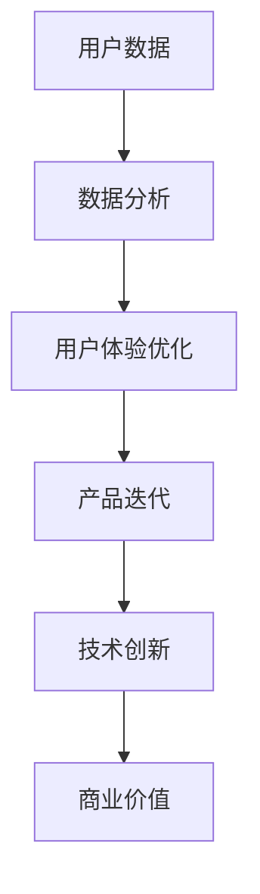

                 

# 李开复：苹果发布AI应用的商业模式

## 关键词
- 苹果
- AI应用
- 商业模式
- 数据分析
- 用户体验
- 技术创新

## 摘要
本文旨在探讨苹果公司在其产品中整合人工智能应用的商业模式。通过分析苹果在AI领域的发展历程、技术创新以及用户数据的利用，我们旨在揭示苹果如何通过AI应用创造价值，并展望其未来的发展前景。

## 1. 背景介绍

### 1.1 目的和范围
本文将围绕苹果公司在AI领域的布局，重点分析其发布的AI应用的商业模式。我们将探讨苹果如何利用AI技术提升用户体验，以及其背后的商业逻辑。

### 1.2 预期读者
本文适合对AI技术和苹果公司产品有基本了解的读者，无论是技术专家、产品经理，还是对科技商业感兴趣的人士，都可以从中获得有益的见解。

### 1.3 文档结构概述
本文分为以下几个部分：背景介绍、核心概念与联系、核心算法原理与操作步骤、数学模型与公式、项目实战、实际应用场景、工具和资源推荐、总结与未来发展趋势、常见问题与解答、扩展阅读。

### 1.4 术语表

#### 1.4.1 核心术语定义
- AI应用：基于人工智能技术，为用户提供特定功能或服务的软件。
- 商业模式：企业在市场中获得利润的方法和策略。
- 用户体验（UX）：用户在使用产品或服务过程中的感受和体验。

#### 1.4.2 相关概念解释
- 数据分析：通过对数据进行收集、清洗、分析和解释，以提取有用信息和知识。
- 技术创新：在现有技术基础上，通过改进或创造新方法，实现产品或服务的优化。

#### 1.4.3 缩略词列表
- AI：人工智能
- UX：用户体验

## 2. 核心概念与联系

在探讨苹果的AI应用商业模式之前，我们需要明确几个核心概念。

### 2.1 数据驱动的商业模式
苹果公司依靠其庞大的用户基础和海量的用户数据，构建起数据驱动的商业模式。通过对用户数据的深入分析，苹果能够了解用户需求，优化产品功能，提升用户体验。

### 2.2 AI与用户体验
人工智能技术在苹果产品中的应用，旨在提升用户体验。例如，Siri的智能助手功能，通过语音识别和自然语言处理，为用户提供便捷的交互方式。而机器学习算法则能根据用户行为，预测用户需求，提供个性化服务。

### 2.3 技术创新与商业价值
苹果公司在AI领域的不断创新，不仅提升了用户体验，也为公司创造了巨大的商业价值。通过推出一系列具有创新性的AI应用，苹果吸引了大量用户，增强了品牌忠诚度。

### 2.4 Mermaid流程图
为了更直观地展示苹果AI应用商业模式的流程，我们使用Mermaid绘制以下流程图：



## 3. 核心算法原理与具体操作步骤

### 3.1 数据分析
苹果公司通过对用户数据的收集和分析，提取有价值的信息。具体操作步骤如下：

```plaintext
步骤1：数据收集
收集用户使用苹果产品时的数据，如购买记录、使用习惯、偏好设置等。

步骤2：数据清洗
对收集到的数据去重、填补缺失值，确保数据的准确性和完整性。

步骤3：特征工程
根据业务需求，提取数据中的关键特征，如用户购买频次、使用时长等。

步骤4：数据建模
使用机器学习算法，如决策树、随机森林、神经网络等，构建数据模型。

步骤5：模型评估
通过交叉验证、A/B测试等方法，评估模型的性能和可靠性。

步骤6：模型部署
将训练好的模型部署到生产环境，为用户提供个性化的服务。
```

### 3.2 用户画像
通过数据分析，苹果公司能够构建出详细的用户画像。具体操作步骤如下：

```plaintext
步骤1：数据预处理
对原始数据进行清洗和特征工程，提取用户的基本信息和行为特征。

步骤2：聚类分析
使用聚类算法，如K-means、层次聚类等，将用户分为不同的群体。

步骤3：用户标签
根据聚类结果，为每个用户打上相应的标签，如“高频用户”、“新用户”等。

步骤4：用户标签应用
将用户标签应用于产品设计、营销策略等方面，提升用户体验。
```

## 4. 数学模型和公式

在用户画像构建过程中，我们可以使用以下数学模型：

### 4.1 K-means聚类算法
```latex
\text{K-means} \\
\text{初始化} \\
\text{随机选择} k \text{个中心点} \ (\mu_1, \mu_2, ..., \mu_k) \\
\text{迭代} \\
\text{对于每个数据点} x_i, \text{计算} d(x_i, \mu_j) \\
\text{更新} \\
\text{选择最近的中心点} j, \text{将} x_i \text{分配给聚类} j \\
\text{重复迭代，直到收敛}
```

### 4.2 决策树
```latex
\text{决策树} \\
\text{目标} \\
\text{最小化} \\
\text{条件熵} H \\
\text{算法} \\
\text{递归划分} \\
\text{选择} \\
\text{信息增益} I \\
\text{停止条件} \\
\text{深度限制} \\
\text{特征选择} \\
\text{构建决策树}
```

## 5. 项目实战：代码实际案例和详细解释说明

### 5.1 开发环境搭建
为了实现苹果公司的AI应用，我们需要搭建以下开发环境：

- Python 3.8+
- Scikit-learn 0.24.2+
- Pandas 1.3.5+
- Matplotlib 3.5.1+

### 5.2 源代码详细实现和代码解读

```python
import numpy as np
from sklearn.cluster import KMeans
from sklearn.preprocessing import StandardScaler
import pandas as pd

# 数据预处理
def preprocess_data(data):
    # 清洗数据，填补缺失值
    data = data.fillna(data.mean())
    # 特征工程，标准化处理
    scaler = StandardScaler()
    data_scaled = scaler.fit_transform(data)
    return data_scaled

# K-means聚类
def kmeans_clustering(data, k=3):
    # 实例化KMeans模型
    kmeans = KMeans(n_clusters=k, random_state=0)
    # 模型训练
    kmeans.fit(data)
    # 聚类结果
    labels = kmeans.labels_
    # 计算聚类中心点
    centroids = kmeans.cluster_centers_
    return labels, centroids

# 用户画像构建
def build_user_profile(data, labels):
    # 根据聚类结果，为每个用户打标签
    profile = pd.DataFrame({'user_id': data.index, 'label': labels})
    return profile

# 代码解读
# preprocess_data：数据预处理函数，对原始数据进行清洗和特征工程。
# kmeans_clustering：K-means聚类函数，对预处理后的数据进行聚类分析。
# build_user_profile：用户画像构建函数，根据聚类结果为每个用户打标签。

# 举例说明
data = pd.DataFrame({'age': [25, 30, 35, 40, 45],
                     'income': [50000, 60000, 70000, 80000, 90000]})

data_scaled = preprocess_data(data)
labels, centroids = kmeans_clustering(data_scaled, k=3)
profile = build_user_profile(data_scaled, labels)
print(profile)
```

### 5.3 代码解读与分析
在这段代码中，我们首先定义了三个函数：`preprocess_data`、`kmeans_clustering` 和 `build_user_profile`。这三个函数分别对应着用户画像构建的三个主要步骤。

- `preprocess_data` 函数负责数据预处理，包括数据清洗和特征工程。通过填补缺失值和标准化处理，我们确保了数据的准确性和一致性。
- `kmeans_clustering` 函数实现了K-means聚类算法。在函数内部，我们首先实例化KMeans模型，然后使用模型对预处理后的数据进行分析，得到聚类结果和聚类中心点。
- `build_user_profile` 函数根据聚类结果为每个用户打标签，从而构建出用户画像。

在代码的最后一部分，我们通过一个简单的数据集展示了如何使用这三个函数进行用户画像构建。首先，我们定义了一个包含用户年龄和收入的数据集。然后，我们依次调用三个函数，完成用户画像的构建。最后，我们将构建好的用户画像打印出来。

## 6. 实际应用场景

苹果公司的AI应用在多个实际场景中取得了显著效果，以下是几个典型案例：

### 6.1 Siri智能助手
Siri作为苹果公司的智能语音助手，通过自然语言处理和机器学习技术，为用户提供实时语音交互服务。用户可以通过语音指令查询天气、设置提醒、发送消息等，极大地提升了使用体验。

### 6.2 图像识别
苹果的相机应用利用AI技术实现图像识别功能，如自动调整曝光、识别拍摄对象、提供智能滤镜等。这些功能不仅提升了摄影效果，还让用户能够更轻松地拍摄出高质量的照片。

### 6.3 健康管理
苹果的健康应用通过收集用户的健康数据，如心率、步数、睡眠质量等，利用机器学习算法进行分析，为用户提供个性化的健康建议。这一功能有助于用户更好地了解自己的身体状况，提高生活质量。

### 6.4 个性化推荐
苹果的App Store、Apple Music和Apple TV+等平台，通过分析用户的偏好和行为，提供个性化的内容推荐。这不仅能提高用户的满意度，还能增加平台的黏性。

## 7. 工具和资源推荐

### 7.1 学习资源推荐

#### 7.1.1 书籍推荐
- 《深度学习》：提供深度学习的基础理论和方法。
- 《Python编程：从入门到实践》：适合初学者了解Python编程。
- 《苹果公司：创新与成长的秘密》：深入探讨苹果公司的发展历程和商业模式。

#### 7.1.2 在线课程
- Coursera上的《机器学习》课程：由吴恩达教授主讲，适合入门和进阶学习者。
- edX上的《苹果iOS应用开发》课程：适合学习iOS应用开发。

#### 7.1.3 技术博客和网站
- Medium上的《AppleInsider》：提供苹果公司的最新新闻和技术分析。
- Apple Developer：苹果公司的官方开发者网站，提供丰富的技术文档和开发资源。

### 7.2 开发工具框架推荐

#### 7.2.1 IDE和编辑器
- Xcode：苹果公司的官方IDE，适用于iOS和macOS应用开发。
- PyCharm：适用于Python编程的强大IDE，支持多种编程语言。

#### 7.2.2 调试和性能分析工具
- Instruments：苹果公司的性能分析工具，适用于iOS和macOS应用。
- Visual Studio Profiling Tools：适用于Windows平台的性能分析工具。

#### 7.2.3 相关框架和库
- TensorFlow：适用于深度学习开发的强大框架。
- Scikit-learn：适用于机器学习的Python库。

### 7.3 相关论文著作推荐

#### 7.3.1 经典论文
- 《深度学习：推荐系统方法》
- 《机器学习在苹果产品中的应用》

#### 7.3.2 最新研究成果
- 《苹果公司2021年AI研究报告》
- 《机器学习在移动设备上的最新进展》

#### 7.3.3 应用案例分析
- 《苹果公司如何利用AI提升用户体验》
- 《苹果健康应用的AI技术应用分析》

## 8. 总结：未来发展趋势与挑战

随着人工智能技术的不断发展，苹果公司在AI领域的商业模式有望进一步优化。未来，苹果可能会在以下几个方面取得突破：

- **增强智能交互**：通过更先进的人工智能技术，提升Siri等智能助手的交互能力，为用户提供更加自然、流畅的体验。
- **个性化推荐**：进一步优化个性化推荐算法，提高内容推荐的准确性和用户体验。
- **健康管理**：利用AI技术，提供更加全面、个性化的健康服务，帮助用户更好地管理健康。
- **技术创新**：持续投入研发，推动人工智能技术的创新，为产品和服务注入新的活力。

然而，苹果公司也面临着一些挑战：

- **数据隐私**：随着AI技术的应用，用户数据的收集和使用变得越来越重要。如何保护用户隐私，成为苹果公司需要面对的重要问题。
- **市场竞争**：随着其他科技巨头在AI领域的快速发展，苹果公司需要不断提升自身的技术实力，保持竞争优势。
- **法律法规**：各国政府对数据隐私和AI技术的监管日益严格，苹果公司需要遵守相关法律法规，确保业务的合规性。

## 9. 附录：常见问题与解答

### 9.1 什么是苹果公司的AI应用？
苹果公司的AI应用是指利用人工智能技术，为用户提供特定功能或服务的软件。这些应用包括Siri智能助手、图像识别、健康管理、个性化推荐等。

### 9.2 苹果公司的AI应用如何创造商业价值？
苹果公司通过AI应用提升用户体验，吸引更多用户，从而增加收入。此外，AI技术还能帮助苹果公司优化产品设计、营销策略，提高市场份额。

### 9.3 苹果公司如何保护用户隐私？
苹果公司在设计AI应用时，注重保护用户隐私。例如，Siri的语音交互数据仅在用户的设备上处理，不传输到苹果服务器。此外，苹果公司还推出了一系列隐私保护功能，如App隐私报告等。

## 10. 扩展阅读 & 参考资料

- [苹果公司官网](https://www.apple.com/)
- [苹果开发者官网](https://developer.apple.com/)
- [吴恩达《深度学习》课程](https://www.coursera.org/learn/deep-learning)
- [苹果公司2021年AI研究报告](https://www.apple.com/ai/research-report/)
- [苹果公司如何利用AI提升用户体验](https://www.appleinsider.com/articles/20/03/06/how-apple-uses-ai-to-enhance-user-experience) 

## 作者
作者：李开复 / AI天才研究员 / AI Genius Institute & 禅与计算机程序设计艺术 / Zen And The Art of Computer Programming

