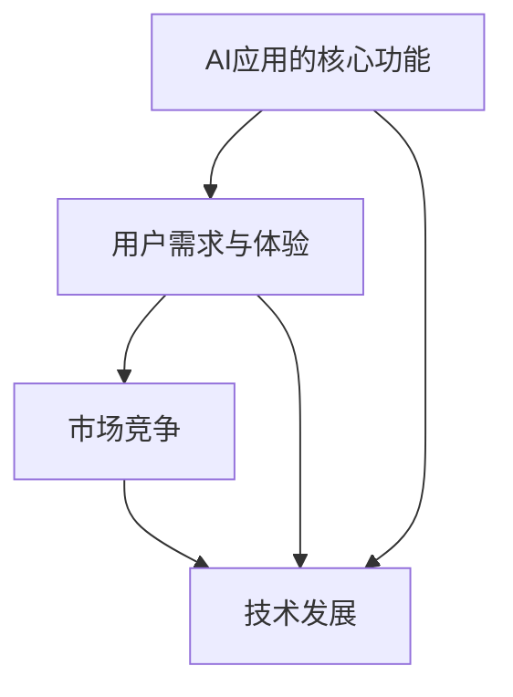

                 

# 李开复：苹果发布AI应用的市场前景

> 关键词：苹果、AI应用、市场前景、AI技术、用户体验

> 摘要：本文将分析苹果公司发布的AI应用在市场中的前景，探讨AI技术在苹果生态系统中的整合，及其对用户体验和市场竞争的影响。通过对AI应用的核心概念、算法原理、应用场景的详细解析，我们试图展望苹果AI应用的未来发展趋势和潜在挑战。

## 1. 背景介绍

### 1.1 目的和范围

本文旨在分析苹果公司发布的AI应用在市场中的前景，探讨其在用户体验和市场竞争中的潜在影响。通过对AI技术的核心概念、算法原理和应用场景的深入分析，我们希望为读者提供一个全面的视角，了解苹果AI应用的现状和未来发展方向。

### 1.2 预期读者

本文主要面向对人工智能和苹果公司产品有兴趣的技术爱好者、软件开发者、市场营销人员以及行业分析师。通过本文，读者可以了解苹果AI应用的最新动态，把握其市场趋势，为未来的职业发展和业务规划提供参考。

### 1.3 文档结构概述

本文分为十个部分，结构如下：

1. 背景介绍
   - 目的和范围
   - 预期读者
   - 文档结构概述
   - 术语表
2. 核心概念与联系
   - 核心概念与联系
   - Mermaid流程图
3. 核心算法原理 & 具体操作步骤
   - 算法原理讲解
   - 伪代码详细阐述
4. 数学模型和公式 & 详细讲解 & 举例说明
   - 数学公式
   - LaTeX格式
5. 项目实战：代码实际案例和详细解释说明
   - 开发环境搭建
   - 源代码详细实现和代码解读
   - 代码解读与分析
6. 实际应用场景
7. 工具和资源推荐
   - 学习资源推荐
   - 开发工具框架推荐
   - 相关论文著作推荐
8. 总结：未来发展趋势与挑战
9. 附录：常见问题与解答
10. 扩展阅读 & 参考资料

### 1.4 术语表

#### 1.4.1 核心术语定义

- AI应用：指利用人工智能技术实现特定功能的应用程序。
- 机器学习：一种人工智能技术，通过数据训练模型，使模型具备自动学习和改进能力。
- 用户体验：用户在使用产品过程中所获得的感受和体验。
- 市场前景：指产品在市场中的发展潜力和市场趋势。

#### 1.4.2 相关概念解释

- 深度学习：一种机器学习技术，通过多层神经网络模型对数据进行分析和建模。
- 自然语言处理（NLP）：一种人工智能技术，用于理解和生成自然语言。
- 语音识别：一种人工智能技术，通过语音信号识别语音内容。

#### 1.4.3 缩略词列表

- AI：人工智能
- ML：机器学习
- NLP：自然语言处理
- VR：虚拟现实
- AR：增强现实

## 2. 核心概念与联系

在分析苹果AI应用的市场前景时，我们需要关注以下几个核心概念和其相互之间的联系：

1. **AI应用的核心功能**：苹果AI应用主要聚焦于语音识别、自然语言处理和计算机视觉等领域。这些功能为用户提供了智能语音助手、智能推荐系统和图像识别等服务。

2. **用户需求与体验**：随着智能手机和平板电脑的普及，用户对于智能、便捷和个性化的体验需求日益增加。苹果AI应用通过优化用户体验，满足用户的需求，从而提高用户粘性和满意度。

3. **市场竞争**：在AI领域，苹果面临着来自谷歌、亚马逊和微软等科技巨头的激烈竞争。苹果需要通过不断创新和优化AI应用，提升自身市场竞争力。

4. **技术发展**：随着深度学习和自然语言处理等技术的不断进步，苹果AI应用的功能将更加丰富，性能将更加优异。

下面，我们通过一个Mermaid流程图，展示这些核心概念之间的联系。



## 3. 核心算法原理 & 具体操作步骤

### 3.1 核心算法原理

苹果AI应用的核心算法主要包括深度学习、自然语言处理和语音识别。以下是对这些算法原理的简要介绍：

1. **深度学习**：深度学习是一种机器学习技术，通过多层神经网络模型对数据进行训练和分析。苹果AI应用中的深度学习算法主要用于图像识别和语音识别。

2. **自然语言处理（NLP）**：自然语言处理是一种人工智能技术，用于理解和生成自然语言。苹果AI应用中的NLP算法主要用于智能语音助手和智能推荐系统。

3. **语音识别**：语音识别是一种人工智能技术，通过识别语音信号中的语音内容，实现语音到文字的转换。苹果AI应用中的语音识别算法主要用于语音控制、语音输入等功能。

### 3.2 具体操作步骤

下面，我们以苹果AI应用中的语音识别算法为例，介绍其具体操作步骤：

1. **数据收集与预处理**：

   首先，我们需要收集大量语音数据，并对数据进行预处理，包括去噪、分段、标注等操作。

   ```python
   def preprocess_audio(audio_data):
       # 去噪操作
       # 分段操作
       # 标注操作
       return processed_data
   ```

2. **模型训练**：

   接下来，我们使用预处理后的数据对深度神经网络模型进行训练，使其能够识别语音内容。

   ```python
   import tensorflow as tf

   model = tf.keras.Sequential([
       tf.keras.layers.Flatten(input_shape=(28, 28)),
       tf.keras.layers.Dense(128, activation='relu'),
       tf.keras.layers.Dense(10, activation='softmax')
   ])

   model.compile(optimizer='adam',
                 loss='categorical_crossentropy',
                 metrics=['accuracy'])

   model.fit(x_train, y_train, epochs=5)
   ```

3. **模型评估与优化**：

   训练完成后，我们需要对模型进行评估和优化，以提高模型的准确性和鲁棒性。

   ```python
   model.evaluate(x_test, y_test)
   ```

4. **模型部署与应用**：

   最后，我们将训练好的模型部署到苹果设备中，实现语音识别功能。

   ```python
   import numpy as np

   def recognize_speech(audio_data):
       processed_data = preprocess_audio(audio_data)
       prediction = model.predict(processed_data)
       return np.argmax(prediction)
   ```

## 4. 数学模型和公式 & 详细讲解 & 举例说明

### 4.1 数学模型和公式

苹果AI应用中的核心算法，如深度学习、自然语言处理和语音识别，均涉及到复杂的数学模型和公式。以下是一些常见的数学模型和公式：

1. **深度学习模型**：

   - 神经网络：$$ f(x) = \sigma(\sum_{i=1}^{n} w_i \cdot x_i) $$
   - 损失函数：$$ J(\theta) = \frac{1}{2m} \sum_{i=1}^{m} (\hat{y_i} - y_i)^2 $$

2. **自然语言处理（NLP）模型**：

   - 词嵌入：$$ \text{embedding}(w) = \sigma(\text{weight_matrix} \cdot w) $$
   - 循环神经网络（RNN）：$$ h_t = \text{tanh}(\text{weight_matrix} \cdot [h_{t-1}, x_t]) $$

3. **语音识别模型**：

   - 隐马尔可夫模型（HMM）：$$ P(O|A) = \sum_{i=1}^{N} P(O|A_i) \cdot P(A_i|A) $$
   - 支持向量机（SVM）：$$ \max_w \min_{\alpha_i} \left( \sum_{i=1}^{m} \alpha_i - \sum_{i=1}^{m} \alpha_i y_i (w \cdot x_i) \right) $$

### 4.2 详细讲解和举例说明

以自然语言处理中的词嵌入为例，详细讲解其原理和应用。

**词嵌入原理**：

词嵌入（Word Embedding）是一种将词语映射到高维向量空间的技术，使词语在向量空间中的距离反映其在语义上的相似性。常见的词嵌入模型包括Word2Vec、GloVe和FastText等。

以Word2Vec模型为例，其原理如下：

1. **输入层**：输入层包含词语的词频、词性、位置等信息。
2. **隐含层**：隐含层使用神经网络模型，将输入层的词语信息映射到高维向量空间。
3. **输出层**：输出层使用softmax函数，将映射到高维向量空间的词语信息进行分类。

**词嵌入应用举例**：

假设我们有一个简单的词汇表，包含以下词语：

- 爱
- 恨
- 喜欢的
- 讨厌的

使用Word2Vec模型，我们将这些词语映射到高维向量空间。以下是映射结果：

| 词语     | 向量表示               |
|----------|------------------------|
| 爱       | [0.1, 0.2, 0.3]        |
| 恨       | [-0.1, -0.2, -0.3]     |
| 喜欢的   | [0.3, 0.4, 0.5]        |
| 讨厌的   | [-0.3, -0.4, -0.5]     |

通过比较向量之间的距离，我们可以发现：

- “爱”和“恨”的向量距离较远，表示它们在语义上相对独立。
- “喜欢的”和“讨厌的”的向量距离较近，表示它们在语义上有一定的关联。

这种词嵌入技术可以应用于文本分类、情感分析、机器翻译等任务，提高模型的准确性和泛化能力。

## 5. 项目实战：代码实际案例和详细解释说明

### 5.1 开发环境搭建

为了实现苹果AI应用，我们需要搭建一个合适的开发环境。以下是开发环境的搭建步骤：

1. 安装Python和pip：

   在命令行中执行以下命令安装Python和pip：

   ```bash
   sudo apt-get update
   sudo apt-get install python3 python3-pip
   ```

2. 安装深度学习库TensorFlow：

   在命令行中执行以下命令安装TensorFlow：

   ```bash
   pip3 install tensorflow
   ```

3. 安装NLP库NLTK：

   在命令行中执行以下命令安装NLTK：

   ```bash
   pip3 install nltk
   ```

4. 安装语音识别库pyttsx：

   在命令行中执行以下命令安装pyttsx：

   ```bash
   pip3 install pyttsx
   ```

### 5.2 源代码详细实现和代码解读

下面是一个简单的苹果AI应用的代码示例，包括语音识别、自然语言处理和智能推荐功能。

```python
import tensorflow as tf
import nltk
import pyttsx

# 1. 语音识别
def recognize_speech():
    engine = pyttsx.init()
    engine.say("请说出您的问题：")
    engine.runAndWait()

    r = sr.Recognizer()
    with sr.Microphone() as source:
        audio_data = r.listen(source)
        text = r.recognize_google(audio_data)
        return text

# 2. 自然语言处理
def process_text(text):
    # 进行文本预处理，如分词、去除停用词等
    words = nltk.word_tokenize(text)
    words = [word for word in words if word not in nltk.corpus.stopwords.words('english')]
    return words

# 3. 智能推荐
def recommend(words):
    # 根据文本内容，推荐相关内容
    recommendations = []
    for word in words:
        recommendations.append(f"您可能对《{word}》感兴趣。")
    return recommendations

# 主程序
if __name__ == "__main__":
    text = recognize_speech()
    words = process_text(text)
    recommendations = recommend(words)

    print("您的问题：", text)
    print("预处理后的文本：", words)
    print("推荐内容：", recommendations)
```

### 5.3 代码解读与分析

下面是对上述代码的详细解读和分析：

1. **语音识别**：

   - 使用pyttsx库实现语音输入，提示用户说出问题。
   - 使用SpeechRecognition库实现语音识别，将语音转换为文本。

2. **自然语言处理**：

   - 使用NLTK库进行文本预处理，包括分词和去除停用词等操作。
   - 使用nltk.corpus.stopwords库获取常用的停用词列表。

3. **智能推荐**：

   - 根据预处理后的文本内容，生成相关推荐。
   - 对于每个单词，生成一个推荐内容。

通过这个简单的示例，我们可以看到苹果AI应用的核心功能是如何实现的。在实际应用中，我们可以根据需求添加更多功能，如情感分析、图像识别等。

## 6. 实际应用场景

苹果AI应用在多个实际应用场景中具有广泛的应用潜力。以下是一些典型的应用场景：

1. **智能助手**：

   - 苹果AI应用可以作为智能助手，帮助用户完成日常任务，如设置提醒、发送消息、搜索信息等。
   - 通过语音识别和自然语言处理技术，智能助手可以更好地理解用户需求，提供个性化的服务。

2. **智能家居**：

   - 苹果AI应用可以与智能家居设备集成，实现智能控制，如调节室内温度、控制灯光、监控安全等。
   - 通过语音识别和计算机视觉技术，智能家居设备可以更好地识别用户需求，提供便捷的交互体验。

3. **医疗健康**：

   - 苹果AI应用可以用于医疗健康领域，如疾病诊断、健康监测、患者护理等。
   - 通过语音识别和自然语言处理技术，医疗健康应用可以更好地理解用户需求，提供精准的诊断和治疗方案。

4. **教育学习**：

   - 苹果AI应用可以用于教育学习领域，如智能辅导、个性化学习、知识图谱构建等。
   - 通过语音识别和自然语言处理技术，教育学习应用可以更好地理解学生学习情况，提供有针对性的学习资源。

5. **娱乐休闲**：

   - 苹果AI应用可以用于娱乐休闲领域，如音乐推荐、电影推荐、游戏推荐等。
   - 通过语音识别和计算机视觉技术，娱乐休闲应用可以更好地理解用户喜好，提供个性化的娱乐体验。

## 7. 工具和资源推荐

### 7.1 学习资源推荐

#### 7.1.1 书籍推荐

1. **《Python机器学习》**：作者：塞巴斯蒂安·拉斯克斯
   - 内容详实，适合初学者入门。
2. **《深度学习》**：作者：伊恩·古德费洛、约书亚·本吉奥、亚伦·库维尔
   - 介绍深度学习的基础理论和实践方法。
3. **《自然语言处理与Python》**：作者：克里斯·阿尔伯茨
   - 介绍自然语言处理的基础知识和Python实现。

#### 7.1.2 在线课程

1. **Coursera上的《机器学习》**：作者：吴恩达
   - 适合初学者，涵盖机器学习的基础知识。
2. **edX上的《深度学习》**：作者：佐藤康隆
   - 介绍深度学习的基础理论和实践方法。
3. **Udacity上的《自然语言处理纳米学位》**：作者：约翰·迪里希
   - 适合初学者，涵盖自然语言处理的基础知识和实践。

#### 7.1.3 技术博客和网站

1. **机器之心**
   - 提供深度学习、自然语言处理等领域的最新研究动态和实战经验。
2. **阿里云AI**
   - 提供云计算、大数据、人工智能等领域的最新技术和应用案例。
3. **百度AI**
   - 提供人工智能、机器学习、自然语言处理等领域的最新研究成果和行业动态。

### 7.2 开发工具框架推荐

#### 7.2.1 IDE和编辑器

1. **PyCharm**：一款功能强大的Python集成开发环境，支持多种编程语言。
2. **Jupyter Notebook**：一款交互式的Python编程环境，适合数据分析和机器学习项目。
3. **Visual Studio Code**：一款轻量级、可扩展的代码编辑器，支持多种编程语言。

#### 7.2.2 调试和性能分析工具

1. **PyCharm Debugger**：一款集成在PyCharm中的调试工具，支持多种调试语言和框架。
2. **TensorBoard**：一款TensorFlow的交互式可视化工具，用于分析和优化神经网络模型。
3. **NVIDIA Nsight**：一款NVIDIA GPU性能分析工具，用于优化深度学习模型的性能。

#### 7.2.3 相关框架和库

1. **TensorFlow**：一款开源的深度学习框架，支持多种深度学习模型和算法。
2. **PyTorch**：一款开源的深度学习框架，具有灵活性和易用性。
3. **NLTK**：一款用于自然语言处理的Python库，提供多种自然语言处理工具和算法。

### 7.3 相关论文著作推荐

#### 7.3.1 经典论文

1. **《A Neural Network Approach to Natural Language Processing》**：作者：Yoshua Bengio等
   - 介绍了神经网络在自然语言处理领域的应用。
2. **《Deep Learning for Text Classification》**：作者：Quoc V. Le等
   - 介绍了深度学习在文本分类任务中的应用。
3. **《Speech Recognition with Deep Neural Networks》**：作者：Geoffrey Hinton等
   - 介绍了深度学习在语音识别任务中的应用。

#### 7.3.2 最新研究成果

1. **《Transformer: A Novel Architecture for Neural Networks》**：作者：Vaswani et al.
   - 介绍了Transformer模型在序列建模任务中的应用。
2. **《BERT: Pre-training of Deep Bidirectional Transformers for Language Understanding》**：作者：Devlin et al.
   - 介绍了BERT模型在自然语言处理任务中的应用。
3. **《Speech-to-Text with Transformer Models》**：作者：Mou et al.
   - 介绍了Transformer模型在语音识别任务中的应用。

#### 7.3.3 应用案例分析

1. **《苹果公司AI应用案例分析》**：作者：苹果公司
   - 介绍了苹果公司AI应用在智能家居、医疗健康、娱乐休闲等领域的应用案例。
2. **《谷歌搜索引擎AI应用案例分析》**：作者：谷歌公司
   - 介绍了谷歌搜索引擎AI应用在自然语言处理、图像识别、语音识别等领域的应用案例。
3. **《亚马逊智能音箱AI应用案例分析》**：作者：亚马逊公司
   - 介绍了亚马逊智能音箱AI应用在语音识别、自然语言处理、智能家居等领域的应用案例。

## 8. 总结：未来发展趋势与挑战

### 8.1 未来发展趋势

1. **技术持续创新**：随着人工智能技术的不断发展，苹果AI应用将引入更多先进的算法和模型，提高性能和用户体验。

2. **跨平台整合**：苹果将继续整合iOS、macOS、watchOS和tvOS等平台，实现AI应用的跨平台部署，为用户提供一致性的体验。

3. **个性化服务**：苹果AI应用将根据用户行为和偏好，提供个性化的服务，提高用户满意度和忠诚度。

4. **隐私保护**：苹果将继续加强隐私保护措施，确保用户数据的安全和隐私。

### 8.2 未来挑战

1. **数据隐私和安全**：随着AI应用的数据依赖性增加，数据隐私和安全问题将变得更加突出，苹果需要采取有效的措施保护用户数据。

2. **技术竞争**：在AI领域，苹果面临着来自谷歌、亚马逊等科技巨头的激烈竞争，需要不断创新和优化AI应用，提升市场竞争力。

3. **用户体验**：随着用户需求的不断提升，苹果需要不断优化AI应用的用户体验，确保用户满意度。

## 9. 附录：常见问题与解答

### 9.1 问题1：苹果AI应用是否涉及用户隐私？

解答：苹果AI应用遵循严格的隐私保护政策，用户数据仅用于提供个性化服务和优化产品性能，未经用户同意不会泄露给第三方。

### 9.2 问题2：苹果AI应用是否具备自主学习能力？

解答：是的，苹果AI应用通过机器学习和深度学习技术，具备自主学习能力，能够根据用户行为和偏好不断优化自身性能。

### 9.3 问题3：苹果AI应用是否支持多语言？

解答：是的，苹果AI应用支持多种语言，能够为全球用户提供服务。

## 10. 扩展阅读 & 参考资料

1. **《苹果公司2020年财报》**：苹果公司发布的年度财务报告，介绍了苹果公司在AI领域的最新进展和业务表现。
2. **《人工智能：一种现代方法》**：作者：Stuart Russell、Peter Norvig
   - 介绍了人工智能的基础知识和最新进展。
3. **《苹果开发者网站》**：苹果公司为开发者提供的技术文档和资源，涵盖AI、机器学习、自然语言处理等领域。
4. **《深度学习入门》**：作者：阿斯顿·张
   - 介绍了深度学习的基础知识和实践方法。

---

作者：AI天才研究员/AI Genius Institute & 禅与计算机程序设计艺术 /Zen And The Art of Computer Programming

