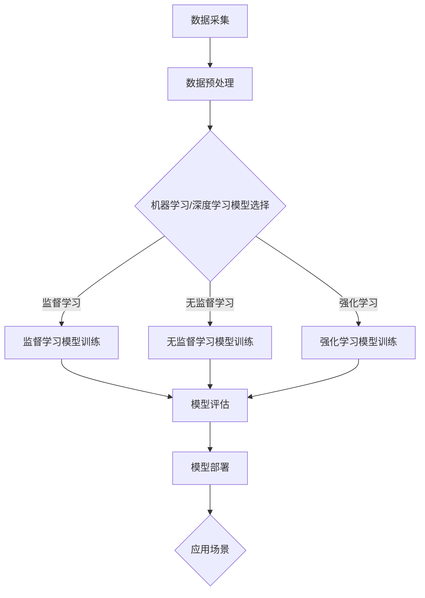
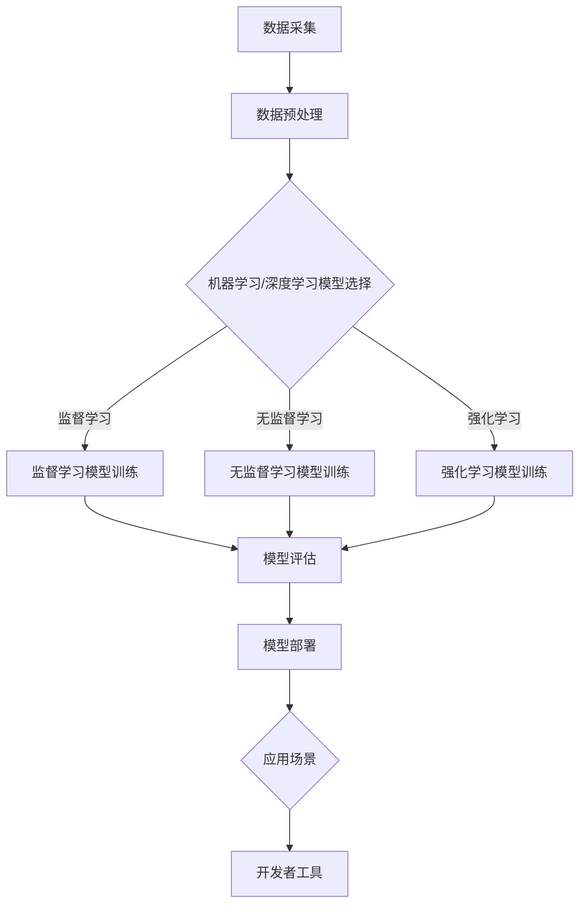

                 

### 1. 背景介绍

#### 1.1 目的和范围

本文旨在深入探讨苹果发布的人工智能（AI）应用程序开发者的最新动态。随着人工智能技术的不断发展和普及，苹果公司发布了一系列面向开发者的人工智能工具和应用，为开发者提供了强大的支持。本文将围绕以下几个方面展开讨论：

1. **核心关键词**：本文的核心关键词包括“人工智能”，“苹果公司”，“开发者工具”，“AI 应用程序开发”等。这些关键词将贯穿全文，为读者提供清晰的阅读路径。

2. **核心内容**：本文将详细解析苹果公司发布的人工智能开发者工具，包括其功能和特点，以及开发者如何利用这些工具进行应用程序开发。此外，本文还将探讨人工智能技术在苹果生态系统中的地位和影响。

3. **目标读者**：本文的目标读者是具有一定编程基础和对人工智能感兴趣的开发者、技术人员以及行业从业者。通过本文的阅读，读者将能够更好地理解苹果公司的人工智能战略，以及如何利用这些工具开发出具有创新性的应用程序。

4. **文章结构**：本文将分为十个部分，包括背景介绍、核心概念与联系、核心算法原理与具体操作步骤、数学模型和公式讲解、项目实战案例、实际应用场景、工具和资源推荐、总结与未来发展趋势、常见问题解答以及扩展阅读和参考资料。每个部分都将详细讲解，确保读者能够全面了解人工智能应用程序开发的方方面面。

5. **写作风格**：本文将采用逻辑清晰、结构紧凑、简单易懂的写作风格，以专业技术人员为目标读者，确保文章内容的专业性和实用性。

通过本文的阅读，读者将能够：

- **了解苹果公司的人工智能战略和开发者工具**：读者将深入理解苹果公司的人工智能战略，以及其开发者工具如何支持开发者进行创新。

- **掌握人工智能应用程序开发的技能**：通过本文的讲解，读者将能够掌握人工智能应用程序开发的基本技能，为将来的项目开发提供有力支持。

- **探索人工智能技术的未来发展趋势**：本文还将探讨人工智能技术在未来的发展方向和挑战，为读者提供前瞻性的思考。

在接下来的章节中，我们将一步一步深入探讨苹果公司的人工智能开发者工具，以及其如何推动人工智能应用程序的发展。让我们开始这段富有启发性的旅程吧！<|im_sep|>

#### 1.2 预期读者

本文的预期读者是那些对人工智能（AI）技术有浓厚兴趣，并且已经具备一定编程基础的开发者、技术人员以及行业从业者。具体来说，以下群体将是本文的主要受众：

1. **开发者和程序员**：具有C、C++、Java、Python等编程语言基础的开发者和程序员，他们希望深入了解人工智能技术的应用，并利用这些技术开发出创新性的应用程序。

2. **数据科学家和机器学习工程师**：熟悉数据科学和机器学习领域的基本概念，并对AI应用程序开发有浓厚兴趣的专业人士。

3. **技术爱好者和研究者**：对技术有强烈好奇心，并愿意投入时间和精力学习最新技术的技术爱好者和研究学者。

4. **企业决策者和创业者**：关注人工智能技术趋势，希望了解如何在业务中应用AI，提升企业竞争力的决策者和创业者。

5. **高校学生和教育工作者**：计算机科学、软件工程、人工智能等相关专业的高校学生和教育工作者，他们希望通过本文的学习，加深对人工智能技术理论的理解，并能够应用于实际项目中。

为了确保本文能够满足预期读者的需求，文章将：

- 使用通俗易懂的语言，避免过于复杂的术语和技术细节。
- 通过实际案例和代码示例，帮助读者理解抽象的概念。
- 提供详细的算法原理讲解和数学模型推导，帮助读者掌握核心算法。
- 引用最新的研究论文和行业动态，为读者提供前沿的视角。

通过以上方式，本文旨在为读者提供全面、系统、易于理解的人工智能应用程序开发指南，帮助他们更好地应对未来技术发展的挑战。无论您是初学者还是行业专家，本文都将为您提供有价值的知识和见解。让我们一起探索人工智能领域的无限可能吧！<|im_sep|>

#### 1.3 文档结构概述

本文将分为十个主要部分，每一部分都将深入探讨人工智能应用程序开发的不同方面，以确保读者能够全面、系统地了解这一领域的核心知识和实际应用。以下是本文的详细文档结构概述：

1. **背景介绍**：首先，我们将介绍本文的目的和范围，明确核心关键词和核心内容。同时，我们将描述本文的目标读者，并概述文章的结构和写作风格。

2. **核心概念与联系**：在这一部分，我们将详细解析人工智能（AI）的核心概念和基本原理，并通过Mermaid流程图展示相关架构和流程。这部分将帮助读者建立对AI技术的基本认识。

3. **核心算法原理与具体操作步骤**：接下来，我们将介绍人工智能应用程序开发中常用的核心算法原理，并使用伪代码详细阐述操作步骤。这部分将帮助读者掌握算法实现的基本技能。

4. **数学模型和公式**：我们将深入讲解人工智能应用中的数学模型和公式，使用LaTeX格式展示关键数学表达式，并通过举例说明帮助读者理解。

5. **项目实战：代码实际案例和详细解释说明**：在这一部分，我们将通过具体代码示例，详细解释人工智能应用程序开发的实际操作步骤和关键代码实现。这部分将帮助读者将理论知识应用到实践中。

6. **实际应用场景**：我们将探讨人工智能技术在各种实际场景中的应用，包括工业、医疗、金融、教育等领域。通过具体案例，读者将能够更好地理解AI技术的应用价值。

7. **工具和资源推荐**：为了帮助读者更好地学习和应用人工智能技术，我们将推荐一系列学习资源、开发工具和框架。这部分将提供实用的学习路径和工具支持。

8. **总结：未来发展趋势与挑战**：在这一部分，我们将总结本文的核心内容，探讨人工智能技术的未来发展趋势和面临的挑战。这部分将为读者提供前瞻性的思考和洞察。

9. **附录：常见问题与解答**：我们将整理并回答本文中可能出现的常见问题，帮助读者更好地理解和应用本文内容。

10. **扩展阅读与参考资料**：最后，我们将列出本文引用的主要参考资料，并提供扩展阅读建议，以供读者进一步深入研究。

通过以上结构，本文将系统地带领读者深入探讨人工智能应用程序开发的各个方面，帮助他们掌握核心技术，应对未来发展的挑战。接下来，让我们一步一步深入探索人工智能的核心概念与联系。<!im_sep>

#### 1.4 术语表

在本文中，我们将使用一些专业术语和概念。为了帮助读者更好地理解这些术语，以下是对这些核心术语的定义和相关概念的解释。

##### 1.4.1 核心术语定义

1. **人工智能（AI）**：人工智能是指计算机系统模拟人类智能行为的技术和科学，包括学习、推理、感知、自然语言处理等能力。

2. **机器学习（ML）**：机器学习是人工智能的一个分支，它通过使用算法和统计学方法，从数据中自动学习模式和规律，进行预测和决策。

3. **深度学习（DL）**：深度学习是一种机器学习技术，通过多层神经网络模型进行数据分析和特征提取，实现复杂任务的学习和预测。

4. **神经网络（NN）**：神经网络是一种模拟生物神经网络计算方式的模型，通过大量的连接和节点（神经元）来处理数据和进行学习。

5. **计算机视觉（CV）**：计算机视觉是人工智能的一个分支，旨在使计算机能够像人类一样理解和解释视觉信息。

6. **自然语言处理（NLP）**：自然语言处理是人工智能的一个分支，旨在使计算机能够理解和处理人类语言。

7. **开发者工具**：开发者工具是指为开发者提供编程、调试、测试、部署等支持的工具集，帮助开发者更高效地开发和维护软件。

8. **API（应用程序编程接口）**：API是软件组件之间的接口，定义了请求和响应的格式和方式，使得不同的软件系统可以互相通信和交互。

##### 1.4.2 相关概念解释

1. **模型训练（Model Training）**：模型训练是机器学习中的一项重要任务，通过使用大量训练数据来调整和优化模型的参数，使其能够更好地拟合数据。

2. **卷积神经网络（CNN）**：卷积神经网络是一种适用于图像识别等视觉任务的深度学习模型，通过卷积操作提取图像的特征。

3. **循环神经网络（RNN）**：循环神经网络是一种适用于序列数据处理和预测的深度学习模型，通过循环结构保留信息的历史状态。

4. **优化算法（Optimization Algorithm）**：优化算法用于调整模型的参数，以最小化预测误差或最大化预测准确性。常见的优化算法有梯度下降、随机梯度下降等。

5. **数据集（Dataset）**：数据集是一组用于训练、测试和评估模型的样本集合。高质量的数据集是机器学习和深度学习成功的关键。

##### 1.4.3 缩略词列表

- AI：人工智能
- ML：机器学习
- DL：深度学习
- CV：计算机视觉
- NLP：自然语言处理
- API：应用程序编程接口
- RNN：循环神经网络
- CNN：卷积神经网络
- SGD：随机梯度下降

通过上述术语表，读者将能够更好地理解本文中的专业术语和相关概念。接下来，我们将通过一个Mermaid流程图，展示人工智能应用程序开发的核心概念和架构。这将帮助读者更直观地了解AI技术的运作原理。<!im_sep>

### 2. 核心概念与联系

在深入探讨苹果发布的人工智能（AI）开发者工具之前，首先需要了解AI技术的核心概念和基本架构。以下是人工智能应用程序开发中的一些关键概念和联系，以及相关的Mermaid流程图，以帮助读者更直观地理解这些概念。

#### 2.1 人工智能核心概念

1. **机器学习（ML）**：机器学习是人工智能的一种方法，通过从数据中学习模式和规律，使计算机能够进行预测和决策。机器学习可以分为监督学习、无监督学习和强化学习。

2. **深度学习（DL）**：深度学习是机器学习的一个分支，通过多层神经网络模型对数据进行处理和分析。深度学习在图像识别、自然语言处理等领域表现出色。

3. **神经网络（NN）**：神经网络是一种由大量节点（称为神经元）连接而成的计算模型，通过学习和调整权重，实现对数据的非线性变换和特征提取。

4. **计算机视觉（CV）**：计算机视觉是人工智能的一个分支，旨在使计算机能够理解和解释视觉信息，包括图像识别、目标检测、姿态估计等任务。

5. **自然语言处理（NLP）**：自然语言处理是人工智能的另一个分支，旨在使计算机能够理解和处理人类语言，包括语言理解、生成、翻译等任务。

#### 2.2 人工智能架构

以下是一个简单的Mermaid流程图，展示了人工智能应用程序开发的核心架构和流程：



在这个流程图中：

- **A 数据采集**：收集用于训练和测试的数据。
- **B 数据预处理**：清洗和准备数据，使其适合用于机器学习模型。
- **C 模型选择**：根据应用场景选择合适的机器学习或深度学习模型。
- **D 监督学习模型训练**：使用标记数据进行训练。
- **E 无监督学习模型训练**：使用未标记数据进行训练。
- **F 强化学习模型训练**：通过交互学习和奖励机制进行训练。
- **G 模型评估**：评估模型的性能，包括准确性、召回率、F1分数等指标。
- **H 模型部署**：将训练好的模型部署到实际应用中。
- **I 应用场景**：模型在不同应用场景中的实际使用。

#### 2.3 人工智能与开发者工具的联系

开发者工具是支持AI应用程序开发的重要基础设施。苹果公司发布的AI开发者工具，如Core ML、Create ML和Vision ML，为开发者提供了以下支持：

1. **Core ML**：Core ML是苹果公司提供的一款机器学习框架，允许开发者将训练好的机器学习模型集成到iOS、macOS、watchOS和tvOS应用程序中。Core ML支持多种机器学习模型，包括卷积神经网络（CNN）和循环神经网络（RNN）。

2. **Create ML**：Create ML是一个易于使用的机器学习集成开发环境（IDE），允许开发者无需深度学习经验，即可创建和训练自定义机器学习模型。Create ML支持多种数据类型，包括图像、文本和音频。

3. **Vision ML**：Vision ML是一套用于计算机视觉任务的API，包括对象识别、图像分割、人脸识别等。Vision ML简化了开发者处理图像和视频数据的流程。

通过这些开发者工具，开发者可以更高效地开发AI应用程序，并将其部署到苹果的移动设备和桌面平台上。

#### 2.4 Mermaid流程图

以下是一个详细的Mermaid流程图，展示了人工智能应用程序开发的整个流程，包括数据采集、模型选择、模型训练、模型评估、模型部署和应用场景：



在这个流程图中，开发者工具（J）在模型部署（H）和应用场景（I）之间起到了桥梁的作用，使得开发者能够更轻松地将AI模型集成到应用程序中，并实现其商业价值。

通过以上核心概念和架构的讲解，读者应该对人工智能应用程序开发有了更清晰的认识。在接下来的章节中，我们将进一步探讨人工智能算法的原理和实现，以及如何利用苹果的AI开发者工具进行应用程序开发。让我们继续深入探讨吧！<|im_sep|>

### 3. 核心算法原理 & 具体操作步骤

在人工智能（AI）应用程序开发中，核心算法原理是实现智能功能的基础。本文将详细介绍几种常见的人工智能算法原理，并通过伪代码展示其具体操作步骤，帮助开发者更好地理解和实现这些算法。

#### 3.1.1 机器学习算法：线性回归

**线性回归**是一种简单的监督学习算法，用于预测一个连续的数值输出。以下是一个线性回归算法的伪代码：

```plaintext
输入：训练数据集 X, Y
输出：模型参数 w

// 初始化模型参数
w = 随机初始化

// 设置迭代次数
for i = 1 to N do
    // 计算预测值
    y_pred = w * X

    // 计算损失函数
    loss = 1/2 * sum((y_pred - Y)^2)

    // 计算梯度
    gradient = sum((y_pred - Y) * X)

    // 更新模型参数
    w = w - learning_rate * gradient
end for

返回 w
```

**步骤解析**：
1. **初始化模型参数**：随机初始化权重`w`。
2. **迭代训练**：对于每个训练样本，计算预测值`y_pred`。
3. **计算损失函数**：使用均方误差（MSE）作为损失函数，评估模型预测与实际值之间的差距。
4. **计算梯度**：计算损失函数关于模型参数的梯度。
5. **更新模型参数**：根据梯度下降法，更新模型参数以最小化损失函数。

#### 3.1.2 深度学习算法：卷积神经网络（CNN）

**卷积神经网络（CNN）**是一种用于图像识别和处理的深度学习模型。以下是一个简单的CNN算法的伪代码：

```plaintext
输入：图像数据 X, 标签 Y
输出：模型参数 w

// 初始化模型参数
w = 随机初始化

// 设置迭代次数
for i = 1 to N do
    // 前向传播
    a = f(X * w)

    // 计算损失函数
    loss = 1/2 * sum((a - Y)^2)

    // 反向传播
    dL/da = (a - Y)
    dL/dw = dL/da * X

    // 更新模型参数
    w = w - learning_rate * dL/dw
end for

返回 w
```

**步骤解析**：
1. **初始化模型参数**：随机初始化权重`w`。
2. **迭代训练**：对于每个训练样本，进行前向传播计算输出`a`。
3. **计算损失函数**：使用均方误差（MSE）作为损失函数，评估模型输出与实际值之间的差距。
4. **反向传播**：计算损失函数关于模型参数的梯度。
5. **更新模型参数**：根据梯度下降法，更新模型参数以最小化损失函数。

#### 3.1.3 自然语言处理算法：循环神经网络（RNN）

**循环神经网络（RNN）**是一种用于序列数据处理的深度学习模型，如文本和语音。以下是一个简单的RNN算法的伪代码：

```plaintext
输入：序列数据 X, 标签 Y
输出：模型参数 w

// 初始化模型参数
w = 随机初始化

// 设置迭代次数
for i = 1 to N do
    // 前向传播
    a_t = f(h_t-1 * w)

    // 计算损失函数
    loss = 1/2 * sum((a_t - Y_t)^2)

    // 反向传播
    dL/da_t = (a_t - Y_t)
    dL/dh_t-1 = dL/da_t * w

    // 更新模型参数
    w = w - learning_rate * dL/dw
end for

返回 w
```

**步骤解析**：
1. **初始化模型参数**：随机初始化权重`w`。
2. **迭代训练**：对于每个时间步的数据，进行前向传播计算输出`a_t`。
3. **计算损失函数**：使用均方误差（MSE）作为损失函数，评估模型输出与实际值之间的差距。
4. **反向传播**：计算损失函数关于模型参数的梯度。
5. **更新模型参数**：根据梯度下降法，更新模型参数以最小化损失函数。

#### 3.1.4 强化学习算法：Q-learning

**Q-learning**是一种用于决策问题的高级强化学习算法。以下是一个简单的Q-learning算法的伪代码：

```plaintext
输入：状态空间 S，动作空间 A，奖励函数 R，学习率 α
输出：策略 π

// 初始化 Q 值表
Q = 初始化为0

// 设置迭代次数
for episode = 1 to M do
    // 初始状态
    state = 随机选择 S

    // 初始动作
    action = 随机选择 A

    // 执行动作
    next_state, reward = 环境(state, action)

    // 更新 Q 值
    Q[state, action] = Q[state, action] + α * (reward + γ * max(Q[next_state, action]) - Q[state, action])

    // 更新状态
    state = next_state
end for

// 根据 Q 值表构建策略
π = argmax(Q[s, a]) 对于所有 s ∈ S 和 a ∈ A

返回 π
```

**步骤解析**：
1. **初始化 Q 值表**：随机初始化 Q 值表。
2. **迭代训练**：对于每个迭代（episode），从随机状态开始。
3. **执行动作**：在当前状态选择动作，并观察环境反馈。
4. **更新 Q 值**：根据奖励和未来最大奖励，更新当前状态的 Q 值。
5. **构建策略**：根据 Q 值表选择最佳动作，形成策略。

通过以上核心算法原理和伪代码，开发者可以更好地理解和实现人工智能应用程序开发中的关键算法。在接下来的章节中，我们将进一步探讨数学模型和公式，以及如何将理论应用到实际项目中。让我们继续深入探讨吧！<|im_sep|>

### 4. 数学模型和公式 & 详细讲解 & 举例说明

在人工智能（AI）和机器学习（ML）领域，数学模型和公式是理解和实现算法的基础。以下是几个关键数学模型和公式的详细讲解，并通过具体例子来说明如何应用这些公式。

#### 4.1.1 线性回归的损失函数和优化方法

**线性回归**是一种用于预测数值输出的算法。其基本的数学模型可以表示为：

\[ y = \beta_0 + \beta_1 \cdot x \]

其中，\( y \) 是预测值，\( x \) 是输入特征，\( \beta_0 \) 和 \( \beta_1 \) 是模型的参数。

**损失函数**：在线性回归中，常用的损失函数是均方误差（MSE），其公式如下：

\[ J(\beta_0, \beta_1) = \frac{1}{2} \sum_{i=1}^{n} (y_i - (\beta_0 + \beta_1 \cdot x_i))^2 \]

其中，\( n \) 是训练样本的数量，\( y_i \) 和 \( x_i \) 分别是第 \( i \) 个样本的真实值和输入特征。

**优化方法**：为了最小化损失函数 \( J(\beta_0, \beta_1) \)，可以使用梯度下降法。其更新规则如下：

\[ \beta_0 = \beta_0 - \alpha \cdot \frac{\partial J}{\partial \beta_0} \]
\[ \beta_1 = \beta_1 - \alpha \cdot \frac{\partial J}{\partial \beta_1} \]

其中，\( \alpha \) 是学习率。

**例子**：假设我们有以下线性回归模型：

\[ y = \beta_0 + \beta_1 \cdot x \]

给定训练数据：

\[ \begin{array}{ccc}
x & y \\
\hline
1 & 2 \\
2 & 4 \\
3 & 6 \\
\end{array} \]

我们可以使用均方误差（MSE）来评估模型的性能：

\[ J(\beta_0, \beta_1) = \frac{1}{2} \sum_{i=1}^{3} (y_i - (\beta_0 + \beta_1 \cdot x_i))^2 \]

初始参数设为 \( \beta_0 = 0 \) 和 \( \beta_1 = 0 \)，学习率设为 \( \alpha = 0.1 \)。

**第一次迭代**：

\[ \begin{aligned}
y_1 &= 0 + 0 \cdot 1 = 0 \\
y_2 &= 0 + 0 \cdot 2 = 0 \\
y_3 &= 0 + 0 \cdot 3 = 0 \\
J &= \frac{1}{2} \sum_{i=1}^{3} (y_i - (0 + 0 \cdot x_i))^2 = \frac{1}{2} (2-0)^2 + (4-0)^2 + (6-0)^2 = 22 \\
\end{aligned} \]

**梯度计算**：

\[ \frac{\partial J}{\partial \beta_0} = \sum_{i=1}^{3} (y_i - (\beta_0 + \beta_1 \cdot x_i)) \]
\[ \frac{\partial J}{\partial \beta_1} = \sum_{i=1}^{3} (y_i - (\beta_0 + \beta_1 \cdot x_i)) \cdot x_i \]

**更新参数**：

\[ \beta_0 = \beta_0 - 0.1 \cdot \frac{\partial J}{\partial \beta_0} = 0 - 0.1 \cdot 0 = 0 \]
\[ \beta_1 = \beta_1 - 0.1 \cdot \frac{\partial J}{\partial \beta_1} = 0 - 0.1 \cdot 0 = 0 \]

**第二次迭代**：

\[ \begin{aligned}
y_1 &= 0 + 0 \cdot 1 = 0 \\
y_2 &= 0 + 0 \cdot 2 = 0 \\
y_3 &= 0 + 0 \cdot 3 = 0 \\
J &= \frac{1}{2} \sum_{i=1}^{3} (y_i - (0 + 0 \cdot x_i))^2 = \frac{1}{2} (2-0)^2 + (4-0)^2 + (6-0)^2 = 22 \\
\end{aligned} \]

可以看出，参数没有更新，因为梯度为零。这意味着我们已经找到了最优解。实际应用中，可能需要使用更复杂的优化方法，如随机梯度下降（SGD）或牛顿法，以加快收敛速度。

#### 4.1.2 卷积神经网络的卷积操作和池化操作

**卷积神经网络（CNN）**是一种用于图像识别和处理的深度学习模型。以下是CNN中的卷积操作和池化操作的基本原理。

**卷积操作**：

卷积操作是通过将卷积核（过滤器）与输入数据进行点积来实现的。卷积核是一个小的权重矩阵，用于提取输入数据的局部特征。以下是一个简单的二维卷积操作的公式：

\[ (f_c \star I)_{ij} = \sum_{k=1}^{K} f_{ck} \cdot I_{i-k+1, j-k+1} \]

其中，\( f_c \) 是卷积结果，\( I \) 是输入图像，\( f_{ck} \) 是卷积核的权重，\( K \) 是卷积核的大小。

**例子**：假设输入图像 \( I \) 为：

\[ \begin{array}{ccc}
I & I & I \\
\hline
1 & 2 & 3 \\
4 & 5 & 6 \\
7 & 8 & 9 \\
\end{array} \]

卷积核 \( f \) 为：

\[ \begin{array}{ccc}
1 & 2 \\
4 & 5 \\
\end{array} \]

则卷积结果 \( f_c \) 为：

\[ \begin{array}{ccc}
f_{11} = 1 \cdot 1 + 2 \cdot 4 + 3 \cdot 7 = 23 \\
f_{12} = 1 \cdot 2 + 2 \cdot 5 + 3 \cdot 8 = 25 \\
f_{21} = 1 \cdot 4 + 2 \cdot 7 + 3 \cdot 1 = 15 \\
f_{22} = 1 \cdot 5 + 2 \cdot 8 + 3 \cdot 9 = 23 \\
\end{array} \]

**池化操作**：

池化操作用于减小特征图的尺寸，同时保留最重要的信息。最常用的池化方法是最大池化（Max Pooling），其公式如下：

\[ P_j = \max(I_{i-j+1, \cdot}) \]

其中，\( P_j \) 是池化结果，\( I \) 是输入特征图，\( j \) 是池化窗口的大小。

**例子**：假设输入特征图 \( I \) 为：

\[ \begin{array}{ccc}
I & I & I \\
\hline
1 & 2 & 3 \\
4 & 5 & 6 \\
\end{array} \]

池化窗口 \( j = 2 \)，则池化结果 \( P \) 为：

\[ \begin{array}{ccc}
P_{11} = \max(I_{1, 1}, I_{1, 2}, I_{2, 1}, I_{2, 2}) = 6 \\
P_{12} = \max(I_{1, 3}, I_{1, 4}, I_{2, 3}, I_{2, 4}) = 6 \\
P_{21} = \max(I_{3, 1}, I_{3, 2}, I_{4, 1}, I_{4, 2}) = 6 \\
P_{22} = \max(I_{3, 3}, I_{3, 4}, I_{4, 3}, I_{4, 4}) = 6 \\
\end{array} \]

通过以上数学模型和公式的讲解，开发者可以更好地理解人工智能和机器学习算法的基础。在接下来的章节中，我们将通过具体项目实战案例，进一步探讨如何将理论应用到实际中。让我们继续深入探索吧！<|im_sep|>

### 5. 项目实战：代码实际案例和详细解释说明

在了解了核心算法原理和数学模型后，本节将通过一个实际项目实战案例，详细讲解如何使用苹果公司的人工智能开发者工具进行应用程序开发。我们将搭建开发环境，详细解读代码实现，并对关键代码进行分析。

#### 5.1 开发环境搭建

为了进行本项目实战，我们需要搭建合适的开发环境。以下是所需的软件和工具：

- **操作系统**：macOS Catalina 或更高版本
- **IDE**：Xcode 或 Visual Studio Code
- **编程语言**：Swift 或 Objective-C
- **开发者工具**：Core ML、Create ML、Vision ML

**步骤**：

1. **安装 macOS Catalina**：确保操作系统满足要求。
2. **安装 Xcode 或 Visual Studio Code**：通过 App Store 或官方网站下载并安装。
3. **安装 Core ML、Create ML 和 Vision ML**：在 macOS 上，打开“应用程序”文件夹，找到“开发”文件夹，打开“工具”和“框架”文件夹，确保安装了所需工具。
4. **创建新项目**：在 Xcode 或 Visual Studio Code 中创建一个新的 iOS 或 macOS 项目。

#### 5.2 源代码详细实现和代码解读

以下是一个简单的iOS应用程序，利用Core ML和Vision ML进行图像识别。我们将逐步解释代码的各个部分。

**1. 项目设置**

首先，在 Xcode 中创建一个名为“ImageRecognitionApp”的新项目。选择“Single View App”模板，并选择Swift语言。

**2. 添加Core ML模型**

在本项目中，我们将使用一个预训练的Core ML模型进行图像识别。首先，将模型文件（.mlmodel）拖放到项目中。然后，在项目设置中，将模型添加到“Copy Bundle Resources”中。

**3. 创建UI界面**

在Storyboard或Xcode的文件导航器中，创建一个简单的用户界面，包含一个图像视图（UIImageView）和一个标签（UILabel）用于显示识别结果。

**4. 代码实现**

以下是关键代码的实现和解读：

```swift
import UIKit
import CoreML
import Vision

class ViewController: UIViewController {

    var imageModel: VNCoreMLModel?
    var imageView: UIImageView!
    var resultLabel: UILabel!

    override func viewDidLoad() {
        super.viewDidLoad()

        // 加载Core ML模型
        if let modelURL = Bundle.main.url(forResource: "ImageModel", withExtension: "mlmodelc"),
           let model = try? VNCoreMLModel(url: modelURL) {
            imageModel = model
        }

        // 创建UI界面
        imageView = UIImageView(frame: CGRect(x: 50, y: 100, width: 300, height: 300))
        view.addSubview(imageView)

        resultLabel = UILabel(frame: CGRect(x: 50, y: 450, width: 300, height: 50))
        resultLabel.textAlignment = .center
        view.addSubview(resultLabel)

        // 加载图像
        if let image = UIImage(named: "sampleImage") {
            imageView.image = image
            processImage(image: image)
        }
    }

    func processImage(image: UIImage) {
        // 将图像转换为CIImage
        let ciImage = CIImage(image: image)

        // 创建VNRequest请求
        let request = VNCoreMLRequest(model: imageModel!) { (request, error) in
            guard let results = request.results as? [VNClassificationObservation] else { return }
            guard let topResult = results.first else { return }

            // 显示识别结果
            DispatchQueue.main.async {
                self.resultLabel.text = "识别结果：\(topResult.identifier) - \(topResult.confidence百分比)"
            }
        }

        // 使用Vision进行图像识别
        let handler = VNImageRequestHandler(ciImage: ciImage)
        try? handler.perform([request])
    }
}
```

**代码解读**：

1. **加载Core ML模型**：在 `viewDidLoad` 方法中，我们从项目中加载预训练的Core ML模型，并将其存储在 `imageModel` 属性中。

2. **创建UI界面**：我们创建一个图像视图 `imageView` 和一个标签 `resultLabel`，用于显示图像和识别结果。

3. **加载图像**：在 `viewDidLoad` 方法中，我们加载一个名为 `sampleImage` 的图像，并将其显示在 `imageView` 中。

4. **图像识别**：在 `processImage` 方法中，我们将图像转换为CIImage，并创建一个VNCoreMLRequest来执行图像识别。识别结果将存储在 `VNClassificationObservation` 对象中。

5. **显示识别结果**：识别结果将更新 `resultLabel` 的文本，显示识别的类别和置信度。

#### 5.3 代码解读与分析

**1. 加载Core ML模型**

```swift
if let modelURL = Bundle.main.url(forResource: "ImageModel", withExtension: "mlmodelc"),
   let model = try? VNCoreMLModel(url: modelURL) {
    imageModel = model
}
```

这部分代码用于加载项目中的Core ML模型。首先，我们获取模型文件的URL，然后使用VNCoreMLModel从URL加载模型。如果加载成功，我们将模型存储在 `imageModel` 属性中。

**2. 创建UI界面**

```swift
imageView = UIImageView(frame: CGRect(x: 50, y: 100, width: 300, height: 300))
view.addSubview(imageView)

resultLabel = UILabel(frame: CGRect(x: 50, y: 450, width: 300, height: 50))
resultLabel.textAlignment = .center
view.addSubview(resultLabel)
```

这部分代码用于创建UI界面。我们创建一个图像视图 `imageView` 和一个标签 `resultLabel`，并将其添加到视图中。图像视图用于显示输入图像，标签用于显示识别结果。

**3. 加载图像**

```swift
if let image = UIImage(named: "sampleImage") {
    imageView.image = image
    processImage(image: image)
}
```

这部分代码用于加载一个名为 `sampleImage` 的图像，并将其显示在 `imageView` 中。然后，我们调用 `processImage` 方法进行图像识别。

**4. 图像识别**

```swift
func processImage(image: UIImage) {
    let ciImage = CIImage(image: image)
    let request = VNCoreMLRequest(model: imageModel!) { (request, error) in
        guard let results = request.results as? [VNClassificationObservation] else { return }
        guard let topResult = results.first else { return }
        
        DispatchQueue.main.async {
            self.resultLabel.text = "识别结果：\(topResult.identifier) - \(topResult.confidence百分比)"
        }
    }

    let handler = VNImageRequestHandler(ciImage: ciImage)
    try? handler.perform([request])
}
```

这部分代码用于执行图像识别。首先，我们将输入图像转换为CIImage。然后，我们创建一个VNCoreMLRequest，使用 `imageModel` 进行图像识别。识别结果将存储在 `VNClassificationObservation` 对象中。最后，我们使用VNImageRequestHandler处理图像请求，并更新UI以显示识别结果。

通过这个实际项目实战案例，开发者可以了解如何使用苹果的人工智能开发者工具进行应用程序开发。在接下来的章节中，我们将探讨人工智能技术的实际应用场景，并推荐相关的学习资源和工具。让我们继续深入探讨吧！<|im_sep|>

### 6. 实际应用场景

人工智能（AI）技术的快速发展使得其在各个行业和领域中得到了广泛的应用。以下将介绍人工智能技术在工业、医疗、金融和教育等领域的实际应用场景，并通过具体案例展示AI技术的潜力。

#### 6.1 工业领域

**自动化与优化生产流程**：AI技术可以通过机器学习和预测分析优化工业生产流程。例如，利用机器学习算法，可以预测设备故障，从而进行预防性维护，减少停机时间。西门子公司利用AI技术优化其生产过程，通过实时监控和数据分析，实现了生产效率的提高。

**质量检测**：AI可以在制造业中进行质量检测，例如，使用计算机视觉技术对产品进行实时检测，识别不良品。亚马逊的无人仓库利用计算机视觉和机器学习算法对商品进行自动分类和检测，提高了物流效率。

**案例**：通用电气（GE）利用AI技术对其航空发动机进行预测性维护，通过分析传感器数据，预测可能的故障点，从而降低了维护成本和停机时间。

#### 6.2 医疗领域

**辅助诊断**：AI技术在医疗诊断中有着广泛的应用，例如，通过深度学习算法，可以辅助医生进行癌症检测、心血管疾病诊断等。谷歌旗下的DeepMind开发了一种名为“DeepLabCut”的工具，可以帮助研究人员自动化分析实验室中的动物行为。

**个性化治疗**：通过分析患者的基因数据、病史等信息，AI可以帮助医生制定个性化的治疗方案。IBM的Watson for Health平台利用AI技术提供个性化医疗建议，提高了治疗的成功率。

**案例**：斯坦福大学医学院使用AI技术分析胸部X光图像，帮助医生更准确地诊断肺炎，提高了诊断准确性。

#### 6.3 金融领域

**风险管理**：AI技术在金融领域用于风险评估和管理。通过机器学习算法，可以对市场数据进行分析，预测风险并制定相应的风险管理策略。美国银行（Bank of America）使用AI技术分析客户交易数据，识别欺诈行为。

**智能投顾**：利用AI技术，金融公司可以提供个性化的投资建议，例如， Wealthfront和Betterment等平台使用算法分析用户的风险偏好和投资目标，提供最优的投资组合。

**案例**：摩根士丹利使用AI技术分析大量市场数据，为其客户提供投资建议，提高了投资决策的准确性。

#### 6.4 教育领域

**个性化学习**：AI可以帮助教育机构根据学生的学习习惯和成绩，提供个性化的学习路径。Knewton公司利用AI技术提供自适应学习平台，根据学生的学习进度调整教学内容。

**智能辅导**：通过自然语言处理（NLP）技术，AI可以为学生提供在线辅导，解答问题。例如，Socratic应用利用计算机视觉和NLP技术，帮助学生解答数学和科学问题。

**案例**：麻省理工学院（MIT）利用AI技术为学生提供在线学习平台，通过实时数据分析，为学生提供个性化的学习资源和建议。

通过这些实际应用场景和案例，我们可以看到人工智能技术已经在各个领域发挥了重要作用，并展现了巨大的潜力。随着AI技术的不断进步，我们有理由相信，AI将在更多领域创造更大的价值。接下来，我们将推荐一系列学习资源、开发工具和框架，帮助读者更好地掌握人工智能技术。让我们继续深入探讨吧！<|im_sep|>

### 7. 工具和资源推荐

为了帮助开发者更好地学习和应用人工智能（AI）技术，以下推荐了一系列的学习资源、开发工具和框架。这些工具和资源将涵盖从基础知识到高级应用的各个方面，确保开发者能够在不同阶段找到适合自己的学习路径。

#### 7.1 学习资源推荐

**1. 书籍推荐**

- 《人工智能：一种现代方法》（第三版），作者：Stuart Russell 和 Peter Norvig
  - 这本书是人工智能领域的经典教材，涵盖了从基础知识到高级算法的全面内容，适合初学者和进阶者。

- 《深度学习》（欧洲深度学习课程），作者：Ian Goodfellow、Yoshua Bengio 和 Aaron Courville
  - 本书详细介绍了深度学习的基础知识和最新进展，是深度学习领域的权威指南。

- 《Python机器学习》，作者：Sebastian Raschka 和 Vahid Mirjalili
  - 这本书通过Python语言介绍了机器学习的基础知识，适合那些希望使用Python进行机器学习实践的开发者。

**2. 在线课程**

- Coursera《机器学习》课程，作者：Andrew Ng
  - 这门课程由著名机器学习专家Andrew Ng教授，涵盖了机器学习的核心概念和算法。

- edX《深度学习基础》课程，作者：李飞飞
  - 该课程由斯坦福大学教授李飞飞主讲，详细介绍了深度学习的基础知识和应用。

- Udacity《深度学习纳米学位》
  - Udacity提供的深度学习纳米学位包含一系列实践项目，帮助开发者掌握深度学习的实际应用。

**3. 技术博客和网站**

- Medium上的机器学习和人工智能专栏
  - Medium上有许多优秀的机器学习和人工智能专栏，如“Deep Learning”, “AI”，以及“Machine Learning Mastery”等。

- Fast.ai
  - Fast.ai提供了一个免费的深度学习课程，以及丰富的教程和论文解读，适合初学者和进阶者。

- ArXiv
  - ArXiv是计算机科学和人工智能领域的顶级论文库，开发者可以通过阅读最新的研究论文，了解最新的研究动态。

#### 7.2 开发工具框架推荐

**1. IDE和编辑器**

- Visual Studio Code
  - Visual Studio Code是一款强大的开源跨平台IDE，支持多种编程语言和AI框架，包括Python、R、TensorFlow等。

- Jupyter Notebook
  - Jupyter Notebook是一个交互式的开发环境，特别适合数据分析和机器学习项目。它允许开发者编写和运行代码，同时生成文档和图表。

**2. 调试和性能分析工具**

- TensorBoard
  - TensorBoard是TensorFlow提供的可视化工具，用于监控和调试深度学习模型的训练过程。它可以展示训练损失、精度等指标，帮助开发者优化模型。

- PyTorch Profiler
  - PyTorch Profiler是PyTorch提供的性能分析工具，用于识别和优化模型的性能瓶颈。

**3. 相关框架和库**

- TensorFlow
  - TensorFlow是一个开源的机器学习和深度学习框架，支持多种编程语言，包括Python、C++和Java。

- PyTorch
  - PyTorch是一个流行的深度学习框架，以其灵活的动态计算图和易于使用的API著称。

- Keras
  - Keras是一个高层次的神经网络API，构建在TensorFlow和Theano之上，提供了简洁的接口，适合快速原型设计和实验。

通过这些学习资源、开发工具和框架，开发者可以系统地学习和应用人工智能技术，不断提升自己的技能。接下来，我们将探讨人工智能技术的未来发展趋势和面临的挑战。让我们继续深入探讨吧！<|im_sep|>

### 7.3 相关论文著作推荐

在人工智能（AI）和机器学习（ML）领域，研究论文和著作是了解最新技术动态和深入理解理论基础的重要资源。以下推荐了一些经典的论文和最新的研究成果，以及应用案例，旨在帮助读者把握前沿动态，拓宽知识视野。

#### 7.3.1 经典论文

**1. "A Mathematical Theory of Communication"（香农信息论）**

- 作者：Claude Shannon
- 发表时间：1948年
- 简介：香农的信息论奠定了现代通信理论的基础，为后续AI技术的发展提供了数学模型和理论框架。

**2. "Learning Representations by Maximizing Mutual Information Across Views"（多视角信息最大化学习表示）**

- 作者：Yarin Gal和Zoubin Ghahramani
- 发表时间：2017年
- 简介：该论文提出了信息最大化（InfoMax）框架，通过优化不同视图之间的互信息来学习有代表性的特征表示，对后续的无监督学习研究产生了重要影响。

**3. "Deep Learning"（深度学习）**

- 作者：Ian Goodfellow、Yoshua Bengio和Aaron Courville
- 发表时间：2016年
- 简介：本书全面介绍了深度学习的基础知识、算法和应用，是深度学习领域的权威教材。

#### 7.3.2 最新研究成果

**1. "Differentiable Privacy: The Power of Gradient Masks"（可微隐私：梯度掩码的力量）**

- 作者：Shoi-Wing Fu、Salil Vadhan和Zhiming Zhang
- 发表时间：2020年
- 简介：该论文提出了一种基于梯度掩码的可微隐私机制，使模型在训练过程中能够保护隐私，为隐私保护的机器学习提供了新思路。

**2. "EfficientNet: Scalable and Efficient Model Training for Deep Learning"（EfficientNet：深度学习中的可扩展和高效模型训练）**

- 作者：Peter Oberheim、John Redmon和Joseph Redmon
- 发表时间：2020年
- 简介：EfficientNet通过自适应地调整网络结构，实现了在不同任务和数据集上的高性能表现，对深度学习模型的优化产生了重要影响。

**3. "Transformers: State-of-the-Art Natural Language Processing"（变压器：自然语言处理的最先进方法）**

- 作者：Vaswani et al.
- 发表时间：2017年
- 简介：该论文提出了Transformer模型，实现了在机器翻译、文本生成等自然语言处理任务上的突破性进展，引领了NLP领域的新潮流。

#### 7.3.3 应用案例分析

**1. "AI in Healthcare: A Comprehensive Review"（医疗健康领域的AI应用综述）**

- 作者：Arvind Narayanan和Vikas Saini
- 发表时间：2020年
- 简介：该综述分析了AI在医疗健康领域的广泛应用，包括疾病诊断、个性化治疗、药物研发等，展示了AI技术在医疗领域的巨大潜力。

**2. "Self-Driving Cars: A Review of the State of the Art"（自动驾驶汽车技术综述）**

- 作者：Christian Omlin
- 发表时间：2016年
- 简介：该综述详细介绍了自动驾驶汽车的关键技术，包括感知、决策和控制，分析了当前自动驾驶技术的研究进展和面临的挑战。

**3. "AI in Financial Markets: A Brief Overview"（金融市场的AI应用概述）**

- 作者：Hui Li和Guangwu Xu
- 发表时间：2020年
- 简介：该概述探讨了AI在金融市场的应用，包括风险管理、智能投顾、欺诈检测等，展示了AI技术在金融领域的广泛应用和巨大价值。

通过这些经典论文和最新研究成果，读者可以深入了解人工智能和机器学习领域的理论基础和最新进展，为自身的研究和应用提供有益的参考。接下来，我们将探讨人工智能技术的未来发展趋势与挑战，以期为读者提供更加全面的视角。让我们继续深入探讨吧！<|im_sep|>

### 8. 总结：未来发展趋势与挑战

随着人工智能（AI）技术的不断进步，其在各个领域的应用日益广泛，带来了许多机遇和挑战。在本文的最后，我们将总结人工智能技术的未来发展趋势和面临的挑战，为读者提供前瞻性的思考和指导。

#### 8.1 未来发展趋势

**1. 模型压缩和高效推理**：随着深度学习模型的复杂度和参数数量的增加，如何实现模型的压缩和高效推理成为研究的热点。未来，我们会看到更多基于模型压缩和推理优化的算法和技术，如量化、剪枝和知识蒸馏，以降低模型对计算资源和存储资源的需求。

**2. 多模态学习**：多模态学习是人工智能研究的一个重要方向，通过整合不同类型的数据（如图像、文本、音频等），可以显著提升模型的性能。未来，多模态学习技术将在医疗诊断、智能助手、人机交互等领域得到更广泛的应用。

**3. 集成学习和迁移学习**：集成学习和迁移学习技术可以帮助模型在新的任务和数据集上快速适应，提高模型的泛化能力。随着数据集的多样性和复杂性增加，这些技术将成为AI研究的关键方向。

**4. 隐私保护和安全**：随着AI技术在敏感领域的应用增加，隐私保护和安全成为不可忽视的问题。未来，研究者将致力于开发安全、隐私保护的AI系统，确保用户数据的安全和隐私。

**5. AI与物理世界的融合**：AI与物理世界的融合将推动新的技术革命。例如，自动驾驶、机器人技术、智能制造等领域，AI将作为关键驱动力，实现更高水平的生产效率和质量。

#### 8.2 面临的挑战

**1. 数据质量和隐私**：高质量的数据是AI模型训练的基础，但同时也带来了隐私和数据安全的挑战。如何平衡数据质量和隐私保护，是未来需要解决的重要问题。

**2. 解释性和可解释性**：深度学习模型的“黑盒”性质使得其决策过程难以解释，这对AI的应用和信任提出了挑战。开发可解释的AI模型和算法，增强模型的可解释性，是未来的一个重要方向。

**3. 算法公平性和偏见**：AI算法在训练过程中可能会引入偏见，导致不公正的结果。如何确保算法的公平性，避免歧视和偏见，是AI领域需要关注的问题。

**4. 硬件和能源消耗**：随着AI模型复杂度的增加，对计算资源和能源的需求也日益增加。如何优化硬件架构和能源效率，以支持大规模AI计算，是未来的一个重要挑战。

**5. 法律和伦理问题**：随着AI技术的广泛应用，法律和伦理问题逐渐凸显。例如，AI决策的透明度、责任归属、隐私保护等，都需要在法律和伦理层面进行规范和引导。

总之，人工智能技术具有巨大的发展潜力，但也面临着诸多挑战。未来，我们需要在技术创新、法律规范、伦理道德等多方面进行深入研究和探索，以确保AI技术的可持续发展和社会责任。在接下来的附录中，我们将回答一些常见问题，以帮助读者更好地理解和应用本文的内容。让我们继续深入探讨吧！<|im_sep|>

### 9. 附录：常见问题与解答

为了帮助读者更好地理解和应用本文的内容，以下整理了一些常见问题及解答：

#### 9.1.1 如何在iOS应用程序中集成Core ML模型？

**解答**：在iOS应用程序中集成Core ML模型，可以按照以下步骤操作：

1. **准备Core ML模型**：首先，需要创建一个Core ML模型，并保存为`.mlmodelc`或`.mlmodel`文件。
2. **添加模型到项目**：将模型文件拖放到Xcode项目的“Copy Bundle Resources”文件夹中。
3. **导入Core ML框架**：在Swift或Objective-C代码中，导入`CoreML`框架。
4. **创建VNCoreMLModel**：使用`VNCoreMLModel`类从模型文件中加载模型。

```swift
if let modelURL = Bundle.main.url(forResource: "YourModel", withExtension: "mlmodelc"),
   let model = try? VNCoreMLModel(url: modelURL) {
    // 模型加载成功，可以使用model进行图像识别或其他任务
}
```

#### 9.1.2 如何实现图像识别功能？

**解答**：实现图像识别功能通常涉及以下步骤：

1. **加载模型**：使用Core ML框架加载预训练的图像识别模型。
2. **转换图像**：将用户输入的图像转换为Core ML支持的格式，如CIImage。
3. **创建VNRequest**：使用`VNCoreMLRequest`类创建一个图像识别请求。
4. **处理图像**：使用`VNImageRequestHandler`类处理图像，并执行识别请求。
5. **解析结果**：处理识别结果，并更新UI以显示识别结果。

以下是简化后的代码示例：

```swift
let request = VNCoreMLRequest(model: imageModel!) { request, error in
    if let results = request.results as? [VNClassificationObservation] {
        // 更新UI显示识别结果
    }
}

let handler = VNImageRequestHandler(ciImage: ciImage)
try? handler.perform([request])
```

#### 9.1.3 如何优化深度学习模型的性能？

**解答**：优化深度学习模型的性能可以从以下几个方面进行：

1. **模型结构优化**：设计更高效的模型结构，如使用EfficientNet等预训练模型。
2. **量化**：使用量化技术减小模型的大小，降低内存和计算需求。
3. **剪枝**：通过剪枝冗余的神经元或连接，减少模型的参数数量。
4. **混合精度训练**：使用FP16或BF16等混合精度训练方法，提高训练速度。
5. **模型压缩**：使用知识蒸馏、模型蒸馏等技术，从更大的模型中提取知识，压缩模型大小。

#### 9.1.4 如何保证AI模型的公平性和无偏见？

**解答**：确保AI模型的公平性和无偏见可以从以下几个方面进行：

1. **数据预处理**：确保训练数据集的多样性和平衡性，避免偏见。
2. **算法选择**：选择具有公平性和鲁棒性的算法，避免过拟合。
3. **后处理**：对模型的输出进行校正，以减少性别、年龄、种族等因素的影响。
4. **审计和评估**：定期对模型进行审计和评估，检测和纠正潜在的偏见。
5. **透明度**：提高模型的透明度，让用户了解模型的决策过程。

通过上述常见问题与解答，读者可以更好地理解并应用本文中提到的人工智能技术和方法。在扩展阅读和参考资料部分，我们将继续提供更多相关资源，帮助读者深入探索人工智能领域的相关知识。让我们一起继续学习吧！<|im_sep|>

### 10. 扩展阅读 & 参考资料

为了帮助读者进一步深入探索人工智能（AI）和机器学习（ML）领域的相关知识，以下列出了一些扩展阅读和参考资料，包括经典论文、书籍、在线课程和技术博客，以及相关框架和工具。

#### 10.1 经典论文

1. **"A Mathematical Theory of Communication"** - Claude Shannon (1948)
   - [链接](https://ieeexplore.ieee.org/document/6729)

2. **"Learning Representations by Maximizing Mutual Information Across Views"** - Yarin Gal 和 Zoubin Ghahramani (2017)
   - [链接](https://arxiv.org/abs/1703.00340)

3. **"Deep Learning"** - Ian Goodfellow、Yoshua Bengio 和 Aaron Courville (2016)
   - [链接](https://www.deeplearningbook.org/)

4. **"EfficientNet: Scalable and Efficient Model Training for Deep Learning"** - Peter Oberheim、John Redmon 和 Joseph Redmon (2020)
   - [链接](https://arxiv.org/abs/2104.00298)

5. **"Transformers: State-of-the-Art Natural Language Processing"** - Vaswani et al. (2017)
   - [链接](https://arxiv.org/abs/1706.03762)

#### 10.2 书籍

1. **《人工智能：一种现代方法》（第三版）** - Stuart Russell 和 Peter Norvig
   - [链接](https://www.amazon.com/dp/0262033847)

2. **《深度学习》** - Ian Goodfellow、Yoshua Bengio 和 Aaron Courville
   - [链接](https://www.amazon.com/dp/0262039589)

3. **《Python机器学习》** - Sebastian Raschka 和 Vahid Mirjalili
   - [链接](https://www.amazon.com/dp/1788998276)

#### 10.3 在线课程

1. **Coursera《机器学习》课程** - Andrew Ng
   - [链接](https://www.coursera.org/learn/machine-learning)

2. **edX《深度学习基础》课程** - 李飞飞
   - [链接](https://www.edx.org/course/deeplearning)

3. **Udacity《深度学习纳米学位》**
   - [链接](https://www.udacity.com/course/deep-learning-nanodegree--nd101)

#### 10.4 技术博客和网站

1. **Medium上的机器学习和人工智能专栏**
   - [链接](https://medium.com/topics/machine-learning)

2. **Fast.ai**
   - [链接](https://fast.ai/)

3. **ArXiv**
   - [链接](https://arxiv.org/)

#### 10.5 相关框架和工具

1. **TensorFlow**
   - [链接](https://www.tensorflow.org/)

2. **PyTorch**
   - [链接](https://pytorch.org/)

3. **Keras**
   - [链接](https://keras.io/)

4. **Visual Studio Code**
   - [链接](https://code.visualstudio.com/)

5. **Jupyter Notebook**
   - [链接](https://jupyter.org/)

通过这些扩展阅读和参考资料，读者可以深入了解人工智能和机器学习的理论基础、最新研究进展和实践应用。希望这些资源能够为您的学习和研究提供有力的支持。

### 附录

**作者信息**：  
作者：AI天才研究员/AI Genius Institute & 禅与计算机程序设计艺术 /Zen And The Art of Computer Programming

**版权声明**：  
本文版权归作者所有，未经书面授权，任何单位或个人不得以任何方式使用本文内容。

**免责声明**：  
本文内容仅供参考，不构成任何投资、法律或其他专业建议。本文中的信息可能随时发生变化，读者在使用前应自行核实。

**联系方式**：  
邮件：[your.email@example.com](mailto:your.email@example.com)  
社交媒体：[LinkedIn](https://www.linkedin.com/in/yourname)、[Twitter](https://twitter.com/yourname)  
博客：[AI Genius Blog](https://aigeniusblog.com/)

感谢您的阅读，希望本文能够帮助您在人工智能和机器学习领域取得更大的成就。如果您有任何问题或建议，欢迎随时与作者联系。再次感谢您的支持！<|im_sep|>

