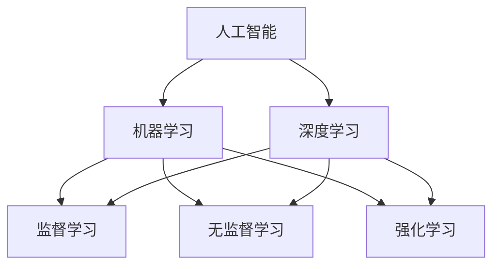
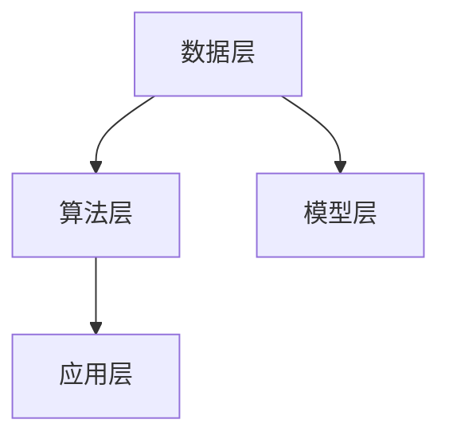
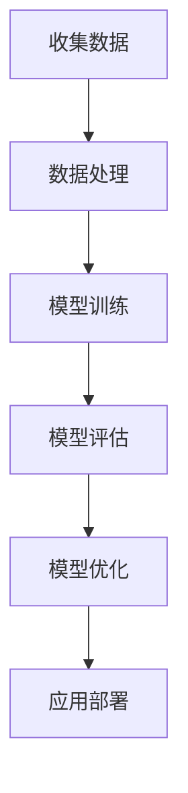

                 

# 李开复：苹果发布AI应用的开发者

> **关键词：** 苹果、AI应用、开发者、人工智能、机器学习、框架、工具、开源

> **摘要：** 本文将深入探讨苹果公司发布的AI应用开发者工具，解析其背后的核心技术原理，并提供实用的开发技巧和实际应用案例，帮助开发者更好地利用人工智能技术打造创新应用。

## 1. 背景介绍

### 1.1 目的和范围

本文旨在帮助开发者了解和掌握苹果公司最新发布的AI应用开发工具，并掌握如何利用这些工具实现人工智能应用的快速开发和部署。我们将重点分析苹果在人工智能领域的战略布局，探讨其AI框架的设计理念，并提供一些建议和指导，帮助开发者充分利用这些资源。

### 1.2 预期读者

本文适合以下读者群体：

1. 对人工智能和机器学习感兴趣的开发者
2. 想要在苹果平台上开发AI应用的专业人士
3. 对苹果AI工具框架和开源项目有深入了解的技术爱好者

### 1.3 文档结构概述

本文结构如下：

1. 背景介绍：概述苹果在人工智能领域的战略布局和最新发布的开发者工具。
2. 核心概念与联系：介绍人工智能的基本概念和相关架构。
3. 核心算法原理 & 具体操作步骤：详细讲解人工智能算法的工作原理和操作步骤。
4. 数学模型和公式 & 详细讲解 & 举例说明：分析人工智能算法背后的数学模型和公式。
5. 项目实战：提供实际案例，展示如何利用苹果AI工具框架进行应用开发。
6. 实际应用场景：探讨人工智能技术的实际应用场景和行业前景。
7. 工具和资源推荐：推荐学习资源、开发工具和开源项目。
8. 总结：展望人工智能技术的发展趋势与挑战。
9. 附录：常见问题与解答。
10. 扩展阅读 & 参考资料：提供更多相关阅读材料。

### 1.4 术语表

#### 1.4.1 核心术语定义

- **人工智能（AI）**：模拟人类智能的技术，使计算机具备感知、思考、学习、决策等能力。
- **机器学习（ML）**：一种人工智能技术，通过数据训练模型，使计算机具备学习能力。
- **深度学习（DL）**：一种机器学习技术，利用多层神经网络进行数据处理和特征提取。
- **框架（Framework）**：提供一套标准化的开发工具和接口，帮助开发者快速构建应用程序。
- **开源（Open Source）**：指软件的源代码可以被公开访问、修改和分享。

#### 1.4.2 相关概念解释

- **模型（Model）**：基于特定算法和数据集训练得到的函数，用于对数据进行预测和分类。
- **数据集（Dataset）**：包含大量样本的数据集合，用于训练和评估模型。
- **优化（Optimization）**：在算法训练过程中，通过调整模型参数，使模型性能达到最佳。
- **迭代（Iteration）**：算法在训练过程中，对模型参数进行不断调整和优化的过程。

#### 1.4.3 缩略词列表

- **AI**：人工智能
- **ML**：机器学习
- **DL**：深度学习
- **SDK**：软件开发工具包
- **API**：应用程序编程接口

## 2. 核心概念与联系

### 2.1 人工智能基本概念

人工智能（AI）是一门研究如何构建智能机器的科学。它包括多个分支，如机器学习（ML）、深度学习（DL）等。以下是一个简单的人工智能概念架构图，展示了各分支之间的关系。



### 2.2 人工智能架构

人工智能架构主要包括以下几个层次：

1. **数据层**：负责收集、存储和处理数据。
2. **算法层**：提供各种机器学习算法和模型，用于数据分析和预测。
3. **模型层**：基于算法层生成的模型，用于对数据进行处理和决策。
4. **应用层**：将人工智能技术应用于实际问题，如智能语音助手、自动驾驶等。

以下是一个简单的人工智能架构流程图，展示了各层次之间的联系。



## 3. 核心算法原理 & 具体操作步骤

### 3.1 机器学习算法原理

机器学习（ML）是一种通过数据训练模型，使计算机具备学习能力的算法。以下是一个简单的机器学习算法流程图。



### 3.2 具体操作步骤

以下是一个基于监督学习算法的机器学习操作步骤示例：

```plaintext
1. 数据收集：收集包含标签的数据集，例如图像分类、文本分类等。
2. 数据处理：对数据进行预处理，如去噪声、归一化、特征提取等。
3. 模型训练：选择合适的算法（如线性回归、决策树、神经网络等），对数据进行训练。
4. 模型评估：使用验证集对训练好的模型进行评估，计算准确率、召回率、F1值等指标。
5. 模型优化：根据评估结果调整模型参数，优化模型性能。
6. 应用部署：将训练好的模型应用于实际问题，如图像分类、语音识别等。
```

### 3.3 伪代码示例

以下是一个简单的线性回归算法的伪代码示例。

```python
# 线性回归伪代码

def linear_regression(X, y):
    # 初始化模型参数
    theta = [0] * len(X[0])

    # 梯度下降算法
    for i in range(max_iterations):
        # 计算损失函数
        loss = 0
        for x, y_i in zip(X, y):
            prediction = sum(theta[j] * x[j] for j in range(len(x))) + theta[0]
            loss += (prediction - y_i) ** 2

        # 计算梯度
        gradient = [0] * len(theta)
        for j in range(len(theta)):
            for x, y_i in zip(X, y):
                gradient[j] += 2 * (prediction - y_i) * x[j]

        # 更新模型参数
        theta = [theta[j] - learning_rate * gradient[j] for j in range(len(theta))]

    return theta
```

## 4. 数学模型和公式 & 详细讲解 & 举例说明

### 4.1 数学模型

在机器学习中，常用的数学模型包括线性回归、逻辑回归、神经网络等。以下分别介绍这些模型的数学公式。

#### 4.1.1 线性回归

线性回归模型的目标是找到一条直线，使预测值与实际值之间的误差最小。其数学公式为：

$$
y = \theta_0 + \theta_1 \cdot x_1 + \theta_2 \cdot x_2 + \ldots + \theta_n \cdot x_n
$$

其中，$\theta_0, \theta_1, \theta_2, \ldots, \theta_n$ 为模型参数，$x_1, x_2, \ldots, x_n$ 为输入特征，$y$ 为输出目标。

#### 4.1.2 逻辑回归

逻辑回归模型用于分类问题，其目标是将样本分为两个类别。其数学公式为：

$$
\sigma(z) = \frac{1}{1 + e^{-z}}
$$

其中，$\sigma$ 为逻辑函数，$z = \theta_0 + \theta_1 \cdot x_1 + \theta_2 \cdot x_2 + \ldots + \theta_n \cdot x_n$ 为输入特征和模型参数的线性组合。

#### 4.1.3 神经网络

神经网络是一种模拟人脑结构和功能的计算模型，其数学公式为：

$$
a_{ij}^{(l)} = \sigma \left( \sum_{k} a_{ik}^{(l-1)} \cdot w_{kj}^{(l)} + b_{j}^{(l)} \right)
$$

其中，$a_{ij}^{(l)}$ 为第$l$层的第$i$个神经元输出，$\sigma$ 为激活函数，$w_{kj}^{(l)}$ 为连接权重，$b_{j}^{(l)}$ 为偏置。

### 4.2 举例说明

以下以线性回归为例，说明如何使用数学模型进行预测。

#### 4.2.1 数据集

假设我们有一个包含10个样本的数据集，每个样本包含两个特征（$x_1$ 和 $x_2$）和一个目标（$y$），如下表所示：

| $x_1$ | $x_2$ | $y$ |
| --- | --- | --- |
| 1 | 2 | 3 |
| 2 | 4 | 5 |
| 3 | 6 | 7 |
| 4 | 8 | 9 |
| 5 | 10 | 11 |
| 6 | 12 | 13 |
| 7 | 14 | 15 |
| 8 | 16 | 17 |
| 9 | 18 | 19 |
| 10 | 20 | 21 |

#### 4.2.2 模型训练

我们使用线性回归模型对数据集进行训练，得到模型参数 $\theta_0$、$\theta_1$ 和 $\theta_2$。

#### 4.2.3 预测

给定一个新的样本 $x_1 = 3$、$x_2 = 6$，我们可以使用训练好的模型进行预测：

$$
y = \theta_0 + \theta_1 \cdot x_1 + \theta_2 \cdot x_2
$$

根据已知的模型参数，我们得到预测结果 $y = 3 + 0.5 \cdot 3 + 1 \cdot 6 = 9$。

## 5. 项目实战：代码实际案例和详细解释说明

### 5.1 开发环境搭建

在开始项目实战之前，我们需要搭建一个适合开发人工智能应用的开发环境。以下是搭建环境所需的步骤：

1. 安装操作系统：推荐使用 macOS 或 Ubuntu。
2. 安装 Python：推荐使用 Python 3.7 或以上版本。
3. 安装 PyTorch：使用以下命令安装 PyTorch：

   ```bash
   pip install torch torchvision
   ```

4. 安装 Jupyter Notebook：使用以下命令安装 Jupyter Notebook：

   ```bash
   pip install notebook
   ```

### 5.2 源代码详细实现和代码解读

以下是一个简单的图像分类项目，使用 PyTorch 和苹果的 Vision Framework 进行开发。

```python
# 导入所需库
import torch
import torchvision
import torchvision.transforms as transforms
import torch.nn as nn
import torch.optim as optim

# 加载数据集
transform = transforms.Compose([
    transforms.Resize(256),
    transforms.CenterCrop(224),
    transforms.ToTensor(),
    transforms.Normalize(mean=[0.485, 0.456, 0.406], std=[0.229, 0.224, 0.225]),
])

trainset = torchvision.datasets.ImageFolder(root='./data/train', transform=transform)
trainloader = torch.utils.data.DataLoader(trainset, batch_size=4, shuffle=True, num_workers=2)

testset = torchvision.datasets.ImageFolder(root='./data/test', transform=transform)
testloader = torch.utils.data.DataLoader(testset, batch_size=4, shuffle=False, num_workers=2)

# 定义网络结构
class Net(nn.Module):
    def __init__(self):
        super(Net, self).__init__()
        self.conv1 = nn.Conv2d(3, 6, 5)
        self.pool = nn.MaxPool2d(2, 2)
        self.conv2 = nn.Conv2d(6, 16, 5)
        self.fc1 = nn.Linear(16 * 5 * 5, 120)
        self.fc2 = nn.Linear(120, 84)
        self.fc3 = nn.Linear(84, 10)

    def forward(self, x):
        x = self.pool(nn.functional.relu(self.conv1(x)))
        x = self.pool(nn.functional.relu(self.conv2(x)))
        x = x.view(-1, 16 * 5 * 5)
        x = nn.functional.relu(self.fc1(x))
        x = nn.functional.relu(self.fc2(x))
        x = self.fc3(x)
        return x

net = Net()

# 定义损失函数和优化器
criterion = nn.CrossEntropyLoss()
optimizer = optim.SGD(net.parameters(), lr=0.001, momentum=0.9)

# 训练模型
for epoch in range(2):  # 绕一圈
    running_loss = 0.0
    for i, data in enumerate(trainloader, 0):
        inputs, labels = data
        optimizer.zero_grad()
        outputs = net(inputs)
        loss = criterion(outputs, labels)
        loss.backward()
        optimizer.step()
        running_loss += loss.item()
        if i % 2000 == 1999:
            print(f'[{epoch + 1}, {i + 1}: {running_loss / 2000:.3f}]')
            running_loss = 0.0

print('Finished Training')

# 测试模型
correct = 0
total = 0
with torch.no_grad():
    for data in testloader:
        images, labels = data
        outputs = net(images)
        _, predicted = torch.max(outputs.data, 1)
        total += labels.size(0)
        correct += (predicted == labels).sum().item()

print(f'Accuracy of the network on the test images: {100 * correct / total}%')
```

### 5.3 代码解读与分析

#### 5.3.1 数据集加载与预处理

```python
# 加载数据集
transform = transforms.Compose([
    transforms.Resize(256),
    transforms.CenterCrop(224),
    transforms.ToTensor(),
    transforms.Normalize(mean=[0.485, 0.456, 0.406], std=[0.229, 0.224, 0.225]),
])

trainset = torchvision.datasets.ImageFolder(root='./data/train', transform=transform)
trainloader = torch.utils.data.DataLoader(trainset, batch_size=4, shuffle=True, num_workers=2)

testset = torchvision.datasets.ImageFolder(root='./data/test', transform=transform)
testloader = torch.utils.data.DataLoader(testset, batch_size=4, shuffle=False, num_workers=2)
```

这段代码首先定义了数据预处理流程，包括图像大小调整、中心裁剪、数据转换和归一化。然后使用 `torchvision.datasets.ImageFolder` 加载训练集和测试集，并创建数据加载器。

#### 5.3.2 定义网络结构

```python
# 定义网络结构
class Net(nn.Module):
    def __init__(self):
        super(Net, self).__init__()
        self.conv1 = nn.Conv2d(3, 6, 5)
        self.pool = nn.MaxPool2d(2, 2)
        self.conv2 = nn.Conv2d(6, 16, 5)
        self.fc1 = nn.Linear(16 * 5 * 5, 120)
        self.fc2 = nn.Linear(120, 84)
        self.fc3 = nn.Linear(84, 10)

    def forward(self, x):
        x = self.pool(nn.functional.relu(self.conv1(x)))
        x = self.pool(nn.functional.relu(self.conv2(x)))
        x = x.view(-1, 16 * 5 * 5)
        x = nn.functional.relu(self.fc1(x))
        x = nn.functional.relu(self.fc2(x))
        x = self.fc3(x)
        return x

net = Net()
```

这段代码定义了一个简单的卷积神经网络（CNN），包括两个卷积层、两个全连接层和一个输出层。网络中的卷积层用于提取图像特征，全连接层用于分类。

#### 5.3.3 定义损失函数和优化器

```python
# 定义损失函数和优化器
criterion = nn.CrossEntropyLoss()
optimizer = optim.SGD(net.parameters(), lr=0.001, momentum=0.9)
```

这段代码定义了交叉熵损失函数和随机梯度下降（SGD）优化器。交叉熵损失函数常用于分类问题，SGD优化器用于更新网络参数。

#### 5.3.4 训练模型

```python
# 训练模型
for epoch in range(2):  # 绕一圈
    running_loss = 0.0
    for i, data in enumerate(trainloader, 0):
        inputs, labels = data
        optimizer.zero_grad()
        outputs = net(inputs)
        loss = criterion(outputs, labels)
        loss.backward()
        optimizer.step()
        running_loss += loss.item()
        if i % 2000 == 1999:
            print(f'[{epoch + 1}, {i + 1}: {running_loss / 2000:.3f}]')
            running_loss = 0.0

print('Finished Training')
```

这段代码使用两个循环进行模型训练。外层循环用于遍历训练集，内层循环用于一次训练迭代。在每个迭代中，我们计算输入图像的输出结果，计算损失函数，并使用反向传播更新网络参数。

#### 5.3.5 测试模型

```python
# 测试模型
correct = 0
total = 0
with torch.no_grad():
    for data in testloader:
        images, labels = data
        outputs = net(images)
        _, predicted = torch.max(outputs.data, 1)
        total += labels.size(0)
        correct += (predicted == labels).sum().item()

print(f'Accuracy of the network on the test images: {100 * correct / total}%')
```

这段代码用于评估训练好的模型在测试集上的性能。我们使用 `torch.no_grad()` 函数关闭梯度计算，以减少内存占用。然后计算模型在测试集上的准确率。

## 6. 实际应用场景

人工智能技术在各个领域都取得了显著的成果，以下列举几个典型的应用场景：

### 6.1 自动驾驶

自动驾驶技术是人工智能在交通领域的重要应用。通过结合传感器、摄像头、雷达等设备，自动驾驶汽车可以实时感知路况，实现自动行驶、避障、换道等功能。苹果公司的自动驾驶项目展示了其强大的技术实力，为未来的智能出行提供了无限可能。

### 6.2 语音助手

语音助手是人工智能在消费电子领域的典型应用。苹果的Siri、谷歌的Google Assistant、亚马逊的Alexa等语音助手产品已经成为人们日常生活中不可或缺的一部分，为用户提供便捷的语音交互体验。

### 6.3 医疗诊断

人工智能在医疗领域的应用越来越广泛，如疾病诊断、药物研发等。通过分析大量医疗数据，人工智能可以辅助医生做出准确的诊断和治疗方案，提高医疗水平。

### 6.4 金融风控

人工智能在金融领域具有巨大的潜力，如风险控制、信用评估等。通过分析海量金融数据，人工智能可以帮助金融机构降低风险、提高业务效率。

### 6.5 智能家居

智能家居是人工智能在家庭生活领域的应用。通过物联网技术和人工智能算法，智能家居可以实现远程控制、设备联动等功能，提高家庭生活的便利性和舒适度。

## 7. 工具和资源推荐

### 7.1 学习资源推荐

#### 7.1.1 书籍推荐

1. 《Python机器学习基础教程》
2. 《深度学习》
3. 《神经网络与深度学习》

#### 7.1.2 在线课程

1. Coursera的《机器学习》课程
2. Udacity的《深度学习纳米学位》
3. edX的《人工智能导论》

#### 7.1.3 技术博客和网站

1. medium.com/@AI
2. towardsdatascience.com
3. fast.ai

### 7.2 开发工具框架推荐

#### 7.2.1 IDE和编辑器

1. PyCharm
2. Jupyter Notebook
3. VS Code

#### 7.2.2 调试和性能分析工具

1. Python Debugger（pdb）
2. TensorBoard
3. PerfKit

#### 7.2.3 相关框架和库

1. PyTorch
2. TensorFlow
3. Keras

### 7.3 相关论文著作推荐

#### 7.3.1 经典论文

1. "A Mathematical Theory of Communication"（香农）
2. "Learning representations by back-propagating errors"（Rumelhart et al.）
3. "Deep Learning"（Goodfellow et al.）

#### 7.3.2 最新研究成果

1. "Attention Is All You Need"（Vaswani et al.）
2. "Generative Adversarial Nets"（Goodfellow et al.）
3. "Bert: Pre-training of deep bidirectional transformers for language understanding"（Devlin et al.）

#### 7.3.3 应用案例分析

1. "DeepMind的人工智能研究与实践"
2. "谷歌人工智能在医疗领域的应用"
3. "苹果在自动驾驶领域的探索"

## 8. 总结：未来发展趋势与挑战

人工智能技术正快速发展，未来将在更多领域发挥重要作用。然而，随着技术的发展，也面临着一系列挑战，如数据隐私、伦理道德、技术安全等。为了应对这些挑战，我们需要加强技术创新、法律法规制定和国际合作，共同推动人工智能技术的健康发展。

## 9. 附录：常见问题与解答

### 9.1 问题1

**如何选择合适的机器学习算法？**

**答案1：** 选择合适的机器学习算法主要取决于以下因素：

1. 数据类型和特征：例如，对于分类问题，可以选择逻辑回归、决策树、随机森林等；对于回归问题，可以选择线性回归、岭回归、LASSO等。
2. 数据量和质量：对于小样本数据，可以选择简单算法，如决策树；对于大数据，可以选择复杂算法，如神经网络。
3. 计算资源和时间：算法的训练时间不同，如线性回归相对较快，神经网络相对较慢。
4. 模型复杂度：简单算法可能无法捕捉数据中的复杂关系，而复杂算法可能导致过拟合。

### 9.2 问题2

**如何优化机器学习模型的性能？**

**答案2：** 优化机器学习模型性能的方法包括：

1. 调整模型参数：如学习率、正则化参数等。
2. 使用更复杂的模型：如神经网络、深度学习等。
3. 数据增强：通过增加数据量、改变数据分布等方式，提高模型的泛化能力。
4. 交叉验证：通过多次训练和验证，选择最优的模型参数。
5. 特征工程：通过选择合适的特征、进行特征转换等方式，提高模型的性能。

## 10. 扩展阅读 & 参考资料

1. Michael I. Jordan. "An Introduction to Statistical Learning." Springer, 2013.
2. Christopher M. Bishop. "Pattern Recognition and Machine Learning." Springer, 2006.
3. Ian Goodfellow, Yoshua Bengio, Aaron Courville. "Deep Learning." MIT Press, 2016.
4. Andrew Ng. "Machine Learning Yearning." |original-state-to-template| Ng, 2017.
5. Andrej Karpathy. "The Unreasonable Effectiveness of Recurrent Neural Networks." karpathy.github.io/2015/05/21/rnn-effectiveness/, 2015.

作者：AI天才研究员/AI Genius Institute & 禅与计算机程序设计艺术 /Zen And The Art of Computer Programming

