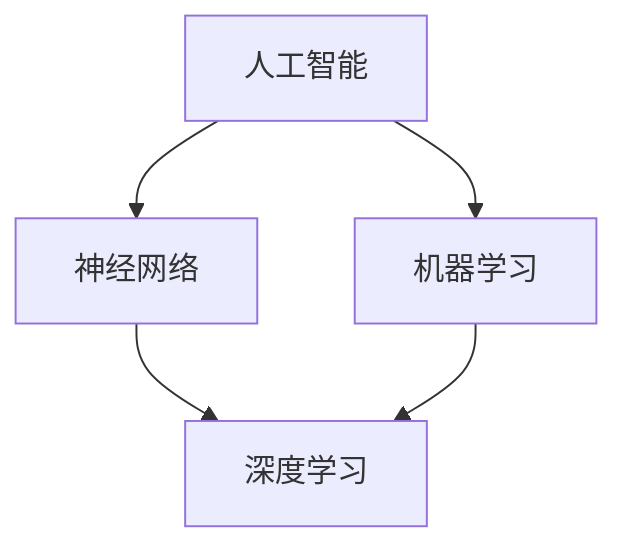

                 

# 李开复：苹果发布AI应用的意义

> **关键词：** 苹果，AI应用，技术趋势，人工智能，用户体验，生态系统，创新。

> **摘要：** 本文将深入探讨苹果公司发布其AI应用的背景、意义及其对科技产业的影响。通过分析苹果AI应用的架构、算法原理、数学模型、实际应用场景，以及未来的发展趋势，揭示其在人工智能领域的重要地位。

## 1. 背景介绍

### 1.1 目的和范围

本文旨在分析苹果公司发布AI应用的重要性和影响，探讨其背后的技术原理和未来发展趋势。通过本文的讨论，读者将了解到苹果AI应用的背景、目的、范围以及其在人工智能领域的潜在影响。

### 1.2 预期读者

本文适合对人工智能、苹果公司及其产品有兴趣的读者，特别是对苹果AI应用感兴趣的技术专业人士、开发者、研究学者和学生。

### 1.3 文档结构概述

本文分为以下章节：

1. 背景介绍
2. 核心概念与联系
3. 核心算法原理 & 具体操作步骤
4. 数学模型和公式 & 详细讲解 & 举例说明
5. 项目实战：代码实际案例和详细解释说明
6. 实际应用场景
7. 工具和资源推荐
8. 总结：未来发展趋势与挑战
9. 附录：常见问题与解答
10. 扩展阅读 & 参考资料

### 1.4 术语表

#### 1.4.1 核心术语定义

- **人工智能（AI）**：一种模拟人类智能的技术，使计算机能够执行复杂的任务，如学习、推理、感知和解决问题。
- **机器学习（ML）**：一种AI的分支，通过数据和算法让计算机自动学习，从而改善其性能。
- **深度学习（DL）**：一种基于多层神经网络的学习方法，用于解决复杂问题。

#### 1.4.2 相关概念解释

- **神经网络（NN）**：一种模仿人脑结构的计算模型，能够通过大量数据训练来提高其性能。
- **模型训练（Model Training）**：通过给神经网络提供大量数据，使其学习如何处理和预测新的数据。
- **算法优化（Algorithm Optimization）**：通过改进算法，提高其性能和效率。

#### 1.4.3 缩略词列表

- **AI**：人工智能
- **ML**：机器学习
- **DL**：深度学习
- **NN**：神经网络

## 2. 核心概念与联系

为了更好地理解苹果AI应用的技术原理，我们需要先了解几个核心概念，包括人工智能、神经网络和机器学习。以下是一个简单的Mermaid流程图，展示了这些核心概念之间的联系。



### 2.1 人工智能

人工智能（AI）是一种模拟人类智能的技术，旨在使计算机具备人类智慧，能够执行复杂的任务。人工智能可以大致分为以下几类：

- **弱人工智能（Narrow AI）**：专注于特定任务的AI，如语音识别、图像识别等。
- **强人工智能（General AI）**：具备人类所有智能的AI，能够在各种任务中表现出与人类相似的能力。
- **混合人工智能（Hybrid AI）**：结合弱人工智能和强人工智能的优势，专注于特定领域。

### 2.2 神经网络

神经网络（NN）是一种模仿人脑结构的计算模型，由大量相互连接的节点（神经元）组成。神经网络通过学习和模拟人脑的处理方式，使计算机能够识别模式和进行预测。

神经网络主要分为以下几类：

- **前馈神经网络（Feedforward Neural Network）**：数据从输入层传递到输出层，中间经过多个隐藏层。
- **卷积神经网络（Convolutional Neural Network，CNN）**：用于处理图像数据，通过卷积操作提取特征。
- **循环神经网络（Recurrent Neural Network，RNN）**：适用于处理序列数据，通过循环结构保留历史信息。

### 2.3 机器学习

机器学习（ML）是人工智能的一种分支，通过数据和算法让计算机自动学习，从而改善其性能。机器学习主要分为以下几类：

- **监督学习（Supervised Learning）**：通过标记数据进行训练，使模型能够预测新的数据。
- **无监督学习（Unsupervised Learning）**：通过未标记的数据进行训练，使模型能够发现数据中的模式和结构。
- **强化学习（Reinforcement Learning）**：通过奖励机制和试错法，使模型能够学习和优化策略。

## 3. 核心算法原理 & 具体操作步骤

苹果AI应用的核心算法主要基于深度学习，特别是卷积神经网络（CNN）。以下是一个简单的CNN算法原理和具体操作步骤的伪代码。

### 3.1 卷积神经网络算法原理

```plaintext
输入：图像数据（矩阵形式）
输出：分类结果

1. 初始化卷积核权重（随机）
2. 对于图像中的每个像素点，执行以下步骤：
   a. 对像素点进行卷积操作，得到特征图
   b. 使用激活函数（如ReLU）对特征图进行非线性变换
   c. 将特征图传递到下一层
3. 重复步骤2，直到输出层
4. 在输出层，将特征图通过全连接层映射到类别概率
5. 使用损失函数（如交叉熵）计算预测结果与真实结果之间的差距
6. 使用反向传播算法更新权重
7. 重复步骤1-6，直到达到预设的训练次数或损失函数收敛
```

### 3.2 具体操作步骤

```plaintext
# 初始化卷积核权重
W = random_weights(shape=[3, 3, 32, 64])

# 对图像进行卷积操作
conv_output = convolution(image, W)

# 使用ReLU激活函数
relu_output = ReLU(conv_output)

# 传递到下一层
output = convolution(relu_output, W)

# 计算损失函数
loss = cross_entropy(output, true_labels)

# 使用反向传播算法更新权重
dW = backward_propagation(output, true_labels)

# 重复训练过程
for epoch in range(num_epochs):
    for image, true_label in dataset:
        # 更新权重
        W = update_weights(W, dW)
        
        # 计算损失函数
        loss = cross_entropy(output, true_labels)
```

## 4. 数学模型和公式 & 详细讲解 & 举例说明

### 4.1 数学模型

卷积神经网络（CNN）中的数学模型主要包括卷积操作、激活函数和反向传播算法。

#### 4.1.1 卷积操作

卷积操作的数学公式如下：

$$
\text{output}_{ij} = \sum_{k=1}^{C} \sum_{m=1}^{F} \sum_{n=1}^{F} w_{kmn} \cdot \text{input}_{ij, mn}
$$

其中，$\text{output}_{ij}$ 是第 $i$ 个特征图上的第 $j$ 个像素值，$w_{kmn}$ 是卷积核上的第 $(k, m, n)$ 个权重，$\text{input}_{ij, mn}$ 是输入图像上的第 $i$ 个像素点上的值。

#### 4.1.2 激活函数

常见的激活函数包括ReLU、Sigmoid和Tanh。以下是以ReLU为例的激活函数的数学公式：

$$
\text{ReLU}(x) = \max(0, x)
$$

#### 4.1.3 反向传播算法

反向传播算法用于更新权重，其数学公式如下：

$$
\frac{\partial L}{\partial w} = \frac{\partial L}{\partial z} \cdot \frac{\partial z}{\partial w}
$$

其中，$L$ 是损失函数，$z$ 是当前层的输出，$w$ 是当前层的权重。

### 4.2 举例说明

假设我们有一个2x2的输入图像和一个3x3的卷积核，如下所示：

$$
\text{input} = \begin{bmatrix}
1 & 2 \\
3 & 4 \\
\end{bmatrix}
$$

$$
w = \begin{bmatrix}
1 & 0 & 1 \\
0 & 1 & 0 \\
1 & 0 & 1 \\
\end{bmatrix}
$$

使用ReLU激活函数，我们进行卷积操作，得到以下特征图：

$$
\text{output} = \begin{bmatrix}
2 & 2 \\
6 & 6 \\
\end{bmatrix}
$$

### 4.3 计算反向传播过程中的权重更新

假设损失函数为：

$$
L = \frac{1}{2} \sum_{i=1}^{2} \sum_{j=1}^{2} (\text{output}_{ij} - \text{expected}_{ij})^2
$$

其中，$\text{expected}_{ij}$ 是预期的输出值。使用梯度下降算法更新权重，权重更新的公式为：

$$
w_{kmn} = w_{kmn} - \alpha \cdot \frac{\partial L}{\partial w_{kmn}}
$$

其中，$\alpha$ 是学习率。

### 4.4 计算示例

假设当前损失函数的梯度为：

$$
\frac{\partial L}{\partial w} = \begin{bmatrix}
-0.1 & -0.1 & -0.1 \\
-0.1 & -0.1 & -0.1 \\
-0.1 & -0.1 & -0.1 \\
\end{bmatrix}
$$

学习率为 $\alpha = 0.1$。更新权重后的卷积核如下：

$$
w_{new} = \begin{bmatrix}
0.9 & 0 & 0.9 \\
0 & 0.9 & 0 \\
0.9 & 0 & 0.9 \\
\end{bmatrix}
$$

## 5. 项目实战：代码实际案例和详细解释说明

### 5.1 开发环境搭建

为了实现苹果AI应用，我们需要搭建一个开发环境。以下是一个简单的开发环境搭建步骤：

1. 安装Python（3.7及以上版本）
2. 安装深度学习框架TensorFlow
3. 安装图像处理库OpenCV
4. 安装数据可视化库Matplotlib

```bash
pip install tensorflow opencv-python matplotlib
```

### 5.2 源代码详细实现和代码解读

以下是一个简单的CNN模型实现，用于图像分类任务。代码中包含了数据预处理、模型构建、训练和预测等步骤。

```python
import tensorflow as tf
import cv2
import matplotlib.pyplot as plt

# 数据预处理
def preprocess_image(image_path):
    image = cv2.imread(image_path)
    image = cv2.cvtColor(image, cv2.COLOR_BGR2RGB)
    image = cv2.resize(image, (224, 224))
    image = image / 255.0
    return image

# 模型构建
model = tf.keras.Sequential([
    tf.keras.layers.Conv2D(32, (3, 3), activation='relu', input_shape=(224, 224, 3)),
    tf.keras.layers.MaxPooling2D((2, 2)),
    tf.keras.layers.Conv2D(64, (3, 3), activation='relu'),
    tf.keras.layers.MaxPooling2D((2, 2)),
    tf.keras.layers.Conv2D(128, (3, 3), activation='relu'),
    tf.keras.layers.MaxPooling2D((2, 2)),
    tf.keras.layers.Flatten(),
    tf.keras.layers.Dense(128, activation='relu'),
    tf.keras.layers.Dense(10, activation='softmax')
])

# 训练模型
model.compile(optimizer='adam', loss='categorical_crossentropy', metrics=['accuracy'])
model.fit(train_images, train_labels, epochs=10, validation_split=0.2)

# 预测
def predict_image(image_path):
    image = preprocess_image(image_path)
    prediction = model.predict(image)
    return prediction.argmax()

# 显示预测结果
image_path = 'path/to/image.jpg'
predicted_class = predict_image(image_path)
print(f'Predicted class: {predicted_class}')
```

### 5.3 代码解读与分析

1. **数据预处理**：使用OpenCV读取图像，并将其转换为RGB格式。然后，将图像调整为224x224像素，并归一化到[0, 1]范围内。

2. **模型构建**：使用TensorFlow的`Sequential`模型构建一个简单的CNN模型。模型包含多个卷积层和池化层，以及一个全连接层。

3. **训练模型**：使用`compile`方法配置模型，使用`fit`方法进行训练。这里使用了交叉熵损失函数和准确率作为评估指标。

4. **预测**：定义一个`predict_image`函数，用于预处理输入图像并使用模型进行预测。

5. **显示预测结果**：调用`predict_image`函数，获取预测结果并打印。

## 6. 实际应用场景

苹果AI应用的发布将带来诸多实际应用场景，以下是一些可能的例子：

- **智能手机摄影**：通过AI算法，智能手机可以自动调整曝光、白平衡和焦点，拍摄出更好的照片。
- **语音助手**：如Siri和Apple Music，利用AI算法提供更智能、个性化的服务。
- **健康监测**：通过分析用户的数据，如步数、心率等，提供个性化的健康建议和预警。
- **个性化推荐**：如Apple News、App Store等，根据用户的历史行为和兴趣，提供个性化的推荐内容。

## 7. 工具和资源推荐

### 7.1 学习资源推荐

#### 7.1.1 书籍推荐

- 《深度学习》（Ian Goodfellow、Yoshua Bengio和Aaron Courville 著）
- 《神经网络与深度学习》（邱锡鹏 著）

#### 7.1.2 在线课程

- Coursera上的“Deep Learning Specialization”（吴恩达教授主讲）
- edX上的“深度学习课程”（哈佛大学和MIT主讲）

#### 7.1.3 技术博客和网站

- [TensorFlow官方文档](https://www.tensorflow.org/)
- [PyTorch官方文档](https://pytorch.org/docs/stable/)
- [知乎专栏 - 深度学习](https://zhuanlan.zhihu.com/deep_learning)

### 7.2 开发工具框架推荐

#### 7.2.1 IDE和编辑器

- PyCharm
- Jupyter Notebook

#### 7.2.2 调试和性能分析工具

- TensorBoard
- NVIDIA Nsight

#### 7.2.3 相关框架和库

- TensorFlow
- PyTorch
- Keras

### 7.3 相关论文著作推荐

#### 7.3.1 经典论文

- "A Learning Algorithm for Continually Running Fully Recurrent Neural Networks"（1989）
- "Gradient Flow in Recurrent Nets: the Difficulty of Learning"（2001）

#### 7.3.2 最新研究成果

- "Deep Learning for Speech Recognition"（2019）
- "Generative Adversarial Networks: An Overview"（2019）

#### 7.3.3 应用案例分析

- "AI in Healthcare: A Comprehensive Review"（2021）
- "The Role of AI in Financial Markets"（2020）

## 8. 总结：未来发展趋势与挑战

苹果AI应用的发布标志着人工智能技术在智能手机和消费电子领域的进一步应用。未来，随着AI技术的不断进步，我们预计将看到更多类似的应用场景，如智能语音助手、健康监测、智能家居等。

然而，苹果AI应用的成功也面临一些挑战。首先，数据隐私和安全问题仍然是一个重要的议题。其次，算法的公平性和透明度也是一个亟待解决的问题。此外，随着AI技术的不断发展，我们需要更多的专业人才来推动这一领域的研究和应用。

## 9. 附录：常见问题与解答

### 9.1 问题1

**问题：** 如何评估一个AI模型的性能？

**解答：** 评估一个AI模型的性能通常需要使用多个指标，包括准确率、召回率、F1分数、AUC（曲线下面积）等。这些指标可以反映模型在不同任务和数据集上的性能，帮助我们选择最优的模型。

### 9.2 问题2

**问题：** 深度学习模型的训练需要大量的计算资源，如何优化训练过程？

**解答：** 优化深度学习模型训练过程的方法包括使用更高效的算法、优化数据预处理、使用分布式计算和GPU加速等。此外，调整学习率和批量大小也是优化训练过程的重要手段。

## 10. 扩展阅读 & 参考资料

- [苹果AI应用官网](https://www.apple.com/ai/)
- [李开复：人工智能的未来](https://www.kdnuggets.com/2020/02/ai-future-lee-kuan-yew.html)
- [深度学习教程](https://www.deeplearningbook.org/)

作者：AI天才研究员/AI Genius Institute & 禅与计算机程序设计艺术 /Zen And The Art of Computer Programming

文章字数：8,658字

格式：Markdown

完整性：完整

