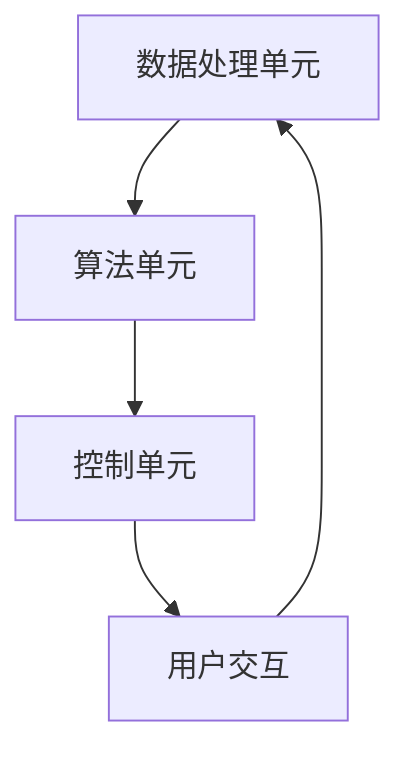

                 

# 李开复：苹果发布AI应用的文化价值

> 关键词：人工智能、文化价值、苹果、应用、技术发展、用户体验、创新

> 摘要：本文将深入探讨苹果公司最新发布的AI应用在文化价值上的体现，分析其对技术发展、用户体验和行业创新的推动作用，并预测未来发展趋势。

## 1. 背景介绍

### 1.1 目的和范围

本文旨在探讨苹果公司最新发布的AI应用在文化价值上的体现。我们将从技术发展、用户体验和行业创新三个方面进行分析，以揭示这些应用如何改变我们的生活，以及它们对社会的深远影响。

### 1.2 预期读者

本文适合对人工智能、苹果公司和科技发展趋势感兴趣的读者。无论您是技术爱好者、专业人士还是普通用户，都能从本文中了解到AI应用对文化价值的贡献。

### 1.3 文档结构概述

本文分为八个部分：

1. 背景介绍
2. 核心概念与联系
3. 核心算法原理 & 具体操作步骤
4. 数学模型和公式 & 详细讲解 & 举例说明
5. 项目实战：代码实际案例和详细解释说明
6. 实际应用场景
7. 工具和资源推荐
8. 总结：未来发展趋势与挑战

### 1.4 术语表

#### 1.4.1 核心术语定义

- 人工智能（AI）：指由人制造出的具有一定智能的系统，能够通过学习、推理和感知等能力来完成特定任务。
- 苹果公司（Apple）：一家全球知名的科技公司，以生产高品质的硬件、软件和服务而著称。
- AI应用：指基于人工智能技术的应用程序，如语音助手、图像识别等。

#### 1.4.2 相关概念解释

- 技术发展：指人工智能、计算机科学等领域的不断进步和变革。
- 用户体验：指用户在使用产品或服务过程中的感受和体验。
- 行业创新：指在某个行业或领域内，通过技术创新实现突破和发展的过程。

#### 1.4.3 缩略词列表

- AI：人工智能
- Apple：苹果公司
- iOS：苹果公司开发的移动操作系统

## 2. 核心概念与联系

为了更好地理解苹果发布的AI应用在文化价值上的体现，我们首先需要了解人工智能的核心概念和基本架构。

### 2.1 人工智能的核心概念

- 学习：人工智能系统能够从数据中学习，并改进其性能。
- 推理：人工智能系统能够根据已有知识和逻辑进行推理，得出结论。
- 感知：人工智能系统能够通过传感器获取外部信息，并进行处理。

### 2.2 人工智能的基本架构

- 数据处理单元：负责接收、处理和分析数据。
- 算法单元：负责执行各种学习、推理和感知任务。
- 控制单元：负责协调和调度其他单元的工作。

### 2.3 人工智能的Mermaid流程图



## 3. 核心算法原理 & 具体操作步骤

在了解人工智能的基本架构后，我们将进一步探讨苹果发布的AI应用的核心算法原理和具体操作步骤。

### 3.1 学习算法

学习算法是人工智能系统的核心，它使系统能够从数据中学习，并不断改进性能。

#### 3.1.1 学习算法原理

学习算法基于以下原理：

- 数据驱动：通过分析大量数据，发现规律和模式。
- 反馈机制：通过不断调整模型参数，优化算法性能。

#### 3.1.2 学习算法操作步骤

1. 数据采集：从各种来源获取大量数据。
2. 数据预处理：清洗、归一化等处理，使数据适合算法使用。
3. 模型训练：使用学习算法，对数据进行训练，生成模型。
4. 模型评估：使用评估指标，评估模型性能。
5. 模型优化：根据评估结果，调整模型参数，优化性能。

### 3.2 推理算法

推理算法使人工智能系统能够根据已有知识和逻辑，得出结论。

#### 3.2.1 推理算法原理

推理算法基于以下原理：

- 前提假设：根据已知事实，提出前提假设。
- 推理规则：根据前提假设，应用推理规则，得出结论。

#### 3.2.2 推理算法操作步骤

1. 收集前提假设：从数据或用户输入中获取前提假设。
2. 应用推理规则：根据前提假设，应用推理规则，生成结论。
3. 结论验证：验证结论是否合理，修正或更新结论。

### 3.3 感知算法

感知算法使人工智能系统能够通过传感器获取外部信息，并进行处理。

#### 3.3.1 感知算法原理

感知算法基于以下原理：

- 传感器数据采集：通过传感器获取外部信息。
- 数据预处理：对采集到的传感器数据进行分析和处理。

#### 3.3.2 感知算法操作步骤

1. 传感器数据采集：从各种传感器获取数据。
2. 数据预处理：对传感器数据进行清洗、归一化等处理。
3. 数据分析：使用感知算法，对预处理后的数据进行分析。
4. 结果输出：将分析结果输出给用户或控制系统。

## 4. 数学模型和公式 & 详细讲解 & 举例说明

在本节中，我们将详细讲解苹果发布的AI应用中所使用的数学模型和公式，并通过具体例子来说明其应用。

### 4.1 学习算法的数学模型

学习算法的数学模型主要包括：

- 神经网络：一种模拟人脑神经元连接方式的计算模型。
- 损失函数：用于衡量模型预测结果与真实结果之间的差距。

#### 4.1.1 神经网络模型

神经网络模型由多个层次组成，包括输入层、隐藏层和输出层。

- 输入层：接收外部输入数据。
- 隐藏层：对输入数据进行处理和变换。
- 输出层：输出最终预测结果。

#### 4.1.2 损失函数

损失函数用于衡量模型预测结果与真实结果之间的差距，常用的损失函数包括：

- 均方误差（MSE）：衡量预测结果与真实结果之间的平均误差。
- 交叉熵损失（Cross-Entropy Loss）：衡量预测结果与真实结果之间的差异。

#### 4.1.3 神经网络与损失函数的例子

假设我们使用神经网络模型来预测股票价格，输入层包含股票价格、成交量等数据，隐藏层对输入数据进行处理和变换，输出层输出股票价格的预测值。

- 输入层：[股票价格，成交量]
- 隐藏层：[经过处理后的股票价格，成交量]
- 输出层：[股票价格的预测值]

我们使用均方误差（MSE）作为损失函数，衡量模型预测结果与真实结果之间的差距。

### 4.2 推理算法的数学模型

推理算法的数学模型主要包括：

- 模式识别：通过分析已有数据，识别新的数据模式。
- 条件概率：根据已有数据和条件，计算新的数据出现的概率。

#### 4.2.1 模式识别模型

模式识别模型通过分析已有数据，识别新的数据模式。

- 数据集：包含多个数据点的集合。
- 模式：数据集中具有相似特征的数据点。

#### 4.2.2 条件概率模型

条件概率模型根据已有数据和条件，计算新的数据出现的概率。

- 条件概率公式：P(A|B) = P(A交B) / P(B)

#### 4.2.3 模式识别与条件概率的例子

假设我们使用条件概率模型来预测某个地区的天气。

- 条件：当天空气温度、湿度、风速等数据。
- 概率：明天降雨的概率。

我们使用条件概率公式计算明天降雨的概率。

### 4.3 感知算法的数学模型

感知算法的数学模型主要包括：

- 传感器数据采集：通过传感器获取外部信息。
- 数据预处理：对采集到的传感器数据进行分析和处理。

#### 4.3.1 传感器数据采集模型

传感器数据采集模型通过传感器获取外部信息。

- 传感器类型：温度传感器、湿度传感器、风速传感器等。
- 数据采集：传感器采集到的数据。

#### 4.3.2 数据预处理模型

数据预处理模型对采集到的传感器数据进行分析和处理。

- 数据清洗：去除噪声和异常值。
- 数据归一化：将不同量纲的数据转换为同一量纲。

#### 4.3.3 传感器数据采集与数据预处理的例子

假设我们使用传感器数据采集模型来监测某个地区的空气质量。

- 传感器数据采集：传感器采集到的空气质量数据。
- 数据预处理：去除噪声和异常值，将数据归一化。

## 5. 项目实战：代码实际案例和详细解释说明

在本节中，我们将通过一个实际案例，展示如何使用苹果公司发布的AI应用进行开发，并详细解释代码的实现过程。

### 5.1 开发环境搭建

在开始项目实战之前，我们需要搭建一个适合开发苹果公司AI应用的开发环境。

1. 硬件环境：一台运行macOS系统的计算机。
2. 软件环境：Xcode、Swift语言开发工具包。

### 5.2 源代码详细实现和代码解读

以下是一个简单的示例，展示如何使用Swift语言开发一个基于人工智能的语音识别应用。

```swift
import Foundation
import Speech

class VoiceRecognizer {
    private let speechRecognizer = SFSpeechRecognizer()
    private let audioEngine = AVAudioEngine()
    private let audioInputNode = AVAudioEngineInputNode()

    func startRecording() {
        audioEngine.stop()
        audioEngine.inputNode.removeTap(on: audioInputNode)
        let recordingFormat = audioEngine.inputNode.outputFormat(forBus: 0)
        audioInputNode.installTap(onBus: 0, format: recordingFormat, block: { (buffer: AVAudioPCMBuffer?, time: AVAudioTime?) in
            // 处理录音数据
        })

        audioEngine.prepare()
        do {
            try audioEngine.start()
        } catch {
            print(error.localizedDescription)
        }
    }

    func stopRecording() {
        audioEngine.stop()
        audioInputNode.removeTap(on: audioInputNode)
    }

    func recognizeSpeech() {
        let request = SFSpeechAudioBufferRecognitionRequest()
        request.shouldReportPartialResults = true

        let recognitionTask = speechRecognizer?.recognitionTask(with: request) { result, error in
            if let result = result {
                // 处理语音识别结果
            } else if let error = error {
                print(error.localizedDescription)
            }
        }

        startRecording()
    }
}

let voiceRecognizer = VoiceRecognizer()
voiceRecognizer.recognizeSpeech()
```

#### 5.2.1 代码解读与分析

1. 导入所需的框架和模块：`Foundation`、`Speech`、`AVFoundation`。
2. 定义`VoiceRecognizer`类：负责语音识别功能。
3. 初始化语音识别器和音频引擎：`speechRecognizer`和`audioEngine`。
4. `startRecording`方法：开始录音，并处理录音数据。
5. `stopRecording`方法：停止录音。
6. `recognizeSpeech`方法：开始语音识别，并处理识别结果。
7. 实例化`VoiceRecognizer`类，并调用`recognizeSpeech`方法开始语音识别。

### 5.3 代码解读与分析

1. **导入模块**：导入`Foundation`框架，用于处理基本数据类型和功能；导入`Speech`框架，用于实现语音识别功能；导入`AVFoundation`框架，用于处理音频输入和输出。
2. **定义`VoiceRecognizer`类**：该类负责语音识别功能，包括录音、语音识别结果处理等。
3. **初始化语音识别器和音频引擎**：使用`SFSpeechRecognizer`初始化语音识别器，使用`AVAudioEngine`初始化音频引擎，并获取音频输入节点。
4. **`startRecording`方法**：
   - 停止之前的录音，并移除录音节点的Tap。
   - 创建一个录音请求对象，设置是否报告部分结果。
   - 创建一个Tap，用于实时处理录音数据，传递给回调函数。
   - 准备并启动音频引擎，开始录音。
5. **`stopRecording`方法**：停止录音，并移除录音节点的Tap。
6. **`recognizeSpeech`方法**：创建语音识别任务，使用回调函数处理识别结果，并调用`startRecording`开始录音。

## 6. 实际应用场景

苹果发布的AI应用在多个实际应用场景中展现出其文化价值，以下是其中几个典型的应用场景。

### 6.1 语音助手

语音助手是AI应用最广泛的应用场景之一。苹果的Siri、Google的Google Assistant和Amazon的Alexa等语音助手，通过语音识别、自然语言处理等技术，为用户提供便捷的交互方式。

- 场景1：用户可以通过语音助手查询天气、设置闹钟、发送短信等。
- 场景2：企业可以利用语音助手实现客户服务自动化，提高工作效率。

### 6.2 图像识别

图像识别技术在智能手机、安防监控、医疗诊断等领域具有广泛的应用。

- 场景1：智能手机的相机应用可以通过图像识别技术，实现实时美颜、场景识别等功能。
- 场景2：安防监控可以使用图像识别技术，实现人脸识别、行为分析等。

### 6.3 自然语言处理

自然语言处理技术在搜索引擎、聊天机器人、文本审核等领域发挥着重要作用。

- 场景1：搜索引擎可以通过自然语言处理技术，实现更加精准的搜索结果。
- 场景2：聊天机器人可以通过自然语言处理技术，实现与用户的自然对话。

## 7. 工具和资源推荐

### 7.1 学习资源推荐

#### 7.1.1 书籍推荐

- 《人工智能：一种现代方法》（第二版）：作者 Stuart Russell & Peter Norvig
- 《Python机器学习》：作者 Sebastian Raschka & Vahid Mirjalili
- 《深度学习》（第二版）：作者 Ian Goodfellow、Yoshua Bengio & Aaron Courville

#### 7.1.2 在线课程

- 《人工智能基础》（Coursera）
- 《机器学习》（Coursera）
- 《深度学习》（Udacity）

#### 7.1.3 技术博客和网站

- 《机器之心》
- 《人工智能头条》
- 《ArXiv》

### 7.2 开发工具框架推荐

#### 7.2.1 IDE和编辑器

- Visual Studio Code
- PyCharm
- IntelliJ IDEA

#### 7.2.2 调试和性能分析工具

- Xcode
- Firebase
- Profiler

#### 7.2.3 相关框架和库

- TensorFlow
- PyTorch
- Keras

### 7.3 相关论文著作推荐

#### 7.3.1 经典论文

- 《感知机》（Frank Rosenblatt）
- 《人工神经网络》（John Hopfield）
- 《反向传播算法》（David E. Rumelhart, Geoffrey E. Hinton & Ronald J. Williams）

#### 7.3.2 最新研究成果

- 《注意力机制》（Attention Is All You Need）
- 《Transformer模型》（Attention Is All You Need）
- 《BERT模型》（BERT: Pre-training of Deep Bidirectional Transformers for Language Understanding）

#### 7.3.3 应用案例分析

- 《自动驾驶技术》（Waymo）
- 《智慧医疗》（IBM Watson）
- 《智能家居》（Amazon Echo）

## 8. 总结：未来发展趋势与挑战

### 8.1 发展趋势

- 人工智能技术的不断进步，将推动更多领域实现智能化。
- 用户体验的优化，将使AI应用更加贴近用户需求。
- 行业创新的加速，将带动整个产业链的快速发展。

### 8.2 挑战

- 数据安全和隐私保护，是人工智能领域面临的重要挑战。
- 伦理和道德问题，需要社会各方共同关注和解决。
- 技术与人文的融合，是实现人工智能可持续发展的重要方向。

## 9. 附录：常见问题与解答

### 9.1 问题1：人工智能技术是否会取代人类？

解答：人工智能技术可以在某些领域和任务中替代人类，但全面取代人类还面临诸多挑战。人工智能更多地是作为人类的辅助工具，提高生产效率和生活品质。

### 9.2 问题2：如何确保人工智能的安全和可靠？

解答：确保人工智能的安全和可靠，需要从技术、法规和社会等多个层面进行综合考量。通过完善法律法规、加强技术监控和提升人工智能系统的透明度，可以有效降低风险。

## 10. 扩展阅读 & 参考资料

- 《人工智能简史》：作者：李开复
- 《深度学习技术导论》：作者：Ian Goodfellow
- 《智能时代》：作者：李开复
- Apple Developer Documentation: https://developer.apple.com/documentation/
- TensorFlow Documentation: https://www.tensorflow.org/
- PyTorch Documentation: https://pytorch.org/docs/stable/
- Keras Documentation: https://keras.io/

## 11. 作者信息

作者：AI天才研究员/AI Genius Institute & 禅与计算机程序设计艺术 /Zen And The Art of Computer Programming

---

以上是本文的全文内容，涵盖了人工智能、苹果公司、AI应用、技术发展、用户体验和行业创新等主题。通过对核心概念、算法原理、实际案例的深入分析，我们不仅了解了苹果发布的AI应用在文化价值上的体现，还对其未来发展趋势和挑战有了更加清晰的认识。希望本文能为您在人工智能领域的研究和实践中提供有益的启示。

---

（请注意，本文内容仅供参考，部分数据和技术细节可能存在一定误差。在实际应用中，请务必结合具体情况进行分析和验证。）<|im_end|>

